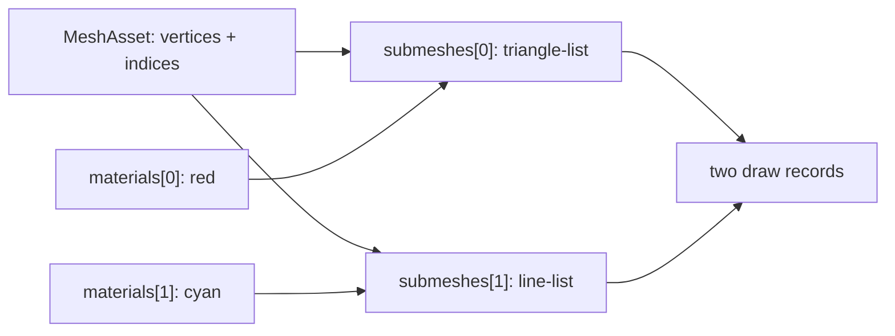

# Multi-material MeshAsset

This demo is the smallest public recipe for drawing multiple primitives from one
`MeshAsset`. A single index buffer carries a filled quad and two nested wire
loops; `MeshRenderer.materials[i]` selects the material for `submeshes[i]`.

> [!IMPORTANT]
> The material array is positional, not a material-name lookup. A missing or
> duplicated slot is deliberately a falsifier: the renderer must reject a
> count mismatch, and the cyan line pass must disappear when both slots use red.

## Data flow



| Primitive | Range | Topology | Slot | Expected pixels |
| --- | ---: | --- | ---: | ---: |
| Filled quad | 6 indices | `triangle-list` | `materials[0]` | red |
| Nested wire loops | 16 indices | `line-list` | `materials[1]` | cyan |

## Run the gates

```bash
pnpm --filter @forgeax/hello-multi-material typecheck
pnpm --filter @forgeax/hello-multi-material build
pnpm --filter @forgeax/hello-multi-material smoke
```

The Dawn smoke renders 300 frames and requires both red and cyan readback
counts to stay above zero. `FALSIFY=truncate-materials` and
`FALSIFY=duplicate-material` exercise the two load-bearing failure modes.
