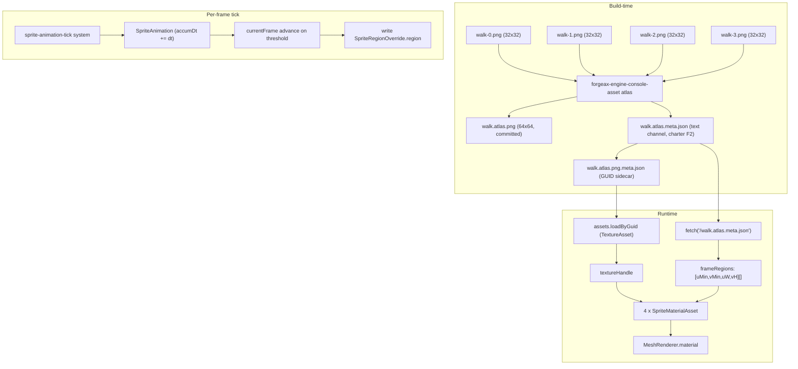

# hello-sprite-atlas

> **1 atlas / 10000 independent sprite entities / 1 instanced drawIndexed** -- the canonical AI-user spawn shape (Transform + MeshFilter + MeshRenderer + SpriteRegionOverride per entity) collapsed transparently into a single GPU draw by the record-stage fold operator (feat-20260622-chunk-gpu-instancing-sprite-tilemap M1). No `Instances` component on any entity -- AC-03 transparent abstraction (charter P4).

## 4-step recipe (charter F1 progressive disclosure)

```ts
// Step 1: createApp(canvas, opts) -- one-screen takeoff
const appRes = await createApp(target, { clearColor: [0.07, 0.07, 0.09, 1] });

// Step 2: add the sprite animation tick system to the schedule
world.addSystem({
  name: 'sprite-animation-tick',
  after: ['input-frame-start-scan'],
  queries: [],
  fn: () => { spriteAnimationTickSystem(world); },
});

// Step 3: load atlas texture + sidecar (walk.atlas.meta.json)
const texHandleRes = await assets.loadByGuid<TextureAsset>(atlasGuid);
const sidecar = await (await fetch('/walk.atlas.meta.json')).json();

// Step 4: spawn host entity with SpriteAnimation + Instances
world.spawn(
  { component: Transform, data: { /* ... */ } },
  { component: MeshFilter, data: { assetHandle: HANDLE_QUAD } },
  { component: MeshRenderer, data: { material: materialHandles[0] } },
  { component: Instances, data: { transforms: instanceTransforms } },
  { component: SpriteAnimation, data: {
    frameCount: 4, frameDuration: 0.2, currentFrame: 0,
    accumDt: 0, regions: flatRegions,
    playbackMode: SPRITE_PLAYBACK_MODE_LOOP,
  }},
  { component: SpriteRegionOverride, data: { region: new Float32Array([0,0,0.5,0.5]) } },
);

// Start the rAF loop
app.start();
```

## Component field tables

### SpriteAnimation (6 fields)

| Field | Type | Purpose |
|:--|:--|:--|
| `frameCount` | `u32` | Total frames in the animation (e.g. 4 for a 2x2 walk cycle) |
| `frameDuration` | `f32` | Seconds per frame (e.g. 0.2 = 5 fps) |
| `currentFrame` | `u32` | Frame index [0, frameCount); advanced by tick system each `frameDuration` seconds |
| `accumDt` | `f32` | Accumulated delta-time since last frame advance; reset to 0 on advance |
| `regions` | `array<f32>` | Flat Float32Array of frameCount * 4 floats: [uMin0, vMin0, uW0, vH0, uMin1, ...] |
| `playbackMode` | `u32` | `SPRITE_PLAYBACK_MODE_LOOP (0)` wraps around; `SPRITE_PLAYBACK_MODE_CLAMP (1)` stops at last frame |

### SpriteRegionOverride (1 field)

| Field | Type | Purpose |
|:--|:--|:--|
| `region` | `array<f32, 4>` | Per-entity UV region [uMin, vMin, uW, vH]; written by tick system each frame |

### Instances

| Field | Type | Purpose |
|:--|:--|:--|
| `transforms` | `array<f32>` | Flat Float32Array of N * 16 floats (column-major mat4); 100 in this demo, 10x10 grid |

## Error scenarios (charter P3 structured failure)

| Scenario | Error class | `.code` | `.hint` | Recovery |
|:--|:--|:--|:--|:--|
| Missing `<canvas id="app">` | `Error` (throw) | -- | `missing <canvas id="app"> in index.html` | Fix HTML |
| `createApp` returns `!ok` | `AppError` | `app-error` | App-level failure | `reportAppError(err)` |
| `renderer.ready` fails | `RhiError` | RHI-specific | `.hint` on error | Log + return |
| `ATLAS_GUID` parse fails | `PackError` | `guid-parse-failed` | `.hint` on error | Log + return |
| `loadByGuid` fails | `AssetError` | `asset-not-found` | `.hint` on error | Log error + return (fail-fast) |
| Sidecar fetch fails | `TypeError` / HTTP error | -- | `sidecar fetch error` | Log error + return (fail-fast) |
| Sampler/material registration fails | `AssetError` | `asset-not-registered` | `.hint` on error | Log + return |
| `spriteAnimationTickSystem` rejects | `EcsError` | `sprite-animation-invalid` | `.{code, expected, hint}` | `console.warn` with structured fields |

## Atlas topology (Mermaid)



## Run locally

```bash
pnpm --filter @forgeax/hello-sprite-atlas dev      # vite dev server -> http://localhost:5194
pnpm --filter @forgeax/hello-sprite-atlas build    # vite production build
pnpm --filter @forgeax/hello-sprite-atlas smoke    # dawn-node 300 frames + pixel readback (eps<=0.05)
```

## Rebuild atlas from sources

The committed `walk.atlas.png` and `walk.atlas.meta.json` were generated by the
`forgeax-engine-console-asset atlas` CLI from the four 32x32 source frames in `assets/frames/`.
To regenerate them (e.g. after adding or changing source frames):

```bash
# From the repository root:
pnpm forgeax-engine-console-asset atlas \
  --input "apps/hello/sprite-atlas/assets/frames/*.png" \
  --name walk \
  --output "apps/hello/sprite-atlas/assets" \
  --maxSize 4096

# Then force-add the binary outputs (gitignore bypasses *.png by default):
git add -f apps/hello/sprite-atlas/assets/walk.atlas.png
git add    apps/hello/sprite-atlas/assets/walk.atlas.meta.json
git add    apps/hello/sprite-atlas/assets/walk.atlas.png.meta.json
```

The `walk.atlas.meta.json` sidecar is the charter F2 text channel — the demo fetches it at
runtime (`fetch('/walk.atlas.meta.json')`) to discover per-frame UV regions without hard-coding
them in source. After regenerating the atlas, also regenerate the smoke reference PNG:

```bash
pnpm --filter @forgeax/hello-sprite-atlas smoke    # writes reference PNG + exits 1 on first run
git add -f apps/hello/sprite-atlas/scripts/reference-dawn-walk-frame-0.png
```

## Source roadmap

| Path | Purpose |
|:--|:--|
| `index.html` | `<canvas id="app">` host page |
| `src/main.ts` | Bootstrap: createApp + asset loading + spawn 10000 independent sprite entities (no `Instances` component) sharing one atlas material |
| `src/__tests__/main-type-affordance.test-d.ts` | AC-08 IDE autocomplete type inference: SpriteAnimation 6-field shape + SpriteRegionOverride 1-field shape |
| `scripts/smoke-dawn.mjs` | dawn-node headless smoke: 10000 sprite entities, 300-frame loop, asserts drawIndexed=1/frame + instanceCount=10000 + foldedDraws metric advance (M4 / w17) |
| `vite.config.ts` | forgeaxShader + pluginPack, port 5194 |
| `assets/walk.atlas.meta.json` | Atlas sidecar (charter F2 text channel): 4 regions [name, uMin, vMin, uW, vH] |
| `assets/walk.atlas.png.meta.json` | GUID sidecar for `loadByGuid<TextureAsset>` resolution |
| `assets/walk.atlas.png` | 64x64 baked atlas PNG (4 walk frames, 2x2 grid) |

## Reference PNG

| File | Generated by |
|:--|:--|
| `scripts/reference-dawn-walk-frame-0.png` | First run of `pnpm --filter @forgeax/hello-sprite-atlas smoke` (writes baseline + exits 1 with "WRITTEN" marker; force-add then rerun for COMPARED mode) |

> The reference PNG is produced only when a WebGPU-capable runtime executes the smoke script (dawn-node + Vulkan or a real GPU). When the host container lacks Vulkan, the smoke aborts and the baseline stays un-generated; the first GitHub Actions CI run with the standard `lavapipe` swiftshader stack populates it (charter F2 + P5 producer/consumer split).

## What this demo proves

- **`SpriteAnimation` is a 6-field ECS component** with dt-accumulator frame-advance and loop/clamp playback modes. AI users discover the 6-field shape through IDE autocomplete at the `world.spawn({ component: SpriteAnimation, data: { ... } })` call site (charter F1, AC-08).
- **`SpriteRegionOverride` is a 1-field per-entity UV override** written by `spriteAnimationTickSystem` each frame. The shader computes `uv * region.zw + region.xy` -- a single float4 write replaces an entire material rebind per frame.
- **`spriteAnimationTickSystem` is a standalone system function** (not a class method) that reads `SpriteAnimation + Time` and writes `SpriteRegionOverride`. Consumption pattern: `world.addSystem({ name: 'sprite-animation-tick', fn: () => spriteAnimationTickSystem(world) })`.
- **100 sprite instances share 1 atlas texture** via the `Instances` component (flat Float32Array of 100 mat4 transforms). RenderSystem emits 1 `drawIndexed` call per frame (charter P4 consistent abstraction).
- **Atlas sidecar is a first-class text channel** (charter F2: text over image). Regions are defined in `walk.atlas.meta.json` as `{ name, uMin, vMin, uW, vH }`. If the atlas is regenerated upstream, the demo picks up new regions without source code edits.

## Relation to docs/roadmaps/2026-05-15-2d-roadmap.md M2

This demo is the visible deliverable for **`docs/roadmaps/2026-05-15-2d-roadmap.md` M2 Atlas + Animation**. The M2 roadmap line "100 entities share 1 atlas -> 1 draw call (instanced) + frame-step accuracy unit test" is satisfied by the 10x10 instance grid (`INSTANCE_COUNT = 100`) and the `packages/runtime/src/systems/__tests__/sprite-animation-tick-*.test.ts` unit test suite (6 files).