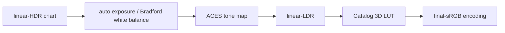
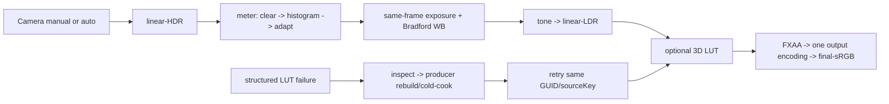

# hello-taa

This carrier exercises the smallest temporal path: attach `Camera` with TAA to
one active camera, then inspect the renderer receipt. TAA is enabled by
default; Motion Blur is an independent opt-in component and is disabled on a
cold start. The Dynamic Resolution button enables the admitted fixed-scale
`0.67` TAAU contract, producing one internal extent plus output-domain
coverage. For adaptive scaling, use unequal bounds as described in the
[Render contract](../../../packages/render/README.md#adaptive-dynamic-resolution);
this control preserves the fixed-scale TAAU diagnostic.

The live controls are deliberately discoverable from the first frame:

| Control | Contract |
|:--|:--|
| `TAA` | Switches the Camera between renderer-owned TAA and current-only output. |
| `Dynamic Resolution` | Adds/removes `DynamicResolution` with `minScale=maxScale=0.67`; it refuses to run without TAA. |
| `Motion Blur` | Adds/removes the independent post-process consumer; it never owns TAA history. |
| `Retry renderer` | Calls the public renderer recovery seam; the inspection keeps the structured lifecycle state and last outcome. |

## Motion Blur component and reset behavior

Motion Blur is an independent camera component. Presence enables the consumer;
removing it returns to the TAA-only path.

```ts
const result = app.world.addComponent(cameraEntity, {
  component: MotionBlur,
  data: { shutterAngle: 180, maxRadiusPixels: 32, sampleCount: 8, targetFps: 60 },
});
if (!result.ok) throw result.error;
```

The renderer keeps the host render sample timestamp separate from the ECS
delta. A gap above `100 ms` reports `motionBlur.status = "reset"` with
`resetReason = "time-discontinuity"`; a `30 Hz` interval is accepted. A failed
submit keeps the last accepted timestamp and instance transforms, so the next
retry starts from the last committed temporal pair. Inspect the detached
`motionBlur` record after the frame before choosing to retry.

The authored sample count uses exact execution tiers: `4..7 → 4`, `8..15 → 8`,
and `16 → 16`; zero-work bypass is `0`. The tier is shared by all directions
and includes the bounded fallback read, so no center sample is added behind
the inspection value. A reset can be handled from one detached inspection:

At a moving silhouette, accepted foreground coverage reconstructs a bounded
part of the missing opaque edge instead of averaging the missing taps as black.
The matching empty-background trail is attenuated by the same fixed factor, so
the correction redistributes blur energy instead of creating it. When no source
is accepted, the receiver center remains the conservative fallback. Compute and
raster-limited paths share this rule without another pass, color read, or
radius-sized neighborhood.

```ts
const inspection = renderer.inspect();
if (
  inspection.motionBlur?.status === 'reset' &&
  inspection.motionBlur.resetReason === 'time-discontinuity' &&
  inspection.temporal.resetReason === 'time-discontinuity'
) {
  renderer.draw(frameInput()); // commits the new baseline on success
}
```

After a rejected graph or queue submit, inspect
`motionBlur.lastFailure === "submit-failure"`; the last successful temporal
pair remains the baseline for retry. If the failure is
`"scene-data-unavailable"`, restore the shared `standard-scene-data` producer
and its `rgba16float` render capability, then retry the same renderer. Motion
Blur does not create a private history target for recovery.

The Browser smoke captures the explicit resolution comparison and binds each PNG
to its frame and inspection state under `taaResolutionComparison`:

| Capture | Renderer state | Extent evidence |
|:--|:--|:--|
| `taa-on-taa-only` | TAA, Dynamic Resolution off | output extent; no internal extent |
| `taa-on-taau` | TAA + fixed TAAU | `scale=0.67`, internal extent and coverage producer |
| `taa-on-taau-restored` | TAA + fixed TAAU after restore | same fixed contract after TAA toggle cycle |

Motion Blur captures remain a separate control and must not be used as the TAAU
comparison.

For a cold-start carrier URL, use `/?taa-dynamic-resolution=1` to exercise the
fixed TAAU path or `/?taa-motion-blur=1` to opt into Motion Blur. The `#inspection`
JSON publishes the TAA owner, output/internal extent, coverage producer pass,
renderer-owned resolution status, and recovery state so an AI user can diagnose and
retry the same Renderer without guessing from pixels.

The carrier smoke scripts retain separate Dawn, Browser serialization,
CPU-WebGL2 raster, and RhiNull structural-only checks. RhiNull does not make a
pixel claim. `evidence/visual-cases.json` is the bounded visual case and
falsifier manifest; this checkout records no fabricated screenshot result.

The browser carrier waits for the Vite URL with a bounded runner-only budget.
`FORGEAX_TAA_VITE_READINESS_TIMEOUT_MS` overrides the wait in milliseconds and
is clamped to `1..180000`; the default is `180000` (three minutes). This
control covers cold-start scheduling on the simulated CI lane and does not
change renderer or WebGPU semantics.

The `smoke:performance` report runs the real Dawn carrier for 60 frames on the
lavapipe correctness lane. It records the single `rgba16float` temporal target
as `8 * width * height` bytes at 1080p, 1440p, and 4K, plus producer/Motion Blur
pass counts, stable creation counters, pass trace, and source/build identity.
This lane is correctness-only and explicitly reports `gpuTimestamp: false`; it
does not qualify timing.

PR CI keeps this carrier on the self-hosted Linux heavy pool and exercises the
simulation/software-GPU paths through Dawn/lavapipe, browser WebGL2, and the
RhiNull structural smoke. These are correctness and raster/falsifier checks;
native 1080p timing is intentionally not a required CI gate because the
self-hosted fleet has no physical-GPU provider. The former physical-GPU
admission test and its artifact were removed rather than weakening the result
or claiming that simulated GPU timing is native timing.

The manifest declares all five ForgeaX metric kinds. Bundle-size, FPS, bench,
and spike-report are intentionally disabled here because their evidence owners
are the package build, carrier smoke, render benchmark, and spike workflow;
the gate metric remains enabled and invokes the exact Dawn smoke command.

Inspection is detached bounded POD only: `motionBlur` reports status, validated
parameters, target rate, effective sample tier, demand, pass identity, and zero
history writes. It never serializes
a graph node, RHI handle, raw key, epoch, or a second history. Invalid params
and unavailable scene data remain structured failures; repair the named source
or capability and retry the same frame.

## Auto-exposure feature evidence

The feature demo now uses the same renderer-owned standard output path as the
workload smoke. Each case renders a high-dynamic-range chart (linear inputs
from `0.018` through `8.0`) into the ACES filmic path, and the live inspection
records the three output domains and their receipt identities:



| URL case | Renderer state exercised | What the screenshot can show |
| --- | --- | --- |
| `/?taa-case=exposure-adaptation-card` | auto exposure + ACES | dark and bright HDR bars remain separated after adaptation; `auto-exposure-meter` and committed receipt are visible in inspection |
| `/?taa-case=exposure-auto-dark&taa-scene-scale=0.25` / `/?taa-case=exposure-auto-bright&taa-scene-scale=4` | auto exposure differential pair | the same chart at 16× input luminance span; the validator compares the post-tone-map luminance ratio |
| `/?taa-case=exposure-manual-reference&taa-exposure=0.5` | manual exposure reference + ACES | the same HDR input with a deliberately different exposure multiplier; stage hashes can be compared with the auto case |
| `/?taa-case=exposure-manual-dark&taa-scene-scale=0.25` / `/?taa-case=exposure-manual-bright&taa-scene-scale=4` | fixed-exposure control pair | the control keeps the input luminance change, so its ratio is expected to be larger than the auto pair |
| `/?taa-case=white-balance-card&taa-temperature=3200` | Bradford white balance at tungsten temperature | the same chart is visibly warmer; temperature/tint are shown in the proof panel and camera inspection |
| `/?taa-case=lut-output-card` | Catalog-loaded 16³ cinematic LUT at strength `0.75` | warm channel remap is visible; LUT source key, generation and committed receipt are shown |

For a low-load, software-only visual capture (not physical-GPU or timing
admission), run:

```sh
TAA_DEMO_OUTPUT=/tmp/forgeax-taa-color-grading-demo \
pnpm --filter @forgeax/hello-taa demo:color-grading
```

The manifest records `physicalGpu: false`; the three canvas PNGs are visual
inspection aids only. A closed-loop visual verdict still requires an agent to
read each PNG and bind its observation to the exact Browser/Dawn receipt
artifacts. The normal 60-frame feature workloads remain the admission route.

The same capture can be reduced to a numeric observation without trusting the
PNG. The validator decodes sampled `rgba16float`/8-bit stage bytes and checks
finite values, scale-aware HDR range, normalized LDR/sRGB bounds, same-frame
device/graph/extent identity, distinct readback identities, committed auto/LUT
receipts, and zero resource drift. The dark/bright pair is the important
automatic-exposure proof: the fixed-exposure control is `3.5216x` apart in
sampled linear-LDR luminance while the auto pair is `1.0018x` apart in the
same run. The report records this as `autoExposureComparison` and only sets
`status: "observation-pass"` when the fixed ratio is larger. This is a
software differential observation, not native-GPU or final acceptance proof.

The scale pair deliberately has different HDR hashes (`0.25x` and `4x`); the
unchanged-input cases (`exposure-adaptation-card`, manual reference, white
balance, and LUT) still share one HDR hash so output-stage changes cannot be
mistaken for a changed source.

```sh
pnpm --filter @forgeax/hello-taa demo:color-grading:validate \
  /tmp/forgeax-taa-color-grading-demo
```

The command writes `numeric-report.json` with `status:
"observation-pass"` and `admission: "not-acceptance"` when the software run
passes. This is deliberately separate from the physical Browser/Dawn gate: a
numeric pass proves the color-stage contract and receipts, not native-GPU
performance or final feature Judgment.

`rhi-null` is structural-only and cannot produce a pixel or timing verdict.
Read `evidence/manifest.json`, then join the report to its exact source/build
SHA before treating any result as current.

### Reproduce the auto-exposure workload

The canonical CI route runs the real Browser/Dawn workload on the self-hosted
heavy pool with the software WebGPU adapter (typically lavapipe). It is a
functional correctness lane: every workload still executes, records its
adapter/runner provenance, and is joined at the exact source HEAD. Because the
adapter is not a physical GPU, this route never publishes a native timing
qualification. Physical GPU timing remains a separate, explicitly deferred
performance contract and cannot be inferred from software execution.

Set `FORGEAX_AUTO_EXPOSURE_EXECUTION_MODE=simulated` only for this software
route. The evidence must retain `executionMode: "simulated"` and
`physicalGpu: false`; missing or contradictory provenance blocks admission.

To reproduce the deferred functional route locally:

```sh
FORGEAX_AUTO_EXPOSURE_EXECUTION_MODE=simulated \
  SMOKE_MIN_FRAMES=60 \
  pnpm --filter @forgeax/hello-taa smoke
```

The physical timing producer below is retained as the future performance
route, but its output is not required for the software-function admission.

The timing producer owns one bounded run per backend and resolution: 120 warmup
frames followed by an unfiltered 60-frame window. The report is raw evidence;
the exact-head validator and dual-backend join own admission.

```sh
# Build the final app first, then run each backend producer exactly once. Each
# invocation owns both 1080p and 4K windows for auto and positive-lut workloads.
pnpm build:app hello/taa
FORGEAX_AUTO_EXPOSURE_TIMING_PRODUCER=scripts/auto-exposure-gpu-pass-timing-producer.mjs \
FORGEAX_AUTO_EXPOSURE_TIMING_BACKEND=browser \
  pnpm --filter @forgeax/hello-taa gpu-pass-timing:auto-exposure \
  --output=/tmp/auto-exposure-<final-head>-browser.json
FORGEAX_AUTO_EXPOSURE_TIMING_PRODUCER=scripts/auto-exposure-gpu-pass-timing-producer.mjs \
FORGEAX_AUTO_EXPOSURE_TIMING_BACKEND=dawn \
  pnpm --filter @forgeax/hello-taa gpu-pass-timing:auto-exposure \
  --output=/tmp/auto-exposure-<final-head>-dawn.json
```

The two raw reports remain observations until the independent admission owner
checks every raw tick window. Run the adapter with the aggregate feature
identity from the same build; it rejects stale heads, software/paravirtual
adapters, missing 1080p/4K windows, reused samples, and unaccounted equal-tick
quantization. Omit `--ci-state` (or leave it `blocked`) while exact-head CI
admission is pending. `--ci-state=success` additionally requires
`--ci-attestation=<exact-ci-admission.json>` with schema
`forgeax-auto-exposure-timing-admission-ci/1`, the same tested revision, and
the SHA-256 digests of both raw inputs; a caller cannot self-declare CI proof.

```sh
bun scripts/ci/admit-auto-exposure-timing.mjs \
  --browser=/tmp/auto-exposure-<final-head>-browser.json \
  --dawn=/tmp/auto-exposure-<final-head>-dawn.json \
  --identity=evidence/<same-head-browser-aggregate>.json \
  --output=/tmp/auto-exposure-<final-head>-qualified-timing.json \
  --gate-output=/tmp/auto-exposure-<final-head>-qualified-timing-gate.json \
  --ci-state=blocked
```

The resulting gate is the only source allowed to set `qualifiedTiming`; the
raw Browser/Dawn files are retained beside it for audit and are never relabeled.

The workload and recovery ownership are intentionally explicit:



Manual mode has no meter dispatch and keeps the zero-cost path. Auto mode
consumes the GPU candidate produced in the same frame; CPU staging carries only
generation and transaction metadata. A LUT is admitted only after shape,
live 3D-view, filtering bind-group, generation, and sourceKey checks. A failed
replacement leaves the accepted/LKG LUT resident and records `.code`,
`.expected`, `.hint`, and `.detail` for the next same-GUID/sourceKey retry.
Three.js r184 comparison uses the same assets, camera, lights, input, and
linear color stage; it is not a fallback timing lane.
