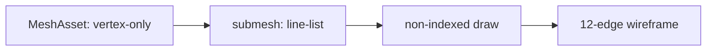

# Hello topology

This demo is the focused public carrier for Points/Lines. The query-free URL
remains the legacy `MeshAsset` topology oracle. The focused URLs are:

- `http://127.0.0.1:5173/?evidenceLane=webgpu`
- `http://127.0.0.1:5173/?evidenceLane=wgpu-webgl2`

Both focused URLs create the same public `MeshAsset`, `Materials.unlit`,
`Points`, and `Lines` authoring. `evidenceLane` selects the carrier route only;
the runtime reports the backend and the existing renderer inspection reports
lane provenance. `RhiNull` is structural-only and is not pixel evidence.

## Focused public authoring

```ts
import { Lines, Materials, MeshFilter, MeshRenderer, Points } from '@forgeax/engine-render';

const material = Materials.unlit([0.1, 0.9, 1, 1], { castShadow: false });
world.spawn(
  { component: MeshFilter, data: { assetHandle: meshHandle } },
  { component: MeshRenderer, data: { materials: [materialHandle] } },
  { component: Points, data: { sizePx: 16, shape: 'circle' } },
);
world.spawn(
  { component: MeshFilter, data: { assetHandle: lineMeshHandle } },
  { component: MeshRenderer, data: { materials: [materialHandle] } },
  { component: Lines, data: { widthPx: 4 } },
);
```

The script `public-consumer.mjs` is the public-import contract and rejects
private renderer helpers, encoders, graph keys, and backend authoring branches.

## Data flow



The public recipe is `World.allocSharedRef('MeshAsset', payload)`, a
`MeshFilter`, a positional `MeshRenderer.materials` slot, and an explicit
camera look-at pose. The Dawn smoke renders 300 frames and requires a sparse,
non-zero cyan foreground band; `FALSIFY=topology-triangle-list` and
`FALSIFY=degenerate` must fail to prove that readback measures the real
topology path.

```bash
pnpm --filter @forgeax/hello-topology typecheck
pnpm --filter @forgeax/hello-topology build
pnpm --filter @forgeax/hello-topology smoke
```

## Template boundary

`templates/game-default` already has one authored mesh owner with multiple
submeshes/material slots, imported assets, gameplay hit feedback, render
evidence, and typed reset. This static wireframe is therefore kept as the
canonical topology oracle rather than copied as a second camera scene. A
future guided slice would need a topology change on an existing gameplay mesh
with a visible consequence and the same reset/re-entry/cleanup owner.
