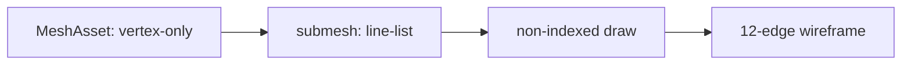

# Hello topology

This demo is the focused `MeshAsset` topology oracle: a vertex-only mesh with
`submeshes[0].topology = 'line-list'` draws a unit-cube wireframe as 12
independent segments through the non-indexed path.

## Data flow



The public recipe is `World.allocSharedRef('MeshAsset', payload)`, a
`MeshFilter`, a positional `MeshRenderer.materials` slot, and an explicit
camera look-at pose. The Dawn smoke renders 300 frames and requires a sparse,
non-zero cyan foreground band; `FALSIFY=topology-triangle-list` and
`FALSIFY=degenerate` must fail to prove that readback measures the real
topology path.

```bash
pnpm --filter @forgeax/hello-topology typecheck
pnpm --filter @forgeax/hello-topology build
pnpm --filter @forgeax/hello-topology smoke
```

## Template boundary

`templates/game-default` already has one authored mesh owner with multiple
submeshes/material slots, imported assets, gameplay hit feedback, render
evidence, and typed reset. This static wireframe is therefore kept as the
canonical topology oracle rather than copied as a second camera scene. A
future guided slice would need a topology change on an existing gameplay mesh
with a visible consequence and the same reset/re-entry/cleanup owner.
