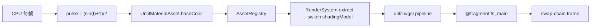

# Shaders (LearnOpenGL §1.3)

> [!NOTE]
> **对应 LO 原章节**：[LearnOpenGL §1.3 Shaders](https://learnopengl.com/Getting-started/Shaders)
>
> **对应引擎能力**：feat-20260515-learn-render-getting-started — `@forgeax/engine-runtime` `MaterialAsset.shadingModel: 'unlit'` + 自定义 WGSL fragment uniform 脉动播放（`packages/shader/src/unlit.wgsl` 实际驱动；本目录 `src/shaders/play.wgsl` 是 LO §1.3 → forgeax 的 shader 阶段映射文档伴侣）。

## 这个示例展示什么

LO §1.3 的核心论点是「用 uniform 把 CPU 数据塞进 fragment shader，让颜色随时间脉动」。forgeax 把同样的语义切成三层：

1. **CPU 注册一份不变量** — `assets.register<MaterialAsset>({ kind: 'material', shadingModel: 'unlit', baseColor: [1, 0.5, 0.2, 1] })` 注册一份 `UnlitMaterialAsset`，承担 LO 教程里 `glUseProgram + glUniform4f("ourColor", ...)` 的「告知 GPU 颜色基线」职责
2. **ECS 实体单点引用** — `world.spawn(Transform, MeshFilter{HANDLE_TRIANGLE}, MeshRenderer{material})`；merged-`MeshRenderer` 组件持有 `Handle<MaterialAsset>`，在 `render-system-extract.ts` 内 `switch (mat.shadingModel)` 路由到 unlit 管线
3. **rAF 内驱 pulse 标量** — `Math.sin(elapsedSeconds)` 每帧驱动一个 `pulse: number`，挂在 `globalThis.__captureShadersPulse` 上让 AI 用户从 DevTools / bench-screenshot 单点观测

> [!IMPORTANT]
> **forgeax 不暴露 `glUseProgram` / `glGetUniformLocation` 这类 OpenGL 全局状态机入口**；shader 选择由 `MaterialAsset.shadingModel` 的 discriminated union 标签在引擎内部完成（charter P4 一致抽象）。AI 用户写「我要 unlit 颜色脉动」就是写 `MaterialAsset` POD + 一个 sin 驱动的 pulse 数值，不用学 GL 状态机词汇。

## 渲染流程



## 引擎用法

```ts
// 来自 src/index.ts 的关键片段（三段式注释 AC-06）。

// 1. engine usage - 引擎公开符号集
import { World } from '@forgeax/engine-ecs';
import {
  Camera, Engine, EngineEnvironmentError, HANDLE_TRIANGLE,
  MeshRenderer, MeshFilter, Transform,
} from '@forgeax/engine-runtime';
import type { MaterialAsset } from '@forgeax/engine-types';
import playShaderSrc from './shaders/play.wgsl?raw';

// 2. example-specific glue - LO §1.3 颜色脉动配置
const PLAY_BASE_COLOR = [1.0, 0.5, 0.2, 1.0] as const;
const playMaterial = assets.register<MaterialAsset>({
  kind: 'material',
  shadingModel: 'unlit',
  baseColor: PLAY_BASE_COLOR,
});
world.spawn(
  { component: Transform, data: { /* posZ=0 ... */ } },
  { component: MeshFilter, data: { assetHandle: HANDLE_TRIANGLE } },
  { component: MeshRenderer, data: { material: playMaterial } },
);

function computePulse(nowMs: number, basePulseTime: number): number {
  const elapsedSeconds = (nowMs - basePulseTime) * 0.001;
  return (Math.sin(elapsedSeconds) + 1.0) * 0.5;
}

// 3. bootstrap - rAF 主循环 + capture hook
const tick = (): void => {
  pulse = computePulse(performance.now(), basePulseTime);
  renderer.draw(world);
  requestAnimationFrame(tick);
};
requestAnimationFrame(tick);
```

`src/shaders/play.wgsl` 是 LO §1.3 → forgeax 的 shader 阶段映射伴侣，含 `@vertex fn vs_main` + `@fragment fn fs_main` + `var<uniform> material : MaterialUniforms { baseColor, pulse }`。WGSL 文件本身**不是**实际渲染管线（引擎在 `MaterialAsset.shadingModel === 'unlit'` 时走 `packages/shader/src/unlit.wgsl`），但和 `index.ts` 一起读完整张 LO §1.3 → forgeax 映射图。

## 与 LO 原版的差异

| 维度 | LO 原版（C++ / GLSL 330） | forgeax 这里（TS / WGSL） |
|:--|:--|:--|
| Shader 语言 | GLSL 330（`#version 330 core` + `void main()`） | WGSL（`@vertex` / `@fragment` + `fn vs_main` / `fn fs_main`） |
| Shader 选择 | `glCreateShader` + `glShaderSource` + `glCompileShader` + `glAttachShader` + `glLinkProgram` + `glUseProgram` 串行手写状态机 | `MaterialAsset.shadingModel: 'unlit' \| 'standard'` 标签匹配；引擎内部 exhaustive switch 路由（`render-system-extract.ts`） |
| Uniform 设置 | `glGetUniformLocation(program, "ourColor")` + `glUniform4f(loc, r, g, b, a)` 每帧手动设置 | `assets.register<MaterialAsset>({ kind: 'material', shadingModel: 'unlit', baseColor })` 一次注册；ECS `MeshRenderer.material` 引用句柄；引擎按帧上传 |
| 时间脉动 | `float timeValue = glfwGetTime(); float green = sin(timeValue) / 2.0 + 0.5;` 在 GLFW 主循环内 | `computePulse(performance.now(), basePulseTime)` 在 rAF tick 内；`globalThis.__captureShadersPulse` 暴露给观测者 |
| 错误处理 | `glGetShaderiv(GL_COMPILE_STATUS) + glGetShaderInfoLog` 字符串解析；编译失败可静默或 `cerr` 打印 | forgeax 用结构化错误（`err.code` 闭族 `ShaderErrorCode 7` 成员 + `err.expected` / `err.hint` / `err.detail`）替代 LO C++ 抛异常 / 静默失败；AI 用户 `switch (err.code)` exhaustive narrow，不解析 `err.message`（charter P3） |
| 资源加载 | 直接路径 `Shader ourShader("vs.vs", "fs.fs")` 读文件 | 渲染期不存在路径加载；shader 由引擎注册表（`@forgeax/engine-shader` ShaderRegistry）通过 manifest hash 索引；自定义 wgsl 走 `vite-plugin-shader` 构建期编译 |
| 顶点输入 | `glVertexAttribPointer(0, 3, GL_FLOAT, ...)` 手布局 | `MeshFilter { assetHandle: HANDLE_TRIANGLE }` 引用引擎内置 mesh 资产；引擎自动绑定 `@location(0) pos` |

## 关键代码量

| 文件 | 行数 | 角色 |
|:--|---:|:--|
| `src/index.ts` | ~250 | 三段式（引擎使用 + 示例胶水 + 启动）+ pulse 计算 + capture hook |
| `src/shaders/play.wgsl` | ~75 | LO §1.3 → forgeax shader 阶段映射文档（vertex + fragment + pulse uniform） |
| `src/__tests__/shaders.browser.test.ts` | ~130 | vitest browser e2e（AC-05 + AC-06 + AC-22 三段断言） |

## 运行

```bash
# 开发服务器（vite preview 端口 5182）
pnpm --filter "@forgeax/app-learn-render-1-getting-started-3-shaders" dev

# 构建（产出 dist/）
pnpm --filter "@forgeax/app-learn-render-1-getting-started-3-shaders" build

# vitest browser e2e（chromium + WebGPU）
pnpm test:browser

# 录制 golden PNG（forgeax-engine-assets 子模块）
pnpm --filter "@forgeax/app-learn-render-1-getting-started-3-shaders" exec node scripts/bench-screenshot.mjs
```

<details>
<summary>LO 原版 C++/GLSL 关键片段（参考用）</summary>

LO §1.3 在 `src/1.getting_started/3.1.shaders_uniform/shaders_uniform.cpp` + `3.1.shader.fs` / `3.1.shader.vs` 的核心代码（来自 [JoeyDeVries/LearnOpenGL master 分支](https://github.com/JoeyDeVries/LearnOpenGL)）：

```glsl
// 3.1.shader.vs (vertex shader, GLSL 330)
#version 330 core
layout (location = 0) in vec3 aPos;

void main()
{
    gl_Position = vec4(aPos.x, aPos.y, aPos.z, 1.0);
}
```

```glsl
// 3.1.shader.fs (fragment shader, GLSL 330)
#version 330 core
out vec4 FragColor;

uniform vec4 ourColor;

void main()
{
    FragColor = ourColor;
}
```

```cpp
// shaders_uniform.cpp -- shader compile + link + uniform pulse loop
unsigned int vertexShader = glCreateShader(GL_VERTEX_SHADER);
glShaderSource(vertexShader, 1, &vertexShaderSource, NULL);
glCompileShader(vertexShader);

int success;
char infoLog[512];
glGetShaderiv(vertexShader, GL_COMPILE_STATUS, &success);
if (!success)
{
    glGetShaderInfoLog(vertexShader, 512, NULL, infoLog);
    std::cout << "ERROR::SHADER::VERTEX::COMPILATION_FAILED\n" << infoLog << std::endl;
}

// fragment shader compile (GL_FRAGMENT_SHADER) + link program + cleanup omitted

while (!glfwWindowShouldClose(window))
{
    processInput(window);

    glClearColor(0.2f, 0.3f, 0.3f, 1.0f);
    glClear(GL_COLOR_BUFFER_BIT);

    // be sure to activate the shader before any calls to glUniform
    glUseProgram(shaderProgram);

    // update the uniform color
    float timeValue = glfwGetTime();
    float greenValue = sin(timeValue) / 2.0f + 0.5f;
    int vertexColorLocation = glGetUniformLocation(shaderProgram, "ourColor");
    glUniform4f(vertexColorLocation, 0.0f, greenValue, 0.0f, 1.0f);

    // now render the triangle
    glBindVertexArray(VAO);
    glDrawArrays(GL_TRIANGLES, 0, 3);

    glfwSwapBuffers(window);
    glfwPollEvents();
}
```

`glUseProgram` / `glGetUniformLocation` / `glUniform4f` / shader compile fragment / `void main` / `gl_Position` / `glClear` 七个 GL 关键标识在本折叠块全部命中（grep 闸门 AC-23）。

</details>
