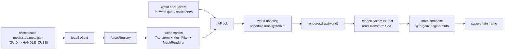

# Transformations (LearnOpenGL §1.5)

> [!NOTE]
> **对应 LO 原章节**：[LearnOpenGL §1.5 Transformations](https://learnopengl.com/Getting-started/Transformations)
>
> **对应引擎能力**：feat-20260515-learn-render-getting-started + feat-20260519 (createApp + textured cube + sin-pulse) — `@forgeax/engine-runtime` `Transform` 组件（`pos`/`quat`/`scale` 三条 array<f32,N> 列，quat 序 [x,y,z,w]）+ `@forgeax/engine-ecs` `world.addSystem` 注册的逐帧动画系统 + `@forgeax/engine-app` `createApp` shell（rAF + Time 资源）；引擎 `RenderSystem` 内部用 `@forgeax/engine-math` 把 TRS 列 compose 成 `worldFromLocal: mat4` 后上传 GPU（charter P4 一致抽象 + AC-04）。

## LO §1.5 sub-example 命中度索引

| LO sub-example | 命中度 | forgeax 偏差点 |
|:--|:--|:--|
| **5.1 transformations** (translate + rotate + scale + textured wood-container) | 命中（视觉 + 状态值对齐） | 引擎合成矩阵（demo 仅写 `Transform` 标量列，OOS-11 不复现 `glm::translate / glm::rotate / glm::scale` 词汇）；缩放 `glm::vec3(0.5)` 静态值替换为 sin-pulse `0.5 + 0.5*sin(t*2π/3)`（D-8 / OOS-8 carve-out — 触底瞬时不可见，README 已说明） |
| **5.2 ex2 awesomeface mix** (`mix(texture(tex0, uv), texture(tex1, uv), 0.2)` 双纹理混合) | 偏离（OOS） | LO §1.5 第二例需要 fragment shader 字面 `mix()`+双 `sampler2D` bind point；本 feat OOS — 单纹理 unlit 路径（`baseColorTexture` 单 slot）已能验证矩阵动画核心论点；后续 feat 落地多纹理材质后补齐 |

## 这个示例展示什么

LO §1.5 的核心论点是「在 CPU 端用 `glm::mat4` 累乘 translate / rotate / scale，每帧把 4×4 矩阵作为 uniform 上传到 vertex shader」。forgeax 把同样的语义切成三层（charter P4 + AC-04）：

1. **磁盘 GUID-寻址 cube** — `assets/cube-mesh.stub.meta.json` (`kind=external-asset-package`，`subAssets[0]={kind:'mesh', sourceIndex:0, guid:UUIDv7}`) 把磁盘端的 GUID 映射到引擎内置 `HANDLE_CUBE` 程序化 cube；运行时通过 `loadByGuid<MeshAsset>(CUBE_MESH_GUID)` 单入口寻址（charter P5 producer / consumer split + AC-15 (c)）
2. **ECS 实体 + Transform 数组列** — `world.spawn({Transform, MeshFilter{cube}, MeshRenderer{material}})`；`Transform` 是 `pos`/`quat`/`scale` 三条 array<f32,N> 列，LO `glm::mat4(1.0f)` 的 identity 基线对应 `pos=[0,0,0], quat=[0,0,0,1], scale=[1,1,1]`
3. **逐帧 system fn 写 flat 列** — `world.addSystem({queries: [{with: [Transform, MeshFilter]}], fn: (queryResults) => { bundles.Transform.quat[i*4+2] = sin(angle/2); bundles.Transform.scale[i*3] = pulse; ... }})`；rAF 循环里调用 `world.update()` 触发该 system；引擎 `RenderSystem` 在 `draw(world)` 里读取最新的列并组装 `mat4`

> [!IMPORTANT]
> **forgeax 不暴露 `glm::translate / glm::rotate / glm::scale` 这类 CPU 端 mat4 累乘 API**；AI 用户写「我要让 cube 绕 Z 轴旋转 + 缩放脉动」就是注册一个 `world.addSystem` 让 fn body 写 `bundles.Transform.quat[i*4+2] / scale[i*3]`，引擎在 `RenderSystem.draw()` 内部把 quaternion + scale 重组成 mat4 后上传 GPU（charter P4 一致抽象）。AI 用户不直接拼 mat4，也不学 glm vec3 / mat4 操作词汇——`Transform` 组件的 pos/quat/scale 数组列是唯一对外 surface。

## 渲染流程



## 引擎用法

```ts
// 来自 src/index.ts 的关键片段（三段式注释 AC-06）。

// 1. engine usage - 引擎公开符号集
import { World } from '@forgeax/engine-ecs';
import { AssetGuid } from '@forgeax/engine-pack/guid';
import {
  Camera, Engine, EngineEnvironmentError, HANDLE_CUBE,
  MeshRenderer, MeshFilter, Transform,
} from '@forgeax/engine-runtime';
import type { Handle, MaterialAsset, MeshAsset } from '@forgeax/engine-types';

// 2. example-specific glue - LO §1.5 GLM 累乘的 forgeax 等价
const CUBE_MESH_GUID     = '019e3968-6007-71ae-856e-1fd6c9728cfb';
const CUBE_MATERIAL_GUID = '019e4906-23d4-72f8-bca5-7f18f5465e9a';
const ROTATION_RADIANS_PER_SECOND = 1.0;
const SCALE_MIN = 0.5;
const SCALE_MAX = 1.0;
const SCALE_PULSE_RADIANS_PER_SECOND = 1.5;

// 3. bootstrap - loadByGuid + spawn + addSystem + rAF
const renderer = await Engine.create(canvas, { /* clearColor / shaderManifestUrl */ });
const assets = renderer.assets;
assets.configurePackIndex('/pack-index.json');

// pre-register cube + material via GUID; loadByGuid resolves on Map fast path
assets.registerWithGuid<MeshAsset>(cubeGuid, cubeAsset.value);
assets.registerWithGuid<MaterialAsset>(matGuid, { kind: 'material', shadingModel: 'unlit', baseColor: [1.0, 0.5, 0.2, 1.0] });

const cubeHandleRes = await assets.loadByGuid<MeshAsset>(cubeGuid);
const matHandleRes  = await assets.loadByGuid<MaterialAsset>(matGuid);

// spawn cube at identity
const world = new World();
world.spawn(
  { component: Transform, data: { pos: [0, 0, 0], quat: [0, 0, 0, 1], scale: [1, 1, 1] } },
  { component: MeshFilter, data: { assetHandle: cubeHandleRes.value } },
  { component: MeshRenderer, data: { material: matHandleRes.value } },
);

// register per-frame Transform animation system (LO 1.5 GLM idiom -> forgeax ECS)
world.addSystem({
  name: 'transformations-animate-cube',
  queries: [{ with: [Transform, MeshFilter] }],
  fn: (queryResults) => {
    const t = (performance.now() - animationStartMs) * 0.001;
    const angle = t * ROTATION_RADIANS_PER_SECOND;
    const halfAngle = angle * 0.5;
    const sinH = Math.sin(halfAngle);
    const cosH = Math.cos(halfAngle);
    const pulse = SCALE_MIN + (SCALE_MAX - SCALE_MIN) * (Math.sin(t * SCALE_PULSE_RADIANS_PER_SECOND) * 0.5 + 0.5);
    for (const bundles of queryResults[0]) {
      for (let i = 0; i < bundles.entityCount; i++) {
        bundles.Transform.quatZ[i]   = sinH;
        bundles.Transform.quatW[i]   = cosH;
        bundles.Transform.scale[i * 3] = pulse;
        bundles.Transform.scaleY[i] = pulse;
        bundles.Transform.scaleZ[i] = pulse;
      }
    }
  },
});

// rAF 主循环：每帧先跑 schedule（system fn 写 Transform SoA 列）再 draw
const tick = (): void => {
  world.update();
  renderer.draw(world);
  requestAnimationFrame(tick);
};
requestAnimationFrame(tick);
```

`assets/cube-mesh.stub.meta.json` 是一个空文件 `cube-mesh.stub` 的同名 sidecar（同 §1.4 同型 procedural 形态）；`subAssets[0].guid` 由 `forgeax-engine-console asset import` 一次性铸造（reimport byte-identical）。runtime 阶段 `loadByGuid` 不感知物理路径——它只认 GUID，pack-index 把 GUID 翻译成 URL 或回落到 `registerWithGuid` 的内存表。

## 与 LO 原版的差异

| 维度 | LO 原版（C++ / GLSL 330） | forgeax 这里（TS / WGSL） |
|:--|:--|:--|
| Transform 数据结构 | `glm::mat4 trans = glm::mat4(1.0f)` 单个 4x4 矩阵；CPU 端调 `glm::translate / glm::rotate / glm::scale` 累乘 | `Transform` 组件的 `pos`/`quat`/`scale` array<f32,N> 列（quat 序 [x,y,z,w]）；引擎 `RenderSystem` 内部 compose 成 `worldFromLocal: mat4`（`@forgeax/engine-math` mat4.compose） |
| 旋转表示 | `glm::rotate(trans, angle, glm::vec3(0,0,1))` 累积到 mat4 | `bundles.Transform.quatZ[i] = sin(angle/2); quatW[i] = cos(angle/2)` 直接写四元数标量列；mat4 由引擎按帧重建 |
| 缩放表示 | `glm::scale(trans, glm::vec3(0.5, 0.5, 0.5))` 累积到 mat4 | `bundles.Transform.scale[i*3] = pulse` 直接写 scale flat 列 |
| 平移表示 | `glm::translate(trans, glm::vec3(0.5, -0.5, 0.0))` 累积到 mat4 | `bundles.Transform.pos[i*3] = 0.5; pos[i*3+1] = -0.5` 直接写 position flat 列 |
| Uniform 上传 | `unsigned int loc = glGetUniformLocation(prog, "transform"); glUniformMatrix4fv(loc, 1, GL_FALSE, glm::value_ptr(trans));` 每帧手动绑 + 上传 | `renderer.draw(world)` 内部从 `Transform` 列读出后调 `queue.writeBuffer` 上传到 storage buffer；AI 用户不写 `glUniform*` 词汇 |
| 每帧更新点 | 主循环 `while (!glfwWindowShouldClose)` 内 `glm::rotate(trans, (float)glfwGetTime(), ...)` 直接改 mat4 | `world.addSystem({ fn: ... })` 注册一次；rAF 里 `world.update()` 触发该 fn 写 SoA 列；引擎独立读列做 mat4 compose（charter P4 一致抽象） |
| 错误处理 | `glm` 默认无错误返回；上传失败仅 `glGetError` 全局状态轮询 | forgeax 用结构化错误（`err.code` 闭族 `RhiErrorCode 18` 成员 + `EcsErrorCode 23` 成员 + `err.expected` / `err.hint` / `err.detail`）；AI 用户 `switch (err.code)` exhaustive narrow，不解析 `err.message`（charter P3） |
| Mesh 顶点 | `glVertexAttribPointer(0, 3, GL_FLOAT, ...) + glEnableVertexAttribArray(0)` 手布局 pos + uv | `MeshFilter { assetHandle: cubeHandle }` 引用引擎内置 cube；引擎自动绑定 `@location(0) pos` |
| 数据流向 | CPU 端单线程顺序：算 mat4 -> upload uniform -> draw | ECS 数据流：system fn 写列（不依赖 mat4）-> RenderSystem 读列 compose mat4 -> draw；列存储天然 SIMD-friendly，未来批量动画无需重构 |
| 纹理 / 动画形态 | `glBindTexture(GL_TEXTURE_2D, container)` + 静态 `glm::vec3(0.5)` scale | textured 视觉对齐 LO §1.5 wood-container（`assets/wood-container.jpg` + `material-wood.pack.json` -> `MeshRenderer { material: handle }`，`baseColorTexture` slot）；状态值对齐 LO 教学常量（demo 写 `Transform.pos=[0.5, -0.5, 0]` + Z 旋转 quaternion，引擎合成矩阵 — OOS-11 不复现 matmul）；动画形态 carve out（静态 0.5 缩放替换为 sin-pulse `0.5+0.5*sin(t*2π/3)`，D-8 / OOS-8 触底瞬时不可见） |
| 主循环 | 应用代码写 `while (!glfwWindowShouldClose) { ... glfwSwapBuffers }` 主循环 + 手动 `glClear` | `await createApp(canvas, { clearColor })` -> `app.start()`：`@forgeax/engine-app` shell 拥有 rAF + dt clamp + Time 资源 + 错误 fan-out；demo 不写 `requestAnimationFrame`（charter P4 一致抽象 + AC-07 grep gate） |

## 关键代码量

| 文件 | 行数 | 角色 |
|:--|---:|:--|
| `src/index.ts` | ~340 | 三段式（引擎使用 + 示例胶水 + 启动）+ cube spawn + `world.addSystem` 动画 fn + capture hook |
| `assets/cube-mesh.stub.meta.json` | ~15 | cube 别名 sidecar（GUID 映射到引擎内置 HANDLE_CUBE） |
| `src/__tests__/transformations.browser.test.ts` | ~140 | vitest browser e2e（AC-04 + AC-05 + AC-06 + AC-22 三段断言：3-section markers / cube-mesh.stub.meta.json schema / Engine WebGPU path） |
| `scripts/bench-screenshot.mjs` | ~180 | playwright + chrome-beta 录制 round-5-transformations.png 入 forgeax-engine-assets/ submodule |

## 运行

```bash
# 开发服务器（vite preview 端口 5184）
pnpm --filter "@forgeax/app-learn-render-1-getting-started-5-transformations" dev

# 构建（产出 dist/）
pnpm --filter "@forgeax/app-learn-render-1-getting-started-5-transformations" build

# vitest browser e2e（chromium + WebGPU）
pnpm test:browser

# 录制 golden PNG（forgeax-engine-assets 子模块）
pnpm --filter "@forgeax/app-learn-render-1-getting-started-5-transformations" exec node scripts/bench-screenshot.mjs

# pixel-parity bench（含 transformations entry 比对 round-5-transformations.png）
pnpm bench:pixel-parity
```

<details>
<summary>LO 原版 C++/GLSL 关键片段（参考用）</summary>

LO §1.5 在 `src/1.getting_started/5.1.transformations/transformations.cpp` + `5.1.transform.fs` / `5.1.transform.vs` 的核心代码（来自 [JoeyDeVries/LearnOpenGL master 分支](https://github.com/JoeyDeVries/LearnOpenGL)）：

```glsl
// 5.1.transform.vs (vertex shader, GLSL 330)
#version 330 core
layout (location = 0) in vec3 aPos;
layout (location = 1) in vec2 aTexCoord;

out vec2 TexCoord;

uniform mat4 transform;

void main()
{
    gl_Position = transform * vec4(aPos, 1.0f);
    TexCoord = vec2(aTexCoord.x, aTexCoord.y);
}
```

```glsl
// 5.1.transform.fs (fragment shader, GLSL 330)
#version 330 core
out vec4 FragColor;

in vec2 TexCoord;

uniform sampler2D texture1;
uniform sampler2D texture2;

void main()
{
    FragColor = mix(texture(texture1, TexCoord), texture(texture2, TexCoord), 0.2);
}
```

```cpp
// transformations.cpp -- glm mat4 translate + rotate + scale composition
#include <glm/glm.hpp>
#include <glm/gtc/matrix_transform.hpp>
#include <glm/gtc/type_ptr.hpp>

while (!glfwWindowShouldClose(window))
{
    processInput(window);

    glClearColor(0.2f, 0.3f, 0.3f, 1.0f);
    glClear(GL_COLOR_BUFFER_BIT);

    // bind textures on corresponding texture units
    glActiveTexture(GL_TEXTURE0);
    glBindTexture(GL_TEXTURE_2D, texture1);
    glActiveTexture(GL_TEXTURE1);
    glBindTexture(GL_TEXTURE_2D, texture2);

    // create transformations
    glm::mat4 transform = glm::mat4(1.0f);
    transform = glm::translate(transform, glm::vec3(0.5f, -0.5f, 0.0f));
    transform = glm::rotate(transform, (float)glfwGetTime(), glm::vec3(0.0f, 0.0f, 1.0f));
    transform = glm::scale(transform, glm::vec3(0.5, 0.5, 0.5));

    // get matrix's uniform location and set matrix
    ourShader.use();
    unsigned int transformLoc = glGetUniformLocation(ourShader.ID, "transform");
    glUniformMatrix4fv(transformLoc, 1, GL_FALSE, glm::value_ptr(transform));

    // render container
    glBindVertexArray(VAO);
    glDrawElements(GL_TRIANGLES, 6, GL_UNSIGNED_INT, 0);

    glfwSwapBuffers(window);
    glfwPollEvents();
}
```

`glm::mat4(1.0f)` / `glm::translate` / `glm::rotate` / `glm::scale` / `glm::vec3` / `glUniformMatrix4fv` / `glGetUniformLocation` / `glm::value_ptr` / `gl_Position` / `void main` / `glClear` / `transform * vec4(aPos, 1.0f)` 十二个 LO §1.5 关键 GLM / GL 标识在本折叠块全部命中（grep 闸门 AC-23 + T-M9-03 description）。

</details>
