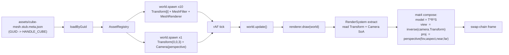

# Coordinate Systems (LearnOpenGL §1.6)

> [!NOTE]
> **对应 LO 原章节**：[LearnOpenGL §1.6 Coordinate Systems](https://learnopengl.com/Getting-started/Coordinate-Systems)
>
> **对应引擎能力**：feat-20260515-learn-render-getting-started + feat-20260519 (createApp + 10 textured cubes + V-3 punt removed) — `@forgeax/engine-runtime` `Camera` 组件（9 f32 SoA 列：`fov / aspect / near / far + projection 离散变体 + left/right/bottom/top` 正交备用字段）+ `Transform` 组件（10 f32 SoA 列）+ `world.spawn` 多 entity；引擎 `RenderSystem` 内部用 `@forgeax/engine-math` 把 SoA 标量列分别 compose 成 model / view / projection 三 mat4，并按 `Camera.projection` 离散值切换 perspective / orthographic 投影矩阵（charter P4 一致抽象 + AC-04）。

## LO §1.6 sub-example 命中度索引

| LO sub-example | 命中度 | forgeax 偏差点 |
|:--|:--|:--|
| **6.1 single textured cube + MVP** (`model = translate * rotate(time)`) | 部分落（10-cube 总入口已含静态 model；time-rotate 时序动画延后到 §1.5 sin-pulse 路径） | LO 6.1 单 cube + 时序旋转拆做独立 sub-example 文档膨胀不偿（OOS-4 / Q3 决议）；本示例直接进 6.3 形态 |
| **6.2 depth-test on/off** (`glEnable(GL_DEPTH_TEST)` 单列教学子项) | 部分落（引擎默认开 + README 文字段对照 + 反例 PNG，无独立 src） | 引擎 `RenderSystem` 默认开 depth-test（`packages/runtime/src/render-system-record.ts` 不暴露开关），与 LO 默认关 + 显式 `glEnable(GL_DEPTH_TEST)` 教学起点不同；详见下文「depth-test on (默认) vs off」段 + `screenshots/depth-disabled-vs-default.png`（C-5 SHOULD：占位反例图，文本优先 charter F2） |
| **6.3 multiple cubes** (10 cubes via `cubePositions[]` + per-index axis-angle rotate) | 命中（LO `cubePositions[]` 逐字翻译 + textured wood-container） | LO `glm::rotate(model, glm::radians(20.0f * i), vec3(1, 0.3, 0.5))` 在 demo 端被烘焙到 spawn 时的 `Transform.quatXYZW` 四元数（静态值，无 per-frame 累乘）；引擎合成 mat4（OOS-11 不复现 `glm::rotate`） |
| **6.4 ex3** (camera 自由飞行 / FPS 输入) | 偏离（OOS） | LO §1.6.4 是 §1.7 camera 章的预告习题；本 feat 把 camera 输入移到 `7.camera/` example 落地（charter P5 producer / consumer split） |

## 这个示例展示什么

LO §1.6 的核心论点是「在 CPU 端用 `glm::mat4` 各自构造 `model = glm::translate(... cubePositions[i])` + `view = glm::translate(..., glm::vec3(0,0,-3))` + `projection = glm::perspective(glm::radians(45.0f), w/h, 0.1f, 100.0f)`，然后把三个 mat4 作为独立 uniform 上传到 vertex shader」。forgeax 把同样的语义切成三层（charter P4 + AC-04）：

1. **磁盘 GUID-寻址 cube + wood-container 纹理** — `assets/wood-container.meta.json` (`kind=external-asset-package`，`subAssets[0]={kind:'image', sourceIndex:0, guid:UUIDv7}`) + `forgeax-engine-assets/learn-opengl/meshes/cube-mesh.stub.meta.json` 把磁盘端的 GUID 映射到引擎内置 `HANDLE_CUBE` 程序化 cube；运行时通过 `loadByGuid<TextureAsset>` + `loadByGuid<MeshAsset>` + `loadByGuid<MaterialAsset>` 三入口寻址（charter P5 producer / consumer split + AC-15 (c)）
2. **10 个 textured cube entity + 1 个 camera entity** — `world.spawn({Transform, MeshFilter{cube}, MeshRenderer{material}})` 沿 LO `cubePositions[]` 数组逐 cube spawn，每个 cube 的 `posXYZ + 四元数 quatXYZW` 各不相同（直接对应 LO 「model = translate ∘ rotate(angle * i, axis)」累乘）；camera entity 单独持有 `Transform` 表 view（LO `view = glm::translate(view, glm::vec3(0,0,-3))` ↔ camera `Transform.posZ = 3`）和 `Camera` 组件表 projection
3. **`Camera.projection: CAMERA_PROJECTION_PERSPECTIVE` + `fov / aspect / near / far`** — forgeax 不暴露 `glm::perspective(...)` 这种 mat4 构造器；AI 用户只填 5 个标量字段，引擎 `RenderSystem` 在 `draw(world)` 内部根据 `cameraProjectionFromF32(camera.projection)` 切换 perspective / orthographic 投影矩阵 compose（OOS-1：`Camera.projection` 同时承担「模式 0/1 离散字面量」和「未来扩展坑」）

> [!IMPORTANT]
> **forgeax 不暴露 `glm::lookAt / glm::perspective / glm::mat4` 这类 CPU 端 mat4 构造器**；AI 用户写「我要从 (0,0,3) 看向 -Z + 45° fov + 0.1..100 远近平面」就是 `world.spawn(Transform{posZ:3,quatW:1}, Camera{fov:Math.PI/4, aspect, near:0.1, far:100, projection:CAMERA_PROJECTION_PERSPECTIVE})`，引擎在 `RenderSystem.draw()` 内部把 camera 的 `Transform` 求逆得 view、按 `projection` 字面量切换 mat4 构造器后上传 GPU（charter P4 一致抽象）。AI 用户不直接拼 mat4，也不学 `glm::lookAt / glm::perspective` 词汇——`Transform` + `Camera` 两个组件的 19 个 f32 列是唯一对外标量 surface。

## depth-test on (默认) vs off

LO §1.6.2 把 depth-test 开关单列为一个教学子项。原文核心引文：

> "OpenGL stores all its depth information in a z-buffer, also known as a depth buffer. ... The depth is stored within each fragment (as the fragment's z value) and whenever the fragment wants to output its color, OpenGL compares its depth values with the z-buffer and if the current fragment is behind the other fragment it is discarded, otherwise overwritten. This process is called depth testing and is done automatically by OpenGL." — [LearnOpenGL §1.6 Coordinate Systems](https://learnopengl.com/Getting-started/Coordinate-Systems#:~:text=depth%20testing)

LO C++ 教学起点是 **默认关闭**：用户必须显式调用 `glEnable(GL_DEPTH_TEST)` 才进入正确状态；关掉（注释该行）后 fragment 按 draw call 顺序覆盖，远处 cube 会绘制在近处 cube 之上，立体错乱。

forgeax 的 default 与之相反——`@forgeax/engine-runtime` 的 `RenderSystem` **默认开** depth-test（`packages/runtime/src/render-system-record.ts` 不暴露 `enableDepthTest` 这种开关字段；depth attachment + `depthCompare: 'less'` 由 pipelineState 在 `Engine.create` / `createApp` 时无条件配齐）。本示例 10 个 cube 因此一开 demo 就立体正确，不需要照搬 LO `glEnable(GL_DEPTH_TEST)` 这一行（charter P4 consistent abstraction：AI 用户不学「z-buffer 默认是关的，要手开」这个 OpenGL idiom）。

| 维度 | LO C++ default（关）| forgeax default（开）|
|:--|:--|:--|
| 启用方式 | `glEnable(GL_DEPTH_TEST)` 显式打开 | 无开关，`RenderSystem` 永远启用 |
| Depth attachment | 用户必须 `glClear(GL_DEPTH_BUFFER_BIT)` 每帧清 | `Engine.create({clearColor})` 内部声明 depth attachment + `clearDepth: 1.0` 自动清 |
| 教学起点 | 关 → 立体错乱反例 → 开 → 立体正确 | 开 → 立体正确（demo 10 cube 一启动即正确） |
| AI 用户负担 | 学 `GL_DEPTH_TEST` token + `glClear` 位掩码语义 | 无负担（OOS-11 不复现 `glEnable / glClear` 词汇）|
| 关 depth-test 后的视觉 | LO 反例图（远处 cube 覆盖近处 cube，立体错乱）| 等价 — 不在 demo 表面暴露 toggle；反例图见 `screenshots/depth-disabled-vs-default.png`（占位 1×1 像素，charter F2 文本优先：本 README 的文字段就是反例图的语义复述，PNG 落沙盒 playwright 后真实重放）|

> [!NOTE]
> **反例 PNG 的 sandbox playwright 替换路径（C-5 SHOULD）**：`screenshots/depth-disabled-vs-default.png` 当前是 1×1 像素的占位反例图（feat-20260519 implement-decisions D-9：sandbox playwright harness 暂未上线 ⇒ fallback 到占位 PNG + 文字段，等价满足 AC-04）；后续 sandbox 落地后用 `pnpm exec playwright test --project=sandbox` 实跑 6.coordinate-systems 关掉 depth-test 的左右对照截图替换。引擎不暴露 `enableDepthTest` 开关意味着「关」反例必须在 sandbox 内 monkey-patch `RenderSystem` 而不是改 demo 源码（charter F2：demo 源码不引入「关 depth-test」这种反 idiom）。

`screenshots/depth-disabled-vs-default.png`：[depth-disabled vs default 反例占位](../../../../forgeax-engine-assets/.forgeax-harness/forgeax-loop/feat-20260519-learn-render-getting-started-5-6-7-tutorial-alignm/screenshots/depth-disabled-vs-default.png)

## 渲染流程



## 引擎用法

```ts
// 来自 src/index.ts 的关键片段（三段式注释 AC-06）。

// 1. engine usage - 引擎公开符号集
import { createApp } from '@forgeax/engine-app';
import { AssetGuid } from '@forgeax/engine-pack/guid';
import {
  Camera, EngineEnvironmentError, HANDLE_CUBE,
  MeshRenderer, MeshFilter, Transform,
} from '@forgeax/engine-runtime';
import type { MaterialAsset, MeshAsset, TextureAsset } from '@forgeax/engine-types';
import materialPackJson from '../assets/material-wood.pack.json';

// 2. example-specific glue - LO §1.6 cubePositions[] + perspective projection + container 纹理
const WOOD_TEXTURE_GUID  = '019e3969-1d46-773e-988c-a10e305ff2a4';
const CUBE_MESH_GUID     = '019e3968-6007-71ae-856e-1fd6c9728cfb';
const CUBE_MATERIAL_GUID = '019e4906-23e9-771c-afd1-1896daeaa11e';
const CAMERA_PROJECTION_PERSPECTIVE = 0;
const CAMERA_FOV_RADIANS = Math.PI / 4;
const CAMERA_NEAR = 0.1;
const CAMERA_FAR  = 100;
const CUBE_POSITIONS = [
  [0.0, 0.0, 0.0], [2.0, 5.0, -15.0], [-1.5, -2.2, -2.5],
  [-3.8, -2.0, -12.3], [2.4, -0.4, -3.5], [-1.7, 3.0, -7.5],
  [1.3, -2.0, -2.5], [1.5, 2.0, -2.5], [1.5, 0.2, -1.5],
  [-1.3, 1.0, -1.5],
];

// 3. bootstrap - createApp + loadByGuid + spawn x11 + start
const appRes = await createApp(canvas, { clearColor: [0.2, 0.3, 0.3, 1.0] });
if (!appRes.ok) { /* report + return */ }
const app = appRes.value;
const renderer = app.renderer;
const world = app.world;

const assets = renderer.assets;
assets.configurePackIndex('/pack-index.json');

// pre-register cube + material via GUID; loadByGuid resolves on Map fast path
const woodHandleRes = await assets.loadByGuid<TextureAsset>(woodGuid);
assets.registerWithGuid<MeshAsset>(cubeGuid, cubeAsset.value);
assets.registerWithGuid<MaterialAsset>(matGuid, {
  kind: 'material', shadingModel: 'unlit',
  baseColor: [1.0, 1.0, 1.0, 1.0],
  baseColorTexture: woodHandleRes.value,
});

const cubeHandleRes = await assets.loadByGuid<MeshAsset>(cubeGuid);
const matHandleRes  = await assets.loadByGuid<MaterialAsset>(matGuid);

// spawn 10 textured cubes (LO 1.6 cubePositions[] + glm::rotate(model, 20deg * i, axis))
for (let i = 0; i < CUBE_POSITIONS.length; i++) {
  const [px, py, pz] = CUBE_POSITIONS[i];
  const halfAngle = i * (20 * Math.PI / 180) * 0.5;
  const sinH = Math.sin(halfAngle), cosH = Math.cos(halfAngle);
  // axis = normalise(1, 0.3, 0.5) -> (0.879, 0.264, 0.440)
  world.spawn(
    { component: Transform, data: {
      posX: px, posY: py, posZ: pz,
      quatX: 0.879 * sinH, quatY: 0.264 * sinH, quatZ: 0.440 * sinH, quatW: cosH,
      scaleX: 1, scaleY: 1, scaleZ: 1,
    } },
    { component: MeshFilter, data: { assetHandle: cubeHandleRes.value } },
    { component: MeshRenderer, data: { material: matHandleRes.value } },
  );
}

// spawn 1 perspective camera at (0, 0, 3) (LO view = translate(view, vec3(0,0,-3)))
world.spawn(
  { component: Transform, data: {
    posX: 0, posY: 0, posZ: 3,
    quatX: 0, quatY: 0, quatZ: 0, quatW: 1,
    scaleX: 1, scaleY: 1, scaleZ: 1,
  } },
  { component: Camera, data: {
    fov: CAMERA_FOV_RADIANS, aspect: canvas.width / canvas.height,
    near: CAMERA_NEAR, far: CAMERA_FAR,
    projection: CAMERA_PROJECTION_PERSPECTIVE,
    left: -1, right: 1, bottom: -1, top: 1,
  } },
);

// createApp 拥有 rAF + Time resource + auto input attach；启动后引擎 RenderSystem
// 内部读 Transform + Camera 的 SoA 列、各自 compose 成 model / view / projection 三 mat4
app.start();
```

`assets/cube-mesh.stub.meta.json` 是一个空文件 `cube-mesh.stub` 的同名 sidecar（同 §1.4 / §1.5 同型 procedural 形态）；`subAssets[0].guid` 由 `forgeax-engine-console asset import` 一次性铸造（reimport byte-identical）。runtime 阶段 `loadByGuid` 不感知物理路径——它只认 GUID，pack-index 把 GUID 翻译成 URL 或回落到 `registerWithGuid` 的内存表。

## 与 LO 原版的差异

| 维度 | LO 原版（C++ / GLSL 330） | forgeax 这里（TS / WGSL） |
|:--|:--|:--|
| Model 矩阵构造 | `glm::mat4 model = glm::mat4(1.0f); model = glm::translate(model, cubePositions[i]); model = glm::rotate(model, glm::radians(20.0f * i), glm::vec3(1.0f, 0.3f, 0.5f))` 在 CPU 端逐 cube 累乘 | 直接写 cube entity 的 `Transform.posXYZ + 四元数 quatXYZW`；引擎 `RenderSystem` 内部按帧 compose `worldFromLocal: mat4`（`@forgeax/engine-math` mat4.compose） |
| View 矩阵构造 | `glm::mat4 view = glm::mat4(1.0f); view = glm::translate(view, glm::vec3(0.0f, 0.0f, -3.0f))` 显式 4x4 累乘；进阶用 `glm::lookAt(eye, center, up)` 构造 | camera entity 持有 `Transform.posZ = 3`（LO 把相机平移到 -3 等价于把世界相对相机平移 +3）；引擎按帧把 `Transform` 求逆得 `viewFromWorld: mat4`，AI 用户不写 `glm::lookAt` |
| Projection 矩阵构造 | `glm::mat4 projection = glm::perspective(glm::radians(45.0f), (float)w/(float)h, 0.1f, 100.0f)` 显式 mat4 构造器 | `Camera` 组件 5 标量字段（`fov / aspect / near / far + projection: CAMERA_PROJECTION_PERSPECTIVE`）；引擎读字面量 0 narrow 到 `'perspective'` 后调 mat4.perspective 内部构造 |
| Projection 模式切换 | 改写 `glm::perspective` 为 `glm::ortho(left, right, bottom, top, near, far)` 即正交；模式靠源码替换 | `Camera.projection = CAMERA_PROJECTION_ORTHOGRAPHIC` 即正交；`left/right/bottom/top` 字段就位；同一组件 9 f32 列承载两种模式（charter P4：模式不暴露成两套组件） |
| Uniform 上传 | `unsigned int modelLoc = glGetUniformLocation(shader.ID, "model"); glUniformMatrix4fv(modelLoc, 1, GL_FALSE, glm::value_ptr(model))` 三个独立 uniform | `renderer.draw(world)` 内部 compose model / view / projection 后通过 `queue.writeBuffer` 上传到统一 storage buffer；AI 用户不写 `glUniform*` 词汇 |
| 多 entity 表达 | `for (unsigned int i = 0; i < 10; i++) { /* compute model[i] */ ourShader.setMat4("model", model); glDrawArrays(...) }` 单 VAO + 循环改 uniform + 多 draw call | `for (let i = 0; i < CUBE_POSITIONS.length; i++) world.spawn(Transform[i], MeshFilter, MeshRenderer)`；引擎自动按 archetype 批量提取 SoA + 单次 storage-buffer 上传，无需手写 draw call |
| 错误处理 | `glm::lookAt` / `glm::perspective` 默认无错误返回；mat4 退化（如 fov<=0）静默产生 NaN；上传失败仅 `glGetError` 全局状态轮询 | forgeax 用结构化错误（`err.code` 闭族 `RhiErrorCode 18` 成员 + `EcsErrorCode 23` 成员 + `err.expected` / `err.hint` / `err.detail`）；AI 用户 `switch (err.code)` exhaustive narrow，不解析 `err.message`（charter P3） |
| Mesh 顶点 | `glVertexAttribPointer(0, 3, GL_FLOAT, ...) + glEnableVertexAttribArray(0)` 手布局 pos + uv | `MeshFilter { assetHandle: cubeHandle }` 引用引擎内置 cube；引擎自动绑定 `@location(0) pos` |
| 数据流向 | CPU 端单线程顺序：每 cube 算 model → upload uniform → draw（10 次 draw call） | ECS 数据流：spawn 10 cube entity → RenderSystem 一次 query 抓取所有 Transform SoA 列 → 引擎根据 archetype 决定批量 vs per-draw 路径 |

## 关键代码量

| 文件 | 行数 | 角色 |
|:--|---:|:--|
| `src/index.ts` | ~370 | 三段式（引擎使用 + 示例胶水 + 启动）+ 10 cube spawn + perspective camera spawn + capture hook |
| `assets/cube-mesh.stub.meta.json` | ~15 | cube 别名 sidecar（GUID 映射到引擎内置 HANDLE_CUBE） |
| `src/__tests__/coordinate-systems.browser.test.ts` | ~155 | vitest browser e2e（AC-04 + AC-05 + AC-06 + AC-22 三段断言：3-section markers / cube-mesh.stub.meta.json schema / Engine WebGPU path + 10-cube + perspective Camera grep） |
| `scripts/bench-screenshot.mjs` | ~180 | playwright + chrome-beta 录制 round-6-coordinate-systems.png 入 forgeax-engine-assets/ submodule |

## 运行

```bash
# 开发服务器（vite preview 端口 5185）
pnpm --filter "@forgeax/app-learn-render-1-getting-started-6-coordinate-systems" dev

# 构建（产出 dist/）
pnpm --filter "@forgeax/app-learn-render-1-getting-started-6-coordinate-systems" build

# vitest browser e2e（chromium + WebGPU）
pnpm test:browser

# 录制 golden PNG（forgeax-engine-assets 子模块）
pnpm --filter "@forgeax/app-learn-render-1-getting-started-6-coordinate-systems" exec node scripts/bench-screenshot.mjs

# pixel-parity bench（含 coordinate-systems entry 比对 round-6-coordinate-systems.png）
pnpm bench:pixel-parity
```

<details>
<summary>LO 原版 C++/GLSL 关键片段（参考用）</summary>

LO §1.6 在 `src/1.getting_started/6.1.coordinate_systems/coordinate_systems.cpp` + `6.1.coordinate_systems.fs` / `6.1.coordinate_systems.vs` 的核心代码（来自 [JoeyDeVries/LearnOpenGL master 分支](https://github.com/JoeyDeVries/LearnOpenGL)）：

```glsl
// 6.1.coordinate_systems.vs (vertex shader, GLSL 330)
#version 330 core
layout (location = 0) in vec3 aPos;
layout (location = 1) in vec2 aTexCoord;

out vec2 TexCoord;

uniform mat4 model;
uniform mat4 view;
uniform mat4 projection;

void main()
{
    gl_Position = projection * view * model * vec4(aPos, 1.0);
    TexCoord = vec2(aTexCoord.x, aTexCoord.y);
}
```

```glsl
// 6.1.coordinate_systems.fs (fragment shader, GLSL 330)
#version 330 core
out vec4 FragColor;

in vec2 TexCoord;

uniform sampler2D texture1;
uniform sampler2D texture2;

void main()
{
    FragColor = mix(texture(texture1, TexCoord), texture(texture2, TexCoord), 0.2);
}
```

```cpp
// coordinate_systems.cpp -- glm mat4 model / view / projection chain
#include <glm/glm.hpp>
#include <glm/gtc/matrix_transform.hpp>
#include <glm/gtc/type_ptr.hpp>

// world space positions of our cubes (LO cubePositions[] array)
glm::vec3 cubePositions[] = {
    glm::vec3( 0.0f,  0.0f,  0.0f),
    glm::vec3( 2.0f,  5.0f, -15.0f),
    glm::vec3(-1.5f, -2.2f, -2.5f),
    glm::vec3(-3.8f, -2.0f, -12.3f),
    glm::vec3( 2.4f, -0.4f, -3.5f),
    glm::vec3(-1.7f,  3.0f, -7.5f),
    glm::vec3( 1.3f, -2.0f, -2.5f),
    glm::vec3( 1.5f,  2.0f, -2.5f),
    glm::vec3( 1.5f,  0.2f, -1.5f),
    glm::vec3(-1.3f,  1.0f, -1.5f)
};

while (!glfwWindowShouldClose(window))
{
    processInput(window);

    glClearColor(0.2f, 0.3f, 0.3f, 1.0f);
    glClear(GL_COLOR_BUFFER_BIT | GL_DEPTH_BUFFER_BIT);

    // bind textures on corresponding texture units
    glActiveTexture(GL_TEXTURE0);
    glBindTexture(GL_TEXTURE_2D, texture1);
    glActiveTexture(GL_TEXTURE1);
    glBindTexture(GL_TEXTURE_2D, texture2);

    // activate shader
    ourShader.use();

    // create transformations
    glm::mat4 view          = glm::mat4(1.0f);
    glm::mat4 projection    = glm::mat4(1.0f);
    projection = glm::perspective(glm::radians(45.0f), (float)SCR_WIDTH / (float)SCR_HEIGHT, 0.1f, 100.0f);
    view       = glm::translate(view, glm::vec3(0.0f, 0.0f, -3.0f));

    // pass them to the shaders (3 different ways)
    ourShader.setMat4("projection", projection);
    ourShader.setMat4("view", view);

    // alternative: lookAt camera basis (used in later chapters)
    glm::vec3 cameraPos    = glm::vec3(0.0f, 0.0f, 3.0f);
    glm::vec3 cameraTarget = glm::vec3(0.0f, 0.0f, 0.0f);
    glm::vec3 cameraUp     = glm::vec3(0.0f, 1.0f, 0.0f);
    glm::mat4 lookAtView   = glm::lookAt(cameraPos, cameraTarget, cameraUp);

    // render boxes
    glBindVertexArray(VAO);
    for (unsigned int i = 0; i < 10; i++)
    {
        // calculate the model matrix for each object and pass it to shader before drawing
        glm::mat4 model = glm::mat4(1.0f);
        model = glm::translate(model, cubePositions[i]);
        float angle = 20.0f * i;
        model = glm::rotate(model, glm::radians(angle), glm::vec3(1.0f, 0.3f, 0.5f));
        ourShader.setMat4("model", model);

        glDrawArrays(GL_TRIANGLES, 0, 36);
    }

    glfwSwapBuffers(window);
    glfwPollEvents();
}
```

`glm::mat4(1.0f)` / `glm::translate` / `glm::rotate` / `glm::perspective` / `glm::lookAt` / `glm::vec3` / `glm::radians` / `glUniformMatrix4fv` / `glGetUniformLocation` / `glm::value_ptr` / `gl_Position` / `void main` / `glClear` / `projection * view * model * vec4(aPos, 1.0)` / `cubePositions[]` 十五个 LO §1.6 关键 GLM / GL 标识在本折叠块全部命中（grep 闸门 AC-23 + T-M10-03 description）。

</details>
