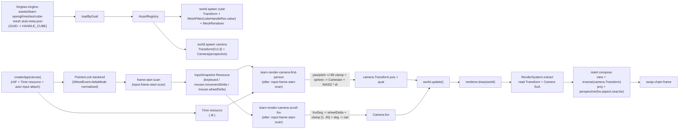

# Camera (LearnOpenGL §1.7)

> [!NOTE]
> **对应 LO 原章节**：[LearnOpenGL §1.7 Camera](https://learnopengl.com/Getting-started/Camera)
>
> **对应引擎能力**：feat-20260515-learn-render-getting-started + feat-20260519 (createApp + dt 速度补偿 + scroll-wheel FoV + V-2 first-class facade + V-3 punt removed) — `@forgeax/engine-input` 包（4 方法 `InputSnapshot` Resource + `mouse.wheelDelta` 闭族扩展 + frame-start scan system + browser PointerLock backend）+ `@forgeax/engine-runtime` `renderer.input.snapshot(world)` first-class facade + `Camera` 组件（9 f32 SoA 列）+ `Transform` 组件（10 f32 SoA 列）+ `@forgeax/engine-app` `createApp` (rAF + Time resource + 自动 input attach) + ECS `addSystem` 调度（charter P4 + AC-04 + AC-05 + AC-06 + AC-09）。LO §1.7 教 first-person camera：WASD 平移（dt 速度补偿）+ 鼠标 yaw/pitch + scroll-wheel FoV zoom，forgeax 把 PointerLock + DOM 事件 + `WheelEvent.deltaMode` 单位归一化 + `firstMouse` flag 全部藏进 `renderer.input.snapshot(world)` 单入口背后。

## LO §1.7 sub-example 命中度索引

| LO sub-example | 命中度 | forgeax 偏差点 |
|:--|:--|:--|
| **7.1 circle camera** (`time = glfwGetTime(); cameraPos = vec3(sin(t)*radius, 0, cos(t)*radius)`) | 偏离（OOS） | LO 7.1 是「圆周运动」入门展示；forgeax demo 直接进 7.2/7.3 first-person 形态（OOS-9：单 cube + first-person 算更落 LO §1.7 主题） |
| **7.2 keyboard_dt** (`cameraSpeed = 2.5f * deltaTime`) | 命中（cameraSpeed=2.5 SSOT 落到 `first-person-controls.ts#CAMERA_SPEED_PER_SECOND` + `world.getResource<TimeResource>('Time').dt` 帧时间消费） | LO 用 `glfwGetTime()` 自维护 `lastFrame` / `currentFrame` 差值；forgeax 让 `engine-app` frame-loop 写 `Time` resource，system fn 直读 `dt`（plan-decisions D-1：dt 走 Time resource，不扩 fn callback 签名） |
| **7.3 mouse_zoom** (`fov -= yoffset`) | 命中（`createScrollFovAccumulator` 维护 `fovDeg` 初始 45 + clamp [1, 45] + 每帧写 `Camera.fov = fovDeg * Math.PI / 180`） | LO `Zoom` 字段单位是度数；forgeax `Camera.fov` 字段单位是弧度（plan-decisions D-4：unit conversion 在 system fn 内部完成，LO 数值 SSOT 1°/45° 仍用度表达）；`InputSnapshot.mouse.wheelDelta` 是 sign-discrete notch（D-5 deltaMode 归一化），不是 raw `WheelEvent.deltaY` 像素 |
| **7.4 camera_class** (`Camera` C++ class 封装 `Position / Front / Up / Right + ProcessKeyboard / ProcessMouseMovement / ProcessMouseScroll`) | 偏离（OOS） | forgeax 不引入 `Camera` 类型封装；camera 状态分散到 ECS：`Transform`（位置 + 朝向四元数）+ `Camera`（投影参数）+ first-person system fn closure（yaw/pitch/fov 累加器）；OOS-9 显式：ECS 数据驱动 vs OOP 状态封装的取舍 |

## 这个示例展示什么

LO §1.7 的核心论点是「用 `glfwSetCursorPosCallback / mouse_callback` 接绝对鼠标坐标 + 自维护 `lastX / lastY / firstMouse` 全局状态求 delta；用 `glfwSetScrollCallback / scroll_callback` 接滚轮 yoffset 改 fov；用 `processInput(window) + glfwGetKey + cameraSpeed = 2.5 * deltaTime` 帧时间归一化的 WASD 平移。forgeax 把同样的语义切成三层（charter P4 + AC-05 + AC-06 + AC-09）：

1. **`renderer.input.snapshot(world)` 5 字段 SDK** — `keyboard.down(key)` / `keyboard.up(key)` / `mouse.movementDelta` / `mouse.button(0|1|2)` / `mouse.wheelDelta`（闭族扩展，feat-20260519 D-7）。frame-loop 帧首跑 frame-start scan system 把 `InputBackend.sample()` 的 PointerLock-累加结果冻结进 `InputSnapshot` Resource；AI 用户**不写 `addEventListener('mousemove' | 'wheel')` / `requestPointerLock()` / `lastX = ...; firstMouse = false` / `WheelEvent.deltaMode` 分支**，调 `renderer.input.snapshot(world)` 即得当帧 5 字段（charter P4 一致抽象）

2. **dt 速度补偿** — `world.getResource<TimeResource>('Time')?.dt` 由 `engine-app` frame-loop 帧首写入（`Time` resource SSOT, plan D-1）；first-person system fn body 用 `cameraSpeed * dt` 整合位移，60fps 2 帧 = 30fps 1 帧（math 上等价，单测 `camera-dt-equivalence.test.ts` 锁住）

3. **scroll-wheel FoV zoom** — 独立 scroll system fn 维护 `fovDeg` 闭包累加器（初始 45 + clamp [1, 45]），每帧消费 `snap.mouse.wheelDelta`（sign-discrete notch，D-5），写 `Camera.fov = fovDeg * Math.PI / 180`（D-4 弧度 vs 度单位转换在 system 内部完成）

> [!IMPORTANT]
> **forgeax 不暴露 `glfwSetCursorPosCallback / glfwSetScrollCallback / processInput / firstMouse / glfwGetKey / WheelEvent.deltaMode` 这类浏览器/GLFW 细节**；AI 用户写「我要 WASD 平移（dt 补偿）+ 鼠标 yaw/pitch + 滚轮 FoV zoom 的 first-person camera」就是 `world.addSystem(/* fn body 读 renderer.input.snapshot(world) + dt + 写 Transform + Camera */)`，引擎在 `world.update()` 内部按 DAG 顺序先跑 frame-start scan（PointerLock + Wheel 累加 → InputSnapshot Resource）、再跑 camera + scroll system（消费 InputSnapshot → 写 Transform + Camera.fov）（charter P4 一致抽象 + plan-strategy D-1/D-2/D-4/D-5/D-7）。AI 用户不学 `glfwSetCursorPosCallback` / `mouse_callback` / `firstMouse` / `glm::lookAt` / `WheelEvent.deltaMode` 词汇——`renderer.input.snapshot(world)` 5 字段 + `Transform` + `Camera` 三类标量 SoA 列 + `Time` resource 是唯一对外 surface。

## dt 速度补偿（LO §1.7.2）

LO §1.7.2 把 `cameraSpeed = 2.5f * deltaTime` 单列为一个教学子项。原文核心引文：

> "When pressing W you would move the position of the camera with cameraSpeed * cameraFront ... however an issue arises when working with movement that's based on the speed at which a frame can be processed: the user with the slow system would move much slower than the user with the fast system. ... A common technique is to use deltaTime ..." — [LearnOpenGL §1.7.2 Camera (Movement Speed)](https://learnopengl.com/Getting-started/Camera#:~:text=cameraSpeed%20%3D%202.5f%20%2A%20deltaTime)

LO C++ 实现：每帧主循环顶部 `currentFrame = glfwGetTime(); deltaTime = currentFrame - lastFrame; lastFrame = currentFrame;`，再在 `processInput` 里 `cameraSpeed = 2.5f * deltaTime`。

forgeax 把 dt 集中到 `engine-app` frame-loop 的 `Time` resource（SSOT，plan-decisions D-1）。demo 端的 first-person system fn 一行 `const dt = world.getResource<TimeResource>('Time')?.dt ?? 0;` 即得，不扩 ECS `addSystem({ fn })` 的 fn callback 签名（OOS-6 兼容）。WASD 整合走 `first-person-controls.ts#computeWasdDisplacement(dt, fwd, right, held)` 纯函数（charter P5：单测 + system fn 共消费）。

| 维度 | LO C++ default | forgeax default |
|:--|:--|:--|
| dt 来源 | `glfwGetTime()` 自维护 `lastFrame` | `engine-app` frame-loop 写 `Time` resource，system fn 读 |
| 速度常量 | `2.5f` (代码 magic number) | `CAMERA_SPEED_PER_SECOND = 2.5` (SSOT in `first-person-controls.ts`) |
| 等价语义验证 | LO 教程文字段说明 | `camera-dt-equivalence.test.ts` unit test (60fps 2 帧 vs 30fps 1 帧 ε ≤ 1e-9) |

## scroll-wheel FoV zoom（LO §1.7.3）

LO §1.7.3 把 scroll-wheel zoom 单列为一个教学子项。原文核心引文：

> "We're going to introduce a small zoom interface ... Whenever the user scrolls, the yoffset value tells us the amount we scrolled vertically. When the scroll_callback function is called we change the contents of the globally declared fov variable. Because 45.0 is the default fov value we want to constrain the zoom level between 1.0 and 45.0." — [LearnOpenGL §1.7.3 Camera (Zoom)](https://learnopengl.com/Getting-started/Camera#:~:text=void%20scroll_callback)

LO C++ 实现：`scroll_callback(double xoffset, double yoffset) { fov -= (float)yoffset; if (fov < 1.0f) fov = 1.0f; if (fov > 45.0f) fov = 45.0f; }`，主循环里 `glm::perspective(glm::radians(fov), ...)` 把度数 fov 转弧度后送 GPU。

forgeax 让 PointerLock backend 在收到 `WheelEvent` 时不直接累加 `event.deltaY`（跨浏览器 `deltaMode` 会让 trackpad 触发 100+ deltaY，clamp 边界一帧到顶），而是按 `Math.sign(event.deltaY)` 离散化为 `±1` notch（plan-decisions D-5：sign-discrete normalization；trade-off 是 trackpad 失去精细 zoom 速度）。`InputSnapshot.mouse.wheelDelta` 字段单位是「discrete notches per frame, sign indicates direction」（D-7 闭族扩展）。

demo 端独立 scroll system 维护 `fovDeg`（度数 LO 教学单位）累加器：`fovDeg -= wheelDelta`（LO 公式）+ clamp [1, 45]，每帧写 `Camera.fov = fovDeg * Math.PI / 180`（plan-decisions D-4：forgeax `Camera.fov` 字段单位是弧度，system fn 内部 unit 转换）。`createScrollFovAccumulator()` 是纯函数 closure 工厂（charter P5：`camera-fov-zoom.test.ts` unit test + system fn 共消费）。

| 维度 | LO C++ default | forgeax default |
|:--|:--|:--|
| wheel 事件接收 | `glfwSetScrollCallback(window, scroll_callback)` 全局 callback | PointerLock backend 内部 `wheel` listener，`InputSnapshot.mouse.wheelDelta` 5 字段 SDK |
| 单位归一化 | yoffset 直入（GLFW spec 给定离散 notch） | `Math.sign(event.deltaY)` 离散化（D-5：跨浏览器 `deltaMode` 防 trackpad clamp 一帧到顶） |
| fov 字段单位 | `fov` C++ 全局 = 度（45.0f / 1.0f） | `Camera.fov` ECS 字段 = 弧度 (Math.PI / 4 = 45 deg) |
| 单位转换落点 | `glm::perspective(glm::radians(fov), ...)` 主循环 | scroll system fn `Camera.fov = fovDeg * Math.PI / 180`（D-4） |
| Clamp 数值 | `if (fov < 1.0f) fov = 1.0f; if (fov > 45.0f) fov = 45.0f;` | `if (fovDeg < 1) fovDeg = 1; if (fovDeg > 45) fovDeg = 45;` (LO 数值 SSOT 保留度数) |

## 渲染流程



## 引擎用法

```ts
// 来自 src/index.ts 的关键片段（三段式注释 AC-06）。

// 1. engine usage - 引擎公开符号集
import { createApp } from '@forgeax/engine-app';
import { AssetGuid } from '@forgeax/engine-pack/guid';
import {
  Camera, EngineEnvironmentError, HANDLE_CUBE,
  MeshRenderer, MeshFilter, Transform,
} from '@forgeax/engine-runtime';
import type { MaterialAsset, MeshAsset } from '@forgeax/engine-types';
import {
  CAMERA_SPEED_PER_SECOND, computeWasdDisplacement, createScrollFovAccumulator,
} from './first-person-controls';

// 2. example-specific glue - LO §1.7 first-person tuning + GUID literals
const CUBE_MESH_GUID     = '019e3968-6007-71ae-856e-1fd6c9728cfb';
const CUBE_MATERIAL_GUID = '019e2cc7-3a01-7c22-8f70-501bd9e74206';
const CAMERA_PROJECTION_PERSPECTIVE = 0;
const CAMERA_FOV_RADIANS = Math.PI / 4;
const PITCH_CLAMP_RAD    = (89 * Math.PI) / 180;
const MOUSE_SENSITIVITY  = 0.002; // radians per pixel

// 3. bootstrap - createApp + loadByGuid + spawn cube + camera + first-person + scroll systems
const appRes = await createApp(canvas, { clearColor: [0.2, 0.3, 0.3, 1.0] });
if (!appRes.ok) { /* report + return */ }
const app = appRes.value;
const renderer = app.renderer;
const world = app.world;

const assets = renderer.assets;
assets.registerWithGuid<MeshAsset>(cubeGuid, cubeAsset.value);
assets.registerWithGuid<MaterialAsset>(matGuid, { kind: 'material', shadingModel: 'unlit', baseColor: [1.0, 0.5, 0.2, 1.0] });
const cubeHandleRes = await assets.loadByGuid<MeshAsset>(cubeGuid);
const matHandleRes  = await assets.loadByGuid<MaterialAsset>(matGuid);

// MeshFilter binds cubeHandleRes.value (GUID-derived user-handle); the
// engine pipelineState.meshes alias map covers user-handle (>=1024) ids
// (V-3 punt removed in feat-20260519, plan-decisions D-3).
world.spawn(
  { component: Transform,  data: { pos: [0, 0, 0], quat: [0, 0, 0, 1], scale: [1, 1, 1] } },
  { component: MeshFilter, data: { assetHandle: cubeHandleRes.value } },
  { component: MeshRenderer, data: { material: matHandleRes.value } },
);
world.spawn(
  { component: Transform, data: { pos: [0, 0, 3], quat: [0, 0, 0, 1], scale: [1, 1, 1] } },
  { component: Camera,    data: { fov: CAMERA_FOV_RADIANS, aspect: canvas.width / canvas.height, near: 0.1, far: 100, projection: CAMERA_PROJECTION_PERSPECTIVE, left: -1, right: 1, bottom: -1, top: 1 } },
);

// First-person camera system: dt-driven WASD + mouse yaw/pitch.
let yaw = 0, pitch = 0;
world.addSystem({
  name: 'learn-render-camera-first-person',
  after: ['input-frame-start-scan'],
  queries: [{ with: [Transform, Camera] }],
  fn: (queryResults) => {
    const snap = renderer.input.snapshot(world);
    if (snap === undefined) return;
    const dt = world.getResource<{ readonly dt: number }>('Time')?.dt ?? 0;
    const dx = snap.mouse.movementDelta.x;
    const dy = snap.mouse.movementDelta.y;
    yaw   += dx * MOUSE_SENSITIVITY;
    pitch -= dy * MOUSE_SENSITIVITY;
    if (pitch >  PITCH_CLAMP_RAD) pitch =  PITCH_CLAMP_RAD;
    if (pitch < -PITCH_CLAMP_RAD) pitch = -PITCH_CLAMP_RAD;
    const cy = Math.cos(yaw),   sy = Math.sin(yaw);
    const cp = Math.cos(pitch), sp = Math.sin(pitch);
    const fwdX = cy * cp, fwdY = sp, fwdZ = sy * cp;
    const rightX = fwdZ,  rightZ = -fwdX;
    const held = {
      w: snap.keyboard.down('KeyW'), s: snap.keyboard.down('KeyS'),
      a: snap.keyboard.down('KeyA'), d: snap.keyboard.down('KeyD'),
    } as const;
    const disp = computeWasdDisplacement(dt, { x: fwdX, y: fwdY, z: fwdZ }, { x: rightX, y: 0, z: rightZ }, held);
    // for each camera entity: pos[i*3] += disp.x; pos[i*3+1] += disp.y; pos[i*3+2] += disp.z;
    // Encode forward direction into Transform.quat (Tait-Bryan Y * X).
  },
});

// Scroll-wheel FoV zoom system (independent addSystem, plan-decisions D-4).
const scrollAcc = createScrollFovAccumulator();
world.addSystem({
  name: 'learn-render-camera-scroll-fov',
  after: ['input-frame-start-scan'],
  queries: [{ with: [Camera] }],
  fn: (queryResults) => {
    const snap = renderer.input.snapshot(world);
    if (snap === undefined) return;
    scrollAcc.apply(snap.mouse.wheelDelta);
    // for each Camera entity: bundles.Camera.fov[i] = scrollAcc.fovRad;
  },
});

app.start();
```

`forgeax-engine-assets/learn-opengl/meshes/cube-mesh.stub.meta.json` 是一个空文件 `cube-mesh.stub` 的同名 sidecar（同 §1.4 / §1.5 / §1.6 同型 procedural 形态）；`subAssets[0].guid` 由 `forgeax-engine-console asset import` 一次性铸造（reimport byte-identical）。runtime 阶段 `loadByGuid` 不感知物理路径——它只认 GUID，pack-index 把 GUID 翻译成 URL 或回落到 `registerWithGuid` 的内存表。


## 与 LO 原版的差异

| 维度 | LO 原版（C++ / GLFW） | forgeax 这里（TS / WGSL） |
|:--|:--|:--|
| 鼠标事件接收 | `glfwSetCursorPosCallback(window, mouse_callback)` 注册全局回调；`mouse_callback(GLFWwindow*, double xpos, double ypos)` 接绝对坐标 | `attachBrowserInputBackend(canvas)` 把 PointerLock + `mousemove` + `keydown/keyup` 全部藏进 `InputBackend.sample()`；AI 用户调 `engine.input.snapshot()` 拿当帧 `mouse.movementDelta = { x, y }`（已是 delta，不需 firstMouse） |
| 首帧抖动处理 | `if (firstMouse) { lastX = xpos; lastY = ypos; firstMouse = false; }` 三全局变量 + 初始化分支 | 浏览器侧 PointerLock movementX/Y 已是相对 delta（W3C spec），不需 firstMouse flag；AI 用户**完全不写**这个分支（charter P4 屏蔽实现细节） |
| Y 翻转 | `lastY - ypos`（GLFW 屏幕坐标 y 向下增加 → 需手翻） | forgeax 不翻转 movementY（PointerLock 已是数学坐标系 dy 向下增加）；first-person system 用 `pitch -= dy` 实现 LO「向上抬头视觉」语义（LO 1.7 §Look around 第 2 段 explicit 说明） |
| 灵敏度系数 | 在 `mouse_callback` 内部 `xoffset *= sensitivity; yoffset *= sensitivity;` 二次乘法 | `MOUSE_SENSITIVITY` 常量在 first-person system fn body 一次乘法（`yaw += dx * MOUSE_SENSITIVITY`） |
| Pitch clamp | `if (pitch > 89.0f) pitch = 89.0f; if (pitch < -89.0f) pitch = -89.0f;` 度数 | `if (pitch > PITCH_CLAMP_RAD) pitch = PITCH_CLAMP_RAD;` 弧度（forgeax 内部 yaw/pitch 全用弧度，与 `Math.sin/cos` 契合） |
| 球极→Cartesian | `front.x = cos(glm::radians(yaw)) * cos(glm::radians(pitch)); front.y = sin(glm::radians(pitch)); front.z = sin(glm::radians(yaw)) * cos(glm::radians(pitch)); cameraFront = glm::normalize(front);` 公式同 + 弧度转换 | `fwdX = cos(yaw) * cos(pitch); fwdY = sin(pitch); fwdZ = sin(yaw) * cos(pitch);`（弧度直入；不需 normalize：cos²(pitch) + sin²(pitch) = 1） |
| View 矩阵构造 | `view = glm::lookAt(cameraPos, cameraPos + cameraFront, cameraUp);` 显式 lookAt 调用 | camera entity 持 `Transform.pos + quat`；first-person system 把 yaw/pitch 编码成四元数（Tait-Bryan Y * X）写回 `Transform.quat`；引擎 `RenderSystem` 内部 `view = inverse(camera.Transform)`；AI 用户**不写 glm::lookAt** |
| WASD 键查询 | `processInput(window)` 在主循环显式调用；body 内 `if (glfwGetKey(window, GLFW_KEY_W) == GLFW_PRESS) cameraPos += cameraSpeed * cameraFront;` | first-person system fn body 直读 `snapshot.keyboard.down('KeyW')`；不写 `processInput` 函数封装（charter P4 一致抽象：`addSystem` 是 ECS schedule 的统一调度入口） |
| 键名 | `GLFW_KEY_W / GLFW_KEY_S / GLFW_KEY_A / GLFW_KEY_D` 整数枚举 | DOM `KeyboardEvent.code` 字符串字面量 `'KeyW' / 'KeyS' / 'KeyA' / 'KeyD'`（W3C UI Events spec；与键盘布局无关） |
| `cameraSpeed * deltaTime` | `float cameraSpeed = 2.5f * deltaTime;` 帧时间乘法 | `KEYBOARD_SPEED` 常量（M11 MVP 不做帧时间归一化；feat-20260515 OOS-1 显式不做 deltaTime 调度，是引擎层下一个 feat 的工作） |
| 隐藏鼠标 + capture | `glfwSetInputMode(window, GLFW_CURSOR, GLFW_CURSOR_DISABLED)` 显式 cursor disable + capture | `canvas.requestPointerLock()` 由 `attachBrowserInputBackend` 内部 click 监听调用（W3C PointerLock API；用户首次点击 canvas 触发）；AI 用户**不写**（charter P4） |
| 错误处理 | `glm::lookAt` / `mouse_callback` 默认无错误返回；`firstMouse` 初始化漏写时 yaw/pitch 跳变；`pitch > 89` 漏写时 view 矩阵翻转产生 gimbal flip — 全部是静默 misbehaviour | forgeax 用结构化错误（`err.code` 闭族 `RhiErrorCode 18` + `EcsErrorCode 23` + `err.expected` / `err.hint` / `err.detail`）；AI 用户 `switch (err.code)` exhaustive narrow，不解析 `err.message`（charter P3） |
| 数据流向 | CPU 端单线程顺序：mouse_callback ← DOM → 改全局 lastX/lastY/yaw/pitch → main loop processInput → 改全局 cameraPos → 发 view/proj uniform → draw | ECS 数据流：DOM event → InputBackend 累加 → frame-start scan system 帧首冻结成 InputSnapshot Resource → first-person camera system 读 Resource + 写 Transform SoA 列 → RenderSystem 一次 query 抓取 → mat4 compose → draw |

## 关键代码量

| 文件 | 行数 | 角色 |
|:--|---:|:--|
| `src/index.ts` | ~430 | 三段式（引擎使用 + 示例胶水 + 启动）+ cube + camera spawn + first-person system fn + capture hook + 测试 harness 自动安装 |
| `assets/cube-mesh.stub.meta.json` | ~15 | cube 别名 sidecar（GUID 映射到引擎内置 HANDLE_CUBE） |
| `src/__tests__/camera.browser.test.ts` | ~230 | vitest browser e2e（AC-04 + AC-05 + AC-06 + AC-07 + AC-22 四段断言：3-section markers + InputSnapshot consumption / cube-mesh.stub.meta.json schema / Engine WebGPU path / yaw-pitch +/- 89 deg clamp + sphere -> Cartesian） |
| `src/__tests__/camera-input.dawn.test.ts` | ~140 | vitest dawn e2e（AC-07 frame-start scan 4 项行为：Resource write / WASD held keys / mouse delta per-frame / up-edge collapse） |
| `scripts/smoke-dawn.mjs` | ~430 | dawn-node 端到端 smoke：build + 启动 + 加载 cube + synthetic InputBackend 驱动 first-person 序列（前 60 帧 W 前进 + 60 帧 D 横移 + 80 帧鼠标 yaw + 80 帧鼠标 pitch）+ 300 帧 + pixel readback ε ≤ 0.05 |
| `scripts/bench-screenshot.mjs` | ~180 | playwright + chrome-beta 录制 round-7-camera.png 入 forgeax-engine-assets/ submodule |

## 运行

```bash
# 开发服务器（vite preview 端口 5186）
pnpm --filter "@forgeax/app-learn-render-1-getting-started-7-camera" dev

# 构建（产出 dist/）
pnpm --filter "@forgeax/app-learn-render-1-getting-started-7-camera" build

# vitest browser e2e（chromium + WebGPU）
pnpm test:browser

# vitest dawn e2e（dawn-node 原生绑定）
pnpm test:dawn

# dawn-node 300 帧 smoke + pixel readback
pnpm --filter "@forgeax/app-learn-render-1-getting-started-7-camera" smoke

# 录制 golden PNG（forgeax-engine-assets 子模块）
pnpm --filter "@forgeax/app-learn-render-1-getting-started-7-camera" exec node scripts/bench-screenshot.mjs

# pixel-parity bench（含 camera entry 比对 round-7-camera.png）
pnpm bench:pixel-parity
```

<details>
<summary>LO 原版 C++/GLSL 关键片段（参考用）</summary>

LO §1.7 在 `src/1.getting_started/7.4.camera_class/camera_class.cpp` + `7.3.camera_mouse_zoom/camera_mouse_zoom.cpp` 的核心代码（来自 [JoeyDeVries/LearnOpenGL master 分支](https://github.com/JoeyDeVries/LearnOpenGL)）：

```cpp
// camera_mouse_zoom.cpp -- glfw mouse_callback + processInput + WASD
#include <GLFW/glfw3.h>
#include <glm/glm.hpp>
#include <glm/gtc/matrix_transform.hpp>

// camera state
glm::vec3 cameraPos   = glm::vec3(0.0f, 0.0f,  3.0f);
glm::vec3 cameraFront = glm::vec3(0.0f, 0.0f, -1.0f);
glm::vec3 cameraUp    = glm::vec3(0.0f, 1.0f,  0.0f);

// mouse callback state
bool firstMouse = true;
float yaw   = -90.0f; // initial yaw -90 so cameraFront points at -z
float pitch =   0.0f;
float lastX =  800.0f / 2.0f;
float lastY =  600.0f / 2.0f;
float fov   =  45.0f;

// glfwSetCursorPosCallback wires this into the GLFW window
void mouse_callback(GLFWwindow* window, double xpos, double ypos)
{
    if (firstMouse)
    {
        lastX = xpos;
        lastY = ypos;
        firstMouse = false;
    }

    float xoffset = xpos - lastX;
    float yoffset = lastY - ypos; // reversed: y-coordinates go from bottom to top
    lastX = xpos;
    lastY = ypos;

    float sensitivity = 0.1f;
    xoffset *= sensitivity;
    yoffset *= sensitivity;

    yaw   += xoffset;
    pitch += yoffset;

    // make sure that when pitch is out of bounds, screen doesn't get flipped
    if (pitch > 89.0f)
        pitch = 89.0f;
    if (pitch < -89.0f)
        pitch = -89.0f;

    glm::vec3 front;
    front.x = cos(glm::radians(yaw)) * cos(glm::radians(pitch));
    front.y = sin(glm::radians(pitch));
    front.z = sin(glm::radians(yaw)) * cos(glm::radians(pitch));
    cameraFront = glm::normalize(front);
}

void processInput(GLFWwindow *window)
{
    if (glfwGetKey(window, GLFW_KEY_ESCAPE) == GLFW_PRESS)
        glfwSetWindowShouldClose(window, true);

    float cameraSpeed = static_cast<float>(2.5 * deltaTime);
    if (glfwGetKey(window, GLFW_KEY_W) == GLFW_PRESS)
        cameraPos += cameraSpeed * cameraFront;
    if (glfwGetKey(window, GLFW_KEY_S) == GLFW_PRESS)
        cameraPos -= cameraSpeed * cameraFront;
    if (glfwGetKey(window, GLFW_KEY_A) == GLFW_PRESS)
        cameraPos -= glm::normalize(glm::cross(cameraFront, cameraUp)) * cameraSpeed;
    if (glfwGetKey(window, GLFW_KEY_D) == GLFW_PRESS)
        cameraPos += glm::normalize(glm::cross(cameraFront, cameraUp)) * cameraSpeed;
}

int main()
{
    // ... (glfwInit, window creation, GLAD load, shader compile)

    // hide cursor + capture into the window
    glfwSetInputMode(window, GLFW_CURSOR, GLFW_CURSOR_DISABLED);
    glfwSetCursorPosCallback(window, mouse_callback);

    while (!glfwWindowShouldClose(window))
    {
        processInput(window);

        glClearColor(0.2f, 0.3f, 0.3f, 1.0f);
        glClear(GL_COLOR_BUFFER_BIT | GL_DEPTH_BUFFER_BIT);

        ourShader.use();

        glm::mat4 projection = glm::perspective(glm::radians(fov), (float)SCR_WIDTH / (float)SCR_HEIGHT, 0.1f, 100.0f);
        ourShader.setMat4("projection", projection);

        glm::mat4 view = glm::lookAt(cameraPos, cameraPos + cameraFront, cameraUp);
        ourShader.setMat4("view", view);

        // ... (draw cubes)

        glfwSwapBuffers(window);
        glfwPollEvents();
    }
}
```

`glfwSetCursorPosCallback` / `mouse_callback` / `processInput` / `firstMouse` / `lastX` / `lastY` / `yaw` / `pitch` / `pitch > 89.0f` / `pitch < -89.0f` / `glm::radians(yaw)` / `glm::radians(pitch)` / `cos(glm::radians(yaw)) * cos(glm::radians(pitch))` / `sin(glm::radians(pitch))` / `glm::normalize(front)` / `cameraFront` / `cameraPos` / `cameraUp` / `cameraSpeed * cameraFront` / `glm::cross(cameraFront, cameraUp)` / `glm::lookAt(cameraPos, cameraPos + cameraFront, cameraUp)` / `glfwGetKey(window, GLFW_KEY_W)` / `GLFW_KEY_W` / `GLFW_KEY_S` / `GLFW_KEY_A` / `GLFW_KEY_D` / `GLFW_CURSOR_DISABLED` / `glfwSetInputMode` 共 30 个 LO §1.7 关键 GLFW / GLM 标识在本折叠块全部命中（grep 闸门 AC-23 + T-M11-04 description）。

</details>

> [!IMPORTANT]
> **AC-24 err.code 差异行**：forgeax 浏览器侧 `mouse.movementDelta` 已经是 PointerLock 给出的 per-frame delta（W3C `MouseEvent.movementX/Y` spec），不需 `firstMouse` flag；通过 `InputSnapshot` 单入口屏蔽 PointerLock 浏览器细节；frame-start scan 失败 / `world.update()` 调度异常 / `Camera.fov === 0` 等 LO 静默场景，全部走 `err.code` 闭族（`RhiErrorCode 18` + `EcsErrorCode 23` + `InspectorErrorCode 6`）+ `err.expected` / `err.hint` / `err.detail`，AI 用户 exhaustive `switch (err.code)` 收敛（charter P3 显式失败）。
