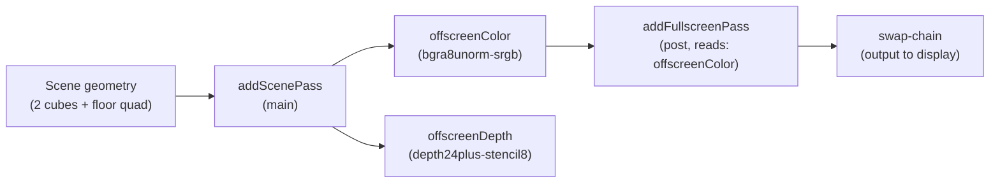

# Framebuffers (LearnOpenGL section 4.advanced-opengl 5)

> [!NOTE]
> **LO original chapter**: [LearnOpenGL 4.5 Framebuffers](https://learnopengl.com/Advanced-OpenGL/Framebuffers)
>
> **Engine surface**: custom `RenderPipeline` with offscreen render-to-texture + `addFullscreenPass` with 6 swappable post-process effects (passthrough / inversion / grayscale / sharpen / blur / edge-detection) driven by keyboard digits 1--6.

## Hit-rate index (AI user fast-locate)

| Engine capability | grep anchor | Where |
|:--|:--|:--|
| `addColorTarget` offscreen RT | `offscreenColor` | `src/index.ts` (makeEffectPipeline) |
| `addScenePass` with custom RT routing | `_routeFromOpts` | `src/index.ts` (makeEffectPipeline) |
| `addFullscreenPass` with reads from offscreen RT | `addFullscreenPass` | `src/index.ts` (makeEffectPipeline, one call per pipeline) |
| `renderer.postProcess.register` WGSL binding | `postProcess.register` | `src/index.ts` (section 3, 6 inline calls) |
| `renderer.registerPipeline` + `installPipeline` hot-swap | `registerPipeline` | `src/index.ts` (section 3, 6 inline calls + installPipelineByKey export) |
| `graph.compile` validation + error path | `graph.compile` | `src/index.ts` (makeEffectPipeline closure) |

## What this example shows

LO 4.5 demonstrates framebuffer objects (FBO): render the scene into an offscreen colour attachment, then re-sample that attachment through a fullscreen quad shader to apply post-process effects. The tutorial walks through a single effect (inversion), introduces a kernel-based blur, and finishes with a kernel-based edge-detection pass.

In forgeax, this example expresses the same pattern as a declarative render-graph pipeline with six hot-swappable effects:

1. **Offscreen render-to-texture**: each pipeline declares `addColorTarget('offscreenColor', bgra8unorm-srgb, swapchain-size)` + `addColorTarget('offscreenDepth', depth24plus-stencil8)`. The `addScenePass` routes scene geometry into these offscreen targets (bypassing the engine's default swap-chain colour path via `_routeFromOpts: true`).

2. **Fullscreen post-process pass**: `addFullscreenPass(graph, 'post', { shader: 'learn-render-5::<effect>', color: 'swapchain', reads: ['offscreenColor'] })` re-samples the offscreen colour texture through a fullscreen quad. The `color: 'swapchain'` key is a reserved sentinel: `graph.compile` accepts it without an `addColorTarget` declaration, and the dispatcher resolves it to the current swap-chain view.

3. **Six swappable effects**: each effect is a pair of `renderer.postProcess.register(...)` + `renderer.registerPipeline(...)` calls. The pipelines share the same offscreen-RT topology but differ only in the `addFullscreenPass` shader id. `installPipeline(handle)` hot-swaps the active pipeline at runtime without recreating the renderer.

4. **Effect roster** (key 1--6):

| Key | Effect | Shader | Notes |
|:--|:--|:--|:--|
| 1 | passthrough | `passthrough.wgsl` | Identity pass; baseline pixel-exact output |
| 2 | inversion | `inversion.wgsl` | `1 - sample.rgb` |
| 3 | grayscale | `grayscale.wgsl` | rec.709 luma: `0.2126*r + 0.7152*g + 0.0722*b` |
| 4 | sharpen | `sharpen.wgsl` | 3x3 Laplacian kernel: edge enhancement |
| 5 | blur | `blur.wgsl` | 3x3 box-blur kernel |
| 6 | edge-detection | `edge-detection.wgsl` | 3x3 Laplacian kernel: edge highlighting |

The scene uses two unlit textured cubes and a floor quad (the canonical LO 4.5 layout). Shading is intentionally unlit (`forgeax::default-unlit`) so the visual delta between effects is dominated by the post-process pass, not by per-cube lighting.

## Run

```bash
# Dev server (port 5181)
pnpm --filter "@forgeax/app-learn-render-4-advanced-opengl-5-framebuffers" dev

# Build
pnpm --filter "@forgeax/app-learn-render-4-advanced-opengl-5-framebuffers" build

# Smoke (dawn-node pixel-readback)
pnpm --filter "@forgeax/app-learn-render-4-advanced-opengl-5-framebuffers" smoke

# Typecheck
pnpm --filter "@forgeax/app-learn-render-4-advanced-opengl-5-framebuffers" typecheck
```

## Controls

Press digits **1--6** to switch between the six post-process effects. The current effect name is shown in the top-left HUD overlay.

| Key | Effect |
|:--|:--|
| 1 | passthrough |
| 2 | inversion |
| 3 | grayscale |
| 4 | sharpen |
| 5 | blur |
| 6 | edge-detection |

## Architecture



The pipeline topology is fixed; only the `addFullscreenPass` shader identity changes when the user presses a digit key. `installPipeline(handle)` swaps the active `RenderPipeline` at runtime, which causes the renderer to build a new per-frame graph on the next draw -- same offscreen-RT topology, different fullscreen shader.

## forgeax-vs-LearnOpenGL mapping

| LO concept | LO C++ / OpenGL | forgeax equivalent |
|:--|:--|:--|
| Framebuffer object (FBO) | `glGenFramebuffers` + `glBindFramebuffer` + `glFramebufferTexture2D` | `addColorTarget` (declarative render-graph) |
| Colour attachment | `glFramebufferTexture2D(GL_FRAMEBUFFER, GL_COLOR_ATTACHMENT0, ...)` with `GL_RGB` internal format | `addColorTarget('offscreenColor', { format: 'bgra8unorm-srgb', ... })` |
| Depth attachment | `glFramebufferRenderbuffer(GL_DEPTH_STENCIL_ATTACHMENT, ...)` | `addColorTarget('offscreenDepth', { format: 'depth24plus-stencil8', ... })` |
| Render-to-FBO then re-sample | First pass: bind FBO + draw; second pass: unbind FBO + bind texture + fullscreen quad | `addScenePass` (route to offscreen) + `addFullscreenPass` (re-sample offscreen into swap-chain) |
| Fullscreen quad | Hand-crafted 6-vertex quad (NDC [-1,1]) | Engine-builtin fullscreen draw (handled by `addFullscreenPass` internally) |
| Kernel convolution | `float offset = 1.0 / 300.0; vec2 offsets[9] = ...; float kernel[9] = ...` in fragment shader | Identical WGSL kernel literal in each `*.wgsl` file; `texelSize` via `1.0 / vec2(textureDimensions(screenTexture, 0))` |
| Post-process shaders | Inline GLSL fragments in `framebuffers.cpp` | Six separate `*.wgsl` files, one `@fragment fs_main` per file |
| Keyboard input | GLFW `processInput(GLFWwindow*)` checking `glfwGetKey` per key | `window.addEventListener('keydown', ...)` in dev mode, `installPipelineByKey(export)` for smoke harness |
| Scene | Two cubes + floor (container.jpg + metal.png) | Identical scene: two `HANDLE_CUBE` + one `HANDLE_QUAD` (floor) with the same textures |
| Window + loop | `glfwCreateWindow` + `while(!glfwWindowShouldClose)` | `createApp(canvas, opts)` from `@forgeax/engine-app` |

## Differences from the LearnOpenGL original

| Dimension | LO original (C++ / GLSL / GLFW) | forgeax here (TS / WGSL / WebGPU) |
|:--|:--|:--|
| FBO allocation | Manual: `glGenFramebuffers` + `glBindFramebuffer` + `glFramebufferTexture2D` + `glFramebufferRenderbuffer` + `glCheckFramebufferStatus` | Declarative: `graph.addColorTarget(name, desc)` in `buildGraph`; `graph.compile(...)` does device allocation + validation |
| Re-sampling pass | Manual: unbind FBO, bind attachment texture, draw fullscreen quad | Declarative: `addFullscreenPass(graph, 'post', { shader: id, reads: ['offscreenColor'] })` -- graph inserts barriers and dispatches draw internally |
| Effect switching | One FBO + one quad shader per demo; separate app state handles which effect is active | Six `RenderPipeline` implementations, hot-swapped via `installPipeline(handle)`; per-frame graph rebuilds with the new shader id |
| Floor texture tiling | `GL_REPEAT` wrap mode + quad UV range making metal.png tile across the floor | **Known difference**: `default-unlit` material has no tiling/offset paramValues (research F-A3). The 5x5 floor quad stretches a single metal.png tile across the entire floor instead of repeating it 5x5 times. The post-process effect demonstration is preserved; the visual floor texture density is coarser. |
| Colour space | OpenGL with sRGB framebuffer on LDR formats | Offscreen colour target uses `bgra8unorm-srgb` (hardware sRGB encode on store, sRGB decode on sample via `TextureSampleType::Float`). The inversion smoke check (AC-03 pixel-diff epsilon <= 0.05) covers the sRGB encode/decode round-trip. |
| Post-process shader organisation | All effect shaders in one `framebuffers.cpp` file as inline GLSL strings | Six separate `*.wgsl` files, each with one `@fragment fs_main` entry point. Each has a companion `*.wgsl.meta.json` sidecar (`kind: 'post-process'`) for `vite-plugin-shader` to recognise and compile at build time. |
| Shader compilation | Runtime `glCompileShader` + `glLinkProgram` | Build-time naga_oil compose via `vite-plugin-shader`; runtime `postProcess.register` only registers the pre-compiled WGSL string |
| GPU backend | OpenGL 3.3+ | WebGPU (auto-selected: Dawn-native for smoke, browser WebGPU for dev) |

> [!IMPORTANT]
> The inversion-vs-passthrough pixel-diff test (AC-03, epsilon <= 0.05) explicitly covers the sRGB encode/decode round-trip on the offscreen colour target. The smoke assertion `|B - (255 - A)| <= 0.05*255` (where A = passthrough readback, B = inversion readback) is the same linear-space colour-inversion invariant the LO tutorial uses, adjusted for the forgeax offscreen-RT format.

## Smoke

```bash
# Dawn-node pixel-readback smoke (300 frames, in-process passthrough -> inversion swap)
pnpm --filter "@forgeax/app-learn-render-4-advanced-opengl-5-framebuffers" smoke

# Falsify mode: invert the assertion -- GREEN smoke fails (exit != 0)
FORGEAX_SMOKE_FALSIFY=1 pnpm --filter "@forgeax/app-learn-render-4-advanced-opengl-5-framebuffers" smoke
```

The smoke harness:

- Boots the demo in Dawn-node (no browser/GPU driver), runs 30 warm-up frames, reads back the passthrough framebuffer (state A).
- Calls `installPipelineByKey('2')` to switch to inversion, runs 30 more frames, reads back the inversion framebuffer (state B).
- Asserts: for all pixels over the cube+floor region, `|B - (255 - A)| <= 0.05 * 255` (epsilon <= 0.05).
- `FORGEAX_SMOKE_FALSIFY=1` flips the assertion: expects the inequality to be **violated** (exit != 0), confirming the smoke is testing a real difference.

Total frames: 300 minimum (`SMOKE_MIN_FRAMES`). Zero RHI errors required (bus monitored at exit).

## Key files

| File | Lines | Role |
|:--|--:|:--|
| `src/index.ts` | ~661 | Three-section bootstrap -- scene spawn (2 cubes + floor), 6 post-process shader registrations + 6 pipeline registrations, `installPipelineByKey` named export, keydown handler with HUD overlay |
| `src/shaders/passthrough.wgsl` | ~15 | Identity fragment shader: `textureSample(screenTexture, screenSampler, in.uv)` passthrough |
| `src/shaders/inversion.wgsl` | ~15 | Colour inversion: `1.0 - textureSample(...).rgb` |
| `src/shaders/grayscale.wgsl` | ~15 | Rec.709 luma: `dot(sample.rgb, vec3(0.2126, 0.7152, 0.0722))` |
| `src/shaders/sharpen.wgsl` | ~30 | 3x3 Laplacian kernel: edge enhancement with kernel `[0,-1,0, -1,5,-1, 0,-1,0]` |
| `src/shaders/blur.wgsl` | ~30 | 3x3 box-blur kernel: average with kernel `[1/9]*9` |
| `src/shaders/edge-detection.wgsl` | ~30 | 3x3 Laplacian kernel: edge highlighting with kernel `[1,1,1, 1,-8,1, 1,1,1]` |
| `src/shaders/*.wgsl.meta.json` | 6 x ~4 | Sidecar files (`kind: 'post-process'`) for `vite-plugin-shader` build-time compilation |
| `scripts/smoke-dawn.mjs` | ~380 | Dawn-node pixel-readback smoke: boot + passthrough readback + `installPipelineByKey('2')` inversion swap + pixel-diff assertion + FALSIFY mode |

## AI user discoverability

- Directory name: `apps/learn-render/4.advanced-opengl/5.framebuffers/` mirrors LO chapter ordering
- Package name: `@forgeax/app-learn-render-4-advanced-opengl-5-framebuffers` is grep-able by chapter prefix
- Three-section source markers (`// 1. engine usage` / `// 2. example glue` / `// 3. bootstrap`) serve as grep anchors
- Six `postProcess.register` / `registerPipeline` calls are inlined with literal id strings so AI users grep either id and land on the exact registration line
- `installPipelineByKey` named export is documented in this README for smoke harness and programmatic reuse
- All custom shader callsites point to `skills/forgeax-engine-render-pipeline/SKILL.md` for the full worked-example reference