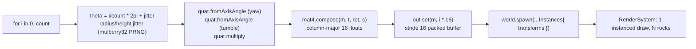

# Instancing (LearnOpenGL section 4.advanced-opengl 9)

> [!NOTE]
> **LO original chapter**: [LearnOpenGL 4.9 Instancing](https://learnopengl.com/Advanced-OpenGL/Instancing)
>
> **Engine surface**: `createApp` + `Instances` component (one entity, packed `Float32Array(N x 16)` column-major mat4) + `@forgeax/engine-math` (`quat.fromAxisAngle` + `mat4.compose`) + `Materials.standard` + vendored gltf meshes (planet + rock) loaded via `loadByGuid`.

## Hit-rate index (AI user fast-locate)

| LO sub-example | Hit? | forgeax equivalent | grep anchor |
|:--|:--|:--|:--|
| `glDrawElementsInstanced` single batched draw | **hit** | `Instances` component on one entity -> RenderSystem issues one instanced draw for all N transforms | `Instances` |
| Per-instance model matrix via instanced vertex attribute | **hit** | Packed `Float32Array(N x 16)` column-major mat4, stride 16, uploaded to a per-entity GPU storage buffer | `transforms` |
| Asteroid belt scene (`amount = 1000`+ rocks) | **hit** | `ASTEROID_COUNT = 1200` rocks orbiting a central planet (`buildAsteroidBelt`) | `ASTEROID_COUNT` |
| Per-instance transform math (`glm::translate` / `rotate` / `scale`) | **offset** | `quat.fromAxisAngle` + `mat4.compose` from `@forgeax/engine-math` -- zero hand-written quat/matrix at the demo layer (D-5) | `mat4.compose` |
| `gl_InstanceID` in vertex shader | N/A | Engine binds the per-instance transform internally; user never writes a vertex shader or touches an instance index | `Instances` |
| Planet mesh (loaded model) | **hit (vendor gltf)** | `planet.obj` -> `planet.gltf` via obj2gltf, loaded by GUID | `PLANET_MESH_GUID` |
| Asteroid mesh (loaded model) | **hit (vendor gltf)** | `rock.obj` -> `rock.gltf` via obj2gltf, loaded by GUID | `ROCK_MESH_GUID` |

## What this example shows

LO 4.9 teaches instancing: drawing the same mesh thousands of times in a single
`glDrawElementsInstanced` call, feeding a per-instance model matrix through an
instanced vertex attribute, and building an asteroid belt of ~1000+ rocks
around a planet.

In forgeax, this example demonstrates the same teaching concept through the
`Instances` ECS component:

1. **One entity, N transforms**: A single entity carries the `Instances`
   component, whose only field is `transforms` -- a packed `Float32Array` of
   `N * 16` floats (one column-major mat4 per instance, stride 16). The
   RenderSystem record stage uploads this to a per-entity GPU storage buffer and
   issues a single instanced draw, the engine equivalent of LO's one
   `glDrawElementsInstanced`.

2. **engine-math orbit transforms**: Each rock's transform is composed entirely
   with `@forgeax/engine-math` -- **no hand-written quaternion or matrix math**
   (D-5). See the packing section below.

3. **Central planet contrast**: A non-instanced `planet.obj` model (loaded via
   vendor gltf) sits at the origin (one ordinary `Transform` + `MeshFilter` +
   `MeshRenderer`), framing the instanced `rock.obj` belt around it -- the
   same planet-vs-asteroids composition LO uses.

4. **First-person camera**: `addFirstPersonSystem` from `apps/shared` lets you
   fly through the belt (the LO equivalent of GLFW keyboard camera).

## Instances consumption + column-major mat4 packing (the teaching core)

The `Instances` component is the whole point of this demo. Its contract is a
single packed buffer:

```ts
// One entity, the entire belt:
const transforms = buildAsteroidBelt(ASTEROID_COUNT); // Float32Array(N * 16)
world.spawn(
  { component: Transform, data: {} },                  // identity holder: world = instance[i]
  { component: MeshFilter, data: { assetHandle: rockMeshHandle } },
  { component: MeshRenderer, data: { material: asteroidMatRes.value } },
  { component: Instances, data: { transforms } },      // <- N column-major mat4, stride 16
);
```

> [!IMPORTANT]
> **Stride is 16, layout is column-major.** `Instances.transforms.length` must be a
> multiple of 16; the engine fails fast with `instance-transforms-stride-mismatch`
> otherwise. Each 16-float slot is a column-major mat4 (the same byte order
> `mat4.compose` writes), copied verbatim with `out.set(m, i * 16)`.

Per-instance transform composition uses only `engine-math` -- the LO `glm::translate
* rotate * scale` chain becomes one `mat4.compose(out, translation, rotation, scale)`:

```ts
// Orbit-facing yaw + a random tumble tilt, composed quat-on-quat:
quat.fromAxisAngle(rot, [0, 1, 0], theta);            // yaw around +Y
quat.fromAxisAngle(tilt, [1, 0, 0], rng() * Math.PI * 2);
quat.multiply(tumble, rot, tilt);                     // combined orientation

mat4.compose(m, t, tumble, s);                        // column-major mat4 (16 floats)
out.set(m, i * 16);                                   // pack into slot i (stride 16)
```



> [!NOTE]
> The PRNG (`mulberry32`, seeded `0x9e3779b9`) makes the belt layout **deterministic**
> across runs so the smoke's `instances=1` degenerate state is a stable subset of the
> `instances=1200` full state.

## Pipeline steps (how the engine processes the data)

```
buildAsteroidBelt(1200)                                -- pack Float32Array(1200 * 16)
  |-- per rock: quat.fromAxisAngle + quat.multiply     -- engine-math orientation
  |-- per rock: mat4.compose(t, rot, scale)            -- column-major mat4
  |-- out.set(m, i * 16)                               -- stride-16 packed slot
  +-- world.spawn(Instances{ transforms }, rockMeshHandle) -- one entity, one draw
spawn planet entity (non-instanced)                          -- central body contrast
spawn DirectionalLight                                 -- sun lighting the belt
spawn Camera (elevated, pulled back) + addFirstPersonSystem
```

## Run

```bash
# Dev server (port 5180)
pnpm --filter "@forgeax/app-learn-render-4-advanced-opengl-9-instancing" dev

# Build
pnpm --filter "@forgeax/app-learn-render-4-advanced-opengl-9-instancing" build

# Smoke (dawn-node dual-state pixel-diff)
pnpm --filter "@forgeax/app-learn-render-4-advanced-opengl-9-instancing" smoke

# FALSIFY check (local-only: verify smoke sensitivity)
FALSIFY=instances-collapse pnpm --filter "@forgeax/app-learn-render-4-advanced-opengl-9-instancing" smoke

# Typecheck
pnpm --filter "@forgeax/app-learn-render-4-advanced-opengl-9-instancing" typecheck
```

## forgeax-vs-LearnOpenGL mapping

| LO concept | LO C++ / OpenGL | forgeax equivalent |
|:--|:--|:--|
| Instanced draw call | `glDrawElementsInstanced(GL_TRIANGLES, ..., amount)` | One `Instances` component on one entity -> engine issues a single instanced draw |
| Per-instance model matrix | Instanced `mat4` vertex attribute (`glVertexAttribDivisor(.., 1)`) | Packed `Float32Array(N * 16)` column-major mat4 in `Instances.transforms`, stride 16 |
| Instance buffer upload | `glBufferData(GL_ARRAY_BUFFER, &modelMatrices[0], ..)` | Engine uploads to a per-entity GPU storage buffer at record stage |
| Per-instance transform build | `glm::translate * rotate * scale` accumulated into `modelMatrices` | `quat.fromAxisAngle` + `quat.multiply` + `mat4.compose` from `@forgeax/engine-math` |
| Instance index in shader | `gl_InstanceID` reads the divisor attribute | Engine binds per-instance transform internally; no user vertex shader |
| Asteroid belt | `amount = 1000` rocks in a ring + random orbit transforms | `ASTEROID_COUNT = 1200`, `BELT_RADIUS` + jitter via `buildAsteroidBelt` |
| Central planet | Loaded `planet.obj` model | Loaded `planet.obj` via vendor gltf (one non-instanced entity) |
| Asteroid mesh | Loaded `rock.obj` model | Loaded `rock.obj` via vendor gltf (instanced via `Instances` component) |
| Window + loop | `glfwCreateWindow` + `while(!glfwWindowShouldClose)` | `createApp(canvas, opts)` from `@forgeax/engine-app` |
| Keyboard camera | `glfwGetKey(window, GLFW_KEY_W)` etc. | `addFirstPersonSystem` from `apps/shared/src/learn-render-first-person.ts` |

## Differences from the LearnOpenGL original

| Dimension | LO original (C++ / GLSL / GLFW) | forgeax here (TS / WGSL / WebGPU) |
|:--|:--|:--|
| Instance transport | Instanced vertex attribute + `glVertexAttribDivisor` | Per-entity GPU storage buffer, engine-managed |
| Transform math | `glm` matrix chain per rock | `engine-math` `quat`/`mat4` pure functions (D-5: zero hand-written math) |
| Asteroid mesh | Loaded `rock.obj` model | Loaded `rock.obj` gltf (vendored via obj2gltf) |
| Planet mesh | Loaded `planet.obj` model | Loaded `planet.obj` gltf (vendored via obj2gltf) |
| Shading model | Phong + textured rock | PBR `standard` + baseColorTexture (mars.png / rock.png) |
| Instance count | `amount = 1000` | `ASTEROID_COUNT = 1200` |
| First-person camera | Manual keyboard input | `addFirstPersonSystem` from apps/shared |

## Key files

| File | Lines | Role |
|:--|--:|:--|
| `src/index.ts` | ~220 | Three-section bootstrap -- `buildAsteroidBelt` packs the column-major mat4 buffer, spawns one `Instances` entity + central planet + light + camera |
| `scripts/smoke-dawn.mjs` | ~490 | Dawn-node dual-state pixel-diff smoke: instances=1200 vs instances=1 two-World diff, FALSIFY=instances-collapse sensitivity check |
| `package.json` | ~55 | Workspace metadata + dependencies |
| `forgeax-engine-assets/scripts/convert-objects.mjs` | ~160 | Vendor-time script: `.obj` -> `.gltf` conversion via obj2gltf |

> [!NOTE]
> This demo uses engine built-in `forgeax::default-standard-pbr` material shader -- no
> custom `.wgsl` file is needed. Demos with custom WGSL (like 4.1 depth-viz, 4.2
> outline-solid) each require a `.wgsl.meta.json` sidecar for vite-plugin-shader.

## Smoke gate semantics

The smoke script uses a **dual-state pixel-diff** approach (not single-state self-baseline):

- **many** state: full belt with `Instances{ transforms }` carrying `ASTEROID_COUNT = 1200` rocks.
- **one** state: same scene, but the `Instances` buffer is truncated to a single rock (instances=1).
- **Assert**: pixel difference between the two states exceeds threshold (0.05% of total pixels = 131 for 512x512), proving the extra 1199 instances contribute visible pixels; both states must be non-black + 0 RhiError.
- **FALSIFY**: Set `FALSIFY=instances-collapse` to force the many-state down to instances=1 (byte-identical to the one-state) -- smoke must FAIL, proving sensitivity to the instance count variable.

## Traps / debugging

- **`instance-transforms-stride-mismatch` error**: `Instances.transforms.length` must be a multiple of 16 (one column-major mat4 per instance). A buffer of `N * 16` floats packs N instances; an off-by-one in `buildAsteroidBelt` trips the engine's defensive stride check.
- **Belt renders but rocks overlap / all at origin**: Verify `mat4.compose` receives a non-zero translation `t` -- a stale `t = [0,0,0]` packs every rock at the planet center. The packed slot must be written with `out.set(m, i * 16)` (not `out.set(m, i)`).
- **Only one rock visible**: The holder `Transform` must be identity (`data: {}`); the engine treats `world = holderTransform x instance[i]`, so a non-identity holder skews the whole belt. Also confirm `transforms.length / 16 === ASTEROID_COUNT`.
- **Empty `transforms` (`Float32Array(0)`) renders nothing**: A zero-length buffer is a valid (length % 16 === 0) input -- the engine draws 0 instances, no error. If the belt is blank but no `instance-transforms-stride-mismatch` fired, check `ASTEROID_COUNT > 0` and that `buildAsteroidBelt` actually populated the buffer.
- **Smoke flakiness**: The dual-state diff threshold is 0.05% of (512x512) = 131 pixels. If the smoke fails with diff slightly below threshold, increase `SMOKE_MIN_FRAMES` (default 300) to let the scene settle.

For rendering / smoke debugging, load `forgeax-engine-debug` and walk the symptom chain.
