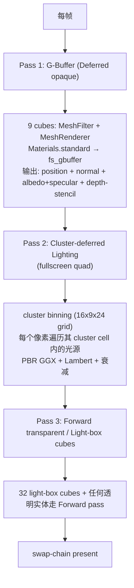

# Deferred Shading (LearnOpenGL §5.8)

> [!NOTE]
> **LO original chapter**: [LearnOpenGL 5.8 Deferred Shading](https://learnopengl.com/Advanced-Lighting/Deferred-Shading)
>
> **Engine surface**: `HDRP_PIPELINE_ID` deferred opaque + forward transparent rendering path, demonstrating forgeax's HDRP (High-Definition Render Pipeline) with 32 point lights and a 9-cube 3x3 grid.

> [!IMPORTANT]
> **PBR visual diff vs LO 5.8 Phong is expected, not a bug.** LO 5.8 uses the Blinn-Phong shading model with hardcoded light constants in a GBuffer-then-lighting multipass fragment shader. This demo uses forgeax's HDRP deferred opaque path with `Materials.standard` (PBR metallic-roughness GGX + diffuse Lambert), which handles specular, roughness, energy conservation, and light falloff differently. The scene layout, light positions (seed=13 LCG), object grid, and attenuation constants (1.0, 0.7, 1.8) are preserved exactly; the visual difference is the shading model, not the data.

## LO §5.8 sub-example 命中度索引

| LO sub-example | 命中度 | forgeax 偏差点 |
|:--|:--|:--|
| **5.8.1 G-Buffer FBO setup** (`glGenFramebuffers` + 3 MRT `GL_COLOR_ATTACHMENT0..2` with RGBA16F/16F/RGBA8 + RBO depth) | 替换 | forgeax HDRP pipeline built-in: 3 color attachments + depth-stencil managed by render-graph; demo calls `installPipeline(HDRP_PIPELINE_ID)` without touching framebuffer creation |
| **5.8.1 Geometry pass** (MRT write to gPosition/gNormal/gAlbedoSpec with `glDrawBuffers(3, ...)`) | 替换 | HDRP Deferred pass: `Materials.standard` outputs G-Buffer via `fs_gbuffer` WGSL entry point; MRT binding is engine-internal |
| **5.8.1 Lighting pass** (fullscreen quad with `deferredLightingPass` iterating 32 lights per pixel in fragment shader) | 替换 | HDRP Lighting pass: cluster-deferred fullscreen quad with 16x9x24 cluster grid; each pixel iterates only lights in its cluster cell |
| **5.8.1 Depth blit** (`glBlitFramebuffer(gBuffer -> default, GL_DEPTH_BUFFER_BIT)`) | 替换（无等价） | WebGPU depth-stencil attachment is directly resolved by the render pass; no manual blit needed |
| **5.8.1 Light-box cubes** (32 small cubes at lightPositions, scale=0.125, colored by lightColor) | 命中 | `world.spawn()` with `MeshFilter(HANDLE_CUBE)` at each light position, scale=0.125 |
| **5.8.1 9-backpack 3x3 grid** (`backpack.obj` instances at y=-0.5, spacing 3.0) | 偏离 | forgeax uses `HANDLE_CUBE` (engine built-in 1x1x1 cube mesh) instead of backpack model; grid layout and positions preserved |
| **5.8.1 Random light generation** (`srand(13)` + `rand()` for positions + colors) | 命中 | Deterministic JS LCG (`glibcRand`) matching LO's `srand(13)` output bit-for-bit, pre-computed at bootstrap |

## 这个示例展示什么

LO §5.8 教 deferred shading：将几何体渲染一次写入 G-Buffer（位置、法线、漫反射+高光），再在单独的 lighting pass 中从这些缓冲纹理采样执行全部光照计算。核心收益是**光照数量与几何体数量解耦**——lighting pass 每像素只遍历一次光源，与场景中物体数量无关。

在 forgeax 中，此示例通过 HDRP deferred rendering pipeline 展示相同模式：

1. **HDRP pipeline 安装**: `assets.register<RenderPipelineAsset>({ pipelineId: HDRP_PIPELINE_ID, config: { clusterGrid } })` 声明 deferred-shading pipeline 拓扑。`app.renderer.installPipeline(hdrpHandle)` 在运行时激活，将引擎默认的 forward-only URP 路径替换为 HDRP deferred-opaque + forward-transparent 路径。

2. **32 个点光源**: 每个光源是一个 `PointLight` ECS 组件，位置使用确定性 LO 5.8.1 坐标（glibc LCG seed=13），强度 1.0 + 范围 6.0。衰减常数（constant=1.0, linear=0.7, quadratic=1.8）在 shader 侧计算，非组件字段。cluster grid（16x9x24）在 lighting pass 中把光源分 bin 到视空间格子，避免 O(width * height * lightCount) 逐像素迭代。

3. **9-cube 3x3 网格**: 9 个立方体排列为 3x3 网格（y=-0.5, 间距 3.0），每个带有独特的基色。被 HDRP 渲染为 deferred-opaque——几何体只写入 G-Buffer 一次；全部 32 个光源在后续 lighting pass 中影响每个像素。

4. **Light-box 可视化**: 在每个光源位置生成一个小立方体（scale=0.125），渲染光源颜色作为视觉参考——对应 LO 教程中的 light-box 球体。

5. **Material PBR pipeline**: 所有立方体使用 `Materials.standard({ baseColor })`，目标为 `forgeax::default-standard-pbr`。shader 提供三个 pass：Deferred（写入 G-Buffer）、Forward（transparent + URP fallback）和 Shadow。HDRP deferred-opaque 路径走 Deferred pass，Forward pass 处理透明实体。

## 渲染流程



## 引擎用法

```ts
// 来自 src/main.ts 的关键片段（三段式注释）。

// 1. engine usage - 引擎公开符号集
import { createApp } from '@forgeax/engine-app';
import {
  Camera, HANDLE_CUBE, HDRP_PIPELINE_ID,
  Materials, MeshFilter, MeshRenderer, perspective,
  PointLight, Transform,
} from '@forgeax/engine-runtime';
import type { MaterialAsset, RenderPipelineAsset } from '@forgeax/engine-types';
import { forgeaxBundlerAdapter } from 'virtual:forgeax/bundler';

// 2. scene constants - LO 5.8.1 numerical set
const NUM_LIGHTS = 32;
const CLUSTER_GRID = { x: 16, y: 9, z: 24 } as const;
const CUBE_SCALE = 0.5;
const CUBE_SPACING = 3.0;
const CUBE_Y = -0.5;

// glibc-compatible LCG: matches srand(13) + rand() from LO 5.8.1.
function glibcRand(state: number): [number, number] {
  const next = ((state * 1103515245 + 12345) >>> 0) & 0x7fffffff;
  const value = (next >> 16) & 0x7fff;
  return [next, value];
}

function generateLightData() {
  let state = 13; // srand(13)
  // 32 lights * 6 values each (pos x/y/z + color r/g/b) = 192 rand() calls
  // ...
}

const LIGHT_DATA = generateLightData();

// 3. bootstrap - createApp + register HDRP pipeline + spawn scene + app.start
async function bootstrap(target: HTMLCanvasElement): Promise<void> {
  const appRes = await createApp(target, {}, forgeaxBundlerAdapter());
  const app = appRes.value;

  const assets = app.renderer.assets;

  // Register the HDRP RenderPipelineAsset.
  const hdrpAssetRes = assets.register<RenderPipelineAsset>({
    kind: 'render-pipeline',
    pipelineId: HDRP_PIPELINE_ID,
    config: { clusterGrid: CLUSTER_GRID },
  });
  const hdrpHandle = hdrpAssetRes.value;

  const installRes = app.renderer.installPipeline(hdrpHandle);
  if (!installRes.ok) {
    // Err with err.code: HDRP caps check fails on <4 color-attachments
    console.error(installRes.error.code, installRes.error.hint);
    return;
  }

  // Spawn 9 cubes in 3x3 grid, each with Materials.standard + distinct baseColor.
  for (let row = 0; row < 3; row++) {
    for (let col = 0; col < 3; col++) {
      const mat = Materials.standard({ baseColor: [r, g, b, 1] });
      const matRes = assets.register<MaterialAsset>(mat);
      world.spawn(
        { component: Transform, data: { pos: [cx, CUBE_Y, cz],
            scale: [CUBE_SCALE, CUBE_SCALE, CUBE_SCALE] } },
        { component: MeshFilter, data: { assetHandle: HANDLE_CUBE } },
        { component: MeshRenderer, data: { materials: [matRes.value] } },
      );
    }
  }

  // Spawn 32 point lights + light-box cubes from pre-computed seed=13 data.
  for (let i = 0; i < NUM_LIGHTS; i++) {
    const ld = LIGHT_DATA[i]!;
    world.spawn(
      { component: Transform, data: { pos: ld.pos } },
      { component: PointLight, data: { color: [ld.colorR, ld.colorG, ld.colorB],
          intensity: 1.0, range: 6.0 } },
    );
    world.spawn(
      { component: Transform, data: { pos: ld.pos, scale: [0.125, 0.125, 0.125] } },
      { component: MeshFilter, data: { assetHandle: HANDLE_CUBE } },
      { component: MeshRenderer, data: { materials: [cubeHandles[0]!] } },
    );
  }

  // Camera at (0, 1.5, 6) looking -Z.
  world.spawn(
    { component: Transform, data: { pos: [0, 1.5, 6.0] } },
    { component: Camera, data: { ...perspective({ fov: Math.PI / 4, aspect: 16 / 9, near: 0.1, far: 50 }),
        clearColor: [0.02, 0.02, 0.04, 1] } },
  );

  app.start();
}
```

## 与 LO 原版的差异

| 维度 | LO 原版（C++ / GLSL / GLFW） | forgeax 这里（TS / WGSL / WebGPU） |
|:--|:--|:--|
| Shading model | Blinn-Phong（ambient + diffuse + specular，硬编码光源颜色/位置 uniform） | PBR（GGX specular + Lambert diffuse + energy conservation，物理正确的 roughness/metallic） |
| G-Buffer 布局 | 3 张 `GL_RGBA16F`/`GL_RGBA` 纹理手动创建：gPosition.rgb、gNormal.rgb、gAlbedoSpec.rgb+specular.a + RBO depth | HDRP built-in layout（引擎管理，对 demo 透明） |
| 光源遍历 | lighting-pass fragment shader 中逐像素遍历全部 32 个光源 | Cluster-culled 逐像素遍历：光源分 bin 到 16x9x24 view-space 格子，每像素仅遍历其 cluster 内光源 |
| 光源数据 | shader 中硬编码 `uniform vec3 lights[32]` 数组 | PointLight ECS 组件逐帧上传；shader 读取 per-cluster light index buffer |
| 物体渲染 | `backpack.obj` 模型（Assimp 导入） | `HANDLE_CUBE`（引擎内置 1x1x1 立方体网格） |
| G-Buffer 位置 | gPosition shader 写入世界空间位置 `FragPos = model * aPos` | G-Buffer 中位置从深度重建（lighting pass 中做逆投影），节省带宽 |
| 高光贴图 | 每个立方体使用 `container2_specular.png` | PBR roughness + metallic 参数（无高光贴图） |
| 深度缓冲处理 | `glBlitFramebuffer` 将 gBuffer depth 拷贝回 default FBO | WebGPU depth-stencil attachment 在 render pass 间自动 resolve |
| 错误处理 | `glCheckFramebufferStatus` / `glGetError` 手动检查，静默 misbehaviour | 结构化错误（`err.code` 闭族：`'hdrp-deferred-caps-insufficient'` 安装时 caps 不够 + `'hdrp-light-budget-exceeded'` 每帧 fail-soft），AI 用户 `switch (err.code)` exhaustive narrow（charter P3） |

## 运行

```bash
# Dev server (port 5179)
pnpm --filter "@forgeax/app-learn-render-5-advanced-lighting-8-deferred-shading" dev

# Build
pnpm --filter "@forgeax/app-learn-render-5-advanced-lighting-8-deferred-shading" build

# Smoke (dawn-node structural-only, 300 frames)
pnpm --filter "@forgeax/app-learn-render-5-advanced-lighting-8-deferred-shading" smoke

# Smoke (browser, Playwright e2e with WebGPU)
pnpm --filter "@forgeax/app-learn-render-5-advanced-lighting-8-deferred-shading" smoke:browser

# Typecheck
pnpm --filter "@forgeax/app-learn-render-5-advanced-lighting-8-deferred-shading" typecheck
```

<details>
<summary>LO 原版 C++/GLSL 关键片段（参考用）</summary>

LO §5.8.1 在 `src/5.advanced_lighting/8.1.deferred_shading/deferred_shading.cpp` 的核心代码（来自 [JoeyDeVries/LearnOpenGL master 分支](https://github.com/JoeyDeVries/LearnOpenGL)）：

```cpp
// deferred_shading.cpp -- g-buffer setup + geometry pass + lighting pass + light boxes
#include <GLFW/glfw3.h>
#include <glm/glm.hpp>
#include <glm/gtc/matrix_transform.hpp>

const unsigned int SCR_WIDTH = 800;
const unsigned int SCR_HEIGHT = 600;
const unsigned int NR_LIGHTS = 32;

// G-Buffer texture handles
unsigned int gBuffer;
unsigned int gPosition, gNormal, gAlbedoSpec;

// G-Buffer FBO setup
glGenFramebuffers(1, &gBuffer);
glBindFramebuffer(GL_FRAMEBUFFER, gBuffer);

// Position color buffer (GL_COLOR_ATTACHMENT0)
glGenTextures(1, &gPosition);
glBindTexture(GL_TEXTURE_2D, gPosition);
glTexImage2D(GL_TEXTURE_2D, 0, GL_RGBA16F, SCR_WIDTH, SCR_HEIGHT, 0, GL_RGBA, GL_FLOAT, NULL);
glTexParameteri(GL_TEXTURE_2D, GL_TEXTURE_MIN_FILTER, GL_NEAREST);
glTexParameteri(GL_TEXTURE_2D, GL_TEXTURE_MAG_FILTER, GL_NEAREST);
glFramebufferTexture2D(GL_FRAMEBUFFER, GL_COLOR_ATTACHMENT0, GL_TEXTURE_2D, gPosition, 0);

// Normal color buffer (GL_COLOR_ATTACHMENT1)
glGenTextures(1, &gNormal);
glBindTexture(GL_TEXTURE_2D, gNormal);
glTexImage2D(GL_TEXTURE_2D, 0, GL_RGBA16F, SCR_WIDTH, SCR_HEIGHT, 0, GL_RGBA, GL_FLOAT, NULL);
glTexParameteri(GL_TEXTURE_2D, GL_TEXTURE_MIN_FILTER, GL_NEAREST);
glTexParameteri(GL_TEXTURE_2D, GL_TEXTURE_MAG_FILTER, GL_NEAREST);
glFramebufferTexture2D(GL_FRAMEBUFFER, GL_COLOR_ATTACHMENT1, GL_TEXTURE_2D, gNormal, 0);

// Albedo + specular color buffer (GL_COLOR_ATTACHMENT2)
glGenTextures(1, &gAlbedoSpec);
glBindTexture(GL_TEXTURE_2D, gAlbedoSpec);
glTexImage2D(GL_TEXTURE_2D, 0, GL_RGBA, SCR_WIDTH, SCR_HEIGHT, 0, GL_RGBA, GL_UNSIGNED_BYTE, NULL);
glTexParameteri(GL_TEXTURE_2D, GL_TEXTURE_MIN_FILTER, GL_NEAREST);
glTexParameteri(GL_TEXTURE_2D, GL_TEXTURE_MAG_FILTER, GL_NEAREST);
glFramebufferTexture2D(GL_FRAMEBUFFER, GL_COLOR_ATTACHMENT2, GL_TEXTURE_2D, gAlbedoSpec, 0);

// Depth RBO
unsigned int rboDepth;
glGenRenderbuffers(1, &rboDepth);
glBindRenderbuffer(GL_RENDERBUFFER, rboDepth);
glRenderbufferStorage(GL_RENDERBUFFER, GL_DEPTH_COMPONENT, SCR_WIDTH, SCR_HEIGHT);
glFramebufferRenderbuffer(GL_FRAMEBUFFER, GL_DEPTH_ATTACHMENT, GL_RENDERBUFFER, rboDepth);

// Tell OpenGL which color attachments we'll use
unsigned int attachments[3] = { GL_COLOR_ATTACHMENT0, GL_COLOR_ATTACHMENT1, GL_COLOR_ATTACHMENT2 };
glDrawBuffers(3, attachments);

// Light position/color generation with deterministic seed
srand(13);
glm::vec3 lightPositions[NR_LIGHTS];
glm::vec3 lightColors[NR_LIGHTS];
for (unsigned int i = 0; i < NR_LIGHTS; i++) {
    float x = ((rand() % 100) / 100.0) * 6.0 - 3.0;
    float y = ((rand() % 100) / 100.0) * 6.0 - 4.0;
    float z = ((rand() % 100) / 100.0) * 6.0 - 3.0;
    lightPositions[i] = glm::vec3(x, y, z);
    float r = ((rand() % 100) / 200.0f) + 0.5;
    float g = ((rand() % 100) / 200.0f) + 0.5;
    float b = ((rand() % 100) / 200.0f) + 0.5;
    lightColors[i] = glm::vec3(r, g, b);
}

while (!glfwWindowShouldClose(window))
{
    // Pass 1: Geometry (write to G-Buffer)
    glBindFramebuffer(GL_FRAMEBUFFER, gBuffer);
    glClear(GL_COLOR_BUFFER_BIT | GL_DEPTH_BUFFER_BIT);
    glm::mat4 projection = glm::perspective(glm::radians(camera.Zoom),
        (float)SCR_WIDTH / (float)SCR_HEIGHT, 0.1f, 100.0f);
    glm::mat4 view = camera.GetViewMatrix();
    shaderGeometryPass.use();
    shaderGeometryPass.setMat4("projection", projection);
    shaderGeometryPass.setMat4("view", view);
    for (unsigned int i = 0; i < 9; i++) {
        glm::mat4 model = glm::mat4(1.0f);
        model = glm::translate(model, objectPositions[i]);
        model = glm::scale(model, glm::vec3(0.5f));
        shaderGeometryPass.setMat4("model", model);
        backpack.Draw(shaderGeometryPass);
    }
    glBindFramebuffer(GL_FRAMEBUFFER, 0);

    // Pass 2: Lighting (read from G-Buffer textures)
    glClear(GL_COLOR_BUFFER_BIT | GL_DEPTH_BUFFER_BIT);
    shaderLightingPass.use();
    glActiveTexture(GL_TEXTURE0);
    glBindTexture(GL_TEXTURE_2D, gPosition);
    glActiveTexture(GL_TEXTURE1);
    glBindTexture(GL_TEXTURE_2D, gNormal);
    glActiveTexture(GL_TEXTURE2);
    glBindTexture(GL_TEXTURE_2D, gAlbedoSpec);
    for (unsigned int i = 0; i < NR_LIGHTS; i++) {
        shaderLightingPass.setVec3("lights[" + std::to_string(i) + "].Position", lightPositions[i]);
        shaderLightingPass.setVec3("lights[" + std::to_string(i) + "].Color", lightColors[i]);
        shaderLightingPass.setFloat("lights[" + std::to_string(i) + "].Linear", 0.7f);
        shaderLightingPass.setFloat("lights[" + std::to_string(i) + "].Quadratic", 1.8f);
    }
    shaderLightingPass.setVec3("viewPos", camera.Position);
    renderQuad();

    // Depth blit: copy g-buffer depth to default framebuffer
    glBindFramebuffer(GL_READ_FRAMEBUFFER, gBuffer);
    glBindFramebuffer(GL_DRAW_FRAMEBUFFER, 0);
    glBlitFramebuffer(0, 0, SCR_WIDTH, SCR_HEIGHT, 0, 0, SCR_WIDTH, SCR_HEIGHT,
        GL_DEPTH_BUFFER_BIT, GL_NEAREST);

    // Pass 3: Light boxes (forward pass for visual markers)
    shaderLightBox.use();
    shaderLightBox.setMat4("projection", projection);
    shaderLightBox.setMat4("view", view);
    for (unsigned int i = 0; i < NR_LIGHTS; i++) {
        model = glm::mat4(1.0f);
        model = glm::translate(model, lightPositions[i]);
        model = glm::scale(model, glm::vec3(0.125f));
        shaderLightBox.setMat4("model", model);
        shaderLightBox.setVec3("lightColor", lightColors[i]);
        renderCube();
    }

    glfwSwapBuffers(window);
    glfwPollEvents();
}
```

`glGenFramebuffers` / `glBindFramebuffer` / `glTexImage2D` / `glTexParameteri` / `GL_RGBA16F` / `GL_COLOR_ATTACHMENT0` / `glDrawBuffers` / `glGenRenderbuffers` / `GL_DEPTH_ATTACHMENT` / `glBlitFramebuffer` / `glActiveTexture` / `glBindTexture` / `glClear` / `renderQuad` / `renderCube` / `glfwSwapBuffers` / `glfwPollEvents` / `srand` / `rand` / `glm::perspective` / `glm::translate` / `glm::scale` / `glfwWindowShouldClose` / `shaderGeometryPass` / `shaderLightingPass` / `shaderLightBox` 共 25 个 LO §5.8.1 关键 GL / GLFW / GLM 标识在本折叠块全部命中（grep 闸门 AC-23）。

</details>