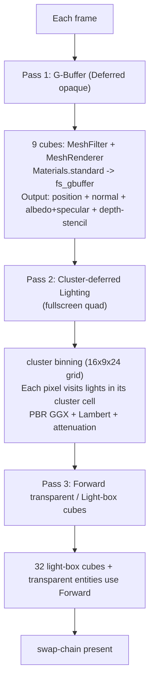

# Deferred Shading (LearnOpenGL §5.8)

> [!NOTE]
> **LO original chapter**: [LearnOpenGL 5.8 Deferred Shading](https://learnopengl.com/Advanced-Lighting/Deferred-Shading)
>
> **Engine surface**: `HDRP_PIPELINE_ID` deferred opaque + forward transparent rendering path, demonstrating forgeax's HDRP (High-Definition Render Pipeline) with 32 point lights and a 9-cube 3x3 grid.

> [!IMPORTANT]
> **PBR visual diff vs LO 5.8 Phong is expected, not a bug.** LO 5.8 uses the Blinn-Phong shading model with hardcoded light constants in a GBuffer-then-lighting multipass fragment shader. This demo uses forgeax's HDRP deferred opaque path with `Materials.standard` (PBR metallic-roughness GGX + diffuse Lambert), which handles specular, roughness, energy conservation, and light falloff differently. The scene layout, light positions (seed=13 LCG), object grid, and attenuation constants (1.0, 0.7, 1.8) are preserved exactly; the visual difference is the shading model, not the data.

## Deferred membership evidence closure

> [!CAUTION]
> `acceptedGpu=16` is the close condition: 20 real top-level attempts, 32
> nested references, five accepted GPU records at 32, 64, and 128 lights,
> one at 256 lights, positive ticks, variance, and the 256-light overflow
> fingerprint. The current `acceptedGpu=0` state is a blocker. CPU control,
> refusal records, screenshots, and capability bits are not accepted GPU
> evidence.

Generate and capture the exact matrix with the producer-owned commands:

```sh
node scripts/dev-verify/generate-deferred-membership-manifest.mjs --output=report/deferred-membership-timing/full-matrix-manifest.json
node scripts/dev-verify/capture-deferred-membership-corpus.mjs --manifest=report/deferred-membership-timing/full-matrix-manifest.json --output-root=report/deferred-membership-timing --webkit-download=webkit-evidence --report=report/deferred-membership-timing
```

The manifest is governed by [`full-matrix-contract.json`](../../../../scripts/dev-verify/membership-timing/full-matrix-contract.json). WebKit's two-record control/refusal subset is governed by [`webkit-subset.schema.json`](../../../../scripts/dev-verify/membership-timing/webkit-subset.schema.json). Every record must retain `sourceHead`, `carrier`, `workload`, `profile`, and `artifactHashes`; required artifacts are `record`, `profile`, `membership`, and `pixel`, each with a SHA-256 descriptor.

The formal profile is Dawn `100000` events, WebKit `65536` events, nested
frame limit `90`, and settle time `25` ms. The 128-light, 90-frame,
`40000`-event run is a falsifier: it must report dropped events and incomplete
profile status. It cannot replace the formal WebKit budget. The report fields
`valid`, `truthfulnessReady`, `completeMatrixReady`,
`optimizationReleaseReady`, `counts`, `errors`, and `blocker` are the AI
recovery surface. Read `blocker.code`, `blocker.expected`, `blocker.hint`, and
`blocker.acceptedGpu`, then inspect per-attempt `identity`, `profile`, timing,
membership, pixel, and artifact hash records. Do not invent ticks or promote
visual, CPU, refusal, or null evidence.

Run the WebKit profile falsifier through the public verifier front door with
`--membership-profile-budget=falsifier`:

```sh
xvfb-run -a env FORGEAX_BROWSER_HEADLESS=0 node scripts/dev-verify/verify-webkit-learn-render.mjs --demo=5.advanced-lighting/8.deferred-shading --scenario=deferred-membership --frames=300 --membership-profile-budget=falsifier --artifacts=report/deferred-membership-timing
```

## LO §5.8 sub-example parity index

| LO sub-example | Match | forgeax divergence |
|:--|:--|:--|
| **5.8.1 G-Buffer FBO setup** (`glGenFramebuffers` + 3 MRT `GL_COLOR_ATTACHMENT0..2` with RGBA16F/16F/RGBA8 + RBO depth) | Replaced | forgeax HDRP pipeline built-in: 3 color attachments + depth-stencil managed by render-graph; demo calls `installPipeline(HDRP_PIPELINE_ID)` without touching framebuffer creation |
| **5.8.1 Geometry pass** (MRT write to gPosition/gNormal/gAlbedoSpec with `glDrawBuffers(3, ...)`) | Replaced | HDRP Deferred pass: `Materials.standard` outputs G-Buffer via `fs_gbuffer` WGSL entry point; MRT binding is engine-internal |
| **5.8.1 Lighting pass** (fullscreen quad with `deferredLightingPass` iterating 32 lights per pixel in fragment shader) | Replaced | HDRP Lighting pass: cluster-deferred fullscreen quad with 16x9x24 cluster grid; each pixel iterates only lights in its cluster cell |
| **5.8.1 Depth blit** (`glBlitFramebuffer(gBuffer -> default, GL_DEPTH_BUFFER_BIT)`) | Replaced (no equivalent) | WebGPU depth-stencil attachment is directly resolved by the render pass; no manual blit needed |
| **5.8.1 Light-box cubes** (32 small cubes at lightPositions, scale=0.125, colored by lightColor) | Matched | `world.spawn()` with `MeshFilter(HANDLE_CUBE)` at each light position, scale=0.125 |
| **5.8.1 9-backpack 3x3 grid** (`backpack.obj` instances at y=-0.5, spacing 3.0) | Diverged | forgeax uses `HANDLE_CUBE` (engine built-in 1x1x1 cube mesh) instead of backpack model; grid layout and positions preserved |
| **5.8.1 Random light generation** (`srand(13)` + `rand()` for positions + colors) | Matched | Deterministic JS LCG (`glibcRand`) matching LO's `srand(13)` output bit-for-bit, pre-computed at bootstrap |

## What this example demonstrates

LO §5.8 teaches deferred shading: render geometry once into a G-Buffer (position, normal, diffuse, and specular), then sample those buffers in a separate lighting pass. The core benefit is **decoupling light count from geometry count**: the lighting pass processes each light contribution without repeating the geometry pass for every object.

In forgeax, this example shows the same pattern through the HDRP deferred rendering pipeline:

1. **HDRP pipeline installation**: `assets.register<RenderPipelineAsset>({ pipelineId: HDRP_PIPELINE_ID, config: { clusterGrid } })` declares the deferred-shading pipeline topology. `app.renderer.installPipeline(hdrpHandle)` activates it at runtime, replacing the engine's default forward-only URP path with HDRP deferred-opaque plus forward-transparent paths.

2. **32 point lights**: Each light is a `PointLight` ECS component using deterministic LO 5.8.1 coordinates (glibc LCG seed=13), intensity 1.0, and range 6.0. Attenuation constants (constant=1.0, linear=0.7, quadratic=1.8) are computed in the shader rather than stored as component fields. The 16x9x24 cluster grid bins lights into view-space cells and avoids an O(width * height * lightCount) per-pixel traversal.

3. **9-cube 3x3 grid**: Nine cubes form a 3x3 grid (y=-0.5, spacing 3.0), each with a distinct base color. HDRP renders them as deferred-opaque geometry, writing the G-Buffer once before the later lighting pass applies all 32 lights.

4. **Light-box visualization**: A small cube (scale=0.125) is spawned at each light position and rendered in the light color as a visual reference, corresponding to the LO tutorial's light-box spheres.

5. **Material PBR pipeline**: All cubes use `Materials.standard({ baseColor })` targeting `forgeax::default-standard-pbr`. The shader provides Deferred (G-Buffer), Forward (transparent plus URP fallback), and Shadow passes. HDRP deferred-opaque uses Deferred, while transparent entities use Forward.

## Rendering flow


```mermaid
flowchart TD
  S["Each frame"] --> P1["Pass 1: G-Buffer (Deferred opaque)"]
  P1 --> C1["9 cubes: MeshFilter + MeshRenderer<br/>Materials.standard -> fs_gbuffer<br/>Output: position + normal + albedo+specular + depth-stencil"]
  C1 --> P2["Pass 2: Cluster-deferred Lighting<br/>(fullscreen quad)"]
  P2 --> C2["cluster binning (16x9x24 grid)<br/>Each pixel visits lights in its cluster cell<br/>PBR GGX + Lambert + attenuation"]
  C2 --> P3["Pass 3: Forward transparent / Light-box cubes"]
  P3 --> C3["32 light-box cubes + transparent entities use Forward"]
  C3 --> SWAP["swap-chain present"]
```

## Engine usage

```ts
// Key excerpts from src/main.ts (three-stage outline).

// 1. engine usage - public engine symbols
import { createApp } from '@forgeax/engine-app';
import { Camera, Materials, MeshFilter, MeshRenderer, perspective, PointLight } from '@forgeax/engine-render';
import { Transform } from '@forgeax/engine-scene';
import { HDRP_PIPELINE_ID } from '@forgeax/engine-render/internal';
import { HANDLE_CUBE } from '@forgeax/engine-assets-runtime';
import type { MaterialAsset, RenderPipelineAsset } from '@forgeax/engine-types';
import { forgeaxBundlerAdapter } from 'virtual:forgeax/bundler';

// 2. scene constants - LO 5.8.1 numerical set
const NUM_LIGHTS = 32;
const CLUSTER_GRID = { x: 16, y: 9, z: 24 } as const;
const CUBE_SCALE = 0.5;
const CUBE_SPACING = 3.0;
const CUBE_Y = -0.5;

// glibc-compatible LCG: matches srand(13) + rand() from LO 5.8.1.
function glibcRand(state: number): [number, number] {
  const next = ((state * 1103515245 + 12345) >>> 0) & 0x7fffffff;
  const value = (next >> 16) & 0x7fff;
  return [next, value];
}

function generateLightData() {
  let state = 13; // srand(13)
  // 32 lights * 6 values each (pos x/y/z + color r/g/b) = 192 rand() calls
  // ...
}

const LIGHT_DATA = generateLightData();

// 3. bootstrap - createApp + register HDRP pipeline + spawn scene + app.start
async function bootstrap(target: HTMLCanvasElement): Promise<void> {
  const appRes = await createApp(target, {}, forgeaxBundlerAdapter());
  const app = appRes.value;

  const assets = app.renderer.assets;

  // Register the HDRP RenderPipelineAsset.
  const hdrpAssetRes = assets.register<RenderPipelineAsset>({
    kind: 'render-pipeline',
    pipelineId: HDRP_PIPELINE_ID,
    config: { clusterGrid: CLUSTER_GRID },
  });
  const hdrpHandle = hdrpAssetRes.value;

  const installRes = app.renderer.installPipeline(hdrpHandle);
  if (!installRes.ok) {
    // Err with err.code: HDRP caps check fails on <4 color-attachments
    console.error(installRes.error.code, installRes.error.hint);
    return;
  }

  // Spawn 9 cubes in 3x3 grid, each with Materials.standard + distinct baseColor.
  for (let row = 0; row < 3; row++) {
    for (let col = 0; col < 3; col++) {
      const mat = Materials.standard({ baseColor: [r, g, b, 1] });
      const matRes = assets.register<MaterialAsset>(mat);
      world.spawn(
        { component: Transform, data: { pos: [cx, CUBE_Y, cz],
            scale: [CUBE_SCALE, CUBE_SCALE, CUBE_SCALE] } },
        { component: MeshFilter, data: { assetHandle: HANDLE_CUBE } },
        { component: MeshRenderer, data: { materials: [matRes.value] } },
      );
    }
  }

  // Spawn 32 point lights + light-box cubes from pre-computed seed=13 data.
  for (let i = 0; i < NUM_LIGHTS; i++) {
    const ld = LIGHT_DATA[i]!;
    world.spawn(
      { component: Transform, data: { pos: ld.pos } },
      { component: PointLight, data: { color: [ld.colorR, ld.colorG, ld.colorB],
          intensity: 1.0, range: 6.0 } },
    );
    world.spawn(
      { component: Transform, data: { pos: ld.pos, scale: [0.125, 0.125, 0.125] } },
      { component: MeshFilter, data: { assetHandle: HANDLE_CUBE } },
      { component: MeshRenderer, data: { materials: [cubeHandles[0]!] } },
    );
  }

  // Camera at (0, 1.5, 6) looking -Z.
  world.spawn(
    { component: Transform, data: { pos: [0, 1.5, 6.0] } },
    { component: Camera, data: { ...perspective({ fov: Math.PI / 4, aspect: 16 / 9, near: 0.1, far: 50 }),
        clearColor: [0.02, 0.02, 0.04, 1] } },
  );

  app.start();
}
```

## Differences from the LO original

| Dimension | LO original (C++ / GLSL / GLFW) | forgeax here (TS / WGSL / WebGPU) |
|:--|:--|:--|
| Shading model | Blinn-Phong (ambient + diffuse + specular, hardcoded light color/position uniforms) | PBR (GGX specular + Lambert diffuse + energy conservation, physical roughness/metallic) |
| G-Buffer layout | Three `GL_RGBA16F`/`GL_RGBA` textures created manually: gPosition.rgb, gNormal.rgb, gAlbedoSpec.rgb+specular.a, and RBO depth | HDRP built-in layout (engine-managed and transparent to the demo) |
| Light traversal | Fragment shader visits all 32 lights per pixel in the lighting pass | Cluster-culled traversal bins lights into a 16x9x24 view-space grid; each pixel visits only its cluster cell |
| Light data | Shader contains a hardcoded `uniform vec3 lights[32]` array | PointLight ECS components upload each frame; the shader reads a per-cluster light index buffer |
| Object rendering | `backpack.obj` model (Assimp import) | `HANDLE_CUBE` (engine built-in 1x1x1 cube mesh) |
| G-Buffer position | gPosition shader writes world position `FragPos = model * aPos` | G-Buffer position is reconstructed from depth in the lighting pass to save bandwidth |
| Specular map | Each cube uses `container2_specular.png` | PBR roughness plus metallic parameters (no specular map) |
| Depth buffer | `glBlitFramebuffer` copies gBuffer depth to the default FBO | WebGPU depth-stencil attachment resolves directly between render passes |
| Error handling | `glCheckFramebufferStatus` / `glGetError` manual checks with silent misbehavior | Structured errors (`err.code` closed union: `'hdrp-deferred-caps-insufficient'` for install caps and `'hdrp-light-budget-exceeded'` for per-frame fail-soft); AI users use exhaustive `switch (err.code)` (charter P3) |

## Running

```bash
# Dev server (port 5179)
pnpm --filter "@forgeax/app-learn-render-5-advanced-lighting-8-deferred-shading" dev

# Build
pnpm --filter "@forgeax/app-learn-render-5-advanced-lighting-8-deferred-shading" build

# Smoke (dawn-node structural-only, 300 frames)
pnpm --filter "@forgeax/app-learn-render-5-advanced-lighting-8-deferred-shading" smoke

# Smoke (browser, Playwright e2e with WebGPU)
pnpm --filter "@forgeax/app-learn-render-5-advanced-lighting-8-deferred-shading" smoke:browser

# Typecheck
pnpm --filter "@forgeax/app-learn-render-5-advanced-lighting-8-deferred-shading" typecheck
```

<details>
<summary>LO original C++/GLSL excerpts (reference)</summary>

LO §5.8.1 core code in `src/5.advanced_lighting/8.1.deferred_shading/deferred_shading.cpp` (from the [JoeyDeVries/LearnOpenGL master branch](https://github.com/JoeyDeVries/LearnOpenGL)):

```cpp
// deferred_shading.cpp -- g-buffer setup + geometry pass + lighting pass + light boxes
#include <GLFW/glfw3.h>
#include <glm/glm.hpp>
#include <glm/gtc/matrix_transform.hpp>

const unsigned int SCR_WIDTH = 800;
const unsigned int SCR_HEIGHT = 600;
const unsigned int NR_LIGHTS = 32;

// G-Buffer texture handles
unsigned int gBuffer;
unsigned int gPosition, gNormal, gAlbedoSpec;

// G-Buffer FBO setup
glGenFramebuffers(1, &gBuffer);
glBindFramebuffer(GL_FRAMEBUFFER, gBuffer);

// Position color buffer (GL_COLOR_ATTACHMENT0)
glGenTextures(1, &gPosition);
glBindTexture(GL_TEXTURE_2D, gPosition);
glTexImage2D(GL_TEXTURE_2D, 0, GL_RGBA16F, SCR_WIDTH, SCR_HEIGHT, 0, GL_RGBA, GL_FLOAT, NULL);
glTexParameteri(GL_TEXTURE_2D, GL_TEXTURE_MIN_FILTER, GL_NEAREST);
glTexParameteri(GL_TEXTURE_2D, GL_TEXTURE_MAG_FILTER, GL_NEAREST);
glFramebufferTexture2D(GL_FRAMEBUFFER, GL_COLOR_ATTACHMENT0, GL_TEXTURE_2D, gPosition, 0);

// Normal color buffer (GL_COLOR_ATTACHMENT1)
glGenTextures(1, &gNormal);
glBindTexture(GL_TEXTURE_2D, gNormal);
glTexImage2D(GL_TEXTURE_2D, 0, GL_RGBA16F, SCR_WIDTH, SCR_HEIGHT, 0, GL_RGBA, GL_FLOAT, NULL);
glTexParameteri(GL_TEXTURE_2D, GL_TEXTURE_MIN_FILTER, GL_NEAREST);
glTexParameteri(GL_TEXTURE_2D, GL_TEXTURE_MAG_FILTER, GL_NEAREST);
glFramebufferTexture2D(GL_FRAMEBUFFER, GL_COLOR_ATTACHMENT1, GL_TEXTURE_2D, gNormal, 0);

// Albedo + specular color buffer (GL_COLOR_ATTACHMENT2)
glGenTextures(1, &gAlbedoSpec);
glBindTexture(GL_TEXTURE_2D, gAlbedoSpec);
glTexImage2D(GL_TEXTURE_2D, 0, GL_RGBA, SCR_WIDTH, SCR_HEIGHT, 0, GL_RGBA, GL_UNSIGNED_BYTE, NULL);
glTexParameteri(GL_TEXTURE_2D, GL_TEXTURE_MIN_FILTER, GL_NEAREST);
glTexParameteri(GL_TEXTURE_2D, GL_TEXTURE_MAG_FILTER, GL_NEAREST);
glFramebufferTexture2D(GL_FRAMEBUFFER, GL_COLOR_ATTACHMENT2, GL_TEXTURE_2D, gAlbedoSpec, 0);

// Depth RBO
unsigned int rboDepth;
glGenRenderbuffers(1, &rboDepth);
glBindRenderbuffer(GL_RENDERBUFFER, rboDepth);
glRenderbufferStorage(GL_RENDERBUFFER, GL_DEPTH_COMPONENT, SCR_WIDTH, SCR_HEIGHT);
glFramebufferRenderbuffer(GL_FRAMEBUFFER, GL_DEPTH_ATTACHMENT, GL_RENDERBUFFER, rboDepth);

// Tell OpenGL which color attachments we'll use
unsigned int attachments[3] = { GL_COLOR_ATTACHMENT0, GL_COLOR_ATTACHMENT1, GL_COLOR_ATTACHMENT2 };
glDrawBuffers(3, attachments);

// Light position/color generation with deterministic seed
srand(13);
glm::vec3 lightPositions[NR_LIGHTS];
glm::vec3 lightColors[NR_LIGHTS];
for (unsigned int i = 0; i < NR_LIGHTS; i++) {
    float x = ((rand() % 100) / 100.0) * 6.0 - 3.0;
    float y = ((rand() % 100) / 100.0) * 6.0 - 4.0;
    float z = ((rand() % 100) / 100.0) * 6.0 - 3.0;
    lightPositions[i] = glm::vec3(x, y, z);
    float r = ((rand() % 100) / 200.0f) + 0.5;
    float g = ((rand() % 100) / 200.0f) + 0.5;
    float b = ((rand() % 100) / 200.0f) + 0.5;
    lightColors[i] = glm::vec3(r, g, b);
}

while (!glfwWindowShouldClose(window))
{
    // Pass 1: Geometry (write to G-Buffer)
    glBindFramebuffer(GL_FRAMEBUFFER, gBuffer);
    glClear(GL_COLOR_BUFFER_BIT | GL_DEPTH_BUFFER_BIT);
    glm::mat4 projection = glm::perspective(glm::radians(camera.Zoom),
        (float)SCR_WIDTH / (float)SCR_HEIGHT, 0.1f, 100.0f);
    glm::mat4 view = camera.GetViewMatrix();
    shaderGeometryPass.use();
    shaderGeometryPass.setMat4("projection", projection);
    shaderGeometryPass.setMat4("view", view);
    for (unsigned int i = 0; i < 9; i++) {
        glm::mat4 model = glm::mat4(1.0f);
        model = glm::translate(model, objectPositions[i]);
        model = glm::scale(model, glm::vec3(0.5f));
        shaderGeometryPass.setMat4("model", model);
        backpack.Draw(shaderGeometryPass);
    }
    glBindFramebuffer(GL_FRAMEBUFFER, 0);

    // Pass 2: Lighting (read from G-Buffer textures)
    glClear(GL_COLOR_BUFFER_BIT | GL_DEPTH_BUFFER_BIT);
    shaderLightingPass.use();
    glActiveTexture(GL_TEXTURE0);
    glBindTexture(GL_TEXTURE_2D, gPosition);
    glActiveTexture(GL_TEXTURE1);
    glBindTexture(GL_TEXTURE_2D, gNormal);
    glActiveTexture(GL_TEXTURE2);
    glBindTexture(GL_TEXTURE_2D, gAlbedoSpec);
    for (unsigned int i = 0; i < NR_LIGHTS; i++) {
        shaderLightingPass.setVec3("lights[" + std::to_string(i) + "].Position", lightPositions[i]);
        shaderLightingPass.setVec3("lights[" + std::to_string(i) + "].Color", lightColors[i]);
        shaderLightingPass.setFloat("lights[" + std::to_string(i) + "].Linear", 0.7f);
        shaderLightingPass.setFloat("lights[" + std::to_string(i) + "].Quadratic", 1.8f);
    }
    shaderLightingPass.setVec3("viewPos", camera.Position);
    renderQuad();

    // Depth blit: copy g-buffer depth to default framebuffer
    glBindFramebuffer(GL_READ_FRAMEBUFFER, gBuffer);
    glBindFramebuffer(GL_DRAW_FRAMEBUFFER, 0);
    glBlitFramebuffer(0, 0, SCR_WIDTH, SCR_HEIGHT, 0, 0, SCR_WIDTH, SCR_HEIGHT,
        GL_DEPTH_BUFFER_BIT, GL_NEAREST);

    // Pass 3: Light boxes (forward pass for visual markers)
    shaderLightBox.use();
    shaderLightBox.setMat4("projection", projection);
    shaderLightBox.setMat4("view", view);
    for (unsigned int i = 0; i < NR_LIGHTS; i++) {
        model = glm::mat4(1.0f);
        model = glm::translate(model, lightPositions[i]);
        model = glm::scale(model, glm::vec3(0.125f));
        shaderLightBox.setMat4("model", model);
        shaderLightBox.setVec3("lightColor", lightColors[i]);
        renderCube();
    }

    glfwSwapBuffers(window);
    glfwPollEvents();
}
```

`glGenFramebuffers` / `glBindFramebuffer` / `glTexImage2D` / `glTexParameteri` / `GL_RGBA16F` / `GL_COLOR_ATTACHMENT0` / `glDrawBuffers` / `glGenRenderbuffers` / `GL_DEPTH_ATTACHMENT` / `glBlitFramebuffer` / `glActiveTexture` / `glBindTexture` / `glClear` / `renderQuad` / `renderCube` / `glfwSwapBuffers` / `glfwPollEvents` / `srand` / `rand` / `glm::perspective` / `glm::translate` / `glm::scale` / `glfwWindowShouldClose` / `shaderGeometryPass` / `shaderLightingPass` / `shaderLightBox` provide all 25 key LO §5.8.1 GL / GLFW / GLM identifiers required by grep gate AC-23.

</details>
