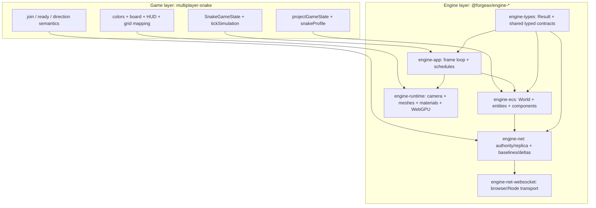
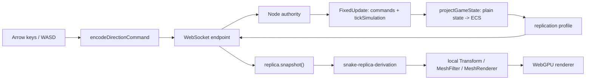

<!-- LANG-SWITCH -->
**Language**: **English** · [简体中文](README.zh-CN.md)

> [!IMPORTANT]
> This README is maintained in two languages ([`README.md`](README.md) canonical · [`README.zh-CN.md`](README.zh-CN.md) mirror). Update both files together.

# @forgeax/multiplayer-snake

[](../../tsconfig.base.json)
[](../../packages/net-websocket)
[](../../packages/runtime)
[](../../packages/ecs)

> **A server-authoritative multiplayer Snake demo: WebSocket commands in, replicated ECS state out, and WebGPU rendering on every client.**

This demo is deliberately small, but it exercises the complete multiplayer path in forgeax:

- a Node authority owns the deterministic game simulation;
- browser clients send only input commands and read replicated state;
- the network layer transports ECS entities and components with stable references;
- the client derives local render entities from the replica and never mutates the replicated game state.

## Quick start

### 1. Start the authority server

Build the workspace once so the engine packages and WebSocket adapter are available:

```bash
pnpm install
pnpm build
```

In a second terminal, start the Node authority on port `8787`:

```bash
pnpm --filter @forgeax/multiplayer-snake server
```

Keep this terminal running. The authority is the only process that advances Snake rules and publishes replicated state.
The authority still drives the ECS fixed tick at 60 Hz; the Snake game layer moves one grid cell every 0.1 seconds (10 cells/second), so network/input responsiveness and gameplay speed remain separate concepts.
Set `FORGEAX_SNAKE_PORT` to use a different port.

### 2. Start the browser client

```bash
pnpm --filter @forgeax/multiplayer-snake dev
```

Open this URL in **two browser windows**:

```text
http://localhost:5173/?server=ws://localhost:8787
```

Each window is one player. After the renderer is ready, the client automatically sends `join`; after the authority sends the waiting baseline, it sends `ready`. The round starts when the second player has joined and both players are ready. Use Arrow keys or `WASD` to steer.

The `server` query parameter is optional when the authority uses the default address `ws://<current-host>:8787`. Use `wss://...` when the page is served over HTTPS.

### Automated proof

Run the full browser proof. It starts a temporary authority, a Vite dev server, and browser clients automatically:

```bash
pnpm --filter @forgeax/multiplayer-snake e2e:browser
```

Run the unit and integration gates:

```bash
pnpm --filter @forgeax/multiplayer-snake test
pnpm --filter @forgeax/multiplayer-snake typecheck
```

## Engine and game: where the boundary is

The shortest way to read this demo is:

> **The engine provides the mechanisms; the game provides the meaning.**

The engine does not know what a snake is. The game does not implement WebSocket framing, ECS archetype storage, entity-reference remapping, or GPU command recording.



### What the engine supplies

| Engine capability | What this demo consumes | What remains generic |
|:--|:--|:--|
| `engine-app` | Creates the app and drives `Update` / `FixedUpdate` plus rendering | The frame loop, delta handling, renderer lifecycle, and structured app errors |
| `engine-ecs` | Stores `Snake`, `GridPosition`, `SnakeBody`, and `SnakeSession` components in a `World` | Schema-defined entities, systems, resources, scheduling, spawn/despawn, and typed component access |
| `engine-net` | Attaches an authority on the server and a replica in each browser | Peer identity, command/message queues, replication profiles, baselines, deltas, snapshots, and entity-reference remapping |
| `engine-net-websocket` | Connects the browser to the Node authority | WebSocket lifecycle, binary frames, browser client endpoint, and Node listener |
| `engine-runtime` | Renders cubes, materials, camera, and transforms | Camera/render extraction, mesh/material resources, render graph execution, and WebGPU backend integration |
| `engine-types` | Supplies shared `Result`-style contracts and typed failures | Cross-package POD types and explicit success/failure handling |

### What this game implements

| Game responsibility | Owner in this demo | Why it is not an engine feature |
|:--|:--|:--|
| Snake rules | [`src/shared/rules.ts`](src/shared/rules.ts) | Movement, collisions, food, score, body growth, death, and 30-tick respawn are Snake semantics |
| Player protocol meaning | [`src/shared/commands.ts`](src/shared/commands.ts) | `[0]`, `[1, direction]`, and `[2]` only become `join`, direction, and `ready` because this game defines them |
| Admission policy | [`src/server.ts`](src/server.ts) | “At least two ready peers”, four-player limit, and start timing are this demo's lobby rules |
| Networked data selection | [`src/shared/components.ts`](src/shared/components.ts) | The engine can replicate a profile; the game decides which components describe a Snake match |
| Authority-to-ECS projection | [`src/server.ts`](src/server.ts) | Mapping a plain `SnakeState` into heads, segments, food, and session entities is game-specific |
| Presentation | [`src/client.ts`](src/client.ts), [`index.html`](index.html) | Player colors, board bounds, HUD copy, keyboard mapping, and grid-to-world coordinates are product decisions |
| Proof scenarios | [`src/__tests__/`](src/__tests__/) and [`scripts/`](scripts/) | Join, growth, death, late join, and disconnect are acceptance scenarios for this game |

### How to decide which side a change belongs to

Ask one question: **could another game use the same code without knowing anything about Snake?**

- If yes, it belongs to an engine package or an engine adapter. For example, `createReplicaCoordinator()` can replicate any profile, and `connectWebSocketClientEndpoint()` does not know the payload means “turn left”.
- If no, it belongs to this demo. For example, `isOpposite()`, `spawnFood()`, `initialSnakeCells()`, `playerNetworkId % 2`, and `gridToWorldPosition()` encode Snake or this demo's presentation.

The boundary is also visible in the data flow:

```text
game meaning                  engine mechanism                 game presentation
SnakeGameState  ──project──▶  replicated ECS  ──snapshot──▶  local render entities
tickSimulation                authority/replica                materials + HUD + camera
```

> [!IMPORTANT]
> The game owns the authoritative *what*: rules, admission, command meaning, and visual identity. The engine owns the reusable *how*: scheduling, ECS storage, transport, replication mechanics, resource lifecycle, and rendering.

## Architecture at a glance

The authority is the only writer of gameplay state. Both browsers receive the same replicated snapshot and build their own presentation from it. The arrows below cross the engine/game boundary described above: game code supplies rules and projection, while engine code supplies scheduling, transport, replication, and rendering.



The important separation is:

```text
authoritative SnakeGameState
        │  projectGameState()
        ▼
replicated ECS entities/components
        │  snapshot + readComponent()
        ▼
client-only render entities
```

## End-to-end lifecycle

```mermaid
sequenceDiagram
    participant C1 as "Client 1"
    participant A as "Authority"
    participant C2 as "Client 2"
    C1->>A: "join [0]"
    A-->>C1: "baseline with session.started=false"
    C1->>A: "ready [2]"
    C2->>A: "join [0]"
    A-->>C2: "full baseline"
    C2->>A: "ready [2]"
    A->>A: "admit both peers; start at gameplayTick=0"
    loop "each fixed tick"
        C1->>A: "direction [1, direction]"
        C2->>A: "direction [1, direction]"
        A->>A: "validate, simulate, project, replicate"
        A-->>C1: "replica batch"
        A-->>C2: "replica batch"
    end
```

The first client remains in a visible waiting state until two peers have both been admitted and sent `ready`. The authority marks the session started before the first gameplay tick, then advances gameplay on the next fixed tick. This makes the start boundary observable and deterministic.

## The server: authoritative simulation

[`src/server.ts`](src/server.ts) assembles a headless ECS `World` with `netPlugin({ endpoint })`, then attaches `createAuthorityCoordinator(world, snakeProfile)`.

The plain simulation state in [`src/shared/rules.ts`](src/shared/rules.ts) is the gameplay SSOT:

| Field | Meaning |
|:--|:--|
| `snakes` | One `SnakeState` per admitted peer: direction, score, body cells, respawn timer |
| `food` | Current food grid cell |
| `tick` / `gameplayTick` | Authority tick and gameplay tick |
| `width` / `height` | A `24 × 16` grid |
| `seed` | State-owned deterministic pseudo-random seed |
| `maxPeers` | Four admitted peers maximum |

Each `FixedUpdate` performs one authority step:

1. Drain raw network messages and remove peers that disconnected.
2. Interpret `join` and `ready` commands.
3. Admit up to four connected peers and request a full baseline for each new peer.
4. Start gameplay only when at least two peers are ready.
5. Decode at most the first valid non-opposite direction command for each peer.
6. Advance the deterministic simulation when the session was already started.
7. Project the plain state into replicated ECS entities and publish it.

`tickSimulation()` handles movement, wall/body/head-to-head collisions, food growth, seeded food placement, death, and respawn. A dead snake temporarily has no cells and respawns exactly 30 authority ticks later with a three-cell body.

## Commands and trust boundary

[`src/shared/commands.ts`](src/shared/commands.ts) is shared by the browser and authority, but the authority remains the trust boundary.

| Command | Bytes | Meaning |
|:--|:--|:--|
| `join` | `[0]` | Request admission |
| direction | `[1, directionIndex]` | `up=0`, `right=1`, `down=2`, `left=3` |
| `ready` | `[2]` | Client is ready to enter gameplay |

The payload contains no player identity. The WebSocket endpoint supplies `PeerId`, and the authority associates that transport identity with the admitted snake. Commands are bounded to 16 bytes, malformed data returns a typed `CommandError`, and an opposite turn is rejected server-side.

This means a client cannot authoritatively teleport, score, grow, or claim another player. It can only ask the authority to change its direction.

## ECS and replication model

[`src/shared/components.ts`](src/shared/components.ts) defines the machine-readable component schema and one replication profile:

| Component | Role | Replicated? |
|:--|:--|:--:|
| `Networked` | Marks entities included in the network stream | Yes |
| `Snake` | Direction, score, and stable `playerNetworkId` | Yes |
| `SnakeBody` | Entity references to the snake's body segments | Yes |
| `SnakeSegment` | Segment owner and body order | Yes |
| `GridPosition` | Integer simulation position | Yes |
| `Food` | Identifies the food entity | Yes |
| `SnakeSession` | Waiting/start/tick observability | Yes |
| `ControlledBy` | Authority-side peer binding | No |
| `PendingDirection` | Authority-side command staging | No |

The profile includes entities with `Networked` and replicates the gameplay-facing components. When `projectGameState()` creates or removes segments, the coordinator remaps entity references in `SnakeBody.segments`; replicas therefore preserve body ownership and order even though their local entity handles differ.

Two identities are intentionally separate:

- `playerNetworkId` is the stable gameplay identity shown in the scoreboard;
- `networkEntityId` identifies a replicated entity incarnation, which can change after a death, respawn, or re-projection.

## The client: replica to rendering

[`src/client.ts`](src/client.ts) assembles `createApp()`, installs the network plugin, attaches a replica coordinator, waits for renderer readiness, sends `join`, and installs keyboard input.

The `snake-replica-derivation` `Update` system then:

- reads `replica.snapshot()` and `replica.readComponent()`;
- derives head, body, food, and session data for the HUD;
- creates or updates local render entities with `Transform`, `MeshFilter`, and `MeshRenderer`;
- despawns local render entities that are no longer present in the snapshot;
- sends `ready` once while the session is waiting.

The replicated ECS entities are read-only from the client's point of view. The render entities are deliberately separate, so presentation concerns such as materials, scale, camera placement, and DOM HUD state do not leak into the network contract.

The visual scene uses cube geometry and unlit materials:

- cyan and orange materials distinguish players;
- darker matching materials render body segments;
- a pink cube renders food;
- four thin cubes render the board boundary;
- an orthographic camera frames the `24 × 16` board.

The simulation grid grows downward, while the orthographic world grows upward. The conversion is centralized in `gridToWorldPosition()`:

$$
world(x, y) = (x - 12,\ 8 - y,\ 0)
$$

The hidden `data-testid="snake-state"` output is not gameplay UI; it is a structured observability surface used by browser tests to inspect lifecycle, replica state, command evidence, and render-entity counts.

## Convergence and late join

Every client receives the authority's replicated result, so convergence is measured semantically rather than by local ECS handles. [`src/shared/convergence.ts`](src/shared/convergence.ts) sorts snakes by peer ID and compares gameplay fields, food, and tick.

When a new peer joins after gameplay has started, the authority sends a full baseline containing the admitted roster. The new replica reconstructs the same snakes and remapped body references before continuing with later deltas. Disconnect cleanup removes both the authority-side snake and its replicated head/segment entities.

## Source map

| Concern | Source of truth |
|:--|:--|
| Browser bootstrap and endpoint selection | [`src/main.ts`](src/main.ts) |
| Client connection, replica derivation, rendering, keyboard input | [`src/client.ts`](src/client.ts) |
| Authority assembly and ECS projection | [`src/server.ts`](src/server.ts) |
| Binary commands and validation | [`src/shared/commands.ts`](src/shared/commands.ts) |
| Replicated component schema | [`src/shared/components.ts`](src/shared/components.ts) |
| Deterministic game rules | [`src/shared/rules.ts`](src/shared/rules.ts) |
| Semantic convergence snapshot | [`src/shared/convergence.ts`](src/shared/convergence.ts) |
| WebSocket authority/browser e2e orchestration | [`scripts/authority-e2e.mjs`](scripts/authority-e2e.mjs), [`scripts/browser-e2e.mjs`](scripts/browser-e2e.mjs) |

## Verification matrix

| Gate | What it proves |
|:--|:--|
| `rules.test.ts` | Movement, growth, collisions, deterministic food, death, and respawn |
| `commands.test.ts` | Binary round trips, bounds, identity separation, and input filtering |
| `server-integration.test.ts` | Authority lifecycle, fixed ticks, admission, projection, and disconnect behavior |
| `convergence.test.ts` | Body-reference remapping, full baselines, and replica convergence |
| `write-contract.test.ts` | Read-only replica writes and local render-entity derivation |
| `process-e2e.test.ts` | Real WebSocket clients across join, growth, death, respawn, late join, and disconnect |
| `e2e:browser` | Vite + Chrome/WebGPU lifecycle and visual entity-count evidence |

> [!NOTE]
> The browser e2e intentionally supports visual falsification with `SNAKE_SABOTAGE=visual-hide-body`. If body rendering is disabled, the state replica can still be correct while the render-entity assertion fails. This keeps network correctness and presentation correctness as separate, testable contracts.
