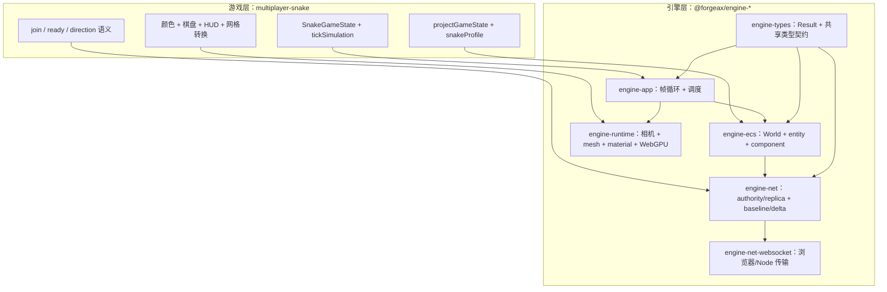
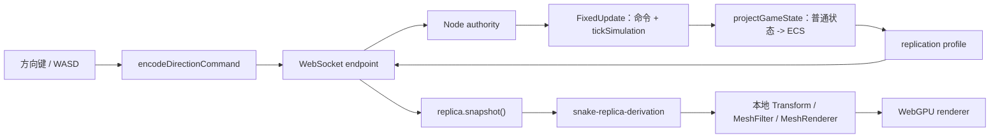
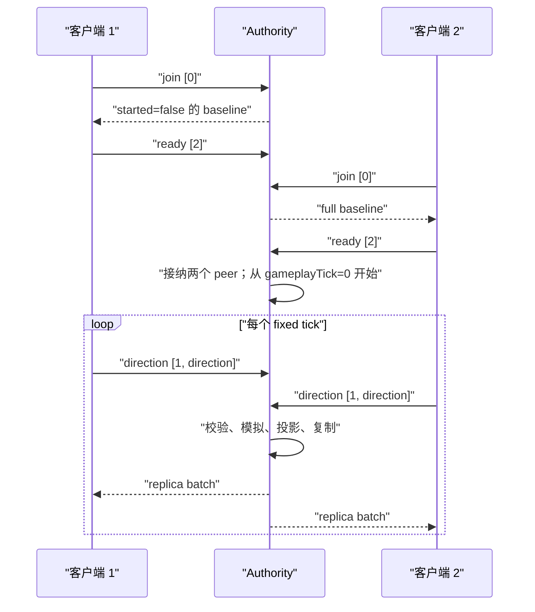

<!-- LANG-SWITCH -->
**语言**： [English](README.md) · **简体中文**

> [!IMPORTANT]
> 本 README 维护为双语双文件（[`README.md`](README.md) 英文主文档 · [`README.zh-CN.md`](README.zh-CN.md) 中文镜像）。任何修改都必须同步更新两个文件。

# @forgeax/multiplayer-snake

[](../../tsconfig.base.json)
[](../../packages/net-websocket)
[](../../packages/runtime)
[](../../packages/ecs)

> **一个服务端权威的多人贪吃蛇 demo：输入通过 WebSocket 发送，状态复制为 ECS 数据，所有客户端都用 WebGPU 渲染。**

这个 demo 虽然很小，却串起了 forgeax 的完整多人游戏链路：

- Node authority（权威服务端）拥有确定性的游戏模拟；
- 浏览器客户端只发送输入命令，只读取复制状态；
- 网络层传输 ECS entity 和 component，并正确维护 entity 引用；
- 客户端从 replica 派生本地渲染实体，不会反向修改复制的游戏状态。

## 快速开始

### 1. 启动 authority 服务端

先构建一次 workspace，确保引擎 package 和 WebSocket adapter 可用：

```bash
pnpm install
pnpm build
```

在第二个终端中启动监听 `8787` 端口的 Node authority：

```bash
pnpm --filter @forgeax/multiplayer-snake server
```

保持这个终端运行。authority 是唯一推进 Snake 规则并发布复制状态的进程。
authority 仍以 60Hz 驱动 ECS fixed tick；Snake 游戏层每 0.1 秒移动一格（10 格/秒），所以网络/输入响应频率和蛇的移动速度是两个独立概念。
需要更换端口时设置 `FORGEAX_SNAKE_PORT`。

### 2. 启动浏览器客户端

```bash
pnpm --filter @forgeax/multiplayer-snake dev
```

在浏览器中打开下面这个地址，并打开两个窗口：

```text
http://localhost:5173/?server=ws://localhost:8787
```

每个窗口就是一个玩家。renderer ready 后，客户端会自动发送 `join`；收到 authority 的等待态 baseline 后，会发送 `ready`。第二个玩家加入并且两个玩家都 ready 后，回合开始。使用方向键或 `WASD` 控制蛇。

如果 authority 使用默认地址 `ws://<当前主机>:8787`，可以省略 `server` 参数。HTTPS 页面需要使用 `wss://...`。

### 自动化证明

运行完整的浏览器证明流程。它会自动启动临时 authority、Vite dev server 和浏览器客户端：

```bash
pnpm --filter @forgeax/multiplayer-snake e2e:browser
```

运行单元测试和集成测试：

```bash
pnpm --filter @forgeax/multiplayer-snake test
pnpm --filter @forgeax/multiplayer-snake typecheck
```

## 引擎和游戏：边界在哪里

阅读这个 demo 时，可以先记住一句话：

> **引擎提供机制，游戏提供语义。**

引擎并不知道什么是蛇；游戏也不负责实现 WebSocket 帧、ECS archetype 存储、entity 引用重映射或 GPU command 录制。



### 引擎提供什么

| 引擎能力 | 本 demo 如何使用 | 仍然保持通用的部分 |
|:--|:--|:--|
| `engine-app` | 创建 app，并驱动 `Update` / `FixedUpdate` 和渲染 | 帧循环、delta 处理、renderer 生命周期和结构化 app 错误 |
| `engine-ecs` | 在 `World` 中存储 `Snake`、`GridPosition`、`SnakeBody`、`SnakeSession` | schema 定义的 entity、system、resource、调度、spawn/despawn 和类型化 component 访问 |
| `engine-net` | 服务端挂载 authority，浏览器挂载 replica | peer 身份、命令/消息队列、复制 profile、baseline、delta、snapshot 和 entity 引用重映射 |
| `engine-net-websocket` | 连接浏览器和 Node authority | WebSocket 生命周期、二进制帧、浏览器 client endpoint 和 Node listener |
| `engine-runtime` | 渲染 cube、material、camera 和 transform | 相机/渲染提取、mesh/material 资源、render graph 执行和 WebGPU backend 集成 |
| `engine-types` | 提供共享的 `Result` 风格契约和类型化失败 | 跨 package 的 POD 类型和显式成功/失败处理 |

### 这个游戏实现什么

| 游戏职责 | 本 demo 的 owner | 为什么不是引擎功能 |
|:--|:--|:--|
| 蛇的规则 | [`src/shared/rules.ts`](src/shared/rules.ts) | 移动、碰撞、食物、分数、身体增长、死亡和 30 tick 重生都是 Snake 语义 |
| 玩家协议含义 | [`src/shared/commands.ts`](src/shared/commands.ts) | `[0]`、`[1, direction]` 和 `[2]` 之所以表示 join、方向和 ready，是因为本游戏这样定义 |
| 接纳策略 | [`src/server.ts`](src/server.ts) | “至少两个 ready peer”、四人上限和开局时机是本 demo 的大厅规则 |
| 复制数据选择 | [`src/shared/components.ts`](src/shared/components.ts) | 引擎可以复制一个 profile，但由游戏决定哪些 component 描述一局 Snake |
| Authority 到 ECS 的投影 | [`src/server.ts`](src/server.ts) | 把普通 `SnakeState` 映射为蛇头、segment、食物和 session entity 是游戏逻辑 |
| 表现层 | [`src/client.ts`](src/client.ts)、[`index.html`](index.html) | 玩家颜色、边界、HUD 文案、键盘映射和网格坐标转换都是产品决策 |
| 证明场景 | [`src/__tests__/`](src/__tests__/) 和 [`scripts/`](scripts/) | join、增长、死亡、迟加入和断线是本游戏的验收场景 |

### 如何判断修改属于哪一边

可以问一句：**另一种完全不同的游戏能否复用这段代码，同时完全不知道 Snake 的存在？**

- 如果可以，它应该属于引擎 package 或引擎 adapter。例如 `createReplicaCoordinator()` 可以复制任意 profile，`connectWebSocketClientEndpoint()` 也不知道 payload 代表“向左转”。
- 如果不可以，它就属于这个 demo。例如 `isOpposite()`、`spawnFood()`、`initialSnakeCells()`、`playerNetworkId % 2` 和 `gridToWorldPosition()` 都编码了 Snake 或本 demo 的表现选择。

边界也可以从数据流看出来：

```text
游戏语义                     引擎机制                       游戏表现
SnakeGameState  ──project──▶ 复制 ECS ──snapshot──▶ 本地渲染实体
tickSimulation                authority/replica               material + HUD + camera
```

> [!IMPORTANT]
> 游戏拥有权威的“是什么”：规则、接纳、命令含义和视觉身份。引擎拥有可复用的“怎么做”：调度、ECS 存储、传输、复制机制、资源生命周期和渲染。

## 整体架构

authority 是游戏状态的唯一写入者。两个浏览器都收到同一份复制快照，再各自从快照构造表现层。下面的箭头会穿过上面描述的引擎/游戏边界：游戏代码提供规则和投影，引擎代码提供调度、传输、复制和渲染。



最关键的分层是：

```text
权威 SnakeGameState
        │  projectGameState()
        ▼
复制的 ECS entity/component
        │  snapshot + readComponent()
        ▼
客户端专属的渲染实体
```

## 从连接到游戏的生命周期



第一个客户端会停留在等待状态，直到两个 peer 都完成接纳并发送 `ready`。authority 先把 session 标记为 started，再在下一个 fixed tick 推进游戏，因此开局边界是可观察且确定的。

## 服务端：权威模拟

[`src/server.ts`](src/server.ts) 创建无头 ECS `World`，通过 `netPlugin({ endpoint })` 安装网络资源，再挂载 `createAuthorityCoordinator(world, snakeProfile)`。

[`src/shared/rules.ts`](src/shared/rules.ts) 中的普通对象状态是游戏规则的 SSOT：

| 字段 | 含义 |
|:--|:--|
| `snakes` | 每个已接纳 peer 对应一个 `SnakeState`：方向、分数、身体格子、重生计时 |
| `food` | 当前食物所在的网格格子 |
| `tick` / `gameplayTick` | authority tick 和游戏 tick |
| `width` / `height` | `24 × 16` 的网格 |
| `seed` | 由状态持有的确定性伪随机种子 |
| `maxPeers` | 最多接纳 4 个 peer |

每次 `FixedUpdate` 都执行一个权威步骤：

1. 取出原始网络消息，并清理已经断开的 peer。
2. 解析 `join` 和 `ready` 命令。
3. 最多接纳 4 个在线 peer，并为新 peer 请求 full baseline。
4. 只有至少两个 peer ready 后才开始游戏。
5. 每个 peer 最多接受本 tick 中第一条有效且非反向的方向命令。
6. 如果 session 在本 tick 开始前已经 started，则推进确定性模拟。
7. 把普通状态投影成复制 ECS entity，并发布给客户端。

`tickSimulation()` 处理移动、撞墙、撞身体、头部相撞、吃食物增长、带种子的食物位置、死亡和重生。死亡的蛇会暂时变成空身体，并在恰好 30 个 authority tick 后以三节身体重生。

## 命令与信任边界

[`src/shared/commands.ts`](src/shared/commands.ts) 由浏览器和 authority 共用，但 authority 仍然是最终信任边界。

| 命令 | 字节 | 含义 |
|:--|:--|:--|
| `join` | `[0]` | 请求接纳 |
| direction | `[1, directionIndex]` | `up=0`、`right=1`、`down=2`、`left=3` |
| `ready` | `[2]` | 客户端准备进入游戏 |

payload 不包含玩家身份。WebSocket endpoint 提供 `PeerId`，authority 使用这个传输层身份绑定对应的蛇。命令最多 16 字节；格式错误会返回带类型的 `CommandError`；反向转向会在服务端被拒绝。

因此客户端不能权威地瞬移、加分、增长或冒充其他玩家，它只能请求 authority 改变自己的方向。

## ECS 与复制模型

[`src/shared/components.ts`](src/shared/components.ts) 定义机器可读的 component schema 和一个 replication profile：

| Component | 作用 | 是否复制 |
|:--|:--|:--:|
| `Networked` | 标记需要进入网络流的 entity | 是 |
| `Snake` | 方向、分数、稳定的 `playerNetworkId` | 是 |
| `SnakeBody` | 指向蛇身体 segment 的 entity 引用 | 是 |
| `SnakeSegment` | segment 所属玩家和身体顺序 | 是 |
| `GridPosition` | 整数网格坐标 | 是 |
| `Food` | 标识食物 entity | 是 |
| `SnakeSession` | 等待、开局和 tick 可观测状态 | 是 |
| `ControlledBy` | authority 内部的 peer 绑定 | 否 |
| `PendingDirection` | authority 内部的命令暂存 | 否 |

profile 复制带有 `Networked` 的 entity 以及面向游戏的 component。`projectGameState()` 创建或删除身体 segment 时，coordinator 会重映射 `SnakeBody.segments` 中的 entity 引用；所以 replica 上的身体仍能保持正确的所属关系和顺序，即使每个客户端的本地 entity handle 不同。

这里特意分开两种身份：

- `playerNetworkId` 是 scoreboard 展示的稳定游戏身份；
- `networkEntityId` 标识一个复制 entity 的 incarnation（实体实例），死亡、重生或重新投影后可能变化。

## 客户端：从 replica 到渲染

[`src/client.ts`](src/client.ts) 负责组装 `createApp()`、安装网络插件、挂载 replica coordinator、等待 renderer ready、发送 `join` 并安装键盘输入。

之后，`snake-replica-derivation` 这个 `Update` system 会：

- 读取 `replica.snapshot()` 和 `replica.readComponent()`；
- 从快照派生蛇头、身体、食物和 session HUD 数据；
- 使用 `Transform`、`MeshFilter`、`MeshRenderer` 创建或更新本地渲染实体；
- 删除快照中已经不存在的本地渲染实体；
- 在等待阶段只发送一次 `ready`。

从客户端视角看，复制 ECS entity 是只读的；渲染实体则完全独立。这样材质、缩放、相机位置和 DOM HUD 等表现层细节不会污染网络协议。

场景使用 cube geometry 和 unlit material：

- 青色和橙色区分玩家；
- 身体 segment 使用对应的深色材质；
- 粉色 cube 表示食物；
- 四个薄 cube 表示边界；
- 正交相机覆盖整个 `24 × 16` 棋盘。

模拟网格的 y 轴向下增长，而正交世界的 y 轴向上增长，转换集中在 `gridToWorldPosition()`：

$$
world(x, y) = (x - 12,\ 8 - y,\ 0)
$$

隐藏的 `data-testid="snake-state"` output 不是游戏 UI，而是结构化观测面。浏览器测试用它检查生命周期、复制状态、命令证据和渲染实体数量。

## 收敛与迟加入

所有客户端收到 authority 的复制结果，因此收敛比较的是语义状态，而不是本地 ECS handle。 [`src/shared/convergence.ts`](src/shared/convergence.ts) 按 peer ID 排序后比较游戏字段、食物和 tick。

游戏开始后新 peer 加入时，authority 会发送包含当前已接纳 roster 的 full baseline。新 replica 先重建同一批蛇和重映射后的身体引用，再继续接收后续 delta。断线清理会同时删除 authority 侧的蛇，以及复制到客户端的蛇头和身体 segment entity。

## 源码索引

| 关注点 | SSOT |
|:--|:--|
| 浏览器启动和 endpoint 选择 | [`src/main.ts`](src/main.ts) |
| 客户端连接、replica 派生、渲染、键盘输入 | [`src/client.ts`](src/client.ts) |
| authority 组装和 ECS 投影 | [`src/server.ts`](src/server.ts) |
| 二进制命令和校验 | [`src/shared/commands.ts`](src/shared/commands.ts) |
| 复制 component schema | [`src/shared/components.ts`](src/shared/components.ts) |
| 确定性游戏规则 | [`src/shared/rules.ts`](src/shared/rules.ts) |
| 语义收敛快照 | [`src/shared/convergence.ts`](src/shared/convergence.ts) |
| WebSocket authority/browser e2e 编排 | [`scripts/authority-e2e.mjs`](scripts/authority-e2e.mjs)、[`scripts/browser-e2e.mjs`](scripts/browser-e2e.mjs) |

## 验证矩阵

| Gate | 证明内容 |
|:--|:--|
| `rules.test.ts` | 移动、增长、碰撞、确定性食物、死亡和重生 |
| `commands.test.ts` | 二进制 round trip、边界、身份分离和输入过滤 |
| `server-integration.test.ts` | authority 生命周期、fixed tick、接纳、投影和断线行为 |
| `convergence.test.ts` | 身体引用重映射、full baseline 和 replica 收敛 |
| `write-contract.test.ts` | replica 只读写入和本地渲染实体派生 |
| `process-e2e.test.ts` | 真实 WebSocket 客户端覆盖 join、增长、死亡、重生、迟加入和断线 |
| `e2e:browser` | Vite + Chrome/WebGPU 生命周期及渲染实体数量证据 |

> [!NOTE]
> 浏览器 e2e 支持用 `SNAKE_SABOTAGE=visual-hide-body` 做视觉反证。如果禁用身体渲染，网络 replica 仍可能正确，但渲染实体数量断言会失败。这样网络正确性和表现正确性就保持为两个独立、可测试的契约。
