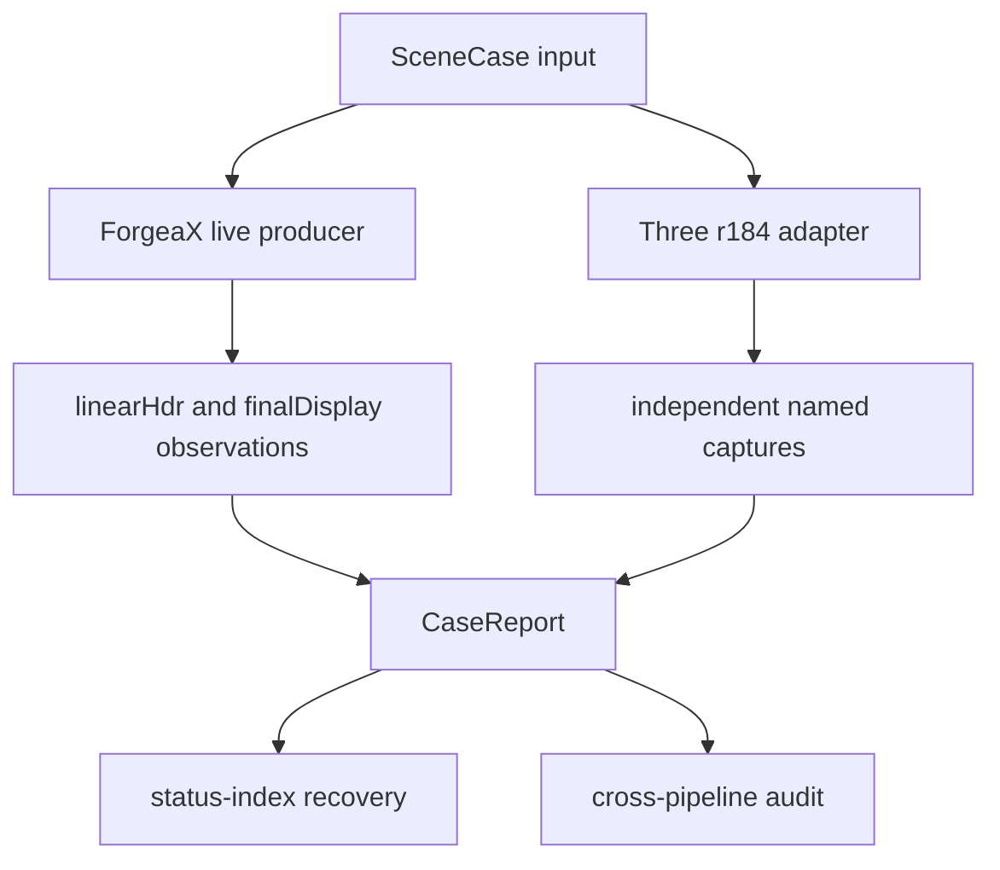

# Color and Lighting Parity

Minimal, evidence-first parity gate for Three.js r184 and ForgeaX color and lighting.

## Start here

```bash
pnpm bench:color-lighting-parity
```

The command builds the consumer, starts the preview server, executes the browser
matrix, and fails closed when a required producer or report field is missing.
The browser result is returned by `window.__colorLightingParity`; the Dawn
producer gate is exercised by the direct-light Dawn test.

## Capability and matrix contract

| Capability | Required route | Authority |
| :-- | :-- | :-- |
| Direct-light parity | Three r184 plus ForgeaX `SceneCase` | [`scene-case.schema.json`](./schemas/scene-case.schema.json) |
| Named case result | One `CaseReport` per case | [`case-report.schema.json`](./schemas/case-report.schema.json) |
| Required parity backend roster | Browser WebGPU, Dawn, WebKit WebGL2 | [`package.json`](./package.json) `parityMatrix`; per-case `applicableBackends`/`matrixRequiredBackends` are owned by [`required-cases.ts`](./src/coverage/required-cases.ts) |
| WebKit final-display sentinel slice | Six WebKit WebGL2 cells: default sRGB, alpha mask, alpha blend, ACES tone, direct directional URP, transparent LDR URP | [`verify-webkit-color-lighting.mjs`](../../../scripts/dev-verify/verify-webkit-color-lighting.mjs) runs ForgeaX rhi-wgpu + Three r184 in one WebKit process; hello triangle is supporting channel proof |
| Required pipelines | `urp` and `hdrp` | Generated `status-index.json` |

The current backend and pipeline matrix is generated at
`report/color-lighting-parity/status-index.json`. Read
[`status-index.md`](./status-index.md) for the recovery map; this README does
not duplicate per-case status values.

> [!CAUTION]
> A matrix is complete only when required, primary, and matrix counts have no
> `not-executed`, `failed`, `unsupported`, or `degraded` entries. Missing
> producer evidence remains incomplete even when a browser canvas is visible.

> [!IMPORTANT]
> `finalDisplay` is display-space diagnostic output. `linearHdr` is the only
> attachment evidence used for HDR lighting claims. A final canvas, browser
> skip, generic smoke, replay texture, or analytic-only result never upgrades
> a missing producer to pass.

> [!NOTE]
> WebKit closes only the declared final-display sentinel cells. Its WebGL2
> fallback does not claim `linearHdr`, HDRP transparent, or HDR IBL coverage.
> Raw byte differences remain diagnostic; finite analytic/ROI fallback budgets
> are still enforced, with no empirical gamma, multiplier, or blend correction.

## Current status

The unique report authority is the per-case `CaseReport`. Read the generated
`directLightEvidence`, `attachmentEvidence`, `readback`, `status`, `verdict`,
and `firstDivergence` fields; do not infer matrix coverage from this document.



## Evidence vocabulary

| Field | Meaning | Required proof |
| :-- | :-- | :-- |
| `linearHdr` | Native linear HDR producer attachment | `rgba16float`, current frame, native readback bytes, raw hash, size, pipeline, backend |
| `finalDisplay` | Native canvas/display output | Final readback bytes, raw hash, size, pipeline, backend |
| `attachmentReadbackStatus` | Attachment execution state | `complete` only after the producer readback is complete |
| `missingPipelineIds` | Required producer coverage | Empty only when both `forgeax::urp` and `forgeax::hdrp` evidence exist |
| `firstDivergence` | First named failure owner | A report-owned metric, never an aggregate-only claim |

## Two-hop navigation

1. Use [`status-index.md`](./status-index.md) to map a report state to its one
   recovery action.
2. Open the named owner and schema:
   [`SceneCase`](./schemas/scene-case.schema.json),
   [`CaseReport`](./schemas/case-report.schema.json),
   [capture/readback](./src/capture/attachment-readback.ts),
   [error routing](./src/errors.ts), or
   [cross-pipeline audit](./src/integration/cross-pipeline-audit.test.ts).

The engine-side recovery entry points are [`forgeax-engine-material`](../../../skills/forgeax-engine-material/SKILL.md),
[`forgeax-engine-shader`](../../../skills/forgeax-engine-shader/SKILL.md),
[`forgeax-engine-render-pipeline`](../../../skills/forgeax-engine-render-pipeline/SKILL.md),
and [`forgeax-engine-rhi`](../../../skills/forgeax-engine-rhi/SKILL.md).

## Raw capture and reruns

The live observation path is:

```ts
renderer.observeCurrentFrame({
  semantic: 'linear-hdr',
  readback,
});
```

The producer owns the current frame. The readback owner copies and maps the
native resource, then returns bytes and provenance. Parity consumes the bytes,
hash, format, size, frame, pipeline, and backend fields; it does not consume a
graph key, RHI texture, or backend-private handle.

For a focused rerun, execute the direct-light tests and name the case fixture
in the test or browser harness. Keep the resulting report with the same
`caseId`; do not replace a failed producer capture with a hand-authored hash.

```bash
pnpm exec vitest run --project=browser \
  apps/parity/color-lighting/cases/direct-light/__tests__/direct-light.browser.test.ts
pnpm exec vitest run --project=dawn \
  apps/parity/color-lighting/cases/direct-light/__tests__/direct-light.dawn.test.ts
```

## Scope boundary

The direct-light gate covers the frozen Three r184 squared finite-range
authority and `KHR_lights_punctual` import semantics. M5 IBL is a later
milestone and must consume this `linearHdr` seam rather than add an IBL-only
readback path.

> [!CAUTION]
> Never accept self-comparison, final-canvas self-comparison, URP-as-HDRP
> provenance, stale observations, missing `COPY_SRC`, guessed multiplier or
> curve, arbitrary graph keys, or a second copy/map implementation.
