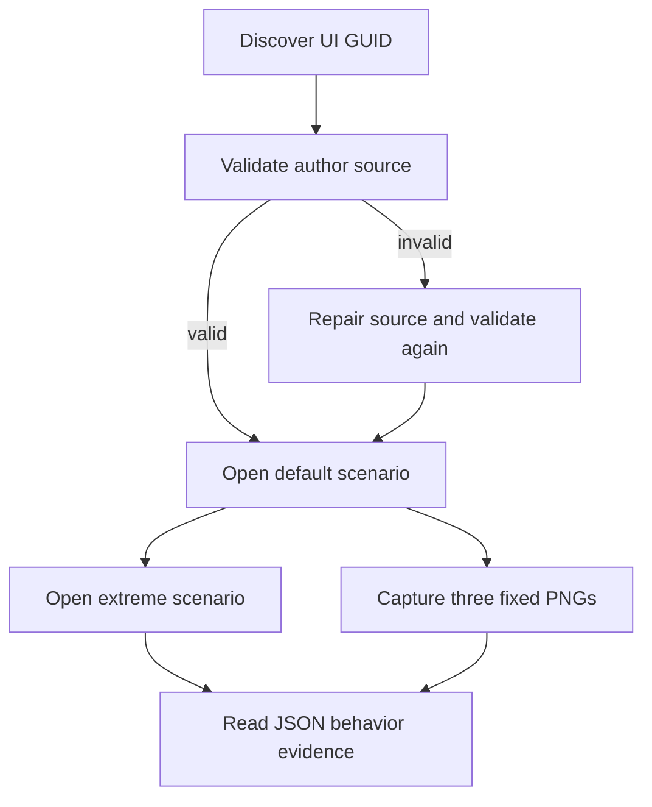

# `@forgeax/preview`

The preview app is a small, independent dogfood host for the UI authoring loop. It exposes the same loader, mount, scenario, refresh, and capture seam used by a future editor without adding an editor panel or a second asset format.

## Shortest path

Open the dev host, then use the browser global `__forgeaxUiAuthoring` from automation:

```ts
const host = window.__forgeaxUiAuthoring;
const [target] = host?.discover() ?? [];
const validation = await host?.validate();
const opened = await host?.open('default');
const evidence = opened?.ok ? await host.capture(browserAdapter) : opened;
```

The checked-in smoke command runs the full loop and prints one JSON report:

```bash
pnpm --filter @forgeax/preview smoke:ui-authoring
```



## What the host proves

| Check | Observable result |
| --- | --- |
| GUID discovery | `discover()` returns the target `guid` and `kind`. |
| Invalid to repair | `repair()` returns structured diagnostics for invalid HTML, then a valid result after the source is fixed. |
| Scenarios | `open('default')` and `open('extreme')` use ordinary TypeScript `data-ui-part` scenarios. |
| Determinism | Playwright captures the mounted preview host three times as real PNG bytes at one viewport, scale, and frozen clock; the smoke rejects tiny or differing payloads. |
| Lifecycle | `dispose()` removes the run-owned host and clears the browser global. |

> [!IMPORTANT]
> The global is a development smoke seam only. Production game code should consume `@forgeax/engine-ui/preview` directly and own its session root. Scenario modules are not imported into the production asset payload.

<details>
<summary>Error recovery and prohibited shortcuts</summary>

Branch on `error.code`, then read `expected`, `hint`, and the narrowed `detail`. `capture-not-ready` lists every unmet readiness fact and never includes `png`; repair the named resource, clock, scenario, or browser failure and retry.

Do not parse `message`, silently skip a scenario, mount to `document.body`, add a duplicate UI manager, or use a custom mesh/stand-in to hide an engine asset failure.
</details>
