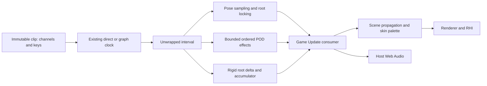

# G12 timeline and G30 root motion validation

> [!NOTE]
> Initial measurement source: `8dc0dfc1129a4f4cb2e1521c17ed07a3bb92f714`, based on `21e3596e81`. Current runtime source includes the corrections below; the numerical and seam corrections below supersede that initial source. Images and distributions in this document retain their measured revision. Final-runtime captures, distributions and delivery receipts are published in [Engine PR #3641](https://github.com/ForgeaX-Games/forgeax-engine/pull/3641) and [evidence PR #48](https://github.com/ForgeaX-Games/forgeax-engine-assets/pull/48). [Engine PR #3641](https://github.com/ForgeaX-Games/forgeax-engine/pull/3641). [Full evidence archive](https://github.com/ForgeaX-Games/forgeax-engine-assets/tree/c3bf1f8ed55d4f282453941a3a8747f0636a8ba2/evidence/2026-10-04-g12-g30-animation) includes screenshots, raw distributions, compressed complete tapes, resource lineage and log receipts.

## Result and ownership

G12 adds sorted typed method/audio/sub-animation keys to ordinary AnimationClip assets. G30 adds an opt-in AnimationRootMotion component with per-update rigid delta, accumulated motion and time-zero root locking. Both consume the existing direct/graph playback interval before modulo. Game Update code consumes ordered POD effects after pose completion and applies movement; World remains the clock authority, Host Web Audio remains the audio owner, and Renderer receives ordinary Scene/skinning state.



| Concern | Contract / evidence |
|:--|:--|
| Crossing | Forward `(from,to]`, reverse `[to,from)`; all crossed cycles, distinct zero/end seam keys; fraction/slot/traversal-cycle/key ordering |
| Seek | Direct time or graph node-time edits establish the next start; no skipped-history effects or motion; zero delta emits none |
| Blend | Positive slots emit once each; zero-weight slots silently advance. Pose masks do not suppress discrete commands; root masks weight motion |
| Mutation | Consumers run after all player poses; child playback begins next animation update, no recursive same-tick evaluation |
| Bound | 1024 keys/clip, 2048 effects/player/tick; explicit overflow instead of silent loss; finite representable clocks |
| Asset closure | Existing inline restoration retains timeline POD and typed sampler arrays; Import registers audio/child GUID dependencies; producer version changes to animation-clip/2 |
| Failure | Closed animation playback failures with expected/hint/detail; malformed root tracks, weights, accumulators and keys rejected; scheduled failure poisons World as existing ECS policy requires |

For root pose $S(t)$, reference-relative parent-space $T(t)=S(t)S(0)^{-1}$ and $C=T(D)$:

$$
U(t)=C^{\lfloor t/D\rfloor}T(t-\lfloor t/D\rfloor D),\qquad
\Delta=U(from)^{-1}U(to).
$$

Cycle powers use logarithmic composition. Translation-only constant-orientation tracks use a direct delta. The actor applies the delta in its current orientation, while the local root stays at $S(0)$. A nonzero reference root plus turning regression checks the multiplication basis. Weighted translation and sign-corrected quaternion blending include stationary positive slots as identity motion.

## Reference source comparison

The following are the actual locally inspected reference revisions, not an assumption that the audit's version labels match the available bytes. No cross-engine timing comparison was run.

| Primary source | Observed mechanism | ForgeaX decision |
|:--|:--|:--|
| [Godot AnimationMixer, 4c311cbee68c0b66ff8ebb8b0defdd9979dd2a41](https://github.com/godotengine/godot/blob/4c311cbee68c0b66ff8ebb8b0defdd9979dd2a41/scene/animation/animation_mixer.cpp#L1644) | Method, audio and animation track branches; method calls can be deferred; audio and child player have distinct owners. Root motion branches handle wrap segments and rotated translation near line 1223 | Closed typed action union and explicit ordered consumer preserve Engine realm/Host boundaries; no reflective method invocation or second controller registry |
| [Three.js AnimationAction, d3b629c0c2097cec664ad16369bb6eae3b10e335](https://github.com/mrdoob/three.js/blob/d3b629c0c2097cec664ad16369bb6eae3b10e335/src/animation/AnimationAction.js#L807) | Signed loopDelta and mixer loop dispatch before final wrapped time | Capture unwrapped interval once at the existing clock owner; graph and direct playback share traversal semantics |
| [UE AnimSequenceBase, 71fe36aac5a8df5ccd66c763ffc902b29b6a9c43](https://github.com/EpicGames/UnrealEngine/blob/71fe36aac5a8df5ccd66c763ffc902b29b6a9c43/Engine/Source/Runtime/Engine/Private/Animation/AnimSequenceBase.cpp#L383) | Notify traversal splits looping ranges, directional half-open intervals, bounded loop processing | Explicit crossed-event capacity fails rather than clamping away authored effects |
| [UE AnimSequence root extraction, same revision](https://github.com/EpicGames/UnrealEngine/blob/71fe36aac5a8df5ccd66c763ffc902b29b6a9c43/Engine/Source/Runtime/Engine/Private/Animation/AnimSequence.cpp#L1564) | Extracts root motion across contiguous ranges and loop boundaries | Independent rigid-transform cycle composition handles multiple cycles/reverse and exposes game-owned accumulation |

Godot checkout is the pinned 4.4-stable reference; Three.js manifest is r184; UE is the authorized 5.8.1 checkout. UE links require the reader's Epic repository authorization. Only mechanisms are compared; this implementation does not claim full Godot track tooling or Unreal montage/Sequencer/motion-warping parity.

## Same-path correctness

The integration suite drives real World animation systems, direct and graph clocks, target binding and Scene Transform values. Replacing the two playback systems with the baseline revisions made 8/15 original reproducer cases fail; restoring implementation passed 15/15. That initial expanded suite passed 16/16. The current source passes 24/24 integration cases and the complete package-owned suite passes 34 files /160 tests with no type errors. The failures and green receipts remain in the archive.

| Verification | Result |
|:--|:--|
| Animation owner suite | Current source: 34 files /160 tests passed, no type errors; initial diagnostic run: 33 files /153 tests |
| Animation + assets-runtime + Import owner suites | 148 files, 1072 tests passed |
| Expanded timeline/root-motion regression | Current source: 24/24 passed, including graph consumed-once intervals, nonzero reference turning, finite f32 publication and real-World forward/reverse seam ordering |
| Targeted Import registry | 10 passed after producer version bump |
| Types / declarations | Animation, assets-runtime, Import graph and Feature Lab type checks passed |
| Build | Full pnpm build:engine passed; 62 built, 5 cached; shared shader producer 180803 ms |
| Static gates | Biome changed sources, render/animation boundary, complete lint:grep and test layout passed |

The integration cases include seam ordering, reverse/large-step playback, pause/seek, same-time slots, masks/zero weights, graph clock handoff, malformed keys and overflow, forward/reverse translation, turning multi-loop composition, accumulated deltas, root reference locking and weighted blend. This is stronger than testing the arithmetic helper alone.

## Corrections verified before delivery

| Reproduced failure | Owning correction | Regression |
|:--|:--|:--|
| Finite 1e38 translation curve plus four cycles publishes Infinity in f32 component storage; a near-limit accumulator can overflow even when its delta fits | Validate derived delta and accumulator against finite f32 before pose/root publication; direct clocks also remain uncommitted | Red failure archived; both overflow cases pass without writing clock/pose/root output |
| At a shared seam, zero-time play sorted ahead of the departing duration-time stop, leaving a looping effect stopped | Traverse departing cycle before next cycle in forward playback; reverse does the opposite; preserve authored order at equal authored times | Red audio-key order archived; direct and graph World schedules pass in both directions |
| Float32 clock rounds past an unvisited key, or back below a dispatched key | Store the existing direct/graph clocks as Float64; canonicalize only duration boundaries within one ulp | Four direct/graph red reproductions now pass; terminal STEP pose regression remains green |
| Package test command discovers the whole workspace and exhausts Node heap; inherited production mode suppresses development diagnostics | Package-owned Vitest configuration pins test mode and retains every package test/type check | 34 files /160 tests; targeted reproduction 24/24; no deadlines or assertions weakened |

Event cycle indices are relative to the update's normalized clock start, not a lifetime loop counter. All poses complete before ordinary game code processes the ordered effects. Final source differs from the initial measurement in root-motion's finite storage check, timeline tie ordering, Float64 playback clocks, regression coverage, test configuration and documentation. The feature diff against current main contains no Renderer, shader, RHI or Scene change. The branch now includes main's published GI path fix [#3640](https://github.com/ForgeaX-Games/forgeax-engine/pull/3640); two previous-baseline GI 300-second timeout receipts and subsequent exact-head gates are retained with the PR evidence.

## Visible effects and real audio


The cyan actor starts at x=-2.5, clip phase 0.75, then advances 0.5 s on a 2-unit/second looping root track: it reaches x=-1.5 across the seam instead of jumping backward. The root local translation stays zero. Method/audio/animation keys arrive exactly once in that order; the method bends cyan's upper joint and the child clip bends orange's upper joint in the opposite direction. The audio consumer uses the real Web Audio plugin, valid WAV decode and a real active AudioBufferSource: one in ON, zero in OFF, no decode failure. Audio volume is zero for automated execution; this proves the Host decode/playback route, not audible quality. Both controls pass seven checks.

## RHI Debug evidence

The initial measured run at 8dc0dfc112 acquired `/tmp/forgeax-physical-gpu.lock`, used Chrome WebGPU on Apple M4 Pro / Metal (actual adapter vendor apple, architecture metal-3), and completed 60 frames in each mode before capture. Both tapes are v7, 170 events and 25 work items, ending at output work 24 in bgra8unorm, 766 by 820. Actual default adapter and system observations are recorded; a browser launch flag is not treated as proof of a software adapter.

| Measurement | ON | OFF |
|:--|--:|--:|
| Actual bound skin palettes | 2 | 2 |
| Analytic CPU matrix maximum error | 7.9512e-8 | 1.4305e-7 |
| Fresh-device replay/live mean pixel error | 0 | 0 |
| Fresh-device replay/live maximum pixel error | 0 | 0 |
| ON/OFF mean pixel difference | 0.0054210 | Same pair |

InspectBufferRecords reads the palette at the actual work binding and offset. The reference matrices independently encode actor travel and joint angle; tolerance is 1e-4. Replacing the actually bound palette buffer 270 with zero data removes the rigs and yields pixel difference 0.0032711. The resource is shared by both visible rigs, so the control intentionally removes both; it proves that the inspected bound data affects raster output.


The four resources without bootstrap seed data were traced through exact handles and texture-view ancestry, not substring matches:

| Resource | First relevant operation / interpretation |
|:--|:--|
| buffer:295, LOD readback, 1168 bytes | Copies at events 124/125/126 cover offsets 0..1168; no earlier reader |
| buffer:4, timestamp readback, 8192 bytes | Event 166 writes the used 4336-byte prefix from buffer:3; remainder is unused in this frame |
| texture:445, scene depth | First main pass event 47 clears depth and stencil; later main-late/transparent loads follow this initialization |
| Swapchain texture:1797 ON / 6868 OFF | Output-transform event 158 clears color before the final draw |

Complete descriptors, consumers and relevant commands are in unseeded-lineage.json. Frame closure counts and byte estimates in browser-rhi.json describe capture/replay retention, not runtime VRAM or a leak. Replay equality is a deterministic correctness check, not a quality/performance improvement.

## Initial CPU scaling and negative results


Apple M4 Pro, Node/runtime version and OS are recorded in JSON. Each mode creates a real World, one root target/player, runs 60 warmup + 300 measured updates at 1/60 s, and includes all event draining. The order is baseline/both/both/baseline/events/motion for 100 then 1000 players. Baseline is the current implementation with both features disabled, not an old-main comparison. Every motion case asserts 12 units accumulated over 360 ticks within 1e-4; every event case asserts 12 events/player exactly.

| Players | Mode, in execution order | p50 ms | p95 ms | p99 ms | Events over 360 ticks |
|--:|:--|--:|--:|--:|--:|
| 100 | baseline | 0.746 | 1.228 | 3.327 | 0 |
| 100 | both | 1.648 | 2.034 | 2.248 | 1200 |
| 100 | both | 1.382 | 1.692 | 1.776 | 1200 |
| 100 | baseline | 0.461 | 0.621 | 0.824 | 0 |
| 100 | events | 0.374 | 0.479 | 0.554 | 1200 |
| 100 | motion | 1.692 | 2.319 | 2.499 | 0 |
| 1000 | baseline | 5.731 | 8.198 | 9.806 | 0 |
| 1000 | both | 12.950 | 19.975 | 29.486 | 12000 |
| 1000 | both | 12.426 | 55.783 | 86.759 | 12000 |
| 1000 | baseline | 4.341 | 4.757 | 4.934 | 0 |
| 1000 | events | 4.309 | 4.811 | 7.000 | 12000 |
| 1000 | motion | 12.683 | 34.064 | 77.090 | 0 |

> [!WARNING]
> The 1000-player combined p95 is 19.975 / 55.783 ms, exceeding a 16.67 ms frame even before rendering. This is an explicit capacity limitation. The task's own build had ended for this run, but the machine remained shared and background physical rendering began partway through it. ABBA does not remove GC/JIT/host contention; events-only appearing faster than baseline is not evidence of a speedup.

Earlier prototype results are retained. The table above measures 8dc0dfc112, before the final f32 postcondition and seam correction; it does not establish final-runtime timing. The canonical final-runtime measurement is linked in the PR and evidence PR #48. Inspection found three missing-component Error constructions per ordinary player/update and replaced that route with hasComponent. Root reference/cycle facts are cached for immutable clips, graph intervals are indexed by slot, and constant-orientation motion avoids general rigid composition. Different prototype runs were not isolated A/B experiments, so their timing changes are diagnostic evidence only. Allocation cost in root extraction remains material at crowd scale; no threshold was weakened to call the 1000-player result a pass.

## GPU timing boundaries

After the visible scene settles, the script collects ON/OFF/OFF/ON observations, 121/120/121/120 complete samples. This tiny static two-rig fixture checks rendering cost/behavior; ongoing animation extraction is covered by the CPU benchmark above. Native outer submission timing was not collected.

| ABBA group | Pass-sum p50/p95 ms | Interval-union p50/p95 ms | Overlap p50/p95 ms | Envelope p50/p95 ms |
|:--|:--|:--|:--|:--|
| ON A | 1.092 / 1.339 | 1.053 / 1.106 | 0.035 / 0.279 | 1.112 / 1.272 |
| OFF A | 1.091 / 1.134 | 1.054 / 1.090 | 0.034 / 0.036 | 1.112 / 1.146 |
| OFF B | 1.123 / 1.453 | 1.056 / 1.111 | 0.044 / 0.397 | 1.121 / 1.447 |
| ON B | 1.088 / 1.141 | 1.054 / 1.092 | 0.034 / 0.036 | 1.111 / 1.149 |

Pass sums include overlapping copy-boundary envelopes; they are not elapsed GPU time. Union merges timestamp intervals, overlap is sum minus union, and envelope is latest end minus earliest start. No meaningful GPU regression or improvement is established by this fixture; the interval-union medians are within about 0.003 ms. Browser CPU sample quantization (p50 0, p95 0.1 ms) cannot resolve this feature's extraction cost.

## Reproduction and remaining boundary

```sh
pnpm build:engine
pnpm --filter @forgeax/engine-animation test src/__tests__/timeline-root-motion.integration.test.ts
ANIMATION_EVIDENCE=artifacts/g12-g30 node packages/animation/bench/timeline-root-motion.mjs
FEATURE_LAB_RHI_DEBUG=1 pnpm --filter @forgeax/feature-lab dev
# Serialize this command with the shared physical GPU lock; use the actual server URL.
FEATURE_LAB_URL=http://localhost:5174 ANIMATION_NATIVE_GPU=1 ANIMATION_FEATURES=timeline-root-motion ANIMATION_EVIDENCE=artifacts/g12-g30 node apps/feature-lab/scripts/verify-animation.mjs
```

The package owns its Vitest config and pins NODE_ENV=test for diagnostic assertions. Before adding this entry, the package command loaded the entire workspace and exhausted the Node heap; the archived failed run is not a pass. The first package-owned run also exposed eight diagnostic failures from the ambient NODE_ENV=production; isolating the test mode fixes the owning setup without changing runtime diagnostics or deadlines. gunzip the archived tapes before using RHI Debug openReplay; use a fresh device with replayDeviceRequest.

Root scale, collision solving, motion warping, gait retiming, automatic target-to-method reflection, UI timeline editing, audible quality, multi-realm consumer transport and full engine parity are outside this delivered rigid/POD contract. Game code explicitly handles reverse sounds, repeated commands and physics application. Required PR CI Browser/Dawn/full smoke gates and the extra complete 60-frame hello/learn fleet must pass at the final PR commit before admin merge; their live receipts are linked in the PR rather than predicted here.
