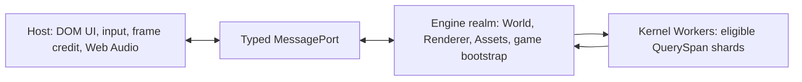

# @forgeax/engine-app

> **App is the browser host adapter: it measures one frame delta, passes it to the World, and draws.** Game scheduling, time resources, fixed-step policy, and gameplay behavior belong to the ECS World.

## One-screen takeoff

```ts
import { createApp } from '@forgeax/engine-app';
import { Time, Update } from '@forgeax/engine-ecs';
import { forgeaxBundlerAdapter } from 'virtual:forgeax/bundler';

const result = await createApp(canvas, {}, forgeaxBundlerAdapter());
if (!result.ok) {
  console.error(result.error.code, result.error.hint);
  throw result.error;
}

const app = result.value;
app.world.addSystem(Update, {
  name: 'move-player',
  queries: [],
  fn: (world) => {
    const delta = world.getResource(Time).delta;
    movePlayer(delta);
  },
}).unwrap();
app.start().unwrap();
```

The canvas form creates a World, renderer, default plugins, browser input backend, and rAF loop. Handle the `Result` before calling `start`.

## Execution tiers

`execution` moves the complete World, Renderer, AssetRegistry, render features,
and gameplay plugins into one Engine Worker. The Host keeps DOM input, frame
credit, Web Audio, and inspection. `shared` adds a lazy persistent Kernel Worker
pool over shared ECS numeric columns; it does not split the live World or render
graph across realms.

The bootstrap module is a two-step realm contract. Its default function first
constructs renderer features and plugins inside the selected realm, then its
`run` callback receives the ready, real owners. It never receives a remote World
or a fake host App.

```ts
// game-bootstrap.ts
import type { ExecutionBootstrapEntry } from '@forgeax/engine-app';
import { audioPlugin } from '@forgeax/engine-audio';

const bootstrap: ExecutionBootstrapEntry = (data) => ({
  features: [createGameRenderFeature(data)],
  plugins: [audioPlugin(), createGamePhysicsPlugin(data)],
  async run({ world, renderer, assets, port, registerCleanup }) {
    const session = await createGameSession({ world, renderer, assets, port });
    registerCleanup(() => session.dispose());
  },
});

export default bootstrap;
```

```ts
const result = await createApp(canvas, {
  execution: {
    tier: 'auto',
    bootstrap: new URL('./game-bootstrap.mjs', import.meta.url),
    bootstrapData: { gameId: 'example' },
    bootstrapPort: realmPort,
  },
}, forgeaxBundlerAdapter());
if (!result.ok) throw result.error;

const app = result.value;
app.start().unwrap();
const report = app.execution.report();
console.log(report.requestedTier, report.actualTier, report.selectionReason);

if (report.world.health === 'poisoned') {
  const rebuilt = await app.execution.rebuild();
  if (!rebuilt.ok) throw rebuilt.error;
}
```



| Requested tier | Runtime shape | Selection rule |
|:--|:--|:--|
| `main-serial` | Host-owned World and Renderer | Always available |
| `engine-worker` | Co-located Engine Worker | Requires Worker, OffscreenCanvas, and Worker WebGPU |
| `shared` | Engine Worker plus SAB Kernel pool | Also requires isolation headers, SharedArrayBuffer, and Atomics wait |
| `auto` | Best available proven tier | Reports the actual tier and reason; never disguises fallback |

An explicit unavailable tier returns a structured `AppError`; only `auto` falls back. Serve `shared` with `Cross-Origin-Opener-Policy: same-origin` and `Cross-Origin-Embedder-Policy: require-corp` or `credentialless`, then verify the Worker-realm facts in `app.execution.report()`. Every SharedKernel module is imported and export-checked in every lane before the Engine Worker reports ready, so an invalid module fails before the first shared write. A partial Kernel write poisons the World, stops update/draw, and requires explicit rebuild to obtain a new World identity.

`bootstrapData` must be structured-cloneable and is validated before a canvas is
transferred. `bootstrapPort` is the realm side of a host-created
`MessageChannel`; App transfers and closes it with the execution realm. Keep DOM
UI on the Host side of that typed channel. `registerCleanup` is flushed in
reverse order on Stop and before Worker rebuild. `setPointerLockAllowed` is the
one built-in realm-to-Host control because browser input ownership remains on
the Host.

When `execution` is present, realm-bound `CreateAppOptions` (`features`,
`plugins`, simulation participants, RHI injection, draw source, membership
timing, and bundler import transport) are rejected instead of working only in a
`main-serial` fallback. Construct them in the bootstrap module so `auto` has one
game assembly path in every selected tier.

The machine-readable report contract is [`schema/execution-report.schema.json`](./schema/execution-report.schema.json). Shared Kernel eligibility and storage rules are owned by [`@forgeax/engine-ecs`](../ecs). The production reference and benchmark commands are in [`hello/multithreaded-execution`](../../apps/hello/multithreaded-execution).

## Renderer feature passthrough

`CreateAppOptions.membershipTiming` is a transparent Render option. App does
not timestamp frames or own timing reasons; it forwards the value to Runtime
and Render. Omit it for zero timing work, use `cpu-control` for the independent
CPU control path, or use `gpu` for bounded backend-aware evidence.

`CreateAppOptions.features` is the transparent app seam for producer-owned
renderer features. The array is forwarded to the existing renderer options
without reordering, copying, or adding an App-level VFX branch. A feature host
therefore remains the owner of its feature and lifecycle:

```ts
import { createApp } from '@forgeax/engine-app';
import { createVfxRuntimeHost } from '@forgeax/engine-vfx-render';

declare const canvas: HTMLCanvasElement;
declare const camera: import('@forgeax/engine-vfx-render').ParticleRenderCameraSource;
declare const bundler: import('@forgeax/engine-app').BundlerOptions;

const vfxHost = createVfxRuntimeHost({ camera });
const result = await createApp(canvas, { features: [vfxHost.feature] }, bundler);
if (!result.ok) {
  console.error(result.error.code, result.error.hint);
  throw result.error;
}
result.value.start().unwrap();
```

The app does not attach a VFX World or registry. Call
`vfxHost.attachWorld({ world, assets })` before the first update and
`vfxHost.detachWorld({ world })` during teardown. Inspect structured Result
errors by `code`, `expected`, `hint`, and `detail`; do not treat a successful App
construction as proof that a particle asset is ready or visible.

## Frame-loop responsibility

Every frame follows one host-owned sequence:

```text
measured deltaSeconds -> world.update(deltaSeconds) -> renderer.draw([world], { owner: 0 })
```

The host measures the delta once and forwards that same value to its World. A `World` validates the delta, owns `Time` and `FixedTime`, runs its `Update` and `FixedUpdate` schedules, and applies its own time policy. App does not maintain an elapsed clock, clamp time, register frame callbacks, or offer a second scheduling surface.

`app.onError` receives structured failures from the World update and renderer draw paths.

```ts
const unlisten = app.onError((error) => {
  console.error(error.code, error.hint);
});

const started = app.start();
if (!started.ok) console.error(started.error.code, started.error.hint);

// Later: unlisten(); app.stop();
```

Hosts that discover additional Worlds during bootstrap can update the routing pull
without creating a second frame loop:

```ts
app.setDrawSource(() => ({
  worlds: [app.world, overlayWorld],
  cameraOwner: 0,
  resourceOwner: 0,
}));
// `app.setDrawSource(undefined)` restores the single-world path.
```

The injected Worlds are updated by the same frame loop before the renderer draw;
the setter changes only draw routing, while each World retains its own time policy.

## Opt-in CPU profiling

Performance tooling passes one `Profiler` capability through the canvas or assemble options. App
and Render write bounded records into that capability only while a capture is active; default App
construction has no profiler work and no capture artifact.

```ts
import { createProfiler } from '@forgeax/engine-profiler';

const profiler = createProfiler();
const result = await createApp({ renderer, world, profiler });
if (!result.ok) throw result.error;

const started = profiler.startCapture({ frameLimit: 120, eventLimit: 1024 });
if (!started.ok) throw started.error;
// Run the App for the requested frames, then finish the bounded session.
const capture = started.value.finish();
if (!capture.ok) throw capture.error;
```

Read `profiler.phaseCatalog` for the owner-declared App and Render relation. Use
`validateProfileCapture(capture.value)` before persisting or passing an artifact to the CLI. The
profiler is a CPU diagnostic capability; it does not replace ECS schedules, GPU timestamps, or a
browser UI.

## Time policy

Canvas-form callers configure the World time policy when they create the App.

```ts
const result = await createApp(canvas, {
  time: {
    fixedDeltaSeconds: 1 / 60,
    maxStepsPerUpdate: 4,
    maxDeltaSeconds: 0.1,
  },
});
```

Systems read time through ECS resources:

- `Time.delta`: validated variable-rate seconds for the current frame.
- `Time.elapsed`: accumulated validated variable-rate seconds.
- `FixedTime.delta`: fixed simulation interval.
- `FixedTime.tick`: completed fixed updates.
- `FixedTime.overstep`: seconds accrued toward the next fixed update.
- `FixedTime.droppedSeconds` and `FixedTime.droppedUpdates`: explicit metrics when the configured catch-up cap truncates work.

The assemble form preserves the injected World's policy. Create that World before assembly instead of passing a competing app option.

```ts
import { World } from '@forgeax/engine-ecs';
import { createApp } from '@forgeax/engine-app';

const world = new World({ time: { fixedDeltaSeconds: 1 / 120, maxStepsPerUpdate: 8 } });
const result = await createApp({ renderer, world, plugins: [myPlugin] });
if (!result.ok) throw result.error;
result.value.start().unwrap();
```

## Callback deletion migration

`registerUpdate` is deleted. Convert each former callback into a named ECS system and select its schedule explicitly.

```ts
import { Time, Update, defineSystem } from '@forgeax/engine-ecs';

const AnimateHud = defineSystem({
  name: 'animate-hud',
  queries: [],
  fn: (world) => updateHud(Math.sin(world.getResource(Time).elapsed)),
});

app.world.addSystem(Update, AnimateHud).unwrap();
```

Use `FixedUpdate` for deterministic simulation.

```ts
import { FixedUpdate } from '@forgeax/engine-ecs';

app.world.addSystem(FixedUpdate, {
  name: 'step-combat',
  queries: [],
  fn: () => stepCombat(),
}).unwrap();
```

Schedule ordering is ECS data. Use `before`, `after`, system sets, and token-first mutation APIs rather than a callback list.

## Input and plugins

The canvas form inserts the input backend and activates its scan system on `Update` before user systems. Gameplay systems consume the frozen `InputSnapshot`; they do not install raw browser event listeners.

```ts
import { INPUT_SNAPSHOT_RESOURCE_KEY, type InputSnapshot } from '@forgeax/engine-input';
import { Update, defineSystem } from '@forgeax/engine-ecs';

const ReadInput = defineSystem({
  name: 'read-input',
  queries: [],
  fn: (world) => {
    const input = world.getResource<InputSnapshot>(INPUT_SNAPSHOT_RESOURCE_KEY);
    if (input.keyboard.down('KeyW')) moveForward();
  },
});
app.world.addSystem(Update, ReadInput).unwrap();
```

Pass optional capabilities through `plugins`, such as `physicsPlugin('rapier-3d')` and `audioPlugin()`. A
`definePluginGroup(...)` result is also accepted; the app expands it before the same ordered
`runPlugins` seam, so group membership does not create a second lifecycle. An assemble-form host
owns its renderer, World, input backend, and explicit plugin source list.

## API index

| Entry | Shape | Purpose |
|:--|:--|:--|
| `createApp(canvas, options?, bundler?)` | `Promise<Result<App, CanvasAppError>>` | Creates the canvas-form World, renderer, plugins, input, and frame loop. |
| `createApp({ renderer, world, plugins?, ... })` | `Promise<Result<App, AssembleAppError>>` | Assembles host-owned renderer and World without replacing their policy. |
| `CreateAppOptions.time` | `TimePolicy` | Policy used only for the newly created canvas-form World. |
| `CreateAppOptions.features` | `readonly RenderFeature<unknown>[]` | Existing renderer feature seam, forwarded by reference and order. |
| `CreateAppOptions.execution` | `ExecutionOptions` | Selects `auto`, `main-serial`, `engine-worker`, or `shared` and names the bootstrap module. |
| `App.execution.report()` | `ExecutionReport` | Returns the schema-valid requested/actual tier, capabilities, health, performance, audio, and fault projection. |
| `App.execution.rebuild()` | `Promise<Result<ExecutionReport, AppError>>` | Rebuilds only a poisoned Worker World with a new identity. |
| `App.start()` | `Result<void, AppError>` | Arms the rAF loop. |
| `App.stop()` / `pause()` / `resume()` | `Result<void, AppError>` | Controls the rAF lifecycle. |
| `App.stepFrame(deltaSeconds)` | `Result<void, AppDispatchError>` | While paused, advances one deterministic update/draw frame through the same App frame authority used by rAF. |
| `App.releaseSurfacePreserveWorld()` / `restoreSurface()` | `Promise<Result<void, RhiError>>` | Temporarily pauses presentation and relinquishes the canvas surface while preserving the same World, Renderer, registry, and execution authority; restore resumes only a loop that was running before release. |
| `App.onError(callback)` | `() => void` | Subscribes to structured World and renderer failures. |
| `App.setDrawSource(drawSource)` | `void` | Replaces per-frame multi-world routing; `undefined` restores the single-world path. |
| `App.world` / `App.renderer` | readonly | Exposes the assembled ECS and renderer instances. |

## Boundaries

- `createApp` returns `Result`; inspect `.ok`, `.error.code`, and `.error.hint` rather than swallowing failures.
- `createRenderer` is the lower-level route. Its host is responsible for `world.update(deltaSeconds)` and renderer drawing.
- Demo motion failures are engine or schedule integration failures. Do not restore a demo-local callback or manual frame loop workaround.
- Deterministic preview and tooling seeks must pause the App and use `stepFrame`; they must not call `world.update` or `renderer.draw` as a parallel frame path.
- `Camera.clearColor` belongs to the Camera component, and bundler wiring belongs to `BundlerOptions`; neither is an App time responsibility.

See `packages/app/src/types.ts` for option and Result types, `packages/app/src/internal/frame-loop.ts` for the frame-loop implementation, `packages/plugin/README.md` for the plugin runner, and `packages/ecs/README.md` for World schedule and time semantics.

## Remote component discovery

Quick start in a Node or dawn-node host:

```ts
import { createApp } from '@forgeax/engine-app';

process.env.FORGEAX_ENGINE_REMOTE_SERVE = '1';
const result = await createApp({ world, renderer });
// Use the existing WS client to call the existing introspect method.
```

The app host derives JSON-safe descriptors from the global ECS component
registry after plugins build. It injects those descriptors into the existing
remote `introspect` response; app does not define, validate, or own a component.

| Boundary | Contract | Recovery |
|:--|:--|:--|
| App -> remote | `startServer({ introspection })` carries data only | If remote is absent, verify dev mode or the explicit headless env flag |
| Remote -> consumer | Existing `eval` and `introspect` methods remain the full surface | Use the returned `RemoteError` fields, never message parsing |
| ECS/render | Registry and `Visibility` remain package-owned | Use `_import('@forgeax/engine-render')` in eval, not app-local labels |

The descriptor is a transport projection, not a live token: it contains schema,
field reflection, labels, and JSON-safe metadata, but no methods or validator
functions. Camera, picking, lifecycle, assets, and VFX shadow policy remain
outside the app host.

## Simulation inspection

App assembles already-created, ready participant owners into the World and
exposes one read-only `simulationInspection()` projection. App does not define
ECS components, record schemas, restore policy, or a second state owner.

```ts
const result = await createApp({ renderer, world, simulationParticipants });
if (!result.ok) return result.error;
const summary = result.value.simulationInspection();
```

The summary follows [`schema/simulation-inspection.schema.json`](schema/simulation-inspection.schema.json):
format and owner fields, participant readiness, baseline fingerprint, trace
counts, report domains/tolerance, and structured error fields. Preview and
Remote consume this summary through existing read/eval paths only. They do not
add restore or replay actions and do not receive World, Rapier, or Web Audio
objects.

Use this seam when diagnosing deterministic ECS state across fresh targets. Do
not use it for network rollback, disk persistence, RHI tape replay, or pixels.
Recover by switching on `error.code`, repairing the named owner or target, and
retrying with a fresh target.
