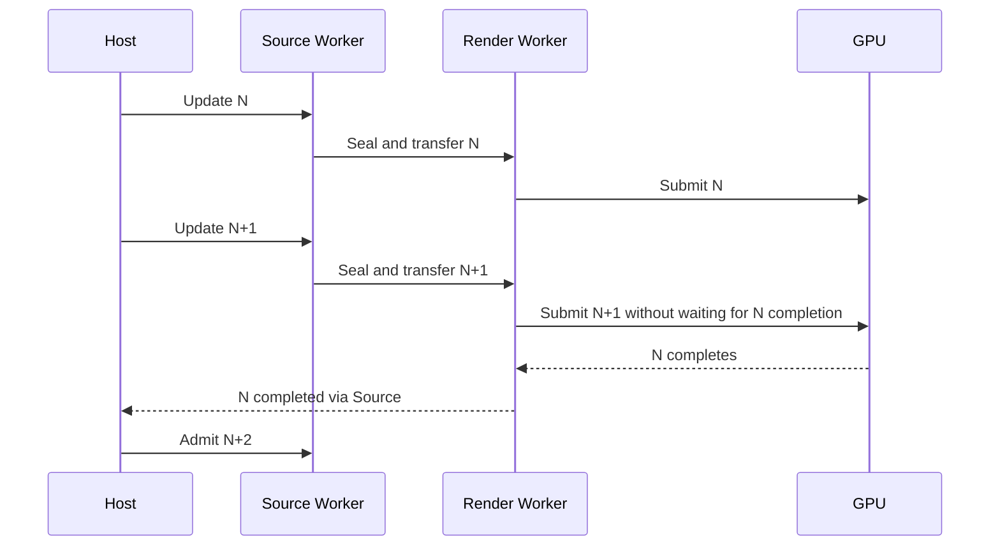

# @forgeax/engine-app

> **App is the browser host adapter: it measures one frame delta, passes it to the World, and draws.** Game scheduling, time resources, fixed-step policy, and gameplay behavior belong to the ECS World.

## One-screen takeoff

```ts
import { createApp } from '@forgeax/engine-app';
import { Time, Update } from '@forgeax/engine-ecs';
import { forgeaxBundlerAdapter } from 'virtual:forgeax/bundler';

const result = await createApp(canvas, {}, forgeaxBundlerAdapter());
if (!result.ok) {
  console.error(result.error.code, result.error.hint);
  throw result.error;
}

const app = result.value;
app.world.addSystem(Update, {
  name: 'move-player',
  queries: [],
  fn: (world) => {
    const delta = world.getResource(Time).delta;
    movePlayer(delta);
  },
}).unwrap();
app.start().unwrap();
```

The canvas form creates a World, renderer, default plugins, browser input backend, and rAF loop. Handle the `Result` before calling `start`.

## Engine workspace provider

The public workspace exports are the Engine-owned seam consumed by external
host clients:

```ts
import {
  createEngineWorkspaceProvider,
  createEngineWorkspaceRuntime,
  engineWorkspacePlugin,
} from '@forgeax/engine-app';

const provider = createEngineWorkspaceProvider({
  openProjectSession: ({ root, signal }) => projectHost.openHeadedSession({ root, signal }),
});
const workspace = createEngineWorkspaceRuntime(provider);
const workspacePlugin = engineWorkspacePlugin(workspace);
// Include workspacePlugin in the Engine Host's normal plugin assembly.
```

`openProjectSession` is an explicit integration boundary. This package owns the
common project/asset/SceneAsset/camera lifecycle after the factory returns an
`App`, `AssetRegistry`, `World`, and a headed `target`; it does not guess a
project loader or create a second runtime. Node project hosts use DevKit `createDevKitWorkspaceProvider` for the production
Vite/browser bridge. Other environments supply the session constructor.

For asset kinds other than `scene`, the session may expose `openPreview` to
dispatch the existing Engine type-preview capability. A session's optional
`presentation.attach`/`detach` owns the exact headed target surface, while
`applyInput` receives continuous input samples with the same `App` and `World`.
These are provider contracts, not consumer-side substitutes or mock readiness.

Preview `assetBinding` contains the consumer's captured publication and bounded
payload metadata. `captureEngineWorkspaceAssetBinding` synchronously checks that
the loaded payload is still the Registry's current object before copying its
publication; an intervening replacement fails instead of labeling old data with
the new version. The owner retains this snapshot when later publications arrive.
Mesh counts, bounds and slots describe that same payload. Current project
`asset.inspect` remains a separate read; it does not identify an old preview's
binding. These facts contain no World handles or vertex buffers.

`createEngineWorkspaceTools(runtime)` supplies the domain Tool contributions;
`snapshotEngineWorkspace(runtime)` projects current owners without surface handles.
Register these tools once with the existing ToolApi. No View plugin, tab, or
panel is required to call them.

Guarded `project.open` accepts `expectedTargetId`: null requires an empty
workspace; a string requires that exact current project target. The optional
`expectedTargetState: 'lost'` precondition requires a nonempty target identity
and the session owner's current `failure.code === 'engine-workspace-page-lost'`.
Missing lifecycle information fails closed; asset queries are never liveness probes.
Checks and replacement run in the workspace queue. Preconditions belong to the
runtime, not the provider's project-construction input. A replacement receives fresh
identities; this never revives an old page, replays writes or starts Play.

Workspace camera input is semantic, independent of DOM keys, buttons and wheels:

| Input | Execution |
|:--|:--|
| `{ type: 'move', velocity: [right, up, backward] }` | World units/second; camera-relative right/backward and world-up, integrated by World Update until replaced or the interaction ends |
| `{ type: 'look' or 'orbit', yaw, pitch, pitchLimit? }` | Angles in radians; only an explicit pitch limit requests upright constrained rotation |
| `{ type: 'pan', x, y, distance? }` | Camera-plane displacement as fractions of pivot distance |
| `{ type: 'dolly', amount, distance? }` | Relative view-axis displacement; orthographic lens scales by `exp(amount)` |

Input adapters own bindings, sensitivity, speed curves, default distance and
pitch-limit preferences. Engine owns the pose and target-local orbit pivot.
`distance` supplies the initial pivot distance when no focus/pan pivot exists.
Focus returns its resolved pivot; the workspace target retains it, not generic
App observation. Camera snapshots include a nullable pivot; abort restores pose,
lens, exposure and pivot together. Lens snapshots retain both projection ranges
so cancelling a projection switch also restores the inactive range.
Commit without a camera value commits the
current draft, including motion since the last input response.

The canvas owner keeps an internal immutable frame baseline; reset clears it.
Public subscriptions still deliver future events only. Display picking uses
its accepted matrices, World identity and physical output extent, not a live
ActiveCamera gate. Missing or mismatched frames fail with a specific reason.
`target.pick` returns query facts or a normal request failure. The browser
workspace plugin installs no selection click listener and publishes no pick
events. Presentation consumers own clicks, selection, cancellation and error
display; a query does not choose a UI target or alter its selection. These
tools remain callable with the presentation plugin absent.

| Operation family | Explicit identity / owner |
|:--|:--|
| `engine.project.open/close`, `engine.assets.list`, `engine.asset.open` | Project root or `projectId`; existing workspace runtime |
| `engine.assets.list` asset rows | Engine projects Catalog `sourceKey` when present, alongside GUID, kind, name and source path; consumers choose display labels |
| `engine.preview.close/capture/resize`, `engine.camera.get/begin/update/commit/abort` | `targetId` and `targetGeneration` from `preview.target.generation` |
| `engine.asset.inspect`, `engine.asset-source.rebuild/cold-cook` | Registered only when the provider supplies the corresponding capability |

Concrete App sessions inspect assets through their existing AssetRegistry. Browser
sessions forward the same operation into their App realm. Mesh inspection reads
the current payload and projects vertex/index counts, bounds, submeshes and material
slots as JSON data; it does not transport geometry buffers or reconstruct source code.
Inspection preserves project identity and cancellation; each existing preview
continues to own its independently acquired result.

The workspace runtime owns its preview collection and one optional Play. Opening
a distinct preview preserves other targets; closing the project drains them all.
Play remains the presented owner until its close acknowledgment succeeds; a failed
close retains that identity. Public stop uses the existing workspace mutation queue,
so concurrent stop, start and project replacement cannot remove its browser before
cleanup settles. A real disconnect settles pending close requests as lost transport,
with unconfirmed cleanup; it is never a completed native cleanup acknowledgment.
`preview.resize` uses positive integer output pixels, preserves World and generation,
and requires the target owner's resize capability, including for an isolated Play target. It rejects
unfinished camera interactions; consumers submit measured dimensions without
mutating target metadata. Capture waits for a completed `ready` frame submitted after
the size or camera change; a completed `pending` fallback does not qualify. An older in-flight completion cannot satisfy that
barrier. PNG pixels and returned dimensions must describe the same surface.
The browser preview plugin pauses continuous rendering while its canvas has no
visible intersection. Queries remain available and explicit capture steps the
same paused App with zero elapsed time. Revealing the surface resumes it; game
targets keep their own execution policy and do not use this preview behavior.
Preview replacement increments the Engine generation even when the surface's
`targetId` remains stable. Old requests fail before reaching the replacement.
Closing a project rejects an obsolete handle and cleans the current provider
handle, so an old caller cannot clear a replacement project.
Camera begin/update/commit/abort and disconnect rollback share one Engine
transaction owner. Trusted transport `connectionId` fences callers that reuse a
client name; commit idempotency is scoped to that connection, target, and
operation. Disconnect rolls back only the disconnected owner's unfinished draft.

`engineWorkspaceTargetToolsPlugin` is an optional native Cordis plugin. Install
it in the actual World realm, through the existing development assembly or
`app.pluginContext.plugin(...)`; creating an App does not activate it. It
provides `engineWorkspaceTargetTools.tree({ limit?, offset?, revision? })` and
`inspect({ entityId })`. These project actual entities (including unnamed and
disabled entities), hierarchy and component schemas/values. References include
the target, World identity, and the generational entity handle. Missing Name
components return `name: null`; display labels, row types, icons, and filter
counts belong to the consuming UI. Pagination carries the first
page's structural revision and rejects changes between pages; sample timestamps
do not imply a cross-frame snapshot. Values are bounded and read-only.

The tool Fiber borrows the World. Disposal withdraws the service and invalidates
retained tool references, without destroying game entities or stopping the App.
These are Engine capability methods; View panels and transport adapters must
consume the common domain operations rather than reading World directly.
`entity.highlight` projects the selected entity and its descendants through the
Render `Outline` component on the active camera, using a 4-pixel width when
the camera has no authored Outline style. It does not change materials
or draw a bounds box. The tools Fiber removes only the Outline members it added
when selection clears, the camera changes, or the plugin unloads; authored
Outline members and style remain owned by the game.

`engineWorkspaceBrowserPlugin` composes the target tools and command consumer
as native child Fibers. It borrows an existing App, returns its exact surface,
and uses the Host transport; it does not construct another Host. Concurrent
inline previews use isolated Cordis service scopes, one App/World per allocated
target, and the same tools. Their assembly callback supplies only platform/App
construction. Closing a preview disposes its Fiber and owned resources.
Controlled previews close the App's default gameplay input gate for the plugin
lifetime and reopen it on removal; their consumers submit semantic camera input.
This prevents automatic click-to-lock and duplicate observation movement.

An explicit game target uses `engineWorkspaceInputPlugin` to own the physical
input backend and the existing CanvasInputBoundary. The game App borrows the
game view; the tools hand control to App observation without stopping the World.
The observation adapter owns canvas focus, events and camera transactions, and
restores its changes when unloaded. App/World/Renderer contain no View mode.

## Recovery frame contract

Use `renderer.state() -> renderer.inspect() -> renderer.recover() ->
FrameReceipt` as the shortest recovery route. App is only the frame-admission
owner: it advances the World and calls `draw` when the Renderer is `alive`.
During `device-lost` or `recovering`, App preserves the rAF heartbeat and
refreshes its time baseline, but does not advance the World or submit. Renderer
owns the single recovery flight; concurrent callers share it. A `faulted`
Renderer must be disposed and recreated, and `disposed` is terminal.

Branch on the closed error `code`, then read `expected`, `hint`, and typed
`detail` to decide whether to wait, explicitly retry, repair the named owner,
or rebuild. After success, retry the same frame request and treat the returned
`FrameReceipt` as the only submitted proof for the new device generation. Target
and history fallback preserves logical identity but is uninitialized until a
successful receipt; structural output, Browser/Dawn readback, and PNG evidence
must not be substituted for one another. App does not expose devices, graph
nodes, history textures, or a second retry manager.

Browser consumers can subscribe to `subscribeBrowserFrameSubmitted(canvas,
listener)` to receive the accepted `frameId`, device/graph generations, output
extent, and deeply frozen barrel mapping. The event is the worker-safe
publication of the submitted frame context, so display picking and overlays use
the same picture. Remove the subscription when the canvas is retired; ignore
stale events after device loss or zero-size output, then follow the existing
`Renderer.state() -> inspect() -> recover()` route before accepting a new
context.

Use `renderer.inspect().barrelDistortion` to inspect the matching
`effectiveMapping`, `extent`, `frameId`, `deviceGeneration`, `graphGeneration`,
and `lastKnownGood`. A pending or failed distortion candidate keeps the prior
mapping with the displayed picture; a successful disable publishes an explicit
identity mapping. Never infer identity from an absent event field.

## RHI capture

When the development RHI-debug flag is enabled, `app.rhiCapture` exposes one
single-frame `captureFrame()` capability. A successful call returns one
self-contained `rhi-tape` artifact; pass that same artifact to DevKit's
`rhi.summary` and `rhi.inspect` operations, using the summary's
`FrameModel.works[].workIndex` for selection.

The artifact is lazy: `byteLength` and `chunks(n)` are free, while `digest` and
`bytes` are computed on first access. `captureFrame({ seed: { maxResourceBytes } })`
omits oversized initial contents. `app.rhiCapture.upload(artifact, { runId,
endpoint?, signal?, chunkBytes?, chunkAttempts? })` streams the tape to the
`vite-plugin-rhi-debug` chunk routes with bounded memory and per-chunk digests,
resumes by `runId`, and resolves to the server-verified path and digest.

App owns only the optional capture capability. Replay, readback, PNG output,
and artifact/file handling remain in the RHI-debug core and DevKit shells, so
the live App surface does not grow a second replay cache or inspection API.

## Worker execution

`execution.workers` selects Engine, Render, and Kernel Workers independently.
Every omitted policy is `auto`: supported Engine and Render Workers run alongside
a lazy shared Kernel pool. The World remains the only simulation authority;
Kernel Workers operate only on eligible numeric `QuerySpan` shards.

The bootstrap module constructs renderer features and native Cordis plugins
inside the selected realm. Those plugins receive the real owners through
`inject`; there is no parallel `run(context)` or cleanup ledger.

```ts
// game-bootstrap.ts
import type { ExecutionBootstrapEntry } from '@forgeax/engine-app';
import { audioPlugin } from '@forgeax/engine-audio';

const bootstrap: ExecutionBootstrapEntry = (data) => ({
  features: [createGameRenderFeature(data)],
  plugins: [
    audioPlugin(),
    createGamePhysicsPlugin(data),
    {
      name: 'game-session',
      inject: ['world', 'assets', 'executionBootstrapHost'],
      async apply(ctx) {
        const session = await createGameSession({
          world: ctx.world,
          assets: ctx.assets,
          port: ctx.executionBootstrapHost.port,
        });
        ctx.effect(() => () => session.dispose(), 'game/session');
      },
    },
  ],
});

export default bootstrap;
```

```ts
const result = await createApp(canvas, {
  execution: {
    bootstrap: new URL('./game-bootstrap.mjs', import.meta.url),
    bootstrapData: { gameId: 'example' },
    bootstrapPort: realmPort,
  },
}, forgeaxBundlerAdapter());
if (!result.ok) throw result.error;

const app = result.value;
app.start().unwrap();
const report = app.execution.report();
console.log(report.workers);

if (report.world.health === 'poisoned') {
  const rebuilt = await app.execution.rebuild();
  if (!rebuilt.ok) throw rebuilt.error;
}
```

| Setting | `auto` (default) | `true` | `false` |
|:--|:--|:--|:--|
| `workers.engine` | Move the bootstrap into a supported Engine Worker | Require Engine Worker capabilities | Run the bootstrap on the Host |
| `workers.render` | Give rendering its own supported Worker | Require independent rendering | Co-locate Renderer with World |
| `workers.kernels` | Enable shared numeric kernels where supported | Require isolation, SAB and Atomics | Run numeric kernels inline |

Render and Kernel Workers require an enabled Engine Worker. With `engine: false`,
auto children are disabled; explicitly requiring either child is an error.
Missing isolation disables only auto kernels, preserving independent rendering.
Each `report.workers` entry exposes `requested`, `enabled`, `reason`, and
`missingCapabilities`; schema version 2 replaces the old mutually exclusive tier.
A pool is enabled by policy but creates lanes only when eligible kernels exist.

```ts
// Default: Engine + Render + eligible Kernel Workers when supported.
execution: { bootstrap: new URL('./game-bootstrap.mjs', import.meta.url) }
// Keep render isolation, execute numeric kernels inline.
execution: { bootstrap, workers: { kernels: false } }
// Keep World and Renderer together, retain automatic numeric parallelism.
execution: { bootstrap, workers: { render: false } }
// Explicit Host execution, including automatic dependent policies.
execution: { bootstrap, workers: { engine: false } }
```

> [!IMPORTANT]
> A canvas or assemble call without `execution.bootstrap` constructs local
> World/Renderer/plugin objects. Those objects cannot be moved to another realm;
> this form reports Engine Workers disabled. Use a bootstrap module for auto
> placement, and move renderer setup into `configureRenderer`.

Measured responsiveness, baseline costs and recovery evidence are documented in
[Render Worker validation](render-worker-validation.md). The
[Laya source comparison](render-worker-comparison.md) distinguishes native command
consumption from the browser GPU receipt boundary.

An enabled Render Worker keeps World, asset loading, gameplay, input consumption, and audio
intent production in the source Worker. A child Worker owns the Renderer and
GPU. It isolates simulation/message responsiveness under rendering pressure;
it does not imply higher FPS.
GameHost exposes `app.world` and `app.assets` in source game realms. A separate
presentation Host exposes `ExecutionApp` controls and its own asset catalog.
`canvas` is optional and may be an OffscreenCanvas; `renderer` is
optional. A local Host may supply its full App; consumers must check for those
additional capabilities before using them.

The source bootstrap injects `world` and `assets`; a `renderer` service belongs
to the child realm. Native change evidence publishes a baseline and deltas to
one persistent RenderScene; the child never constructs a World.

| Report fact | Meaning |
|:--|:--|
| `frame.completed` | Source simulation completed; releases the next simulation credit |
| `render.submittedFrame` | Full Renderer submitted work for that source frame |
| `render.completedFrame` | The frame receipt completed on the GPU |
| `render.epoch` | Current Render Worker generation; stale messages cannot advance it |

Two publication slots bound both transferred storage and simulation lead. Logic N+1
can overlap rendering N, but the Host admits N+2 only after N's GPU receipt completes.
After submitting N, the Render Worker can prepare and submit N+1 while N remains
in flight. CPU draws stay serial; GPU completion no longer blocks the next draw.
The two slots cover the entire source-to-GPU pipeline, including queued and
preparing frames. They are not separate two-frame queues at each boundary.
Every admitted frame in a healthy epoch is published once, in order. The synchronous
postMessage clone seals all frame metadata, assets and Feature input; four numeric
buffers transfer ownership. Later asynchronous World writes affect the next frame.
Waiting happens before Host admission, so render backpressure does not consume the
simulation execution timeout or block DOM/input processing.


```mermaid
sequenceDiagram
    participant H as Host
    participant S as Source Worker
    participant R as Render Worker
    participant G as GPU
    H->>S: Update N
    S->>R: Seal and transfer N
    R->>G: Submit N
    H->>S: Update N+1
    S->>R: Seal and transfer N+1
    R->>G: Submit N+1 without waiting for N completion
    G-->>R: N completes
    R-->>H: N completed via Source
    H->>S: Admit N+2
```

Feature feedback and recycled buffers belong to their exact publication revision.
Completion notifications and buffer returns retire in publication order, even if
a later receipt or timing readback finishes first. A failed receipt stops new
work immediately; disposal still drains all accepted draws and GPU receipts.
VFX recognizes previously submitted ordered intents in an early successor snapshot;
it retains their drawable result without executing those ticks twice. Replacement
retires the lost epoch, freezes admission until the new renderer is ready, and
starts a baseline from the preserved World. Old epochs cannot release new capacity.
The submitted browser event carries graph generation and display mapping, including
the submitted camera matrices and output extent, from that same receipt.

`await app.dispose()` waits for the child renderer and source Cordis realm to clean
up before terminating their Workers. Pending inspections are rejected. Child cleanup
has a 5-second deadline and the outer realm has a 10-second deadline; forced
termination returns `app-execution-deadline-exceeded` with `detail.phase = 'dispose'`.
`stop()` remains terminal and begins the same shutdown; a subsequent `dispose()`
awaits its result. Device/transport loss can request one replacement; deterministic
producer failures retain their structured code, expected input, hint, stage and
publication identity in `execution.report().fault` without attempting replacement.

The [publication contract](../render/README.md#render-publication) covers geometry,
animation, materials, lighting, environments, targets and declarative features.
Bootstrap `features` constructs the same declared implementations in both
realms: `extract` reads the source World, while `plan` and graphics work execute
in the child. `onSourceFrameSubmitted(data, feedback)` receives only the matching
submitted frame's feedback. Feature plugins may lease these declared
implementations; functions created solely in the source realm cannot be sent.
CameraView travels in the same camera publication: split screens, held minimaps,
and camera targets use the same Renderer pipeline in either execution tier.
Each view keeps private writable state and history; source intents are
acknowledged once after the shared submission.

Use bootstrap `configureRenderer(renderer)` for pipeline/post-effect setup in
the Renderer realm. Source plugins use `executionBootstrapHost.renderTargets`
for logical target creation, resizing, texture sources and destruction. The
child owns physical targets and receipt-bound readback. The source has no
synchronous `renderer` service: APIs requiring both World mutation and immediate
GPU admission must be assembled in one realm. Ordinary runtime geometry edits
cross through the published asset/change evidence.

`diagnostics.rhiCapture: true` creates the recorder in the child. The source
inspection `rhiCapture.captureFrame()` capability returns the actual child tape
through the existing inspection channel; cancellation and Worker loss settle
pending captures. The child waits for the recorder snapshot boundary before
consuming its next publication, preserving a stable resource seed and one
complete frame in the tape. The frame loop must supply the captured frame.

The App `startupTimeoutMs` policy also bounds child Renderer initialization and
replacement, plus SharedKernel worker initialization and module preflight; a child
does not impose a separate shorter startup limit. Kernel startup and preflight
share one pool-start deadline, while running kernel dispatch keeps its separate
5-second deadline.
An explicit value also bounds the preliminary DedicatedWorker capability probe,
so a slow probe does not override that startup policy with its default deadline.

After startup, device/transport loss or a 30-second frame deadline makes App
terminate that GPU owner, replace the canvas, and publish a fresh baseline
with the same source World. A replacement must complete a frame before another
replacement is allowed. Initial or replacement initialization uses `startupTimeoutMs`; failure is terminal for that creation/recovery attempt. `app.canvas`
returns the current canvas; external DOM
listeners attached to the old element must be rebound by their owner. App
rebinds its own input backend. Simulation admission pauses during this replacement;
a source World failure still follows the existing stop/rebuild contract.

An unavailable `true` policy returns `app-execution-worker-unavailable`; only `auto` falls back. Serve shared kernels with `Cross-Origin-Opener-Policy: same-origin` and `Cross-Origin-Embedder-Policy: require-corp` or `credentialless`, then verify the Worker-realm facts in `app.execution.report()`. Every SharedKernel module is imported, export-checked, and retained in every lane before the Engine Worker reports ready; frame jobs invoke that retained module synchronously, so an invalid module fails before the first shared write without adding a dynamic-import Promise to each dispatch. A partial Kernel write poisons the World, stops update/draw, and requires explicit rebuild to obtain a new World identity.

`bootstrapData` must be structured-cloneable and is validated before a canvas is
transferred. `bootstrapPort` is the realm side of a host-created
`MessageChannel`; `executionBootstrapHostPlugin` borrows it. The App/Worker
session closes it on final disposal, so World rebuild preserves the channel. Keep DOM UI on the Host side of that typed channel.
`ExecutionBootstrapHost.setPointerLockAllowed` is the one built-in
realm-to-Host control because browser input ownership remains on the Host.

> [!IMPORTANT]
> Runtime asset delivery in an execution realm uses `execution.assetCatalog`,
> a serializable `{ url, expectedScope? }` descriptor. Engine constructs the
> `CatalogSource` and `AssetRegistry` inside the selected realm, so an Engine
> Worker never captures a Host-side registry. `expectedScope` keeps a scoped
> game catalog tied to its `scopeId` and `generation`; `CreateAppOptions.assetCatalog`
> remains realm-bound and is rejected when `execution` is requested.

When `execution` is present, realm-bound `CreateAppOptions` (`features`,
`plugins`, RHI injection, draw source, membership
timing, and bundler import transport) are rejected instead of working only in a
Host fallback. Construct them in the bootstrap module so `auto` has one
game assembly path in every selected placement.

The machine-readable report contract is [`schema/execution-report.schema.json`](./schema/execution-report.schema.json). Shared Kernel eligibility and storage rules are owned by [`@forgeax/engine-ecs`](../ecs). The production reference and benchmark commands are in [`hello/multithreaded-execution`](../../apps/hello/multithreaded-execution).

`report.frame` is the host-owned frame-credit projection. Ordinary local
loops admit at most two unresolved renderer receipts; a saturated loop skips
the tick without running World update or draw. The next admitted tick forwards
the full elapsed interval to the World, whose time policy owns clamping and
fixed-step catch-up. Pauses and device-loss recovery freeze simulation; split
rendering also freezes admission while its Render Worker is replaced.
`submitted`, `completed`, and
`inFlight` satisfy `inFlight = submitted - completed`; `highWater` records the
maximum in-flight depth and `throttledTicks` records intentional skips. A
receipt rejection is settled before its structured error is fanned out, so a
throwing listener cannot leak an unhandled Promise rejection. The Engine Worker
keeps its existing one-credit protocol and reports the same shape with
`inFlight` in `{0, 1}`.

## Renderer feature passthrough

`CreateAppOptions.membershipTiming` is a transparent Render option. App does
not timestamp frames or own timing reasons; it forwards the value to Runtime
and Render. Omit it for zero timing work, use `cpu-control` for the independent
CPU control path, or use `gpu` for bounded backend-aware evidence.

`CreateAppOptions.captureReflectionFallbackReadback` forwards the explicit
Render pixel-diagnostic option. Omit it during gameplay to avoid full-frame HDR
readback; source receipts still publish after GPU completion.

`CreateAppOptions.gpuPassTiming` follows the same transparent projection. App
does not admit a timing capability, create a session, allocate a `frameId`, or
own a receipt. The host uses the Render-owned sequence `gpuPassTiming` opt-in
-> `draw()` receipt -> `observe(receipt, { include: ['timings'] })`, then reads
the Render status, closed reason/error `code`, and recovery `hint`. When App
drives `draw`, a plugin obtains that same receipt from the Render-owned
`frame-submitted` event. Membership
timing remains producer-specific and is not generic accepted GPU evidence.

`CreateAppOptions.outputColorSpace` (`'srgb'` default | `'display-p3'`) is forwarded to
Render without App policy. Under Worker execution it reaches both the local Renderer and the
split render worker. App does not probe `matchMedia` and does not own a fallback. The negotiated
result is Render's `inspect().output.colorSpace` in the realm that owns the Renderer, and
`renderer.setOutputColorSpace(space)` switches it at the next draw. See
[Render §Display-P3 output colour space](../render/README.md#display-p3-output-colour-space).

`CreateAppOptions.features` is the transparent app seam for producer-owned
renderer features. The array is forwarded to the existing renderer options
without reordering, copying, or adding an App-level VFX branch. A feature host
therefore remains the owner of its feature and lifecycle:

```ts
import { createApp } from '@forgeax/engine-app';
import { createVfxRuntimeHost } from '@forgeax/engine-vfx-render';

declare const canvas: HTMLCanvasElement;
declare const camera: import('@forgeax/engine-vfx-render').ParticleRenderCameraSource;
declare const bundler: import('@forgeax/engine-app').BundlerOptions;

const vfxHost = createVfxRuntimeHost({ camera });
const result = await createApp(canvas, { features: [vfxHost.feature] }, bundler);
if (!result.ok) {
  console.error(result.error.code, result.error.hint);
  throw result.error;
}
result.value.start().unwrap();
```

The app does not attach a VFX World or registry. Call
`vfxHost.attachWorld({ world, assets })` before the first update and
`vfxHost.detachWorld({ world })` during teardown. Inspect structured Result
errors by `code`, `expected`, `hint`, and `detail`; do not treat a successful App
construction as proof that a particle asset is ready or visible.

## Point-shadow recipe

The optional `pointShadowPlugin()` is the App recipe for consuming the
renderer-owned point-shadow capability. It injects the existing `renderer`
provider and publishes `ctx.pointShadow`; it does not create a second renderer,
atlas, or frame loop. `ctx.pointShadow.inspect()` returns detached
`PointShadowInspection` facts from the last completed frame, and
`ctx.pointShadow.admit(requested)` returns a structured Result before a game
publishes a request. Capacity is derived from Render's
`SHADOW_ATLAS_DEFAULT_LAYERS` SSOT, and missing `storageBuffer` support, a
shader build without `pointShadows: true` (`detail.capability:
'pointShadowShader'`, inspection status `unavailable`), or an over-budget
request is an actionable error rather than a silent fallback.

```ts
import { createApp, pointShadowPlugin } from '@forgeax/engine-app';

const result = await createApp(canvas, { plugins: [pointShadowPlugin()] }, bundler);
if (!result.ok) throw result.error;
const admission = result.value.pluginContext.pointShadow?.admit(requestedShadows);
if (admission !== undefined && !admission.ok) throw admission.error;
```

## Frame-loop responsibility

Every frame follows one host-owned sequence:

```text
measured deltaSeconds -> world.update(deltaSeconds) -> renderer.draw([world], { cameraOwner: 0, resourceOwner: 0 })
```

The host measures the delta once and forwards that same value to its World. A `World` validates the delta, owns `Time` and `FixedTime`, runs its `Update` and `FixedUpdate` schedules, and applies its own time policy. App does not maintain an elapsed clock, clamp time, register frame callbacks, or offer a second scheduling surface.

`pause()` cancels frame scheduling without changing World time or submitting a
replacement frame. `resume()` resets the host timestamp before the next frame,
so the paused wall-clock interval is not added to `Time.elapsed`. A paused
`stepFrame(deltaSeconds)` deliberately runs the complete World update and draw
sequence with that delta; use it for deterministic tools and expiry journeys,
not as proof that ordinary pause keeps time frozen.

Frame pacing is part of that same authority: the loop checks receipt credit
before the sequence above, and only a successful renderer submission consumes a
credit. Use `app.execution.report().frame` for diagnostics; do not add a second
queue, rAF callback, or renderer completion ledger in a game or plugin.

`app.onError` receives structured failures from the World update and renderer draw paths.

```ts
const unlisten = app.onError((error) => {
  console.error(error.code, error.hint);
});

const started = app.start();
if (!started.ok) console.error(started.error.code, started.error.hint);

// Pause scheduling without destroying the realm:
unlisten();
app.stop();

// Final ownership release:
await app.dispose();
```

`App.lastError` retains the most recent dispatch failure after the listener
callback runs, so an AI host can inspect the same object without scraping
console output:

| Fact | Recovery surface |
|:--|:--|
| `app-system-update-failed` | `detail.cause` preserves the original failure and `detail.systemName` identifies the owner when known. |
| Renderer or device failure | `app.onError` and `lastError` expose the closed error code with `expected`, `hint`, and discriminated `detail`. |
| No failure observed | `lastError` is `undefined`; do not infer readiness from App construction alone. |

Hosts that discover additional Worlds during bootstrap can update the routing pull
without creating a second frame loop:

```ts
app.setDrawSource(() => ({
  worlds: [app.world, overlayWorld],
  cameraOwner: 0,
  resourceOwner: 0,
}));
// `app.setDrawSource(undefined)` restores the single-world path.
```

The injected Worlds are updated by the same frame loop before the renderer draw;
the setter changes only draw routing, while each World retains its own time policy.

## Opt-in CPU profiling

Performance tooling passes one `Profiler` capability through the canvas or assemble options. App
and Render write bounded records into that capability only while a capture is active; default App
construction has no profiler work and no capture artifact.

```ts
import { createProfiler } from '@forgeax/engine-profiler';

const profiler = createProfiler();
const result = await createApp({ renderer, world, profiler });
if (!result.ok) throw result.error;

const started = profiler.startCapture({ frameLimit: 120, eventLimit: 1024 });
if (!started.ok) throw started.error;
// Run the App for the requested frames, then finish the bounded session.
const capture = started.value.finish();
if (!capture.ok) throw capture.error;
```

Read `profiler.phaseCatalog` for the owner-declared App and Render relation. Use
`validateProfileCapture(capture.value)` before persisting or passing an artifact to the CLI. The
profiler is a CPU diagnostic capability; it does not replace ECS schedules, GPU timestamps, or a
browser UI.

## Time policy

Canvas-form callers configure the World time policy when they create the App.

```ts
const result = await createApp(canvas, {
  time: {
    fixedDeltaSeconds: 1 / 60,
    maxStepsPerUpdate: 4,
    maxDeltaSeconds: 0.1,
  },
});
```

Systems read time through ECS resources:

- `Time.delta`: validated variable-rate seconds for the current frame.
- `Time.elapsed`: accumulated validated variable-rate seconds.
- `FixedTime.delta`: fixed simulation interval.
- `FixedTime.tick`: completed fixed updates.
- `FixedTime.overstep`: seconds accrued toward the next fixed update.
- `FixedTime.droppedSeconds` and `FixedTime.droppedUpdates`: explicit metrics when the configured catch-up cap truncates work.

The assemble form preserves the injected World's policy. Create that World before assembly instead of passing a competing app option.

```ts
import { World } from '@forgeax/engine-ecs';
import { createApp } from '@forgeax/engine-app';

const world = new World({ time: { fixedDeltaSeconds: 1 / 120, maxStepsPerUpdate: 8 } });
const result = await createApp({ renderer, world, plugins: [myPlugin] });
if (!result.ok) throw result.error;
result.value.start().unwrap();
```

## Callback deletion migration

`registerUpdate` is deleted. Convert each former callback into a named ECS system and select its schedule explicitly.

```ts
import { Time, Update, defineSystem } from '@forgeax/engine-ecs';

const AnimateHud = defineSystem({
  name: 'animate-hud',
  queries: [],
  fn: (world) => updateHud(Math.sin(world.getResource(Time).elapsed)),
});

app.world.addSystem(Update, AnimateHud).unwrap();
```

Use `FixedUpdate` for deterministic simulation.

```ts
import { FixedUpdate } from '@forgeax/engine-ecs';

app.world.addSystem(FixedUpdate, {
  name: 'step-combat',
  queries: [],
  fn: () => stepCombat(),
}).unwrap();
```

Schedule ordering is ECS data. Use `before`, `after`, system sets, and token-first mutation APIs rather than a callback list.

## Input and plugins

The canvas form inserts the input backend and activates its scan system on `Update` before user systems. Gameplay systems consume the frozen `InputSnapshot`; they do not install raw browser event listeners.

```ts
import { INPUT_SNAPSHOT_RESOURCE_KEY, type InputSnapshot } from '@forgeax/engine-input';
import { Update, defineSystem } from '@forgeax/engine-ecs';

const ReadInput = defineSystem({
  name: 'read-input',
  queries: [],
  fn: (world) => {
    const input = world.getResource<InputSnapshot>(INPUT_SNAPSHOT_RESOURCE_KEY);
    if (input.keyboard.down('KeyW')) moveForward();
  },
});
app.world.addSystem(Update, ReadInput).unwrap();
```

Pass optional capabilities as native Cordis plugins. Providers are explicit:

```ts
import { audioPlugin } from '@forgeax/engine-audio';
import { webAudioPlugin } from '@forgeax/engine-audio-webaudio';
import { physicsPlugin } from '@forgeax/engine-physics';

const result = await createApp(canvas, {
  plugins: [webAudioPlugin(), audioPlugin(), physicsPlugin('rapier-3d')],
});
if (!result.ok) throw result.error;

const feature = await result.value.pluginContext.plugin(optionalGameplayFeature);
await feature.dispose();
await result.value.dispose();
```

Each App uses one `pluginContext`. The canvas form may borrow an existing
Context, including a native isolated service scope; it disposes only the Fibers
it installed. App uses native `ctx.get(name)` for optional capabilities in a
borrowed plugin scope, retaining Cordis's active-provider check. Ordinary plugins
declare `inject` and read `ctx.service`; App does not require its caller to inject
unused audio/physics or escape to the root. Cordis `inject`, `provide`, `effect`, and
`Fiber` are the only composition lifecycle. `stop()` controls frame scheduling;
`dispose()` drains plugin effects and releases Host/renderer ownership. An
assemble-form host still owns the World and renderer objects it supplied, while
the App owns the Cordis realm it assembled around them.

## API index

| Entry | Shape | Purpose |
|:--|:--|:--|
| `createApp(canvas, options?, bundler?)` | `Promise<Result<App, CanvasAppError>>` | Creates the canvas-form World, renderer, plugins, input, and frame loop. |
| `createApp({ renderer, world, plugins?, ... })` | `Promise<Result<App, AssembleAppError>>` | Assembles host-owned renderer and World without replacing their policy. |
| `CreateAppOptions.time` | `TimePolicy` | Policy used only for the newly created canvas-form World. |
| `CreateAppOptions.features` | `readonly RenderFeature<unknown>[]` | Existing renderer feature seam, forwarded by reference and order. |
| `CreateAppOptions.ssrIdentity` | `SsrAdmissionIdentity` | Optional exact source/tree/lock/build binding for the renderer-owned SSR M0 inspection; omission means SSR is not requested. |
| `CreateAppOptions.execution` | `ExecutionOptions` | Names the bootstrap module and composes independent Engine, Render and Kernel Worker policies (`auto`, `true`, or `false`). |
| `ExecutionOptions.assetCatalog` | `ExecutionAssetCatalog` | Supplies the serializable catalog URL and optional scope fence to the selected Engine realm. |
| `App.execution.report()` | `ExecutionReport` | Returns the schema-valid worker decisions, capabilities, health, frame-credit, performance, audio, and fault projection. |
| `App.execution.rebuild()` | `Promise<Result<ExecutionReport, AppError>>` | Rebuilds only a poisoned Worker World with a new identity. |
| `App.start()` | `Result<void, AppError>` | Arms the rAF loop. |
| `App.stop()` / `pause()` / `resume()` | `Result<void, AppError>` | Controls the rAF lifecycle. |
| `App.dispose()` | `Promise<Result<void, AppError>>` | Drains the Cordis realm, Host resources, and renderer ownership. |
| `App.pluginContext` | `Context` | Native Cordis realm for runtime and asset-resident game plugins. |
| `App.stepFrame(deltaSeconds)` | `Result<void, AppDispatchError>` | While paused, advances one deterministic update/draw frame through the same App frame authority used by rAF. |
| `App.releaseSurfacePreserveWorld()` / `restoreSurface()` | `Promise<Result<void, RhiError>>` | Temporarily pauses presentation and relinquishes the canvas surface while preserving the same World, Renderer, registry, and execution authority; restore resumes only a loop that was running before release. |
| `App.onError(callback)` | `() => void` | Subscribes to structured World and renderer failures. |
| `App.setDrawSource(drawSource)` | `void` | Replaces per-frame multi-world routing; `undefined` restores the single-world path. |
| `App.world` / `App.renderer` | readonly | Exposes the assembled ECS and renderer instances. |

## Boundaries

- `createApp` returns `Result`; inspect `.ok`, `.error.code`, and `.error.hint` rather than swallowing failures.
- `createRenderer` is the lower-level route. Its host is responsible for `world.update(deltaSeconds)` and renderer drawing.
- Demo motion failures are engine or schedule integration failures. Do not restore a demo-local callback or manual frame loop workaround.
- Deterministic preview and tooling seeks must pause the App and use `stepFrame`; they must not call `world.update` or `renderer.draw` as a parallel frame path.
- `Camera.clearColor` belongs to the Camera component, and bundler wiring belongs to `BundlerOptions`; neither is an App time responsibility.

See `packages/app/src/types.ts` for option and Result types, `packages/app/src/internal/frame-loop.ts` for the frame-loop implementation, `packages/plugin/README.md` for the Cordis lifecycle, and `packages/ecs/README.md` for World schedule and time semantics.

### SSR M0 identity binding

SSR dependency inspection is opt-in. Pass the exact four-field identity when the
host requests the fallback projection:

```ts
const result = await createApp(canvas, {
  ssrIdentity: { sourceHead, sourceTree, lockSha256, buildSha256 },
});
```

With `execution`, return `PreparedExecutionBootstrap.ssrIdentity` instead of
passing a top-level option. App validates the four string fields and transports
the same value to the local, Engine Worker or Render Worker constructor. App
does not derive or certify provenance; the bootstrap owner defines its scope.

Then read `result.value.renderer.inspect().ssrDependencies`. Without
`ssrIdentity`, the projection is explicitly `requested: false` with
`failure.code === 'ssr-not-requested'` and zero SSR work; it is not an unknown
device or an admitted result. For a requested but unbound renderer, the
projection keeps `identity: undefined` and returns a closed failure whose
`detail.action` tells the AI user to bind/rebuild the owning receipt. Every
other blocked result exposes the same owner-directed `detail.action` alongside
`code`, `expected`, and `hint`.

The identity opt-in enables the inspection seam; the current frame still has to
contain at least one validated Standard PBR renderable before the renderer asks
the producer for the fallback MRT. A frame with no such renderable therefore
reports `requested: false` and zero work even when `ssrIdentity` is present.
Treat that as a consumer-demand fact, not as proof that the device or producer
is unavailable. After the first draw completes, inspect again so the asynchronous
format probe and temporal submit receipt have had a chance to publish.

## Remote component discovery

Quick start in a Node or dawn-node host:

```ts
import { createApp } from '@forgeax/engine-app';

process.env.FORGEAX_ENGINE_REMOTE_SERVE = '1';
const result = await createApp({ world, renderer });
// Use the existing WS client to call the existing introspect method.
```

The app host derives JSON-safe descriptors from the global ECS component
registry after plugins build. It injects those descriptors into the existing
remote `introspect` response; app does not define, validate, or own a component.

| Boundary | Contract | Recovery |
|:--|:--|:--|
| App -> remote | `startServer({ introspection })` carries data only | If remote is absent, verify dev mode or the explicit headless env flag |
| Remote -> consumer | Existing `eval` and `introspect` methods remain the full surface | Use the returned `RemoteError` fields, never message parsing |
| ECS/render | Registry and `Visibility` remain package-owned | Use `_import('@forgeax/engine-render')` in eval, not app-local labels |

The descriptor is a transport projection, not a live token: it contains schema,
field reflection, labels, and JSON-safe metadata, but no methods or validator
functions. Camera, picking, lifecycle, assets, and VFX shadow policy remain
outside the app host.

## Live observation

`App.observation` operates on the actual World in its Engine realm. `find({ name?,
limit? })` returns bounded named entities and world positions; `focus({ name,
distance? })` requires an exact unique name, or an internal entity handle may be
provided. Focus is asynchronous so an Engine Worker can request bounds from its
Render Worker. DevKit projects handles into revision-bound public references.
Find and camera state remain source-World operations; bounds stay with the
renderer projection. Pending bounds reads fail when the render session ends,
and the observer camera is reasserted before either drawing or publishing.

`camera.set({ position?, target? })` acquires a transient observation camera from
the current game camera. It does not write the authored camera. `camera.get()`
reports `control: game | observer`; `release()` removes observation control and
restores a live game camera. Focus unions the selected entity subtree bounds from the Renderer and fits the observation camera projection. Plain transform targets retain point focus. A mesh whose renderer bounds are unavailable is rejected before camera acquisition; explicit position, target and distance remain overrides. All changes remain
runtime-only and disappear when the World is replaced.

## Project plugin roots

DevKit supplies one plugin asset root and program table per realm. The existing asset provider owns `pluginPrograms` and the optional `runtimePacks` capability. `activateExecutionRoot` only mounts the selected root through the native startup barrier, after game Host readiness. Engine main and Worker use the same contract; `PreparedExecutionBootstrap.pluginPrograms` and `.runtimePacks` are constructed inside the target realm, never cloned over MessagePort, while `.root` only selects its GUID. Host DOM/audio plugins use the Host root and existing POD bridges. Code/config changes replace the session; World state is not restored by a failed replacement.

### Runtime Pack assembly

`assembleRuntimePacks(context, assetAssembly, options)` returns
`{ producer, catalog, fetcher }`. The Catalog joins delivered and runtime outputs;
use this returned Catalog and fetcher for additional readers, including the
five-action reader. Pass the Host's existing `scopeId` explicitly when creating
that reader. `assetAssembly.catalogSource` continues to denote the delivered base.
The owning Registry reuses its privately prepared CPU payload; it does not read
back the encoded package. An independent preview App needs only the returned `catalog`: its existing
`openPackage` method binds publication bytes and artifacts. The preview owns its
Registry and World, follows subsequent publications, and has no producer.

When `assetSource` is omitted, the existing base Catalog supplies fixed dependency
captures owned by assets-runtime. Original bytes are retained once and requested
domain inputs decode lazily;
restoration uses its original GUIDs, output set and generation in the new scope.
Mesh and cooked Material dependencies can therefore survive loss of the original
transport. App verifies every stored artifact and uses the ordinary domain loaders.
A delivered plugin sibling still requires its owner's portable program closure;
a load-only program entry is insufficient for durable capture.
The assembly derives that closure from the existing `pluginPrograms` provider,
including tool declarations, executor artifacts and version evidence. It inherits
the provider's Host imports and program host unless options replace them. Restored
contracts enter the same native tool registration path; withdrawal retires only
unreferenced owned programs, while existing Fibers retain their captured executors.
For runtime-authored sources, App derives inline tool contracts through Import and
selects commands for the current target after full contract validation. Fixed
publications retain `executions` for all prepared targets; App derives the target
from its Context, keeps every definition readable, and registers only that group's
programs and tool memberships. Other groups survive a snapshot unchanged and do
not require their Host imports here. A mixed publication needs the complete
producer archive through `assetSource.exportSource` when the current provider
alone cannot cover every sibling; missing groups never become empty contracts.

App installs this capability in the existing asset provider using `pluginPrograms`
and optional `runtimePacks` options; execution bootstraps supply the same inputs
in their own realm. Game plugins can inject `runtimePacks`; an App owner can
read it through `app.pluginContext.get('runtimePacks')`. The caller of the
low-level assembly function is the `pluginPrograms` providing Fiber, so publication can
update that provider through native Cordis ownership. Allow one runtime assembly
per realm Registry. Create downstream readers after assembly, and dispose them
before the providing Fiber. Withdrawing runtime content keeps base content available
while that provider lives. Disposing the provider withdraws its producer and detaches
the Catalog without restarting source IO; dispose the asset assembly in that same
lifetime. Plugin activation still uses `mountPluginAsset` / `startPluginAsset`;
reading a definition does not evaluate its module or create another installer.

The existing live inspector exposes the same native Context through
`simulation.pluginContext` in Node, browser main and Engine Worker projections:

```js
const runtime = simulation.pluginContext.get('runtimePacks');
return runtime.producer.inspect();
```

Node eval resolves configured public module specifiers through the same Host
import bindings, with native Host import for other requests. This is the existing
full-access agent route; it does not grant frontend callers access to
`engine.run.eval`. Workspace UI operations use their authorized command channel,
which also works before the preview frame loop starts.

The project session exposes `runtimePack(input)` through existing Workspace
ToolApi contributions. Callers use `projectId`, `targetId` and `worldId` from
`engine.workspace.get`; the project target follows the session's actual World
after readiness. These operations target the project App. Independent preview
and Play targets are not implicitly selected.

Workspace capture requires a new completed `ready` frame from its own canvas
within ten seconds. A timeout retains the requested target's frame floor,
submitted/ready counts, presentation extent, Renderer environment inspection,
execution report and bounded errors. A healthy editor target does not qualify
an independent resource preview; diagnose the target named in the failure.

| Tool suffix under `engine.runtime-pack` | Input and behavior |
|:--|:--|
| `inspect`, `snapshot` | Inspect admitted definitions/import identities, or export durable source JSON. |
| `admit`, `generate`, `restore`, `withdraw` | Pass `content`, `instance`, `snapshot` or `packageId` to the existing producer. No frame or open preview is required. |
| `plugin-install`, `plugin-inspect`, `plugin-dispose` | Install by `guid`, inspect this connection's native Fibers, or dispose by native `uid`. |
| `prepare` | Optional Host producer accepts `source`; JS validation and TS conversion produce a program without executing or admitting it. |

Plugin ownership comes from the trusted ToolApi caller connection, not payload
fields. Each connection owns a native Workspace child scope; UID lookup is
restricted to its direct installations. Disconnect releases that scope. Closing
the project asks the old browser session to release all Workspace installation
scopes before the result channel is removed, including before the first preview.
Game Fibers and admitted Pack definitions remain owned by the borrowed App.
Closing a preview does not revoke project-level installations belonging to other
connections. A reported native cleanup failure remains a failed close.
Workspace disposal uses Plugin's bounded native cleanup observation, including
effect errors that Cordis logs without rejecting `dispose()`. The existing
target failure state blocks repeated release, installation and successful close
after incomplete cleanup; an empty native scope does not clear that failure.

| Closing evidence | Recovery |
|:--|:--|
| Native `completed` response | Close the Workspace session. |
| Known native `failed` or `timeout` | Preserve and propagate the failure through replacement and disposal; later disconnect does not erase it. |
| Lost transport without a known native cleanup failure | Retire the old session with `cleanup: 'unconfirmed'`. Existing exact lost-target reopen remains available; `project.open`/`project.close` tool results include `retiredTarget`. |

A close acknowledgment timeout retains observation of the original connection;
later loss permits the same unconfirmed retirement. Closing immediately stops
admitting replacement connections. A transport timeout is not a native cleanup
timeout.

The browser's existing transport-disconnect callback aborts its pending operations
and releases Workspace installation scopes locally. It preserves the App and game
Fibers. The backend cannot infer completed cleanup from that callback's existence.

Transport cancellation can end a ToolRun before native cleanup finishes. A
cancelled terminal is not cleanup evidence: inspect the connection's installations
after the pending operation drains. An install cancelled during result delivery
disposes only that newly created Fiber. Explicit successful disposal reports
`cleanup: 'completed'`; failures preserve the native cleanup diagnostic.

## Host streaming audio observations

`execution.report().audio.streaming`, when available, carries aggregate encoded/PCM/pending bytes, pending reads and underruns from the existing Host consumer. Main and Engine Worker frame paths share the same closed intents. Kernel Workers receive no audio objects. Rebuild replaces the consumer and fences old reads; [the audio owner](../audio-webaudio/README.md#long-audio-through-source-meta-and-guid) defines buffering/control/failure semantics.

`execution.createHostAudio` is the Host-only consumer factory for shared native bus effects. It is used in both selected main and Worker realms, called again on rebuild, and never serialized into Worker initialization. Return a fresh consumer per generation; read [the Host assembly example](../audio-webaudio/README.md#app-host-effect-assembly).

### Host gamepad feedback

The existing input provider owns browser haptics. Gameplay uses the optional
`GamepadFeedback` World resource and targets from the frozen input scan; see the
[Input feedback contract](../input/README.md#gamepad-feedback). A composite input
backend forwards the same feedback owner. App creates no media bus or second
plugin tree.

Engine Workers create a bounded producer for each World realm. Accepted
frame/simulation completion carries `feedbackIntents` to the Host input owner;
its next `InputBackendSample` carries terminal results and loss count back.
Frame credit, World identity and the input target's attachment/generation fence
old and duplicate output. Candidate failure disposes its producer. Rebuild
revokes the old Host input attachment, and input Fiber cleanup releases only its
owned effect. Render and Kernel Workers receive no actuator or native Promise.

`app.stop()` stops scheduling; effects already dispatched retain their finite
native duration. Use `feedback.stop(target)` before stopping to request cancel,
or `app.dispose()` to release the owner. Native reset failure is a structured
result, not a physical stop guarantee.
