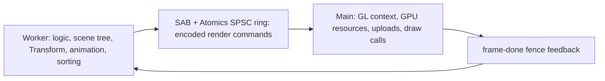

# Laya rendering thread comparison

> [!NOTE]
> LayaBox's [2026-05-28 developer-conference announcement](https://official.layabox.com/getFileData.php?url=laya_data/news/2026/0528.md)
> explicitly describes the forthcoming **LayaAir 3.5 dual-thread architecture**.
> The Worker produces game/render-command data; the main thread executes graphics.
> Reviewing only the public 3.4 implementation missed this announcement. The
> architectural description is confirmed; its shipping status and fence semantics
> require implementation evidence.

## Announced LayaAir 3.5 architecture

The announcement identifies resource IDs rather than cross-thread GPU objects,
a three-buffer N/N+1/N+2 pipeline, and reuse of the previous Draw List when
needed. This is directly relevant to ForgeaX even though rendering stays on
Laya's main thread and ForgeaX can move rendering into a separate Worker.

| Question | Evidence and limit |
|:--|:--|
| Does Laya describe a real logic/render split? | Yes: the official 3.5 announcement specifies both sides and their command transport. |
| Is this just native C++ threading? | No: this announcement explicitly names Worker, SharedArrayBuffer and Atomics for mini games. The older native implementation below is a separate reference. |
| Does `fence(frame done)` establish GPU completion? | The article does not define whether it means command consumption, submission, presentation or GPU completion. No such guarantee follows from its wording alone. |
| Is three-buffering proof of higher completed-frame throughput? | No workload, queue-depth or GPU-completion measurements accompany that claim here. |
| What should ForgeaX reuse? | Explicit resource ownership, bounded reusable transport and source/render overlap. Keep ForgeaX's existing GPU-completion backpressure and measure transport before replacing it. |

Keeping graphics execution on the main thread can preserve platforms whose
available canvas/graphics context is main-thread-bound, while moving scene and
command preparation off that thread. This is an engineering explanation of the
tradeoff, not a rationale confirmed by Laya's announcement. ForgeaX instead uses
OffscreenCanvas when supported to isolate graphics submission from DOM/UI as
well; neither placement removes GPU work or guarantees a throughput increase.

## Source scope

| Source | Pinned identity | Evidence |
|:--|:--|:--|
| LayaAir | [`fa6d4f1b`](https://github.com/layabox/LayaAir/tree/fa6d4f1b1a23f56bd9b7347ae514ea20967a7ac9), branch `LayaAir_3.4` | Repository tree and rendering implementation; Worker-named files implement asset loading. Public code searches found OffscreenCanvas only in the WebXR polyfill, not a render-thread handoff. |
| Official 3.5 preview | [2026-05-28 conference report](https://official.layabox.com/getFileData.php?url=laya_data/news/2026/0528.md), news ID 64 | Logic Worker, main-thread graphics, SAB/Atomics SPSC command ring, resource IDs, triple buffering, frame-done feedback. |
| Release notes | [v3.4.1](https://github.com/layabox/LayaAir/releases/tag/v3.4.1), published 2026-08-31 | The listed additions do not announce browser Render Worker support. |
| LayaNative2.0 | [`89637246`](https://github.com/layabox/LayaNative2.0/tree/89637246a799d3c8ac0d550e449f9e81ed2f8d6a) | `THREAD_MODE_DOUBLE`, native render semaphore, command buffer swap and consumption. |

The inspected `JCConchRender.cpp` path's last public change is
[`bc4ca748`](https://github.com/layabox/LayaNative2.0/commit/bc4ca748de425b888ec298f637a290b9a94570fd), dated
2020-11-11. It is evidence of an existing mechanism, not evidence of a new 2026
browser feature. This older native path does not implement or refute the announced 3.5 Worker architecture.

## Native handoff and completion boundary

| Operation | Source | Meaning |
|:--|:--|:--|
| Produce a frame | [`JCScriptRuntime::onUpdateDraw`](https://github.com/layabox/LayaNative2.0/blob/89637246a799d3c8ac0d550e449f9e81ed2f8d6a/Conch/source/conch/JCScriptRuntime.cpp#L862) | Script work produces a command buffer and forwards modified array-buffer information. |
| Publish | [`JCConchRender::setRenderData`](https://github.com/layabox/LayaNative2.0/blob/89637246a799d3c8ac0d550e449f9e81ed2f8d6a/Conch/source/conch/JCConchRender.cpp#L258) | Wait for the previous slot to become empty, synchronize changed/deleted data, swap command buffers and mark the slot occupied. |
| Consume and release | [`JCConchRender::renderFrame`](https://github.com/layabox/LayaNative2.0/blob/89637246a799d3c8ac0d550e449f9e81ed2f8d6a/Conch/source/conch/JCConchRender.cpp#L443) | Schedule script update, wait for data, dispatch commands, clear the buffer, update images, then release the slot with `setDataNum(0)`. |

This allows script production and rendering to overlap while bounding pending
handoff. The inspected slot is released after **CPU command consumption**;
it is not an explicit GPU-completion fence. Platform presentation or driver
backpressure may add other limits, which these files alone do not establish.

## Implications for ForgeaX

| Concern | Decision |
|:--|:--|
| Ownership | Keep World/asset producers on the source and Renderer/GPU resources in their owner realm. Laya's command handoff supports the value of an explicit boundary, not a second mutable World. |
| Transport | Reuse bounded buffers. Native pointer swaps and semaphores do not measure browser `postMessage` or Atomics latency; no cross-platform latency or FPS claim follows from this comparison. |
| Backpressure | Retain ForgeaX's two sealed publications and GPU receipt completion before admitting N+2. Copying the native CPU-consumption release point would change the accepted frame contract. |
| Configuration | Rendering placement and eligible numeric parallelism are independent choices. Compose Render and Kernel Workers; a tier enum needlessly forbids their combination. |
| Performance evidence | Compare completed frames and source responsiveness separately under the same workload. A faster publication rate alone is not higher GPU throughput. |

See the [App publication and pacing contract](README.md#worker-execution) and
[existing validation](render-worker-validation.md) for ForgeaX's own mechanisms
and measured evidence. This review changes no runtime fence or transport policy.
