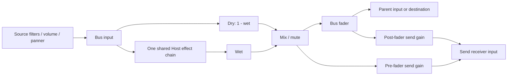
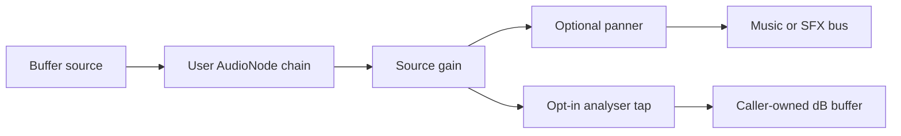

# @forgeax/engine-audio-webaudio

> **Host-owned Web Audio implementation for @forgeax/engine-audio.** Owns `AudioContext`, decode cache, bus topology, and source nodes. ECS tick and listener intent production remain in the realm-neutral audio package.

## Evidence and recovery

Audio import produces the source declaration, cook receipt, and Pack v2 clip artifacts; the catalog carries `packageUrl` and optional `cookReceiptUrl`. `AssetEvidence` joins those records before the browser decoder is used, keeping Web Audio transport separate from offline cook diagnostics.

`notCooked`, `ready/current`, `ready/stale`, and `unknown` are explicit cook states. Package and artifact checks are independently `notChecked`, `passed`, or `failed`. If `lookup/verify --guid --project --catalog --json` reports a failure, repair the source or recook and preserve the structured `.hint`; do not replace the clip with an unrelated runtime asset.

## Setup (charter P1 progressive disclosure)

### Canvas form (auto-attach)

```ts
import { createApp } from '@forgeax/engine-app';
import { audioPlugin } from '@forgeax/engine-audio';
import { webAudioPlugin } from '@forgeax/engine-audio-webaudio';

const app = await createApp(canvas, { plugins: [webAudioPlugin(), audioPlugin()] });
```

### Assemble form (host-managed)

```ts
import { AUDIO_ENGINE_RESOURCE_KEY, audioPlugin } from '@forgeax/engine-audio';
import { createWebAudioBackend } from '@forgeax/engine-audio-webaudio';

// Host pre-injects the backend resource, then passes audioPlugin() to wire the tick system.
world.insertResource(AUDIO_ENGINE_RESOURCE_KEY, createWebAudioBackend());

const app = await createApp({
  renderer,
  world,
  plugins: [audioPlugin()],
});
```

## Asset loading

The renderer injects this package's Web Audio decoder into `AssetRegistry`, so disk-backed clips use the ordinary GUID path. Configure the pack index, load the payload, then mint the World-owned shared ref consumed by `AudioSource.clip`:

```ts
import { AssetGuid } from '@forgeax/engine-pack/guid';
import type { AudioClipAsset } from '@forgeax/engine-types';

assets.configurePackIndex('/pack-index.json');
const guid = AssetGuid.parse(clipGuid);
if (!guid.ok) return;
const loaded = await assets.loadByGuid<AudioClipAsset>(guid.value);
if (!loaded.ok) return;
const clip = world.allocSharedRef('AudioClipAsset', loaded.value);
```

Do not fetch a pack-index row or call `loadAudioClipByGuid` at app level. That function remains the decoder implementation used by the injected loader; its decode failure is surfaced by `loadByGuid` as `AssetError('asset-parse-failed')` with the original recovery hint.

## Host consumer

`createHostAudioConsumer()` consumes the closed `AudioIntent` union from `@forgeax/engine-audio`. It decodes identical bytes once per `sourceKey`, replaces the decode authority when bytes change under that stable key, fences stale play completions by pending-play identity and source-key entry identity, and reports structured decode failure through its `AudioState`. A failed current decode keeps its bytes available for an explicit retry or a later content replacement; an older pending completion cannot delete or supersede a newer entry. `dispose()` clears the cache and closes the underlying engine exactly once.

`createWebAudioBackend()` is the main-thread adapter over the same consumer. Worker tiers use the intent backend in the Engine Worker and deliver the batch to a Host consumer after each accepted frame credit. No `AudioContext`, `AudioBuffer`, or Web Audio node crosses a realm boundary.

## Architecture

### AudioContext lifecycle (plan-strategy D-3)

- **Lazy creation**: AudioContext is NOT created until first `play()` call.
- **Gesture resume**: If AudioContext is suspended (autoplay gate), one bounded set of one-shot `document.addEventListener('click'/'keydown'/'touchstart', resumeOnce, { once: true })` listeners is registered. A rejected `resume()` keeps the same context suspended, records `context-suspended`, and re-arms that set for the next gesture; listeners are removed only after the existing context reports `'running'`. No polling, automatic resume, or context reconstruction is used.
- **Irreversible close**: `destroy()` calls `ctx.close()`; to restart audio after destroy, create a new backend via `createWebAudioBackend()`.

### Configurable buses and shared effects



Use `configureBuses(definitions)` for one accepted graph, `setBus(entityId, id)` to reroute, and `setBusEffects(id, context => nodes, wet = 1)` for one exclusive native chain shared by every source on that bus. The two configuration methods return `Result<void, AudioError>` on the Host engine. Realm-neutral adapters send requests and expose failures through state. Factories must return new nodes from the supplied Context; foreign/borrowed nodes, duplicate nodes and chains longer than 32 are refused. Effects are recreated on successful graph replacement and the old graph is disconnected. Effect factories own cleanup for work they create before throwing.

| Invariant | Behavior |
|:--|:--|
| Identity and bounds | At most 64 buses, 128-character IDs, 32 sends per bus; one root; no missing reference, duplicate ID or parent/send cycle |
| Tap and mute | Both taps follow wet/dry mixing and mute. Pre-fader ignores the sending bus volume; post-fader follows it. Muting silences shared effect tails and all sends |
| Wet amount | `0` is dry; `1` is fully processed. An empty effect chain is dry |
| Atomic replacement | Validate/build disconnected candidate, reconnect retained outputs, then connect root and retire old graph. Invalid candidates keep the accepted graph |
| Retained controls | Existing IDs keep explicit volume/mute overrides and the effect factory; untouched gains follow new declared defaults; a bus used by a retained source cannot be removed |
| Live gain | Source/bus gain and mute use the existing 10 ms native ramp; graph replacement itself is immediate and does not promise click-free effect-state transfer |

### 3D spatialization

- **PannerNode**: created when `AudioSource.spatialBlend > 0`.
- **panningModel**: defaults to `'equalpower'` (CPU-friendly; `'HRTF'` is a future extension per OOS-7).
- **Emitter sync**: source world position and normalized local -Z direction are applied before native playback, then updated on changed POD poses. Pending decode and retained paused panners consume the latest pose. Directional cone angles/gain come from the play options; native inverse-distance attenuation uses reference distance 1 and rolloff 1.
- **Listener sync**: the realm-neutral audio plugin reads the first `AudioListener` entity after transform propagation and sends nine pose scalars to the Host backend.

### Entity despawn cleanup (plan-strategy S-7)

When an entity is despawned, `audioTickSystem` detects its removal on the next frame and calls `backend.stop()` + cleans up internal per-entity state. No fade-out (OOS-8). The backend's `stop()` method disconnects all associated Web Audio nodes and removes the entry from its internal map.

## Health check

```ts
const backend = world.getResource('AudioEngine');
const { contextState, activeSourceCount } = backend.getState();
// contextState: 'running' | 'suspended' | 'closed'
// activeSourceCount: number of currently active AudioBufferSourceNode instances
```

## Known limitations

- **Gain transitions**: source and bus volume changes use a 10 ms linear AudioParam ramp. Initial gains use the latest control state before playback.
- **No fade-out on despawn**: entities stop immediately on despawn (OOS-8).
- **Streaming format**: PCM16 RIFF/WAV only; MP3/Ogg/AAC streaming requires a separate producer/decoder capability.
- Speed changes also change pitch; independent time stretching is outside this contract.

## Browser support

Requires Web Audio API (`AudioContext`, `AudioBuffer`, `AudioBufferSourceNode`, `GainNode`, `PannerNode`).

| Browser | Minimum version |
|:--|:--|
| Chrome | 71+ |
| Firefox | 112+ (AudioParam-based listener.positionX/Y/Z) |
| Safari | 14.1+ (Web Audio API baseline) |
| Edge | 79+ (Chromium-based) |

## Error codes

| code | trigger | recovery |
|:--|:--|:--|
| `context-creation-failed` | `new AudioContext()` threw or returned null | check browser supports AudioContext; verify no privacy extension blocks audio |
| `decode-failed` | `decodeAudioData(arrayBuffer)` rejected | ensure audio file is a valid wav/mp3/ogg/flac at the GUID path |
| `context-suspended` | `AudioContext.resume()` was refused while the existing context remained suspended | retry after the next user gesture (click/tap/keydown); the backend keeps the same context and re-arms its bounded listeners |
| `invalid-clip-handle` | AudioSource.clip handle is dangling | verify clip was registered via AssetRegistry.register() before spawning |
| `bus-not-found` | AudioSource.bus outside `'sfx' \| 'music'` | use 'sfx' or 'music' bus literal; custom bus names not supported in v1 |

## Related packages

- [`@forgeax/engine-audio`](../audio) -- interface, ECS components, error types, `AudioClipAsset` POD
- [`@forgeax/engine-app`](../app) -- `createApp({ plugins: [audioPlugin()] })` injection
- [`@forgeax/engine-ecs`](../ecs) -- World, Entity, System, Resource
- [`@forgeax/engine-types`](../types) -- `AudioErrorCode`, `AudioError` type definitions SSOT

## Control ordering and retained state

Bus controls are retained by `WebAudioEngine` before lazy context creation.
The Host keeps only pending play options, so a volume change during decoding
applies to the eventual node. Stop, replacement and disposal invalidate the
pending play by identity; completed plays leave no Host entity history.

Backend context failures take precedence in `state().lastError`. Host decode
errors remain associated with their source key; only successful decoding of
that source clears its error. An unrelated successful clip cannot clear it.

| Host option | Default | Unit and scope |
|:--|--:|:--|
| `maxCachedBytes` | 67108864 | Shared buffered bytes/float samples, stream indexes, native PCM windows and pending window reservations |
| `maxCachedSources` | 256 | Source publications retained for byte-free reuse |
| `maxPendingPlays` | 1024 | Entities awaiting decode |

Pass these options as the second argument of `createHostAudioConsumer(engine,
options)`. Admission beyond a budget reports `decode-failed` with the exhausted
budget in `detail.reason`. Published source keys stay available until disposal;
there is no silent eviction that would invalidate byte-free play intents.
Native decoder working memory and platform node memory are outside this cache
budget. Dispose stops nodes, releases cache entries and fences late decoding.

## Source controls and spectrum

`playing: false` stops and forgets the clip position. `paused: true` with
`playing: true` retains the decoded buffer, gains, panner, filter chain and
analyser, and removes only the one-shot source node. Resume creates a new source
at the retained offset. Each rate change first integrates the elapsed interval
with the old rate; looping positions wrap at the decoded duration. Pending
native decoding retains the latest pause, rate and volume. Stop, replacement
and disposal fence late completions. Paused sources are absent from
`activeSourceCount` and still accept gain/rate/filter changes.

Pausing mutes retained filter tails at the existing 10 ms source-gain boundary.
Volume edits while paused update the retained target; resume restores that target.
Native effect nodes keep processing their own history while the clip is paused.



The Host can supply a `WebAudioEngine` to `webAudioPlugin(engine)` or
`createWebAudioBackend(engine)`. This keeps native graph configuration in the
same Host owner as decode and playback. Engine and Kernel Workers never
receive native nodes or FFT arrays. The speed and pause intents remain POD.

```ts
const engine = new WebAudioEngine();
// Pass engine to webAudioPlugin(engine), then start an ECS source.
// Wait until engine.getPlaybackPosition(entityId) is defined after decode.
engine.setFilters(entityId, context => {
  const filter = context.createBiquadFilter();
  filter.type = 'lowpass';
  filter.frequency.value = 1000;
  filter.Q.value = 20 * Math.log10(Math.SQRT1_2); // low/highpass Q is in dB
  const gain = context.createGain();
  gain.gain.value = 0.5;
  return [filter, gain];
}).unwrap();
const analyser = engine.createAnalyser(entityId, 4096).unwrap();
analyser.smoothingTimeConstant = 0;
const bins = new Float32Array(analyser.frequencyBinCount);
engine.readFrequencyData(entityId, bins).unwrap();
// Bin i is i * analyser.context.sampleRate / analyser.fftSize Hz.
```

| Host method | Contract |
|:--|:--|
| `getPlaybackPosition(entityId)` | Decoded clip seconds; `undefined` after stop/end; frozen during pause |
| `seek(entityId, position)` | Seek in decoded clip seconds while preserving rate, pause, gain, panner, filters and analyser; active playback replaces only the one-shot source node |
| `setFilters(entityId, build)` | Ordered native input/output nodes from the supplied context; at most 32 distinct nodes; rejects reuse across source chains; `[]` restores dry routing |
| `createAnalyser(entityId, fftSize)` | Reuses one post-filter/post-volume, pre-panner/pre-bus analyser; power-of-two FFT 32..32768 |
| `readFrequencyData(entityId, output)` | Writes dB into exactly `frequencyBinCount` floats; paused sources write `-Infinity` rather than stale native FFT data |
| `removeAnalyser(entityId)` | Disconnects the opt-in tap; repeated removal is harmless |

The filter callback transfers exclusive outgoing connection ownership to the
engine. Biquad, IIR, gain, convolution and AudioWorklet nodes can use this seam;
prepare asynchronous worklet modules before returning their nodes. Do not share
these nodes with other audio graphs or reconnect their outputs. Failed validation
keeps the previous chain; connection failure restores it, or stops the source if
restoration fails. Graph/FFT admission failures return `AudioError` with
`code: 'control-failed'` and `detail.reason`. Stop/end/despawn disconnects the
chain and analyser. Spectrum polling creates no native node or output array;
its `Result` value is a small per-call allocation. Configuration and resume
allocate nodes explicitly.

`new WebAudioEngine({ context })` accepts a caller-owned `BaseAudioContext`,
including OfflineAudioContext for deterministic native DSP verification.
The caller resumes/closes borrowed live contexts and controls offline rendering;
destroy disconnects this engine's graph without closing the borrowed context.
Default contexts remain lazy, gesture-resumed and engine-owned.

Source references, measurements and reproduction commands:
[control validation](./bench/README.md).

## Clip start and seek (G17)

`AudioPlayOptions.fromPosition` defaults to zero. `AudioSource.fromPosition`
sets the start position and emits one seek when edited while playing; the
Host does not write playback progress into ECS. For repeated seeks to the same
position, call the realm-neutral backend explicitly:

```ts
const backend = world.getResource<AudioBackend>(AUDIO_ENGINE_RESOURCE_KEY);
backend.seek(entityId, 12.5);
```

| Case | Result |
|:--|:--|
| Pending decode | Host retains the latest seek in pending options; stop, replacement and disposal fence it |
| Paused | Only retained offset changes; resume starts there with the latest rate and volume |
| Loop | Position wraps modulo decoded duration |
| Non-loop, position at or beyond duration | Ends and releases the source, including paused sources |
| Negative or non-finite position | Ignored without replacing the current source |
| Stopped or naturally ended source | Seek does not restart it; play again with a start position |

Seeking preserves native effect history. A discontinuity in clip samples may
produce a click; this API adds no crossfade and does not reset filter tails.
Worker controls remain ordered POD. See [native samples and performance](./bench/seek-results.md).

## Spatial validation

`WebAudioEngine.setSourcePose(entityId, pose)` updates an existing spatial
panner and ignores ended, stopped or 2D sources. Invalid finite-position or
nonzero-forward requirements leave the native panner unchanged and report
`control-failed` through `getState().lastError`; invalid initial poses or cone
ranges are rejected before node creation. Native pose writes allocate no nodes
and schedule no automation events. [G18 signal, performance and Worker evidence](./bench/spatial-results.md).

## Long audio through source Meta and GUID

Set `importSettings.playback: 'stream'` in the ordinary audio Meta. Omitted or `'buffer'` retains complete native decoding for short assets. The importer accepts RIFF PCM16 WAV, mono/stereo, 8..96 kHz, one data chunk, exact frame alignment, and at most 16384 one-second windows. Unsupported compression or malformed layout fails import explicitly. Cook emits `wav-pcm16/1`, per-window SHA-256, sample/frame/channel facts, and one ordinary source artifact tagged `delivery: 'stream'` / `forgeax-pcm16-stream` version `1`. Source and Meta remain author authority.

Dev and build finalizers preserve the descriptor and source bytes. GUID loading admits the validated locator/index without fetching or caching the complete artifact; the audio owner verifies each window before native publication. Development asset transport supports exact Range responses. Production hosting must serve uncompressed HTTP(S) `206` with exact `Content-Range`; CORS must expose that header across origins. A host returning `200` is refused before consuming its body. Single-file/data-URL delivery cannot provide this capability.

| Held data | Bound and accounting |
|:--|:--|
| Native playback | At most three one-second `AudioBuffer` windows per source |
| Read/verification | One read per play, at most eight across the Host; reservation covers three encoded window copies plus native float PCM |
| Index | Bounded hash array; source publication and per-play metadata conservatively count UTF-16 JSON bytes |
| Shared admission | Existing 64 MiB/256-source cache budget includes stream reservations and PCM; 1024 pending buffered plays remains unchanged |
| Cancellation | Seek/rate/pause abort the old read and retire its nodes; rapid controls wait for that task to settle instead of accumulating reads |
| Worker transfer | First play publishes only the bounded manifest; repeated identical plays reuse sourceKey; changed manifests invalidate old plays |

`getStreamState(entityId)` exposes `buffering/playing/paused/ended/failed`, position, `pendingSeek`, byte/read counts, underruns and structured error. Seek rounds to the nearest source frame; while running it completes when a verified node is scheduled, and `playing` waits for its native start. Paused seek changes the retained position without I/O. Rate changes speed and pitch. Loop windows share the native scheduling clock; sufficient buffer permits a gap-free boundary, but network/Host stalls can cause a counted underrun. The playhead freezes during starvation, then resumes with a new verified window. No terminal network/integrity/Range/budget failure retries automatically; repair then seek or replay explicitly. Initial index-admission failure requires a fresh play after repairing the budget: seek/pause/rate cannot revive an uncharged player.

The ten-second window timeout, corrupt/oversized body, unsupported Range and byte admission failures use the closed `stream-failed` detail reasons in Types. `AudioState.streaming` and App reports project aggregate counters; these account for Engine-held buffers and are **not a native process memory cap**. Browser/network/decoder/device memory is measured separately in [the acceptance report](bench/stream/results.md). Short and streamed sources share gain, panner, bus/send, filters, analyser and disposal. Stop/despawn/publication replacement/dispose/Worker rebuild fence late work by source and play generation.

## App Host effect assembly

For execution bootstrap apps, `execution.createHostAudio` returns a fresh `HostAudioConsumer` in the Host realm. Main, Engine Worker and shared tiers use it; rebuild calls it again and disposes the old consumer. Configure one `WebAudioEngine` and its shared bus effects inside that factory, then return `createHostAudioConsumer(engine)`. The bootstrap still installs `audioPlugin()` and publishes ordinary POD graph/source controls. Factory/native objects never enter bootstrap data or Worker messages. A thrown factory reports App plugin activation failure and releases the started owners.

```ts
execution: {
  bootstrap: new URL('./game-bootstrap.ts', import.meta.url),
  createHostAudio() {
    const engine = new WebAudioEngine();
    engine.configureBuses([{ id: 'master', parent: null }, { id: 'room', parent: 'master' }]).unwrap();
    engine.setBusEffects('room', context => [context.createBiquadFilter()], 0.5).unwrap();
    return createHostAudioConsumer(engine);
  },
}
```

Use this single provider for execution audio; the main bootstrap must not also install another `webAudioPlugin` provider. For a local app without an execution bootstrap, retain `webAudioPlugin(engine)` in its native Cordis plugins.
