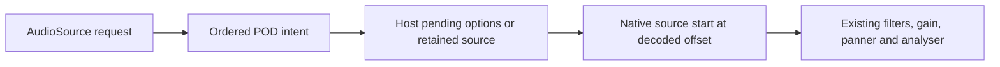

# G17 clip start and seek validation

## Contract and source comparison

`AudioSource.fromPosition` supplies initial decoded clip seconds and emits a seek
on an edit while playing. `AudioBackend.seek(entityId, seconds)` supports repeated
identical requests. The Host retains pending/paused positions, wraps loops,
ends non-looping sources at duration, rejects invalid positions without changing
playback, and preserves the existing native graph and rate. Seek does not restart
a stopped source. See [the public contract](../README.md#clip-start-and-seek-g17).



| Pinned reference | Inspected owner | Applied result |
|:--|:--|:--|
| Three.js r184 `d3b629c0c2097cec664ad16369bb6eae3b10e335` | [Audio.js](https://github.com/mrdoob/three.js/blob/d3b629c0c2097cec664ad16369bb6eae3b10e335/src/audio/Audio.js), `play` | Pass decoded offset to `AudioBufferSourceNode.start` |
| Godot 4.7.2 `ed1daf0bf001b61586d9930840f2f1394092c079` | [AudioStreamPlayerInternal::seek](https://github.com/godotengine/godot/blob/ed1daf0bf001b61586d9930840f2f1394092c079/scene/audio/audio_stream_player_internal.cpp#L268) | Seeking replaces playback; ForgeaX keeps its retained source graph |
| UE 5.8.1 `71fe36aac5a8df5ccd66c763ffc902b29b6a9c43` | [UAudioComponent::Play](https://github.com/Forgeax/UnrealEngine/blob/71fe36aac5a8df5ccd66c763ffc902b29b6a9c43/Engine/Source/Runtime/Engine/Private/Components/AudioComponent.cpp#L499) | Carry start time to the audio owner |

Reference checkouts were inspected locally at these revisions; no upstream code
is copied. This change owns no Renderer or RHI work. Native Web Audio samples
are its effect oracle.

## Native result

| Check | Measured result |
|:--|:--|
| Start / active seek / paused seek / resume, 48 kHz ramp | Maximum sample error $2.979\times10^{-8}$, limit $10^{-5}$ |
| Audible 880 Hz → 1320 Hz → silence → 440 Hz markers | Maximum sample error $7.401\times10^{-9}$ against the requested clip positions |
| Active seek with 2x rate and user gain | Correct output samples; retained analyser identity and one active source |
| Paused seek | Silent until resume; position frozen at the requested seconds |
| Boundary and lifecycle | Loop modulo, one-shot end, invalid input rejection, absent-source no-op and disposal pass |
| Real Worker | ECS start/seek/pause/stop intents reach native Host playback in order |
| Pending decode | Latest seek wins; shared clip decoded once; stop fences the pending play |
| Allocation | Exactly one native source per active seek; no source nodes for paused seeks or unchanged ticks; no gain rebuild or re-decode; despawn leaves zero active and retained sources |

Node **22.22.3**, Chrome Beta **149.0.7827.3**, Apple M4 Pro / macOS arm64.
Audio package unit/type tests: **119 passed**. Native browser tests: **30 passed**.
Changed-source Biome, test layout, code-file bounds, engine skills and English-only
guidance checks passed. The original ECS regression rejected `fromPosition` as an
unknown schema field before implementation; its red log is preserved.

The signal oracle excludes only the existing pause/resume gain transition windows
(12 ms around the 10 ms ramps). Active seek has no excluded transition window.
Frequency assertions measure complete crossing periods to avoid partial-window
count bias; the original biased-window failure is also retained. Seeking does
not crossfade or reset native effect history, so discontinuous input can click.

## CPU cost and limits

Each workload measures ECS edits, tick, synchronous intent transport and Host
control together: 20 warmup batches, 120 measured batches, all sources updated
per batch. Source setup/decode and event-loop yields are outside timing. Batches
yield with `setTimeout(0)`; this is a repeated-seek stress workload, not a claimed
60 Hz device playback test. Declared p95 CPU budget: $1000/60=16.667$ ms.

| Sources | Unchanged tick p95 ms | Paused seek p95 ms | Active seek p50 / p95 / p99 ms | Native restart p95 ms |
|--:|--:|--:|:--|--:|
| 1 | 0.235 | 0.235 | 0.145 / 0.375 / 0.550 | 0.090 |
| 32 | 0.270 | 0.455 | 0.605 / 1.550 / 2.100 | 1.585 |
| 128 | 0.585 | 0.960 | 2.245 / 13.995 / 21.825 | 2.930 |
| 256 | 1.555 | 1.660 | 4.585 / 15.725 / 38.125 | 14.625 |

> [!WARNING]
> The final measured round passed the p95 budget, but three earlier rounds failed.
> 256-source active seek p95 was 33.345, 32.560 and 50.385 ms. A native-only
> restart diagnostic also failed at 28.870 ms in the third round. These failures
> remain evidence; there is no repeatable 256-source 60 Hz guarantee.

The host was shared with other work. Final-round load averages rose from
71.64/56.34/46.08 to 77.08/61.05/48.51 on 12 logical CPUs. The native restart
diagnostic uses the same one-shot replacement and bus/source gains without ECS
or intent work. It runs sequentially, not as a controlled paired comparison;
do not subtract it as observer overhead or attribute all spikes to the platform.
These timings exclude native audio-thread CPU, output latency, and deadline misses.
No performance ranking against the reference engines is claimed.

## Reproduction and evidence

```bash
node --version # v22.22.3
pnpm build:engine
CI=1 pnpm exec vitest run --config config/vitest.browser.config.ts \
  packages/audio-webaudio/src/__tests__/seek.browser.test.ts
node packages/audio-webaudio/bench/run.mjs --seek
```

The benchmark writes WAVs, a native-waveform screenshot, raw CPU samples,
platform/load facts and implementation source hashes under `artifacts/g17-audio-seek/`.
The seek runner returns nonzero when its performance budget fails. Local retained
evidence is archived under
`.forgeax-harness/knowledge-base/sources/.files/g17-audio-seek-2026-10-03/`.

Full repository build, browser, Dawn and complete hello/learn-render 60-frame
smoke gates are still being executed; the audio results above do not substitute
for those gates or for final-head PR CI.
