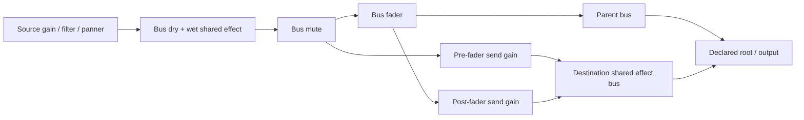

# Configurable audio buses and bounded long audio

> [!IMPORTANT]
> Native measurements below are for PCM16 RIFF WAV on macOS / Chrome Beta 149.
> Compressed streaming, human listening acceptance, long-duration memory plateau,
> and a guarantee for the historical 256-source / 60 Hz seek workload are not established.

## Behavior and ownership

Authors configure one bounded bus graph through `AudioBackend.configureBuses`.
The Host builds one shared native effect chain per bus, retains explicit gain/mute
overrides and source routing, and atomically accepts a valid replacement. Duplicate
IDs, missing destinations, parent/send cycles and removal of a playing source's bus
leave the accepted graph intact. Source filters, spatial panners and analysis remain
available for buffered and streamed sources.



Mute silences dry, wet tails and both send taps. Pre-fader ignores the sending
bus's fader; post-fader includes it. Native nodes belong to the Host factory;
POD graph declarations and controls cross Worker boundaries. `execution.createHostAudio`
supplies a fresh Host consumer on rebuild without transporting native factories.

| Boundary | Current contract |
|:--|:--|
| Author authority | Source WAV + Meta `importSettings.playback: 'stream'`; default `buffer` keeps short audio decoding |
| Import/Cook | Validate mono/stereo PCM16, 8–96 kHz; produce a versioned one-second SHA-256 window index on the existing audio GUID |
| Package/Catalog | Artifact `delivery: 'stream'` participates in package identity; GUID loading reads metadata and admits a verified locator without fetching the file |
| Dev/build | Ordinary Vite Pack transport and production artifact support exact HTTP Range; source closure remains complete |
| Runtime | Three native PCM windows/source, one pending read/source, at most eight reads globally; exact 206/Content-Range, bounded body, timeout and per-window digest |
| Shared budget | Original 64 MiB admission budget includes retained short audio, stream metadata, encoded read copies, pending reservations and PCM; no budget increase |
| Worker publication | POD metadata, bounded source publication and source identity; no whole long-file bytes, native media or Web Audio nodes |
| Failure | Unsupported format, refused/oversized Range, digest, network and budget failures are terminal structured states; explicit repair then seek/replay, no hidden full decode or retry |
| Cancellation | Entity/play/source/Host generations fence reads; stop, replacement, despawn, rebuild and dispose release or invalidate old work |

Build-time indexing and publication still read/copy the whole source. This is a
runtime playback memory improvement, not a build-memory or compressed bandwidth claim.
The index is bounded to 16,384 one-second windows, and headers to 1 MiB.

## Native measurements

Production source: `7c47472201a7c10e59375e1909d2a806931b3c40`. Start/end SHA-256
checks rejected source changes during measurement; Vite watching was disabled.
Benchmark/report follow-up commits do not change the measured production code.


Apple M4 Pro (12 logical CPUs), 64 GiB RAM; Chrome Beta 149; 48 kHz stereo PCM16,
440 Hz + 8 kHz fixtures. Two-second short, ten-minute (115,200,044 bytes), and
sixty-minute (691,200,044 bytes) sources use ordinary Meta/Cook/Catalog/GUID.
Three rounds/group, 100 continuous-play process/counter samples/round, 100 ms
requested cadence, eight random seeks and three hot replays/round. Raw timestamps
include `ps` and scheduling overhead; actual sampling is slower than 100 ms.
Each cold page has a fresh registry, consumer and native decoder; HTTP producer/DDC
and operating-system file caches are not flushed. "Cold" is cold player/decoder,
not cold machine storage.

| Fixture / path / sources | Cold first output p50 ms | Hot p50 / p95 ms | Seek p50 / p95 ms | Sampled stream-budget peak MiB |
|:--|--:|--:|--:|--:|
| Short / main / 1 | 64.49 | 20.69 / 21.24 | — | 0.00 |
| 10 min / main / 1 | 25.35 | 20.27 / 21.30 | 22.12 / 30.07 | 1.73 |
| 60 min / main / 1 | 27.15 | 20.10 / 42.54 | 16.04 / 32.97 | 1.56 |
| 60 min / ECS Worker / 1 | 70.09 | 22.55 / 38.84 | 42.69 / 53.61 | 2.11 |
| 60 min / main / 8 | 77.32 | 26.03 / 78.33 | 29.49 / 65.98 | 15.77 |
| 60 min / ECS Worker / 32 | 112.49 | 64.77 / 181.71 | 68.24 / 187.01 | 54.29 |

First output means a native captured block with RMS > 0.001; all-voice activation
is recorded separately. Cold p50 has only three observations; hot p95 has nine,
seek p95 has 24/group. Worker seek includes the benchmark's 40 ms command wait.
Seek completion is accepted native scheduling, not audible speaker arrival.
The source position is rounded to a PCM frame; measured position deltas include
native playback advancement while the polling assertion waits. Pause drift was
zero in every measured round. Control loops and continuous-play samples reported
zero underruns; this does not establish a universal gap-free real-time guarantee.

### Native memory and CPU

| Observation | Measured result / interpretation |
|:--|:--|
| 10 min stream, one source | Whole Chrome tree RSS peaks 1,146.06–1,185.91 MiB across three rounds |
| 60 min stream, one source | Whole Chrome tree RSS peaks 1,171.23–1,195.86 MiB; duration does not multiply retained PCM |
| 60 min stream, 32 sources | Whole tree RSS peaks 1,537.11–1,576.31 MiB; controlled Engine stream data ≤54.29 MiB |
| Full-decode negative baseline, 10 min | Encoded 115,200,044 + native float PCM 230,400,000 bytes; fetch/decode 1,083.15 ms |
| Full-decode negative baseline, 60 min | Encoded 691,200,044 + native float PCM 1,382,400,000 bytes; fetch/decode 5,207.19 ms; sampled whole-tree peak approximately 6.9 GiB |
| CPU | Common-process cumulative CPU deltas: 0.027–0.043 core equivalents for 60 min / main / 1; 0.131–0.189 for ECS Worker / 32 |
| Stop | All 18 rounds: active sources, stream encoded/PCM/pending bytes, reads and underrun counters zero after stop; retained source publication persists until consumer disposal |

Native memory is the sum of macOS `ps` RSS for Chrome descendants, including browser,
renderer, audio and GPU utility processes. Shared pages may be counted repeatedly;
this is not physical footprint or JS heap. CPU deltas cover retained common PIDs,
not an isolated DSP thread. Native allocator pools need not return RSS on stop.
The short continuous windows show modest RSS growth and cannot prove a long-run
plateau. Machine load was high from other authorized validation tasks; raw load
averages and every process sample are retained. The full-decode falsifier deliberately
bypasses production admission; production budgets were not raised.

### Data outside the stream counters

The 64 MiB Host admission checks retained source data plus stream reservations.
`AudioState.streaming` reports the latter; it does not include the Host source
cache or independently bounded Worker publication. Index accounting uses twice
the JSON character count, a conservative transport measure rather than native
object heap size. Each active player reserves an index charge even when references
share the immutable manifest. Catalog metadata is bounded by 16,384 windows but
is outside the playback cache. JavaScript object/allocator overhead is observed
through process RSS, not claimed as exactly counted bytes.

| Engine-held data | Bound / measured accounting |
|:--|:--|
| Source index in Host cache | One/source key; 80,904 bytes for 10 min, 482,906 for 60 min (0.46 MiB); survives stop, released on consumer disposal |
| Active player index | Same accounting/player, included in `pendingBytes` even with no read in flight |
| Worker producer publication | One/source key, independently admitted under 64 MiB / 256 sources; 0.46 MiB for this 60 min fixture |
| PCM windows | At most three/source; 48 kHz stereo float32 = 384,000 bytes/window |
| Range request and copies | One/source, eight globally; read/copy/PCM reservations included before allocation |
| Short two-second source | 384,044 encoded + 768,000 PCM bytes; included in retained Host admission, absent from stream counters |
| Package/Catalog/Registry | Bounded manifest and locator; metadata remains until its owning asset/publication lifecycle releases it; no full long-file bytes at runtime |

Thus the 32-source stream-accounting peak 54.29 MiB needs an additional 0.46 MiB
Host source charge; the producer publication is a separate realm budget. This is
not a 54.29 MiB bound on every Engine object or the Chrome process tree.

### Shared bus output and falsifiers

Eight native voices share one room low-pass chain (1 kHz). Voice fader 0.25, send
gain 0.5. Native OfflineAudioContext WAV, measured after startup transient:

| Configuration | Shared chain builds | RMS | 440 Hz amplitude | 8 kHz amplitude |
|:--|--:|--:|--:|--:|
| Pre-fader + effect | 1 | 0.146132 | 0.197489 | 0.060885 |
| Post-fader + effect | 1 | 0.080294 | 0.095070 | 0.062096 |
| Send disabled | 1 | 0.062500 | 0.062500 | 0.062500 |
| Effect disabled | 0 | 0.187500 | 0.187500 | 0.187500 |
| Effect installed, wet=0 | 1 | 0.187500 | 0.187500 | 0.187500 |

Pre/post and removal controls identify the expected mechanism. Wet=0 exactly
matches no effect; send removal recovers the dry source amplitude. Native browser
regressions also falsify mute bypass, invalid graph replacement, borrowed effect
nodes, declared gain updates, Range corruption and budget exhaustion.
WAV and spectral/RMS inspection is automated; a human listening judgment is not
claimed by this agent's tools.

### Bus/send growth

Three rounds/group, 30 atomic native graph replacements/round (90 measurements),
normalized eight/32-voice output remains RMS 0.146132. A first play builds the
shared chains once; subsequent voices create no extra chain. Replacement builds
fresh chains and retires old nodes; it is not a click-free crossfade guarantee.

| Voices / buses / sends | Shared chains | Update p50 / p95 ms | Sampled Chrome RSS peak MiB |
|:--|--:|--:|--:|
| 1 / 3 / 1 | 1 | 0.20 / 0.40 | 806.84 |
| 8 / 13 / 32 | 4 | 1.10 / 4.56 | 842.31 |
| 32 / 49 / 512 | 16 | 7.40 / 16.03 | 943.94 |

The current 49-bus / 512-send replacement p95 is 16.03 ms; the earlier frozen
run recorded 26.78 ms, exceeding a 16.7 ms frame. Both runs are retained.
The index-admission fix is unrelated to graph construction; timing differences
are not claimed as its performance improvement or a per-frame rebuild guarantee.

## Actual App execution

The separate App fixture passed all three execution tiers with at least 60
completed native frames and captured nonzero output. Engine Worker and shared
cases poison the actual World through an Update failure, then rebuild into a
new World identity and a second Host consumer. The retired consumer is closed
with zero active sources; fresh playback produces native output and disposal
closes the replacement. Shared execution reports real SharedArrayBuffer kernel
work (eight dispatched and completed kernels), not a renamed serial fixture.
Healthy main-serial rebuild is unsupported by the existing App contract and is
recorded as such. These are long-source results; the additional mixed short/long
fixture has a separate receipt and must pass before combination acceptance.

Headless CI failures were reproduced before real HTTP response headers arrived.
The tests now observe that real fetch promise, then retain the original polling
and test deadlines for failure publication or native playback. Range refusal,
corruption and oversized bodies have separate cases and assert one request and
zero native full decodes; spies delegate to browser APIs. All 40 real Web Audio
regressions pass. Connection-close alone was insufficient and its failed reruns
are retained alongside server/client traces.

A later final-head CI failure occurred in the positive resume case; the same
8-file / 34-test group reproduced locally. A controlled 1.5-second real HTTP
response reproduced the premature poll deterministically: Context running,
source buffering, one read, no PCM or error, response headers not yet received
at 1,123.8 ms. This proves the test-phase defect; the CI log itself did not
capture response timing, so that CI delay attribution remains an inference.
Positive resume/seek now observe their real request and response before the
unchanged native-state poll. The index-admission test pauses after fresh playback
before requiring quiescent reads and retained index charge. All 40 native tests,
package typecheck and full lint pass; no player/read/test timeout was extended.

The 2215 CI attempt finished in 46 minutes 52 seconds, exceeding the 30-minute
repository target. It had 59 successful jobs and the audio browser failure plus
its failed aggregate. Terminal job timestamps retain the smoke/metrics tail;
this measured duration is not replaced by an estimate or a reduced roster.

A separate native red regression proved that controls could revive a player whose
index was never admitted, omitting its reserved metadata. Initial index-admission
failure now requires a fresh play after repairing the budget; seek/pause/rate keep
the failure and create no reads. Fresh admission restores index accounting. This
uses the existing charge as authority, with no parallel admission flag. Performance,
growth, autoplay and source-hash receipts were rerun on the corrected production
revision; earlier complete measurements remain available and are not mixed into
these percentiles.

## Research and rejected complexity

| Source pin | Relevant mechanism / decision |
|:--|:--|
| [Three.js d3b629c](https://github.com/mrdoob/three.js/blob/d3b629c0c2097cec664ad16369bb6eae3b10e335/src/audio/Audio.js) | Reuse native connection ownership; media-element source disables Three.js playback control, so attaching a node alone cannot satisfy ForgeaX controls |
| [Godot 4c311cb](https://github.com/godotengine/godot/blob/4c311cbee68c0b66ff8ebb8b0defdd9979dd2a41/modules/minimp3/audio_stream_mp3.cpp) | Incremental frame consumption is useful, but retained encoded bytes are a distinct memory boundary |
| UE 71fe36aac5a8df5ccd66c763ffc902b29b6a9c43 | Parent/send routing and chunk-cache limits inform ownership; no private UE code copied, no full submix/streaming-manager architecture introduced |
| [Web Audio specification](https://www.w3.org/TR/webaudio/) | Native clock and scheduled PCM buffers preserve rate/seek/filter/panner behavior without relying on WebCodecs availability |

The first format is deliberately PCM16 WAV: portable, directly indexed, cheap to
decode, sample-frame addressing and verifiable bounded Range delivery. MediaElement
buffer ownership and seek precision were less controllable; compressed demux,
WebCodecs and an AudioWorklet would add unsupported platform or decoder contracts.
PCM16 has substantial storage/network cost. Compressed long BGM remains a capability
gap; browser-supported compressed clips still use the existing buffered decoder.

## Reproduction and evidence

```sh
pnpm build:engine
node packages/audio-webaudio/bench/stream/run.mjs
node packages/audio-webaudio/bench/stream/growth.mjs
node packages/audio-webaudio/bench/stream/autoplay.mjs
node packages/audio-webaudio/bench/stream/build-delivery.mjs
# Hold /tmp/forgeax-physical-gpu.lock using fcntl before actual App/GPU execution:
node packages/audio-webaudio/bench/stream/run.mjs --apps-only
node packages/audio-webaudio/bench/stream/run.mjs --mix-apps-only
python3 packages/audio-webaudio/bench/stream/analyze.py
NODE_ENV=test pnpm test:unit
# Under the physical GPU lease:
NODE_ENV=test pnpm test:browser
pnpm test:dawn
pnpm ci:focus --kind smoke --select all --frames 60
```

Analysis requires NumPy and Matplotlib. Raw fixtures are generated deterministically;
they are not committed. Native capture uses a bounded 1,024-block ScriptProcessor
probe on the master bus, a measurement instrument rather than the product player.
The performance `ecs-worker` is an actual ECS Worker fixture; actual App Engine
Worker/shared validation is reported separately, never inferred from this label.

Earlier red attempts are preserved: lost package artifact delivery caused full
GUID artifact reads and Worker budget rejection; the owning finalizer now retains
and hashes delivery. A native bus test exposed stale declared defaults; explicit
overrides now retain independently of replacement defaults. App fixture failures
identified missing shader publication, port contention and missing scoped dev
transport. One full unit run hit the unchanged DDC 100 ms heartbeat test under
load; its focused eight-test reproduction passed, and the full suite is rerun.

### Reviewable evidence

The [evidence bundle](https://github.com/ForgeaX-Games/forgeax-engine-assets/tree/main/evidence/2026-10-04-roi-13-14-audio)
contains immutable producer/hash receipts, raw JSON/CSV/WAV, native App tier/rebuild
and autoplay results, dev/build delivery, SDK and complete gate receipts. Its
README records terminal acceptance and earlier failed/incomplete attempts.
Final PR-head CI and merge receipts belong to the Engine PR, not inferred from
local tests or the benchmark source revision.


Earlier protocol/environment failures are retained: CDP `page.evaluate` supplies
user activation and invalidates an autoplay rejection test; the final test starts
outside CDP evaluation and uses a trusted click. Inherited `NODE_ENV=production`
disables Vite development asset import and invalidates the broad browser run;
ordinary test environment is required. An SDK build triggered Vite HMR during
one performance run; that partial dataset is excluded, with its raw data/log kept.
A lazy-effect growth assertion mistakenly expected construction before first
play; the corrected check verifies first-play construction and sharing across
subsequent voices. Duplicate native effect nodes were an actual product bug,
reproduced red and fixed with the same native regression.

Existing G17 historical latency failures remain in [seek-results.md](../seek-results.md).

### Native mixed-capture regression

On 052e, main serial mixed output passed 60 completed frames and both tone checks.
Engine Worker rebuild reached two active sources and native RMS .01498159, but
only 1,024 captured frames (21.3 ms). The spectrum helper reads samples
9,600–38,400 (0.2–0.8 s), so the premature check necessarily measured zeros.
The same real App path reproduced with frame/RMS/context/audio diagnostics and
a failed native WAV. The fixture now waits for the full native sample window
inside the original 15-second deadline before applying the unchanged .002 tone
threshold. Failed App captures are preserved automatically. All three mixed
tiers then passed, including faulted-World rebuild, closed old native contexts,
shared kernels and zero-source disposal. Production audio source hashes are
unchanged. This patched-fixture receipt predates the next final validation head.

The local 052e installed SDK gate failed at native Runtime Pack service-worker
registration (the existing 10-second limit, module vase.js). The independent
game remained hardware-backed with a healthy World and 4,367 completed frames,
but its runtime Pack error correctly failed acceptance. No audio cause is
demonstrated. The raw failure is retained; final-head same-path acceptance is
still required. Remote 052e/709b SDK success is a separate receipt.
