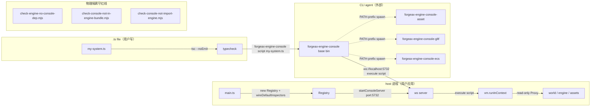
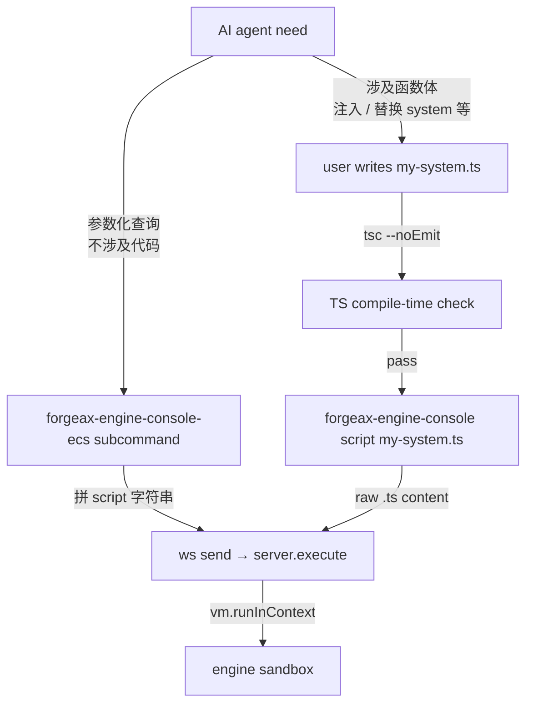

# @forgeax/engine-console

> **Inspector P0** — runtime control plane for external AI agents (Claude / Cursor / agentic CLI). Server + CLI dual exits; in-process WebSocket on port 5732 + standalone `forgeax-engine-console` binary; **server has a single execution channel** (`execute(script)`); CLI subcommands are lightweight shell wrappers that compose script strings; closed-union 6-member `InspectorErrorCode` is the SSOT for every recoverable failure.

> [!IMPORTANT]
> **统一抽象**：server 唯一执行通道是 `execute(script)`。CLI 子命令是把"参数化、不涉及代码"的常用查询翻译成 script 字符串发给 server 的轻量 shell；涉及代码（注入 / 替换 system 等）的操作由用户写 `.ts` 文件 → `tsc --noEmit` 验证 → `forgeax-engine-console script <file>` 发送原 script。引擎不做 typed builder 帮拼装；TS 编译器是天然把守。错误处理一律 `switch (err.code)` 走 6 成员闭集，禁止 `default` 分支兜底（charter 命题 4 + AGENTS.md "Errors are structured"）。

## 包定位

`@forgeax/engine-console` 是 inspector 控制面**基座**——同一份代码同时承担"host 进程内 in-process Registry + WebSocket server"和"外部 agentic CLI base bin"两种角色，两边共享 `InspectorError` typed surface。renderer-side 能力（ecs / runtime / pack / gltf）通过两条独立通道注入：in-process `register*Inspector` 函数（host 显式装配）+ 进程外 plugin bin（kubectl 4th-path PATH 发现）。

| 角色 | 入口 | 形态 |
|:--|:--|:--|
| Server（host 进程内嵌） | `import { startConsoleServer } from '@forgeax/engine-console/server'` → `startConsoleServer({ port, registry })` | host 在 main.ts 装配 `new Registry()` + `wireDefaultInspectors(...)` 后调用；启 WS（默认 5732）+ `vm.runInContext` 沙箱；JSON-RPC method 仅 `execute` + `introspect` 两个；read-only by default |
| CLI base bin | `forgeax-engine-console <subcommand>` | base bin 内建 2 子命令 `script` / `eval`（最终调用 server `execute(script)`）；外置子命令通过 PATH-prefix 扫描 `forgeax-engine-console-*` 二进制透传执行（feat-20260517 inspect 子命令物理删除，迁出到 `forgeax-engine-console-ecs`） |
| CLI 外置 plugin bin（独立包出 bin） | `forgeax-engine-console-asset` (`@forgeax/engine-pack`) / `forgeax-engine-console-gltf` (`@forgeax/engine-gltf`) / `forgeax-engine-console-ecs` (`@forgeax/engine-ecs`) | base bin 启动时 eager PATH 扫描；`forgeax-engine-console-asset scan` 等价于直接调用 `forgeax-engine-console-asset scan`（base bin `child_process.spawn` 透传 argv / stdio / 退出码 / 信号） |
| Sub-entries | `./errors` / `./server` | 错误类 + 服务工厂；按需 import 不污染主入口 |



**依赖链路**——`dependencies = { @forgeax/engine-types: workspace:*, ws: ^8.20 }`；`peerDependencies` 为空（feat-20260516-console-dependency-inversion round 2 strict 4-deny-list 收紧；types 是 `Registry` interface + `InspectorErrorCode` 6 闭集 + `WireDefaultInspectorsInjectors` 注入契约的 SSOT，纯类型零 runtime payload，是合理依赖）。runtime / ecs / pack / gltf 四个 renderer-side 包**全部禁止**出现在 `dependencies` / `peerDependencies` / `src/**/*.ts` / 字符串字面量四个面（反向 grep gate `scripts/check-console-not-import-engine.mjs` AC-01+AC-02 把守）。host 侧是装配点：host 显式 `import { register*Inspector } from '@forgeax/engine-{ecs,runtime}'` 后传给 `wireDefaultInspectors` 第三参（function injection；console 自身永不 value-import 这些函数）。engine→console 的反向依赖也禁止（双向隔离）：engine bundle 不得出现 `@forgeax/engine-console` 字面量（`scripts/check-engine-no-console-dep.mjs` 反向 gate 把守）。

## Inspector 主入口索引

依赖倒置后（feat-20260516-console-dependency-inversion），inspector contributor 装配链路的三个核心 export：

| 导出 | 形态 | 一句话 |
|:--|:--|:--|
| `Registry` | runtime class，`implements Registry`（interface 来自 `@forgeax/engine-types`） | host 进程内的 in-process registry；维护 `Map<string, root>` + `Map<string, Handler>` 两表；`registerRoot` / `registerMethod` 同名重复返回 `Result.err(InspectorError 'console-startup-failed')` |
| `startConsoleServer` | `({ port, registry, ... }) => Promise<Result<ConsoleHandle, InspectorError>>` | 启动 JSON-RPC 2.0 over WS server（默认 `:5732/inspector`）；从已装配的 `Registry` 读取 root + method 表 |
| `wireDefaultInspectors` | `(reg, { world, engine, assets }, { registerEcsInspector, registerRuntimeInspector }) => Result<void, InspectorError>` | 一行装配便利函数（charter P1 渐进披露）；第三参为 function-injection contract（`WireDefaultInspectorsInjectors` interface 在 `@forgeax/engine-types`）——console 自身永不 value-import `register*Inspector`，由 host 从 `@forgeax/engine-{ecs,runtime}` 静态 import 后传入；内部依次调用 `registerRoot('world'/'engine'/'assets', ...)` + 注入的两个函数 |

详细契约（4 句话：register 时机 / fail-fast 行为 / 纯函数性 / 装配链路）见 `@forgeax/engine-types` `Registry` interface JSDoc。

## Plugin contract

CLI plugin 与 inspector contributor 走两条独立通道：

| 通道 | 物理协议 | discovery | register 时机 | 错误契约 |
|:--|:--|:--|:--|:--|
| CLI plugin（进程外） | OS 进程 + PATH + `child_process.spawn(bin, args, { stdio: 'inherit' })` 透传 argv / 退出码 / 信号 | base bin 启动时 eager 扫前缀 `forgeax-engine-console-*` | exec 时（无 register；plugin = 独立 binary） | **弱契约 stderr 三字段**（推荐 YAML / JSON Lines 单行）：`code` / `expected` / `hint`；不强制使用 `InspectorErrorCode` 闭集，plugin 可用自身错误码（`PackErrorCode` / `GltfErrorCode`）；base bin exec 透传 stderr 不再次 parse |
| Inspector contributor（进程内） | TS interface `Registry`（来自 `@forgeax/engine-types`） | host 显式 `register*Inspector(reg, ctx)` 调用 | host assembly 阶段，`startConsoleServer` 返回前 | **强契约**：同名 root / method 重复 → `Result.err(InspectorError { code: 'console-startup-failed', expected, hint })`；hint 字面含 `call register*Inspector at most once per Registry instance` |

**Plugin bin stderr schema（推荐，非强制）**：

```jsonl
{"code":"pack-meta-missing","expected":"sidecar .meta.json adjacent to source","hint":"run forgeax-engine-console-asset scan <dir> to verify"}
```

- `code` — 字符串；plugin 自身错误码族（`PackErrorCode` / `GltfErrorCode` / 未来 plugin 自定义闭集）。
- `expected` — 一句话陈述「期望状态」（charter F2 expected-state 三段式）。
- `hint` — 一行可执行恢复命令或 next step（charter P3 hint > prose）。

base bin 自身生成的错误（plugin bin 不可执行 / unknown subcommand）严格使用 `InspectorError` 4-字段 + `InspectorErrorCode` 6 成员闭集（仅 `console-startup-failed` 一员被复用）。

## CLI 子命令

CLI 形态由 `defineSubcommand` DSL 定义（包内私用，不公开 export）。base bin 内建 **2** 子命令：`script` / `eval`（feat-20260517 inspect 子命令物理删除）。raw 通道——代码由用户负责，TS 编译器把守。涉及函数体的操作（如 inject system）**不做 CLI 子命令**，统一由 `script` / `eval` 通道承担；参数化查询（之前的 `inspect <target>`）现由 `forgeax-engine-console-ecs <target>` plugin bin 承担（`@forgeax/engine-ecs` 出 bin）。

filesystem-mode 离线工具（asset / gltf）+ ECS 查询工具（ecs）已迁出 console，作为 kubectl 4th-path 外置 plugin bin 由各 owner 包提供（`forgeax-engine-console-asset` 来自 `@forgeax/engine-pack`；`forgeax-engine-console-gltf` 来自 `@forgeax/engine-gltf`；`forgeax-engine-console-ecs` 来自 `@forgeax/engine-ecs`）。base bin 启动时 eager 扫描 PATH 上的 `forgeax-engine-console-*` 前缀二进制，`forgeax-engine-console-ecs entities` 等价于 `child_process.spawn('forgeax-engine-console-ecs', ['entities', ...])` 透传。详见 §Plugin contract。

| 子命令 | 用途 | 形态 |
|:--|:--|:--|
| `forgeax-engine-console script <file>` | 跑外部 `.ts` / `.js` / `.mjs` 文件 | 文件内容由 `vm.runInContext` 在 engine 沙箱执行；超时默认 5000ms；用户先 `tsc --noEmit` 编译保证正确性 |
| `forgeax-engine-console eval "<script>"` | 内联 oneliner | 与 `script` 同沙箱；适合 ad-hoc 探索 |
| `forgeax-engine-console-ecs <subcommand>` | ECS 闭集查询 plugin bin（kubectl 4th-path） | `subcommand ∈ entities (--with / --without flags) / components / systems / resources / world`；plugin 内部 5 个 IIFE script builder 拼字符串发给 server；详见 `@forgeax/engine-ecs` README §CLI |

### 使用示例

```bash
# 列出所有 entity（默认 host 端口 5732）
forgeax-engine-console-ecs entities

# 带过滤的查询
forgeax-engine-console-ecs entities --with Position,Velocity --without Frozen

# 跑外部脚本文件（用户自写 .ts，先 tsc 校验）
tsc --noEmit ./debug-snapshot.ts
forgeax-engine-console script ./debug-snapshot.ts

# 内联 eval（注意 shell quote）
forgeax-engine-console eval "world.inspect().systemCount"

# 切端口
forgeax-engine-console-ecs world --port 5731
```

### --help 三层渲染

`defineSubcommand` 按 cursor 位置切 help：

| 路径 | 输出 |
|:--|:--|
| `forgeax-engine-console --help` | top-level：2 个内建子命令 + 已发现 plugin bin（两组分别渲染，`[unhealthy]` 注解非可执行 / 同名遮蔽）+ global flags |
| `forgeax-engine-console-ecs --help` | ecs plugin bin：5 个 subcommand 闭集 + flag |
| `forgeax-engine-console-ecs entities --help` | entities subcommand：`--with` / `--without` 详细语义 |

## 统一抽象：CLI ecs plugin（不涉及代码）+ script raw 通道（涉及代码自写 .ts + tsc）

**架构原则**：server 端只有一种执行能力 = `execute(script)`。CLI 端按"是否涉及函数体"分两路：



### 例 1：注入一个 debug system（涉及代码 → 走 script 通道）

用户在 `debug-velocity.ts` 写：

```ts
// debug-velocity.ts —— 由 tsc 把守编译期正确性
import type { World } from '@forgeax/engine-ecs';

declare const world: World; // server 端 vm context 注入

world.addSystem({
  name: 'debug-velocity-tick',
  queries: [
    // 用户负责按 @forgeax/engine-ecs 的 SystemDescriptor 形态写
    { with: ['Position', 'Velocity'] },
  ],
  before: ['render-extract'],
  fn: (queryResults, _commands) => {
    for (const bundle of queryResults[0]) {
      for (let i = 0; i < bundle.entityCount; i++) {
        bundle.Position.x[i] += bundle.Velocity.x[i];
      }
    }
  },
});
```

三步流水：

```bash
tsc --noEmit debug-velocity.ts          # TS 编译期把守：字段错用 / 闭集错用 / 类型错配立即红
forgeax-engine-console script debug-velocity.ts   # 把 .ts 内容当 script 发给 server.execute
# server 通过 vm.runInContext 跑；ECS schedule rebuild 抛 ScheduleMutationError → script-runtime-error
```

### 例 2：列举当前调度图所有 system（不涉及代码 → 走 ecs plugin bin）

```bash
forgeax-engine-console-ecs systems
# 输出 JSON：{ systemCount: 8, systems: [{name:'render-extract'}, ...] }
```

`forgeax-engine-console-ecs` plugin bin 内部把 `systems` 子命令翻译成 `(() => { const i = world.inspect(); return { systemCount: i.systemCount, systems: i.systems ?? [] }; })()` 字符串，发给 server.execute。

### 例 3：移除一个先前注入的 system（涉及代码 → 走 eval 通道）

```bash
forgeax-engine-console eval "world.removeSystem('debug-velocity-tick')"
```

`world.removeSystem` 是 `@forgeax/engine-ecs` 的 typed API；用户自负责 system 名拼写正确——名字错则 server 端抛 `ScheduleMutationError({code:'system-before-unknown'})` 经 `vm.runInContext` 包成 `script-runtime-error` 的 `.message` 子串返回。

> [!NOTE]
> 之所以不为 inject / remove / replace system 加 CLI 子命令——它们涉及函数体或细粒度参数化，作为 CLI flag 表达力不足。让用户写 `.ts` + tsc 编译自检，比让引擎引入 typed builder 更简单、更"AI 用户优先"——AI 已经是天生的 TS 写手。

## 闭集 6 成员错误码消费示例

`InspectorErrorCode` 是 closed union 6 成员（feat-20260511 P0 锁定）；JSON-RPC `error.code` 段位 `-32001..-32006`；TypeScript strict-mode 守 `switch (err.code)` 完整性，缺成员即编译期红。

```ts
import {
  InspectorError,
  type InspectorErrorCode,
} from '@forgeax/engine-console';

function recover(err: InspectorError): string {
  // 4-field 结构化访问：err.code / err.expected / err.hint / err.detail
  // 不解析 err.message（charter 命题 4：no string parsing）
  switch (err.code) {
    case 'script-syntax-error':
      return `fix syntax; expected ${err.expected}; hint: ${err.hint}`;
    case 'script-runtime-error':
      // ECS schedule 错误（system-name-conflict / system-before-unknown / cyclic-injection）
      // 经 vm.runInContext 包成本码；详细原因在 err.message 子串
      if (err.message.includes('system-name-conflict')) {
        return `name already registered; call removeSystem first`;
      }
      if (err.message.includes('system-before-unknown')) {
        return `before='...' references unknown system`;
      }
      if (err.message.includes('cyclic-injection')) {
        return `injection forms cycle; ${err.hint}`;
      }
      return `runtime threw; ${err.hint}`;
    case 'script-timeout':
      return `script ran > 5000ms; ${err.hint}`;
    case 'inspector-write-denied':
      return `write API is OOS-4; use inspect/script/eval`;
    case 'console-startup-failed':
      return `port busy or wiring missing; ${err.hint}`;
    case 'console-not-running':
      return `start the demo first; ${err.hint}`;
    // 无 default 分支——TS 编译期保穷举（charter 命题 4）
  }
}
```

> [!IMPORTANT]
> **结构化错误的 4 字段表面**——每个 `InspectorError` instance 都暴露 `.code` / `.expected` / `.hint` / `.detail`（与 `RhiError` 同形）。`JSON.stringify(err)` 通过 `toJSON()` 产出 4-key 平坦对象，wire 上 JSON-RPC `error.data` 直接携带；client 不做 prose 反解析。
>
> **降级路径**：ECS schedule 内部错误（`ScheduleMutationError` 闭集 3 成员 `system-name-conflict` / `system-before-unknown` / `cyclic-injection`）throw 出 vm 边界后被包成 `script-runtime-error`，`.message` 子串携带原 code 名。client 用上面的 `if (err.message.includes(...))` 模式做兜底分支判断——这是 charter 命题 4 "no string parsing" 的边界例外，因为 `ScheduleMutationError` 是 ECS 库内部错误模型，不进 inspector 闭集。

## ECS schedule 速查（用户在 .ts 内可调用）

用户写 `script <file.ts>` 或 `eval "<code>"` 时，可在脚本里直接调用 `@forgeax/engine-ecs` 的 typed schedule API。下表是 4 个常用入口（完整签名见 `@forgeax/engine-ecs` README）：

| API | 形态 | 用途 |
|:--|:--|:--|
| `world.addSystem(descriptor)` | `addSystem<const Qs>(d: SystemDescriptor<Qs>): void` | 添加新 system；descriptor 含 `name` / `queries` / `before?` / `after?` / `fn` |
| `world.removeSystem(name)` | `removeSystem(name: string): void` | 按名移除 system；不存在则抛 `ScheduleMutationError({code:'system-before-unknown'})` |
| `world.replaceSystem(name, next)` | `replaceSystem(name: string, next: SystemDescriptor): void` | add-only 重写：先 remove 再 add；保持调度图拓扑 |
| `world.inspect().systems` | `Array<{name: string}>` | 列出当前调度图全部 system 名（M2 add-only 字段；与 `inspect().systemCount` 并存） |

```ts
// my-debug.ts —— 用户写完跑 tsc --noEmit my-debug.ts 验证后 send via script <file>
import type { World } from '@forgeax/engine-ecs';
import { ScheduleMutationError } from '@forgeax/engine-ecs';

declare const world: World;

try {
  world.addSystem({
    name: 'debug-velocity',
    queries: [{ with: ['Position', 'Velocity'] }],
    before: ['render-extract'],
    fn: (queryResults, _commands) => { /* ... */ },
  });
} catch (e) {
  if (e instanceof ScheduleMutationError) {
    // e.code: 'system-name-conflict' | 'system-before-unknown' | 'cyclic-injection'
    // 抛出 vm 边界后由 server 包成 InspectorError({code:'script-runtime-error'})
    // client 端用 err.message.includes('system-name-conflict') 做子串匹配（见上节）
  }
  throw e;
}
```

> [!NOTE]
> 没有 inspector session 生命周期管理——本 feat 不维护 `Map<sessionId, Set<systemName>>` 的 server 端注入跟踪。WS 断开后用户注入的 system 不被自动卸载；用户负责自己的 cleanup（写一个 `world.removeSystem(...)` 的 .ts 脚本即可）。这符合"统一抽象"原则：server 只做 `execute(script)`，session 副作用追踪是用户职责。

## 物理隔离与 grep gate

console 是基座（dependencies = `@forgeax/engine-types` + `ws`，0 个 renderer-side dep），双向隔离由三道独立 gate 把守：

| Gate | 文件 | 作用 |
|:--|:--|:--|
| AC-02 | `scripts/check-no-string-sugar.mjs` | 守 `buildXxxScript` 5 标识符在 `src/**` 0 命中（M0 string sugar 全量退役） |
| AC-08 | `scripts/check-no-help-string-array.mjs` | 守 hand-rolled `--help` 字符串数组在 `src/**` 0 命中（已迁 `defineSubcommand` DSL） |
| AC-09 | `scripts/check-no-cli-deps.mjs` | 守 commander / yargs / cac / sade 等 CLI dep 在 `package.json` 0 命中（zero-dep 决策） |
| AC-12 | `scripts/check-readme-sections.mjs` | 守本 README 5 段一级标题字面量齐全（与 plan-strategy §D-9 单源对齐） |
| 反向（console→engine） | `scripts/check-console-not-import-engine.mjs` | 守 console 不依赖 4 个 renderer-side 包 `@forgeax/engine-{runtime,ecs,pack,gltf}`；扫 4 面 — `dependencies` / `peerDependencies` / `src/**/*.ts` 的 import / src 字面量；strict 4-deny-list（feat-20260516 round 2 收紧） |
| 反向（engine→console） | `scripts/check-engine-no-console-dep.mjs` + `scripts/check-console-not-in-engine-bundle.mjs` | 守 engine bundle 不出现 `@forgeax/engine-console` 字面量；扩展守 `ConsoleHandle` / `StartConsoleOptions` / `InspectorError` 字面量在 runtime 源 + dist 0 命中（feat-20260516 AC-16） |

## 相关文档

- `AGENTS.md §Inspector / Console`：CLI surface（base bin + plugin discovery）+ host assembly template + JSON-RPC 错误段位定义
- `AGENTS.md §Error model`：`InspectorErrorCode` 闭集 6 成员 SSOT
- `apps/inspector-demo/src/main.ts`：host 装配规范样例（`new Registry()` + `wireDefaultInspectors(reg, ctx, {register*Inspector})` + `startConsoleServer({port, registry})`）
- `.forgeax-harness/forgeax-loop/feat-20260516-console-dependency-inversion/`：完整 7-step 决策履历（dependency inversion + plugin bin 拆出 + function-injection 收尾）
- `.forgeax-harness/forgeax-loop/feat-20260513-console-typed-sugar-and-injection/`：上一轮 7-step 履历（round 1 typed builder 路线被人类否决与 round 2 统一抽象路径回归）
