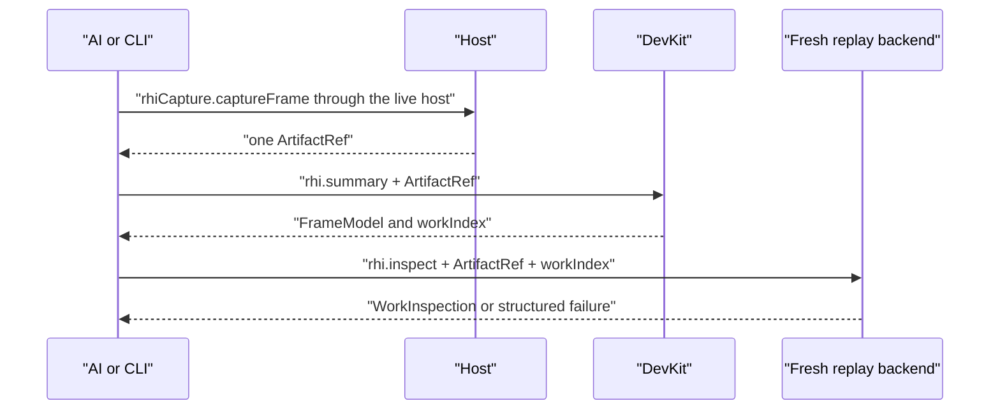
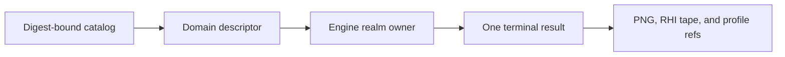
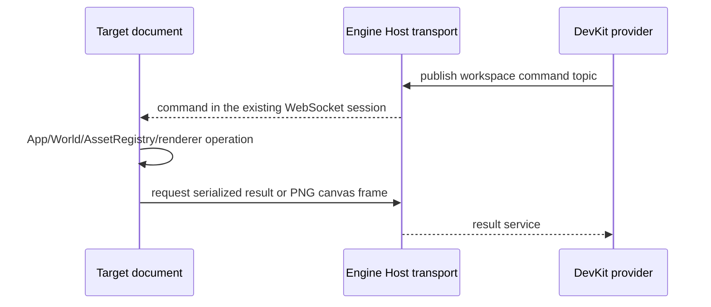

# @forgeax/engine-devkit

## Create behavior assets

```sh
forgeax asset plugin create --path assets/movement/movement.pack.ts --json
forgeax asset plugin create --path assets/physics.pack.json --module @forgeax/engine/physics/rapier3d --json
```

A `.pack.ts` path creates a native Cordis implementation and its asset definition in one file
unless `--module` selects an existing implementation. A `.pack.json` requires `--module`.
Use `--input` for structured configuration, `--export` for a named runtime export, and `--dry-run`
to inspect the returned `source` without writing. Creation never overwrites a source. Set the
returned GUID with `forgeax project root set` only when the asset is a project root; feature
assets can instead be referenced by another Pack.

Organize Packs by feature. Small behaviors belong in same-file named exports; complex implementations
may use ordinary TypeScript modules. Neither `plugin.ts` nor `.plugin.ts` is a special entrypoint.

DevKit is the Node-only external-project seam for ForgeaX. It derives project
commands, authoring-preview contributions, and one AI-facing RHI-debug path from
the existing project authorities. It owns orchestration and file access; Engine
owns rendering, RHI events, replay backends, and preview execution.

> [!IMPORTANT]
> Keep one artifact reference across the RHI-debug flow. `rhi.summary` and
> `rhi.inspect` never rediscover a tape, infer a file pair, or parse error text.

The generated development-server owner invalidates compiled module payloads
after server close, including the retired environment of a Vite restart.
Serving plugins release their own caches through Vite lifecycle hooks; this
cleanup does not change project, run, or browser ownership.

## Independent backend startup

```sh
forgeax backend start --root /path/to/workspace --json
forgeax backend start --root /path/to/workspace --host-pack /path/to/view/host.pack.json --json
forgeax backend status --root /path/to/workspace --json
forgeax backend stop --root /path/to/workspace --json
```

`start` provides one resident BackendHost with Engine workspace tools and the
selected host PluginAsset. `--host-pack` selects one installed package's Pack
without copying it into the game or changing the game's `forge.json`. Omit it
to use the project's declared host root. A running backend rejects a different
explicit host Pack; stop it before changing the selection. The selected path is
reported by `backend status`. It does not launch a browser, create a project
session, initialize graphics or execute game Entries. A directory without
`forge.json` can host the Engine APIs with no project plugins. The returned
status exposes no transport credentials. Stop releases this backend's resources;
independent runs keep their own `engine run stop` lifecycle.

Native host plugins inject `devkitBackend`, `engineWorkspace` and `toolApi`.
`devkitBackend` exposes the exact Host, workspace root and optional
`hostPackageRoot`. A presentation plugin may
provide an optional `devkitWorkspaceFrontend { assembly, module }` through its Fiber; it is
sampled when a caller explicitly opens a workspace. Connection projections use
Host's existing `bindProjection` and `DevKitHostBinding.frontendAssembly` with an explicit immutable `frontendModule`, and their lifetime belongs to the connection
or owning plugin. Do not update the parent Loader during plugin disposal.
`callDevKitBackend(root, operation, args)` calls one active ToolApi provider over
the authenticated local transport; absent or ambiguous capabilities fail.

For example, an installed View host Pack contributes separate `view start`,
`view status` and `view stop` commands. `view start` requires this backend and
returns a UI URL; the user opens a browser and explicitly chooses a project or
observation target. Its optional Shell mounts before rendering, so a renderer
failure does not remove the interface. The embedding `devKitWorkspacePlugin`
contract remains available for applications that already own a Host.

A destroyed workspace page remains terminal even when its URL is reloaded.
Presentation clients may request a guarded replacement through Engine's
`project.open({ root, expectedTargetId, expectedTargetState: 'lost' })` contract.
The session projects its existing terminal failure; no asset query or parallel
health monitor decides whether replacement is allowed. DevKit
continues to fence old page messages and does not revive a target or replay
execution. Picking uses the existing `target.pick` request/result path, including
its authentication and exact target/preview-owner checks. The provider neither
interprets clicks nor forwards a dedicated selection or pick-error topic;
presentation clients decide how query results affect their selection.

## Navigation

- [CLI and catalog](#cli-and-catalog)
- [Browser compositor capture](#browser-compositor-capture)
- [Engine source binding](#engine-source-binding)
- [Startup diagnostics](#startup-diagnostics)
- [Borrowed display carrier](#borrowed-display-carrier)
- [Engine workspace provider](#engine-workspace-provider)
- [RHI-debug operations](#rhi-debug-operations)
- [Authoring preview](#authoring-preview)
- [Project authority](#project-authority)
- [Migration and carrier](#migration-and-carrier)

## CLI and catalog

The normal project commands remain available through the `forgeax` CLI:

```text
forgeax project new [directory] --template empty|game-3d
forgeax project init
forgeax project check
forgeax project skill install
forgeax project skill verify
forgeax project test
forgeax dev start
forgeax project build
forgeax project capture --backend auto --require-ui --output artifacts/capture/game-ui.png --json
forgeax project preview
forgeax project package [--format web-zip|single-html] [--output release/game-web.zip]
forgeax help --tree --json
forgeax debug rhi summary --artifact .forgeax-debug/{runId}/frame.rhitape --json
forgeax debug rhi inspect --artifact .forgeax-debug/{runId}/frame.rhitape --work-index {workIndex} --json

# Pack authoring identity and recovery
forgeax asset resolve --package-id {packageId} --source-key {sourceKey} --require identity --json
forgeax asset resolve {assetGuid} --require ready --json
```

> [!IMPORTANT]
> `forgeax dev start` is a source-development server and `forgeax project preview` is a
> verified static `dist/` server. Their `--json` startup envelopes expose
> `mode`, `serves`, and the current `rhi.capture` capability. Neither command
> silently invents a live capture attachment.

### Persistent live control

Run commands from a game project root, or pass `--root`. The live owner keeps
one actual game running between CLI calls. Use `help dev` for discovery.

The detached owner keeps its control endpoint in `.forgeax/dev-session.json`;
its project Vite child uses an OS-assigned loopback port rather than the
default strict `5173`. The ready result and `dev status` expose the actual
project URL, so another process may already own `5173` without changing the
owner PID, control endpoint, or revision contract.

```bash
forgeax dev start --headless false --json
forgeax dev find --name Player --json
forgeax dev focus --name Player --distance 6 --json
forgeax dev camera set --position '[8,6,8]' --target '[0,1,0]' --json
forgeax dev camera set --lens '{"projection":"perspective","fov":1.0472,"near":0.1,"far":1000}' --json
forgeax dev capture --json
forgeax dev camera release --json
forgeax dev stop --json
```

Observation commands default to the current runtime. Every successful
observation returns its `revision`; pass `--revision` to require that exact
runtime on the next command. Reload or World replacement invalidates old
revisions and entity refs. `find` returns refs usable with `focus --ref` when
names are ambiguous. `focus --name` uses an exact name and never chooses the
first duplicate. `find --limit` defaults to 20 (maximum 100).

`dev eval --revision <revision> --code 'return simulation.execution.report()'`
requires a revision because arbitrary code can contain old entity handles.
Canceling its wait does not stop already-running code; reload/stop destroys
its execution environment. Camera control is temporary: set/focus acquires
an observation camera, get reports `control`, and release returns control to
the game. These operations do not save scene edits.

`dev capture` returns PNG and JSON report references with absolute paths and
digests. Default artifacts live in the user's data directory and survive
stop or temporary-project deletion. `--output` selects an explicit PNG path;
relative paths resolve against the project. `--checkpoint` waits for an exact
game-provided ready marker; it is not an image label and is unnecessary for
ordinary screenshots. The frame number confirms a submission before capture,
not the exact frame represented by the PNG.

`dev camera set` accepts `--lens` and `--exposure` as JSON objects. These are
temporary observation values; `camera release` restores the authored game
camera. The same values can be passed through `--input` from a script when a
single request needs both fields.

## Bounded asset discovery

The unified asset list always returns a bounded page envelope. The default
`--limit` is 100 (maximum 256); add `--type` and an opaque numeric `--cursor`
to continue a filtered query:

```bash
forgeax asset list --type mesh --limit 20 --root ./game --json
forgeax asset list --type mesh --limit 20 --cursor 20 --root ./game --json
```

The envelope contains `items` and `page` for imported assets, or `assets`,
`sources`, and `page` for Pack authoring sources. Pack uses one cursor for both
projections; `page.total` is the longer of the filtered output and source
collections, so a source-only `pack.ts` project remains fully discoverable.
`page.nextCursor` is omitted when both projections are complete.

When a project has a generated `dist/pack-index.json`, its current Pack rows
are included as materialized outputs. Their GUID, `packageId`, `sourceKey`,
kind, source path, readiness, and producer publication are therefore visible
to the same list, inspect, and verify commands; a malformed index fails closed
instead of silently hiding outputs. Inspecting a published output GUID resolves
that output identity, while inspecting a Pack source path still returns source
metadata.

`asset verify` returns one `asset-verification-v1` report. It separates the
author source (`meta.json`, `pack.json`, or `pack.ts`) from output status and
producer state; `unproduced` and `unknown` are explicit results. The report is
bounded to 256 assets and includes its scanned source scope, so a large result
cannot silently masquerade as an empty catalog.

The default `--backend auto` prefers hardware and allows software fallback;
status reports the requested policy, actual backend, and fallback reason.
Explicit `hardware` or `software` must match the selected adapter. Stop an
existing owner before changing its browser options. Headed live windows use
the native display density; fixed-size capture keeps its declared resolution.

Use `--headless true` for unattended operation and `--workers '{}'` for automatic
Engine + Render + eligible Kernel Workers. Each worker accepts `auto`, `true`
(require), or `false` (disable), for example `--workers '{"kernels":false}'`.
The status exposes actual `workers` decisions. An omitted `--workers` uses the
project default: automatic Engine, Render and eligible Kernel Workers. `dev reload` rereads project inputs;
Live checks author file metadata in the background and before/after operations
and reloads; it does not depend on filesystem event delivery. Changes reject
observations until the new runtime is ready. Unreadable inputs report failure
and are retried; edits during reload trigger another reload. `revision` identifies
a runtime, not an atomic disk snapshot or content digest. The scan reads author
source bodies only to discover literal documentation dependencies; unrelated
prose remains metadata-only. The interval adapts to scan cost (at least one
second), while explicit operations check immediately. Checks include path, inode, size, mtime, ctime and mode, and
follow author symlinks. Installed dependencies, `.git`, `.forgeax`,
`.forgeax-harness`, `.worktrees`, `dist`, `artifacts`, and `coverage` are excluded.
Use explicit reload after changing installed dependencies or Engine builds.
The contract assumes ordinary local filesystem metadata; it does not guarantee
network-filesystem consistency or atomic multi-file writes. The owner PID and
endpoint remain stable; internal project/browser/bridge instances are recreated.
`dev status`
reports stopped when no owner is registered, and unreachable when an existing
owner cannot be contacted; it never silently replaces that owner.

Static deployment is an Engine-owned build product. A publishing host supplies
the project root, public URL base, and dedicated output directory; DevKit owns
the generated host, asset cooking, shader compilation, Pack index, and
`forgeax-dist.json` closure.

## Generated asset host

DevKit derives one producer composition for `dev` and `build`. The generated
host uses `pluginPack` with the project's asset roots and producer registrations;
serve mode fixes each catalog with `watch: false`. DevKit compiles and validates
a candidate session before replacing the server and reloading the page. Failed
candidates leave the running session intact; old lazy module requests refuse
changed source bytes. `runtimeBinding` identifies the asset scope, while plugin
`sessionGeneration` identifies the whole executable session.

| Fact | DevKit rule |
|:--|:--|
| `producerReadiness` | Keep producer capability explicit; a missing importer or cooker is a structured failure. |
| `sourceKey` | Preserve producer semantic output identity; never replace it with source position or a cache path. |
| Catalog | Read the projection and its lifecycle/diagnostics; do not write Pack, Meta, or DDC from the generated host. |
| LKG | Treat `lastKnownGood` as read-only evidence while repairing the producer, then retry the same GUID. |

The authority map and executable audit are [`schemas/asset-authority.schema.json`](../../schemas/asset-authority.schema.json) and [`check-asset-authority-audit.mjs`](../../scripts/forgeax/check-asset-authority-audit.mjs). A failed command should expose its structured `code`, `expected`, `hint`, and `detail` so the named producer can be repaired without guessing from messages.

Plugin definitions are Pack outputs with `kind: 'plugin'`, a module/export locator, and serializable configuration. `forge.json.roots` selects one asset per realm: Node `host`, browser `frontend`, World `engine`, and isolated `build`. DevKit compiles literal program tables and `plugin-program-inventory.json`; it never discovers runtime modules by scanning installed packages.

Custom Vite hosts use `executionWorkerEntries()` once per host alongside
`pluginRuntimeProjection()` and their `pluginProgramsBuild(...)` contributions,
all from `@forgeax/engine/devkit/plugin-build`. The Vite root owns Engine module
identity and program imports; each contribution's `projectRoot` owns its content
sources and inventory. A host may serve several content projects without adding
an Engine umbrella dependency to every content package.

Emitted JavaScript uses a module lexer for literal import/re-export edges;
large generated shader payloads do not require a full TypeScript syntax tree.
No-substitution template imports retain their decoded literal semantics.
Program relocation and Engine dependency isolation inspect the same edges,
while authoring-source validation remains a separate TypeScript operation.

A build root is a native Plugin installed in an isolated Node process. It registers `ctx.nativeCookers` and `ctx.importers` through effects. Original producer functions remain in that process; typed IPC carries requests and bytes. Import `@forgeax/engine/devkit/plugin-build` for the build Context type augmentation. Duplicate keys, blocked bootstrap content reads, startup failures and cleanup residuals reject preparation.

```ts
import type {} from '@forgeax/engine/devkit/plugin-build';
import type { Plugin } from '@forgeax/engine/plugin';
import { volumeCooker } from 'project-volume-tools';
export default {
  inject: ['nativeCookers'],
  apply(ctx) { ctx.effect(() => ctx.nativeCookers!.register(volumeCooker)); },
} satisfies Plugin;
```

> [!IMPORTANT]
> DevKit also closes the Engine builtin-mesh dependency boundary. During a
> standalone build it adds a generated Pack descriptor only for builtin mesh
> GUIDs absent from the project; the Geometry decoder turns those descriptors
> into validated primitive meshes. Project-authored descriptors remain the
> single declaration, so the generated Pack never creates a GUID collision.

```bash
forgeax project build --root ./games/my-game \
  --base /games/my-game/ \
  --out-dir ./website-staging/games/my-game \
  --json
```

`--out-dir` resolves relative to the game project root unless it is absolute.
The selected directory is a derived build root and is emptied before writing.
`forgeax project preview` continues to verify and serve the default `dist/` directory.

### Runtime Pack capability

Generated main, frontend and Engine Worker providers expose their own
`runtimePacks` Cordis service. Game code injects it and calls its producer to
admit content, generate parameter instances, save snapshots or restore them.
Frontend's five-action reader consumes that provider's combined Catalog and
fetcher. The frontend and Engine producers remain independent.
`producer.inspect().imports` is the discoverable module identity contract;
DevKit combines the default roster in `src/build/pack-program-imports.ts` with
Engine capabilities discovered in the actual build graph. A delivered module
does not imply that its Cordis services are installed.

Plugin delivery retains pure tool contracts and lowers their executor references
into the same program table as plugin exports. Plugin and tool exports from
`*.pack.ts` share the existing runtime projection; the authoring expression is
removed once. Each selected plugin has a target-filtered contract, including an
explicit empty contract when it declares no tools. Native `registerAssetTools`
owns activation and lazy execution; program-table construction evaluates neither
plugin implementations nor tool executors.

The generated bootstrap exposes exact public Engine module locators, including
production facade chunks, without eagerly importing them. Retained-program
offline evidence requires the executing realm's Engine modules to be already
loaded or otherwise available offline; the binding table alone does not provide
their bytes. It does not load new Pack implementations or install their plugins.
In development, the selected native module files are explicitly admitted to
Vite's file serving boundary, including installed packages outside the project.
This does not grant access to their unreferenced sibling files or directories.

| Environment | New native JS module delivery |
|:--|:--|
| Main/frontend over HTTP(S) | Prepare the application Service Worker on first explicit program load; publish native ESM through CacheStorage. |
| Engine Worker | First new-program load requests bounded preparation from its page over a DevKit-owned BroadcastChannel for that App. Existing native graphs need no request. Worker publishes its own modules. |
| `file://`, missing browser capability or failed preparation | Ordinary assets and delivered programs retain their existing routes. New native runtime programs report a structured loading failure. |

The delivery worker only intercepts its program URL namespace. An existing
application Service Worker requires Host integration; it is never silently
replaced. Program data URLs are not a fallback for failed browser delivery.
The private delivery channel leaves the game's borrowed MessagePort queue untouched.
Its name travels through existing bootstrap data; each World owns its pending
request, rejects stale replies, and releases its listener on disposal. Missing
channel support or preparation failure affects new-program loading, not static startup.
Saved source snapshots remain the persistence authority; CacheStorage contains
reconstructible module files. Execution after a content-channel disconnect does
not prove that the entire application can cold-start offline. Single-HTML export
keeps its existing zero-external-request contract.

Workspace publishes the same project-level `engine.runtime-pack.*` tools through
its existing Host ToolApi, authorization hook and command/result transport.
`prepare` invokes the Node program producer (including real TS conversion);
the remaining operations execute on the actual project App even before its first
preview frame. `engine.run.eval` remains unavailable to frontend callers.
See [App's runtime Pack contract](../app/README.md#runtime-pack-assembly) for
target identity, connection-owned native installations and cancellation evidence.
Snapshots return portable source data; the caller chooses a persistence medium.
Independent resource previews read the project App's combined Catalog through
its existing package transport. Preview disposal preserves the parent producer,
and its Registry can observe newly generated versions without owning production.

Borrowed Host project closure waits for the old page's Workspace-scope cleanup
response before unregistering its result service. A surviving old page retains
its game App and Pack definitions, while its closed Workspace refuses new content
operations. Known cleanup failures remain failures of project closure. A lost
connection retires with explicit `cleanup: 'unconfirmed'` evidence on the old
handle and tool result, retaining the existing exact lost-target recovery path.
An execution failure while the browser remains connected still uses the cleanup
command; failed World readiness does not suppress native disposal.

### Production Worker selection

DevKit forwards `FORGEAX_EXECUTION_WORKERS` to App's composable worker policy.
An empty object enables all supported workers; individual fields override it.
Omitting the variable selects `auto` for Engine, Render and Kernel Workers, including ordinary projects created from either template. Use `{"engine":false}` for local execution through the same bootstrap.

```bash
FORGEAX_EXECUTION_WORKERS='{}' \
  forgeax project build --root ./games/my-game --json

FORGEAX_EXECUTION_WORKERS='{"kernels":false}' \
  forgeax project package --root ./games/my-game \
  --format web-zip --output release/my-game-web.zip --json

FORGEAX_EXECUTION_WORKERS='{"render":false}' \
  forgeax project package --root ./games/my-game \
  --format single-html --output release/my-game-offline.html --json
```

Source gameplay plugins can inject `world`, `assets` and `executionBootstrapHost`.
Independent rendering places `renderer` in the child realm; a source plugin that
requires it must be migrated to the bootstrap's renderer configuration/feature
boundary, or explicitly co-located with `render: false`. DOM UI remains Host-owned.
Select browser UI through `roots.frontend`, World logic through `roots.engine`,
and resident Node services through `roots.host`; definitions themselves carry no realm.
Browser and Engine contexts receive their own `gameHost` and asset reader. Browser
plugins receive App controls, the live canvas and `uiRoot`; Engine plugins receive
World/assets and explicit scene-owner bindings. UI loads its UiAsset without creating
another World. Resource preview and bound workspaces retain their explicit assembly.
Ordinary generated games also receive an instance-local `gameHost.port` in both
frontend and Engine plugins. DevKit supplies the Engine end through App's existing
`execution.bootstrapPort`; each realm borrows its own end of the same channel.
Use `addEventListener('message', listener)` and `port.start()`, and remove the listener
through `ctx.effect()`. The game owns message schemas, request/state handling and
reconnection after a World rebuild. DevKit closes the frontend end; App closes
the Engine end on disposal. DevKit also closes its original Engine handle if
startup fails before App accepts it. Plugins must not close borrowed ports.
The channel works with local execution and Engine Workers, in development and
shipped builds. Resource/editor hosts may omit the port.

The DevKit development and dist-preview servers provide COOP/COEP isolation and
`Cross-Origin-Resource-Policy: cross-origin` so another isolated Engine document
can embed their output across ports. An embedding owner that needs isolation
inside its iframe also grants `allow="cross-origin-isolated"`. Production hosting
must supply the corresponding headers; without isolation, auto preserves Render
Worker and executes numeric kernels inline.

The generated host writes the internal
`.forgeax/generated/execution-bootstrap.ts`; authors do not edit or maintain
that file or its emitted name. Production builds emit the App Worker runtimes
and bootstrap in one shared module graph, preserving component identity and
module state when a Worker loads project plugins. Dynamic imports omit the
DOM-only module preloader. Development serving excludes the umbrella and its
Engine dependencies from Vite prebundling, deriving that roster from the installed
umbrella manifest so native Worker imports and project imports retain the same
component tokens and Scene state. The App package dependency closure supplies
native scan entries, allowing Vite to discover nested third-party dependencies
before target activation instead of later reloading the live page. Independent
runs may snapshot dependencies
outside the project; serving admits the resolved App output directory for its
Worker constructor URLs while preserving the surrounding filesystem boundary.
The bootstrap entry is
`dist/assets/execution-bootstrap.js`, and the generated `index.html`
and its main module reference the same closure. `web-zip` includes that module
and all of its discovered dependencies in the verified archive. `single-html`
embeds the same generated page, module, Worker, WASM, Pack, shader, media, and
font closure in the candidate HTML. Follow the normal `forgeax project preview`
path for a built directory, upload a Web ZIP to an HTTPS static host, or open
the exact single-HTML candidate through the release browser profile.

`forgeax project new` accepts an absent or empty target only when that target is outside the unpacked SDK
root. An SDK-owned target fails before template copying with `project-target-inside-sdk`; use a
sibling directory or an absolute path outside the SDK.

`forgeax project new` requires an explicit template: choose `game-3d` for every 3D game, including custom
3D genres, and choose `empty` otherwise. Omitting `--template` fails with `sdk-template-required`.

> [!IMPORTANT]
> `game-3d` is a runnable, contentful third-person reference, not an empty 3D scene. It copies
> authored scene content, visible objects and static collision examples, character/material/animation packs,
> and UI into the new project; those choices affect the initial picture, movement space, and asset
> closure. Read the generated project's `README.md` before pruning anything, then keep, adjust, or
> replace the starter content for the game's goal and update scene, runtime, and pack references
> together when removing it.

`forgeax project package` rebuilds with relative URLs, verifies the complete `forgeax-dist.json` closure,
and emits a deterministic Web ZIP plus an adjacent SHA-256 file. The archive contains the bundled
Engine JavaScript/WASM runtime and game assets at its root for HTTPS static or HTML-game hosting;
it also attaches the project documents `README.md` and `docs/feedback.md` unchanged at those same
ZIP paths. Both documents are required, so an incomplete game archive fails before the build starts.
It does not contain other author source, `node_modules`, or a local development server. Use
`forgeax project preview` for local HTTP acceptance. Opening the archived `index.html` through `file://` is
unsupported.

| Web ZIP path | Owner | Purpose |
|:--|:--|:--|
| `README.md` | Game project | Human-facing game overview and run instructions |
| `docs/feedback.md` | Game project | Development issues and Engine/SDK feedback carried with the release |
| `index.html`, `forgeax-dist.json`, and declared dist artifacts | DevKit build | Browser runtime and cooked game closure |

`single-html` remains a separate self-contained-file format; the document attachment contract applies
to the Web ZIP only.

`forgeax project package --format single-html --output release/game-offline.html` emits a self-contained
single-HTML candidate and adjacent SHA-256. DevKit derives it from the same verified dist manifest,
embeds the generated module/worker/WASM/resource closure, and reports the candidate path, digest,
dist-manifest digest, and embedded asset count. The candidate is the acceptance object: open that
exact file through `file://` in the release browser profile and require zero remote requests, failed
requests, console/page errors, and resource misses before promotion. This format does not make
arbitrary dist `index.html` files or network-dependent services offline.
The second bundle resolves emitted local chunks. Preload dependency rewrites follow
the imported binding; same-named nested functions, parameters, and block bindings
retain their arguments. Residual optional bare imports
and computed imports use the packaged-resource lookup: an unavailable request
rejects and appears in the witness, including a Node-only service requested from
the browser.

`discoverRhiDebugOperations()` returns the same descriptors used by help and
schema output. The operation manifest is the single discovery and recovery
surface for RHI-debug.

### Pack authoring operations

The default Tool Catalog projects the Pack-owned descriptors
`asset.list`, `asset.inspect`, `asset.resolve`, `asset.verify`,
`asset-source.create`, `asset-source.clone`, `asset-source.import`, `asset-source.create-instance`,
`asset-source.apply-values`, `asset-source.rebuild`, and
`asset-source.cold-cook`. `forgeax asset resolve` is the CLI convenience
adapter for the same `asset.resolve` executor; it accepts a GUID, a
`packageId + sourceKey` pair, or a source locator. `--require identity` proves
only deterministic derivation, `present` proves current topology, and `ready`
requires current producer evidence and loadable artifacts. Query operations do
not build or write; mutations use the shared request-id and source-revision CAS
contract owned by `@forgeax/engine-pack`.

## Browser compositor capture

> [!IMPORTANT]
> forgeax project capture is a development visual-evidence path. It uses the host browser adapter when
> available and can explicitly use a software lane on machines with no physical GPU or display. It
> is not a player or release-acceptance gate.

The command starts the source-development host on an ephemeral loopback port, creates an Xvfb display
when `$DISPLAY` is absent on Linux, launches a real Chromium browser, waits for an engine frame signal
and non-flat **canvas** pixels, then takes a Playwright **page screenshot**. A page screenshot
composites the WebGPU canvas with normal DOM and open ShadowRoot UI;
`canvas.toDataURL()` cannot provide that proof. `--wait-ms` is an additional settle interval after the
first non-flat canvas frame, not a guess for CPU startup time.

```bash
forgeax project capture --backend software --require-ui \
  --output artifacts/capture/game-ui.png \
  --width 1280 --height 720 --wait-ms 4000 --json
```

The adjacent `game-ui.json` is the schema-v2 run manifest. Its run-level fields record the browser,
viewport, X display, lavapipe ICD discovery, and browser errors; its ordered `captures[]` rows record
each PNG digest, checkpoint, actual `GPUAdapterInfo`, canvas/UI witnesses, and canvas-only sampled luma
range. `backend auto` (the default) tries the normal browser adapter and uses the configured software
lane when it cannot obtain hardware. `backend hardware` requires a non-software adapter;
`backend software` requires the software lane. The report records the requested policy, observed
backend, and fallback reason. The old `--software` spelling remains an alias for `backend software`.

The witness screenshot temporarily hides every non-canvas element, so a visible HUD cannot
disguise a black 3D frame; the written PNG remains the complete page compositor output.
`--require-ui` requires at least one mounted child under the generated host's `#game-ui` root; unrelated
Engine or browser ShadowRoots are only diagnostics and cannot satisfy the gate. A uniform black frame
also fails even when canvas and adapter structure exist. Browser discovery includes the installed
Playwright Chromium; `--browser` explicitly selects another executable. Resource
preview and replay reuse this discovery across Linux, macOS, and Windows, including `FORGEAX_BROWSER_EXECUTABLE`;
an explicit `FORGEAX_CHROME_CHANNEL` selects the Playwright channel instead.

Project capture fixes the viewport and screen size, DPR 1, sRGB colour profile, light colour
scheme, `en-US` locale, UTC timezone, and waits for `document.fonts.ready`. An unsized headed development
session uses the native window and display density. Projects must ship the same
Web font files on every machine; a system-font fallback is not a colour or layout parity contract.

For local/remote pixel or colour comparison, add `--deterministic`. The command navigates with
`?forgeaxCapture=1`. The Engine App publishes
`document.documentElement.dataset.forgeaxFrameSubmitted` (the monotonic frame id) after the Renderer
crosses its real queue-submit boundary and dispatches `forgeax:frame-submitted` on the canvas. DevKit
waits for that engine signal and a non-flat canvas crop before consuming the game's
`document.documentElement.dataset.forgeaxCaptureReady` checkpoint; it never guesses startup time. The
game remains the time authority: in capture mode it must pin its random seed, viewport-independent
state, local web fonts, and logical time/frame, render that state, then publish the ready marker. A
wall-clock delay is useful only as extra settle and is not parity evidence.

```bash
forgeax project capture --backend software --require-ui --deterministic \
  --width 1280 --height 720 --output artifacts/capture/parity.png --json
```

### Persistent playthrough capture

`capture` is the one-shot adapter over the same browser owner. For one game boot followed by input,
assertions, and multiple compositor captures, compose the persistent session through `createBrowserCapture(root)`:

```js
import { createBrowserCapture } from '@forgeax/engine/devkit';
const browser = createBrowserCapture(process.cwd());
async function playthrough() {
  const session = await browser.open({
    backend: 'auto',
    deterministic: true,
    requireUi: true,
    outputDir: 'artifacts/playthrough/boss-flow',
  });
  try {
    const { page } = session;
    await page.getByRole('button', { name: 'Start' }).click();
    const spawn = await session.capture('spawn');
    await page.keyboard.press('KeyW');
    const arena = await session.capture('arena');
    await page.getByRole('button', { name: 'Cast' }).click();
    const bossHit = await session.capture('boss-hit');
    return { report: session.reportPath, captures: [spawn, arena, bossHit] };
  } finally {
    await session.close();
    await browser.close();
  }
}
console.log(JSON.stringify(await playthrough()));
```

```bash
node tests/boss-playthrough.mjs
```

The Engine App frame signal and the game checkpoint are separate composable authorities:
`session.capture('boss-hit')` waits for the engine frame signal, then the exact
`document.documentElement.dataset.forgeaxCaptureReady` value and non-flat pixels. Playwright remains
the input/assertion owner through the unwrapped `session.page`.
DevKit owns Xvfb/Chrome/Vite lifecycle, compositor stabilization, PNG validation, numbering, digests,
and one `run.json`. A live `Page` or session belongs to the ordinary Node or Bun module that created
it; the unified CLI does not provide a script execution command.

| Browser backend | Owner | What it proves |
|:--|:--|:--|
| Mesa lavapipe | Dawn/Node smoke and explicit GPUTexture readback | Offscreen render pixels without a display; no HTML UI |
| Chrome hardware adapter | forgeax project capture --backend hardware | Browser compositor pixels on the selected adapter plus HTML/Shadow DOM |
| Chrome SwiftShader under Xvfb | forgeax project capture --backend software or a Node or Bun script using the SDK command client browser session | Browser WebGPU canvas plus HTML/Shadow DOM in ordered viewport PNGs |

> [!CAUTION]
> Software pixels are iteration evidence. They do not prove physical-GPU performance, vendor-driver
> behavior, HDR-display output, or release visual acceptance.

## Engine source binding

Built-package games normally resolve @forgeax/engine from the registry. A source-development game
can bind the same dependency name to a checked-out Engine workspace without editing its manifest:

```bash
forgeax project engine status --json
forgeax project engine use-local ../forgeax-engine --json
forgeax project engine check --json
forgeax project engine unlink --json
```

The binding is stored only in .forgeax/engine-binding.json; file absence is the single normal
registry/SDK state. The project manifest remains the dependency authority. `forgeax project engine check` fails
closed for a pnpm workspace dependency that npm cannot consume, for an unbuilt local workspace, or
for a missing SDK package. Status derives its workspace digest from the actual built entry bytes and
reports their newest modification time. engine unlink removes the sole override and returns to the
normal registry/SDK resolution path.

A packaged desktop DevKit can also host an external project with no Engine install.
Its physical `node_modules/@forgeax` distribution directory supplies the existing
Vite resolver fallback, using each package's declared exports. Project-installed
packages keep priority; an explicit source binding continues to select that source
workspace. This fallback does not install packages or write a project binding.

Physical realm consumers use `createRealmDispatch`. Each descriptor is routed to
one owner for its declared realm (the `ToolRealm` contract). A missing owner
returns `tool-capability-unavailable` with the realm in `detail`; it never falls
through to another realm.

## Startup diagnostics

Generated development and production hosts allow 30 seconds for Engine Worker
startup, including module loading, separate source/render assets and renderer
initialization. The live CLI uses the same first-frame waiting budget. The App
terminates a Worker that exceeds its bounded handshake; per-frame deadlines are
unchanged.

The generated game host renders structured startup failures recursively instead
of coercing thrown objects to `[object Object]`. It preserves `name`, `message`,
`code`, `expected`, `hint`, `reason`, and bounded nested
`cause/detail/webgpuError/wgpuError/error` fields. Generic objects use bounded
JSON serialization and circular objects receive an explicit diagnostic.

When the resulting evidence mentions WebGPU, adapter absence, or no usable
backend, the host also states that ForgeaX supports browser WebGPU and a
wgpu/WebGL2 fallback. This note is intentionally not a fallback decision: the
structured cause remains the authority. A publishing Agent must not infer
unsupported hardware, swallow the entry error, or inject a replacement Canvas
game merely to remove an uncaught exception.

### Generated game startup lifecycle

> [!NOTE]
> The generated HTML owns this small lifecycle; game code does not call a
> loading API. Workspace, resource, and tool pages omit the normal game
> overlay, while entry/App failures still use the fatal diagnostic surface.

| Phase | Host-owned contract | Cleanup boundary |
|:--|:--|:--|
| HTML → module | Static title, status, CSS spinner, and `noscript` text are present before the entry module is imported. | No App, GPU, WASM, or asset request is required to paint the first loading surface. |
| Prepare | `prepare()` runs before `app.start()` and changes the status to `Preparing scene…`. Input is sampled through a closed gate and cleared. | Foreground-only slow-load accounting may show a wait/reload hint after 15 seconds; it never fails the game. |
| Enter candidate | A matching submitted/completed frame identity, World/session identity, device generation, `presentation: 'ready'`, and successful receipt `Result` are required. A submit or ACK alone is insufficient. | A 150 ms fade keeps hit-testing over the canvas; reduced motion removes the transition. |
| Entered | The fade completes before gameplay input and pointer-lock policy reopen. | Startup frame, visibility, input-capture, and timer listeners are removed. |
| Failed | Entry errors, `app.onError`, resource errors, and rejected receipts render structured fatal diagnostics with `Reload`; arbitrary nested detail remains inspectable. | Loading/fade work and gameplay input are cleared; the fatal Reload listener is retained for the terminal page. |
| Hidden/destroyed | Background tabs do not spend the slow-load budget or invent a completed frame. | `pagehide`, entered, and failed paths cancel pending timers and startup listeners. |

## RHI-debug operations

For difficult or unexplained rendering failures, start with
[`forgeax-engine-rhi-debug`](../../skills/forgeax-engine-rhi-debug/SKILL.md).
Start the live owner with `forgeax dev start --rhi-capture true`, reproduce the
failing state, then run `forgeax debug rhi capture --json`. The CLI routes capture
to that live owner, invokes its recorder, and persists one `.rhitape`; retain the
returned `path` and `digest`. Capture requires a ready recorder-enabled App and
does not start one automatically. Stop an existing owner before changing its
capture options.

The lower-level `createCliRhiDebugOperationContext()` is offline-only and returns
`capture-unavailable` for capture; it is not the unified CLI's live capture route.
File paths are sufficient for both commands. Optional `--digest sha256:...`
verifies the expected artifact bytes; a mismatch returns
`artifact-digest-mismatch` before a replay device is created. `rhi.summary`
returns `summary.works[]` with work/event/pass coordinates, pipeline entry
points and attachments. `summary.unseededResources` identifies retained
resources whose initial bytes are absent; inspect their producing work before
using replay pixels as evidence. Full shader and binding details remain in
`rhi.inspect --fields '["pipeline","bindings"]'`.

`rhi.summary` and `rhi.inspect` use this offline context to consume the persisted
artifact and create a fresh replay backend.



| Operation | Input | Output | Owner |
|:--|:--|:--|:--|
| `rhi.capture` | Optional abort signal | One `ArtifactRef` plus capture bytes | Host and recorder attachment |
| `rhi.summary` | One `ArtifactRef` | Strict v7 decode and compact work/initial-content summary | Protocol decoder and frame model |
| `rhi.inspect` | One `ArtifactRef`, one `workIndex`, optional fields | Fresh-backend `WorkInspection` | Replay session and readback matrix |

### ArtifactRef

`ArtifactRef` is the handoff SSOT:

| Field | Type | Meaning |
|:--|:--|:--|
| `kind` | `'rhi-tape'` | The only RHI-debug artifact kind. |
| `digest` | `string` | Digest of the canonical v7 tape payload. |
| `source` | `string` | Host or operation that produced the artifact. |
| `path` | `string` | Optional Node-side path owned by the host. |
| `bytes` | `Uint8Array` | Capture payload supplied at the host boundary. |

Consumers switch on `RhiDebugError.code`, then narrow `.detail`. `.expected`
and `.hint` provide the next action without message parsing. Unknown operation
names, fields, artifact kinds, and tape versions fail at the boundary.

## Authoring preview

Preview defaults to four explicit Engine-owned domain descriptors:
`material.preview`, `mesh.preview`, `vfx.preview`, and `texture.preview`.
Each follows the same command declaration and terminal path and binds its
report and evidence to the requested subject and snapshot.



The generic `asset.preview` and `preview.run` shapes are not discoverable. A
private legacy proof helper may remain for migration tests, but it cannot appear
in the default catalog or act as a second domain owner. Browser and Dawn
consumers must verify subject pixels and structured evidence; DOM liveness and
RhiNull readiness are not visual proof.

## Project authority

`forge.json.roots`, package manifests/locks, and authored Pack/Meta/code are persistent authority. Program tables, Catalog and runtime assembly are derived. Definitions use deferred reference consumption; loading a plugin asset does not install it.

Node plugin delivery exports portable artifacts through the existing program entries'
asynchronous `exportSource()`
for the selected root's reference closure, including referenced but unmounted
siblings and their tool executors. Pack co-location does not assign a target;
other targets require their own producer projection before complete capture.
All selected exports share one complete module graph. The provider carries pure
tool contracts plus live Host bindings; archives preserve only artifacts and
contracts. `createNodePackProgramImports` rebinds recorded imports in a fresh Host.
Generic npm imports retain a project package authority, dependency route and selected
entry, preserving distinct installed instances even when their bytes match. Content
identities include runtime peers; Node builtins and Cordis use their actual identities.
Missing dependencies or changed bytes cannot satisfy the archived import contract.

Browser static plugins use the existing Vite module graph in both the page and
Worker; their normal installation does not require Service Worker support. A
Pack may also contain backend definitions without putting their implementations
in that browser graph. The player boundary admits the browser-safe Import entry
and rejects Node imports (including Vite browser stubs) and compiler packages.

Build and development delivery expose lazy program export without evaluating plugins or
tool executors. It archives the player's final JavaScript graph, preserving shared
project modules and replacing Engine facade locators with exact Host capability
requirements. Every selection retains the complete graph. Archive JSON sits beside
the emitted program-table chunk; it is not embedded in its own executable graph.
The provider chunk hash includes all archived targets and the Engine identity, so
either kind of version change also changes the archive URL.
An unrecorded image, CSS, public-file, WASM or independent Worker dependency makes
export fail explicitly. Ordinary static installation remains available.

Development initializes Vite's optimizer before freezing the final transformed
closure of all browser selections, including literal lazy imports. Source-input
validation completes before the page can consume this accepted graph. HTTP delivery
and export then read the same frozen bytes through failed source candidates.
Every frozen module carries the current Host's generated-root identity in its
native URL; a replacement Host rejects old-session requests, including archive
requests. JSON and third-party virtual modules retain their original Vite producer
IDs during conversion; the final response supplies session-bound import URLs.
HTTP, transform queries and warmup consume the same frozen bytes, released when
the Host closes. This transport identity stays outside the portable program schema.
Vite query semantics such as `?raw`, `?worker` and optimizer versions are preserved.
Resource evidence comes from the actual Vite 8 producers; pure raw text and ordinary
strings are not rejected based on their filename. Sharing an undeclared transitive
Engine dependency makes export fail rather than duplicate that dependency on restore.
Asset-only startup retains its on-demand Pack preparation.

The source fence includes declared local plugin, tool-contract and executor
closures, including Pack references to published `dist` JavaScript. Discovery
freezes declared files; the actual compiler and contract loader resolve literal
imports, self-package exports and package imports before consuming each closure.
New paths extend the same input snapshot; changed recorded bytes reject the session.
Unrelated `dist` output remains disposable and is not broadly scanned.

The provider's `programHost` reuses the delivered native URLs only when the
complete archived graph and actual Host binding URLs match. Changing the selected
entry or export preserves module identity; changing bytes, graph membership or
bindings uses new-module delivery. The known selection entries let unrelated new
programs bypass archive I/O. A possibly matching graph with an unavailable archive
fails explicitly, preserving component identity instead of silently duplicating it.
Engine capability bindings are lazy locators, not an instruction to import every
capability at startup. Main, Worker and frontend assembly share the same provider
host with their runtime Pack producer.

Browser tests capture a complete mixed-target Pack and restore its JSON snapshot
into a fresh World in both page and DedicatedWorker realms, with Service Workers
blocked. They preserve project and Engine component identity, native plugin/tool
state and the unexecuted backend attachment in build and development modes.
Development tests also cover a broken candidate before the first tool execution,
and old-page lazy imports across successful Host replacement. Build tests then
delete the author checkout and Node producer output, retain only a copied `dist`
and saved Pack, and restore in a new Chromium process at a new origin, in both
the page and a fresh DedicatedWorker with Service Workers blocked. Existing
component identities survive; plugin/tool evaluation stays lazy and gameplay
counters start fresh.
New-program tests separately start a fresh browser with empty CacheStorage,
prepare only the Host's Service Worker transport, then disconnect the network
before the first restore. Saved JS and plugin/tool programs rebuild the empty
derived module cache and execute. The consumer must first receive its own Engine
and App modules; this proves offline asset restoration after consumer startup,
not offline startup of an entire website. Static native modules and their archive
remain the consumer Host's delivery responsibility.
DedicatedWorker tests also verify first-use delivery preparation after Worker
startup. Separate build/dev by JS/TS tests use actual `createApp` with the null
RHI: generate Mesh, Scene and PluginAsset together, instantiate the Scene,
execute an inline tool, replace parameters and dispose through native Fibers.
They restore and regenerate from saved JSON in a fresh browser after consumer
capabilities and SW transport are ready, with empty program caches and the
network disabled. JS preparation stays in the browser; TS conversion uses the
real DevKit producer before admission. These are structural App checks.

The separate `pnpm --dir packages/devkit test:runtime-browser` graphics gate uses
actual App EngineWorker execution with browser WebGPU, in build/dev by JS/TS.
It starts from an empty delivered Catalog, then submits new generator/plugin
source after startup. Native PluginAsset installation adds an ECS Update system
and an inline tool; withdrawal preserves the installed Fiber, and disposal stops
its system while unrelated gameplay continues in the same World. Failed
candidates leave the snapshot, Catalog, program table and current Scene intact.
The gate requires 60 additional ready, completed GPU receipts after generated
content enters the Scene, checks mesh width changes in compositor screenshots,
and closes the owned Worker through App disposal. Build JS/TS cases also close
Chromium, create a fresh browser and EngineWorker with empty program caches,
prepare only consumer Engine capabilities, the empty Catalog and Host SW, then
disconnect before the first saved-Pack restore. Restored plugins execute and
new parameter values render for another 60 completed frames without a compiler
or producer request. This proves offline restoration after consumer startup;
the test retains the original static server and does not establish whole-site
offline startup. It does not replace View, SDK delivery or the complete Engine
smoke gates.

On a Linux host with software WebGPU, run under a task-owned display:

```bash
FORGEAX_BROWSER_EXECUTABLE=/opt/google/chrome-beta/chrome \
FORGEAX_RUNTIME_PACK_EVIDENCE=/tmp/runtime-pack-worker-evidence \
xvfb-run -a pnpm --dir packages/devkit test:runtime-browser
```

The optional executable override otherwise uses Playwright's Chromium. This
gate explicitly selects SwiftShader: results establish browser/GPU behavior,
not hardware performance. Evidence includes snapshots, parameter-state images,
frame and plugin counters, publication checks and disposal results.

| Action | Command / source |
|:--|:--|
| Create a plugin asset | `forgeax asset plugin create` |
| Inspect definitions and source evidence | `forgeax asset plugin inspect` |
| Select/remove a realm root | `forgeax project root set` |
| Migrate a schema 2.0 project | `forgeax project migrate` |
| Import a portable author closure | `forgeax asset source import` |
| Clone source with independent identities | `forgeax asset clone` |

Use `help <path> --json` for the authoritative request schema. For example, `forgeax project root set --realm engine --guid <guid>` selects a root; `--guid null` removes it. Source transfer uses a new destination directory beneath assets, preserves source-relative layout, checks exact pnpm dependency-lock evidence, compiles the candidate and fences source/target revisions before commit. Cloning rewrites known GUID/namespace references and project WGSL module identities together with their material/import references. The candidate must retain its source closure inside the new clone directory; computed references that escape it fail before publication. Generated outputs are rebuilt in the target. Sources requiring cooked reads during closure discovery report an explicit unsupported transfer instead of copying an incomplete closure.

Changes to project roots, code, configuration, dependencies, or asset sources compile a candidate before replacing the running session. A new page or Worker receives one sessionGeneration; the accepted asset catalog stays frozen until replacement. Failed compilation preserves the old runtime; failure after replacement requires a new session and does not recover game progress.

SDK-created games keep all Engine usage skills as ordinary, committable files
under root `skills/`. `skill install` idempotently projects those files into the
supported Agent discovery roots with relative symlinks and narrow managed
`.gitignore` blocks. `skill verify` checks the source inventory, local manifest,
links, and ignore rules; foreign content at a managed destination fails closed.
SDK-backed installs disable pnpm's side-effects cache so the manifest-bound
offline store remains unchanged.

## Borrowed display carrier

### Product activation belongs to plugins

External products expose pure `toolContract` declarations through PluginAssets.
Help reads those contracts without evaluating runtime plugins or executors. A declared
command stays discoverable when its provider is inactive; invocation requires the
matching active provider. One-shot build tools activate `roots.build`; resident tools
belong to the mounted host root. The CLI forwards a discovered host command to
the resident backend ToolApi and returns its terminal result; a stopped or
missing backend cannot satisfy the command. Executors load only when invoked. Products contribute
their own command paths without adding product flags to `forgeax dev start`.
Host source validation resolves a symlinked project root before comparing its
authored inputs with the bootstrap inventory.
An inline `toolContract` requires no declaration module or discovery loader.
Its executor paths resolve from the Pack source; referenced declaration modules
retain their own relative-path base. Both forms use the same pure lowering and
native tool registration.

A command declaring a `root` input receives the CLI-selected project root for named
flags; `--input` remains an explicit validated object. Use Pack authoring and root
selection operations; no Entry install tree or command-specific registry remains.

| Concern | Owner and existing seam |
|:--|:--|
| Product commands, Shell, connection credentials and discovery | Product plugin and its command executor; no product module loader or credentials in Engine live status |
| Backend/frontend plugin assembly and cleanup | Native root plugins, explicit frontend module projection and Cordis Fiber; the product owns its Host |
| Project server on an existing Host | `createDevKitWorkspaceProvider({ hostBinding: { backend } })` or `createBrowserCapture().open({ host: { backend } })` |
| Browser navigation, observation and capture | `BrowserCarrierAdapter` lends an exact Page/Frame; Engine releases the lease without closing its owner |
| Embedded persistent live control | `runLiveDevDaemon(..., { carrier, carrierRun })`; the embedding process owns adapter startup and disposal |

> [!IMPORTANT]
> A carrier lends a browser target, not a BackendHost. The detached live daemon
> still runs its project server in a child process and cannot borrow an
> in-memory Host through this seam. A product requiring one shared Host must
> use the process-local host-binding path. Do not claim that adding a carrier
> establishes shared Host ownership. Add an Engine interface only when an
> executable consumer demonstrates a missing product-independent capability.

DevKit exposes `BrowserCarrierAdapter` from the public package root for an
already-open display host. The adapter returns a
generation-bound `BrowserCarrierTarget` with the exact `surfaceId`; DevKit
never chooses a page by URL or array position. A successful `attach()` returns
the stable owner `Page` plus an explicit `BrowserExecutionTarget`. For a borrowed
lease, the execution target is the exact child `Frame` and its `surfaceSelector`;
navigation, App/World observation, and runtime witnesses stay in that Frame,
while PNG capture uses the owner Page only for a temporary compositor envelope
around the exact iframe. `close()` releases only that lease and never closes
the display host. The caller supplies an already-open browser/page; the
borrowed path never launches another browser or window. The carrier owner is
responsible for authenticating any cross-process access. Electron, CDP,
discovery files, and product-specific transports are not part of this contract.

Pass `carrier`, `carrierRun`, and `carrierGeneration` to
`createBrowserCapture().open()` with `headless: false`. Headless sessions do
not call the adapter. If the adapter returns a private-browser fallback, the
existing private browser path remains the fallback; an attached owner page is
never silently migrated to a second page. The report records `carrier`, an
explicit `carrierFallbackReason` when applicable, and the exact `carrierTarget`
for identity correlation.

The persistent `live-dev` owner uses the same seam when it is embedded in a
process that owns the adapter: call `runLiveDevDaemon(root, port, sessionFile,
{ carrier, carrierRun })`. The daemon creates one service/run identity when the
caller does not provide one, passes the current generation to each browser
session, and publishes the selected carrier and exact target in live status.
Stopping closes the daemon's own resources and resolves its promise, including
when stop arrives during browser startup. Only the detached CLI entrypoint exits
its process; the embedded service never exits the product owner.
Daemon and project children always launch the package's own CLI artifact,
including when a plugin or library caller has a different process entrypoint.
`startLiveDev()` remains the detached CLI boundary; functions cannot be
serialized through its child-process environment, so it stays on the existing
private browser path until a caller supplies an in-process adapter bootstrap.

The one-shot `runBrowserPreviewHost()` and
`runBrowserResourcePreviewHost()` functions accept the same `carrier`,
`carrierRun`, and `carrierGeneration` in `BrowserHostOptions` for visible
recipes. The borrowed page is observed before navigation and kept for the
visible capture; replay remains the existing private headless page. Closing
the operation releases only the borrowed target. Hidden recipes never query a
display carrier. Both owners therefore share `acquireBrowserCarrierPage()`;
the older Tool carrier route remains the higher-level lease/consumer protocol,
not a second page-selection implementation.

These Browser Host functions are exported from the DevKit package root. The
higher-level `PreviewHostRequest` remains a serializable Tool request and the
current `runPreviewHost` route is retired/consumer-routed, so it deliberately
does not carry a function-valued adapter through a POD command payload. An
embedding owner that runs the one-shot Browser Host in-process passes the
adapter through `BrowserHostOptions`; the normal CLI boundary continues its
existing private fallback until it has an explicit process-local adapter
bootstrap.

Consumer integration probes belong to the embedding application. They must
correlate an externally owned Page, the exact lease/target, and decoded capture
pixels, and verify that release preserves the borrowed browser. DevKit's unit
contracts do not replace real browser integration evidence.

### Borrowed Host composition

`createBrowserCapture(root).open({ host: { backend }, ... })` can also
borrow an existing native BackendHost for its own main-thread project server.
`DevKitHostBinding` is exported from the public DevKit root. Backend services stay
in that existing Host. Optional `frontendAssembly` supplies a connection projection;
`frontendModule { specifier, export? }` supplies its immutable executable module.
Program identity is not a module path. Select one root source: a project frontend
root and an external frontend root cannot silently override one another.

Closing the capture releases its own sockets, projection and native contributions.
It preserves the backend, transport and peer sessions. A default project binding
is exclusive; explicit per-connection projections support independent workspaces
and Play targets. Reports must match the currently admitted revision and generation.

## Engine workspace provider

`devKitWorkspacePlugin` installs Engine project/preview and live-run tools on an
existing BackendHost's ToolApi. Activate it before optional presentation plugins:

```ts
import { devKitWorkspacePlugin } from '@forgeax/engine/devkit';

const fiber = await backend.context.plugin(devKitWorkspacePlugin, {
  hostBinding: { backend },
  carrier: () => ownerCarrier,
});
await fiber.await();
```

The plugin exposes `engine.workspace.capabilities` (serializable descriptions)
and `engine.workspace.call` (`{ operation, args }`) through the Host's admitted
transport. Both browser and CLI clients reach the same Engine handlers. The
embedding transport must authenticate remote callers; the plugin uses its
trusted caller identity, never a client-supplied connection ID. The optional
`authorize({ operation, args, caller, signal })` policy wraps the registered
handlers, so direct ToolApi and transport calls enforce the same target policy. Unloading a UI
Fiber does not revoke domain tools. Disposing this plugin revokes its tools,
closes its workspace while independent runs continue and its borrowed Host
remains usable.

`engine.asset.inspect` inspects the active workspace catalog, including published
Scriptable Pack outputs without a disk Pack index. It returns that publication's
asset and source path without re-evaluating authored code. The project App reads
its current Registry payload; Mesh metadata includes geometry counts, bounds and
material slots without transferring vertex/index buffers. For a direct
`.pack.json` source, DevKit adds only the inspected GUID's authored payload or
instance `effectiveValues` as
`meta.properties`, retaining current Registry facts in `meta`. It requires the
Pack output GUID to match the Catalog GUID and reports a structured source
failure rather than showing empty properties. Direct provider calls without a
session handle retain offline Pack inspection, including source identity and
revision. ScriptablePack inspection does not re-evaluate `build`. Rebuild tools
are advertised only when the provider supplies a build owner.

`engine.run.start/status/observe/reload/stop/capture/eval/find/focus` and
`engine.run.camera.*` reuse the live-dev lifecycle with independent resources.
They are available through the same ToolApi and `forgeax engine run ...` CLI.

| Boundary | Contract |
|:--|:--|
| Execution | Detached Engine process and private browser, headless by default; no presentation carrier injection. CLI exit and workspace disposal do not stop it. |
| Inputs | Copy dirty project files and the resolved installed dependency graph, including a selected local Engine binding; dependency files follow each package's npm publish payload (`files` / ignore rules), not its whole checkout. Recheck consistency before starting. No mutable source links remain. |
| Identity | One active run per project root. `runId` identifies the run and `inputVersion` hashes the snapshot. Repeated start reuses compatible execution; stop/start selects new inputs. Reload resets runtime against the same snapshot. |
| Observation | `observe` reads cached status, latest timestamped PNG and at most 100 log entries of 4096 characters. Sequence bounds and `droppedLogs` expose gaps. One producer per run samples at most once every five seconds, with a 4 MiB PNG limit. |
| Authorization | Private control token stays in the mode-0600 session file. `runAccess: 'observe'` rejects every run operation except observe through both ToolApi and transport, regardless of caller-supplied arguments. Frontend callers are also observe-only. |
| Cleanup | Stop closes execution and deletes its input snapshot; capture artifacts remain in the existing artifact directory. Failed startup is inspectable and explicitly stoppable. Concurrent daemons cannot claim the same run. |

Runtime state lives under `FORGEAX_RUNS_DIR` or `~/.local/share/ForgeaX/runs`,
outside the authored project. Snapshot inputs omit Git metadata, `node_modules`
(rebuilt as a copied dependency graph), `.forgeax` state (local Engine binding is
resolved into that graph), harness/worktrees, agent tooling mounts (`.agents`,
`.claude`, `.codex`) and generated artifact/coverage folders. These reserved
folders must not contain authored runtime inputs. File copying and hashing stream
through bounded buffers; cancellation stops preparation and removes partial output.
Snapshots are read-only input files, not a security sandbox or a guarantee of
network/time determinism. Capture results carry the run and input version.

Ordinary `forgeax dev` retains workspace-following development behavior.
Its explicit `startLiveDev(root, { inProcess: { signal, carrier, onStart } })`
seam remains available to embedding consumers, separately from independent runs.

BackendHost is a Node plugin container inside the resident process; FrontendHost
runs in each actual browser realm. Page loss fails that page's workspace session,
without disposing the backend or replaying the page. The generated workspace
subscribes to backend assembly changes and applies them to the same frontend
Host; workspace projections exclude game roots.
Browser creation and final
closure belong to the explicit embedding owner.

`createDevKitWorkspaceProvider()` is the production project bridge for a
resident workspace client. It starts the project Vite server with the existing
`devKitHostBridge`, then returns a serializable project handle and a provisional
headed target URL. A consumer may navigate its Page or iframe to that URL.

To measure target startup, set `FORGEAX_WORKSPACE_TIMING=1` before `backend start`.
The backend writes one structured `[forgeax.workspace.timing]` log line at each
stage, including elapsed and previous-stage milliseconds for the exact target.
With the same flag, `[forgeax.vite-config.timing]` breaks down configuration
and Vite's server hooks; `[forgeax.pack-startup.timing]` and
`[forgeax.catalog-build.timing]` separate Pack startup, source scanning, and
Catalog projection. These lines help identify repeated work before changing
startup behavior.
After opening a project or refreshing its lost page, run
`node scripts/workspace-timing-report.mjs /absolute/backend/root` from the
Engine checkout. The report groups completed targets and shows median and range
for project facts, Vite configuration, Vite server creation/listening, Catalog
readiness, and browser readiness. A refresh creates a new target; compare those
targets instead of treating the page navigation alone as Engine startup time.
The timer begins when Engine opens the target and ends at its browser-ready
event; time spent reaching View's resident entry is outside this timer.

Frontend plugins in the generated document consume `engineWorkspacePresentation`
to obtain the exact canvas and game UI container. The consumer owns placement,
visibility and restoration; it must not navigate another surface to the same
target. The generated page hosts App/World/AssetRegistry/renderer capabilities
and reports readiness through the same Host transport before `assets.list`,
`asset.open`, camera, capture, or close commands are published.

```ts
import { createDevKitWorkspaceProvider } from '@forgeax/engine/devkit';

const workspaceEngine = createDevKitWorkspaceProvider({
  width: 1280,
  height: 720,
});
// Provide workspaceEngine through the embedding application's native plugin.
```



The provider never launches Chromium, Electron, CDP, Puppeteer, or a second
renderer. App/World objects and scene instances stay in the browser realm;
only project metadata, target identity, operation results, and the canvas PNG
cross the Host boundary. Abort signals publish a cancellation command and the
page drops late results. The existing open-command ID fences browser preview
operations and cleanup, so a queued old close cannot destroy a replacement.
Page loss is terminal for that session and is
never auto-replayed.

Concurrent previews have separate Engine target identities and Apps inside the
same browser Host. The provider retains handles and pending results; actual
entities and component data stay in each World. The browser plugin returns
bounded live queries, never an authored SceneAsset mirror or panel filter rules.
A preview execution failure rejects that target's operations; a document loss
fails all targets in that document. Both require explicit cleanup, not replay.

Editor Play starts a distinct game session from the current project root on the
same BackendHost. Its authenticated connection receives a game projection
without the parent workspace frontend root. The original editing World remains
intact. Stop releases the game session; a new Play reads the current project
files. Independent CLI runs retain their separate fixed-input snapshots.
The initiating request's AbortSignal cancels preparation before a Play target exists.
Workspace and Play servers materialize an OS-assigned loopback port when no
port is specified (or `0` is requested), then bind it strictly. Vite's default
port fallback must not silently reuse another target's address.
Default readiness waits up
to 120 seconds for renderer initialization; ordinary commands retain 30 seconds.

Workspace capture is injected into `createEngineWorkspaceAppPreview`, so an
active Engine camera draft rejects capture before the canvas hook runs. The
requested target extent is applied to the canvas drawing buffer, including
high-DPI CSS sizing. `preview.resize` updates that same output; capture waits
for a frame newer than the last resize, scene
or camera mutation. The generated page projects the existing Engine-owned
SceneAsset and resource preview owners for supported asset kinds; unsupported
kinds return an explicit `engine-workspace-preview-capability-unavailable`
error instead of being advertised as supported.

This is a public production seam, not a claim of full joint acceptance. The
repository unit tests cover provisional URL publication, readiness admission,
identity fencing, cancellation, page-loss cleanup, camera/preview routing,
and canvas-PNG serialization. A real project iframe, physical GPU adapter,
background CLI connection, and cross-repository App/World/Cordis assembly
still require consumer integration runs and matching frame evidence.

This process-local option currently requires a capture-owned project server.
An external `serverUrl`, prebuilt HTML, resource bootstrap, build output, and
Worker execution cannot accept it. In particular, detached live-dev still owns
its project server in another process; passing a carrier does not transfer a
BackendHost or a Catalog across that boundary. Ordinary calls without `host`
retain their existing behavior.

## Migration and carrier

Only operations with committed, owner-attributed ArtifactRef proofs are admitted
to the migration roster. Operations without a verifiable digest remain absent:

| Operation | Owner | Evidence | Fallback |
|:--|:--|:--|:--|
| `preview.run` | Preview host | RHI, ProfileCapture, and PNG refs | Private executor |
| `preview.offline-analysis` | RHI-debug consumer | RHI and ProfileCapture refs | Private executor |

`resolveMigration` rechecks target realm, catalog digest, RHI backend, and
evidence before selecting a service. Service admission is optional; absent or
invalid admission selects the private executor.

`createCarrierProviderService` owns an authenticated, ephemeral provider
process. It exposes only POD carrier routes and keeps no provider registry after
`close()`. Consumers validate descriptor and recipe digests before execution.
A provider exit after `started` returns a structured terminal failure and never
migrates the run to a private executor.

<details>
<summary>Ownership boundary</summary>

DevKit does not own World, Renderer, Canvas, Context, Fiber, RHI events, a
second operation registry, or a replay backend. The host supplies capture and
backend factories; Engine supplies the actual rendering and replay behavior.

</details>

### Opt-in GPU timing in a generated host

Use `?forgeax-gpu-pass-timing=1` to pass `gpuPassTiming: {}` into `createApp`.
Absent or other values leave timing disabled. App retains worker-capability
admission; this does not add worker timing support. A runtime plugin can
subscribe to Renderer `frame-submitted` events and observe their original
receipts. Preserve partial, unavailable, and failed statuses when reporting
measurements; pass durations are not end-to-end frame latency.

For bounded CPU capture in the main realm, add `forgeax-cpu-profile=1`. The
generated host creates one Profiler, provides it as the optional Cordis
`profiler` service, and passes the same instance to App. Plugins may inject
that service and start/finish a bounded capture through its public API. No
Profiler is allocated when the parameter is absent or different; requesting
it with worker execution fails explicitly. CPU capture frame IDs are local
to that capture and are not Renderer receipt frame IDs.

With CPU capture enabled, production hosts also expose the read-only
`globalThis.__forgeaxGameInspection.renderer()` observation already available
in development. Its `execution` field forwards `app.execution.report()`,
including the App-owned submitted/completed frame counts, in-flight depth,
high-water mark, and throttled tick count. Use these counters to distinguish
frame-credit throttling from callback or submission cadence. They do not
measure presentation latency or create another frame loop. Ordinary production
hosts without CPU capture do not install this observation surface.
### Capture policy regression

Run `pnpm -F @forgeax/engine-devkit smoke:capture` after building DevKit.
It uses a real browser compositor with a flat-canvas fixture: observation preserves
black pixels and runtime diagnostics, validation still fails, and an absent
checkpoint cannot become a successful observation. `dev capture` selects observation;
project/Preview capture keeps validation by default.

During initial capture readiness, a Vite dependency reload may invalidate the
document while adapter inspection is pending. Capture rechecks the replacement
document within the existing startup deadline; other browser failures stay terminal.

For a repository app using the canonical `vite build` entry, `readProjectFacts(root)` and `createViteConfig(facts, command)` expose the same project assembly used by the CLI. Keep the Vite config as an adapter; do not duplicate the plugin Catalog or bootstrap. `apps/showcase/palace/vite.config.ts` exercises this route.

External frontend modules are trusted immutable product artifacts. Their `program`
is opaque; `frontendModule.specifier/export` is the compile input, and the supplier
owns the closure's asserted `codeRevision`. Changing that code requires a new
binding and page. This first version rejects every client HMR event outside the
generated directory while an external frontend module is bound, including ordinary
project source edits; rebind and replace the page to apply them. Actual delivered-byte
integrity belongs to the normal build inventory. A selected project frontend root
and an external frontend root are rejected together. Resident host source changes
require backend restart before dependent browser candidates can replace sessions.

The existing `debug rhi inspect` command accepts `--buffer` JSON with a resource ID, record layout, first record and count. It returns typed post-work `bufferRecords` with replay provenance through the same `rhi.inspect` operation; see [RHI Debug buffer inspection](../rhi-debug/README.md#structured-compute-and-ray-query-buffers).
