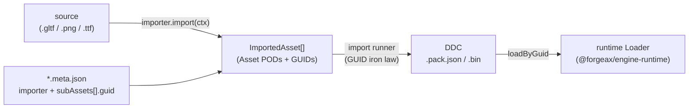

# @forgeax/engine-import

Build-time asset **import** runner + `ImporterRegistry` — the build-time half of
the engine's import/load split.

> [!IMPORTANT]
> **Build-time only.** This package never enters the player runtime bundle
> (AC-06). `@forgeax/engine-runtime` and `@forgeax/engine-app` do not depend on
> it. Its consumers are build tooling (the Vite pack plugin, the asset CLI).

## The DIP (dependency-inversion principle) shape

This is the engine's **third DIP instance** after RHI and Console. The engine
owns the contract (`Importer` / `ImportContext` / `ImportTransport` in
`@forgeax/engine-types`); concrete importers are injected by the host.

```ts
// Host assembly (vite.config.ts or build script)
import { pluginPack } from '@forgeax/engine-vite-plugin-pack';
import { gltfImporter } from '@forgeax/engine-gltf';
import { imageImporter } from '@forgeax/engine-image';

export default {
  plugins: [
    pluginPack({
      importers: [gltfImporter, imageImporter],
    }),
  ],
};
```

### Three iron laws (architecture invariants)

1. **GUID import-stable**. The `*.meta.json` sidecar pins every target GUID at
   declare time. Import only reproduces those GUIDs, never mints new ones.
2. **Lazy**. The runtime reads meta only to build a *catalog* (which GUIDs
   exist, with which `kind`). Only a real `loadByGuid(guid)` triggers import
   (when the DDC is absent) + load. No eager full-import on startup.
3. **One-way dependency**. The engine owns the `Importer` interface; concrete
   importers are injected. The engine never reverse-imports `gltfImporter` /
   `imageImporter` / etc.

## The import/load split



- An **`Importer`** (`{ key, import }`) turns one external source + its
  `*.meta.json` GUID declarations into in-memory `ImportedAsset[]` PODs. It is
  pure of disk write + GUID minting — it reads the GUIDs declared in the meta
  (the **GUID import-stable iron law**) and stamps them onto the PODs.
- The **import runner** (`runImport(meta, registry, fs)`) dispatches a sidecar
  by its top-level `importer` string key to the registered `Importer`,
  validates the produced GUID set against the declared set, and folds the
  result into a DDC `.pack.json` document. The reserved key **`importer:
  'shader'`** is skipped — shader sidecars are consumed by
  `@forgeax/engine-vite-plugin-shader`'s orthogonal transform pipeline.
- **`ImportTransport`** (interface in `@forgeax/engine-types`) bridges the
  build-time importer to the runtime: the shipped form wires `null` transport
  (pre-import at build time, DDC miss -> fail-fast `asset-not-imported`); the
  studio form wires an HTTP adapter (`POST /__import/:guid`) for lazy on-demand
  import.

## Injection shape

`ImporterRegistry` mirrors the runtime `LoaderRegistry` and the Console
`Registry`: `register(importer)` (fail-fast on a malformed importer, idempotent
on a repeated key) + `get(key)` (returns `undefined`, which the runner maps to a
structured `ImportError(code='importer-not-registered')`).

```ts
import { ImporterRegistry, runImport } from '@forgeax/engine-import';
import { readFile } from 'node:fs/promises';

const registry = new ImporterRegistry();
registry.register(gltfImporter);

const fs = {
  async readSource(path: string) {
    try {
      const buf = await readFile(path);
      return { ok: true, value: new Uint8Array(buf) };
    } catch (e) {
      return { ok: false, error: e };
    }
  },
};

const result = await runImport(
  { importer: 'gltf', source: 'assets/box.gltf', subAssets: [...] },
  registry,
  fs,
);
if (result.ok) {
  console.log('DDC .pack.json:', result.value.pack);
}
```

## Error model

`ImportErrorCode` is a closed 5-member union (exhaustive `switch (err.code)`,
no `default:`). `ImportError` carries the four-field structured surface
(`.code` / `.expected` / `.hint` / `.detail`); SSOT lives in
`@forgeax/engine-types`.

| code | trigger |
|:--|:--|
| `importer-not-registered` | `meta.importer` has no registered importer |
| `source-read-failed` | `meta.source` could not be read |
| `import-produced-no-assets` | importer produced nothing, or omitted a declared GUID |
| `guid-mismatch` | importer produced a GUID not declared in `meta.subAssets[]` |
| `import-internal-error` | importer threw; the runner wraps it |

## Dual-form transport (M4)

| Form | `ImportTransport` | DDC source | DDC miss behavior |
|:--|:--|:--|:--|
| **studio** (dev server) | HTTP adapter `POST /__import/:guid` | lazily imported on demand | `transport.fetchPack(guid)` -> import -> load |
| **shipped** (player bundle) | `undefined` (null transport) | build-time pre-import via `generateBundle` | `asset-not-imported` fail-fast (never downgrades to runtime import) |

The runtime load path is **identical** in both forms — `ddcLoad` has zero
branches on transport. The only difference is whether `transportOrFail` is
reached on DDC miss (studio: it calls the transport; shipped: it returns the
error immediately).
