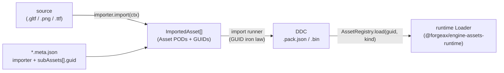
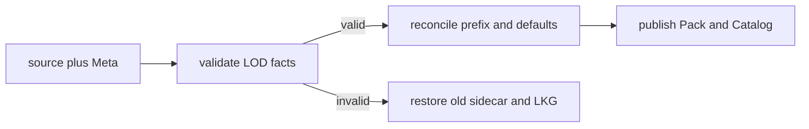

# @forgeax/engine-import

## Authoring and recovery index

## 灯光资产 producer 入口

三条最短入口：

1. `RectAreaLight`、`SpotLight` 与 `LightProbe` 由 render 的 ECS schema 创作，scene producer 只外化 `shared<T>` GUID。
2. `iesImporter` 只在 build-time 接受 LM-63 Type C `TILT=NONE`，输出固定 cooked `IesProfileAsset`；runtime 不解析 `.ies` 文本。
3. `SpotLight.cookie` 走现有 `TextureAsset`/image producer；不要建立 Cookie registry 或第二条采样路径。

producer 持有 authored/source authority，Pack 产出 published 记录，Catalog 是 admitted/current 的投影；失败只返回结构化 `import-failed` 并保留原 GUID，修复 producer 后按同 GUID 重试。`lastKnownGood` 只可预览，不能冒充 verified/current。

Extended-lighting imports keep the same source key across Rect, Spot modifier,
Probe, and recovery carriers. IES is a build-time Type C `TILT=NONE` producer;
Cookie uses the existing texture producer; Probe and Sky are not new asset
registries. A failed publish is a structured producer result, and runtime must
not parse source text, invent a cooked payload, or promote LKG to current.

ScriptablePack sources use the public `@forgeax/engine-import` producer bridge.
The output is the same Pack v2 durable payload used by ordinary importers. The
17 `SCRIPTABLE_PACK_ASSET_KINDS` are `mesh`, `material`, `scene`, `texture`,
`equirect`, `sampler`, `font`, `render-pipeline`, `tileset`, `video`,
`skeleton`, `skin`, `animation-clip`, `animation-graph`, `audio`, and
`particle-effect`, and `ies-profile`; all are loadable by GUID, while `refs`,
`artifacts`, `mediaType`, and `programFingerprint` remain producer facts.
Producer or dependency failures return `code`, `expected`, `hint`, and
`detail`; inspect the owning evidence, rebuild or cold-cook, and retry.

The import contract is [`schemas/asset-authority.schema.json`](../../schemas/asset-authority.schema.json). `ImporterRegistry` and `runImport` are the build-time owner for external source plus Meta; every writable multi-output declaration uses a stable `sourceKey`, while `sourceIndex` remains diagnostic evidence only.

| Need | Entry | Boundary |
|:--|:--|:--|
| Inspect producer evidence | Pack CLI `lookup` and `verify` JSON output | Read Catalog and receipt facts; do not parse messages |
| Rebuild | Registered importer through `runImport` | Write Pack/DDC output through the shared finalizer |
| Recover failed output | Fix source or Meta, then cold cook | Never return raw source as a runtime projection |
| Preview old output | Explicit Catalog last-known-good locator | Read-only preview; not current and not publishable |

The Importer owns neither DDC lifecycle nor Editor authoring writes. Editor writes go through its asset-authoring gateway, and runtime consumes the validated projection.

Imported materials use the host's registered material cooker before the complete
source package is published. `produceSourcePackage` accepts the same `cookers`
as Pack production; Vite forwards its existing registration in dev and build.
The host supplies `runImport` with the registry's `get`/`runDraft` interface,
keeping the shared browser import path free of the Node registry.
Import resolves each material's wire reference indices to GUIDs for the
cooker, then projects the result through the ordinary material output producer.
Parent, texture, sampler and coordinate data retain their identities. Shader
dependencies and native fingerprints participate in the source publication;
failure rejects the whole candidate. Import never loads a shader compiler itself.
Without a registered material cooker, an importer remains responsible for its
published payload; uncooked output is not evidence of ray-program readiness.

### ScriptablePack build generation

`buildScriptablePack()` accepts a ScriptablePack definition, resolves the
default/inherited values, and executes `build()` once for the current subject
identity. The result is a dynamic `sourceKey -> Asset` map; the bridge derives
`AssetGuid` values from `(subjectPackageId, sourceKey)` and sends the resulting
assets through the same registered output producers and Pack v2 finalizer used
by ordinary imports.

The same map also accepts explicit `PackCookSource` rows for custom kinds.
Their `execution: 'cooked'` and `source` fields dispatch through the existing
build-time NativeCooker registry; the closed ordinary Asset producer union is
unchanged. Cooked refs, artifacts and fingerprints participate in the same
worklist, reference validation and finalizer. Staged content reads retain the
custom author source instead of pretending its metadata is a runtime asset.

`buildScriptablePackWorklist()` is the internal clean-generation
fixed point. Subjects are evaluated in stable order, a forward `readByGuid()`
content miss waits for the subject that can materialize that GUID, and a pass
with no progress returns `pack-content-dependency-stalled`. Once all subjects
settle, the bridge validates references and incoming-reference deletions before
publication. A GUID written into a payload is only a reference dependency;
only `readByGuid()` creates a content dependency.

`produceScriptablePackProducts()` and
`materializePreparedScriptablePack()` adapt that result to the
existing DDC/Catalog/Pack v2 publication tuple. No parameter, parent, sourceKey,
or TypeScript execution contract crosses into the runtime asset reader.

Hosts that already discover output keys use `createScriptablePackProduction()`
for one build generation. `inspect(source)` evaluates its owner and actual
content dependencies once; `produce(source)` finalizes the retained product
without repeating generation or encoding. Source keys come from discovery,
not a second authored output manifest. The existing worklist remains the route
for sources whose output identities are not yet known.

The generation fixes definitions, parameters, source closures, external snapshots
and cookers. Start a new generation after any input change or terminal failure;
the returned products are borrowed read-only build data. Inspection does not
publish or activate plugin assets. The host still validates the complete GUID
reference/deletion graph and current source revision before atomic publication.
Local owner failures never fall through to an older external snapshot. Concurrent
content cycles return the same structured stalled-worklist failure as serial cycles.

Source path projection preserves nested imports: `assets/original/assets/ui.pack.ts`
and `assets/cloned/assets/ui.pack.ts` remain distinct in both development and build
publications. Re-projecting an already-relative path must preserve its first asset root.

Build-time asset **import** runner + `ImporterRegistry` — the build-time half of
the engine's import/load split.

> [!IMPORTANT]
> Filesystem import, DDC and native cooking remain build-time work. The browser
> entry exposes the shared data-production kernel and opt-in runtime Pack
> producer without filesystem, DDC, TypeScript or shader compiler dependencies.

### Runtime Pack production and durable content

`RuntimePackProducer` evaluates the delivered ScriptablePack definition and uses
the existing output producers, Pack identity and Catalog publication. Runtime
evaluation does not run offline staging, receipts or DDC orchestration. Its caller owns
one realm scope, native program host/import identities and actual domain validation.
Admission checks content without executing generators or installing plugins.
`inspect().imports` reports the Host-supported module specifiers and fixed
identities needed to prepare new code; it does not expose transport URLs.

| Operation | Authority and result |
|:--|:--|
| `prepareRuntimePackContent` / `admit` | Prepare ordinary assets, or admit a runtime-capable generator and its fixed program/dependency closure. Plugin sources retain the existing module/config lowering. |
| `prepareRuntimePackAnchor` | Project an existing `resolvePackParameterInheritance` result into one complete runtime generator, using its effective values as parameter defaults. Programs and fixed dependencies are retained. |
| `generate` / `withdraw` | Produce a complete parameter-instance output set, or withdraw its publication. GUIDs derive from instance packageId and sourceKey; consumer handles remain independently owned. |
| `snapshot` / `exportSource` / `restore` | Preserve original definitions, accepted instance inputs and reachable fixed dependency recipes. Restore re-admits into the current scope; it does not install plugins. |

Durable metadata is plain lossless JSON; binary leaves use owned Uint8/16/32 or
Float32 views. Pack's `copyPackData` rejects accessors, functions, sparse arrays,
subclasses and shared mutable storage without executing caller hooks. It preserves
view offsets and backing aliases while excluding unrelated backing bytes.

The `runtime-pack-source/2` snapshot adds an explicit little-endian binary table:
JSON paths identify typed views, and Base64 encodes each shared backing once.
Recovery checks kinds, alignment, ranges and complete table usage before replaying
the fixed dependency graph. Version 1 snapshots are rejected explicitly. Original
source and fixed recipes remain durable; cache entries remain disposable.

`admit` and `generate` return `RuntimePackPublicationReceipt`: identity, status,
publication evidence and Catalog rows. They do not copy the full source or mesh
into every operation result. Use `snapshot` or `exportSource` for original data.
App injects the actual consuming Registry for private candidate preparation.
Native Mesh publications reuse domain payloads for same-realm GUID loading;
`openPackage` encodes the ordinary mesh binary only when a transport reader asks
for it. Failed encoding can retry, concurrent encoding shares one promise, and
file readers still verify real artifact integrity. No temporary Registry or
encode/decode round trip is required for the owning Registry.

Input capture and the consuming Registry keep separate isolated data; first GUID
consumption creates a mutable copy without changing the retained version.
public registration still validates payloads. This implementation does not claim
zero copy or exactly one validation pass. Measure cold capture, warm generation,
GUID loading, explicit export and GPU completion separately. Successful program
loads are reused; failed delivery retries. Direct data needs no program host or
ServiceWorker. Authored shader programs still require build-time Cook.

Direct assets and generator outputs share the runtime plugin producer. Generated
PluginAssets retain their original module, config and inline tool declarations
from ordinary output production, together with the admitted parent program
closure. Publication uses the existing PluginAsset lowering and target-specific
tool projection. A cache entry with a different program closure is discarded;
recovery rebuilds from the saved parent and instance inputs.

Runtime instances reference an admitted generator anchor, never another live
instance. Source producers resolve authoring inheritance before preparing the
anchor. Its existing parameter defaults hold the effective base values; no second
parameter table or runtime parent chain is needed. Preparation verifies the root
identity, parameter contract and complete effective value set, using the existing
metadata projection to serialize branded GUID defaults. Copy an instance with a
new packageId and the same anchor and sparse values; omitting an override restores
that anchor's default. Saved anchors recover without the original authoring chain.

External dependencies use `assetSource.retain(versions, signal)` when assembled
with an asset owner. It captures exact publication bytes and the complete sibling
and reference closure once; unused domain payloads decode lazily. App delegates
retention to assets-runtime. A mutable transport must be captured while its
version is available. The portable `exportSource(versions, signal)` boundary
remains available to external source owners and uses the same fixed recipes. `producer.exportSource(versions)` uses the same selection. Authored recipes retain
their generation inputs. Delivered recipes retain the original Pack, complete
sibling set, raw encoded artifact bytes and portable programs. `await createFixedRuntimePackSnapshot(...)`
captures its inputs before yielding and uses native SHA-256 to join these into
the same dependency graph without inventing a packageId or
re-authoring cooked assets. Only retained runtime references require recovery;
historical content-read evidence remains intact without requiring the original
authoring files. Existing references must match the saved publication through the
entire closure, including publication generation.
Within one admission, shared dependency recipes rebuild once. Later admissions
can reuse fixed data dependencies already held by committed Packs when every
dependency, sibling publication and external evidence remains current. Code-bearing
recipes retain their normal program validation path; withdrawing all holders
removes this reuse. Cold capture and retained-dependency generation are distinct costs.
Fixed plugin publications retain program and tool attachments grouped by the
existing build target in `executions`. The producer's optional `target` selects
which group's Host imports to check; other groups remain verified durable data.
This is not a no-execution restore mode: generator recipes, including dependencies
of a fixed root, still replay through the normal generation path.
Runtime-authored plugin sources accept an inline `toolContract` with the existing
`ToolCommandContract` shape. `projectRuntimePackTools(content)` derives native
contracts from that source, resolving every executor/export against the submitted
program closure. Missing or ambiguous programs and invalid full contracts fail
before publication; module-reference contracts must first be prepared as inline
data. Snapshots retain declarations only in the original source, without a second
durable tools table. Admission and recovery never evaluate contract or executor code.

`admit`, `generate` and `restore` accept a caller `AbortSignal`. Cancellation
fences publication and prevents starting the next recovery recipe; it does not
interrupt already executing JavaScript. Cancelling an admission does not withdraw
another caller's accepted content. Recovery commits each Pack independently, so
content already committed before cancellation remains admitted and inspectable.

A `RuntimePackProgram.artifact` is the verified JavaScript execution authority.
Optional `source` preserves author text for editing; runtime checks its module
structure, not TypeScript compilation equivalence. DevKit's
`prepareRuntimePackProgram` performs real TS conversion and retains its original.
Native JavaScript uses `preparePackProgram` directly and needs no compiler.
Saved JS artifacts plus their fixed dependencies support compiler-free recovery.

The low-level producer does not provide a storage backend, automatically rebind
World/Renderer resources, or own plugin installation. App assembly projects its
Catalog and plugin definitions into the existing consumers. Host/View integration
and delivery qualification are separate from these producer contracts.

### Source-package failure propagation

`produceSourcePackage` preserves the original `ImportError` for module loading,
source reads and conversion failures. GUID closure errors describe an actual
missing, extra or duplicate output; they must not replace a failed importer with
an empty output list. The build adapter carries `code`, `expected`, `hint` and
`detail` into both the thrown error and its printable diagnostic. In particular,
`detail.loadError` names a missing module/WASM carrier before any Pack is emitted.

## The DIP (dependency-inversion principle) shape

This is the engine's **third DIP instance** after RHI and Console. The engine
owns the contract (`Importer` / `ImportContext` / `ImportTransport` in
`@forgeax/engine-types`); concrete importers are injected by the host.

```ts
// Host assembly (vite.config.ts or build script)
import { pluginPack } from '@forgeax/engine-vite-plugin-pack';
import { gltfImporter } from '@forgeax/engine-gltf';
import { imageImporter } from '@forgeax/engine-image/image-importer';

export default {
  plugins: [
    pluginPack({
      importers: [gltfImporter, imageImporter],
    }),
  ],
};
```

### Three iron laws (architecture invariants)

1. **GUID import-stable**. The `*.meta.json` sidecar pins every target GUID at
   declare time. Import only reproduces those GUIDs, never mints new ones.
2. **Lazy**. The runtime reads meta only to build a *catalog* (which GUIDs
   exist, with which `kind`). Only a real `AssetRegistry.load(guid, kind)` triggers import
   (when the DDC is absent) + load. No eager full-import on startup.
3. **One-way dependency**. The engine owns the `Importer` interface; concrete
   importers are injected. The engine never reverse-imports `gltfImporter` /
   `imageImporter` / etc.

## The import/load split


```mermaid
flowchart LR
  src["source\n(.gltf / .png / .ttf)"] -->|"importer.import(ctx)"| ia["ImportedAsset[]\n(Asset PODs + GUIDs)"]
  meta["*.meta.json\nimporter + subAssets[].guid"] --> ia
  ia -->|"import runner\n(GUID iron law)"| ddc["DDC\n.pack.json / .bin"]
  ddc -->|"AssetRegistry.load(guid, kind)"| runtime["runtime Loader\n(@forgeax/engine-assets-runtime)"]
```

- An **`Importer`** (`{ key, import }`) turns one external source + its
  `*.meta.json` GUID declarations into in-memory `ImportedAsset[]` PODs. It is
  pure of disk write + GUID minting — it reads the GUIDs declared in the meta
  (the **GUID import-stable iron law**) and stamps them onto the PODs.
- The **import runner** (`runImport(meta, registry, fs)`) dispatches a sidecar
  by its top-level `importer` string key to the registered `Importer`,
  validates the produced GUID set against the declared set, and folds the
  result into a DDC `.pack.json` document. The reserved key **`importer:
  'shader'`** is skipped — shader sidecars are consumed by
  `@forgeax/engine-vite-plugin-shader`'s orthogonal transform pipeline.
- **`ImportTransport`** (interface in `@forgeax/engine-types`) bridges the
  build-time importer to the runtime: the shipped form wires `null` transport
  (pre-import at build time, DDC miss -> fail-fast `asset-not-imported`); the
  studio form wires an HTTP adapter (`POST /__import/:guid`) for lazy on-demand
  import.

## Injection shape

### ScriptablePack build bridge

`buildScriptablePack` decorates a host-provided Asset snapshot source with the ordinary `AssetReader`. Each GUID is fixed to one generation/digest and cloned for the current Build. The adapter validates the exact output-key/kind closure, stamps descriptor identity, dispatches each Asset to the reusable `AssetOutputProducerRegistry`, and derives external usage from actual reads plus serialized refs. Scene output uses the source definition's neutral `sceneComponents` schema; it never consults a global ECS component registry.

| Derived usage | Input fingerprint | Runtime ref |
|:--|:--|:--|
| `content` | Asset generation and digest | No |
| `reference` | GUID only | Yes |
| `both` | Asset generation and digest | Yes |

Domain producers return structured `ImportError`; the generic bridge contains no per-kind switch. `createStandardAssetOutputProducerRegistry(sceneComponents)` composes the production Scene, Material, and Mesh owners with the definition-bound scene schema. Scene refs use the ECS externalization kernel shared with runtime save, Material refs cover parent/texture/sampler GUIDs, and Mesh emits the versioned binary artifact. The fingerprint covers canonical Meta, the definition-bound scene schema, the recursive source closure, observed external evidence, authoring contract version, and registered producer versions.

Authored, staged and file-backed snapshots share `scriptable-pack-fingerprint/3`.
A binary leaf contains its type, view byte length and SHA-256 of the selected
bytes; ordered metadata hashes those leaves without concatenating large buffers.
Synchronous and native asynchronous hashing emit identical digests. Only one
immutable candidate scope may reuse leaf hashes. The version change intentionally
invalidates prior derived fingerprints; GUIDs and mesh wire formats are unchanged.
Native Mesh output identity hashes canonical attributes, indices, normalized bounds
and other domain fields. Interleaved vertices are a derived projection, checked
byte-for-byte before publication, and do not require a duplicate content hash.
Actual encoded artifacts retain independent byte-integrity SHA-256 digests.

`createScriptablePackStagedAssetSnapshotSource()` owns clean-build content reads. It resolves a GUID to its local source owner, lazily builds that owner inside one fixed generation, memoizes private clones and digests, and reports `pack-content-dependency-stalled` for a cycle without consulting an older fallback generation. A fallback is only an explicit prebuilt authority for GUIDs with no local owner.

`createStandardAssetOutputProducerRegistry(sceneComponents)` registers the production
Material, Mesh, and Scene producers. Material output derives
parent/texture/sampler refs. Material texture references serialize as
`{ texture: refsIndex, sampler?: refsIndex }`, including GUID string shorthand;
bare numeric values remain scalars in children without a local parameter schema.
Mesh output derives default-material refs and emits
the `mesh-binary/5` body; Scene output uses the definition-bound neutral schema
through the shared ECS externalization contract. A specialized host may instead
register only the admitted kinds:

```ts
const outputs = new AssetOutputProducerRegistry();
outputs.register(materialAssetOutputProducer);
outputs.register(meshAssetOutputProducer);
```

### Mesh binary producer contract

The Mesh producer calls [`packMeshBin`](src/mesh-bin.ts), which delegates
projection facts to geometry and records one stable digest, mask, stride,
cardinality, and payload length in the artifact header. Material defaults are
references into the producer refs table; GUID strings are not duplicated in the
binary metadata. V5 writes morph targets as contiguous float32 streams; only
target/channel masks and weights remain in JSON. Published v4 artifacts remain
readable. `packMeshBin` is the encoder; the former version-suffixed export is removed.

> [!IMPORTANT]
> A producer Result error contains `subject`, `sourceKey`, `expected`,
> `actual`, and a re-cook recovery hint. Failed validation returns no artifact,
> so the importer cannot publish a partial mesh product. v2/v3 mesh binaries
> are not compatibility inputs.

For prebuilt ordinary Pack dependencies, use
`createScriptablePackFileAssetSnapshotSource({ assetRoots })` from the same
package. It recursively indexes validated `.pack.json` assets by GUID and
returns private `ScriptablePackAssetSnapshot` clones with deterministic
generation/digest evidence; missing, malformed, unreadable, and colliding
inputs remain structured `Result` errors.

At the low-level `buildScriptablePack` boundary, `assetSource` is optional only
when `build` never calls `reader.readByGuid`. The first attempted content read
without a source returns structured `asset-not-found`; no empty snapshot or
stale content is invented. Production Vite hosts provide the staged generation
source described above.

`ImporterRegistry` mirrors the runtime `LoaderRegistry` and the Console
`Registry`: `register(importer)` (fail-fast on a malformed importer, idempotent
on a repeated key) + `get(key)` (returns `undefined`, which the runner maps to a
structured `ImportError(code='importer-not-registered')`).

```ts
import { ImporterRegistry, runImport } from '@forgeax/engine-import';
import { readFile } from 'node:fs/promises';

const registry = new ImporterRegistry();
registry.register(gltfImporter);

const fs = {
  async readSource(path: string) {
    try {
      const buf = await readFile(path);
      return { ok: true, value: new Uint8Array(buf) };
    } catch (e) {
      return { ok: false, error: e };
    }
  },
};

const result = await runImport(
  { importer: 'gltf', source: 'assets/box.gltf', subAssets: [...] },
  registry,
  fs,
);
if (result.ok) {
  console.log('DDC .pack.json:', result.value.pack);
}
```

## Error model

`ImportErrorCode` is a closed 5-member union (exhaustive `switch (err.code)`,
no `default:`). `ImportError` carries the four-field structured surface
(`.code` / `.expected` / `.hint` / `.detail`); SSOT lives in
`@forgeax/engine-types`.

| code | trigger |
|:--|:--|
| `importer-not-registered` | `meta.importer` has no registered importer |
| `source-read-failed` | `meta.source` could not be read |
| `import-produced-no-assets` | importer produced nothing, or omitted a declared GUID |
| `guid-mismatch` | importer produced a GUID not declared in `meta.subAssets[]` |
| `import-internal-error` | importer conversion or finalization failed; the runner wraps it in the existing structured Result. Finalization/digest failures carry a `detail.reason` prefixed with `finalization/digest`, and no CookProduct or Pack is returned for the failed attempt |

## Dual-form transport (M4)

| Form | `ImportTransport` | DDC source | DDC miss behavior |
|:--|:--|:--|:--|
| **studio** (dev server) | HTTP adapter `POST /__import/:guid` | lazily imported on demand | `transport.fetchPack(guid)` -> import -> load |
| **shipped** (player bundle) | `undefined` (null transport) | build-time pre-import via `generateBundle` | `asset-not-imported` fail-fast (never downgrades to runtime import) |

The runtime load path is **identical** in both forms — `ddcLoad` has zero
branches on transport. The only difference is whether `transportOrFail` is
reached on DDC miss (studio: it calls the transport; shipped: it returns the
error immediately).

## Indexed source-package lifecycle

Use this sequence when an import or Pack consumer reports a missing product:

1. **Inspect** the source Meta, declared GUID closure, Catalog row, DDC head,
   and producer receipt. Read the closed error union's `code` and `detail`.
2. **Repair** the source, Meta, or registered importer named by the detail.
   `ImporterRegistry` owns dispatch, while the source plus Meta remains the
   author authority.
3. **Rebuild** when the existing DDC entry can be replaced safely; **cold-cook**
   when integrity, receipt, or lifecycle state says the derived entry is
   invalid. Both paths use `runImport` and the shared finalizer.
4. **Verify** GUID closure, receipt freshness, DDC integrity, Pack artifacts,
   and the projected Catalog row.
5. **Retry** the same GUID after verification. Never parse an error message or
   turn an unverified source file into a runtime payload.

`runImport` keeps conversion and finalization failures inside its structured
Result boundary. A digest-capability refusal during CookProduct finalization
does not publish a partial product; repair that capability and retry the same
Meta/GUID through the same `ImporterRegistry`.

### Source-format LOD adapters

Format adapters project producer facts into the same `MeshAsset.lods` and Pack
closure. The adapter owns interpretation; the sidecar owns retained author
facts and the importer only produces validated derived output.

| Source fact | Normalized result | Required closure |
|:--|:--|:--|
| glTF `MSFT_lod` node relation | ordered root and lower mesh GUIDs | root `refs[]` contains every lower mesh |
| FBX `FbxLODGroup` level relation | ordered root and lower mesh GUIDs | root `refs[]` contains every lower mesh |
| sidecar `sourceOverrides.mesh.lods` | retained `screenCoverage` and source keys | every GUID resolves in the same package |

On first import the helper derives lower-level coverage with

$$c_i = round6(0.5 \times 0.4^{i-1})$$

for `i = 1 .. n`, where `n` is the number of lower levels. This yields
`0.5` for two total LODs, `0.5, 0.2` for three, and `0.5, 0.2, 0.08`
for four. Existing legal sidecar values always win; only a newly appended
suffix receives defaults. A changed middle source key or mesh GUID is rejected
and the previous sidecar plus last-known-good product remains authoritative.

The import package stops at build-time source conversion and product
publication. It does not write authoring state, own Editor operations, or add
runtime transport branches. A dev `ImportTransport` is an explicit host
adapter; a shipped bundle must carry its build-time product and keeps
`asset-not-imported` fail-fast semantics.

## Mesh LOD normalization and recovery

The shared helper in `src/mesh-lod.ts` owns validation, default coverage, and
prefix-stable reimport. For `n` lower levels, first-import defaults are derived
once with:

$$c_i = round6(0.5 * 0.4^{i-1}), 1 <= i <= n$$

Thus two levels produce `0.5`, three produce `0.5, 0.2`, and four produce
`0.5, 0.2, 0.08`. Existing legal sidecar values win; newly appended suffix
levels receive defaults. A middle sourceKey or GUID change is a structured
topology/authority error, so the previous sidecar and LKG remain intact.


```mermaid
flowchart LR
  A["source plus Meta"] --> B["validate LOD facts"]
  B -->|"valid"| C["reconcile prefix and defaults"]
  C --> D["publish Pack and Catalog"]
  B -->|"invalid"| E["restore old sidecar and LKG"]
```

## Lightmap UV validation

`validateLightmapUvs(levels, uvSet = 'uv1')` checks the lightmap UV set of a
mesh that will receive baked lighting, LOD0 first. It is the prerequisite gate
for a baker; no baker consumes it yet. Every level must carry `uvSet`, every UV
must be finite and inside `[0, 1]`, and LOD0 charts must not overlap (shared
edges and vertices are allowed).

The result chooses lightmap storage. `shared` means every lower LOD samples the
LOD0 lightmap, because each lower-LOD triangle (its vertices, edge midpoints,
and centroid) lies inside LOD0 chart coverage. Otherwise the result is
`per-lod`, and each level is baked on its own. It carries a
`lod-lightmap-uv-mismatch` diagnostic naming the first drifting level and
triangle, and each level must then be overlap-free on its own. Hard failures use
the closed `LightmapUvErrorCode` union: `lightmap-uv-missing`,
`lightmap-uv-out-of-range`, and `lightmap-uv-overlap`. Its `detail` always names
`lodIndex` and `uvSet`.

## Plugin output producer

`pluginAssetOutputProducer` validates module/config source, resolves a portable program locator and lowers `$asset` configuration markers into GUID strings plus derived refs. It emits only a definition; compilation and native activation stay with DevKit and Cordis. Bootstrap source discovery and ordinary cooking must agree on the definition before publication.

## Optional mesh distance-field cooking

`createMeshDistanceFieldCooker()` registers the explicit `mesh-distance-field`
operation with the existing `NativeCookerRegistry`. Input is the source mesh GUID,
indexed positions and one explicit recipe: geometric `resolution`/`twoSided`, or
`policy: 'sampled-visibility'` with source-unit `voxelSize` and one
`triangleSidedness` flag per triangle. The draft keeps that GUID and one
`distance-field.bin` artifact; its fingerprint includes geometry, settings and
producer version. There is no second authored SDF asset or registry.

The build owner invokes the usual transaction/publication path and owns the
artifact alongside its source mesh. Failed generation/publication retains the
previous draft through `lastKnownGood`; retry commits a new generation. Consumers
use Geometry's checked decoder with the expected mesh digest. This milestone
provides the adapter, not automatic Catalog publication, streaming or Renderer
subscription; registering it does not change ordinary mesh imports.


## Optional mesh card layout cooking

`createMeshCardCooker()` registers `mesh-card-layout` in the existing
`NativeCookerRegistry`. It consumes indexed geometry under the original mesh
GUID and publishes `mesh-cards.json`. Geometry digest, algorithm version,
sampling resolution, card budget and two-sided policy determine the input
fingerprint. Material capture and its texture revision remain separate from
this geometry layout. Rejected builds or publication preserve the existing
transaction's lastKnownGood generation; retry uses the same GUID. There is no
new authored asset kind or automatic per-frame construction.
