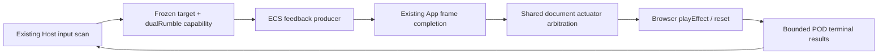

# ROI 20: bounded Host gamepad feedback

> [!WARNING]
> The user explicitly waived physical-controller acceptance on 2026-10-05 and
> authorized admin merge after all other work passes. No physical vibration,
> controller photograph/video, real unplug, mechanical amplitude or latency is
> claimed. Hardware remains unverified; it is no longer a delivery prerequisite.
> Every other required gate remains in force. Gyro/accelerometer remain outside
> this change.

## Source and behavior

Implementation baseline: `origin/main` at
`2e2d9f1aa9ff76bfc6e3191a0132c5c896b88bdf` (audio bus/streaming already merged).
Integration baseline refreshed to `9badab8251866bc7415b501306d16fde343317f1` before final software verification.
PR #3651 independently changes input lifecycle; this work uses the current main
owner and must accommodate any subsequently merged changes. The primary root
stays on `main`, including its unrelated dirty files.

Before this change, frozen gamepad input exposed buttons/axes and connectivity;
gameplay had no managed output. After this change, an Update system gets a target
from the same scan and enqueues `play`/`stop` on the `GamepadFeedback` resource.
App transports the ordered POD batch through its accepted completion message,
and Host input drives the actuator. The next admitted input sample returns results.
See the [author contract](../../README.md#gamepad-feedback) and
[App ownership](../../../app/README.md#host-gamepad-feedback).



| Decision | Reason and boundary |
|:--|:--|
| Input owns the public contract | Reuses input acquisition, target facts and resource lifetime. No HapticsWorld, media bus, renderer change or new package. |
| Document-scoped Host arbitration | Apps see the same physical actuator. Latest valid play owns the effect; a foreign stop is busy and foreign disposal does not stop it. |
| Generation and attachment targets | Slot reuse and owner recovery are distinct from device description. The existing scan plus connection events derive identity; there is no independent device polling. |
| Closed terminal union | Source is [gamepad-feedback.ts](../../src/gamepad-feedback.ts); ordered terminals preserve supersession, reject and timeout. No mutable controller methods appear in InputSnapshot. |
| Reserve reset capacity | 32 native calls globally, 8 per connection; plays leave capacity for owner cleanup. A never-settling Promise continues consuming native capacity after logical timeout. |
| No waveform/mixing graph | Game code maps shooting/damage/UI to finite parameters. This first route supports dual-rumble only. |
| Logical preemption vs native result | Replacement reports logical supersession immediately. Rejection on the replacing command remains visible; neither status proves mechanical output. |
| Hidden and blur | Hidden and the existing input clear/blur boundary revoke old attachment targets. The browser may reject hidden-page reset; that is a lifecycle diagnostic. Visible does not replay. |

## Fixed reference analysis

| Source, inspected revision | Relevant evidence | ForgeaX choice |
|:--|:--|:--|
| [W3C Gamepad Working Draft, 2025-07-10](https://www.w3.org/TR/2025/WD-gamepad-20250710/#gamepadhapticactuator-interface), latest published page rechecked 2026-10-05 | `effects`, finite parameters, native complete/preempted and reset; hidden-page calls can reject, and visibility handling stops effects. It remains a draft. | Runtime probe; POD rejection; explicit hidden revocation; no browser compatibility promise without hardware. |
| [Godot Input, `ed1daf0bf001b61586d9930840f2f1394092c079`](https://github.com/godotengine/godot/blob/ed1daf0bf001b61586d9930840f2f1394092c079/core/input/input.cpp#L1292) | Validates weak/strong magnitudes and writes per-device vibration with duration/timestamp; stop writes zero parameters. | Finite [0,1] amplitudes, explicit milliseconds and command identity. Does not infer browser support from native Godot. |
| UE `71fe36aac5a8df5ccd66c763ffc902b29b6a9c43`, PlayerController.cpp dynamic feedback implementation | Start/update/stop refer to effect handles; Stop removes only its action handle. Inspected locally, private implementation is not reproduced here. | Owner-scoped cancellation; no PlayerController or latent action layer. |
| [Three.js r184, `d3b629c0c2097cec664ad16369bb6eae3b10e335`](https://github.com/mrdoob/three.js/blob/d3b629c0c2097cec664ad16369bb6eae3b10e335/examples/webxr_xr_haptics.html) | Checks XR hapticActuators before pulse. | Keep capability probing; ordinary gamepad dual-rumble remains separate from XR pulse. |

## Verification and evidence

| Evidence | Status / exact boundary |
|:--|:--|
| Input unit suite | Full owning-package suite: 49 files / 384 tests passed, including headless initialization, oversized-batch rejection and lifecycle diagnostic retention under full command capacity. The last case was confirmed red before repair. Native actuator is a test double. |
| App unit suite | 80 files: 78 passed / 2 failed; 356 tests passed / 3 failed / 2 skipped. Three TypeScript runtime Pack/tool child-process timeouts remain red under unchanged 10/15-second bounds; isolated runtime Pack reproduction also fails. Diagnostic without the gate deadline exits successfully in 12.63 seconds (2.03 user / 0.24 system seconds), so successful output is not a gate pass. Node 22.23.2 reproduction retained the Pack failures (2 failed / 4 passed across Pack/tools), so switching Node major did not resolve them. |
| Focused App ownership/protocol suite | 5 files / 15 tests passed, including real App canvas construction with a renderer double, frame credit, input sample, Worker stop and World swap. |
| Actual DOM + dedicated browser Worker | 2 tests passed in headless Chromium with GPU disabled. Real DOM Input owner, module Worker and structured-clone transport; actuator is injected. Actual browser no-device scan is separate. |
| App + actual Engine Worker | Focused Linux WebGPU run [37308602940](https://github.com/ForgeaX-Games/forgeax-engine/actions/runs/37308602940) passed all 3 cases at code revision `04f7bdb7b`. Local and actual Engine Worker each completed at least 60 frames. Native actuator remains a double. Extended performance evidence is checked on the final revision. |
| Build / typecheck | `pnpm build:engine`, Input `tsc -b` and App `tsc -b` completed successfully. Fresh worktree WASM and private assets were materialized from the canonical owners. |
| Full local browser/Dawn/hello/learn roster | Required, pending shared GPU access. No roster, backend, frame budget, pixel threshold or falsifier changed. |
| Physical platform matrix | User waived hardware acceptance; no controller available. USB/Bluetooth, strong/weak/mixed, silent control, cancel/replace, physical reconnect, hidden/blur, disposal and two Apps all unverified mechanically. |
| RHI Debug | No Renderer/RHI implementation changed. A GPU tape would not establish physical haptics; no empty rendering evidence is fabricated. |
| English / lint / test-layout | Biome checked 45 relevant source files clean; English-only gate checked 41 tracked guidance files clean; test-layout gate validated 3527 files. |

The initial full input run failed before dependency builds were ready. A subsequent
run caught a transient parameter mismatch during refactoring; repaired and rerun.
App's existing headless canvas tests caught a missing-DOM initialization path in
the new adapter; it now uses an isolated headless boundary without fabricated DOM
objects. These failures remain in the local logs rather than being counted as passes.

### Contract performance

Frozen method: Bun 1.3.14, Darwin arm64; 3 rounds, 100 warm-up samples then
1000 measured samples per mode/target count. Target counts 1/2/4 are synthetic
contract load, not connected physical devices. Event mode enqueues once per 60
samples; burst always enqueues 32 commands. Timing includes Host observation,
producer work, both structuredClone directions, native-double dispatch/settlement,
result adoption and polling. The p95 ceiling is **1 ms**, set before execution.
Zero-demand native call count and pending count must remain zero. Capacity
rejections remain part of the sample; the native cap is not removed to manufacture
throughput. This is a serial transport model, not an actual App frame measurement.

| Attempt | Result | Interpretation |
|:--|:--|:--|
| [Attempt 1 JSON](contract-performance-attempt1.json) / [all samples CSV](contract-performance-attempt1.csv) | Idle/event worst p95 ~0.013 ms; 2-target and 4-target burst round 3 failed at 2.168 and 7.352 ms. Pending high water at most 28, pending after settlement 0. | Preserved failure. Concurrent compilation/test activity was present; contention is an inference, not an established root cause. |
| [Attempt 2 JSON](contract-performance-attempt2.json) / [all samples CSV](contract-performance-attempt2.csv) | Same workload and 1 ms ceiling; all 27 groups passed, worst p95 0.831 ms. | A successful rerun does not erase attempt 1 or establish a performance fix. Hardware and full App frame impact remain unverified. |
| [Attempt 3 JSON](contract-performance-attempt3.json) / [all samples CSV](contract-performance-attempt3.csv) | Final lifecycle-retention code, unchanged workload and ceiling; worst p95 1.723 ms, with failed groups preserved. | Preserved final-code checkpoint failure. No lower burst, removed async work or relaxed execution budget. |
| [Attempt 4 JSON](contract-performance-attempt4.json) / [all samples CSV](contract-performance-attempt4.csv) | Same 27 groups passed; worst p95 0.366 ms after removing the per-command active-connection temporary arrays. Pending high water at most 28; idle native calls and settled pending remain zero. | The code removes avoidable allocation. This is a current contract-load pass, not proof that allocation caused every prior outlier; hardware and full App frame measurements remain distinct. |

Reproduce:

```sh
bun packages/input/scripts/benchmark-feedback.ts /tmp/gamepad-feedback-performance
pnpm --filter @forgeax/engine-input exec vitest run --maxWorkers=1
pnpm --filter @forgeax/engine-app exec vitest run src/__tests__ --maxWorkers=1
pnpm exec vitest run --config config/vitest.browser.config.ts packages/input/src/__tests__/gamepad-feedback.browser.test.ts packages/app/__tests__/gamepad-feedback.browser.test.ts
```

Heap deltas in the raw report are uncollected churn, not retained allocation or
leak evidence. Native Promise resolve and API dispatch timings do not measure
mechanical onset, stop time or force. No physical throughput or quality claim is
supported by these reports.

### Bundle size

Input main entry measured **16132 B gzip**, compared with the previous feature
surface's documented 12069 B. The explicit dual-rumble producer and Host lifecycle
increase the API's byte cost. The registry declares a new 17600 B byte ceiling
(about 10% headroom), anchored here, for this added capability. The 1 ms execution
budget, unchanged 32-command burst, all native lifetime cases and rendering gates
remain unchanged. Byte-budget adjustment does not turn physical/performance
acceptance green.

The first extended App performance probe failed in both realms because the
load command's `kind` overwrote the observation discriminator during object
spread. The [red checkpoint](app-performance-probe-red.txt) is preserved; the
observation now sets its discriminator after the payload. The initial ordered
feedback and 60 completed frames had passed before that probe failure.

### Actual App software performance method

The same App/ECS browser probe runs 1/2/4 synthetic target loads through local
Host and actual Engine Worker with a real WebGPU Renderer. Each idle/event/burst
group records 10 warm-up Update samples followed by 60 frame intervals and
producer CPU samples. Event load fires once per 60 Updates; burst submits 32
commands each Update. All four synthetic targets stay connected during this
probe, so load target count does not imply a different Host scan roster.
`ROI20_APP_PERFORMANCE` logs preserve every measured interval and producer sample,
p50/p95, startup-to-first-native-call timeline, completed frames, native pending
high water and zero-demand call counts. Frame intervals include App/Renderer
cadence; producer CPU excludes Host input/dispatch and is not total frame CPU.
These are software diagnostics under the existing browser deadline, separate
from the frozen 1 ms transport budget above. Native doubles do not establish
physical onset/stop, amplitude or controller throughput. Retained native pending
must return to zero; uncollected heap churn is not leak evidence.

## Remaining acceptance

- [ ] Hardware acceptance waived by the user; remains unverified: at least one real controller/browser/connection combination with recognizable
  strong, weak and mixed effects, silent control, cancel and replacement recording.
- [x] Local Host and true Engine Worker contract execution (focused Linux WebGPU).
- [ ] Hardware acceptance waived by the user; remains unverified: real unplug/replug including same slot,
  hidden/visible and blur, owner disposal/rebuild and two-instance physical behavior.
- [ ] Cold first-play, native/API timeline, bounded pending/memory baseline, full
  App frame impact, physical observation with instrument resolution described.
- [ ] Final exact-head required CI green, full roster local evidence and admin merge.
- [ ] Remote main reaches merge SHA; separate post-merge CI; audit haptic-only update;
  clean worktree and merged-branch cleanup.

The audit may describe the implemented haptic route after delivery, with physical
platform coverage explicitly unverified. It must not claim gyro/accelerometer or
mechanical acceptance.

## Current delivery receipt

Draft PR: [#3665](https://github.com/ForgeaX-Games/forgeax-engine/pull/3665).
The first CI head was rejected by the root-docs policy; evidence now lives with
Input, and `check-root-docs.mjs` passes. The next head passed `ci-core` and shared
input production while full GPU/coverage jobs continued. Its external Sensitive
Scan returned failure with no GitHub annotations; the linked DevOps page was
inaccessible from this environment. Final-head CI must be rechecked after the
lifecycle retention fix. Admin merge is authorized by the user after the remaining software gates pass.

At 2026-10-05 18:36 CST, the shared checkout's `origin` was observed pointing to
`forgeax-view`; root still remained on `main` with the same unrelated dirty files.
Further publication/query uses the explicit Engine URL/repository rather than
changing shared remote configuration. The physical GPU request remained queued
behind other sessions; no other gate was cancelled.

## Software acceptance revision

On 2026-10-05 the user waived real-controller acceptance and authorized admin
merge after the remaining work. The first complete CI run on `5788ddba0` exposed
two test-fixture defects: the App bootstrap used the nonexistent `Transform.posZ`
field, and consolidated Input tests still expected twelve listeners after three
Host haptic listeners were introduced. The bootstrap now uses `pos: [0, 0, 4]`;
the listener test retains exact counts and adds ten attach/detach cycles ending
at zero listeners. The original red result is [preserved](listener-coverage-red.txt).
The complete Input suite passes all 384 tests. App's three CI unit shards passed
on the prior head; contended local Pack timeouts remain historical failures.

The same CI run separately failed a multithread confidence interval, a transform
gizmo process deadline, an SDK ready-frame deadline and a cancelled Dawn lane.
They require final-head success; this change does not relax their bounds. The
SDK build aggregate failed because its project consumer failed, rather than
because SDK packaging reported a separate defect.

Live GitHub rules were queried: the Protect ruleset requires 21 status contexts;
the Sensitive Scan ruleset is disabled. The external scan failure has zero
annotations and no accessible detailed report. It remains disclosed but is not
a required context. No repository rules or required checks were modified.
