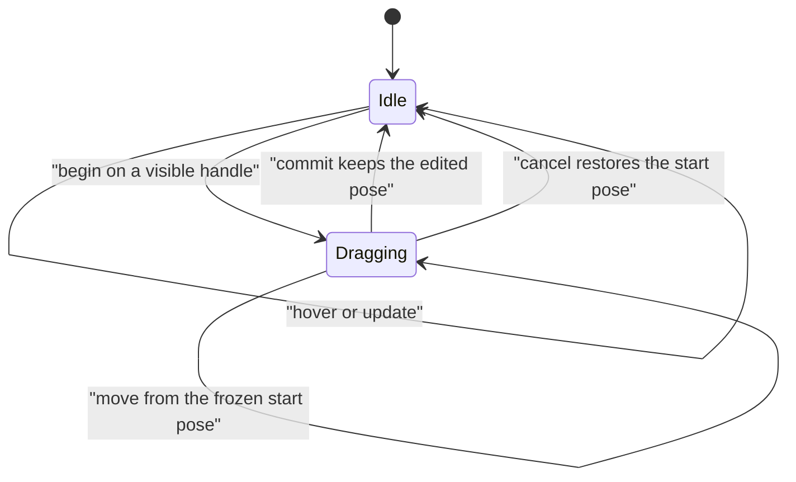

# @forgeax/engine-interaction

A realm-neutral transform gizmo edits one Scene `Transform` through constrained
pointer drags. `@forgeax/engine/interaction` is the public SDK entry. The World
remains the authored transform authority; the host owns selection, DOM pointer
capture, keyboard shortcuts and undo history.

```ts
import { TransformGizmo, createGizmoPresentation } from '@forgeax/engine/interaction';
import { propagateTransforms } from '@forgeax/engine/scene';

const gizmo = new TransformGizmo(world, { mode: 'translate', space: 'world' });
gizmo.attach(object);
const presentation = createGizmoPresentation(gizmo);

// Before presentation and pointer queries; camera and object share this World.
propagateTransforms(world).unwrap();
gizmo.update(camera, canvas.width, canvas.height);
presentation.sync();
propagateTransforms(world).unwrap();

// Host converts CSS coordinates to continuous physical canvas pixels.
gizmo.hover(x, y);
if (gizmo.begin(x, y)) { /* host acquires pointer capture */ }
gizmo.move(x, y);
gizmo.commit();             // host releases pointer capture
gizmo.cancel();             // restore the pose saved at begin
presentation.dispose();    // despawn handles and release their shared assets
```

## Interaction contract

| Mode | Handles | Constraint | Snap unit |
|:--|:--|:--|:--|
| `translate` | X, Y, Z; XY, YZ, XZ; XYZ | One axis, one plane, or the camera plane | World units along the selected basis, relative to drag start |
| `rotate` | X, Y, Z rings | Signed, continuous angle in the axis plane | Radians relative to drag start |
| `scale` | X, Y, Z; XYZ | Local axes or uniform scale; target scale does not size the helper | Authored scale units |

`configure({ mode, space, size, snap })` cancels a current drag before replacing
options. `size` defaults to 110 physical pixels and `snap` to zero. Positive
finite sizes and nonnegative finite snap values are required. Scaling always
uses local axes; translation and rotation accept `world` or `local` space.
Uniform scale follows camera-up motion. Signed scale is supported; magnitudes
below 0.001 are clamped away from zero so subsequent transform/picking remains
invertible. Rotation unwraps angle differences across ±π; a single pointer step
must represent less than π, as with ordinary pointer sampling.

`attach(entity)` selects one target and cancels the previous transaction;
`attach(undefined)` detaches it. `target`, `dragging`, `hovered`, `frame` and
`unavailable` expose current state. `begin` returns false on a miss or refusal;
`move` returns false without a usable ray/constraint. Repeated moves with the
same input derive from the original snapshot, preventing incremental drift.
`commit` retains edits; `cancel` restores local position, quaternion and scale.
Neither method stores a parallel undo history. A destroyed target clears the
transaction during `update`; it cannot write through a stale EntityHandle.



## Projection, hierarchy and refusal

The caller propagates Scene transforms before `update(camera, width, height)`.
Perspective depth and orthographic projection scale derive world helper size
from the actual output height; camera distance does not change its pixel size.
Axis-parallel handles and edge-on planes/rings are hidden and cannot be picked.
Hit regions use physical-pixel tolerances separate from the visible solid meshes.

| `unavailable` | Recovery |
|:--|:--|
| `target-missing` | Attach a live entity carrying `Transform` and propagate it |
| `camera-missing` | Supply a live Camera with propagated Transform |
| `invalid-viewport` | Restore positive finite output dimensions/size and valid snap |
| `behind-camera` | Move the target between the Camera near/far planes |
| `singular-parent` | Restore an invertible parent transform |
| `sheared-parent` | Remove inherited shear before editing the local TRS |

Rotated, translated and nonuniformly scaled orthogonal parent transforms are
supported. World translation uses the full parent inverse. Rotation edits the
authored local quaternion through the parent rotation and preserves local TRS;
as in Scene composition, a nonuniform parent can introduce shear when its child
rotates. The gizmo does not bake an arbitrary affine world rotation into a new
transform representation. A sheared ancestor matrix
has no exact orthogonal rotation basis, so it is explicitly refused instead of
using Math's best-effort decomposition. The host should give the gizmo exclusive
control of the selected object's TRS and parent transform during a drag.

Coordinates are viewport-relative physical pixels, top-left origin, y down;
convert using the current canvas rectangle and actual drawing-buffer extent.
This surface uses the unwarped Scene camera and `viewportToWorld`; nonlinear
post-process display picking remains a separate Picking contract. Hosts must
cancel on pointer cancellation, lost capture, blur or Escape, and release their
own listeners/capture on teardown. The demo exercises these paths and resize.

## Retained presentation and verification

`createGizmoPresentation` allocates five mesh shapes, four unlit materials and
sixteen handle parts once. Its normal overlay roster is bounded:

| Mode | Visible draws | Geometry |
|:--|--:|:--|
| Translate | At most 10 | Three shafts/arrows, three plane squares, center cube |
| Rotate | At most 3 | Three solid torus rings, 64 longitudinal segments |
| Scale | At most 7 | Three shafts/end cubes and center cube |

Ordinary Render passes use queue 4000, `depthCompare: 'always'`, no depth writes
and no shadow-caster pass. Hidden parts use Render `Visibility`; idle poses do
not rewrite components. Hover changes material handles without recooking mesh
geometry. `dispose` is idempotent and releases the producer references after
ECS holders are removed. Presentation has no custom RHI/RenderGraph policy.

The [demo](../../apps/hello/transform-gizmo/README.md) supplies real pointer,
Dawn pixel, performance and RHI Debug capture/replay commands. Package unit
coverage exercises the same Scene/Picking/World path, including ring orientation,
parent conversion, projection size, cancellation, snapping and stale handles.

## Reference implementation decisions

| Reference | Applied mechanism |
|:--|:--|
| [Three.js r184 TransformControls](https://github.com/mrdoob/three.js/blob/d3b629c0c2097cec664ad16369bb6eae3b10e335/examples/jsm/controls/TransformControls.js) | Start-pose snapshots, local/world basis, parent conversion, separate pick shapes, projection-scaled display and snapping |
| [UE 5.8.1 CombinedTransformGizmo](https://github.com/Forgeax/UnrealEngine/blob/71fe36aac5a8df5ccd66c763ffc902b29b6a9c43/Engine/Source/Runtime/InteractiveToolsFramework/Private/BaseGizmos/CombinedTransformGizmo.cpp) | A bounded transaction writes the existing transform authority, with axis and plane constraints |
| [UE 5.8.1 AxisAngleGizmo](https://github.com/Forgeax/UnrealEngine/blob/71fe36aac5a8df5ccd66c763ffc902b29b6a9c43/Engine/Source/Runtime/InteractiveToolsFramework/Private/BaseGizmos/AxisAngleGizmo.cpp) | Ray/plane intersection and signed planar angle drive rotation |

These are mechanism references; the Engine implementation uses its own ECS,
Geometry and Render contracts and does not redistribute Unreal source.
