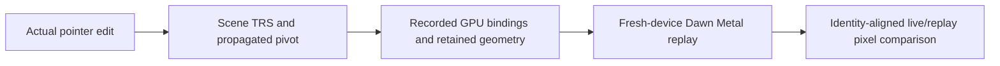

# Transform gizmo verification

The public `@forgeax/engine/interaction` entry provides constrained object
translation, rotation and scaling. Scene `Transform` remains the mutation
authority; a realm-neutral controller consumes physical viewport coordinates,
and a retained Scene presentation draws ordinary unlit meshes. DOM capture,
selection and undo are host responsibilities.

Producer: `61d95da42e1f4b4572512f34fe71e6e9a67ae001`.
[Engine PR](https://github.com/ForgeaX-Games/forgeax-engine/pull/3535) ·
[Evidence PR](https://github.com/ForgeaX-Games/forgeax-engine-assets/pull/39) ·
[Fixed evidence archive](https://github.com/ForgeaX-Games/forgeax-engine-assets/blob/d71fe74553906d5f9a5c4466adffa7d06b8b80e1/evidence/2026-09-30-transform-gizmo/README.md) · [SHA-256 inventory](https://github.com/ForgeaX-Games/forgeax-engine-assets/blob/d71fe74553906d5f9a5c4466adffa7d06b8b80e1/evidence/2026-09-30-transform-gizmo/SHA256SUMS).

## Source review and ownership

| Pinned source | Mechanism applied | ForgeaX boundary |
|:--|:--|:--|
| [Three.js r184 TransformControls](https://github.com/mrdoob/three.js/blob/d3b629c0c2097cec664ad16369bb6eae3b10e335/examples/jsm/controls/TransformControls.js#L450) | Frozen start pose; parent conversion; world/local basis; constrained movement, snapping and projection-scaled display | Scene/Picking/Math drive a transaction over the existing ECS transform |
| [UE 5.8.1 CombinedTransformGizmo](https://github.com/Forgeax/UnrealEngine/blob/71fe36aac5a8df5ccd66c763ffc902b29b6a9c43/Engine/Source/Runtime/InteractiveToolsFramework/Private/BaseGizmos/CombinedTransformGizmo.cpp#L1328) | Transform authority and begin/update/end interaction; bounded axis/plane helpers | Host selects one entity; controller commits or restores local TRS without a second undo ledger |
| [UE AxisPositionGizmo](https://github.com/Forgeax/UnrealEngine/blob/71fe36aac5a8df5ccd66c763ffc902b29b6a9c43/Engine/Source/Runtime/InteractiveToolsFramework/Private/BaseGizmos/AxisPositionGizmo.cpp) and [PlanePositionGizmo](https://github.com/Forgeax/UnrealEngine/blob/71fe36aac5a8df5ccd66c763ffc902b29b6a9c43/Engine/Source/Runtime/InteractiveToolsFramework/Private/BaseGizmos/PlanePositionGizmo.cpp) | Axis/plane constraint separates visible geometry from hit tolerance | Physical-pixel hit regions; frozen ray-plane constraint |
| [UE AxisAngleGizmo](https://github.com/Forgeax/UnrealEngine/blob/71fe36aac5a8df5ccd66c763ffc902b29b6a9c43/Engine/Source/Runtime/InteractiveToolsFramework/Private/BaseGizmos/AxisAngleGizmo.cpp) | Signed planar angle | `atan2`, continuous ±π unwrapping and quaternion normalization |

[Reference commit/blob identities](https://github.com/ForgeaX-Games/forgeax-engine-assets/blob/d71fe74553906d5f9a5c4466adffa7d06b8b80e1/evidence/2026-09-30-transform-gizmo/data/source-pins.json) were read from
the knowledge-base reference checkouts. This is a mechanism comparison, not a
matched performance comparison with Three.js or UE. No Unreal source is copied.
The [package contract](../README.md) records the precise
API and refusal states; [demo commands](../../../apps/hello/transform-gizmo/README.md)
start and stop their own Host.

## Rendered interaction

| Translate | Rotate | Scale |
|:--:|:--:|:--:|
|  |  |  |

The [browser report](https://github.com/ForgeaX-Games/forgeax-engine-assets/blob/d71fe74553906d5f9a5c4466adffa7d06b8b80e1/evidence/2026-09-30-transform-gizmo/data/browser-report.json) contains 12 actual pointer
paths: axis and plane translation; Escape, pointer cancellation, capture loss and
blur rollback; snap; canvas resize; rotation; local and uniform scale; local axes
under a transformed parent with an orthographic camera. All passed with 2231
completed submitted frames and zero page/console errors. Gold marks the active
handle; RGB identifies X/Y/Z. Perspective and orthographic sizing, all three
translation axes, scale snap/clamp, angle unwrapping, stale entity rejection and
teardown also run through the real World/Scene/Picking unit path.

| Deterministic gate | Result |
|:--|:--|
| Package tests | 10 passed; 96.04% lines, 85.48% branches, 94.59% functions |
| Formal smoke-roster contracts | 51 passed; full roster 95, including 32 sharded gates |
| Dawn lifecycle/pixels | 65 completed frames, all three modes, transform writeback and 21→5 entity teardown |
| Overlay negative control | Removing the helper fails changed-pixel/RGB assertions |
| Ring regression | Unit guard first fails for zero quaternions, then passes with explicit identity initialization |

Dawn at 320×240 measures changed pixels / X,Y,Z color pixels as translate
832 / 247,221,287; rotate 1583 / 486,509,588; scale 571 / 167,162,165.
[Original receipts and red controls](https://github.com/ForgeaX-Games/forgeax-engine-assets/blob/d71fe74553906d5f9a5c4466adffa7d06b8b80e1/evidence/2026-09-30-transform-gizmo/README.md#evidence-map) remain archived.

## Hardware performance

Reproduce the explicit diagnostic with
`pnpm --filter @forgeax/hello-transform-gizmo verify:performance`. The default
Browser correctness smoke retains all twelve pointer paths and eight resource
transitions after 60 completed frames; it does not include this sampling soak.

Apple M4 Pro, 64 GiB, Chrome Beta 149 / Metal, 1050×672 output. Recorder disabled.
Two paired rounds of hidden helper → translate → rotate → scale; each phase uses
30 warmup frames and 180 samples, plus 10000 hit tests. The baseline retains the
same scene, assets and entities. Values below are ranges across the two rounds.

| Phase | CPU sync mean ms | CPU sync p95 ms | Hit test µs/call | Measured GPU passes median ms | Scene main pass median ms |
|:--|--:|--:|--:|--:|--:|
| disabled | 0.0106–0.0183 | 0.1000–0.1000 | — | 1.0413–1.0434 | 0.5648–0.5654 |
| translate | 0.0733–0.0744 | 0.2000–0.2000 | 14.67–15.16 | 1.0500–1.0513 | 0.5737–0.5741 |
| rotate | 0.0689–0.0700 | 0.1000–0.2000 | 18.10–19.23 | 1.0628–1.0636 | 0.5869–0.5869 |
| scale | 0.0622–0.0689 | 0.1000–0.2000 | 0.74–0.97 | 1.0459–1.0484 | 0.5710–0.5733 |

CPU sync includes scene propagation, controller update and retained presentation.
CPU timer resolution is 0.1 ms; sub-resolution means are batch estimates. The
scene main pass contains both the box/floor and helper: its paired median increase
is 0.006–0.022 ms. It is not an isolated per-draw GPU cost. Measured GPU pass sums
exclude three explicitly unmeasured copy passes; all partial reasons are retained.
These are not total GPU frame latency. Frame medians are display paced, about
16.6–16.7 ms, and are not used to infer unconstrained throughput.

All eight phases retain 21 entities, graph live/peak allocation of 6,584,932 bytes
and zero pending-retirement bytes. Four resources have unknown size; graph
accounting is not physical GPU memory. Raw frame, CPU and GPU samples are
[losslessly compressed](https://github.com/ForgeaX-Games/forgeax-engine-assets/blob/d71fe74553906d5f9a5c4466adffa7d06b8b80e1/evidence/2026-09-30-transform-gizmo/data/performance-samples.json.gz), and each phase
contains an actual GPU observation with pass names and unmeasured reasons in the
[report](https://github.com/ForgeaX-Games/forgeax-engine-assets/blob/d71fe74553906d5f9a5c4466adffa7d06b8b80e1/evidence/2026-09-30-transform-gizmo/data/browser-report.json). These measurements describe this host;
CI software GPU runs verify correctness rather than hardware speed.

## RHI Debug verification

Each mode performs a real drag before recording. Inspection resolves mesh group
2/binding 0 and material group 1/binding 0 including actual uniform dynamic
offsets, reads GPU world matrices and colors, proves retained vertex/index data,
and checks triangle topology, `depthCompare=always`, no depth writes and separate
ring orientations. GPU pivot translation agrees with the propagated Scene pivot
within 1e-4. The fixed captures contain 10, 3 and 7 helper draws respectively.

| Mode | Overlay draws | Fresh-device pixel mean | Max channel delta | Covered mean | Channels above ε=0.05 |
|:--|--:|--:|--:|--:|--:|
| Translate | 10 | 0 | 0 | 0 | 0 |
| Rotate | 3 | 0 | 0 | 0 | 0 |
| Scale | 7 | 0 | 0 | 0 | 0 |

The captures initially omit content for one readback buffer, scene depth and the
borrowed swapchain texture. The verifier proves those resources are initialized
by complete in-frame copies or clears before consumption; it does not infer
capture closure merely from matching pixels. Original v7 tape and gzip archive
digests, resource audit, GPU bytes, replay backend, screenshots and pixel data are
in the [three RHI reports](https://github.com/ForgeaX-Games/forgeax-engine-assets/blob/d71fe74553906d5f9a5c4466adffa7d06b8b80e1/evidence/2026-09-30-transform-gizmo/README.md#evidence-map).

A development capture exposed three identical ring world matrices caused by
zero-initialized quaternions. This was repaired at presentation/controller
initialization using explicit identity quaternions, with the failing GPU tape and
red unit guard retained. Final replay uses original tape bytes on an independent
Metal device, rather than substituting a mock renderer.

## Broader gates and limits

The complete local hello/learn-render roster ran: 94/95 gates passed; the existing
Bloom complete-GPU-timing assertion fails on Metal copy-marker observations.
`pnpm test:dawn` likewise stops in the ordinary group after 134 passes, one
Surface timing failure and three capability skips; later groups did not execute.
The full browser command stops at a Transmission cleanup timeout in group 6;
that same exact test passes alone without changing its assertions. These local
broad commands are not reported as green. Their original data and logs remain
in [provenance](https://github.com/ForgeaX-Games/forgeax-engine-assets/blob/d71fe74553906d5f9a5c4466adffa7d06b8b80e1/evidence/2026-09-30-transform-gizmo/data/provenance.json). Complete PR CI is tracked on
[the final head checks](https://github.com/ForgeaX-Games/forgeax-engine/pull/3535/checks).

CI's forced-color Vite banner exposed a Host readiness parser failure before
browser admission. The Host now uses the shared HTTP readiness observer, with
the exact colored banner covered by its regression gate. A separate existing
eight-file ray browser group exceeded its 300-second CI process deadline while
reported assertions passed; the identical 23-test group passes locally in
188.63 seconds without changing its assertions or deadline. The scheduler now
places the six-case path-tracer owner in a fresh process; the seven neighbors,
complete discovery roster and original 300-second process bound are retained.
The split runner passes all 23 tests locally, with process times of 104.42 and
95.48 seconds. Forced-color gizmo browser admission passes 2175 completed frames.
Playwright frame admission now passes its declared 180-second options in the
third argument. A real Playwright contract with a 20 ms default and delayed
frame observation fails with the misplaced argument, then passes after repair.
It runs before the real Engine browser journey, whose frame/pixel/error oracles
and outer process deadline remain intact.

Parent transforms may be translated, rotated and nonuniformly scaled when their
matrix has orthogonal axes. Existing ancestor shear or a singular parent is
refused. Rotation edits local TRS through parent rotation; a nonuniform parent
can yield child world shear as in normal Scene composition. Hosts must own the
selected TRS/parent during a drag and cancel on capture loss/blur. Nonlinear
post-process display warps and multi-object selection are separate contracts.
