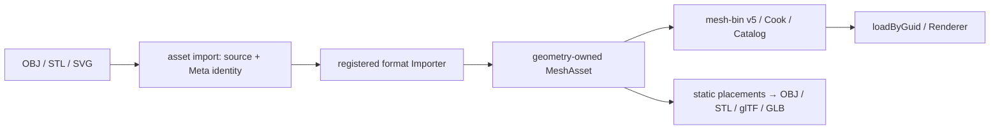

# @forgeax/engine-mesh-io

Node-only source-format adapters produce canonical `MeshAsset` values and export
static mesh placements. The package uses MIT-licensed Three.js r184 format tools
at build time; the player still consumes cooked ForgeaX assets through Catalog.
UE 5.8.1's official translators and exporters informed the result boundaries,
not the engine API or implementation source.



| Operation | Public entry | Supported result |
|:--|:--|:--|
| OBJ import | `parseObj(text)` / `parseObjPackage(text, read)` / `objImporter` | Named objects, polygon triangulation, positive/negative indices, UVs, normals, vertex colors and material groups; ordinary producer adds named MTL materials and image closure |
| STL import | `parseStl(bytes)` / `stlImporter` | ASCII and little-endian binary triangles; binary color attributes where declared |
| SVG import | `parseSvg(text, curveSegments?)` / `svgImporter` | Filled paths and primitive shapes, curves/arcs, holes and fill rules, transforms, strokes, linear vertex colors and opacity |
| Source admission | `importMeshFile(path, dryRun?)` | Stable semantic `sourceKey` and GUID reuse in `<source>.meta.json`; preserved import settings |
| Mesh export | `exportMeshes(items, format)` | Static placements to OBJ, binary STL, self-contained glTF 2.0 JSON or GLB; glTF retains groups, PBR scalar material values and local transforms |

```ts
import { exportMeshes, parseObj } from '@forgeax/engine/mesh-io';

const imported = parseObj(sourceText);
if (!imported.ok) return imported;
const output = await exportMeshes(imported.value, 'glb');
if (!output.ok) return output;
await fs.writeFile(destination, output.value);
```

Use `forgeax asset import model.obj --root <project> --json` for project source
admission. DevKit registers OBJ/STL/SVG producers by default. A custom Vite host
registers `objImporter`, `stlImporter`, or `svgImporter` in its existing
`pluginPack({ importers })` list, plus the existing `imageImporter` decode capability for textured sources. Development hosts pass the scoped import transport from the same runtime binding. Importers never mint GUIDs or write source.

> [!IMPORTANT]
> These are static interchange operations. OBJ references material slot names;
> `parseObj` returns geometry; `parseObjPackage` and `objImporter` retain MTL/image dependencies. STL has geometry and facet
> normals, without scene/material metadata. OBJ/STL export rejects supplied material values instead of silently discarding them. Exporters accept explicit static
> placements, not a live World; bake skin and morph deformation before exporting.
> SVG gradients, images, scripts, external resources, filters, masks and clip paths
> fail explicitly. The SVG tessellation setting defaults to 24 curve segments
> and is bounded to `[2, 256]`.

SVG parsing and glTF export own short-lived Workers for DOM/FileReader adapters.
They do not change Host globals or retain background workers. Each operation has
a thirty-second bound. The source XML is capped at 16 MB and generated SVG
geometry at one million vertices per part; ordinary mesh conversion caps vertices
at ten million. Expected parse/export failures return `Result<…, AssetError>`
with structured `asset-parse-failed` facts. Producer failures use `ImportError`.

PLY is intentionally absent from this comparison scope. Draco belongs to the
existing [glTF owner](../gltf/README.md), which projects decoded primitives through
ordinary accessors before bridge, Cook and runtime consumption.

## Implementation and acceptance

The build-only adapters pin MIT-licensed Three.js `0.184.0` (`r184` reference
commit `d3b629c0c2097cec664ad16369bb6eae3b10e335`). They reuse its
`examples/jsm/loaders/{OBJ,STL,SVG}Loader.js` and
`examples/jsm/exporters/{OBJ,STL,GLTF}Exporter.js` algorithms, then publish
canonical Engine geometry. OBJ/STL import derives the same normal/UV/tangent
contract consumed by Standard; UV-less input has explicit zero UVs and a finite
normal-plane basis. Export preserves all eight UV sets in glTF, handles 32-bit
indices and flips baked OBJ/STL winding for negative-determinant placements.

The UE 5.8.1 reference is pinned to
`71fe36aac5a8df5ccd66c763ffc902b29b6a9c43`. The compared basic results live in
`InterchangeOBJTranslator.cpp`, `SVGFactory.cpp`,
`DatasmithCADTranslator.cpp`, `GLTFExporter.cpp` and `EditorExporters.cpp`.
Its STL import is conditional on the default-disabled
`ds.CADTranslator.EnableUnsupportedCADFormats`. The Engine import path needs no
such switch. This is basic-result parity; it does not reproduce the UE Editor
or claim complete CAD/SVG/scene exporter coverage.

`pnpm --filter @forgeax/mesh-io-parity verify` generates real source files,
reimports them through Pack/Catalog and renders twenty routes from a fresh Vite
dependency cache. Unexpected page reloads fail; reports derive the commit from
Git. Each completes 60
frames plus one RHI Debug capture. Fresh-device replay must equal live HDR bytes;
GPU vertex/index bytes must equal the imported MeshAsset; deleting mesh draws
must alter the output. It saves screenshots, tapes, pipeline/binding inspection,
readbacks and a machine-readable report under `artifacts/mesh-io/acceptance`.
`pnpm --filter @forgeax/mesh-io-parity benchmark` records measured small/large
import/export and Draco timings with sample counts and source sizes. Unit gates
also use the independent Khronos glTF validator and exercise holes, curves,
negative indices, transforms, malformed source and GUID-preserving reimport.

## OBJ material closure

Source admission reads the OBJ/MTL/image closure once and declares stable `mesh:`, `material:` and color-domain-specific `texture:` source keys. Import consumes those GUIDs, packs mesh material references, emits ordinary MaterialAsset/TextureAsset values and retains relative sibling dependencies for reimport. PNG/JPEG/TGA bytes use the host's existing image decoder; missing images and ambiguous material names fail.

| Authored MTL fact | Published contract |
|:--|:--|
| `Kd`, `Ke` | sRGB colors converted to linear base/emissive color |
| `d` / `Tr` | Alpha; `d` takes precedence |
| `Pm`, `Pr`, `Ns` | Metallic and roughness; absent `Pr` uses sqrt(2/(Ns+2)), a documented Phong-to-PBR approximation |
| `map_Kd`, `map_Ke`, `norm` | Base color, emissive and normal texture GUIDs; color maps are sRGB, normal maps linear |
| Map scale/offset | Authored transforms plus OBJ bottom-origin to Engine top-origin V conversion |
| All other `map_*`, bump and displacement maps | Explicit parse failure until a faithful material mapping exists |

This contract does not advertise full Phong material equivalence. Static export accepts geometry, world placement and the finite scalar `MeshExportMaterial` surface. glTF/GLB preserve those fields and all eight UV sets; texture/hierarchy/skin/animation closure is outside that input type. Skin/morph meshes fail unless explicitly baked first. These bounds are narrower than the upstream scene exporters and are visible at admission.
