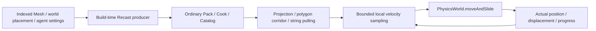

# Navigation

`@forgeax/engine/navigation` owns bounded graph/grid queries, static world-space
NavMesh queries, local avoidance and ECS following. `@forgeax/engine/import/navigation-bake`
produces navigation assets outside the player. Physical characters consume the
existing PhysicsWorld; World owns their state and fixed time.



## Static navigation assets and physical characters

Produce from explicitly selected indexed MeshAsset values and affine world matrices.
The selected list is the bake scope. Keep source modules, placements and settings in
the ordinary Pack source closure/parameters: its input fingerprint controls reimport;
the producer's `sourceDigest` hashes transformed geometry, settings and the pinned
cooker version. Stable Pack source keys retain GUIDs across a rebuild.

```ts
// Build-time module, called by a Pack build or import operation.
import { bakeNavigationMesh } from '@forgeax/engine/import/navigation-bake';
const result = await bakeNavigationMesh({
  geometry: [{ mesh, world: placement }],
  settings: { radius: 0.35, height: 1.8, maxSlopeDeg: 45, maxStep: 0.3,
              cellSize: 0.1, cellHeight: 0.05 },
});
if (!result.ok) throw result.error;
// Return result.value as an ordinary `navigation-mesh` Pack output.
```

| Operation | Contract |
|:--|:--|
| `bakeNavigationMesh` | Conservative voxel rounding: radius/height round up; climb rounds down. Indexed positions support Float32Array or aligned ArrayBuffer. Negative-determinant placements reverse winding. Hard triangle, cell, vertical-span and raster-work limits precede native allocation. Native intermediates are released. |
| `NavigationMeshAsset` | Portable JSON polygons, vertices, settings, version and sourceDigest; ordinary output producer and default asset loader. Recast/WASM stays in the explicit build-time subpath. |
| `createNavigationMesh(asset)` | Copies and validates finite bounded convex polygon topology, constructs a realm-local BVH and reusable graph workspace. Pass the POD asset to another Worker and construct there. |
| `mesh.project(point, maxDistance, maxPolygons?)` | Euclidean XYZ projection with an explicit distance limit and bounded BVH work; layers remain distinct. |
| `mesh.ground(point, maxHeight, maxPolygons?)` | Vertical sampling at the exact XZ, including slopes. A missing column is a projection failure. |
| `mesh.findPath(start, goal, { maxProjection, maxVisited?, maxPolygons? })` | Bounded polygon-graph route and XZ string pulling within its selected corridor. Points and polygon roster are owned outputs. No partial success; no global continuous shortest-path promise. |
| `navigationCharacterPlugin(mesh, avoidanceOptions?)` | Installs Scene/navigation and physics component vocabulary, contributes one active mesh resource and one physical motor. Install `physicsPlugin('rapier-3d')` independently. |
| `setNavigationTarget(world, entity, feetTarget, options)` | Synchronous world-space query and assignment; reads propagated pose. Failed assignment retains the old route. Feet targets and speed use world units. |
| `setNavigationMesh(world, mesh)` | Replaces the active surface; a changed digest cancels old routes on the next ready fixed step. Explicitly retarget afterward. |

```ts
import { createNavigationMesh, NavigationCharacter, NavigationAgent,
  navigationCharacterPlugin, setNavigationTarget } from '@forgeax/engine/navigation';
import { Collider, ColliderShapeValue, RigidBody, RigidBodyTypeValue,
  physicsPlugin } from '@forgeax/engine/physics';
import { Transform } from '@forgeax/engine/scene';
const mesh = createNavigationMesh(loadedNavigationAsset).unwrap();
await app.pluginContext.plugin(physicsPlugin('rapier-3d'));
await app.pluginContext.plugin(navigationCharacterPlugin(mesh));
const actor = app.world.spawn(
  { component: NavigationCharacter, data: {} },
  { component: NavigationAgent, data: { speed: 1.5 } },
  { component: RigidBody, data: { type: RigidBodyTypeValue.kinematic } },
  { component: Collider, data: { shape: ColliderShapeValue.capsule,
      radius: 0.3, halfHeight: 0.5 } },
  { component: Transform, data: { pos: [-4, 0.82, 0] } },
).unwrap();
setNavigationTarget(app.world, actor, [4, 0, 0], { maxProjection: 0.3 }).unwrap();
```

Ordinary SceneAssets can author the same components. Install the companion before
instantiation. `bench/delivery.mjs` exercises real HTTP Pack/index loading, two
independent cold Registries/Worlds and a parameter rebuild with the same GUIDs.

| Physical invariant | Behavior |
|:--|:--|
| Shape and scale | Upright nonsensor kinematic capsule only. Radius/height derive from Collider and propagated world scale; yaw and a nonuniform parent are supported. Reject tilt, shear, singular scale and clearance/KCC settings that cannot cover the baked constraints. Bake radius must include KCC offset plus the 1 mm steering boundary tolerance. |
| Fixed ordering | Scene propagation → physicsSyncBackend → navigation/character → physicsStepSimulation → writeback. Missing PhysicsWorld/body waits. Only moveAndSlide writes the actor position; the point follower excludes CharacterController entities. |
| Motion | Bounded spatial hash, nearest neighbors, 50 speed candidates, stable entity ties and candidate ground admission. The sampling solver uses cooperative preferred velocity and imminent actual velocity; it is not an ORCA guarantee. Saturated neighborhoods stop. |
| Feedback | `NavigationCharacter.desired`/`actual` retain displacement from the latest fixed step. Feet pose advances corners and proves final arrival. Gravity and contact tuning use the physics owner. |
| Lifecycle | `idle` pauses; `following` resumes. Empty setNavigationPath cancels. Nonempty setNavigationPath rejects physical controllers; use setNavigationTarget. Changed source digest invalidates routes; stale entities fail synchronously. |
| Stalled motion | After `stuckSeconds` without improving the current corner distance, at most two bounded corridor repairs run (512 visited/projection polygons each). Continued failure becomes `blocked`; sideways oscillation does not reset progress. Explicit retarget resets the budget. No per-frame search loop. |

A local sampler may stop in congested narrow counterflow; callers must observe
blocked state and choose a target/traffic policy. Carving, navigation links,
jump/climb actions and streamed meshes are outside this static ground capability.

## Graph/grid query and point following


```ts
import { createWorldContext, World } from '@forgeax/engine/ecs';
import {
  createNavigationGrid, NavigationAgent, navigationPlugin, setNavigationPath,
} from '@forgeax/engine/navigation';

const graph = createNavigationGrid({
  width: 5, height: 5, plane: 'xz',
  blocked: [0, 0, 1, 0, 0, 0, 0, 1, 0, 0, 0, 0, 1, 0, 0,
            0, 0, 1, 0, 0, 0, 0, 0, 0, 0],
}).unwrap();
const path = graph.findPath(0, 4, { maxVisited: 25 }).unwrap();
const world = new World();
const realm = await createWorldContext(world, [navigationPlugin()]);
const entity = world.spawn({ component: NavigationAgent, data: { speed: 3 } }).unwrap();
setNavigationPath(world, entity, path.points).unwrap();
for (let frame = 0; frame < 300; frame++) world.update(1 / 60).unwrap();
await realm.fiber.dispose();
```

| Surface | Contract |
|:--|:--|
| `createNavigationGraph({ positions, edges, blocked? })` | Copied XYZ Float32 positions and directed edges; indices are dense integers. Add the reverse edge explicitly for bidirectional travel. Missing cost uses Euclidean distance. |
| `createNavigationGrid({ width, height, ... })` | Row-major nodes `row * width + column`; positive dimensions, optional uniform `cellSize`, XYZ `origin`, XY/XZ `plane`, `blocked` and positive entering `weights`. |
| `diagonal: true` | Eight-neighbor connectivity. A diagonal requires both adjacent cardinal cells to be unblocked; graph edges represent point movement, not finite-radius clearance. |
| `graph.findPath(start, goal, { maxVisited? })` | Optimal cost within immutable topology, including both endpoints; success exposes `nodes`, owned `points`, `cost`, `visited`. Default expansion budget is nodeCount. |
| `setNavigationPath(world, entity, points)` | Validates all points and restarts at waypoint zero atomically; an empty route cancels. Validation failure retains the previous route. |
| `NavigationAgent` | `path`, `waypoint`, non-negative `speed` in local units/second, and schema enum `status`. Requires Scene Transform. |
| `navigationPlugin()` | Installs Scene through native Cordis and registers following in FixedUpdate before Scene's fixed transform propagation. Disposal removes the system; ECS retains component vocabulary while live rows still use it. |

Both grids and general graphs use one indexed binary heap and private epoch-stamped
search workspace. Generic graphs use a cost-scaled Euclidean heuristic; cardinal
and diagonal grids specialize it to Manhattan and octile distance. The scale is
bounded by every edge's actual cost/distance, including weights below or above one
and zero costs. Changing cost units does not flatten the heuristic. Equal
priorities choose greater progress, then the lower node index.

Construction is $O(V+E)$, workspace and topology storage are $O(V+E)$, and search
is $O((V+E)\log V)$ in the worst case. Repeated searches clear only the heap size
and advance a stamp; score, parent and heap storage are reused, while result
assembly is an explicit allocation boundary. Inputs are bounded by
`NAVIGATION_MAX_NODES` / `NAVIGATION_MAX_EDGES`; graph construction is synchronous
and belongs outside frame-critical work. Transfer ordinary source arrays to a
Worker and construct the graph in that realm; graph instances are realm-local.

## Coordinates and movement

Graph coordinates are authored. For the built-in follower, route points and
`Transform.pos` must be in the entity's **local** space. A parent transform therefore
moves/scales the entire route, and speed is measured in that local space. A caller
querying world-space navigation must convert its route to local space or use a
root entity. The initial position must safely connect to the first route point.

The follower preserves every corner, consumes the remaining travel distance across
multiple segments, handles repeated points and zero speed, and stops exactly at the
last point. Float32 positions introduce normal accumulation error. It does not rotate
entities. Use `NavigationAgentStatus` for reflected states; `blocked` is emitted by the physical companion.
Use `setNavigationPath` to replace or cancel a route rather than editing a waypoint
and route length independently.

`status` controls the motor independently of the retained route. Set `idle` to
suspend an unfinished route and `following` to resume its current waypoint.
The follower sets `arrived` at completion; use `setNavigationPath` to start a new
route. Cancellation through an empty route also clears the stored points.

> [!IMPORTANT]
> The point follower owns local Transform movement. CharacterController entities
> are excluded; NavigationCharacter uses the physical motor described above. Topology costs do not imply jump/teleport/motor actions.

Graph/grid topology is immutable. Rebuild it and explicitly assign new routes after
an authored change; existing routes keep their copied points. There is no nearest-node
projection or partial-path success. `navigation-unreachable` never masquerades as arrival.

## Failures and verification

Queries and assignment return `Result`. `NavigationErrorCode` derives from the
closed union in [errors.ts](src/errors.ts); inspect `expected`, `hint` and the narrowed
`detail`. Assignment also returns the owning ECS error for a stale entity or missing
component. Invalid direct edits discovered during following become an ECS execution
fault; recover through the World/App owner instead of continuing a poisoned World.

| Check | Command |
|:--|:--|
| Optimality, walls, diagonal corners, budgets, invalid input | `pnpm --filter @forgeax/engine-navigation test` |
| Real World fixed time, hierarchy, replacement, disposal | Same package test command |
| Query and 1000-agent full-World performance; 300-frame trajectory | `pnpm --filter @forgeax/engine-navigation bench` |
| Public browser/Node consumer | Feature Lab `state/graph-grid-navigation` |

The benchmark writes raw measurements and the actual World trajectory to
`artifacts/g03-navigation/benchmark.json`. Wall-time budgets are 1 second for
construction, query p95 below 50 ms, and 1000-agent full-World update p95 below one
60 Hz frame. It preserves failures and does not subtract observer overhead.

Set `FORGEAX_NAVIGATION_BENCH_OUTPUT` to an absolute JSON path in an existing
output directory to retain independent runs. Receipts include resolved runtime
module URLs and SHA256; the source hash alone does not identify rebuilt upstream
owners such as ECS. See [validation evidence](VALIDATION.md) for observed budgets
and the remaining full-delivery gates.
