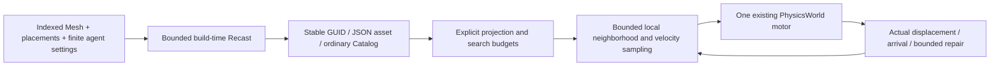

# Navigation validation

## Static NavMesh and physical character navigation

This change adds an explicit build-time Recast producer, portable ordinary
`navigation-mesh` Pack/Cook/Catalog data, bounded world-space projection and
polygon-corridor queries, and one FixedUpdate local avoidance motor consuming
real Rapier `moveAndSlide`. World owns target, progress and feedback. Renderer
and the bake compiler own no navigation state.



| Reference | Evidence and choice |
|:--|:--|
| Godot 4.4 `4c311cbee68c0b66ff8ebb8b0defdd9979dd2a41` | Navigation producer separates source geometry from Recast baking; agent consumes safe velocity independently of collision movement. |
| Unreal `71fe36aac5a8df5ccd66c763ffc902b29b6a9c43` | Authorized local Recast producer and crowd ownership comparison; no UE source copied into product or evidence. |
| Three.js r184 `d3b629c0c2097cec664ad16369bb6eae3b10e335` | Triangle closest-point and Box3 boundary comparison; these are geometric primitives, not a NavMesh/crowd implementation. |
| Recast Navigation JS 0.43.1 | Exact-pinned MIT packages in the Node-only `import/navigation-bake` subpath. WASM payload: 338,824 bytes. Player navigation and default asset loading do not import the baker. |

### Correctness and effect receipts

| Workload | Current local result |
|:--|:--|
| Navigation, physics, Rapier, Import, Pack, assets, types and Feature Lab | 270 files / 2330 tests PASS; no type errors |
| Finite-size geometry oracle | Door radii 0.30/0.70 m, low ceiling, allowed/forbidden step and slope, disconnected islands; 10 cases PASS, independent inflated-wall path check |
| Ordinary asset delivery | Real HTTP JSON Pack/index and artifact loading; two cold Registries/Worlds arrive; parameter rebuild retains both GUIDs and changes sourceDigest/input fingerprint |
| Physical motion | Two opposing actors and eight crossing actors arrive without persistent overlap; stairs, slope and wall-corner arrive from actual pose |
| Multi-character narrow door | Six opposing actors in single file: 6/6 arrive, zero overlap frames, minimum center separation 0.656 m for 0.30 m capsules |
| Lifecycle | Retarget/failure retention, cancel, pause/resume, async physics readiness, mesh replacement, stale entity, parent yaw/nonuniform scale, plugin disposal |
| Bounded blockage | Unbaked physical wall never crossed; two bounded corridor repairs then blocked, held pose over another 120 steps |
| Clearance falsifier | Same 1.2 m door and requested 0.70 m radius: ordinary bake unreachable; disabled erosion incorrectly reports a route |
| Avoidance falsifier | Both actual KCC actors arrive in both cases: arrival alone is insensitive. Enabled minimum separation 0.657 m versus disabled 0.610 m, exceeding the fixed 0.03 m difference gate |
| Physical-consumption falsifier | Same authored wall: ordinary KCC stops before it; diagnostic horizontal motor bypass crosses it and falsely reaches the destination |

> [!IMPORTANT]
> Local avoidance does not coordinate global traffic. The retained twelve-actor,
> two-lane 1.6 m doorway stress fails the stronger all-arrival diagnostic: 1/12
> arrives and 11 enter bounded blocked state, without persistent overlap or false
> arrival. Stronger lane bias, boundary lookahead, reciprocal constraints and
> penalty sweeps did not solve this congestion; they were withdrawn. This negative
> is not labeled an all-arrival pass. Applications must observe blocked state and
> choose traffic/target policy. No carving, off-mesh actions or streaming is claimed.

The plots use actual fixed-step samples and producer polygons, not ideal path
integration. The browser overview additionally renders ordinary Catalog scene
entities, NavMesh edges, query paths and physical radius markers through the real
Engine renderer. RHI capture/replay receipts qualify only GPU work, not CPU
navigation quality.

### Fixed performance protocol

Apple M4 Pro / darwin-arm64 / Node 22.23.2. Budgets below were fixed before
optimization. The numeric table retains runtime-core `e526c130` measurements;
the delivery PR publishes final-artifact reruns and their exact module hashes.
Bakes use three separate cold Node processes plus one excluded
initial same-process bake and six measured warm bakes. Queries use 20 warmup and
100 measured requests. Physical crowds use 30 warmup and 370 measured full-World
updates, three independent Worlds per size, at 1/60 s. All 100/1000 actors actually
arrive and zero are blocked. Wall time remains wall time; no observer subtraction,
render FPS substitution or threshold reduction.

| Workload | p95 or conservative cold maximum | Fixed budget | Result |
|:--|--:|--:|:--|
| Small bake, 12 triangles | Cold max 55.57 ms / warm p95 5.71 ms | 1000 ms | PASS |
| Medium bake, 600 triangles | Cold max 398.68 ms / warm p95 252.53 ms | 5000 ms | PASS |
| Large bake, 6012 triangles | Cold max 4822.99 ms / warm p95 1036.60 ms | 10000 ms | PASS |
| Query small / medium / large | 0.113 / 0.226 / 0.973 ms | 50 ms | PASS |
| 1000-agent complete local solver | 6.46 ms | 16.667 ms | PASS |
| 1000-agent bounded neighbor search, instrumented | 2.57 ms | 10 ms | PASS |
| 100-agent full World, three repeats | 5.74 / 13.65 / 6.67 ms | 16.667 ms | PASS |
| 1000-agent full World, three repeats | 96.61 / 76.27 / 77.57 ms | 100 ms | PASS |

The benchmark-only instrumented module reports bucket construction, neighbor
search and velocity solve separately and verifies identical output. Its median
observer overhead is 0.017 ms for 100 agents / 0.206 ms for 1000. Separate observed
World samples include the wrapper and record Scene, physics sync, KCC and step
phases; their p95 values cannot be added to reconstruct a frame. Instrumented
1000-agent navigation p95 104.72 ms includes KCC p95 59.82 ms and fails the
uninstrumented 100 ms budget if incorrectly substituted; it is diagnostic data,
not a faster result. All raw samples, heap/RSS snapshots and prior failures are
retained. Shared-host contention means no arbitrary-load guarantee.

Two measured corrections retain the original ownership:

| Correction | Evidence |
|:--|:--|
| Prune a candidate once its nonnegative preference cost cannot beat the current best | No omitted negative penalties; output/order tests and real crowd/falsifier paths remain qualified. |
| Rapier KCC synchronizes only its moved body's attached colliders before the next controller query | Previous per-controller global modified-body propagation accumulated a whole roster. Independent ABBA native synchronization probes and a real repeated-step offset-collider regression preserve collider pose and expose the removed repeated scan. |

Native synchronization microbenchmarks are not whole-KCC or whole-World speedup
claims. The final full-World budgets above remain separate. Original graph/grid
construction <1 s, query p95 <50 ms and 1000-point-agent full-World p95 <16.667 ms
also pass on the current runtime; historical G03 results remain below.

### Allocation observation

A separate V8 sampling observer runs the same 100/1000-character co-flow fixture
for 400 real fixed steps. Its scope includes bake, queries, ordinary Scene/Catalog
setup and disposal. A 16 KiB average sampling interval includes objects collected
by minor and major GC ([protocol](https://github.com/ChromeDevTools/devtools-protocol/blob/master/json/js_protocol.json)).
The collected-object falsifier records 23.43 MB after explicit GC versus zero
with live-only sampling. Raw sampling trees and node attribution are retained.

| Characters | Estimated cumulative JS allocation | Sampled minus direct p50 / p95 |
|--:|--:|--:|
| 100 | 1.385 GB | -0.333 / +0.854 ms |
| 1000 | 15.266 GB | +7.728 / +66.340 ms |

Both direct and sampled Worlds reach every actual endpoint with identical final
states. These are cumulative allocation estimates, not live/peak memory or
native/WASM allocation totals. The signed timing differences are one alternating
order pair on a shared host, not a causal speedup. Sampling costs are not
subtracted, and this diagnostic does not qualify the fixed performance budgets.
No zero-allocation promise is made; the retained sampling attribution exposes
navigation, ECS reflection and Rapier JavaScript allocation cost.

### Reproduce

```bash
pnpm build:engine
FORGEAX_SHARED_APP_INPUTS_MANIFEST=shared-build-inputs/manifest.json pnpm exec vitest run \
  --project @forgeax/engine-navigation --project @forgeax/engine-physics \
  --project @forgeax/engine-physics-rapier3d --project @forgeax/engine-import \
  --project @forgeax/engine-pack --project @forgeax/engine-assets-runtime \
  --project @forgeax/engine-types --project @forgeax/feature-lab --maxWorkers=1
node packages/navigation/bench/geometry.mjs
node packages/navigation/bench/delivery.mjs
node packages/navigation/bench/falsifiers.mjs
node packages/navigation/bench/crowd.mjs --single-file
node packages/navigation/bench/performance.mjs
node packages/navigation/bench/neighbor-profile.mjs
node packages/navigation/bench/allocations.mjs
node packages/navigation/bench/kcc-sync.mjs
node packages/navigation/bench/navigation.mjs
# This stronger diagnostic exits nonzero for the retained dense-door negative:
node packages/navigation/bench/crowd.mjs
# Plot actual JSON receipts; requires matplotlib and numpy.
python packages/navigation/bench/plots.py
# Strict localhost fixture; use the existing shared shader source inputs.
pnpm exec vite --config packages/navigation/bench/browser/vite.config.mjs
# In another shell, acquire /tmp/forgeax-physical-gpu.lock with fcntl.flock:
node packages/navigation/bench/browser/verify.mjs
NODE_ENV=test pnpm test:browser
pnpm test:dawn
env -u NODE_ENV pnpm ci:focus --kind smoke --select all --frames 60
```

The browser development transport requires Vite's development/test mode. The
inherited `NODE_ENV=production` attempt disabled ImportTransport against an
on-demand Catalog and failed Bloom with `asset-not-imported`; its raw failure is
retained. The focused Bloom retry passes with `NODE_ENV=test`. Full browser uses
that same mode; the smoke roster unsets NODE_ENV so each build/serve owner chooses
its own mode. Actual transformed-source receipts preserve DEV=false and DEV=true.

Complete local `pnpm test:dawn` PASS: all 32 groups, including the nine complete
direct-light partitions. Complete Browser, 60-frame fleet, npm/SDK consumer,
capture/replay and final PR CI terminal receipts are published with the delivery
PR and raw evidence. A queued or missing result is not PASS. The public SDK
archive built from runtime commit `e526c130cf5c07954cd8dcc4fc4de68a5474d5f3`
passes its standalone navigation/SceneAsset/Rapier consumer. The later ECS
callback parameter naming correction changes the navigation module hash; final
measurements and SDK receipts identify their own source and built artifacts.
On macOS the bundled View runtime-content verifier needs its supported
`FORGEAX_CHROME_CHANNEL=chrome` setting; its default executable is a Linux path.

---

## Historical graph/grid foundation


G03 stage one adds bounded graph/grid queries and real ECS waypoint following.
At that stage NavMesh production/query, live carving, crowd avoidance and navigation-layer/action
links remained open. Current static NavMesh and physical local avoidance receipts are above.

| Boundary | Implementation |
|:--|:--|
| Query owner | Immutable copied directed XYZ graph; XY/XZ cardinal/diagonal grid; positive entering weights; no diagonal corner cutting |
| Search | Optimal bounded A*, indexed heap, epoch-stamped reused workspace; independently owned route output |
| Movement | World-authoritative local-space kinematic FixedUpdate; consumes corners and repeated points without overshoot |
| Scene integration | Follower runs before the actual Scene fixed propagation system; same-tick GlobalTransform is tested |
| Physics | A custom/collision motor consumes query points independently; grid connectivity certifies point-agent clearance only |

## Reference comparison

| Reference pin | Inspected source | Chosen boundary |
|:--|:--|:--|
| [Godot ed1daf0bf](https://github.com/godotengine/godot/tree/ed1daf0bf001b61586d9930840f2f1394092c079/core/math) | `a_star.cpp`, `a_star_grid_2d.cpp` | Explicit weights/heuristics and diagonal policy |
| Unreal 71fe36aac | Authorized local `Engine/Source/Runtime/AIModule/Public/GraphAStar.h` | Bounded reusable search storage; no second World/agent authority; no UE source copied |
| [Three.js d3b629c0](https://github.com/mrdoob/three.js/tree/d3b629c0c2097cec664ad16369bb6eae3b10e335) | Core source and plugin inventory | Navigation belongs to a focused realm-neutral owner |

References guide comparison. Actual optimality, World behavior and measurements
are the acceptance evidence.

## Correctness and effect

| Latest local check on integrated main e705235f2e | Outcome |
|:--|:--|
| Navigation / ECS / Scene regression | 119 files, 1175 tests, no type errors |
| Navigation oracle | 80 seeded directed weighted 3D graphs x30 goals and 40 weighted blocked grids checked against independent Bellman-Ford |
| World semantics | Hierarchy/local space, same-tick propagation, pause/resume, cancellation, atomic replacement, plugin lifetime |
| Float32 distance | Actual World tests at `3e38`, `1e-38`, `1.4e-45`, finite arrival and no overshoot |
| Public browser consumer | Feature Lab `state/graph-grid-navigation`, all 9 checks pass |
| Source build / focused types / Biome | Pass |


The image plots all 300 actual fixed-update samples: the cost-12 detour avoids
four blocked cells and arrives at `[4,0,0]`. It is CPU motion evidence. This
change edits no shader, RHI/backend, material or render recording; the plot is
not a GPU screenshot, image-quality gate or RHI replay claim.

## Performance changes and measurements

| Change | Preserved invariant |
|:--|:--|
| Grid heuristic follows actual cost units | A weight-1000 64x64 regression drops from 4096 to 127 expanded nodes, preserving cost 126000; zero-cost graph edges stay optimal |
| Span following | One mutation publication per written span; World still owns time, route and movement state |
| ECS readRow uses frozen component.fields | Same reflection, array snapshots and relationship ownership; avoids tuple allocation and repeated definition lookup, without a cache |
| Follower distance uses squared differences and sqrt | Float32 endpoints keep squared differences within Float64 range; boundary World tests retained |


Machine: Apple M4 Pro, Node 22.23.2, darwin-arm64. Queries have 20 warmup plus 100
measured samples; 1000-agent full World has 30 warmup plus 300 measured frames.
Every agent's final position and following status is validated. Construction
budget is 1000 ms, query p95 is 50 ms, full World p95 is 1000/60 ms. No threshold,
observer correction or CPU-time substitution is used.

| Latest direct run | Open256 p95 | Maze128 p95 | Weighted256 p95 | Full World p95 | Result |
|:--|--:|--:|--:|--:|:--|
| 1 | 0.306 ms | 8.279 ms | 0.447 ms | 1.175 ms | PASS |
| 2 | 0.340 ms | 4.611 ms | 0.151 ms | 2.188 ms | PASS |
| 3 | 0.631 ms | 14.944 ms | 0.167 ms | 11.021 ms | PASS |

Three same-process pairs alternate baseline/optimized updates on identical 1000-
agent routes. Median wall time improves 20.3%, 14.5%, 12.2%; optimized p95 remains
31.715, 28.440, 16.663 ms. Two pairs fail the original budget. A separate build-
overlap run also fails with 18.438 ms p95. All receipts are retained. These are
shared-host measurements without exclusive admission. They support median gains
and observed budget passes; isolated performance and arbitrary-load guarantees
remain unqualified. Baseline and optimized module bytes/hashes are archived.

Navigation source SHA256: `ca5a9a3c1f240cea6066cc77ba6e4ffc6a9f2866b7a52918fea9e223548c881f`.
ECS World source SHA256: `2395d4a4d647092ad25a014a4e9db004e8bc044765c73e53f4c810728dcc889f`.
Measurements identify working-tree source/runtime modules: their `productHead`
is the integrated base, not a claim that this code already existed on main.

## Reproduce and complete delivery

```bash
pnpm build:engine
pnpm exec vitest run --project @forgeax/engine-navigation --project @forgeax/engine-ecs --project @forgeax/engine-scene
node scripts/forgeax/prepare-shader-release-inputs.mjs --build --profile point-ssao --shared-input-manifest shared-build-inputs/manifest.json
FEATURE_LAB_FILTER=state/graph-grid-navigation pnpm --filter @forgeax/feature-lab smoke:browser
FORGEAX_NAVIGATION_BENCH_OUTPUT=/absolute/retained/run.json node packages/navigation/bench/navigation.mjs
```

Use the same Node version for compiler-input preparation and consumption. The
first browser attempt exceeded the unchanged 300-second server deadline during
cold point-profile compilation. Source-verified profile preparation and the
original retry pass. Its failure log remains archived.

[Immutable images, raw data, recipes, source snapshots and SHA256 inventory](https://github.com/ForgeaX-Games/forgeax-engine-assets/tree/7e112827a5e9245f42073349093b5bb7838e3154/evidence/2026-10-04-g03-navigation)
include historical negative results and prior full-gate failures. Those earlier
Browser/Dawn/smoke failures predate the integrated candidate and do not qualify
its acceptance. Complete final-head Engine CI must pass Browser, Dawn and the
full hello/learn 60-frame roster with original backends, pixels and falsifiers
before ADMIN merge. The PR records terminal delivery evidence separately.
