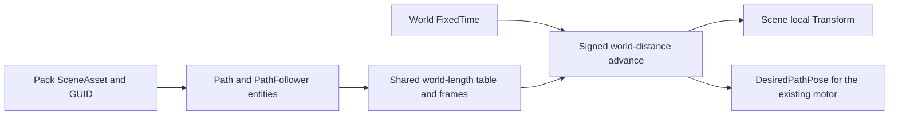

# `@forgeax/engine/path`

> [!IMPORTANT]
> Ordinary SceneAsset data owns saved paths and follower bindings. ECS FixedUpdate owns distance; Scene or the game's physics motor owns actual motion. This package owns no file format, GUID registry, renderer, or clock.



## Smallest useful example

```ts
import { createWorldContext, World } from '@forgeax/engine/ecs';
import { Path, PathFollower, pathPlugin } from '@forgeax/engine/path';

const world = new World();
const context = await createWorldContext(world, [pathPlugin()]);
const path = world.spawn({ component: Path, data: {
  points: new Float32Array([0, 0, 0, 2, 4, 0, 8, 0, 0]),
  subdivisions: 2048,
} }).unwrap();
const follower = world.spawn({ component: PathFollower, data: { path, speed: 2 } }).unwrap();
world.update(1 / 60).unwrap();
world.despawn(follower).unwrap();
world.despawn(path).unwrap();
await context.fiber.dispose();
```

Use the normal Pack source, Catalog `loadByGuid<SceneAsset>`, Scene instantiation and `rootsToSceneAsset` save route for durable content. `PathFollower.path` is an ECS `entity` field, so authored Scene entity keys become instance-local bindings and save back to keys. Two scene instances never share mutable follower state. Multiple followers of one Path entity share its preparation. Separate Path entities have independently transformed preparations; sharing is per path instance, not a global cache.

## Authored contract

| Component / field | Meaning |
|:--|:--|
| `Path.points` | 2–4096 finite Float32 XYZ controls in path-local coordinates. Consecutive duplicates are allowed; zero world length is rejected. |
| `closed` | Default false; closed curves wrap control points without duplicating the endpoint. |
| `parameterization` | `PathParameterization.uniform`, `.centripetal` (default), or `.chordal`. |
| `subdivisions` | Default 2048; integer 16–65536, at least the segment count. This is a table budget, rounded down to a multiple of the segment count so no lookup interval crosses a curve knot. |
| `up` | Nonzero finite local initial up direction, default +Y; magnitude is ignored. Converted by the path instance's linear transform. |
| `PathFollower.path` | Live Path entity in the same World. Null, deleted or removed bindings fail closed. Handles are World-local; bind another World through Scene keys, never copied numeric handles. |
| `distance` / `speed` | Float64 world units / signed world units per second. Initial distance defaults to zero, speed to one. |
| `paused` / `loop` | Pause freezes distance but follows a moving path instance. Loop wraps by positive modulo, including many periods in one step; otherwise endpoints clamp. |
| `followTangent` | Default true. False preserves the Scene rotation or leaves desired rotation unchanged. |
| `forwardAxis` / `upAxis` | Distinct signed axes from `PathAxis`; default +Z / +Y. A camera normally uses `.negativeZ` forward. |
| `roll` | Finite radians around the direction of travel, applied after the transported frame. Default zero. |
| `motion` | `PathMotion.scene` (default) writes local position/quaternion. `.desired` requires `DesiredPathPose` and publishes a world pose without writing Transform. |

Distance is normalized on each fixed step: retain its absolute world-unit value on control, precision, or scale changes, then wrap/clamp against the new length. A standard executable-session rebuild restores authored initial state; it does not implicitly restore game progress. Hosts persisting progress save their ordinary Scene data or restore follower distance explicitly. Catalog reimport publishes the same GUID with a new source revision; already-loaded Scene payloads retain their fixed version under the asset owner contract. Loading the new publication into a new App restores authored distance. Updating a live Path through World.set retains its current distance. The demo uses the standard Vite host reload on reimport.

## Frames, coordinates and authority

Preparation samples the original **local** Catmull–Rom and then transforms its samples. Transforming controls before evaluating a centripetal/chordal curve would change the curve under nonuniform scale. The table measures this transformed curve in world units. Any changed Path declaration or instance linear matrix rebuilds the complete table and frame data before followers run; translation alone reuses it. Rotating the instance rebuilds orientation too. Movement of the instance adds carrier velocity; `speed` specifies relative travel along the current world-space track, not the sum of carrier and follower velocity.

Normals use discrete parallel transport. Initial vertical tangents choose the least-aligned axis deterministically. Antiparallel steps preserve the prior normal. Closed paths distribute residual frame twist by arc length, matching the first/last frame; this chooses a periodic frame rather than asserting zero holonomy. At a genuine cusp or stationary segment, no unique tangent exists: the bounded chord, then baked previous direction supplies a deterministic frame. Continuity through a mathematical cusp is not promised. Reverse speed faces the reverse tangent while retaining the transported up; an instantaneous speed sign change intentionally turns the model 180 degrees.

Current authored parent TRS is composed before Scene fixed propagation, so moving ancestors affect the same tick. Path/follower-parent hierarchies must be acyclic, depth ≤128, and have no follower-controlled ancestors; this removes ambiguous cyclic motion dependencies. Position uses affine inversion through an invertible parent matrix, including small scales that trigger the general math inverse's identity fallback. An unrepresentable Float32 local position reports `path-invalid-input` before writing Transform. Tangent orientation requires a positive uniform-scale rigid parent: a nonuniform/sheared/reflected parent cannot generally express an arbitrary orthonormal world frame with one local quaternion. It reports `path-parent-frame-unsupported`; disable tangent following or use an unscaled orientation parent.

> [!WARNING]
> `scene` motion rejects entities carrying RigidBody or Collider. Use `desired` motion and run the existing motor after `PATH_FOLLOW_SYSTEM`. The motor installs the transient `DesiredPathPose` component after Scene instantiation; save only its authored `PathFollower` configuration, never derived pose output. Respect `DesiredPathPose.valid` and `followTangent`. The physics backend or character owner writes actual displacement; the follower never teleports or directly writes a controlled body. This feature does not implement collision avoidance or platform passengers.

## Failure and lifecycle

Ordinary Scene compilation rejects malformed POD field types, out-of-range integers, Float32 overflow and wrong fixed-array lengths with its existing `asset-package-invalid` error before storage conversion. Path domain validation then rejects zero length, invalid table budgets and degenerate instance transforms.

`PathErrorCode` derives from the closed union in [errors.ts](src/errors.ts). Invalid declarations/steps, lost bindings, competing motion owners and unsupported parent frames carry `expected`, `hint` and discriminated `detail`. A system failure travels through the existing ECS system-error path; remove/rebind the invalid follower and follow World recovery policy. A lost binding clears desired validity before failing. Preparation checks all changed paths before any follower writes, so a rejected new declaration cannot pair new controls with an old table.

Native Cordis detach removes the system and clears derived buffers. Component leases follow the existing ECS registry rule: vocabulary still used by live entities remains registered when lease release reports component-in-use; remove owned entities before detach to release that vocabulary. Rebuild installs one fresh contribution in its World. Deleting a follower needs no explicit unbind. Deleting/removing a path makes remaining bindings fail closed; it does not preserve a ghost path. ECS change evidence is authoritative: edit with World/Commands, never mutate a read view behind the World.

## Pure sampling and validation

`preparePath(definition, affineMatrix?)` returns a Result with private immutable buffers. `createPathSample()` allocates explicit caller scratch; `PreparedPath.sample(...)` writes it. The sample position includes the matrix's linear part; add the instance's current translation. `parameterAtDistance` is bounded binary search. `advancePathDistance` accepts explicit delta seconds for numerical consumers; the ECS plugin only reads FixedTime.

Arc length is approximate. The [validation contract and raw evidence](VALIDATION.md) state tested ranges, independent integration, falsifiers and performance limits. `pnpm test` runs real World regressions; `node bench/accuracy.mjs` runs independent precision checks after building; `pnpm bench` records complete World and isolated kernels. The [self-contained demo](../../apps/perf/path-follow) loads a saved Pack Scene and renders patrols, a camera rail, and a physical motor consuming desired platform motion.
