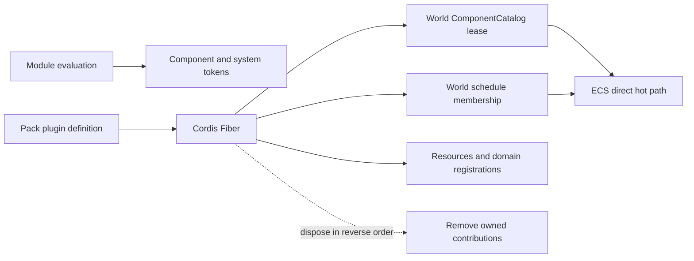

# @forgeax/engine-plugin

The public `@forgeax/engine/plugin` entry re-exports **Cordis 4.0.4** and adds a thin asset mount boundary. Pack owns persistent plugin definitions; Cordis owns live Context, Plugin, Fiber, effect and provide semantics.

| Identity | Authority |
|:--|:--|
| Asset GUID | Pack namespace and output sourceKey |
| Program | Portable logical module plus explicit export |
| Installed instance | Native Fiber within one session and Context |

## Read, mount, start

Author small behaviors as named exports in their owning `.pack.ts`; keep `default` for the Pack
definition. Larger implementations can live in ordinary TypeScript modules referenced by that
Pack. There is no required `plugin.ts` filename or independent file-based activation path.

`build()` generates definitions and configuration; runtime `apply()` owns the reversible work.
See the feature Packs in [game-3d](../../templates/game-3d/README.md#behavior-packs) for same-file,
separate-module, and npm implementations with cross-Pack GUID references.

`assets.loadByGuid<PluginAsset>()` reads a definition without evaluating its code or preloading its references. `mountPluginAsset(ctx, guid)` resolves a compiled implementation, clones configuration, establishes asset origin before installation, and returns the actual native Fiber in a Result. The host injects `assets.readPluginDefinition` and `pluginPrograms`; this package does not import the asset runtime.

```ts
import { mountPluginAsset } from '@forgeax/engine/plugin';
import type { Plugin } from '@forgeax/engine/plugin';

const root: Plugin.Object<{ children: readonly string[] }> = {
  inject: ['assets', 'pluginPrograms'],
  async apply(ctx, config) {
    for (const guid of config.children) {
      const result = await mountPluginAsset(ctx, guid);
      if (!result.ok) throw result.error;
    }
  },
};
export default root;
```

> [!IMPORTANT]
> Run `startPluginAsset` or `startNativePlugin` from the external host. It checks native descendants until active, failed, cancelled or timed out. Calling a descendant-wide barrier inside a parent apply can deadlock children that inject the parent's service. Native `Fiber.await()` alone can return while pending.

`inspectPluginFiber` projects native state and missing services. Asset origin carries the source and session identity, not another installation state. Disposal remains native; domain owners must verify their contributions were released. Source/config updates rebuild the session in a fresh page or Worker. Compilation failure may retain the running session; startup failure after replacement does not restore game progress.

Failed startup and explicit `disposePluginFiber(fiber, timeoutMs?)` share the
same bounded observation of native disposal and `Fiber.await()`, returning
`cleanup: completed | failed | timeout` with an optional cause. Cordis can log
effect cleanup failures while resolving `dispose()`. The temporary logger
exporter observes only the owned native tree and remains on its surviving parent
Context; it is removed when observation ends. Explicit disposal requires an
installed plugin Fiber and defaults to 5,000 ms. Keep the parent owner alive
until the result returns.

Failed or timed-out cleanup does not authorize an in-place retry. The caller
retains that result until the execution environment is retired, even when the
native Fiber disappears or pending work later settles. This observation does
not audit arbitrary program side effects or later unobserved disposals.

## Tools

A plain Plugin uses `registerAssetTools(ctx)` for a generated pure-data contract or `registerTools(ctx, contributions, origin)` for an explicit host-owned contribution. Register the returned disposer in `ctx.effect`; it revokes admission and drains active calls. Contract discovery never installs a plugin or runs a Cooker. A provider's identity includes the session, Context, asset and native Fiber; an unqualified tool ID with multiple providers is ambiguous.

`PluginPrograms.tools` contains serializable `ToolCommandContract` values by asset
GUID. Delivered `executor` fields select entries in the existing `programs` map;
export selection is already resolved. Registration validates all declarations and
captures those entries before publishing a provider. Only a tool run calls its
executor's loader. A missing declared entry is invalid delivery; a declaration
without an executor retains `tool-capability-unavailable`. An explicit empty
contract records that the producer found no tools for this asset and target.
The map is required and its GUID membership is also the current target's
installation qualification. Definitions without membership remain readable;
sharing another asset's program key does not authorize installation. Revoking
membership cancels a pending mount before native activation.

Tool plugins declare `toolApi` in `inject`. `registerAssetTools` reads the
installation's program projection itself, so callers need no additional
`pluginPrograms` dependency. Its captured executors survive later publication
updates or withdrawal until the owning Fiber is disposed.

Program entries expose lazy `load()` and optional asynchronous `exportSource()`.
Export returns the exact portable `PackProgram` without evaluating its implementation;
it does not capture native Fibers or installed services. The asset publication owner
freezes membership and tool contracts before awaiting these producer exports.

Source contracts and program compilation live in [Pack](../pack/README.md) and [DevKit](../devkit/README.md). The reviewed migration design is [plugin-assets-design.md](docs/plugin-assets-design.md).

## Loader migration

The project no longer installs `cordis-plugin-loader`. Pack replaces its persistent
Entry authoring layer; native Cordis still owns every live installation.

| Previous responsibility | Current owner |
|:--|:--|
| Entry identity and configuration | PluginAsset GUID and Pack configuration |
| Module resolution | Build-generated literal program imports |
| Entry tree activation | Root GUID followed by native plugin composition |
| Live installation and reversible work | Cordis Context, Fiber, inject, provide and effect |
| Entry reconciliation and rollback | Source/configuration edits rebuild the session |

Compilation failure can retain the running session. Once a replacement session starts,
startup failure does not restore the previous World or game progress. External DSH hosts
retain their own native Loader; federation does not replace that host's lifecycle.

Project placement follows the physical execution boundary: `roots.host` for the resident Node
backend, `roots.frontend` for browser UI, `roots.engine` for World behavior, and `roots.build`
for isolated producers. Each root references the same PluginAsset definition contract.

## Native Cordis foundation

A standalone host can create a World context and dispose an individual native Fiber:

```ts
import { createWorldContext } from '@forgeax/engine/ecs';
import optionalGameFeature from './optional-game-feature';
import projectPlugin from './project-plugin';

const ctx = await createWorldContext(world, [projectPlugin]);
const fiber = await ctx.plugin(optionalGameFeature);
await fiber.dispose();
```

| Cordis primitive | ForgeaX use |
|:--|:--|
| `Context` | Capability scope for one App, Worker realm, or standalone World |
| `Plugin.inject` | Declares dependencies such as `world`, `renderer`, and `assets` |
| `ctx.provide` | Publishes a domain service tracked by dependencies |
| `ctx.effect` | Registers a system, resource, listener, or host object with its inverse |
| `Fiber` | State, update, and disposal for one activation |
| `Context.isolate` | Separates same-named service scopes without another container |

`EngineContextServices` is the only ForgeaX type extension point. Domain packages augment native `Context` with services such as `world`, `input`, `audio`, and `physics`; the augmentation adds no runtime layer.

## Engine built-in profiles

Engine built-ins use the same native Plugin/Fiber contract as project roots.
App selects a small static profile for browser-main, Engine Worker, or
assemble-form execution; profile arrays express product defaults while
`inject/provide` remains the dependency authority. A test derives the bounded
first-party graph to reject missing providers, duplicate providers, and cycles.
There is no production DAG planner or per-frame plugin dispatch.

Canvas input acquisition, Renderer ownership, simulation participants, debug
draw, execution transport, remote server, and browser bridge all register their
inverse in the owning Fiber. `App.dispose()` drains that realm; it does not run
a second cleanup array. Engine Worker rebuild disposes the previous realm before
publishing the replacement.

## Component, system, and Fiber

A plugin owns reversible runtime contributions, not JavaScript module evaluation. Component and system tokens are vocabulary; installing them into one World creates lifecycle state.

`defineComponent` and `defineSystem` publish tokens as vocabulary. Unloading removes the World-local lease, schedule membership, and owned data; it does not delete imported token objects or invalidate archetypes in another World.



| Layer | Removed with the Fiber? |
|:--|:--|
| Imported module and frozen token objects | No; ESM cache is a realm concern |
| Component registration in one `World.components` catalog | Yes, through its lease |
| System membership in one schedule | Yes, through `world.removeSystem` |
| Plugin-owned entity/component value | Yes, when the Fiber owns it |
| Resource, listener, loader, Renderer feature, or host object | Yes, through its domain disposer |

Register World vocabulary and its consumers in one generator effect. Yield each inverse immediately so partial activation and normal disposal share the same reverse order:

```ts
import { defineComponent, defineSystem, Update } from '@forgeax/engine/ecs';
import type { Plugin } from '@forgeax/engine/plugin';

const Position = defineComponent('Position', { x: 'f32' });
const movement = defineSystem({
  name: 'movement',
  queries: [{ write: [Position] }],
  fn: () => undefined,
});

const plugin: Plugin = {
  name: 'movement',
  inject: ['world'],
  apply(ctx) {
    ctx.effect(function* () {
      const componentLease = ctx.world.components.register(Position).unwrap();
      yield () => componentLease.dispose().unwrap();

      ctx.world.addSystem(Update, movement).unwrap();
      yield () => ctx.world.removeSystem(Update, movement.name).unwrap();
    }, 'movement/world-contributions');
  },
};

export default plugin;
```

Disposal removes the system before releasing the component registration. The final component lease returns `component-in-use` while a live entity or registered system still references the token, preventing a half-unloaded World. The same token can be registered in two Worlds; each World owns an independent lease.

## Ownership rule

Cleanup follows ownership, not access. A plugin removes an entity or component value only if it created or exclusively owns it. Shared game state needs an explicit owner; it must not be inferred from which systems happened to read it.

For plugin-owned entities, yield `world.despawn(entity)` immediately after `spawn`; for a value added to a borrowed entity, yield only the matching `removeComponent`. Because generator effects unwind in reverse order, register data cleanup before system cleanup so the system is removed first.

## Control plane, not data plane

“Everything is a plugin” means every independently reversible capability has a Fiber. It does not turn
component schemas, system definitions, query descriptors, pure helpers, entities, or per-frame rows into
Fiber objects. A project root plugin may share the World's lifetime; replacing the whole game then
rebuilds the World instead of maintaining a second ownership graph for every entity.

A clean disposal leaves no active schedule entry, World lease, resource, listener, Host object, or
plugin-owned ECS value from that Fiber. Imported component and system tokens may remain in the ESM realm
and token vocabulary: they are inert declarations, not a live capability or unmanaged side effect.

## Failure and performance boundaries

Asset mounting and startup failures preserve their original Cordis/domain cause. App boundaries may project them into an App error, but there is no second generic plugin error state machine.

`createApp()` reports activation failure as `app-plugin-activation-failed` and preserves the original value in `detail.cause`.

After activation, systems remain direct schedule records, component tokens remain archetype/query identities, and services are cached references. `World.update()`, render extract/prepare/record, and audio/physics ticks do not query Context or Fiber.
