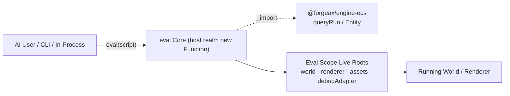
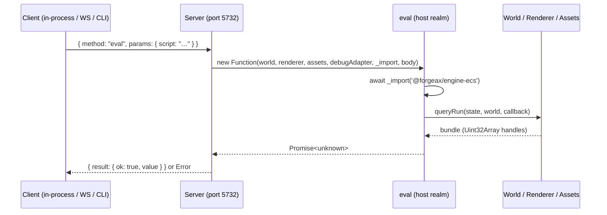
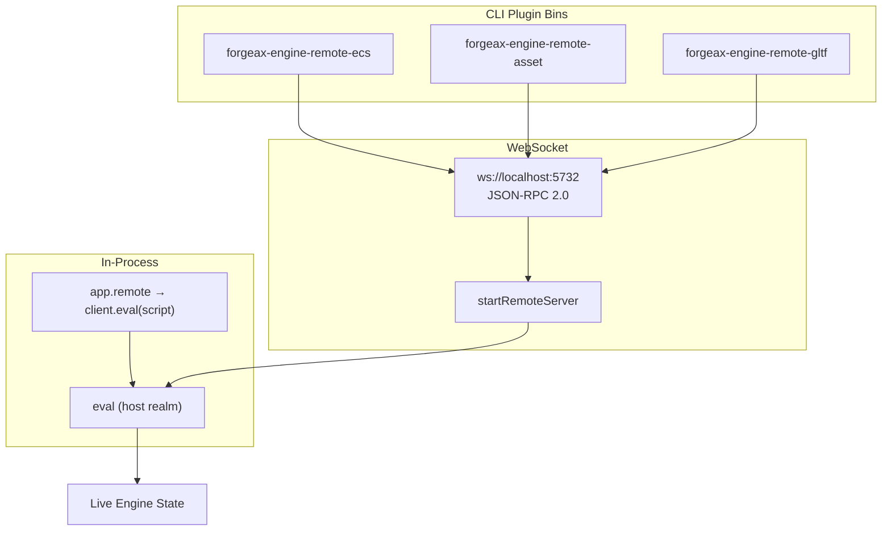

# @forgeax/engine-remote

> **Single capability — `eval` a live engine.** Send a JavaScript snippet to a running engine instance, have it executed against the live World / Renderer / AssetRegistry, and receive a structured result. Aligned with [Bevy BRP](https://github.com/bevyengine/bevy/discussions/15323) and [Unreal Remote Control](https://dev.epicgames.com/documentation/en-us/unreal-engine/remote-control-api-http-reference-for-unreal-engine) — "evaluate code against a live instance" rather than "attach a debugger UI panel." Four live roots injected into eval scope (`world`, `renderer`, `assets`, `debugAdapter`); `_import(specifier)` for dynamic ESM imports. No Registry, no pre-built commands, no read-only sandbox. A `switch` over the 4-member `RemoteErrorCode` closed union is the only error vocabulary.



## Overview

`@forgeax/engine-remote` provides a **single execution channel**: send a script string, get a `Result<unknown, RemoteError>` back. The package ships as:

| Role | Entry | Shape |
|:--|:--|:--|
| In-process client | `client.eval(script)` | Direct `async` call within the host process — zero network overhead |
| WS JSON-RPC 2.0 server | `ws://localhost:<port>` `{"method":"eval","params":{"script":"..."}}` | Host embeds via `startRemoteServer`; external tools (CLI / AI agents) connect over WebSocket |
| CLI plugin bins | `forgeax-engine-remote-{ecs,asset,gltf,font,state}` | Standalone binaries per capability package; called out-of-process; discoverable via `PATH` prefix scan |

All three paths converge on the same `eval(script)` protocol. The `createApp` entry point wires the server by default in dev mode (`app.remote` is non-undefined, port > 0) and leaves it off in production — **the only safety boundary is whether the host starts the server.**



## Eval Recipes

### Prerequisites

Four live roots are always present in eval scope:

| Root | Type | Purpose |
|:--|:--|:--|
| `world` | `World` (from `@forgeax/engine-ecs`) | ECS read/write: `spawn`, `despawn`, `set`, `queryRun` |
| `renderer` | `Renderer` | Renderer control: create/destroy render targets, read backbuffer |
| `assets` | `AssetRegistry` | Asset queries: `loadByGuid`, `resolveName`, `rename` |
| `debugAdapter` | `DebugRhiAdapter \| undefined` | RHI frame capture: `captureFrame({...})`, `inspectAt({...})`. **Only defined when the app was created with `FORGEAX_ENGINE_RHI_DEBUG=1`** (else `undefined` — guard before use). |

A fifth injection — `_import(specifier)` — enables dynamic ESM imports inside eval scope. **Plain `import` keyword is NOT available**; scripts use `await _import('@forgeax/engine-ecs')` to pull in engine packages.

> [!NOTE]
> `debugAdapter` is conditional: it is injected only when `createApp` ran under `FORGEAX_ENGINE_RHI_DEBUG=1` (the rhi-debug recorder path). Without that flag it is `undefined`, so frame-capture scripts must `if (debugAdapter) { ... }` or check for the flag first. The other three roots (`world` / `renderer` / `assets`) are always present.

### Handle Discovery

The only way to discover entity handles inside eval is through `queryRun` — zero new ECS API. **Use the real callback form**: `queryRun(state, world, (bundle) => { ... })` returns `void`; results arrive inside the `bundle` parameter.

```js
// Step 1: import ECS package inside eval
const ecs = await _import('@forgeax/engine-ecs');

// Step 2: create a query for all entities (Entity is the id=0 essential component)
const state = ecs.createQueryState({ with: [ecs.Entity] });

// Step 3: run the query — results land in the bundle callback
let handles;
ecs.queryRun(state, world, (bundle) => {
  // bundle.Entity.self is Uint32Array of all matching entity handles
  handles = Array.from(bundle.Entity.self);
});
// handles is now number[]
```

**With component data — read position of all MeshRenderers:**

```js
const { createQueryState, queryRun, Entity, Transform, MeshRenderer } = await _import('@forgeax/engine-ecs');

const state = createQueryState({ with: [MeshRenderer, Transform, Entity] });
let results = [];
queryRun(state, world, (bundle) => {
  for (let i = 0; i < bundle.Entity.self.length; i++) {
    results.push({
      entity: bundle.Entity.self[i],
      x: bundle.Transform.position.x[i],
      y: bundle.Transform.position.y[i],
      z: bundle.Transform.position.z[i],
    });
  }
});
```

### Read Component Values

```js
const ecs = await _import('@forgeax/engine-ecs');
const state = ecs.createQueryState({ with: [ecs.Transform, ecs.Entity] });

ecs.queryRun(state, world, (bundle) => {
  for (let i = 0; i < bundle.Entity.self.length; i++) {
    const h = bundle.Entity.self[i];
    const px = bundle.Transform.position.x[i];
    const py = bundle.Transform.position.y[i];
    const pz = bundle.Transform.position.z[i];
    // Use h, px, py, pz
  }
});
```

### Write / Lifecycle

```js
// Spawn with components
const h = world.spawn([new Transform({ position: [0, 5, 0] })]);

// Set — mutate existing component values
world.set(h, new Transform({ position: [1, 2, 3] }));

// Despawn
world.despawn(h);
```

> [!IMPORTANT]
> Eval is full-access — no write interception, no `inspector-write-denied` error code, no `ECS_MUTATING_METHODS` blacklist. `spawn` / `set` / `despawn` execute directly. See [Transport and Security](#transport-and-security) for the safety model.

### Frame Capture via debugAdapter

```js
// Capture the current steady-state frame
const tape = await debugAdapter.captureFrame({ label: 'my-snapshot' });
// tape.frameModel is a structured FrameModel — shared SSOT with RHI debug viewer and CLI `summary`

// Per-draw inspection
const draw = await debugAdapter.inspectAt({ tape, drawIdx: 3 });
// draw: { pipelineState, bindings, renderTargetPNG }
```

Offline CLI subcommands (`inspect-offline`, `summary`, `trigger-browser`) do not connect over WebSocket and are not routed through eval. See `@forgeax/engine-rhi-debug` README for the full capture/inspect/summary workflow.

## RemoteErrorCode

`RemoteErrorCode` is a **4-member closed union**. TypeScript `switch (err.code)` exhaustiveness is enforced at compile time — no `default` branch. The JSON-RPC 2.0 numeric segment `-32001..-32004` maps 1:1 to the 4 members.

| code | JSON-RPC | `.expected` | `.hint` |
|:--|:--|:--|:--|
| `script-syntax-error` | -32001 | `'script body is valid JavaScript'` | `'check syntax position in errMessage; fix and resubmit'` |
| `script-runtime-error` | -32002 | `'script executes without throwing'` | `'inspect error; verify symbol availability; eval has full access to world/renderer/assets'` |
| `server-startup-failed` | -32003 | `'server starts successfully on requested port'` | `'check if port is already in use (default 5732); pass different port; or kill existing process holding the port'` |
| `server-not-running` | -32004 | `'server is reachable at ws://localhost:<port>'` | `'start the demo first; verify app.remote is wired; pass --port to override default 5732'` |

Each `RemoteError` instance carries the structured triple (`.code` / `.expected` / `.hint`) plus an auto-composed `.message` for human stack traces. AI users consume via property access — never by parsing `.message`.

```ts
import { RemoteError, type RemoteErrorCode } from '@forgeax/engine-remote';

function recover(code: RemoteErrorCode): string {
  switch (code) {
    case 'script-syntax-error':   return 'fix script body syntax and resubmit';
    case 'script-runtime-error':  return 'inspect stack trace; verify symbol availability';
    case 'server-startup-failed': return 'pick a different port or free port 5732';
    case 'server-not-running':    return 'start demo dev or wire app.remote';
  }
}
```

The SSOT split: the **type alias** `RemoteErrorCode` and **structural interface** `RemoteError` live in `@forgeax/engine-types` (parallel to `ShaderErrorCode`). The **runtime class** (`RemoteError extends Error implements RemoteErrorShape`) lives in `packages/remote/src/errors.ts`.

```mermaid
stateDiagram-v2
    direction LR
    script-syntax-error: script body has syntax error
    script-runtime-error: script threw at runtime
    server-startup-failed: server cannot bind port
    server-not-running: no server to connect to
```

## Transport and Security

### Transport Paths



| Path | Method | Use Case |
|:--|:--|:--|
| In-process | `const result = await client.eval('world.inspect().entityCount')` | Host self-inspection; zero network cost |
| WebSocket | `ws://localhost:5732` send `{"method":"eval","params":{"script":"..."}}` | External AI agents / CLI tools attaching to a running app |
| CLI plugin bin | `forgeax-engine-remote-ecs entities` | Offline / out-of-process data tools; each bin is a standalone executable |

The wire protocol exposes **two** JSON-RPC methods: `eval` (the single capability above) and `introspect`. Send `{"method":"introspect"}` to get an OpenRPC L2 subset document listing the available methods (`eval` / `introspect`) and the eval-scope live roots — an AI agent can self-describe the surface without reading source. Recoverable failures map to JSON-RPC error codes `-32001..-32006` (the 4-member `RemoteErrorCode` union; see above).

### Security Model

> [!IMPORTANT]
> **The only safety boundary is whether the host starts the server.** Eval is full-access — no code-level interception, no method blacklist, no read-only proxy. Dangerous APIs (`renderer.dispose()` destroys GPU context and crashes the app; `world.despawn` can wipe all entities; `AssetRegistry.clear()` etc.) are executable inside eval.

| Mode | `app.remote` | Server running? | Safety |
|:--|:--|:--|:--|
| Dev (`import.meta.env.DEV`) | `RemoteHandle` (non-undefined, port > 0) | Yes — auto-started by `createApp` | **Developer's responsibility** — do not eval scripts containing destructive API calls |
| Production | `undefined` | No — `createApp` skips server startup | **Safe by default** — no eval entry point exists |
| Headless / dawn-node | `undefined` (default) | No — unless `FORGEAX_REMOTE_SERVER=1` opt-in | **Safe by default** — explicit opt-in required |

> [!CAUTION]
> **Dangerous API NOTE** — eval is full-access, read/write. Scripts can call `renderer.dispose()` (destroys GPU context, crashes the app), `world.despawn` (bulk-removes entities), `AssetRegistry.clear()`, and other destructive operations. The engine applies no code-level guard. Production safety comes from the server being off by default; dev safety relies on developer discipline. AI users: verify scripts do not contain destructive API calls before eval in dev mode.

## Physical Isolation

The engine bundle is physically isolated from the remote package — `@forgeax/engine-remote` never imports `@forgeax/engine-{runtime,ecs,pack,gltf}`, and the engine bundle never references `@forgeax/engine-remote`. Seven grep gates enforce this bidirectionally:

| Gate Script | Direction | What It Guards |
|:--|:--|:--|
| `check-engine-no-console-dep.mjs` | Engine -> Remote | Engine bundle (runtime/*) must not contain `@forgeax/engine-remote` literal or named leaks (`RemoteHandle`, `RemoteError`) |
| `check-console-not-in-engine-bundle.mjs` | Engine -> Remote | Engine dist bundle must not carry remote package literals |
| `check-console-not-import-engine.mjs` | Remote -> Engine | Remote package must not import `@forgeax/engine-{runtime,ecs,pack,gltf}` (4 surfaces: deps, peerDeps, src imports, literals) |
| `check-no-string-sugar.mjs` | Remote internal | No `buildXxxScript` string-sugar identifiers in remote `src/` |
| `check-no-help-string-array.mjs` | Remote internal | No hand-rolled `--help` string arrays in remote `src/` |
| `check-no-cli-deps.mjs` | Remote internal | No commander/yargs/cac/sade deps in remote `package.json` |
| `check-readme-sections.mjs` | Remote internal | This README's 5 H2 section headings are character-exact present |