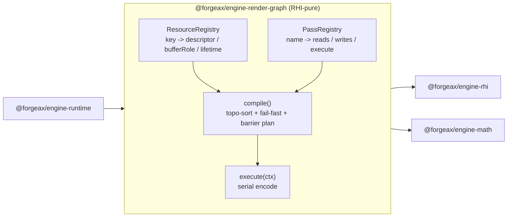
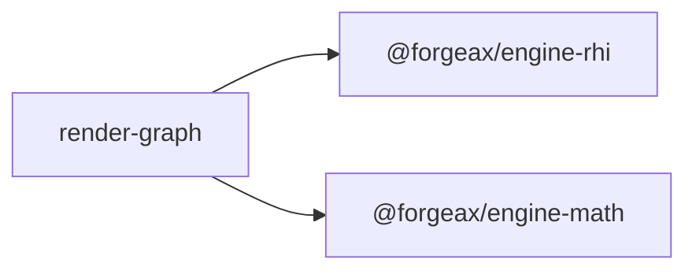

# @forgeax/engine-render-graph

> Declarative render-graph pipeline: declare pass I/O as string keys, let the graph manage texture lifecycle and barriers.

## Proposition

**AI users**: replace "open a 2473-line record file, copy-paste texture lazy-alloc templates 4 times, hand-write beginRenderPass + bindgroup creation" with a few `graph.addPass({ reads, writes, execute })` declarations. The graph owns resource lifecycle and barrier insertion; your `execute` closure is the only custom logic.



- **RHI-pure** -- depends only on `@forgeax/engine-rhi` and `@forgeax/engine-math`; never touches `@forgeax/engine-runtime`, ECS World, or PipelineState. The `compile()` allocation phase holds an `RhiDevice` interface handle (passed in via `CompileOptions.device`) to call `createTexture` / `createTextureView` / `createSampler` for `addColorTarget` resources, including MSAA multi-sample colour + depth targets — handle-only, no concrete backend import.
- **Resource-owning** -- `addColorTarget(name, desc)` declares transient / persistent / aliased GPU textures; `compile()` allocates the physical textures via the `RhiDevice` handle, pools by `{format, w, h, usage, sampleCount}`, and folds explicit alias chains (KB-1 / D-2). Pass closures resolve names to `TextureView` via the per-pass `resolve(name)` context.
- **Declarative** -- resources and passes are string-key schemas (`reads: string[]` / `writes: string[]`). The graph derives scheduling, barriers, and lazy-allocation from them.
- **Fail-fast** -- `compile()` returns a structured `Result<T, RenderGraphError>` with 7 error codes (`dangling-read` / `cap-missing` / `cyclic-dependency` / `duplicate-resource` / `unknown-resource` / `resource-alloc-failed` / `invalid-format`); TS `switch (err.code)` is exhaustive with no `default` fallback.
- **Minimal viable** -- Godot RDG benchmark (~600 LOC); no pass auto-reorder.

## API

### RenderGraph

```ts
import { RenderGraph } from '@forgeax/engine-render-graph';
import type { PassDescriptor, ResourceDescriptor } from '@forgeax/engine-render-graph';
```

| Method | Signature | Purpose |
|:--|:--|:--|
| `addResource` | `(key: string, desc: ResourceDescriptor) => Result<ResourceEntry, RenderGraphError>` | Declare a named resource (texture or buffer) |
| `addPass` | `(name: string, desc: PassDescriptor<Ctx>) => PassEntry<Ctx>` | Declare a Graph Pass with `reads` / `writes` / `execute` |
| `compile` | `(opts: CompileOptions) => Result<InternalizedGraph, RenderGraphError>` | Topo-sort + fail-fast validate + barrier plan |
| `execute` | `(ctx: Ctx) => void` | Iterate passes in compiled order, calling each `execute` closure |
| `listPasses` | `() => readonly PassInfo[]` | Enumerate all registered passes with their reads/writes |
| `listResources` | `() => readonly ResourceInfo[]` | Enumerate all registered resources with key/kind/lifetime |

### ResourceDescriptor

```ts
interface ResourceDescriptor {
  readonly kind: 'texture' | 'buffer';
  readonly lifetime: 'transient' | 'persistent';
  readonly bufferRole?: 'auto-storage-or-uniform' | 'uniform';
}
```

| Field | Required | Values | Purpose |
|:--|:--|:--|:--|
| `kind` | yes | `'texture'` / `'buffer'` | Resource type |
| `lifetime` | yes | `'transient'` / `'persistent'` | Transient = frame-internal (destroyed on resize); persistent = cross-frame (keyed by swap-size or mapSize) |
| `bufferRole` | no (buffer only) | `'auto-storage-or-uniform'` / `'uniform'` | `'auto-storage-or-uniform'` selects storage when `caps.storageBuffer === true`, uniform otherwise; `'uniform'` forces uniform always |

### PassDescriptor

```ts
interface PassDescriptor<Ctx = unknown> {
  readonly reads: readonly string[];
  readonly writes: readonly string[];
  readonly execute?: (ctx: Ctx) => void;
  readonly compute?: boolean;
  readonly storageBuffer?: boolean;
}
```

| Field | Required | Purpose |
|:--|:--|:--|
| `reads` | yes | Resource keys this pass reads |
| `writes` | yes | Resource keys this pass writes |
| `execute` | no | Closure called during `execute(ctx)`; receives the typed context (`Ctx`) |
| `compute` | no | When `true`, `compile()` checks `caps.compute` (fail-fast if missing) |
| `storageBuffer` | no | When `true`, `compile()` checks `caps.storageBuffer` (fail-fast if missing) |

### CompileOptions

```ts
interface CompileOptions {
  readonly backendKind: 'webgpu' | 'wgpu-native' | 'wgpu-webgl2';
  readonly caps: RhiCaps;
}
```

`backendKind` drives barrier planning (see [Barrier semantics](#barrier-semantics)).

### Query interfaces (D-5)

```ts
interface PassInfo {
  readonly name: string;
  readonly reads: readonly string[];
  readonly writes: readonly string[];
}

interface ResourceInfo {
  readonly key: string;
  readonly kind: 'texture' | 'buffer';
  readonly lifetime: 'transient' | 'persistent';
}
```

`listPasses()` / `listResources()` return these read-only arrays. AI users call them to discover what passes exist, who writes each resource, and where to hook in a new pass.

### InternalizedGraph

`compile()` returns `Result<InternalizedGraph, RenderGraphError>`:

```ts
interface InternalizedPass {
  readonly name: string;
  readonly reads: readonly string[];
  readonly writes: readonly string[];
  readonly barriers: readonly string[];
}

interface InternalizedGraph {
  readonly passes: readonly InternalizedPass[];
}
```

The `barriers` array carries resource keys that need barriers before this pass executes. It is non-empty only on `wgpu-native` backends (see [Barrier semantics](#barrier-semantics)).

## Minimal usage

```ts
const graph = new RenderGraph<MyContext>();

// 1. Declare resources
graph.addResource('depth', { kind: 'texture', lifetime: 'persistent' });
graph.addResource('hdr',   { kind: 'texture', lifetime: 'transient' });

// 2. Declare passes
graph.addPass('shadow', {
  reads: [],
  writes: ['depth'],
  execute: (ctx) => { /* beginRenderPass + draw */ },
});

graph.addPass('main', {
  reads: ['depth'],
  writes: ['hdr'],
  execute: (ctx) => { /* beginRenderPass + draw forward */ },
});

// 3. Compile -- fails fast on dangling reads, cap mismatch, cycles
const compiled = graph.compile({ backendKind: 'webgpu', caps: device.caps });
if (!compiled.ok) {
  // compiled.error.code is a RenderGraphErrorCode -- switch exhaustively
  throw compiled.error;
}

// 4. Execute each frame
graph.execute(ctx);
```

## Error model

`RenderGraphErrorCode` is a closed 5-member union. All failures return `Result<T, RenderGraphError>` (never throw).

| Code | Trigger | `.detail` shape |
|:--|:--|:--|
| `'dangling-read'` | A pass `reads` a resource key that no pass `writes` | `{ resourceKey: string, passName: string }` |
| `'cap-missing'` | `compute: true` but `caps.compute === false`, or `storageBuffer: true` but `caps.storageBuffer === false` | `{ cap: 'compute' \| 'storageBuffer', passName: string }` |
| `'cyclic-dependency'` | Pass dependency graph contains a cycle (topo-sort failed) | `{ cycle: readonly string[] }` |
| `'duplicate-resource'` | Same resource key registered twice via `addResource` | `{ resourceKey: string }` |
| `'unknown-resource'` | A pass references a resource key that was never registered | `{ resourceKey: string, passName: string }` |

Every error carries four readonly fields aligned with the engine error convention (research Finding 8):

```ts
class RenderGraphError extends Error {
  readonly code: RenderGraphErrorCode;     // closed-union member -- primary signal
  readonly expected: string;               // expected-state description
  readonly hint: string;                   // actionable recovery guidance
  readonly detail: RenderGraphErrorDetail; // narrowed payload per code
}
```

**AI user self-recovery** -- AI users `switch (err.code)` for exhaustive handling:

| Error | AI recovery |
|:--|:--|
| `dangling-read` | Add a pass that `writes: [key]` or fix a typo in `reads` |
| `cap-missing` | Switch to a render-pass path or enable the cap on the backend |
| `cyclic-dependency` | Break the cycle among passes (cycle path in `.detail.cycle`) |
| `duplicate-resource` | Remove the duplicate `addResource` call |
| `unknown-resource` | Register the resource with `addResource` before referencing it |

`compile()` does **not** error on "dangling write" (a resource written but never read). This is intentional -- the output resource may be consumed by swap-chain display, Inspector readback, or a future downstream pass (plan-strategy D-5).

## Barrier semantics (AC-10)

Barrier insertion discriminates on **backend-kind**, not package name. The `rhi-wgpu` package hosts both a native desktop path and a WebGL2 sub-path (`--features webgl`); only the native desktop path needs explicit barriers.

| `backendKind` | Barrier behavior |
|:--|:--|
| `'webgpu'` | No explicit barriers (browser's WebGPU spec manages synchronization) |
| `'wgpu-webgl2'` | No explicit barriers (GL implicit synchronization) |
| `'wgpu-native'` | `compile()` inserts barriers between passes where a resource is written then read by a later pass |

The `backendKind` value comes from `RhiCaps.backendKind`, set by each backend's `createDevice` implementation (plan-strategy D-1). Pass it into `compile()`:

```ts
const result = graph.compile({
  backendKind: device.caps.backendKind,
  caps: device.caps,
});
```

## Capability fallback (AC-09)

**Uniform-vs-storage buffer role**. When `bufferRole: 'auto-storage-or-uniform'`, the graph selects `'read-only-storage'` when `caps.storageBuffer === true` and `'uniform'` when `false`. This mirrors the existing pattern in `pbr-pipeline.ts` (research Finding 7). Pass `bufferRole: 'uniform'` to force uniform regardless of caps.

**Compute cap gate** (AC-08). A pass with `compute: true` triggers cap-gate during `compile()`: if `caps.compute === false`, compile returns `'cap-missing'`. Same for `storageBuffer: true` + `caps.storageBuffer === false`. This gate is forward-looking -- current engine pass roster has zero compute passes (research Finding 2), but future bloom/SSAO/SSR passes will use it.

## Terminology: Graph Pass vs material pass (AC-12)

| Term | Meaning | In code |
|:--|:--|:--|
| **Graph Pass** | A render-graph pass node declared via `graph.addPass({ reads, writes, execute })` | `RenderGraph.addPass()`, `PassDescriptor` |
| **material pass** | A shader descriptor inside `MaterialAsset.passes[]` | `MaterialAsset.passes?: readonly MaterialPassDescriptor[]` |

`MaterialAsset.passes[]` retains its name (unchanged). Graph Pass is the framework concept; material pass is the shader-descriptor concept. Documentation and comments distinguish the two.

## Dependencies



| Dep | Why |
|:--|:--|
| `@forgeax/engine-rhi` | RHI handle types, caps, texture descriptor, Result pattern |
| `@forgeax/engine-math` | Math shapes (sizes, matrices) for resource descriptors |

Runtime (`@forgeax/engine-runtime`) consumes `@forgeax/engine-render-graph`. The dependency chain `runtime -> render-graph -> rhi` is acyclic (AC-03).

## Progressive disclosure (charter P1)

| Layer | Content | Audience |
|:--|:--|:--|
| Top (this section + Proposition) | What: declarative pass I/O, graph owns lifecycle + barriers | First-time reader deciding if this package fits |
| Middle (API tables) | How: full type signatures for addResource/addPass/compile/execute/listPasses/listResources | AI user adding a pass |
| Bottom (Error model + Barrier + Fallback) | Edge cases: 5 error codes with detail shapes, backend-kind discrimination, uniform-storage fallback | AI user debugging a compile failure |

Type signatures and error-code tables are the machine-readable SSOT (charter F2: text over images).

## Gating

A repo-root grep gate (`scripts/check-render-graph-no-runtime-import.mjs`) enforces the RHI-pure boundary: any `import ... '@forgeax/engine-runtime'` inside `packages/render-graph/src/` is a hard CI failure (AC-02). The gate is wired into `.github/workflows/ci.yml` lint job alongside the existing shader/app/image isolation gates (research Finding 9).

## Design constraints

| Constraint | Source |
|:--|:--|
| No pass auto-reorder -- passes keep declaration order | OOS-1 / plan-strategy D-5 |
| No transient memory aliasing (Frostbite-level reuse) | OOS-2 / Godot RDG baseline |
| Transient resources use whole-frame retention + size-drift rebuild | plan-strategy D-4 / research Finding 1 |
| IBL convolution + shadow probe passes excluded from graph | OOS-3 / OOS-4 (one-shot / on-demand passes) |
| Dangling write is silent (not an error) | plan-strategy D-5 (legal: swap-chain / Inspector readback) |
