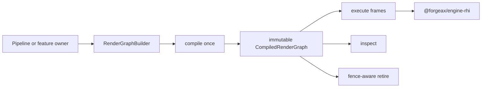
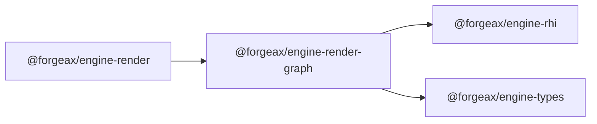

# @forgeax/engine-render-graph

> RHI-pure frame-graph kernel with typed resources, explicit accesses, graph-owned raster/compute/copy encoding, and immutable compiled graphs.

## Proposition

A graph author declares four facts once:

1. whether a resource is graph-created or imported;
2. which texture subresource or buffer a pass accesses;
3. the exact access mode;
4. the pass kind and declaration order.

The compiler derives physical usage, RAW/WAR/WAW dependencies, lifetime bounds, capability requirements, and pass-local resource visibility from those facts. It does not invent backend barriers or reorder a future writer before an earlier reader.


```mermaid
flowchart LR
  OWNER["Pipeline or feature owner"] --> BUILDER["RenderGraphBuilder"]
  BUILDER --> COMPILE["compile once"]
  COMPILE --> GRAPH["immutable CompiledRenderGraph"]
  GRAPH --> EXEC["execute frames"]
  GRAPH --> INSPECT["inspect"]
  GRAPH --> RETIRE["fence-aware retire"]
  EXEC --> RHI["@forgeax/engine-rhi"]
```

> [!IMPORTANT]
> Declaration order is the observable v1 execution order. An imported resource may be read first; a graph-created resource must be initialized before its first read.

## Primary API

```ts
import { RenderGraphBuilder } from '@forgeax/engine-render-graph';
import type { Buffer, RhiCommandEncoder } from '@forgeax/engine-rhi';

interface Frame {
  readonly encoder: RhiCommandEncoder;
  readonly particles: Buffer;
}

const builder = new RenderGraphBuilder<Frame>();
const particles = builder
  .importBuffer(
    'particles',
    { size: 64 * 1024, usage: GPUBufferUsage.STORAGE | GPUBufferUsage.VERTEX },
    (frame) => frame.particles,
  )
  .unwrap();

builder
  .addComputePass('simulate', {
    accesses: [{ resource: particles, usage: 'storage-read-write' }],
    encode: ({ pass }) => {
      pass.setPipeline(simulatePipeline);
      pass.setBindGroup(0, simulateBindings);
      pass.dispatchWorkgroups(256);
    },
  })
  .unwrap();

const compiled = builder
  .compile({ device, surfaceSize: { width: 1280, height: 720 } })
  .unwrap();

compiled.execute({ encoder, particles }).unwrap();
console.log(compiled.inspect());
await compiled.retire();
```

### Resource declaration

| Method | Ownership | Physical usage |
|:--|:--|:--|
| `createTexture` / `createBuffer` | Graph allocates and retires the handle | Derived from every declared access |
| `importTexture` / `importBuffer` | Caller resolves and owns the handle | Supplied usage must contain derived usage |
| `view` | Typed texture subresource | Mip, layer, aspect, dimension, and optional format are explicit |

Resource and pass labels are unique diagnostics. Handles are opaque and builder-scoped; passing a foreign handle is a structured error.

### Access vocabulary

| Buffer | Texture |
|:--|:--|
| `uniform-read` | `sampled-read` |
| `storage-read` | `storage-read` |
| `storage-write` | `storage-write` |
| `storage-read-write` | `storage-read-write` |
| `indirect-read` | `sampled-storage-read-write` |
| `vertex-read` | `color-attachment` |
| `index-read` | `depth-stencil-read` |
| `copy-src` / `copy-dst` | `depth-stencil-write` |
|  | `copy-src` / `copy-dst` |
|  | `sampled-storage-write` |

A raster attachment with `loadOp: 'load'` is a read/write access. A clear attachment is the first write. The compiler checks overlapping texture mip/layer/aspect ranges rather than treating unrelated subresources as one hazard.

`sampled-storage-write` declares a compute chain that fully writes a subresource
before sampling it in a later dispatch of the same pass. It derives both texture
and storage bindings without consuming incoming contents. Use
`sampled-storage-read-write` when incoming contents are read. Each dispatch must
still use valid, disjoint read/write subresources; the graph does not synchronize
threads inside one dispatch.

### Pass declaration

| Method | Encoder ownership |
|:--|:--|
| `addRasterPass` | Graph resolves attachments and owns `beginRenderPass` / `end` |
| `addComputePass` | Graph owns `beginComputePass` / `end`; optional `begin(frame)` supplies the descriptor and `after(frame)` runs after `end` |
| `addCopyPass` | Graph lends the frame command encoder for copy commands |

Each encode callback receives a pass-local resolver. Resolving a resource not declared in that pass is rejected.
Compute pass descriptors such as `timestampWrites` come from `begin`; the graph keeps the diagnostic
label. Compute work that targets the parent command encoder, such as resolving timestamp queries,
belongs in `after`; pass commands remain in `encode`. `onBeginError` lets the pass owner terminalize
feature-local evidence before the graph returns `pass-encode-failed`.

### Pass instrumentation

Renderer-owned instrumentation may be supplied as the third argument to
`compiled.execute(frame, runPass, instrumentation)`. The graph calls
`instrumentation.begin` immediately before each executable pass and applies the
returned descriptor decorator at the actual `beginRenderPass` or
`beginComputePass` boundary. This is the single seam for pass-level timestamp
queries and similar graph-neutral observation; it preserves pass name, kind, and
execution index without moving timing policy into the graph.

```ts
compiled.execute(frame, undefined, {
  begin: (pass) =>
    pass.kind === 'compute'
      ? {
          computePassDescriptor: (descriptor) => ({
            ...descriptor,
            timestampWrites: {
              querySet,
              beginningOfPassWriteIndex: 0,
              endOfPassWriteIndex: 1,
            },
          }),
        }
      : undefined,
});
```

The graph never calls a backend-specific command-encoder timestamp helper.
Pass instrumentation must preserve any producer-owned descriptor facts; a
policy owner that cannot merge an existing `timestampWrites` pair should fail
closed instead of overwriting it. Copy passes expose `beforeCopy`/`afterCopy`
hooks for non-timing instrumentation, but WebGPU has no portable copy-pass
timestamp descriptor.
> [!NOTE]
> `timestampWrites` and an `after(frame)` callback are neutral graph seams. They
> let a pipeline owner place a backend command at a declared pass boundary, but
> Render owns the `GpuPassTiming` session, decimal tick parser, bounded facts,
> four-status observation, and benchmark validator. RenderGraph must not import
> that timing contract, name a timing status, or decide whether a measurement is
> accepted. The public route is documented in
> [`@forgeax/engine-render`](../render/README.md).

## Compile and execution

`compile({ device, surfaceSize, reuseResourcesFrom? })`:

- seals the builder;
- validates descriptors, access conflicts, initialization, import usage, and capabilities;
- derives created-resource usage and lifetime intervals;
- allocates transactionally, rolling back all staged handles and shared leases on failure;
- returns a separate immutable `CompiledRenderGraph`.

The builder snapshots descriptor data when it accepts resources, views and passes.
Caller changes to arrays, attachment values or callback properties cannot alter
compiled execution or inspection. Opaque RHI handles retain their identity;
Explicit callbacks retain their original receiver, receive the current frame, and
may read live closure or receiver state. `occlusionQuerySet` accepts an opaque
query set or an explicit `(frame) => QuerySet | undefined` callback, evaluated
once per executed raster pass. Query-page rotation and idle/resumed frames use
that callback without rebuilding the graph; descriptor getters are snapshot data.

`executeIf(frame) === false` skips only that pass. Graph-created storage persists
until retirement: a skipped producer leaves its previous contents intact, including
the backend's initialized contents before its first write (zero for WebGPU buffers).
A newly compiled graph owns fresh storage, not the retired graph's history.
Dependencies and `uninitialized-read` validate declared access ordering; they do not
assert that a conditional producer executed or supplied business-valid data.
Consumers must accept the retained/initial contents, share the producer's condition,
or declare an unconditional clear/write before reading. Imported contents remain
the importing owner's responsibility. Dawn and browser byte-readback regressions
cover first skip, write, later skip and first execution after rebuild.

`execute(frame)` resolves imported handles for that frame and encodes passes in declaration order. `inspect()` returns a frozen projection of pass kinds, accesses, dependencies, resource origin, derived usage, lifetime bounds, and (for graph-created resources) `resourceAllocation`.

`inspect().resourceAllocation` is the single compiled-graph logical ledger:
`liveBytes` are graph-created handles currently live, and
`pendingRetirementBytes` are handles moved to retirement while the submission
fence is outstanding. `peakBytes` is that graph generation's simultaneous
logical high-water mark. Imported resources contribute an explicit owner row
and unknown byte size; they are never counted as graph-owned physical bytes.
`successfulAllocationCount` and `successfulAllocationBytes` count newly created
handles, excluding borrowed allocations. A resource row exposes a stable
`physicalAllocationKey` across generations and an `allocationState` of `live`,
`pending-retirement`, or `released`. Per-generation byte totals describe that
graph's leases; shared allocations must be deduplicated across generations.
`retire()` removes a token only after its lease releases successfully. A destroy
refusal, throw, or queue-fence failure leaves the bytes pending and returns
`resource-retire-failed`, so the renderer-wide cross-generation receipt can
keep the failed owner visible. For active/candidate/retiring generations,
read [`@forgeax/engine-render`'s allocation inspection](../render/README.md#renderer-wide-graph-allocation-inspection).

`reuseResourcesFrom` may name a live compiled graph on the same device. Exact
label and resolved physical descriptor matches share graph-created textures;
buffers and imported resources are not pooled. The successor still validates
initialization and accesses, and its first write must initialize the resource
before a read. Execute generations sequentially on the same device queue;
shared targets do not preserve a separate image for each graph. Resizing or a
descriptor change allocates separately. A failed candidate releases only its
leases, leaving the previous graph usable for rollback.

`retire()` first waits for `device.queue.onSubmittedWorkDone()`, then releases
its leases. The final texture lease destroys the handle exactly once. A
retiring graph cannot lend resources to a new compile. Imported resources are
never destroyed by the graph.

The older string-key `RenderGraph` descriptor surface remains limited to
feature-local staging and isolated legacy tests. Renderer frame ownership uses
`RenderGraphBuilder`; new pipeline and compute work must not add string resource
keys or call the facade's compile/execute path.

## Ordering and hazards

The compiler scans each resource/subresource in declaration order.

| Current access | Prior overlapping state | Dependency |
|:--|:--|:--|
| read | latest write | RAW |
| write | latest write | WAW |
| write | reads since latest write | WAR |

A later write never becomes the producer of an earlier read. This makes temporal multi-writer and ping-pong sequences unambiguous without a public resource-version type.

The RHI remains responsible for backend state transitions and synchronization. The graph exposes dependency evidence; it does not claim to insert a barrier that no RHI command executes.

## Capabilities

A compute pass requires `caps.compute`. Storage accesses require the matching storage-buffer or storage-texture capability, and indirect access requires indirect drawing support. Capability absence fails compilation with `capability-missing`; the pipeline or feature owner selects a fallback lane before graph construction.

v1 uses one command encoder and one primary queue. There is no `asyncCompute` option until the RHI exposes a real second queue, fences, and measured overlap evidence.

## Error model

All expected builder, compile, execute, and retire failures use `Result<T, RenderGraphError>`. Every error carries `code`, `expected`, `hint`, and code-correlated `detail`.

The closed union covers these groups:

| Phase | Codes |
|:--|:--|
| Declaration | `duplicate-pass-name`, `duplicate-resource-label`, `builder-sealed`, `foreign-resource-handle`, `alias-source-missing` |
| Access analysis | `resource-not-declared-by-pass`, `uninitialized-read`, `access-conflict`, `import-usage-mismatch` |
| Compile | `capability-missing`, `resource-descriptor-invalid`, `resource-allocation-failed` |
| Execute | `resource-resolution-failed`, `pass-encode-failed`, `compiled-graph-retired` |
| Retire | `resource-retire-failed` |

The package still contains the existing string-key `RenderGraph` facade while standard renderer raster consumers move to the typed builder. New compute paths and external callers use `RenderGraphBuilder`; no new feature should add boolean `compute` flags or record a whole compute pass outside graph ownership.

## Package boundary


```mermaid
flowchart LR
  render["@forgeax/engine-render"] --> rg["@forgeax/engine-render-graph"]
  rg --> rhi["@forgeax/engine-rhi"]
  rg --> types["@forgeax/engine-types"]
```

The package does not import runtime, ECS, renderer policy, a concrete backend, or math. Color-domain policy and frame-observation policy belong in `@forgeax/engine-render`.

## Verification

Run from this package:

```bash
../../node_modules/.bin/vitest run
```

The suite covers declaration order, temporal multi-writer chains, imported first reads, typed subresource hazards, duplicate labels, builder sealing, capability rejection, transactional allocation rollback, pass-local resolution, graph-owned compute encoding, real RHI-null integration, and fence-aware retirement. Render-owned Dawn and Chromium tests additionally prove compute-generated indirect dispatch/draw args, storage-buffer ping-pong, storage-texture-to-raster pixels, imported persistent GPU Scene cull/compact work, and an HZB mip chain whose dependencies follow exact subresources.


Raster attachment count is admitted against `RhiCaps.maxColorAttachments` during
graph compilation, before resources are allocated. An excess returns
`capability-missing` with capability `color-attachments`; the caller chooses an
explicit supported graph. Material MRT reuses these ordinary raster attachments,
read/write hazards, resolve views and retirement fences.

## Frame-varying occlusion query sets

`RasterGraphPass.occlusionQuerySet` accepts a fixed RHI handle or a
`(frame) => QuerySet | undefined` resolver. Use the resolver for rotating query
pages and idle frames. The compiler snapshots the callback and its receiver;
execution resolves it once before beginning the raster pass. A descriptor getter
is a declaration-time value, not a frame callback. Graph topology and attachment
resources remain reusable while the query set changes.
