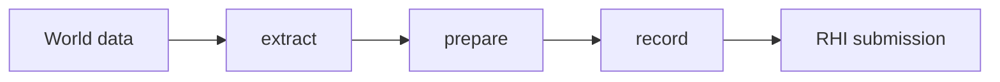

# `@forgeax/engine-render`

## Direct-light parity contract

The direct-light proposition is: one public `DirectionalLight`/`PointLight`/
`SpotLight` semantic snapshot must produce the same analytic result in URP and
HDRP. The M4 authority is the revision-pinned
[`three-r184-finite-range-authority.json`](../../apps/parity/color-lighting/cases/direct-light/calibration/three-r184-finite-range-authority.json).
It is `ready` only when its Three revision, source hash, config, and expected
samples are present. Missing authority or paired GPU captures is `blocked`; do
not repair that state with a multiplier, a backend profile, or a demo asset.

Run the focused contract checks with:

```sh
pnpm exec vitest run apps/parity/color-lighting/src/analytic/__tests__/three-r184-finite-range.test.ts
pnpm exec vitest run apps/parity/color-lighting/src/integration/__tests__/light-snapshot.test.ts
```

The public mapping is deliberately small:

| Fact | Contract | Owner or evidence |
|:--|:--|:--|
| World scale | `1` world unit is `1` meter | Light components and glTF bridge |
| Exposure | `1` by default; applied after lighting at tone/output | Camera tone contract and paired capture |
| Intensity | Directional uses lux; point and spot use candela | `DirectionalLight`, `PointLight`, `SpotLight` |
| Color | Linear RGB; no hidden global multiplier | Light snapshot and buffer layout |
| Range and decay | Positive range is meters; `Infinity` means no cutoff; runtime uses `e=2` | Three r184 authority |
| Cone | KHR radians import to component degrees; snapshot stores `cosInner` and `cosOuter` | glTF bridge and extract |
| Direction | KHR local `-Z` after world rotation; extract normalizes once; downstream shaders consume the result | Extract snapshot and URP/HDRP shaders |

The runtime finite-range factor is the Three r184 squared window:
`clamp(1 - (d / c)^4, 0, 1)^2`. The KHR
[`three-r184-khr-calibration.json`](../../apps/parity/color-lighting/cases/direct-light/calibration/three-r184-khr-calibration.json)
curve is an explicit unsquared import/reference curve only; it is not a
substitute for the runtime authority. The squared and unsquared samples are
kept separate so a replacement remains a visible falsification.

For a blocked case, inspect the authority fixture first, then the normalized
light snapshot and the independent Forge/Three captures. The parity report
must retain `provenance`, `captures`, `raw hash`, `analyticMax`, `roiMax`, and
`verdict` for each backend x pipeline x case. A same-canvas self-comparison or
analytic-only green result is not direct-light parity evidence.

## Particle feature boundary

Particle rendering is provided by
[`@forgeax/engine-vfx-render`](../vfx-render/README.md). This package owns the
generic RenderFeature host, prepared graphics resolver, pipeline readiness
contract, and structured renderer errors; it does not own VFX simulation or
particle asset authoring.

## Deferred membership timing

Render owns the opt-in `membershipTiming` contract for the real
`hdrp-cluster-membership` compute pass. App and Runtime only forward the option;
they do not define a second profiler or reason vocabulary.

| Mode | Work | Result |
|:--|:--|:--|
| omitted | No query set, resolve buffer, map, or queue wait | No timing record |
| `cpu-control` | Existing CPU binner remains the control path | Accepted control record with `gpu: null` |
| `gpu` | Bounded timestamp query, resolve, async queue completion, and map | GPU ticks plus backend period, or a terminal refusal/error |

> [!IMPORTANT]
> A GPU request is refused when the backend does not advertise timestamp
> queries or a positive timestamp period. RhiNull and the wgpu WebGL2 path are
> intentionally non-timing backends. They never synthesize GPU duration.

The controller timestamps immediately around the existing membership dispatch,
keeps GPU ticks separate from CPU encode/submit and async readback, and
terminalizes captures on timeout, submit failure, queue completion failure,
readback failure, device recovery, or disposal. The closed
`MembershipTimingReasonCode` union and its exhaustive mapping live in
[`src/record/membership-timing.ts`](src/record/membership-timing.ts).

Timestamp-capable backends must execute both raw timestamp writes. A missing or
throwing write is a structured `timestamp-write-unavailable` refusal; Render
never publishes a zero, reversed, or non-finite GPU interval as a report.

## Deferred membership evidence closure

> [!IMPORTANT]
> The close condition is `acceptedGpu=16`, with five accepted Dawn GPU
> records at each of 32, 64, and 128 lights, one 256-light record, positive
> tick intervals, per-light-count variance, and the 256-light overflow
> fingerprint. `acceptedGpu=0` is a blocker. CPU control, WebKit refusal,
> RhiNull refusal, PNG screenshots, and capability bits never count as GPU
> evidence.

The producer and validator are deliberately separate from the public Render
API. Generate the exact manifest, run the full producer matrix, and inspect
the machine-readable report in this order:

```sh
node scripts/dev-verify/generate-deferred-membership-manifest.mjs --output=report/deferred-membership-timing/full-matrix-manifest.json
node scripts/dev-verify/capture-deferred-membership-corpus.mjs --manifest=report/deferred-membership-timing/full-matrix-manifest.json --output-root=report/deferred-membership-timing --webkit-download=webkit-evidence --report=report/deferred-membership-timing
```

The manifest contract is [`full-matrix-contract.json`](../../scripts/dev-verify/membership-timing/full-matrix-contract.json); the WebKit subset is validated by [`webkit-subset.schema.json`](../../scripts/dev-verify/membership-timing/webkit-subset.schema.json). The stable identity is `sourceHead`, `carrier`, `workload`, `profile`, and `artifactHashes`. The exact target is 20 top-level records and 32 nested references, with `record`, `profile`, `membership`, and `pixel` SHA-256 descriptors.

The report exposes `valid`, `truthfulnessReady`, `completeMatrixReady`,
`optimizationReleaseReady`, `counts`, `errors`, and `blocker`. A blocker uses
`code`, `expected`, `hint`, and the observed `acceptedGpu` count so an AI user
can recover by inspecting per-attempt refusal, profile, identity, and artifact
hash records. The owner reason union remains closed; for example,
`timestamp-query-unsupported` is a refusal, while `timestamp-write-unavailable`
is a terminal producer failure. Neither is a successful GPU sample.

## RenderFeature: the producer seam (first-read index)

The public route remains `RenderFeature` through `RenderPipeline` and the
active RenderGraph pass. This is the RenderGraph pass for a `type FrameData`
producer, which uses
`createRenderer(canvas, { features: [feature] })`,
`context.staging.addPass('named-pass'`, `execute: ({ pass })`, and the
`Material pass` boundary. This is the graph-only Wave 1 feature route.

> [!IMPORTANT]
> Render consumes the effective MaterialAsset snapshot produced by extract. Each texture slot carries its own coordinate set and transform into the built-in PBR binding layout; render records do not reinterpret authoring fields or manufacture shader artifacts. The effective `passes` are already validated.

## MaterialAsset render contract

The effective `passes` are validated before the render snapshot is produced.

The render path is `MaterialAsset` -> extract snapshot -> prepare resources -> record the per-slot `coordinates` and values. The effective `parent` is already resolved before extract. If a material contract or reflection binding fails, preserve the structured error and repair the source contract or cooked module before drawing again; that is the recovery route. The render package owns consumption, not material import or cook policy.

> [!IMPORTANT]
> Owner: render vocabulary and the extract → prepare → record frame boundary. Runtime selects concrete services and calls this package; it does not re-own these tokens.

```ts
import { Camera, MeshFilter, MeshRenderer } from '@forgeax/engine-render';
import { createRenderer } from '@forgeax/engine-runtime';

const renderer = await createRenderer(canvas);
const ready = await renderer.ready;
const attached = renderer.attachWorld(world);
if (ready.ok && attached.ok) {
  world.update(1 / 60).unwrap();
  renderer.draw([world], { cameraOwner: 0, resourceOwner: 0 });
}
```

`attachWorld` installs renderer-required derived-state systems once. Hosts built
with `createApp` get this wiring automatically. A custom loop attaches each
World before its first update, then keeps `draw` as a read-only consumer of the
state published by `World.update()`.

When a host constructs a feature only after its World or asset catalogue is
ready, use `await renderer.installRenderFeature(feature)`. The late path inserts into
the same lifecycle host and RenderGraph ordering as boot-time features; it is
not a second renderer. Installing the same object twice is idempotent, while a
different object with the same identity returns the structured registration
conflict. Awaiting also completes the feature's declared material-shader
prewarm, so its first prepared draw observes the same ready barrier as a
boot-time feature.

This is the graph-only Wave 1 feature route; prepared graphics and late shader
prewarm extend the same lifecycle for production asset features.

When a late-installed feature remains registered through device loss, its declared material
shaders remain part of the renderer's live prewarm set. `await renderer.recover()` therefore
rebuilds those modules before the next prepared draw rather than relying on a one-frame retry.

| This package owns | Excluded concepts |
|:--|:--|
| Camera/light/mesh vocabulary, `Renderer`, render errors, documented pipeline operations | Backend selection, asset import, ECS scheduling, animation playback, optional text/tile/sprite authoring |

The stable surface is [`src/index.ts`](src/index.ts). `RenderError` is closed and carries actionable detail. Runtime alone owns host assembly and its `EngineEnvironmentError` rejection contract; render's construction seam is internal to that dependency path.

## Tone mapping output contract

The public mode names are the same names used by the Three r184 oracle:

| Mode | Public constant | Output behavior |
|:--|:--|:--|
| `linear` | `TONEMAP_LINEAR` | Exposure, then clamp to LDR |
| `reinhard` | `TONEMAP_REINHARD` | Per-channel Reinhard |
| `cineon` | `TONEMAP_CINEON` | Cineon filmic curve |
| `aces-filmic` | `TONEMAP_ACES_FILMIC` | ACES filmic curve |
| `agx` | `TONEMAP_AGX` | AgX curve |
| `neutral` | `TONEMAP_NEUTRAL` | Khronos neutral curve |

`TONEMAP_REINHARD_EXTENDED` is the existing ForgeaX luminance-domain curve. Its
separate `reinhard-extended` name is intentional: it is not a second formula
hidden behind the Three `reinhard` name.

Tone-enabled cameras use one output contract:

```text
linearHdr -- exposure + named tone curve --> linearLdr --> displayEncoded
```

The final capture is the encoded surface result. A linear capture, when a
parity adapter exposes one, remains a separate `linearHdr` or `linearLdr`
sample and must not be compared as if it were the final display capture. The
contract is available as `resolveToneOutputContract(camera.tonemap)` from the
render package. The camera remains the runtime entry point:

```ts
import { Camera, TONEMAP_AGX, perspective } from '@forgeax/engine-render';

world.spawn({
  component: Camera,
  data: {
    ...perspective({ fov: Math.PI / 4, aspect: 1 }),
    tonemap: TONEMAP_AGX,
    exposure: 1,
  },
}).unwrap();
```

The built-in pass samples the HDR target and writes the LDR result through the
registered `forgeax::tonemap` fullscreen shader. Shader source authority is
[`packages/shader/src/tonemap.wgsl`](../shader/src/tonemap.wgsl); the render
package does not duplicate those formulas.

## Optional CPU profiling

Render accepts the host-owned `Profiler` capability through App assembly. It writes bounded CPU
phase evidence only while a capture is active; it does not add GPU timestamps, ECS spans, a UI, or
a remote method. The artifact and its owner-declared catalog are documented by
[`@forgeax/engine-profiler`](../profiler/README.md).

```ts
import { createProfiler, type Profiler } from '@forgeax/engine-profiler';
import { createRenderer } from '@forgeax/engine-runtime';

const profiler: Profiler = createProfiler();
const renderer = await createRenderer(canvas, { profiler });
```

Use the package's `validateProfileCapture` and `buildProfileModel` entries for offline analysis.
The render package remains the owner of render vocabulary and extract/prepare/record execution.

## RenderFeature: the producer seam

Register one producer-owned feature at the renderer assembly boundary. The
same `FrameData` type flows through `extract`, `prepare`, and `contribute`;
the host supplies ordering, capability projection, graph composition, and
lifecycle isolation.
Both paths execute inside the active RenderGraph and the frame's single
execute/submit boundary.

```ts
import { ok } from '@forgeax/engine-types';
import type { RenderFeature } from '@forgeax/engine-render';
import { createRenderer } from '@forgeax/engine-runtime';

type FrameData = { readonly visibleCount: number };
const feature = {
  identity: 'package.feature',
  extract: ({ owner }) => ok<FrameData>({ visibleCount: owner }),
  prepare: (data) => {
    void data.visibleCount;
    return ok(undefined);
  },
  contribute: (data, context) => {
    if (data.visibleCount === 0) return ok(undefined);
    context.staging.addResource('color', {
      kind: 'texture',
      lifetime: 'transient',
    }).unwrap();
    context.staging.addPass('named-pass', {
      reads: [],
      writes: ['color'],
      execute: ({ pass }) => {
        void pass;
      },
    }).unwrap();
    return ok(undefined);
  },
} satisfies RenderFeature<FrameData>;

const renderer = await createRenderer(canvas, { features: [feature] });
const ready = await renderer.ready;
const attached = renderer.attachWorld(world);
if (ready.ok && attached.ok) {
  world.update(1 / 60).unwrap();
  renderer.draw([world], { cameraOwner: 0, resourceOwner: 0 });
}
```

### Five render terms

| Term | Meaning | Owner |
|:--|:--|:--|
| `RenderFeature` | Producer-owned extract/prepare/contribute callbacks and frame data | Feature producer |
| `RenderPipeline` | Full frame policy selected or switched by the host | Render host |
| RenderGraph pass | One declared graph execution node contributed to the active pipeline | Graph host |
| Material pass | One shader-facing pass in a `MaterialAsset` | Material asset |
| Prepared graphics | Opaque pipeline, binding, vertex/index, and attachment references prepared by the host | Render host |
| Prepared GPU work | Opaque persistent compute program, binding, buffer, dispatch, and indirect-draw references | Render host |

### Prepared compute resources

`RenderFeature` producers can prepare cooked compute pipelines, reflected name-based bindings,
uniform/storage/indirect buffers, direct or indirect dispatches, and direct or indirect draws. The
renderer retains device, encoder, graph, generation, and submission ownership. Persistent buffers
retain their device identity across frames and are recreated after the feature-host generation
advances; a storage buffer may also be consumed as renderer-declared vertex data.

Compute and graphics passes use the same contribution graph. `after` names an earlier local pass,
so a producer can express compute-to-draw ordering without receiving a raw RHI handle.

Feature contexts never expose raw GPU graphics state, a complete pipeline
context, submit authority, or a command encoder. They expose an immutable
`Readonly<RhiCaps>` capability snapshot for capability-gated preparation. The
graph-only `addPass`
surface still exposes only named pass and frame identity; use the prepared
graphics surface below when a feature needs pipelines, bindings, vertex/index
data, attachments, and draw records. Both paths execute inside the active
RenderGraph and the frame's single execute/submit boundary. The active RenderGraph
owns that frame boundary. Do not cast either context to a raw device or encoder. See
[`features/graph-contribution.ts`](src/features/graph-contribution.ts) for the
staging shape.

The copyable recipe above is therefore a graph-only Wave 1 feature; it stops at
the graph seam and does not provide a production particle draw path.

### Prepared graphics recipe

Prepared graphics extends the existing graph-owned staging seam with five
opaque reference kinds. A producer requests preparation during `prepare`,
retains only the returned references, and contributes declarative records. The
render host owns generation checks, graph composition, recording, and submit.

Persistent GPU work follows the same ownership rule. A feature may retain opaque bindings for an
active producer; bindings retain their transitive program and buffers. Untouched resources are
detached after a successful feature frame and destroyed after queue completion, never while an
in-flight command can still reference them.

```ts
import { ok } from '@forgeax/engine-types';
import type { RenderFeature } from '@forgeax/engine-render';
import { createRenderer } from '@forgeax/engine-runtime';

type PreparedFrame = { readonly items: readonly unknown[] };
const frame: PreparedFrame = { items: [] };
const feature = {
  identity: 'package.prepared-feature',
  extract: () => ok(frame),
  prepare: (_data, context) => {
    const pipeline = context.graphics.preparePipeline('package.pipeline', {
      shader: 'package.shader',
      vertexLayout: 'package.vertices',
      colorFormats: ['rgba8unorm-srgb'],
    });
    if (!pipeline.ok) return pipeline;
    void pipeline.value;
    return ok(undefined);
  },
  contribute: () => ok(undefined),
} satisfies RenderFeature<PreparedFrame>;

const renderer = await createRenderer(canvas, { features: [feature] });
```

This recipe proves public type reachability and host preparation only. The
render package accepts producer-owned frame data and generic prepared graphics
declarations.

### Failure and recovery

`RenderError` is a closed union. Switch on `error.code`, then read
`error.expected`, `error.hint`, and the code-specific `error.detail`.

Feature capability checks are based on `Readonly<RhiCaps>`, and recovery actions
consume the structured `error.detail` context.

| Diagnostic state or code | Recovery action |
|:--|:--|
| `active` | Continue the next frame |
| `failed` / `render-feature-stage-failed` | Correct producer data and retry on the next frame |
| `disabled` / `render-feature-capability-missing` | Provide the capability on a replacement device; after device-loss recovery call `await renderer.recover()`. On a live renderer, `recover()` returns `recover-not-needed`, so rebuild on a capable device instead. |
| `render-feature-registration-conflict` | Fix identity/order at registration |
| `render-feature-pass-order-conflict` | Reorder the declared dependency and retry contribution |
| `render-feature-preparation-failed` | Repair the named prepared resource and retry on the action in `error.detail.recovery`; after device loss, verify that the feature's declared shader was included in the recovery prewarm set |
| `render-feature-prepared-state-mismatch` | Read the discriminated `error.detail.reason`, repair the generation/layout/format mismatch, and retry |
| `render-feature-draw-recording-failed` | Read `error.detail.backendReason`, then retry after the host reports renderer recovery |
| `disposed` | Terminal; create a new renderer/feature registration |

Use `renderer.renderFeatureDiagnostics()` for a read-only snapshot. Call
`renderer.dispose()` once or repeatedly; disposal is idempotent. A pipeline
switch keeps the feature registration list and rebuilds the active graph.
The host still uses `renderer.registerPipeline(id, pipeline)` for a full
pipeline change.

For a temporary presentation-owner handoff, call `renderer.releaseSurface()`.
It unconfigures the canvas and makes `draw()` fail closed without disposing the
Renderer, AssetRegistry, or GPU declarations. After the temporary owner is
gone, `renderer.restoreSurface()` re-enables lazy surface configuration on the
next draw. Both calls are idempotent; `dispose()` remains the terminal path.

For the complete declaration shape, read
[`features/types.ts`](src/features/types.ts) and
[`features/prepared-graphics.ts`](src/features/prepared-graphics.ts). For graph
contribution details, read [`features/graph-contribution.ts`](src/features/graph-contribution.ts);
for pipeline switching, read [`renderer.ts`](src/renderer.ts). The producer
asset contract is [`@forgeax/engine-vfx`](../vfx/README.md), while graph
ownership is [`@forgeax/engine-render-graph`](../render-graph/README.md).

> [!WARNING]
> Wave 2 delivered this generic prepared public seam. A downstream Wave 3 VFX
> integration owns visible particle draws; render must not gain a
> particle-kind switch or VFX production dependency. See the
> [VFX Wave 3 handoff](https://github.com/ForgeaX-Games/forgeax-engine-harness/blob/main/docs/vfx-particle-runtime-design.md).

Dynamic consumers use the same boundary explicitly:

```ts
const { Camera, MeshFilter, MeshRenderer } = await import('@forgeax/engine-render');
```

`@forgeax/engine-runtime` remains the host assembly entry for `createRenderer` and backend policy. Import `Materials` from this package. Runtime is not a compatibility barrel for render components.

Optional text, tilemap, and sprite authoring is intentionally isolated from the
base vocabulary:

```ts
import {
  GlyphText,
  SpriteAnimation,
  Tilemap,
  setTransparentSortConfig,
  TRANSPARENT_SORT_MODE_LAYER_Y,
} from '@forgeax/engine-render/authoring';
```

`authoring` also owns the public transparent-bucket configuration helpers and
their four named modes. A consumer that composes sprites with an existing 3D
game may set the world-level mode here; it should not reach into `/internal`.

The root barrel does not expose frame stores, extract/prepare/record stages,
or concrete pipeline implementation machinery. The supported custom-pipeline
operations are `RenderPipeline`, `RenderPipelineContext`, and the documented
render-graph primitives.

`@forgeax/engine-render/internal` is an engine-owned assembly seam, not an
application API or a compatibility route. Imports from `/internal` under the
private `apps/` tree are engine dogfood for assembly coverage, not application
recipes. First-party packages may use it while the engine is assembled;
application code should not copy those imports. Its
surface can change without a consumer migration promise. If a custom renderer
needs a capability absent from the supported root operations, treat that as a
request for an explicit public design rather than importing `/internal`.

For a custom `RenderPipeline` with `Camera.antialias = ANTIALIAS_MSAA`, declare
the scene colour and depth targets with `sample: 4`, add a single-sample colour
resolve target, and pass its key through `addScenePass(..., { resolve })`.
Downstream fullscreen passes read the resolve target; single-sample pipelines
omit `resolve`.



## Visibility contract

Quick start:

```ts
import { Visibility, VisibilityStateValue, resolveVisibility } from '@forgeax/engine-render';

world.spawn({
  component: Visibility,
  data: { state: VisibilityStateValue.hidden },
}).unwrap();
const snapshot = resolveVisibility(world);
```

| Stage | Truth | Diagnostic |
|:--|:--|:--|
| Author intent | `Visibility.state` is `inherited`, `hidden`, or `visible` | Read the ECS field or reflected `labels` |
| Effective state | `resolveVisibility(world).effective(entity)` applies valid scene parents | Inspect `snapshot.diagnostics` and `VisibilityResolution.source` |
| Render result | Render producers skip hidden candidates before material work | Read `renderer.visibilityStats`; it is not a frustum or picking metric |

If the state write returns an error, preserve `code`, `expected`, `hint`, and
`detail`, correct the enum value, and retry through `world.set`. If hierarchy
diagnostics are present, repair the scene relation and resolve again. Do not
hide the issue with a custom mesh, camera workaround, or material substitute.

Out of scope: camera frustum policy, picking, app lifecycle, asset import, and
VFX shadow behavior. `@forgeax/engine-vfx-render` remains the producer-owned
particle bridge and consumes the same effective visibility boundary.
