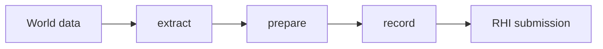

# `@forgeax/engine-render`

## Render happy path

`RenderScene -> Standard Pipeline -> DeviceScope -> FrameReceipt` is the only frame
model. The host calls `createRenderer`, `attach(world)`, and `draw(request)`; diagnostics use
`inspect`, `observe(receipt, request)`, and `recover`. `FrameReceipt` is the synchronous proof that
submit completed. A failed `Result` carries `code`, `hint`, and `detail`; repair the named owner,
rebuild or cold-cook its source, then retry the same request.

```ts
const created = await createRenderer(canvas);
if (!created.ok) throw created.error;
const renderer = created.value;
const attached = renderer.attach(world);
if (!attached.ok) throw attached.error;
const frame = renderer.draw({
  leases: [attached.value],
  camera: { lease: attached.value },
  environment: { lease: attached.value },
});
if (!frame.ok) throw frame.error;
const observation = await renderer.observe(frame.value, { include: ['timings'] });
```

The Standard pipeline selects direct or clustered lighting from capabilities and keeps shadow,
PBR, IBL, SSAO, bloom, tone, antialiasing, sky, material, VFX, and debug feature ownership inside
the same graph and submit boundary. CPU and WebGL2 fallback are capability lanes of that pipeline,
not second renderer identities.

## Direct-light parity contract

The direct-light proposition is: one public `DirectionalLight`/`PointLight`/
`SpotLight` semantic snapshot must produce the same analytic result in every
Standard capability lane. The authority is the revision-pinned
[`three-r184-finite-range-authority.json`](../../apps/parity/color-lighting/cases/direct-light/calibration/three-r184-finite-range-authority.json).
It is `ready` only when its Three revision, source hash, config, and expected
samples are present. Missing authority or paired GPU captures is `blocked`; do
not repair that state with a multiplier, a backend profile, or a demo asset.

Run the focused contract checks with:

```sh
pnpm exec vitest run apps/parity/color-lighting/src/analytic/__tests__/three-r184-finite-range.test.ts
pnpm exec vitest run apps/parity/color-lighting/src/integration/__tests__/light-snapshot.test.ts
```

The public mapping is deliberately small:

| Fact | Contract | Owner or evidence |
|:--|:--|:--|
| World scale | `1` world unit is `1` meter | Light components and glTF bridge |
| Exposure | `1` by default; applied after lighting at tone/output | Camera tone contract and paired capture |
| Intensity | Directional uses lux; point and spot use candela | `DirectionalLight`, `PointLight`, `SpotLight` |
| Color | Linear RGB; no hidden global multiplier | Light snapshot and buffer layout |
| Range and decay | Positive range is meters; `Infinity` means no cutoff; runtime uses `e=2` | Three r184 authority |
| Cone | KHR radians import to component degrees; snapshot stores `cosInner` and `cosOuter` | glTF bridge and extract |
| Direction | KHR local `-Z` after world rotation; extract normalizes once; downstream shaders consume the result | Extract snapshot and Standard shaders |

The runtime finite-range factor is the Three r184 squared window:
`clamp(1 - (d / c)^4, 0, 1)^2`. The KHR
[`three-r184-khr-calibration.json`](../../apps/parity/color-lighting/cases/direct-light/calibration/three-r184-khr-calibration.json)
curve is an explicit unsquared import/reference curve only; it is not a
substitute for the runtime authority. The squared and unsquared samples are
kept separate so a replacement remains a visible falsification.

For a blocked case, inspect the authority fixture first, then the normalized
light snapshot and the independent Forge/Three captures. The parity report
must retain `provenance`, `captures`, `raw hash`, `analyticMax`, `roiMax`, and
`verdict` for each backend x pipeline x case. A same-canvas self-comparison or
analytic-only green result is not direct-light parity evidence.

## Particle feature boundary

Particle rendering is provided by
[`@forgeax/engine-vfx-render`](../vfx-render/README.md). This package owns the
generic RenderFeature host, prepared graphics resolver, pipeline readiness
contract, and structured renderer errors; it does not own VFX simulation or
particle asset authoring.

## Deferred lighting evidence

Deferred lighting validation is consumer evidence, not a Render production
subsystem. The learn-render smoke exercises the Standard clustered path and
the profiler captures bounded CPU ownership evidence; the WebKit fallback
gate exercises the browser delivery path. Runtime inspection uses the public
`inspect` and `observe` projections, while any future timestamp benchmark
belongs in `packages/render/bench` and its dev-verify producer. Render does
not expose a timing controller or a second membership-specific API.

## RenderFeature: the producer seam (first-read index)

### Material contract projection

Render consumes only the Pack-owned material publication projection. Its
inputs are runtime bool/value data, composed module slots, and the closed
compiler context; render never authors, cooks, writes DDC, or selects a
fallback material. The projection preserves `layoutIdentity`,
`programIdentity`, `cookIdentity`, and `materialPublicationIdentity` so a
stale draw can be traced to the first producer divergence.

The public route is one `RenderFeature<FrameData>` through the Standard
Pipeline and the active RenderGraph pass. In the examples below, `type FrameData`
is the producer-owned extracted value. A feature extracts one frame value,
then its mandatory `plan(data, context)` declares named resources and passes;
the host derives graph access, preparation, recording, and recovery from that
plan. Register it at construction with
`createRenderer(canvas, { features: [feature] })`. A feature never receives a
device, queue, encoder, staging builder, or submit callback.

> [!IMPORTANT]
> Render consumes the effective MaterialAsset snapshot produced by extract. Each texture slot carries its own coordinate set and transform into the built-in PBR binding layout; render records do not reinterpret authoring fields or manufacture shader artifacts. The effective `passes` are already validated.

## MaterialAsset render contract

Render owns this consumption route:

| Input | Render responsibility |
|:--|:--|
| `passes` and `values` | Consume the effective snapshot; do not reinterpret authoring data. |
| `parent` | Consume the already-resolved inheritance result. |
| texture `coordinates` | Bind the selected coordinate set and transform. |
| `cook` output | Record only validated shader artifacts. |
| `recovery` | Preserve the structured failure so the source contract or cooked module can be repaired. |

### Mesh material binding resolution

Render resolves one effective material table per logical mesh slot before
recording submesh draws. `MeshRenderer.materials[]` is a sparse per-instance
override vector: a missing entry or `0` inherits the corresponding
`MeshAsset.materialSlots[]` default. A slot without a declared mesh default
uses the neutral engine material.

> [!IMPORTANT]
> A declared mesh default is a required asset dependency. If it is unavailable,
> extract fails closed with the mesh GUID, slot index, and material GUID instead
> of silently painting the mesh gray. Invalid instance overrides fall back with
> a structured diagnostic; entries beyond the slot table are ignored and
> diagnosed.

The render path is `MaterialAsset` -> extract snapshot -> prepare resources -> record the per-slot `coordinates` and values. The effective `parent` is already resolved before extract. If a material contract or reflection binding fails, preserve the structured error and repair the source contract or cooked module before drawing again; that is the recovery route. The render package owns consumption, not material import or cook policy.

## Points and Lines authoring (M1)

Points and Lines are first-class render components. Their geometry remains a
normal `MeshAsset`, and their material remains the engine-owned
`Materials.unlit` asset. The M1 path validates the complete candidate before
any render publication; it does not add a second mesh, material, CLI, RPC, or
manifest authority.

```ts
import { Lines, Materials, PointShapeValue, Points, admitPointsLines } from '@forgeax/engine-render';
import { World } from '@forgeax/engine-ecs';
import type { MeshAsset } from '@forgeax/engine-types';

const positions = new Float32Array([0, 0, 0, 1, 0, 0, 2, 0, 0]);
const pointMesh = {
  kind: 'mesh',
  vertices: positions,
  attributes: { position: positions },
  submeshes: [{
    indexOffset: 0,
    indexCount: 0,
    vertexCount: 3,
    topology: 'point-list',
    materialSlot: 0,
  }],
  materialSlots: [{ slotName: 'default' }],
} satisfies MeshAsset;
const material = Materials.unlit([1, 0.5, 0.25, 1], { castShadow: false });
const world = new World();
const entity = world.spawn({
  component: Points,
  data: { sizePx: 4, shape: PointShapeValue.circle },
}).unwrap();
const admitted = admitPointsLines({
  entity,
  points: { sizePx: 4, shape: PointShapeValue.circle },
  mesh: pointMesh,
  material,
});
if (!admitted.ok) throw new Error(admitted.error.hint);

world.spawn({ component: Lines, data: { widthPx: 2 } }).unwrap();
```

The style vocabulary is deliberately small in M1:

| Component | Field | Default | Accepted values |
|:--|:--|--:|:--|
| `Points` | `sizePx` | `4` | finite number greater than `0` |
| `Points` | `shape` | `square` | `square` or `circle` |
| `Lines` | `widthPx` | `1` | finite number greater than `0` |

Admission consumes one style component, one ordinary mesh topology, and one
unlit forward material. Indexed and non-indexed `point-list` meshes are valid
for `Points`; indexed and non-indexed paired `line-list` meshes are valid for
`Lines`.

| Candidate | M1 result | Reason |
|:--|:--:|:--|
| `Points` + `point-list` + finite positive `sizePx` + unlit forward material | supported | `square` and `circle` are the only point shapes |
| `Lines` + paired `line-list` + finite positive `widthPx` + unlit forward material | supported | each pair is one line segment |
| `line-strip`, triangle topology, mixed submeshes, or an odd line-list tail | refused | topology cannot be inferred or admitted atomically |
| both `Points` and `Lines` on one candidate | refused | one entity has one style lane |
| `Materials.standard`, shadow-caster, deferred, or another shader module | refused | M1 accepts one engine-owned unlit forward pass |
| candidate count over `maxPoints` or `maxSegments` | refused | bounded admission prevents partial publication |

When admission refuses a candidate, consume the structured result rather than
parsing its message. The result exposes `.code`, `.expected`, `.hint`, and a
code-specific `.detail` containing the relevant entity, component, mesh,
material, submesh, lane, generation, or stage facts:

```ts
const result = admitPointsLines({ entity, points: {}, mesh: pointMesh, material });
if (!result.ok) {
  console.error(result.error.code);
  console.error(result.error.expected);
  console.error(result.error.hint);
  console.error(result.error.detail);
}
```

M1 intentionally refuses strip expansion, joins, caps, dashes, picking, and
visible point/line draw preparation. Those are later implementation lanes, not
implicit fallbacks in authoring code.

## Points and Lines runtime contract

The complete public closure is `MeshAsset` topology, one `Points` or `Lines`
component, `Materials.unlit`, and the Standard renderer. The owner retains the
source view, derives expanded geometry during prepare, and records the dedicated
points-lines pipeline in the active main geometry pass. Applications do not
create a second mesh, GPU buffer, shader module, cache, recovery ledger, or
backend branch.

| Surface | Supported contract | Refused or not claimed |
|:--|:--|:--|
| topology | indexed or non-indexed `point-list` and paired `line-list` | strips, triangles, mixed topology, and odd line tails |
| style | finite positive `Points.sizePx` and `Lines.widthPx`; circle or square points | negative, non-finite, or lane-conflicting values |
| material | engine-owned `Materials.unlit` forward material | standard/PBR, deferred, shadow-only, or custom runtime shader |
| capability lane | direct WebGPU runtime; clustered unlit preserves the same authoring contract | CPU and WebGL2 require their declared capability route; no pixel result is inferred from RhiNull |
| structural lane | RhiNull records retained projection, preparation, bindings, and draw shape | RhiNull is never hardware or pixel evidence |

Prepare and record remain one lifecycle. A failed result is an owner fact, not a
request to fall back to a generic mesh draw. Inspect the structured error and
repair the source or producer, then retry the same renderer:

```ts
const inspection = renderer.inspect();
const pointsLines = inspection.renderScene.pointsLines;
// Repair the named source or producer, then retry inspection and draw.
report(pointsLines);
```

Inspection reports source bytes, derived bytes, vertex/index counts, cache
state, upload state, draw count, lane, and the retained `lastKnownGood` state.
Recovery is `inspect -> producer rebuild or cold-cook -> prepare -> record`.
It never publishes a partial expansion and never hides a stale-generation or
missing-resource error.

For visual evidence, use the topology probe and retain its raw screenshot,
readback, source/derived byte counts, draw count, and validation errors. A
focused direct-WebGPU probe is evidence for that lane only. The repository-wide
`pnpm test:browser` gate was explicitly skipped by human override in this
milestone and must not be reported as passed; the controlled Dawn attempt
timed out during environment build before Dawn Vitest ran.

The M5 boundary does not include strip joins, caps, dashes, picking, a new CLI
or RPC operation, application-local WGSL, a second Geometry factory, or a
separate cache/recovery authority.

> [!IMPORTANT]
> Owner: render vocabulary and the extract → prepare → record frame boundary. Runtime selects concrete services and calls this package; it does not re-own these tokens.

```ts
import { Camera, MeshFilter, MeshRenderer } from '@forgeax/engine-render';
import { createRenderer } from '@forgeax/engine-runtime';

const renderer = await createRenderer(canvas);
const attached = renderer.attach(world);
if (attached.ok) {
  world.update(1 / 60).unwrap();
  renderer.draw({
    leases: [attached.value],
    camera: { lease: attached.value },
    environment: { lease: attached.value },
  });
}
```

`attach` installs renderer-required derived-state systems once. Hosts built
with `createApp` get this wiring automatically. A custom loop attaches each
World before its first update, then keeps `draw` as a read-only consumer of the
state published by `World.update()`.

## Persistent render scene

The ordinary single-World path bootstraps one renderer-owned CPU projection,
then drains the World's bounded change journal. A no-change frame reuses the
last visible snapshot without traversing renderable archetypes; transform
changes update only their stable projection slots. Unrelated gameplay
component writes do not invalidate render state.

Mutable shared payloads use the same explicit-dirty rule: mutate the resolved
payload, then call `world.sharedRefs.markChanged(handle)`. The renderer compares
one monotonic shared-ref epoch on the no-change path, drains the bounded exact
mutation journal when it advances, and refreshes only projection slots indexed
by the changed material handle. Journal overflow and topology-changing material
edits remain explicit full-reconcile reasons rather than silent partial state.

When `RhiCaps.storageBuffer` is available, the same projection owns persistent
Primitive, Instance, Transform, DrawTemplate, and Material GPU tables. The
tables use independent stable ranges: one primitive can reference ordinary
instance-local transforms, multiple draw items, and multiple prepared material
records. The schema in `src/gpu-scene-schema.ts` derives byte offsets, signed
and unsigned scalar forms, strides, and WGSL declarations; dirty ranges become
coalesced `queue.writeBuffer` writes and no-change frames upload zero scene
bytes. Device recovery discards only device-owned tables and rebuilds them from
the retained CPU projection.

The typed render-graph evidence path imports those persistent tables without
transferring ownership, runs compute cull → compact → indirect args, and consumes
the result through a graph-owned raster pass. Companion Dawn and Chromium gates
also cover storage-buffer ping-pong, compute-generated indirect dispatch and draw
arguments, storage-texture sampling in raster, and per-mip HZB reduction. These
are real driver/pixel proofs for the GPU-driven boundary; they do not make
RhiNull a pixel backend or make the CPU projection cease to be the scene
authority.

Inspect the current path through `renderer.inspect()`. Its detached CPU snapshot exposes
full rebuilds, no-change and delta frames, transform/material/instance updates,
removals, the journal cursor, projection cardinality, and the last resync
reason. The nested `gpu` status is one of `inactive`, `unsupported`, `resident`,
`rebuild-pending`, or `error`; resident state additionally reports capacity,
upload ranges and bytes, grows, clears, rebuilds, and no-change frames. The
`gpuDriven` inspection reports whether stable frames materialized or validated
GPU-owned rows and whether candidate or batch topology bytes were uploaded.
GPU and renderer contract errors arrive through the single `renderer.subscribe`
event stream (`event.kind === 'error'`); the renderer does not expose a second
error listener registry.

## GPU-driven view kernel

`BatchTopology` groups eligible rigid draw items by immutable geometry,
material, render-state, and command compatibility. One primitive can contribute
multiple submesh draw items, and each draw item uses a closed indexed or
non-indexed five-word indirect command. A per-view typed graph records
`reset -> frustum/compact -> finalize` over persistent candidate and batch
buffers. The compute path validates generation and active flags, composes the
primitive world transform with each ordinary instance-local transform, writes a
compact `(instanceIndex, materialIndex)` stream, sets explicit overflow flags,
and emits indirect arguments with `firstInstance = 0`.

The Standard frame activates the production raster lane when compute, storage
buffers, and indirect drawing are available. The current lane accepts opaque,
rigid default-unlit passes with batch-stable render state, ordinary instances,
indexed or non-indexed geometry, multiple submeshes and material slots, and the
canonical `12F` vertex layout. It also accepts persistent rigid multi-World
composition. Candidates come from the complete persistent projection rather
than the CPU-visible snapshot. The same typed graph imports the scene and mesh
buffers, runs the three compute passes, and consumes generated arguments with
`drawIndexedIndirect` or `drawIndirect`. Entities accepted by that lane are not
also validated, uploaded, or recorded by the CPU forward loop on a stable
frame.

clustered, PBR and custom shader variants, texture/sampler/video resource bindings,
transparent meshes, skinning, morphing, non-canonical layouts, and shadow views
keep explicit CPU or specialized lanes. WebGL2 selects capability fallback from
the same persistent projection; it does not emulate compute. Visibility and
hierarchy changes, non-rigid multi-World composition, and some prepared-resource
changes still require bounded reconcile work. The implemented lane proves a
zero-upload stable data path and broad rigid geometry coverage, but hardware
100k timing, schema-derived material variants, stable world identities, and
GPU-driven shadows remain required before declaring P3 complete.

The bounded inspection reports topology revision, candidates, batches, visible
capacity, buffer capacities, update count, upload bytes, rebuild count, and CPU
fallback rows. RhiNull verifies graph dependency order and stable-frame zero
work; Dawn and Chromium verification consume indexed, non-indexed,
multi-submesh, and instanced arguments, read persistent scene tables in the
vertex path, and compare the resulting pixel. The renderer-level RhiNull
integration also proves that the built-in Standard graph contains the compute chain
before `main`, including rigid multi-World composition, without GPU plus CPU
duplicate draws. The renderer retains one graph, one compile owner, one
encoder, and one submit route.

> [!NOTE]
> Non-rigid multi-World composition, skinned lanes, visibility/hierarchy
> changes, and unsupported render-relevant structural changes currently take
> an explicit reconcile path. The projection and GPU tables already define
> stable slot, generation, create, update, remove, grow, clear, and rebuild
> semantics; later coverage can make those changes entity-local without adding
> another scene authority.

Features are supplied through the construction options (`features: [...]`) and
enter the same host-owned extract → plan → graph projection path. The public
`Renderer` intentionally has no install/uninstall methods: optional capability
lifetime belongs to the App host, while recovery re-runs the plan against the
replacement device generation.

| This package owns | Excluded concepts |
|:--|:--|
| Camera/light/mesh vocabulary, `Renderer`, render errors, documented pipeline operations | Backend selection, asset import, ECS scheduling, animation playback, optional text/tile/sprite authoring |

The stable surface is [`src/index.ts`](src/index.ts). `RenderError` is closed and carries actionable detail. Runtime alone owns host assembly and its `EngineEnvironmentError` rejection contract; render's construction seam is internal to that dependency path.

## Tone mapping output contract

The public mode names are the same names used by the Three r184 oracle:

| Mode | Public constant | Output behavior |
|:--|:--|:--|
| `linear` | `TONEMAP_LINEAR` | Exposure, then clamp to LDR |
| `reinhard` | `TONEMAP_REINHARD` | Per-channel Reinhard |
| `cineon` | `TONEMAP_CINEON` | Cineon filmic curve |
| `aces-filmic` | `TONEMAP_ACES_FILMIC` | ACES filmic curve |
| `agx` | `TONEMAP_AGX` | AgX curve |
| `neutral` | `TONEMAP_NEUTRAL` | Khronos neutral curve |

`TONEMAP_REINHARD_EXTENDED` is the existing ForgeaX luminance-domain curve. Its
separate `reinhard-extended` name is intentional: it is not a second formula
hidden behind the Three `reinhard` name.

Tone-enabled cameras use one output contract:

```text
linearHdr -- exposure + named tone curve --> linearLdr --> displayEncoded
```

The final capture is the encoded surface result. A linear capture, when a
parity adapter exposes one, remains a separate `linearHdr` or `linearLdr`
sample and must not be compared as if it were the final display capture. The
contract is available as `resolveToneOutputContract(camera.tonemap)` from the
render package. The camera remains the runtime entry point:

```ts
import { Camera, TONEMAP_AGX, perspective } from '@forgeax/engine-render';

world.spawn({
  component: Camera,
  data: {
    ...perspective({ fov: Math.PI / 4, aspect: 1 }),
    tonemap: TONEMAP_AGX,
    exposure: 1,
  },
}).unwrap();
```

The built-in pass samples the HDR target and writes the LDR result through the
registered `forgeax::tonemap` fullscreen shader. Shader source authority is
[`packages/shader/src/tonemap.wgsl`](../shader/src/tonemap.wgsl); the render
package does not duplicate those formulas.

## Optional CPU profiling

Render accepts the host-owned `Profiler` capability through App assembly. It writes bounded CPU
phase evidence only while a capture is active; it does not add GPU timestamps, ECS spans, a UI, or
a remote method. The artifact and its owner-declared catalog are documented by
[`@forgeax/engine-profiler`](../profiler/README.md).

```ts
import { createProfiler, type Profiler } from '@forgeax/engine-profiler';
import { createRenderer } from '@forgeax/engine-runtime';

const profiler: Profiler = createProfiler();
const renderer = await createRenderer(canvas, { profiler });
```

Use the package's `validateProfileCapture` and `buildProfileModel` entries for offline analysis.
The render package remains the owner of render vocabulary and extract/plan/record execution.

## RenderFeature: the producer seam

Register one producer-owned feature at the renderer assembly boundary. The
same `FrameData` type flows through `extract` and the mandatory `plan`; the
host derives preparation, graph access, recording, and lifecycle isolation
from that one plan. Both paths execute inside the active RenderGraph and the
frame's single execute/submit boundary.

The smallest feature returns a closed plan with named resources and passes.
Graph access is derived from those declarations; there is no staging object or
second contribution API:

```ts
plan: (frame, context) => ok({
  resources: [
    { kind: 'compute-program', name: 'compact.program', program },
    { kind: 'compute-bindings', name: 'compact.bindings', program: 'compact.program', entries },
  ],
  passes: [{
    kind: 'compute', name: 'compact', program: 'compact.program',
    bindings: 'compact.bindings', dispatches,
  }],
})
```

The plan contains cooked program descriptors, named buffers and bindings, logical
targets, and draw/dispatch commands. Graph buffer and texture access is derived
from those roles; producers never author a second `reads`/`writes` ledger and
never receive an encoder or submit authority.

### Five render terms

| Term | Meaning | Owner |
|:--|:--|:--|
| `RenderFeature` | Producer-owned extract/plan callbacks and frame data | Feature producer |
| `Standard Pipeline` | The single frame policy containing the supported capability/profile lanes | Render host |
| RenderGraph pass | One declared graph execution node in the active Standard Pipeline | Graph host |
| Material pass | One shader-facing pass in a `MaterialAsset` | Material asset |
| RenderFeaturePlan | One executable declaration of resources, bindings, targets, and commands | Feature producer |

### Prepared compute resources

`RenderFeature` producers declare cooked compute pipelines, reflected name-based bindings,
uniform/storage buffers, and dispatches. The renderer prepares those declarations,
imports the persistent buffers into the render graph, and derives `uniform-read`,
`storage-read`, or `storage-read-write` access. Producers do not repeat a string `reads/writes`
ledger and do not receive an encoder.

Compute and graphics passes use the same plan projection and submission boundary. The graph
owns `beginComputePass` / `end`; the plan records only named pipeline, bind group, and dispatch
commands. Persistent buffers retain device identity across frames,
rebuild with the feature-host generation, and retire only after queue completion. A storage buffer
may also be consumed as renderer-declared vertex data.

Feature contexts never expose raw GPU graphics state, a complete pipeline
context, submit authority, or a command encoder. They expose immutable
capabilities and logical targets for plan construction. The active RenderGraph
owns the frame boundary; do not cast a plan context to a backend object or
encoder. The executable contract examples live in the plan-focused tests under
`src/record/__tests__` and `src/features`.

### Failure and recovery

`RenderError` is a closed union. Switch on `error.code`, then read
`error.expected`, `error.hint`, and the code-specific `error.detail`.

Feature capability checks are based on `Readonly<RhiCaps>`, and recovery actions
consume the structured `error.detail` context.

| Diagnostic state or code | Recovery action |
|:--|:--|
| `active` | Continue the next frame |
| `failed` / `render-feature-stage-failed` | Correct producer data and retry on the next frame |
| `disabled` / `render-feature-capability-missing` | Provide the capability on a replacement device; after device-loss recovery call `await renderer.recover()`. On a live renderer, the public recovery boundary returns a structured renderer-state-invalid result, so rebuild on a capable device instead. |
| `render-feature-registration-conflict` | Fix identity/order at registration |
| `render-feature-pass-order-conflict` | Reorder the declared dependency and re-plan on the next frame |
| `render-feature-preparation-failed` | Repair the named prepared resource and retry on the action in `error.detail.recovery`; after device loss, verify that the feature's declared shader was included in the recovery prewarm set |
| `render-feature-prepared-state-mismatch` | Read the discriminated `error.detail.reason`, repair the generation/layout/format mismatch, and retry |
| `render-feature-draw-recording-failed` | Read `error.detail.backendReason`, then retry after the host reports renderer recovery |
| `disposed` | Terminal; create a new renderer/feature registration |

Use `renderer.inspect()` for a read-only snapshot. Call `renderer.dispose()`
once or repeatedly; disposal is idempotent. Feature plans are assembled once
and the Standard host owns graph replacement and last-known-good recovery.

For a temporary presentation-owner handoff, call `renderer.releaseSurface()`.
It unconfigures the canvas and makes `draw()` fail closed without disposing the
Renderer, AssetRegistry, or GPU declarations. After the temporary owner is
gone, `renderer.restoreSurface()` re-enables lazy surface configuration on the
next draw. Both calls are idempotent; `dispose()` remains the terminal path.

For the complete declaration shape, read
[`features/types.ts`](src/features/types.ts) and
[`features/plan.ts`](src/features/plan.ts). For Standard profile and lane
selection, read the internal pipeline implementation through the host seam;
there is no public full-pipeline registration API. The producer
asset contract is [`@forgeax/engine-vfx`](../vfx/README.md), while graph
ownership is [`@forgeax/engine-render-graph`](../render-graph/README.md).

> [!WARNING]
> Wave 2 delivered this generic prepared public seam. A downstream Wave 3 VFX
> integration owns visible particle draws; render must not gain a
> particle-kind switch or VFX production dependency. See the
> [VFX Wave 3 handoff](https://github.com/ForgeaX-Games/forgeax-engine-harness/blob/main/docs/vfx-particle-runtime-design.md).

Dynamic consumers use the same boundary explicitly:

```ts
const { Camera, MeshFilter, MeshRenderer } = await import('@forgeax/engine-render');
```

`@forgeax/engine-runtime` remains the host assembly entry for `createRenderer` and backend policy. Import `Materials` from this package. Runtime is not a compatibility barrel for render components.

Optional text, tilemap, and sprite authoring is intentionally isolated from the
base vocabulary:

```ts
import {
  GlyphText,
  SpriteAnimation,
  Tilemap,
  TransparentSort,
} from '@forgeax/engine-render/authoring';
```

`authoring` also owns the grouped transparent-bucket configuration values. A
consumer that composes sprites with an existing 3D game can call
`TransparentSort.configure(world, { mode: TransparentSort.layerY, yzAlpha: 1 })`;
it should not reach into `/internal`.

The root barrel does not expose frame stores or extract/plan/record owners.
Applications contribute work through `RenderFeature` plans; the Standard
renderer owns graph compilation and submission.

The render package has one narrow construction seam owned by the host. It is
not an application API or a compatibility route. Standard profile and
capability lanes own MSAA target selection and resolve; applications do not
replace the frame topology.



## Visibility contract

Quick start:

```ts
import { Visibility, VisibilityStateValue, resolveVisibility } from '@forgeax/engine-render';

world.spawn({
  component: Visibility,
  data: { state: VisibilityStateValue.hidden },
}).unwrap();
const snapshot = resolveVisibility(world);
```

| Stage | Truth | Diagnostic |
|:--|:--|:--|
| Author intent | `Visibility.state` is `inherited`, `hidden`, or `visible` | Read the ECS field or reflected `labels` |
| Effective state | `resolveVisibility(world).effective(entity)` applies valid scene parents | Inspect `snapshot.diagnostics` and `VisibilityResolution.source` |
| Render result | Render producers skip hidden candidates before material work | Read `renderer.inspect().visibilityStats`; it is not a frustum or picking metric |

If the state write returns an error, preserve `code`, `expected`, `hint`, and
`detail`, correct the enum value, and retry through `world.set`. If hierarchy
diagnostics are present, repair the scene relation and resolve again. Do not
hide the issue with a custom mesh, camera workaround, or material substitute.

Out of scope: camera frustum policy, picking, app lifecycle, asset import, and
VFX shadow behavior. `@forgeax/engine-vfx-render` remains the producer-owned
particle bridge and consumes the same effective visibility boundary.
