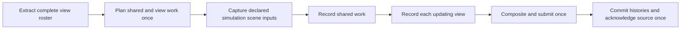
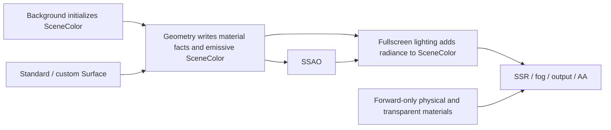
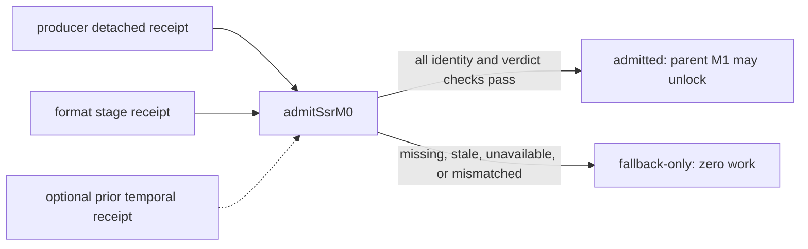
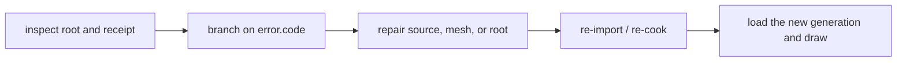
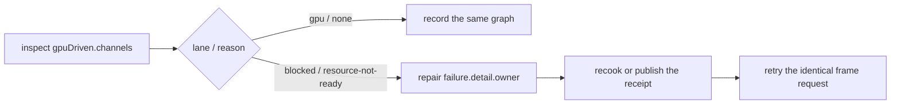
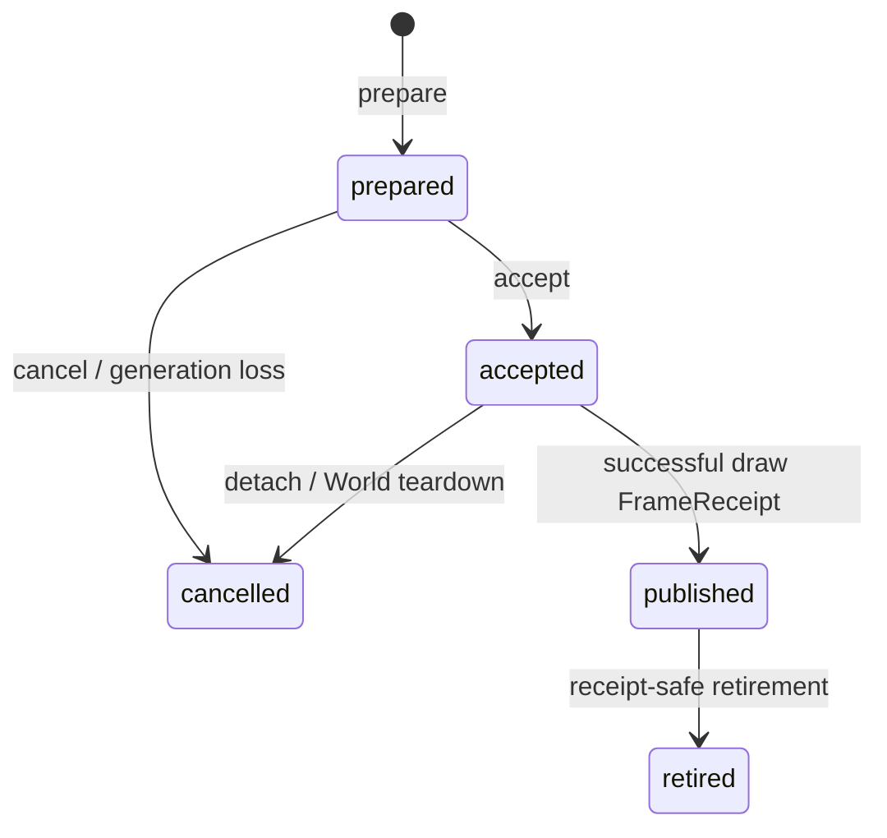
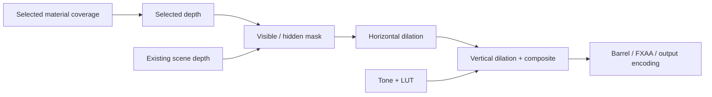
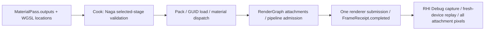
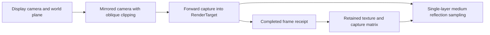

# `@forgeax/engine-render`

> [!NOTE]
> This package-owner README contains physical `@forgeax/engine-render` imports
> in internal ownership examples. Game-facing code should use the public
> facade `@forgeax/engine/render`; the Bloom consumer route is documented in
> [hello-bloom](../../apps/hello/bloom/README.md).

> [!IMPORTANT]
> The Standard pipeline keeps dark-gradient color in `rgba16float` until one
> `outputTransform` reaches the `surface.storage.raw` endpoint; `inspect()` and
> `observe()` expose stable graph/backend identity facts, while pixel metrics
> belong exclusively to the Engine-owned hello-fxaa fixture report.

## Adjacent LOD coverage

Resident rigid Standard PBR meshes (opaque or alpha-masked) use
complementary screen-door coverage in the GPU LOD lane. Author the usual
`MeshAsset.lods` and `lodHysteresis`; no second component or material alpha
animation is required. The existing fractional boundary band defaults to 0.08;
zero retains a hard switch. Outside the band, exactly one level is drawn.

For boundary $b$ and half-width $w$, the lower-detail coverage is
$t = 0.5 + (b - h) / (2w)$, where $h$ is projected screen height. Each band is
bounded by neighboring threshold midpoints so only adjacent levels overlap.
The same screen-space noise partitions the pair into complementary samples:
the outgoing level keeps $n \ge t$ and the incoming level keeps $n < t$.
Reversing or stopping the camera reverses or holds coverage without a timer,
random reseed, or per-object transition history. Camera teleports select the
new band directly; they do not enqueue intermediate levels.

| Path | Behavior |
|:--|:--|
| Standard Forward / Deferred / generated ShadowCaster | The selected pair uses the same signed coverage value; depth writes and authored alpha clipping remain enabled. |
| Standard temporal data for rigid LOD meshes | Reuses the selected geometry and coverage; transition samples reject stale color history. |
| Cached camera-only frame | Grouping, candidates and the filtered plan are retained across every band and threshold; the GPU cull recomputes height, level and coverage from the view camera. |
| Missing lower mesh or invalid projection | Resident fallback remains visible; a missing level never fades to an empty draw. |
| Skinned, transparent, arbitrary custom shader, or CPU fallback lane | Existing single-level behavior; no uncontracted opacity or extra draw is injected. |

The GPU cull owns selection. Each candidate derives its projected height from
the GpuScene root transform and local bounds plus the view's
`LodViewConstants` (camera position, projection, height scale), then hard
selects a level or, for crossfade-capable batches, a coverage pair. LOD
members with an identical chain share one batch; the batch owns one indirect
command and one visible segment per level, so a level change moves an item
between segments without touching the plan. There is no CPU height payload.

During a transition, GPU candidate/visible histograms count raster candidates,
including both levels. `geometryWork` exposes the extra work (`indirectDrawCount`
stays one row per level); `rootGeometryWork` counts the original candidate once. No extra material,
bind group, texture, render pass, or persistent transition-state table is added.

The regression fixtures are `lod-transition.unit.test.ts` in Render and the
shared `lod-transition.fixture.ts` Browser/Dawn journey in Runtime. The Dawn
journey saves real frame tapes, selected work indices, bindings, color/depth
readback, and live/fresh-device replay comparisons under
`artifacts/lod-transition/dawn/`.

References: [Three.js LOD](https://github.com/mrdoob/three.js/blob/dev/src/objects/LOD.js)
uses hysteretic single-object visibility; the contrasting coverage approach is
Unreal's [Dithered LOD Transition material option](https://dev.epicgames.com/documentation/en-us/unreal-engine/material-properties-in-unreal-engine).
The Unreal documentation endpoint was access-restricted during implementation;
this implementation uses its own deterministic coverage contract and tests.

## Public frame contract

Material graph projection and command recording consume the immutable
`MaterialShaderArtifact.program` published by ShaderRegistry. Camera motion,
graph replacement and material pass selection do not rescan shader source for
group-2 or ProbeBlend bindings and do not recompute program identity. Replacing
source replaces the complete program description; GPU recovery preserves the
CPU description through the registry fork.

GPU material binding classes derive pass membership from authored material
snapshots. Program entries and probe variants are selected from the retained
scene before camera culling, using the same row/dispatch index domain for normal
frames and device recovery. A shadow-only receiver therefore retains its main
material program and cannot change graph topology merely by leaving the camera.
Actual material program, binding and mesh resource changes still invalidate it.

GPU-driven scene preparation retains material admission, mesh compatibility,
static grouping and draw ownership until the source plan, slots, world mapping,
mesh residency or selected material program changes. Main and shadow views share
that preparation. Camera motion, visibility changes and shadow membership only
project the affected view; they do not repeat scene admission. LOD selection is
a GPU cull decision per view and never rebuilds the plan; per-view binding
classes still determine resource grouping. `gpuOwnedSnapshotsMaterialized` counts scene preparation in
the last frame; `filteredPlanBuilds` counts main-view projection rebuilds.
Batch topology keeps each batch's identity and generation stable across
content edits: material, skin-eligibility and LOD payload facts advance only
that batch's `contentEpoch`, compared by value so a posed skin's re-extracted
but equal material records advance nothing. Scene preparation is memoized per
batch by `(generation, contentEpoch)`; `preparedBatchBuilds` and
`filteredBatchBuilds` count the source and per-world batches re-prepared in
the last frame and are zero in steady motion. There is no per-batch mesh
projection: every GPU-driven raster and shadow draw binds the whole GpuScene
transform, instance and primitive tables, and the culler's visible item
`(instanceRow, materialIndex, customDataStart, lodFade)` names a scene instance
row directly. The vertex stage derives world and previous-world matrices,
reactive and motion-valid flags, and the probe identity from those rows, so a
moved entity costs only its dirty GpuScene rows. Surface frame inputs are keyed
by the same scene instance row.
`planRebuildBatches` and `planRebuildCandidates` count the submission-plan
batches and candidates re-derived in the last frame; both are zero on a
prepared-plan cache hit. `lodSelectionChanges` counts LOD candidates whose
selected raster levels changed since the previous frame over the same prepared
plan; a plan rebuild resets that baseline and reports zero. It is a CPU mirror
of the GPU choice kept for telemetry and shadow-cache invalidation; near a
threshold its f64 height can disagree with the GPU f32 height for one frame.
`indirectDrawCount` counts indirect commands, one per LOD level of each
admitted batch. The existing
`sceneTableUploadBytes`, `candidateUploadBytes`,
`batchUploadBytes` and `paletteUploadBytes` are the per-frame upload counts at
their single write points. Mesh vertex/index residency uploads have no single
choke point on this path and are not reported.

Shadow ownership validation and CPU residual culling read world-space bounds
from the retained scene, including instance unions. Object transforms, instance
publications and mesh changes invalidate those bounds at the scene owner;
camera rotation does not. Each shadow view still intersects the bounds with its
own light-space planes. Unknown bounds and deformed geometry stay conservative.

Every accepted `FrameReceipt` with a submitted camera context carries an
immutable `barrelDistortion` mapping, including the exact identity mapping when
the camera has no active distortion. The optional property is a transport and
pre-first-frame shape: `undefined` means that no accepted submitted display
context exists. It is fail-closed, never an identity guess; display consumers
must wait for a new submitted frame.
The mapping is tied to the submitted output extent, camera matrices, device
generation, graph generation, and frame identity. Consumers must keep those
facts together; a mapping from a newer World edit cannot be applied to an older
picture. The renderer publishes the mapping only after queue submission, and a
candidate that fails validation keeps the previous accepted picture and
mapping. The public projection is deeply frozen and contains no device, graph,
texture, or mutable resource handle.

`renderer.inspect().barrelDistortion` projects the same accepted context as
`effectiveMapping`, `extent`, `frameId`, `deviceGeneration`,
`graphGeneration`, and `lastKnownGood`. Before the first accepted frame, after
surface retirement, or during device loss, `effectiveMapping` is unavailable;
display consumers must wait for a new submitted frame. An invalid authoring
value returns `barrel-distortion-invalid-parameter` with its field and bound.
Unsupported float attachment capability is reported only for an active plan;
an empty or zero-strength plan stays zero-work. A pending or failed disable
keeps the old nonzero mapping with its picture, while a successful disable
publishes identity and retires the old feature resources through the normal
in-flight fence.

`Fog` provides distance fog with exponential height density. `density`,
`heightFalloff`, linear `color` and `maxOpacity` are selected from the frame's
resource owner. Disabled or zero-density fog records no fog pass; there is no
3D texture, froxel grid or temporal history. The authored sky remains unchanged.
SMAA, FXAA, TAA and no-AA use single-sample depth; MSAA is rejected until a
matching depth resolve is available. Use `VolumetricFog` for spatial density and
lighting/scattering effects; the meadow-style distance haze needs only `Fog`.

### Fog and translucency

Fog composites depth-correctly with translucency (the Unreal
`CalculateHeightFog`-per-translucent model, not Three.js's per-material
`#include <fog_fragment>` mix toward fog color):

1. The `analytic-fog` raster pass fogs the opaque scene in place, after opaque
   and Deferred shading and before the transmission backdrop copy and every
   translucent draw. It reads `scene-depth` and the View uniform and writes
   `scene-color` directly; no extra color target is allocated.
2. Each blended writer fogs itself at its own depth with the shared WGSL
   `translucent_fog(view, worldPos, color, alpha)` from `forgeax_view::fog`.
   Built-in Standard, Unlit, sprite, text and point/line programs, plus every
   GPU particle topology (billboard, mesh, ribbon, trail, beam), call it;
   clip-space producers reconstruct `worldPos` with `ndc_world`.
3. The renderer binds a View copy whose `fogHeightOpacity.z` names the draw's
   blend composition, derived from its blend state: straight alpha adds
   `inscatter`, premultiplied adds `inscatter * alpha`, additive only
   attenuates by transmittance (it fades toward zero, never toward fog color).
   Opaque draws and frames without Fog bind the unfogged composition, so the
   same program is never fogged twice. `translucentViewOffset(composition)` is
   the byte offset of each copy inside the View buffer.

Custom WGSL blended materials import `translucent_fog` and apply it to their
final color the same way; an opaque custom material needs nothing. Each
translucent layer is fogged as a single homogeneous-medium segment from the
camera; transmission/refraction samples the already-fogged backdrop, and the
integrated `VolumetricFog` volume is composited onto the opaque scene only.

Performance evidence: `translucent-fog.dawn.test.ts` records per-pass GPU
timestamps and draw-to-completion latency with Fog interleaved off/on over 16
fullscreen translucent layers
(`artifacts/translucent-fog/dawn/timing-<size>.json`). On Lavapipe the
completion delta is the fog pass plus a small per-fragment cost (+0.4 ms at
256 px, +9 ms of ~80 ms at 512 px under load); Lavapipe rasterizes deferred, so
its per-pass timestamps can move work between passes and are not a
per-fragment cost measure.

### Local volumetric fog

Spawn one `VolumetricFog` per local medium in the rendered environment World.
Each owner selects its own light, 3D density texture, world-space bounds, and
optical coefficients. Up to `MAX_VOLUMETRIC_FOG_OWNERS` (8) owners share the
renderer-owned inject, integrate, temporal, and composite passes. Overlapping
media add coefficients before integration; removing one owner keeps the others.
Removing the last owner retires the volume graph resources.

| Author field | Contract |
|:--|:--|
| `density` | Shared linear `TextureAsset`, `viewDimension: '3d'` |
| `sampling` | ECS enum: `VolumetricFogSamplingValue.noise` (default animated atmospheric grain), or `.density` (local normalized bounds sample) |
| `boundsMin`, `boundsMax` | Finite world coordinates, strictly increasing on each axis; not transformed by `Transform` |
| `extinction`, `albedo`, `emission` | Nonnegative RGB; albedo additionally at most 1 |
| `anisotropy`, `maxDistance` | Finite, respectively `(-1, 1)` and positive world units |
| `light`, `spotLight` | Same-World selected light and optional Point/Spot pair, as in the existing single-volume contract |

Pure `VolumetricFogAuthoring` validation uses the string sampling labels, not
the ECS numeric values. `extractVolumetricFog()` returns an available `fogs`
collection and validates every member atomically. Overflow returns
`volume-owner-conflict` with `detail.ownerCount`; invalid author parameters
retain the existing structured error contract.

Read `renderer.inspect().volumetricFog.ownerCount` after a completed frame for
the accepted collection, alongside status, pass count, memory, and generation.
It is not an echo of a rejected candidate. Light projectors retain the shared
renderer-selected projector contract; only its selected light samples the map.

> [!IMPORTANT]
> This is local-medium integration against opaque scene depth. The integrated
> volume is composited onto the opaque scene before translucency; translucent
> and VFX writers receive only the analytic `Fog` at their own depth. Software GPU readback is
> correctness evidence, not hardware performance evidence.

## 灯光最短入口

三条最短入口：

1. `RectAreaLight`：在现有 `Transform` 上声明单面矩形发光体，尺寸由 `width` 与 `height` 持有；可选 `sourceTexture`（任意尺寸的 2D `TextureAsset`：rgba8/bgra8 的 sRGB 或 linear、r8 灰度、rgba16float/rgba32float 截断到 [0,1] 走 CPU 投影；KTX2 块压缩格式 BC/ETC2/ASTC 由一次 compute 提交在 GPU 上从 level 0 重采样进共享 slice，需要 compute 与设备的压缩 feature，否则报一次 `feature-not-enabled` 并回退白色 slice）按 Unreal SourceTexture 方式调制漫反射与高光（LTC 平均方向投影到灯平面取 UV，按 footprint 选 mip），与 Spot `cookie` 共享同一 light-texture 数组并按 handle 去重；不支持的格式报结构化错误并回退为均匀发光。
2. `SpotLight`：用 `iesProfile` 和 `cookie` 绑定现有资产，用 `rollDeg` 共享方位角；缺席 handle 是乘法单位元。
3. `LightProbe`：声明 27 个 `irradiance` 值和唯一的 `radius`，位置与朝向仍来自 `Transform`。

这些是 authored/render 输入，不是 GPU slot、LTC、probe asset 或第二个 Renderer API。尺寸、半径和 `rollDeg` 在场景序列化中保留；资产 GUID 通过 Pack/Catalog 的 `refs` 往返，不能从 URL 或数组位置推断身份。

### Extended-lighting consumer route

The three smallest public examples are `RectAreaLight(width, height, sourceTexture?)`,
`SpotLight(iesProfile, cookie, rollDeg)`, and `LightProbe(irradiance, radius)`.
Probe diffuse uses `A={admitted && d<r}`, `c=1-(d/r)^2`, scaled finite `qhat`,
`alpha=q/Q`, `C=1-prod(1-c)`, and `S=1-C`; Sky is only
`S*E_sky(N)`. It never enters probe admission, `Q`, `alpha`, specular, or
`DirectLightSlot`. `recordByteLength=160` is the per-object ABI receipt.

Recovery is inspected as data: read `code`, `expected`, `hint`, and typed
`detail`; keep the current LKG until the replacement generation is accepted.
GPU, Browser, and Dawn evidence that cannot execute is `not-run` or
`unavailable`, never a verified structural substitute.

The public frame vocabulary is intentionally small. `Camera` is the authoring
owner for tone, exposure, color grading, antialiasing, bloom, and `historyVersion`; `Atmosphere` and
`Fog` are independent ECS components. The renderer extracts these facts into
an immutable `FramePlan`, records one frame, and returns a `FrameReceipt`.
`FrameReceipt` is the only successful synchronous proof that the host submit
reached the queue. Use `Renderer.inspect()` for detached lifecycle and
capability facts, then `observe(receipt, request)` for receipt-bound evidence.

### SMAA

Set `Camera.antialias` to `ANTIALIAS_SMAA` from `@forgeax/engine/render`.
It selects SMAA 1x Medium: spatial color-edge detection, eight two-pixel search
steps with the original area/search tables, then linear neighborhood blending.
It requires no jitter, motion vectors or history. The mode is exclusive with
FXAA, MSAA and TAA; `DynamicResolution` continues to require TAA.

| Stage | Input and output | Work |
|:--|:--|:--|
| `smaa-edges` | Linear LDR to RG8 edges | Threshold 0.1 and local contrast adaptation |
| `smaa-weights` | Edges and lookup tables to RGBA8 weights | Orthogonal searches, crossing-edge classification and area lookup |
| `smaa-blend` | Linear LDR and weights to RGBA16F | Blend the strongest adjacent edge, including alpha |

Standard runs SMAA at the output extent, after tone/LUT/Outline/BarrelDistortion
and before its single output encoding/dither. Forward and deferred share this
placement, including `tonemap: none`. Disabling SMAA removes all SMAA passes
and targets. The graph owns resize, replacement and fence-delayed retirement;
lookup uploads occur once per graph texture, with no external asset request.
Medium does not include the diagonal/corner detection of High/Ultra or T2x.

Inspect `renderer.inspect().perFramePassNames`, then capture with RHI Debug.
The permanent Browser/Dawn fixture under `packages/runtime/src/__tests__/smaa.*`
compares against a 4x-per-axis coverage reference, exercises 60 completed frames,
odd extents and disable/restore, reads every captured stage, compares live and
fresh-device replay, and removes the weight draw as a negative control.

The implementation references Three.js r184 `SMAANode.js` / `SMAAPass.js`
(commit `d3b629c0c2097cec664ad16369bb6eae3b10e335`) and Unreal's
`SubpixelMorphologicalAA.cpp` / `Shaders/Private/SMAA` at
`71fe36aac5a8df5ccd66c763ffc902b29b6a9c43` for pass and sampler ownership.
The WGSL adaptation and lookup data derive from Three.js and SMAA v2.8;
no Epic source is distributed. Redistribution terms are in
[src/features/smaa/LICENSE.txt](src/features/smaa/LICENSE.txt).

> Uses SMAA. Copyright (C) 2011 by Jorge Jimenez, Jose I. Echevarria,
> Tiago Sousa, Belen Masia, Fernando Navarro and Diego Gutierrez.

### AI cold-start route

An AI consumer can start with the public sequence `state -> inspect -> recover
-> FrameReceipt`. `Renderer.state()` is the closed lifecycle union: only
`alive` admits a frame; `device-lost` permits one explicit recovery flight;
`recovering` shares that flight; `faulted` requires a new Renderer; and
`disposed` is terminal. `inspect()` is detached POD evidence for the current
state, recovery attempt, and named output contract. After `recover()` succeeds, submit the current
draw input and use the new `FrameReceipt` as the proof for that generation.
An active device loss includes native `destroyed` notifications; only retired
or unpublished candidate generations are isolated from active health. Pending
dynamic geometry must be prepared again for the replacement generation before
admission. Explicit preparation between recovery and draw may upload its new
payload; the first-draw guard still rejects lazy cold uploads or pipeline builds
inside rendering. Preparation does not make an old-generation receipt current.
Recovery prepares the last successfully submitted workset; the next draw still
consumes current World edits and admits new resources through normal residency.
Fullscreen recovery warms only active declared post-process identities; graph-local
resource aliases are resolved by the prepared feature and are not separate pipelines.
Standard and Skin module preparation deduplicates exact source bytes in bounded
batches, retains every reachable draw variant, and settles all started compilation
before rejecting a candidate. Both direct and scene-index addressing remain
prepared for clustered, probe and skin draws, including backends without immediate
shader creation. The dedicated non-clustered GPU program does not cover those
combinations; each still uses its own matching pipeline layout.
Ordinary graph replacement retains the previous graph until submission settles,
using the same retirement boundary for resize and post-process changes.

`inspect().recovery` is always present. Its `phase` is `null` outside an active
attempt and otherwise follows `quiesce`, `acquire-adapter`, `acquire-device`,
`rehydrate`, `compile-graph`, `publish`, and `cleanup`. The projection also
reports the `fromGeneration`/`candidateGeneration` fence, monotonic `attempt`,
`lastOutcome`, committed `rehydratedRoots`, and bounded `staleLossEvents`.
These are detached facts; they never expose devices, graphs, textures, or
mutable resource collections.

During `device-lost` or `recovering`, the App keeps its host heartbeat but does
not advance the World or submit a frame. A failed `Result` is repaired from
`error.code`, `expected`, `hint`, and typed `detail`: wait for the shared
recovery flight, explicitly retry, repair the named owner, or create a new
Renderer according to the closed error. Do not parse `message`. Target and
history tokens retain logical identity, but their new-generation contents are
uninitialized until a successful receipt; a neutral target or last-known-good
fallback is not proof of real recovery. Public consumers never receive graph
nodes, devices, history textures, or prepared handles.

The current-source manifest and schema identify `source`, `build`, `backend`,
`runner`, and `frameIdentity`. Structural graph receipts, Browser/Dawn
readback or PNG evidence, and historical oracle data are separate evidence
classes. An unavailable backend is reported as unavailable.

Image-based environment preparation submits and fences each irradiance and
prefilter face before recording the next face. Texture sizes and shader sample
counts stay unchanged; candidate outputs and bake counters publish only after
the final BRDF fence succeeds in the same live DeviceScope generation.

### Renderer-wide graph allocation inspection

`renderer.inspect().renderGraphGenerationAllocation` is the renderer-owned
logical allocation receipt across active, volumetric candidate, retiring, and
detached recovery graph generations:

```ts
const allocation = renderer.inspect().renderGraphGenerationAllocation;
if (allocation?.availability === 'complete') {
  console.log(allocation.liveBytes, allocation.pendingRetirementBytes, allocation.peakBytes);
  for (const entry of allocation.entries) {
    console.log(entry.generation, entry.roles, entry.retirement, entry.allocation);
  }
}
```

`roles` identifies `active`, `candidate`, and `retiring` ownership; `retirement`
is `active`, `pending`, or `failed`. `liveBytes` and
`pendingRetirementBytes` are current logical bytes, while `peakBytes` is the
simultaneous logical high-water mark captured at compile, replacement, and
retirement events. `failedRetirementCount` and `failedRetirementBytes` keep a
destroy refusal, throw, or fence failure visible until its owner is repaired.
`availability` is `complete`, `partial`, or `unavailable`, with
`unavailableGenerationCount` explaining omitted graph facts. `unit` is
`engine-allocation-bytes` and `physicalResidency` is always `unknown`: imported
resources remain with their importing owner and logical byte size is not a VRAM
measurement. After a device-loss recovery, inspect the replacement generation
and retry the frame; a retained failed or pending row is recovery evidence.

Topology replacement shares exact-descriptor graph-created textures with the
live previous generation. Aggregate bytes deduplicate `physicalAllocationKey`;
a live lease takes precedence over a pending lease of the same allocation.
Per-generation lease totals can therefore sum to more than the aggregate.
Resize, descriptor change, device replacement, and failed candidate rollback
retain their existing validation and fence boundaries.

Compute program compilation is reused by exact WGSL, entry points, and binding
layout within one device/feature generation, with at most 64 retained programs.
Playback names keep independent references and buffers. Descriptor changes
still validate, and recovery compiles against the new device session.

## RenderFeature: the producer seam (first-read index)

### Material contract projection

Render consumes only the Pack-owned material publication projection. Its
inputs are runtime bool/value data, composed module slots, and the closed
compiler context; render never authors, cooks, writes DDC, or selects a
fallback material. The projection preserves `layoutIdentity`,
`programIdentity`, `cookIdentity`, and `materialPublicationIdentity` so a
stale draw can be traced to the first producer divergence.

`SpriteInstances` selects the published `sprite-instances` geometry context.
Its material snapshots are isolated from ordinary mesh snapshots even when
entities share a material handle, including reuse across extraction frames.
A missing cooked context is a producer error requiring re-cook, not permission
to reinterpret a mesh buffer as a region-bearing instance buffer.

### Independent Standard scalar maps

`Materials.standard` accepts independent linear-data textures without a custom
Surface or repacking image channels. Each slot accepts a GUID or the existing
`{ texture, sampler?, coordinates? }` value, including its own UV set/transform.

| Input | Channel selector | Default | Evaluation |
|:--|:--|:--|:--|
| `metallicTexture` | `metallicChannel` | B (`2`) | Multiply the selected texel by `metallic` |
| `roughnessTexture` | `roughnessChannel` | G (`1`) | Multiply by `roughness`, then clamp to `[0.04, 1]` |
| `alphaTexture` | `alphaChannel` | G (`1`) | Multiply base-color, base-map and vertex opacity |

Selectors are integers `0..3` for R/G/B/A. The default channels and scalar
multiplication follow [Three.js MeshStandardMaterial](https://threejs.org/docs/pages/MeshStandardMaterial.html).
ForgeaX retains its existing `metallic` naming and roughness scalar default.
An independent metallic/roughness input replaces only its corresponding packed
`metallicRoughnessTexture` sample; absent independent inputs use the packed
sample, or neutral white when neither is authored. The two texture sources are
never multiplied together. Alpha preserves the existing `alphaCutoff` and
`renderState.blend` policy; assigning a texture does not enable blending.

The canonical Standard pipeline reuses an earlier texel sample when an
independent map resolves to the same texture and sampler with the same UV set,
transform, and physical UV scale. A different sampler or coordinate mapping
keeps its own sample. This specializes the shader's sampling work; the
material's stable texture bindings remain separate slots, so existing packed
maps and independently authored maps can coexist without repacking.

```ts
const material = Materials.standard({
  baseColor: [1, 1, 1, 1],
  metallic: 1,
  roughness: 1,
  metallicTexture: metalGuid,
  roughnessTexture: { texture: roughGuid, coordinates: { set: 1 } },
  roughnessChannel: 0,
  alphaTexture: opacityGuid,
  alphaCutoff: 0.5,
});
```

Import the scalar images as linear data. Pack publication preserves GUID edges,
channel values, sampler references and coordinates, including child-material
GUID shorthand. glTF keeps its standard packed metallic-roughness input;
independent overrides can be authored on the resulting Standard material.
Forward, Deferred, skinned and shadow templates consume the same Surface.
New independent slots are declared only when authored in a cooked root. The
shared runtime layout keeps the minimum 16-texture profile by omitting unused
transmission maps and the backdrop when transmission is unavailable. Standard
backdrop sampling reuses the IBL prefilter sampler, retaining the 16-sampler
ceiling. Transmission and extended-lighting topologies require 21 and 24 sampled
textures respectively; device creation requests the admitted topology.

The scalar-map GPU regression runs in both Dawn and Chromium. It reads Surface
outputs before lighting, captures each draw with RHI Debug, checks seeded texture
bindings, and compares fresh-device replay pixels with live readback. Dawn saves
its twelve tapes and work/event/digest receipts under
`artifacts/standard-independent-maps/`. These focused probes supplement the
full Browser, Dawn and 60-frame hello/learn smoke gates.

### Single-layer medium Surface

`MaterialAsset.surface` selects the Engine template and one imported Surface
implementation. A Standard Surface imports
`forgeax_material::surface_v1::{SurfaceInput, SurfaceData}` and exports
`evaluate_surface(SurfaceInput) -> SurfaceData`. A
`model: 'single-layer-medium'` Surface instead imports
`forgeax_material::single_layer_medium_surface_v1::{SingleLayerMediumSurfaceInput,
SingleLayerMediumSurfaceData}` and exports that separate input/data ABI. The
Surface returns normal, roughness, coverage, foam, absorption, scattering, IOR,
and phase facts; Render performs the finite Beer-Lambert/single-scatter
integral, one Fresnel allocation, and consumes renderer-owned paired
color/depth frame facts. `maxDistanceMeters` is a finite authored upper bound
in metres for the sky-miss case. A valid value is carried through the Surface
ABI and Cook output, while invalid or absent input uses the conservative Engine
bound; it never turns an unavailable depth producer into a synthetic sample.
The Surface does not declare a stage, binding, attachment, BRDF, or vertex
displacement.

```ts
import { definePack, definePackageId } from '@forgeax/engine/pack/source';
import { ok, type MaterialAsset } from '@forgeax/engine/types';

const packageId = definePackageId('01900000-0000-7000-8000-000000000001');

const material = {
  kind: 'material',
  surface: {
    model: 'single-layer-medium',
    module: 'game::water_surface_a',
    dynamicInput: {
      name: 'waterEvents',
      fields: [
        { name: 'position', type: 'vec3<f32>' },
        { name: 'time', type: 'f32' },
        { name: 'eventId', type: 'u32' },
      ],
      maxRecords: 64,
      maxDomains: 8,
      maxPageBytes: 2048,
      maxBindings: 1,
      maxEventsPerSample: 8,
    },
  },
  passes: [{ name: 'color', program: { module: 'forgeax::single-layer-medium' } }],
  parameters: [
    { name: 'coverage', type: 'f32' },
    { name: 'absorption', type: 'vec3' },
  ],
  values: { coverage: 0.85, absorption: [0.22, 0.07, 0.025] },
} satisfies MaterialAsset;

export default definePack({
  schemaVersion: '2.0.0',
  packageId,
  name: 'Water',
  build: () => ok({ 'material/water': material }),
});
```

The authored module reads that schema through the compiler-generated accessor;
parameter names are fields on `material`, not free uniforms or string lookups:

```wgsl
#define_import_path game::water_surface_a
#import forgeax_material::parameters::{material}
#import forgeax_material::single_layer_medium_surface_v1::{SingleLayerMediumSurfaceInput, SingleLayerMediumSurfaceData}

fn evaluate_surface(input: SingleLayerMediumSurfaceInput) -> SingleLayerMediumSurfaceData {
  return SingleLayerMediumSurfaceData(
    normalize(input.vertexNormalWS),
    0.16,
    material.coverage,
    0.0,
    material.absorption,
    vec3<f32>(0.018, 0.04, 0.085),
    1.333,
    0.24,
    900.0,
  );
}
```

Cook validates this accessor against `parameters`, the Pack transport writes
the cooked material through JSON while preserving its GUID, and runtime loads
that GUID before allocating the `MaterialAsset` handle used by `MeshRenderer`.
The executable [LightProbe to ProbeBlend to Surface example](#lightprobe-to-probeblend-to-surface-example)
shows the `loadByGuid<MaterialAsset>` → World → `MeshRenderer` → `draw` half of
the same route.

The generated dynamic page is a bounded, read-only storage record. Create one
`ReadonlyDynamicInputPage`, write only changed records, then reserve an explicit
`{ domain, recordStart, recordCount, instanceIndex, member }` range for each draw.
`member` is the stable public address
`{ worldIdentity: world.identity, entityKey, drawItemIndex, instanceOrdinal }`.
Its
`contentRevision`, `bufferGeneration`, and `deviceGeneration` are separate
facts; stale ranges and consumption before an upload return a structured error.
The page uses the existing instance bind group's free binding and never uses
skinning's `customDataStart`. Publish the page to the existing Renderer owner
before drawing:
`renderer.setSurfaceDynamicInput({ page, ranges, projectionRevision, frameTime })`.
Advance `projectionRevision` only when range membership or addresses change;
record values and World time keep the current revision so stable frames reuse
the retained validation and consumption projection.
Range order is irrelevant: Render joins each range to the admitted candidate by
`member` and rejects missing, duplicate, or non-admitted identities.

#### Visible surface observation

Visible-surface demand uses the same submit-fenced scene history as temporal
camera effects. Instance replacement and material edits invalidate motion;
instance storage retains both current and previous revisions so stopping
settles velocity on the following accepted frame. Device recovery uses the
active profile to select the same material ABI as normal preparation.

`StandardProfile.visibleSurface: true` enables the deferred rigid-surface
attachment. The device must expose `primitive-index`, six color attachments and
48 aligned attachment bytes/sample; this path is single-sample. It preserves
the ordinary color output and uses the same authored Standard material coverage.
The four unsigned words are a frame-local row, draw-local primitive, packed
geometric normal and coverage/front-face flags. Shading normals stay in the
existing packed G-buffer and motion stays with the shared temporal producer.

GPU-driven rigid draws keep transforms in the shared GPU Scene tables. An
optional view-owned `u32` table maps each candidate to its submitted receiver
row at group 3 binding 7; buffer replacement reseeds both topology and rows.
Disabling visible surfaces removes this allocation. Color and shadow vertices
share the visible stream at binding 2, leaving ProbeBlend binding 1
fragment-only so the complete skin layout fits the portable storage limit.

Arm `renderer.requestObservation(['visible-surface'])` before `draw`, then read
`renderer.observe(receipt, { include: ['visible-surface'] })` after completion.
The returned observation includes padded `rgba32uint` bytes and detached
`records`; `resolveVisibleSurface(observation, row, primitive)` resolves the
matching entity, instance generation, material and source element range. A row
is only meaningful with its own observation, never with the current scene.
`row === 0` is uncovered; the primitive starts at zero for each draw, including
nonzero source ranges. Background and MASK-discarded fragments remain invalid.

At most four unread frame observations are admitted. Read their receipts before
arming more; reads consume the captured copy once. Resize and later scene edits
do not reinterpret earlier copies. Device loss, replacement and disposal reject old
receipts, including an observation whose asynchronous read crosses retirement. With no observation request there is no readback allocation, map or
copy; turning off the profile removes the extra attachment and temporal demand.
Current qualification is rigid base-LOD Standard geometry with unchunked
instances and local World leases. Skin/morph/LOD, storage-split instances,
shared publications and reflection-fallback combinations remain unqualified.

#### Linear HDR optical oracle

The physical oracle observes the real Pack → GUID → World → medium nearest/color
path before exposure, tone mapping, and anti-aliasing. Arm the next successful
submit with `renderer.requestObservation(['linear-hdr'])`, keep its `FrameReceipt`,
then call `renderer.observe(receipt, { include: ['linear-hdr'] })`. The returned
bytes are padded-row `rgba16float`; `frameId`, device and graph generations,
texture identity, and readback identity bind them to that exact completed frame.
When no observation is requested, the renderer does not copy, map, or synchronously
read this attachment.

> [!IMPORTANT]
> Compare optical math in this linear attachment. A canvas screenshot is an
> exposed, tone-mapped, anti-aliased presentation artifact and cannot prove the
> Beer-Lambert, scatter, or Fresnel contract.

The permanent fixture loads authored water through the Preview Pack, freezes the
camera, medium parameters, paired background, light, event time, and fixed ROI,
then compares the observed half-floats with an independent double-precision
screen-space reference. Its evidence also carries the actual nearest/color
program and resource generations plus the completed submission receipt.

Author 4x coverage through the Camera component. ECS fields retain their numeric
schema representation; `ANTIALIAS_MSAA` extracts to the public closed
`antialias: 'msaa'` render fact:

```ts
import { ANTIALIAS_MSAA, Camera, orthographic } from '@forgeax/engine/render';

world.spawn({
  component: Camera,
  data: {
    ...orthographic({ left: -3, right: 3, bottom: -2, top: 2 }),
    antialias: ANTIALIAS_MSAA,
  },
});
```

The edge oracle independently projects the authored rod, wall, shoreline, and
rough-water rectangles onto the canonical four sample positions. Fully covered
control regions calibrate each authored linear-HDR endpoint. For opaque edges,
the nearest depth sample selects its matching color before the full-coverage
water pass. For partial water coverage, the final hardware resolve averages the
independently predicted covered samples. The oracle rejects the opposite policy,
checks a small moving-camera interval, repeats after an 800-by-450 backing resize,
and keeps the physical maximum per-channel error at `0.05`. Its pure four-sample
counterexample separately proves why averaging color and then choosing the
nearest depth loses the color/depth pair.

```sh
FORGEAX_SURFACE_LANE_PARITY=1 pnpm exec vitest run --project=dawn --retry=0 \
  --maxWorkers=1 --no-file-parallelism \
  packages/runtime/src/__tests__/surface-standard-pipeline.dawn.test.ts

FORGEAX_SURFACE_LANE_PARITY=1 pnpm exec vitest run \
  --config vitest.browser.config.ts --project=browser --retry=0 \
  --maxWorkers=1 --no-file-parallelism \
  packages/runtime/src/__tests__/surface-standard-pipeline.browser.test.ts

FORGEAX_SURFACE_MSAA4X=1 FORGEAX_SURFACE_LANE_PARITY=1 \
  pnpm exec vitest run --project=dawn --retry=0 --maxWorkers=1 \
  --no-file-parallelism \
  packages/runtime/src/__tests__/surface-standard-pipeline.dawn.test.ts

VITE_FORGEAX_SURFACE_MSAA4X=1 FORGEAX_SURFACE_LANE_PARITY=1 \
  pnpm exec vitest run --project=browser --retry=0 --maxWorkers=1 \
  --no-file-parallelism \
  packages/runtime/src/__tests__/surface-standard-pipeline.browser.test.ts

# Public App lifecycle: World-time water events plus a cooked GPU splash.
FORGEAX_SURFACE_APP_LIFECYCLE_ONLY=1 pnpm exec vitest run --project=dawn \
  --retry=0 --maxWorkers=1 --no-file-parallelism \
  packages/runtime/src/__tests__/surface-standard-pipeline.dawn.test.ts

VITE_FORGEAX_SURFACE_APP_LIFECYCLE_ONLY=1 pnpm exec vitest run --project=browser \
  --retry=0 --maxWorkers=1 --no-file-parallelism \
  packages/runtime/src/__tests__/surface-standard-pipeline.browser.test.ts
```

The Dawn Surface gate also compares every output pixel between Forward and
Deferred, then toggles SH irradiance on base and Physical materials to reject a
shared missing-lighting implementation. Native WebGPU validation errors fail
the gate. Set `FORGEAX_SURFACE_RHI_CAPTURE_DIR=artifacts/surface-rhi` on the same
command to retain each paired `.rhitape` and its original `live.rgba8`. The
recorder follows device loss before recovery, so captures never mix generations.

The lifecycle gate enqueues two deduplicated impacts into one attached World.
Its Update system takes one `Time.elapsed` snapshot, stamps both Surface records,
and starts the matching `ParticleEffectPlayer` edges. The splash is the authored
`surface-water-splash.pack.json` asset: the Pack transport resolves its GUID,
`loadVfxGpuEffect` loads its cooked program, and `createVfxRuntimeHost` contributes
the production renderer feature. The gate rejects an effect without a renderer;
an intent-only program is not visible evidence.

Before each target submit, the gate arms the existing `linear-hdr` observation.
It reads pre-frozen 16-by-16 water-A, water-B, and above-water splash ROIs from
that completed receipt, and compares every pixel. The mask never depends on
brightness, medians, or observed error. Evidence carries the frame, device,
graph, texture, and readback identities. The active splash ROI must change and
return to its baseline after the effect expires; the VFX host must also retire
both players. `rgba16float` samples remain unclamped linear values, including
values above 1, and use the same maximum per-channel error of `0.05` at every
lifecycle stage. The oracle does not round them through an 8-bit domain.

A real wait while paused preserves World time, committed VFX state, receipt
count, and the exact active completed image: `paused` reuses the active receipt
and does not submit a zero-delta frame. `resume()` continues from retained World
time without adding the paused host interval or replaying either splash. The
later `stepFrame(0.05)` calls are explicit deterministic simulation steps used
to reach camera coverage and expiry; they advance World time and therefore are
not evidence that a paused App remains frozen. In Dawn only, a timer supplies
the missing host scheduling primitive; the same App remains the sole owner of
World update and Renderer draw.

### LightProbe to ProbeBlend to Surface example

The following scene uses one authored water material for two entities. Each
entity selects a different local `LightProbe` domain, while both consume the
same bounded dynamic-input page. The renderer derives `ProbeBlendRecord`, slot,
generation, and the direct or scene-index consumer lane from the attached
World; application code does not build a second probe table.

`drawProbeLitWater` receives an already-constructed Runtime `Renderer`.
Construct it at the Runtime boundary with `await createRenderer(canvas)`, check
the returned `Result` (`if (!result.ok) throw result.error`), and pass
`result.value` to this helper. Runtime completes renderer initialization before
returning that value, so the render helper does not own a second initialization
promise.

```ts
import { Time, World } from '@forgeax/engine-ecs';
import { createPlaneGeometry } from '@forgeax/engine-geometry';
import {
  Camera,
  DirectionalLight,
  LightProbe,
  MeshFilter,
  MeshRenderer,
  ReadonlyDynamicInputPage,
  type Renderer,
} from '@forgeax/engine-render';
import { Transform } from '@forgeax/engine-scene';
import { type AssetRegistry } from '@forgeax/engine-assets-runtime';
import type { AssetGuid, MaterialAsset } from '@forgeax/engine-types';

export async function drawProbeLitWater(
  renderer: Renderer,
  assets: AssetRegistry,
  waterGuid: AssetGuid,
) {
  // The Pack producer cooks the authored MaterialAsset and its Surface module;
  // runtime consumers load only the GUID-addressed publication.
  const loaded = await assets.loadByGuid<MaterialAsset>(waterGuid);
  if (!loaded.ok) throw loaded.error;
  const water = loaded.value;
  const dynamicInput = water.surface?.dynamicInput;
  if (water.surface?.model !== 'single-layer-medium' || dynamicInput === undefined) {
    throw new Error('expected an authored single-layer-medium Surface');
  }

  const world = new World();
  const plane = createPlaneGeometry(1.8, 1.8).unwrap();
  const mesh = world.allocSharedRef('MeshAsset', plane);
  const material = world.allocSharedRef('MaterialAsset', water);
  const waterEntities = [-1.2, 1.2].map((x) =>
    world
      .spawn(
        { component: Transform, data: { pos: [x, 0, 0] } },
        { component: MeshFilter, data: { assetHandle: mesh } },
        { component: MeshRenderer, data: { materials: [material] } },
      )
      .unwrap(),
  );

  const red = new Float32Array(27);
  red[0] = 1.8;
  const blue = new Float32Array(27);
  blue[2] = 1.8;
  world.spawn(
    { component: Transform, data: { pos: [-1.2, 0, 0] } },
    { component: LightProbe, data: { irradiance: red, radius: 1 } },
  );
  world.spawn(
    { component: Transform, data: { pos: [1.2, 0, 0] } },
    { component: LightProbe, data: { irradiance: blue, radius: 1 } },
  );
  world.spawn(
    { component: Transform, data: { pos: [0, 0, 6] } },
    {
      component: Camera,
      data: { fov: Math.PI / 4, aspect: 16 / 9, near: 0.1, far: 20 },
    },
  );
  world.spawn({
    component: DirectionalLight,
    data: { direction: [0, 0, -1], color: [1, 1, 1], intensity: 1 },
  });

  const page = ReadonlyDynamicInputPage.create({
    sourceId: 'water-events',
    pageId: 1,
    schema: dynamicInput,
  }).unwrap();
  const eventLifetimeSeconds = 0.45;
  const events = [
    { position: [-1.2, 0, 0] as const, time: 0, eventId: 1 },
    { position: [1.2, 0, 0] as const, time: 0, eventId: 2 },
  ] as const;
  let publishedEventCount = 0;
  let projectionRevision = 1;
  let publishedDeviceGeneration = renderer.inspect().frame.deviceGeneration;
  page.reconfigureDevice(publishedDeviceGeneration).unwrap();

  const reserveFreshRanges = () =>
    waterEntities.map((entityKey, index) =>
      page
        .reserveRange({
          domain: index === 0 ? 'water-left' : 'water-right',
          recordStart: index,
          recordCount: 1,
          instanceIndex: index,
          member: {
            worldIdentity: world.identity,
            entityKey,
            drawItemIndex: 0,
            instanceOrdinal: 0,
          },
        })
        .unwrap(),
    );
  let ranges = reserveFreshRanges();
  let deviceLost = renderer.state() === 'device-lost';

  const publishDynamicInput = (now: number): void => {
    const activeEvents = events.filter(
      (event) => now >= event.time && now - event.time < eventLifetimeSeconds,
    );
    const recordsToRewrite = Math.max(publishedEventCount, activeEvents.length);
    for (let index = 0; index < recordsToRewrite; index += 1) {
      page
        .writeRecord(
          index,
          activeEvents[index] ?? { position: [0, 0, 0], time: -1_000, eventId: 0 },
        )
        .unwrap();
    }
    publishedEventCount = activeEvents.length;
    renderer.setSurfaceDynamicInput({ page, ranges, projectionRevision, frameTime: now });
  };

  const recoverAndRepublish = async (): Promise<number> => {
    if (renderer.state() !== 'device-lost') {
      throw new Error('water recovery requires the Renderer device-lost state');
    }
    const recovered = await renderer.recover();
    if (!recovered.ok) throw recovered.error;
    const nextDeviceGeneration = renderer.inspect().frame.deviceGeneration;
    if (nextDeviceGeneration <= publishedDeviceGeneration) {
      throw new Error('water recovery did not publish a new device generation');
    }
    const previousRanges = ranges;
    page.reconfigureDevice(nextDeviceGeneration).unwrap();
    ranges = reserveFreshRanges();
    if (
      ranges.some(
        (range, index) =>
          range === previousRanges[index] ||
          range.deviceGeneration !== nextDeviceGeneration ||
          range.bufferGeneration === previousRanges[index]?.bufferGeneration,
      )
    ) {
      throw new Error('water recovery reused a pre-recovery dynamic range');
    }
    publishedDeviceGeneration = nextDeviceGeneration;
    projectionRevision += 1;
    publishDynamicInput(world.getResource(Time).elapsed);
    deviceLost = false;
    return nextDeviceGeneration;
  };

  const unsubscribe = renderer.subscribe((event) => {
    if (event.kind === 'state-changed' && event.current === 'device-lost') {
      deviceLost = true;
    }
  });
  try {
    const attachment = renderer.attach(world);
    if (!attachment.ok) throw attachment.error;
    const attached = attachment.value;
    publishDynamicInput(world.getResource(Time).elapsed);
    world.update(1 / 60).unwrap();
    const submitAndObserve = async () => {
      // The Renderer keeps this logical World lease valid across recovery;
      // retry the same lease after the page and ranges are revalidated.
      const submitted = renderer.draw({
        leases: [attached],
        camera: { lease: attached },
        environment: { lease: attached },
      });
      if (!submitted.ok) throw submitted.error;
      const completed = await submitted.value.completed;
      if (!completed.ok) throw completed.error;
      const observed = await renderer.observe(submitted.value, { include: ['draws'] });
      if (!observed.ok) throw observed.error;
      return submitted.value;
    };

    let submitted: Awaited<ReturnType<typeof submitAndObserve>>;
    try {
      submitted = await submitAndObserve();
    } catch (cause) {
      // A first frame can fail before it yields a receipt. Recover only when
      // the public lifecycle reports the actual device-lost state.
      if (renderer.state() !== 'device-lost') throw cause;
      await recoverAndRepublish();
      submitted = await submitAndObserve();
    }
    if (deviceLost || renderer.state() === 'device-lost') {
      await recoverAndRepublish();
      submitted = await submitAndObserve();
    }
    const inspection = renderer.inspect();
    if (submitted.deviceGeneration !== publishedDeviceGeneration) {
      throw new Error('water draw receipt does not match the published device generation');
    }
    return {
      world,
      attached,
      page,
      receipt: submitted,
      submission: inspection.renderScene.submission,
      deviceGeneration: inspection.frame.deviceGeneration,
    };
  } finally {
    unsubscribe();
  }
}
```

The repository exercises this route through real Pack/GUID publication and a
physical texture or compositor readback:

```bash
pnpm exec vitest run --project=dawn \
  packages/runtime/src/__tests__/surface-standard-pipeline.dawn.test.ts --retry=0
pnpm exec vitest run --config vitest.browser.config.ts --project=browser \
  packages/runtime/src/__tests__/surface-standard-pipeline.browser.test.ts --retry=0

# Same material, scene, time, events, ProbeBlend domains, exposure, and ROI;
# cold direct -> GPU -> direct. The original 0.05 RGB oracle remains active.
FORGEAX_SURFACE_LANE_PARITY=1 FORGEAX_DAWN_LIGHTWEIGHT=1 \
  pnpm exec vitest run --project=dawn \
  packages/runtime/src/__tests__/surface-standard-pipeline.dawn.test.ts --retry=0
```

Direct medium draws use a dedicated group(3): ordinary instance transforms,
the retained ProbeBlend record, dynamic page, per-member frame rows, shared
frame time, and a producer-owned per-draw frame-base uniform. The vertex shader
addresses `frameBase + instance_index`; neither GUID order nor a scene-index
visible slot is used to infer that address. Missing member identity, page,
generation, or frame-base publication fails the draw through the structured
Render error path.

After a successful submission, `renderer.inspect().renderScene.gpuDriven.surfaceArtifact`
exposes the selected direct/scene-index entries and artifact/resource
generation. `renderer.inspect().renderScene.submission` separates
`requestedLane` from the command-derived `actualLane` and publishes only
nearest/color passes that encoded a real `draw*` or `draw*Indirect` command.
When the current Standard frame carries the reflection fallback MRT, the same
submission projection reports `actualLane: 'direct'` with
`actualLaneReason: 'reflection-fallback-mrt'`. This is a pass-ownership
constraint, not a device-capability result; the reason is absent again when a
later frame resumes the ordinary GPU-driven lane.
Direct rows contain the actual command range (`firstInstance` remains `0`),
the producer's separate `surfaceFrameBase`, and the member identities bound by
that command. Every command reports the exact selected artifact's
`receiptIdentity`/`receiptGeneration`; `programEvidence: 'missing'` means the
recorder could not prove that producer identity. Indirect rows contain the
actual indirect buffer identity and byte offset. `status: 'completed'` is published only after the existing queue
completion fence resolves for the same device generation.

GPU member identity is opt-in because it requires readback. Call
`await renderer.observe(frameReceipt, { include: ['draws'] })` before reading
the inspection row. Until that call, an indirect pass reports
`memberEvidence: 'indirect-readback-required'` and omits members. The observe
path reuses the selector telemetry copy, reads its actual visible rows, and
then reports `indirect-visible-readback`. The readback carries its recording
sequence, frame/device/resource/view identity, and per-pass indirect ranges;
an older or reordered shared-buffer result is rejected even within one device
generation. Nearest and color share the same
visible member set because both consume the same submitted selector/indirect
projection; each pass still has its own encoded command receipt. CPU candidate
lists are never substituted for this GPU readback. The lane-parity gates pair
these command facts with completed fixed-ROI pixels at the unchanged `0.05`
RGB epsilon.

The public consumer sequence is `draw` -> `observe` -> `inspect`:

```ts
import type { SurfaceGpuIndirectParameters } from '@forgeax/engine/render';

const receipt = renderer.draw(frameInput);
if (!receipt.ok) throw receipt.error;
const observed = await renderer.observe(receipt.value, { include: ['draws'] });
if (!observed.ok) throw observed.error;
const inspection = renderer.inspect();
const completePasses = (inspection.renderScene.submission?.passes ?? []).filter(
  (pass) => pass.memberEvidence === 'indirect-visible-readback',
);
const indirectParameters: readonly SurfaceGpuIndirectParameters[] = completePasses.flatMap(
  (pass) => {
    if (pass.indirectParameters === undefined) throw new Error('complete GPU readback is missing');
    return pass.indirectParameters;
  },
);
void indirectParameters;
```

`pass.indirectParameters` appears only after the requested observation resolves
and the renderer accepts a complete matching GPU readback. A pass before
readback, with no complete identity match, reports
`memberEvidence: 'indirect-readback-required'` and has no parameters. A valid
readback whose bounded command sample is truncated reports
`memberEvidence: 'indirect-visible-readback-truncated'` and also has no
parameters; its saved and dropped counts remain diagnostic facts. GPU-byte
truncation, a stale/reordered copy, or an identity mismatch is rejected and
leaves the pass in `indirect-readback-required`. Only a complete valid copy
reports `memberEvidence: 'indirect-visible-readback'` with parameters. These
states are diagnostic facts and never proof when the required evidence is
absent. Each record is bound to the same
`sequence`, `frameId`, `deviceGeneration`, `resourceGeneration`, `viewIdentity`,
and Surface `pass` as the published submission, plus the exact indirect
`indirectBufferIdentity` and `indirectOffset`. For indexed commands, `count`,
`first`, `instanceCount`, signed `baseVertex`, and `firstInstance` decode the
five WebGPU indirect words. For non-indexed commands, `count`, `first`,
`instanceCount`, and `firstInstance` decode the four words and `baseVertex` is
zero by definition.

Each pass exposes `totalCommandCount`, bounded `savedCommandCount`,
`droppedCommandCount`, and `truncated`. A truncated indirect row is diagnostic
evidence, never a complete member set; a valid readback labels it
`indirect-visible-readback-truncated` and omits `indirectParameters`. A direct
row uses `direct-command-members-truncated` for the same bounded-sample limit.

The Render owner validates the cooked layout, source/page identity, generation,
range bounds, and device storage limit. It begins a detached upload and commits
the page revision only after every queue write succeeds; graph submission then
consumes the validated ranges. The same input is carried through GPU
preparation and the recovery candidate. In the scene-index lane, the renderer
maps each GPU-written visible member's stable candidate row to a frame row and
keeps each producer `instanceIndex` in the row; the atomic compact draw slot is
never used as a dynamic-input address.

On a device with compute, storage-buffer, and indirect-drawing capabilities,
GPU-driven preparation records the published Surface submission and binds the
Surface page and frame records through the existing GPU-driven instance owner.
The Standard Forward and Deferred graph owners allocate the two
`nearest-layer`/`color` targets and share the transmission backdrop producer.
The backdrop is the paired opaque color input. At 1x, both Standard paths copy
the completed depth into an `r32float` sampled target. At 4x MSAA, Render does
not use the hardware-averaged color resolve as the medium backdrop. A typed
fullscreen producer examines all four depth samples, selects the nearest
sample, and publishes both that depth and the color at the same sample index.
The nearest-water pass uses 4x color and depth attachments and the identical
paired rule before the color pass consumes it. Both resolved depth facts are
`r32float` with an unfilterable-float/non-filtering binding, so the color pass
never samples a depth attachment while writing scene depth. Inputs other than
the admitted 1x or paired 4x forms fail with `resource-descriptor-invalid`;
`addSingleLayerMediumPasses` never creates a synthetic depth value. This policy
is a nearest-sample coverage resolve, not an average of already-resolved color.
The color pass binds the copied depth, the preceding nearest-layer color/depth
pair, and the shared backdrop through the existing material bind-group owner.
GPU-driven recording reuses the existing Standard raster
dispatch with a Surface-family filter; devices without the required
capability use the existing CPU record lane and its structured admission
reason. These tests prove the owner boundary and fail-closed behavior;
Browser, Dawn, and physical GPU frame evidence remain separate gates. A
missing Surface ABI, pass, resource, or prepared generation is a
producer/preparation error. The public paired math and two example Surface
modules live in
[`src/examples/single-layer-medium-surface.ts`](src/examples/single-layer-medium-surface.ts).

The public route is one `RenderFeature<FrameData>` through the Standard
Pipeline and the active RenderGraph pass. In the examples below, `type FrameData`
is the producer-owned extracted value. A feature extracts one frame value,
then its mandatory `plan(data, context)` declares named resources and passes;
the host derives graph access, preparation, recording, and recovery from that
plan. Register it at construction with
`createRenderer(canvas, { features: [feature] })`. A feature never receives a
device, queue, encoder, staging builder, or submit callback.

One Renderer owns one feature host and one instance of each installed feature.
`extract` and `plan` run once per outer frame with the complete `context.views`
roster. Each view has a stable `identity` and `render` flag; a held low-frequency
view remains in the roster with `render: false`. Single-camera rendering uses the
same path with one view.

`RenderFeaturePlan.work` separates shared work from camera-dependent work:

| Scope | Resources and commands | Lifetime |
|:--|:--|:--|
| `'frame'` | Simulation, shared deformation, formation caches and reusable source buffers | One Renderer feature generation |
| `{ view: identity }` | Projection, sorting, view bindings and raster/post-processing | That view's feature resources and history |
| Full roster | Held views retain accepted pictures and histories; shared simulation continues | Renderer frame transaction |

A work scope owns its resource names. View work may read frame resources;
view-local resources cannot shadow frame resources. Different views may use the
same local name because their physical resources have distinct scope identities.
Each view receives its own logical targets and semantic scene-data catalog.
Shared declarations do not repeat simulation when another camera is added.

Frame work explicitly declares `scene-depth` with its simulation camera or
`scene-noise` when those inputs are needed. The Renderer allocates them lazily;
scene depth uses the ordinary typed scene-capture graph at the root render extent,
including objects outside every display camera. Capture completes before shared
simulation and every updating view in the same encoder. Held display views do not
pause simulation inputs. View graphs import those same resources, while each view
retains its own color, depth and temporal history. Resource replacement is committed
only after the outer queue submission; preparation, submission and device-recovery
failures cannot publish an incomplete input or acknowledge unrecorded simulation.

Prepared resources are an outer-frame transaction. A changed descriptor or
borrowed resource creates a candidate reference under the same logical name;
successful queue submission publishes it and retires the preceding allocation
after the completion fence. Failure discards candidate allocations and restores
the accepted resource indexes. Held graphics retain their shared buffer
dependencies. Replacing one view's resources invalidates that view's graph,
without resetting another view or shared simulation.


```mermaid
flowchart LR
  E["Extract complete view roster"]
  P["Plan shared and view work once"]
  D["Capture declared simulation scene inputs"]
  S["Record shared work"]
  V["Record each updating view"]
  C["Composite and submit once"]
  A["Commit histories and acknowledge source once"]
  E --> P
  P --> D
  D --> S
  S --> V
  V --> C
  C --> A
```

After successful outer submission, `onFrameSubmitted(data, receipt)` runs once.
`receipt.works` identifies each admitted scope and its named compute/raster
passes after prepared-resource resolution. Source-owned intent acknowledgment
runs once for accepted shared frame work. A record, finish or submit failure
aborts the entire feature transaction; it consumes no source intents and
commits no candidate view histories. Submission confirms admitted commands;
GPU pixels and indirect instance counts still require readback or RHI Debug.

`BarrelDistortion` is supplied by the ordinary ordered RenderFeature host. A
missing or zero-strength component produces no allocation, upload, or pass;
the feature still declares its shader for production validation. A positive
component adds one fullscreen pass after linear-LDR LUT output and before FXAA
and final encoding. There is no separate built-in registration path, so feature
ordering and retirement use the same graph and in-flight lifetime rules as
other post-process features.

Compute program compilation is reused by exact WGSL, entry points, and binding
layout within one device/feature generation, with at most 64 retained programs.
Playback names keep independent references and buffers. Descriptor changes
still validate, and recovery compiles against the new device session.

## RenderFeature: the producer seam (first-read index)

The public route is one `RenderFeature<FrameData>` through the active RenderGraph
and `Standard Pipeline`. Here `type FrameData` is the
producer-owned extracted value; `plan(data, context)` declares named resources and passes.
Register it with
`createRenderer(canvas, { features: [feature] })`. The renderer derives graph
access, preparation, recording, and recovery; the feature never receives a
device, queue, encoder, or submit callback. Each declaration becomes a
`RenderGraph pass` inside the active frame submit boundary.

### Material contract projection

Render consumes only the Pack-owned material publication projection. Its
inputs are runtime bool/value data, composed module slots, and the closed
compiler context; render never authors, cooks, writes DDC, or selects a
fallback material. The projection preserves `layoutIdentity`,
`programIdentity`, `cookIdentity`, and `materialPublicationIdentity` so a
stale draw can be traced to the first producer divergence.

### Directional shadow quality: author → inspect → recover

`DirectionalLight` is the only authoring entry for directional shadow quality.
Set `shadowFilter` with the numeric constant for one of the five closed labels
below; it is an ECS enum field, not a label string. Do not invent a numeric
label or a compatibility alias. The default is `pcf3`. The two PCSS fields
are read only when `shadowFilter` is `pcssMedium` or `pcssHigh`:

```ts
import { DirectionalLight, DirectionalShadowFilterValue } from '@forgeax/engine-render';

world.spawn({ component: DirectionalLight, data: {
  direction: [0.2, -0.98, 0],
  shadowFilter: DirectionalShadowFilterValue.pcssHigh,
  shadowAngularRadius: 0.00465,
  maxPenumbraTexels: 32,
} });
```

| Author field | Valid values / units | Default | Effective meaning |
|:--|:--|:--|:--|
| `shadowFilter` | `pcf1`, `pcf3`, `pcf5`, `pcssMedium`, `pcssHigh` | `pcf3` | Requested directional filter profile |
| `shadowAngularRadius` | Radians, finite range `[0.0001, 0.05]` | `0.00465` | PCSS light angular radius |
| `maxPenumbraTexels` | Texels, finite integer range `[1, 64]` | `32` | PCSS penumbra ceiling |

The remaining CSM fields keep these public units and defaults: `cascadeCount`
is an integer in `[1, 4]` (default `4`), `splitLambda` is `[0, 1]` (default
`0.75`), `cascadeBlend` is `[0, 0.5]` (default `0.2`), `mapSize` is a positive
map resolution (default `2048`), `depthBias` is a depth value (default
`0.00001`, subtracted from normalized receiver depth), `normalBias` offsets the
surface receiver position along its world-space normal before projection (default `0.05`), and
`shadowDistance` is a positive world-unit distance in meters (default `200`).

Normal offset and depth bias are independent: increasing the CSM depth span must
not magnify the world-space normal offset. Both PCF and PCSS project the offset
receiver; volumetric samples have no surface normal and use only depth bias.
Surface receivers also get a per-cascade depth correction derived from the
world size of a shadow texel, the filter footprint, and the receiver's depth
slope along the light's two image axes. The existing normal offset counts
toward this coverage; only the missing amount is added to `depthBias`, after
conversion through that cascade's light-space depth span. PCSS derives its
blocker-search and comparison coverage separately from their actual radii.
This does not change either author field's units or add shadow texture taps.
Cascade projections include their incoming blend band, and PCSS depth spans
match the actual projection, including toward-light caster reach. The normal
position offset follows the approach in
[Three.js shadowmap_vertex](https://github.com/mrdoob/three.js/blob/e45cbf7ff66df079cfa39d9699ccb42729934be1/src/renderers/shaders/ShaderChunk/shadowmap_vertex.glsl.js).
The real-render regression is
[`shadow-contact.fixture.ts`](../runtime/src/__tests__/shadow-contact.fixture.ts).

#### Screen-space contact shadows

Cascade texels are centimeters to decimeters wide, so they cannot resolve the
occlusion where small geometry (grass blades, pebbles, feet) meets a surface.
`contactShadowLength` adds a short screen-space ray march toward the sun that
recovers this detail:

```ts
world.spawn({ component: DirectionalLight, data: {
  direction: [0.3, -0.6, 0.2],
  contactShadowLength: 0.25, // meters; 0 (default) disables the march
} });
```

| Author field | Valid values / units | Default | Effective meaning |
|:--|:--|:--|:--|
| `contactShadowLength` | Meters, finite `>= 0` | `0` | World length of the depth-buffer march toward the light |

- It runs inline in the Deferred Standard lighting pass. It adds no pass,
  render target, bind group or pipeline, and the frame topology is identical
  with the field on or off. The value travels in the View UBO lane
  `directionalShadowFilter.w`; `0` takes a uniform early-out.
- The Forward path ignores the field. Select `renderPath: 'deferred'` to use
  contact shadows.
- It is independent of `castShadow`. It multiplies the directional shadow
  factor, so it can supplement cascades or stand alone for a cheap sun
  occlusion term. Pixels already in full cascade shadow skip the march.
- Cost is bounded: 3–8 depth taps, about one per 4 px of the ray's projected
  length. Rays shorter than 1.5 px and back-facing pixels do no work.
- Noise uses interleaved gradient noise. It rotates per frame only when TAA
  accumulates, and stays static otherwise.
- The march only sees on-screen depth. Occluders outside the view or hidden
  behind nearer geometry cast no contact shadow. Keep the length short
  (typically `0.1`–`0.5` m); the cascades remain the long-range owner.
- `validateDirectionalLightData` returns `shadow-invalid-config` with
  `detail.field === 'contactShadowLength'` for negative or non-finite values.

The real-render regression and RHI Debug replay evidence is
[`contact-shadow.fixture.ts`](../runtime/src/__tests__/contact-shadow.fixture.ts).

#### Capsule character shadows

The Deferred prepare pass defines the complete capsule and tile buffers, clearing
unused tails even when the feature is disabled. RHI captures therefore require no
previous contents for these graph-declared storage inputs.

Skinned characters are the most expensive directional shadow casters: every
cascade re-rasterizes their deforming mesh every frame, and the dynamic layer
can never be cached. Tag a skinned entity with `CapsuleShadow` to cast its
directional shadow from the skeleton's shadow capsules instead, following
Unreal Engine's capsule shadows:

```ts
world.spawn(
  { component: MeshFilter, data: { assetHandle: mesh } },
  { component: MeshRenderer, data: { materials: [material] } },
  { component: Skin, data: { skeleton, joints } },
  { component: CapsuleShadow, data: {} },
);
```

- The capsules are `SkeletonAsset.shadowCapsules`: bind-space segments with
  a radius, each bound to one joint. glTF and FBX import fit them for every
  skeleton (`fitShadowCapsules` in `@forgeax/engine-skinning`); procedural
  skeletons author them directly. Loaders reject malformed sets and more than
  `MAX_SHADOW_CAPSULES_PER_SKELETON` capsules.
- Admission needs the Deferred path, a `castShadow` DirectionalLight, a
  ShadowCaster pass on the material, and capsules on the skeleton. An
  admitted entity leaves every directional cascade; spot and point shadows
  still rasterize its mesh. A non-admitted entity keeps its cascade shadow.
- Extraction poses capsules with `jointWorld x inverseBind`. The Deferred
  lighting prepare pass sorts them closest-first, keeps at most 1024 per view,
  and bins each light-swept bound into 16 px tiles (at most 32 per tile). The
  lighting pass evaluates only its tile's capsules: a cone-versus-sphere
  occlusion toward the sun with a soft end fade. There is no extra pass or
  render target.
- The cone half-angle is five times the PCSS `shadowAngularRadius`, clamped
  to [1 deg, 30 deg], so PCSS lights give matching softness. Capsule shadows
  are soft, blob-like body occlusion: they do not reproduce fingers, clothing,
  or other silhouette detail, and they self-shadow only through the capsules.
- Forward keeps the cascade shadow, so tagging changes nothing there.

After `draw`, `renderer.inspect().capsuleShadow` is `undefined` without any
tagged entity. Otherwise it reports `requested`, `admitted`, `capsuleCount`,
`droppedCapsules` (past the per-frame budget), `tileCount`, `tileOverflow`,
and `fallbacks` counted by `forward-path | not-skinned | no-shadow-capsules |
no-shadow-caster-pass | no-directional-shadow`.

The real-render regression and RHI Debug tile-table evidence is
[`capsule-shadow.fixture.ts`](../runtime/src/__tests__/capsule-shadow.fixture.ts).

After `draw`, read the single `renderer.inspect().directionalShadow` projection.
It is JSON-safe and bounded: `requested` is author intent, `effective` is the
admitted profile, `status` is `accepted | fallback | rejected`, and
`fallbackReason` explains `webgl2-unsupported`, `rhi-null-structural`, or
`candidate-failed`. `lastKnownGood` identifies retained output and
`pixelEvidence` distinguishes real pixel evidence from `not-available`.
`cascadeCount`, `mapSize`, `shadowMapBytes`, `writerPasses`, `blockerTaps`,
`filterTapUpperBound`, `seamTapUpperBound`, `deviceGeneration`, and
`graphGeneration` are inspection facts, not additional author controls.

`renderer.inspect().shadowRaster` reports the last submitted frame's shadow
raster work across directional, point, and spot views. `passCount` counts the
views that re-rastered and `drawCount` sums their draw commands. Each
`views[]` row carries its `identity`, `cache: 'hit' | 'miss'`, and `drawCount`;
a miss also carries the closed `ShadowViewInvalidationReason` (source in
[`inspection-types.ts`](src/inspection-types.ts)). A steady static scene reports
`passCount: 0`; a persistent miss names the input that keeps changing.

Shadow views stay cached under ordinary motion:

- Directional cascades fit a bounding sphere snapped to whole shadow pages, so
  camera translation or rotation inside a page keeps the cascade matrix.
- A retained view re-rasters only when a caster whose drawn content, view
  membership, or selected LOD level changed touches the retained frustum, judged
  by every world bound the caster occupied since the view last rastered. Any
  other change (an out-of-view move, add, remove, class flip, or LOD change)
  adopts the new plan and stays a hit. A caster without a conservative bound
  misses every view; a mesh residency change misses every view.
- LOD reselection invalidates a view only when a caster's selected level
  changes, not when its cross-fade moves.
- A light view with a matrix selects caster LOD by the caster's footprint in
  that light projection (`lodViewCameraFromMatrix`), never more than
  `SHADOW_LOD_MAX_COARSER` (1) level coarser than the main camera selects for
  the same caster, so a wide cascade cannot drop a caster to a proxy that no
  longer matches its lit silhouette. The GPU cull applies the bound through a
  second, clamp-flagged `LodViewConstants` row; the CPU mirror
  (`shadowLodProjectionState`) only drives invalidation. A static layer keeps
  retained levels finer than it now selects and re-rasters only casters whose
  retained level became too coarse, so an oscillating main-camera LOD settles
  instead of missing the layer every frame.
- Caster classification is renderer-global: one classifier marks each caster
  static or dynamic once per frame, and every directional, spot, and point-face
  view uses that same classification. Skinned and sprite casters are always
  dynamic. A caster whose entity declares `Mobility` static is static from its
  first frame (creation or gaining the declaration) with no observation window.
  Every other caster present at the renderer's first frame is the level and
  starts static. A caster created later starts dynamic and, if it has not
  changed since creation, becomes static after one 16-frame window, so
  short-lived spawns never touch the static layer; a caster that changed
  becomes static after 100 unchanged frames. Settled
  casters are promoted together on 16-frame windows so a static layer pays at
  most one membership refresh per window. A caster that changes again within its threshold of a promotion is
  a periodic mover: its threshold doubles (100, 200, 400, ... up to 1600) and
  halves back for every threshold it then stays static, so periodic movers stop
  flipping the static layer. A declared static caster that changes anyway is
  classified by the same observation (dynamic, then re-settled), so a violated
  declaration stays correct; `scenePlugin` reports it as `mobility-static-moved`.
  Undeclared spawns therefore never touch a static layer. `gpuDriven` inspection
  reports `shadowCasterFlips` (class changes of existing casters in the last
  frame) and `shadowCasterPendingPromotions`. Each view keeps a
  `layer: 'static'` companion identity for its settled casters. The final view
  copies the static layer and re-rasters only dynamic casters;
  `static-layer-changed` marks a final miss caused by its static layer. A skin
  palette change invalidates only views that draw skinned casters. The static
  layer doubles shadow depth memory for directional, spot, and point maps.
- A static-layer miss caused only by changed content, membership or LOD, with
  an unchanged light matrix, target and graph, re-rasters only the dirty
  regions: every box the changed casters occupied since the retained revision
  projects through the light matrix into at most four merged rects, and each is
  scissored, depth-cleared and redrawn over the retained layer (`loadOp:
  'load'`). The raster row reports `dirtyRectCount`; more than four rects,
  over half of the map, an unproven box, a new matrix or a graph recompile
  fall back to a full clear-and-redraw.
- Orthographic (directional) views skip casters whose world extent across the
  shadow map is below one texel on the static layer or two texels on the final
  layer. The view row reports `minCasterDiameter` in the pool inspection and the
  raster row reports `texelCulled`, read back after each submit that re-culled
  the view (palette-only re-culls reuse the last count), so a retained layer
  keeps the count of the cull that produced it. Perspective views never
  texel-cull.

If author validation returns `error.code === 'shadow-invalid-config'`, do not
parse `error.message`. Read `error.expected`, `error.hint`,
`error.detail.field`, `error.detail.actual`, `error.detail.bound`, and
`error.detail.reason`; repair the named `DirectionalLight` field and retry the
same request. For a rejected candidate, retain `lastKnownGood` from inspection,
repair or rebuild the named producer, then call the existing `renderer.recover()`
boundary and retry. WebGL2 reports its explicit PCF lane; RhiNull reports
`rhi-null-structural` only, so neither is PCSS pixel evidence.
Missing or `not-run` Browser/Dawn/PNG/timing evidence remains missing or
`not-run`, never a pass. The authoritative labels and validation remain in
[`directional-light.ts`](src/components/directional-light.ts) and
[`light-helpers.ts`](src/components/light-helpers.ts); this section is an AI
index path, not a second schema.

```ts
import {
  ANTIALIAS_TAA,
  Atmosphere,
  BLOOM_DISABLED,
  CAMERA_EXPOSURE_MODE_MANUAL,
  Camera,
  Fog,
  type FramePlan,
  type Renderer,
} from '@forgeax/engine-render';

void ANTIALIAS_TAA;
void Atmosphere;
void Camera;
void Fog;
declare const renderer: Renderer;
declare const plan: FramePlan;
void renderer.inspect();
void plan;
```

Environment selection is a closed `none | image | atmosphere` fact. Multiple
environment owners or multiple fog owners return structured errors with a
code-specific `detail`; they do not create a second registry or silently pick
the first entity. Frame facts contain IDs, revisions, and POD values only, not
textures, buffers, devices, or other live GPU objects.

An Atmosphere also requires exactly one `DirectionalLight` sun. A direct render
extraction with no sun routes `SunCardinalityError` through the World-owned
error boundary (`console.error` with the structured error) before extraction
throws; that internal route is deliberately separate from `app.onError`.
`app.onError` receives errors returned by the App frame loop and renderer event
stream. Inspect `error.code` and `error.detail.value`, repair the owning World,
then retry the same extraction or the next frame. For zero suns, spawn one
`DirectionalLight`; for multiple suns, remove the extras so the Atmosphere has
one owner. The renderer does not manufacture a fallback sun or retain a
partially selected environment.

The Standard graph renders an Atmosphere source as a 128-by-128, six-face
`rgba16float` sky cube and a background pass before scene geometry. The selected
DirectionalLight supplies the sun direction, color, and illuminance; the sun
angle is in radians, and zero radius disables the visible disc. Geometry covers
the background through ordinary scene rendering, including transparent blending.
The cube excludes the disc. An explicit `Skylight` without an equirect asset
uses diffuse irradiance and roughness-prefiltered radiance from this same cube.
Its color and intensity remain the lighting controls; no Skylight means no
global ambient contribution. An explicit equirect keeps its image source.
Use a neutral Skylight tint when comparing local captures against the sky.

The cube uses one bounded analytic Rayleigh/Mie daylight evaluator. Rayleigh
and Mie controls affect their spectral scattering and extinction, while solar
radiance scales linearly with the selected light. A 1.5 exponent shapes the
Rayleigh color response before solar scaling; the Mie lobe remains additive.
A smooth effective air-mass
bound (four zenith columns) avoids a saturated neutral horizon. This is an
explicit game-oriented clear-sky approximation, not the retired Perez fit or a
full spherical multiple-scattering solution. The existing cache owns all work;
background pixels still sample the cube, and the separate sun disc is unchanged.

### Atmosphere controls and fixed-exposure comparisons

`Atmosphere` keeps the visible disc and the analytic sky response as separate
controls. `circumsolarStrength` and `circumsolarWidth` affect only the Mie
forward lobe used while producing the cached sky cube. The defaults preserve the
baseline response; `sunAngularRadius` still controls the separate disc in the
background pass and does not grow a halo.

| Field | Default | Valid range | Meaning |
|:--|:--:|:--|:--|
| `circumsolarStrength` | `1` | `[0, 4]` | Multiplier for the circumsolar Mie lobe |
| `circumsolarWidth` | `1` | `[0.25, 4]` | Relative lobe width; larger values broaden it, smaller values narrow it |
| `sunAngularRadius` | `0.004675` rad | `[0, +∞)` | Radius of the separate visible sun disc; `0` disables the disc |

For an angular or sunset sweep, hold the camera exposure in manual mode and
disable Bloom so the measurement belongs to the Atmosphere response. Vary the
two circumsolar fields while leaving `sunAngularRadius` unchanged:

```ts
world.set(atmosphere, Atmosphere, {
  circumsolarStrength: 1.5,
  circumsolarWidth: 2,
  sunAngularRadius: 0.004675,
}).unwrap();
world.set(camera, Camera, {
  exposureMode: CAMERA_EXPOSURE_MODE_MANUAL,
  exposure: 1,
  bloom: BLOOM_DISABLED,
}).unwrap();
```

The fixed exposure and Bloom setting are comparison setup, not additional
Atmosphere state. Use the renderer's submitted frame or a real Browser/Dawn
readback for visual claims; source values and a sky-cube upload do not prove a
pixel response.

The cube has 786,432 texture payload bytes. Its 16-square irradiance cube and
64-square, five-mip prefilter add 274,176 bytes; parameters and vertices total
1,560 bytes, before backend allocation alignment. DeviceScope owns one cached
set, imported into each graph. Resize and probe topology changes reuse it;
disabling Atmosphere retains it until device-scope retirement. Device recovery
allocates a fresh set. Its six faces and lighting products update together only
when the selected environment signature changes, and become current only after
successful frame submission. An unchanged source runs only the background pass.
GPU pass observations
name `atmosphere-prepare`, `atmosphere-cube-0` through `atmosphere-cube-5`, and
`atmosphere-background`, `atmosphere-irradiance-*` and `atmosphere-prefilter-*`;
unavailable timestamps remain explicitly unavailable.
The source lifecycle inspection and graph resource accounting describe different
owners: a source revision is not a claim that its GPU cube was submitted.

The reusable [Wave 1 recipe](../../scripts/dev-verify/wave1-rendering/README.md)
shows the public scene inputs and associated acceptance gates.

## Adaptive dynamic resolution

Add `DynamicResolution` to the active TAA camera. Renderer consumes completed
GPU timestamps and changes Standard's internal scene extent; the canvas, TAA
history, output, overlays, and observation images retain their output dimensions.
No App frame clock or World component is rewritten.

```ts
import { ANTIALIAS_TAA, Camera, DynamicResolution } from '@forgeax/engine/render';

world.set(camera, Camera, { antialias: ANTIALIAS_TAA }).unwrap();
world.addComponent(camera, {
  component: DynamicResolution,
  data: { targetGpuMs: 16.67, minScale: 0.67, maxScale: 1 },
}).unwrap();
const resolution = renderer.inspect().dynamicResolution;
```

| Field | Default | Contract |
|:--|:--|:--|
| `targetGpuMs` | `16.67` | Positive finite GPU frame budget in milliseconds. |
| `minScale` | `0.67` | Minimum scale in `[0.5, 1]`, no greater than `maxScale`. |
| `maxScale` | `1` | Maximum scale in `[0.5, 1]`; equal bounds select fixed TAAU. |

The controller starts at `maxScale`, smooths completed frame intervals with an
EMA (weight 0.25), and evaluates every eight valid samples. It holds within
85–105% of the budget. Outside that band, a pixel-area estimate aims at 95% of
the budget. Before quantization, one decision limits the downward change to 1/16
or the upward change to 1/32. The result rounds to 1/32 steps within the authored
bounds, with 8-pixel internal-axis
alignment inherited from fixed TAAU. Very small surfaces retain their native
extent. Alignment may place the physical axis slightly below the nominal scale.

| Inspection status | Meaning |
|:--|:--|
| `fixed` | Equal authored bounds; DRS allocates no timing queries. |
| `warming` | Waiting for enough valid completed samples; a missing or failed sample is never headroom. |
| `adaptive` | Valid GPU feedback is active. `gpuMs` is the filtered interval, absent immediately after a scale change. |
| `unavailable` | The device lacks a trustworthy timestamp capability; rendering stays at `maxScale`. |

`extent` is the last successfully submitted extent, absent before the first
submit. Inspect `temporalTarget.descriptor` for the actual internal temporal
attachment and `temporal.coverage` for output history dimensions. Graph replacement
and history retirement retain their existing submit/fence ownership. A failed
submission cannot publish the candidate extent or contribute a timing sample.

At most one DRS readback is pending. Device generation, camera/World switch,
resize, removal, detach and recovery invalidate old feedback. Budget/range edits
clear filtered samples and clamp the current scale. DRS reuses requested GPU pass
or frame timing; it never overwrites producer timestamp writes, accepts partial
pass timing, or sums pass costs as frame latency. Without an existing timing
owner it captures the first-to-last raster/compute interval of the submitted graph.
The controller never waits for GPU readback on the draw path.

> [!NOTE]
> Renderer admits `timestamp-query` when the adapter supports it so a camera can
> enable DRS after startup. Admission alone allocates no query resources. GPU
> timestamp quantization, unsupported adapters, partial captures and non-pixel
> workloads can limit adaptation. CPU stalls alone do not trigger downscaling.
> DRS is a bounded quality adjustment, not a guarantee of meeting every budget.

Remove the component to restore native TAA. `antialias` must remain `taa` while
DRS is present; validation reports `dynamic-resolution-requires-taa` otherwise.
The Browser and Dawn `adaptive-drs` fixtures exercise late enable, overload,
headroom recovery and removal, preserving real RHI Debug tapes, output pixels,
fresh-device replay comparisons and a missing-output-draw falsifier.

### Three.js reference

Compared against Three.js commit
[`b745e6c`](https://github.com/mrdoob/three.js/tree/b745e6cb7b098e4b56bb9a3dbb1ab0b480f35aa2):

| Three.js source | Applied boundary |
|:--|:--|
| [`PassNode.setResolutionScale`](https://github.com/mrdoob/three.js/blob/b745e6cb7b098e4b56bb9a3dbb1ab0b480f35aa2/src/nodes/display/PassNode.js) | Scale internal scene attachments independently of the drawing buffer. |
| [`TAAUNode`](https://github.com/mrdoob/three.js/blob/b745e6cb7b098e4b56bb9a3dbb1ab0b480f35aa2/examples/jsm/tsl/display/TAAUNode.js) | Keep resolve/history at output size across internal scale changes. |
| [`WebGPUTimestampQueryPool`](https://github.com/mrdoob/three.js/blob/b745e6cb7b098e4b56bb9a3dbb1ab0b480f35aa2/src/renderers/webgpu/utils/WebGPUTimestampQueryPool.js) | Resolve GPU timestamps asynchronously with bounded pending readback. |

These sources supply scaling, reconstruction and timing primitives. The automatic
budget controller, smoothing thresholds and scale-step policy above are ForgeaX
choices. Existing ForgeaX TAAU retains its reconstruction and 8-pixel alignment;
Three.js floors each scaled axis. The GPU regression checks output-sized history
on every completed transition frame and verifies the actual TAAU texture bindings
in the captured RHI work.

## GPU pass timing: opt in, draw, observe, branch on status

When App owns the draw loop, `renderer.subscribe` delivers the exact `receipt`
in each `frame-submitted` event. Pass that receipt to `observe`; do not construct
one from the frame number. Start observation promptly because retention is bounded.

GPU pass timing is disabled by default. Opt in once on `createRenderer`, keep the
returned `FrameReceipt`, and request facts only for that receipt. The pass
duration is a bounded GPU fact; it is not frame latency.

```ts
import { createRenderer } from '@forgeax/engine-runtime';

const created = await createRenderer(canvas, { gpuPassTiming: {} });
if (!created.ok) throw created.error;
const renderer = created.value;
const attached = renderer.attach(world);
if (!attached.ok) throw attached.error;
const drawn = renderer.draw({
  leases: [attached.value],
  camera: { lease: attached.value },
  environment: { lease: attached.value },
});
if (!drawn.ok) throw drawn.error;

const observed = await renderer.observe(drawn.value, { include: ['timings'] });
if (!observed.ok) throw observed.error;
const timings = observed.value.timings;
if (timings === undefined) throw new Error('timings were not requested');
switch (timings.status) {
  case 'complete':
    console.log(timings.frame.passes);
    break;
  case 'partial':
    console.log(timings.reason.code, timings.frame.passes);
    break;
  case 'unavailable':
    console.log(timings.reason.code, timings.capability);
    break;
  case 'failed':
    console.log(timings.error.code, timings.latestKnownGood);
    break;
}
```

The [bounded fact contract](src/record/gpu-pass-timing/contract.ts),
[recovery errors](src/record/gpu-pass-timing/errors.ts), and
[validator](bench/gpu-pass-timing/validator.ts) are the source-linked
references for the four status branches and the fail-closed benchmark verdict.
A timing error exposes the closed `code` union plus `expected`, `hint`, and
`detail`; follow the producer-owned recovery action in the error before
observing a later receipt. `latestKnownGood` is a separate reference and never
changes the current status or completeness. Omitting `timings` from `include`
returns receipt metadata without materializing timing facts.

Run the paired real-GPU benchmark with the Dawn host:

```sh
FORGEAX_GPU_PASS_TIMING_HOST_MODULE="$PWD/packages/render/bench/gpu-pass-timing/dawn-host.ts" \
  pnpm gpu-pass-timing:bench -- --output=/tmp/forgeax-gpu-pass-timing.json
```

The command exits `0` only for a complete accepted report and exits `2` for a
blocked report. When an observation is `partial`, branch on
`timings.reason.code === 'timestamp-write-unavailable'`, retain the
unmeasured pass and its structured `detail.cause`, then observe the next
receipt after the producer-owned recovery action. Do not turn that pass into a
zero-duration sample or accept the benchmark until all paired windows are
complete.

An accepted report retains `frameFacts`: one complete on-path frame fact per paired
group, including the frame identity, raw decimal ticks, each measured pass duration,
and `measuredPassNanoseconds`. If a real run is blocked by partial observations, the
blocked JSON keeps the observed representative facts under `evidence.frameFacts` so
the measured values remain inspectable without weakening the verdict. If complete
windows fail the paired overhead gate, `evidence.windows` retains the raw samples and
`evidence.pairedOverhead` retains each group p95, group overhead, and reported median.

Measured entries expose `measurementSource`: raster and compute entries use
`pass-boundary`; copy entries use `copy-boundary-envelope`, the interval between
timing-only marker passes, and must not be read as exact copy duration.
Marker queries use a separate query set so a changed layout cannot read old
raster/compute timestamps as copy timing. Zero or unchanged marker writes
produce `unmeasured` with `timestamp-write-unavailable`, including adapters
that silently omit timestamps on empty compute passes. This does not remove
valid raster/compute observations. Pass intervals can overlap; neither their
sum nor cross-frame timestamp differences define GPU frame latency.

## Fog and point-shadow observations

`Fog` is a one-per-World environment input. Extract validates its parameters
before publication; an invalid update keeps the renderer's last-known-good
fog frame and exposes the structured failure through the existing inspection
path. There is no app-local fog state.

### VolumetricFog authoring, World time, and recovery

`VolumetricFog` is an authored, one-owner component backed by a linear 3D
`TextureAsset`. The selected light must be a live same-World
`DirectionalLight`, `PointLight`, or `SpotLight`; Point/Spot selection also
requires the corresponding `Transform`. Validate the authoring POD before
spawning the component, then let the existing RenderSystem extract it. The
World `Time` resource is the only simulation clock: `world.update(delta)`
advances it, and the volume parameter block receives that elapsed value.

```ts
import { Time, World } from '@forgeax/engine-ecs';
import {
  Atmosphere,
  BLOOM_DISABLED,
  CAMERA_EXPOSURE_MODE_MANUAL,
  Camera,
  DirectionalLight,
  VolumetricFog,
  extractVolumetricFog,
  perspective,
  resolveSelectedVolumetricLight,
  validateVolumetricFog,
  type VolumetricFogAuthoring,
  type Renderer,
} from '@forgeax/engine-render';
import { Transform } from '@forgeax/engine-scene';
import type { TextureAsset } from '@forgeax/engine-types';

const world = new World();
const densityAsset: TextureAsset = {
  kind: 'texture',
  shape: { viewDimension: '3d', extent: { width: 4, height: 4, depth: 4 } },
  format: 'r8unorm',
  colorSpace: 'linear',
  mips: { kind: 'none' },
  data: new Uint8Array(4 * 4 * 4).fill(32),
};
const density = world.allocSharedRef('TextureAsset', densityAsset);
// A production project normally obtains this TextureAsset from its existing
// Pack/Catalog load path, then allocates the same shared handle in this World.
// The inline payload keeps this authoring example executable and deterministic.
const camera = world.spawn(
  { component: Transform, data: { pos: [0, 0, 3] } },
  { component: Camera, data: {
    ...perspective({ fov: Math.PI / 4, aspect: 16 / 9 }),
    exposureMode: CAMERA_EXPOSURE_MODE_MANUAL,
    exposure: 1,
    bloom: BLOOM_DISABLED,
  } },
).unwrap();
const sun = world.spawn({
  component: DirectionalLight,
  data: { direction: [-0.4, -0.8, -0.3], castShadow: true },
}).unwrap();
const atmosphere = world.spawn({
  component: Atmosphere,
  data: { circumsolarStrength: 1, circumsolarWidth: 1, sunAngularRadius: 0.004675 },
}).unwrap();

const authored: VolumetricFogAuthoring = {
  light: sun,
  density: {
    guid: 'density-demo',
    generation: 1,
    shape: { viewDimension: '3d', extent: { width: 4, height: 4, depth: 4 } },
    format: 'r8unorm',
    colorSpace: 'linear',
  },
  bounds: { min: [-1, -1, -1], max: [1, 1, 1] },
  extinction: [0.2, 0.2, 0.2],
  albedo: [0.8, 0.8, 0.8],
  emission: [0, 0, 0],
  anisotropy: 0,
  maxDistance: 50,
};
const checked = validateVolumetricFog(authored);
if (!checked.ok) throw checked.error;
const extracted = extractVolumetricFog([checked.value]);
if (!extracted.ok) throw extracted.error;
const selected = resolveSelectedVolumetricLight(world, sun);
if (selected.status === 'unresolved') {
  throw new Error(`${selected.reason}: ${selected.hint}`);
}
world.spawn({
  component: VolumetricFog,
  data: {
    light: sun,
    density,
    boundsMin: authored.bounds.min,
    boundsMax: authored.bounds.max,
    extinction: authored.extinction,
    albedo: authored.albedo,
    emission: authored.emission,
    anisotropy: authored.anisotropy,
    maxDistance: authored.maxDistance,
  },
}).unwrap();

world.update(1 / 60).unwrap();
const elapsed = world.getResource(Time).elapsed; // the projected volume time
void camera;
void atmosphere;
void elapsed;
```

If validation fails, read its structured `code`, `expected`, `hint`, and typed
`detail`. If light resolution is unresolved, read its `reason`, `expected`,
`actual`, and `hint`; repair the owning authoring field, and extract again.
Do not manufacture a light or a density fallback. After a submitted frame,
`renderer.inspect().volumetricFog` reports `status`, `resourceStage`, the
selected-light facts, and candidate/LKG generations. For a renderer device
loss, wait for the host recovery boundary, call `await renderer.recover()`,
then submit the same World again and inspect the replacement generation:

```ts
import type { World } from '@forgeax/engine-ecs';
import type { Renderer } from '@forgeax/engine-render';

// After the existing createRenderer(canvas) happy path returns a Renderer,
// call `await recoverAndDraw(renderer, world)` with the World above.
async function recoverAndDraw(renderer: Renderer, world: World): Promise<void> {
  const attached = renderer.attach(world);
  if (!attached.ok) throw attached.error;
  const lease = attached.value;
  if (renderer.state() === 'device-lost') {
    const recovered = await renderer.recover();
    if (!recovered.ok) throw recovered.error;
  }
  const retry = renderer.draw({
    leases: [lease],
    camera: { lease },
    environment: { lease },
  });
  if (!retry.ok) throw retry.error;
  const completed = await retry.value.completed;
  if (!completed.ok) throw completed.error;
  const volume = renderer.inspect().volumetricFog;
  console.log(volume?.status, volume?.resourceStage, volume?.generation);
}
```

The recovery call rebuilds renderer-owned resources; it is not a second volume
clock or registry. Pausing the simulation means withholding `world.update`.
Equal time and normal monotonic World ticks up to 100 ms retain eligible
volume history. Clock rollback, a larger jump, or changed time availability
invalidates it. Camera, light, medium, size and resource changes still invalidate
history. Integration and shadow visibility use stable cell centers, so a reset
does not expose render-frame random noise. The ray uses 96 base intervals;
segments within four interval lengths of a selected punctual source use four
midpoints to resolve its inverse-square peak and spot cone. This local refinement
keeps the density expression and packed shadow resolution unchanged. A real GPU
punctual-scattering oracle protects spatial accuracy alongside the continuous-frame
browser check; homogeneous transmittance alone cannot detect light-band artifacts.
History is clipped to the current
neighborhood and its weight decays with elapsed World time (at most 0.875 per
frame, about 87 ms half-life at 60 Hz or slower), limiting trails from animated
density. `CloudLayer` is the renderer-owned procedural cloud route described
below; it does not change the volumetric fog component or add a second clock.

### CloudLayer authoring and derived transport

`CloudLayer` is a single World-authored component. Its schema keeps the seed,
layer bounds, noise scale, coverage, density, wind and quality as serializable
source facts. `renderComponentsPlugin()` registers it with the normal ECS
component lease. Cache bytes, light-space shadow projections, per-view history
and GPU handles remain Render-derived state and can be reconstructed from the
validated source key.

Coverage is monotonic: zero clears the layer and increasing it admits more of
its weather-shaped body. Detail erodes this body after altitude shaping; it
cannot create detached density outside the body. Formation cache version 5
uses the same integer hash and density composition as both analytic WGSL
paths, with center-aligned periodic interpolation. Layer thickness controls
the physical height of two vertical body cells; scale controls four horizontal
cells per world-space period. Choose comparable body dimensions for cumulus
rather than compressing a broad cloud into a thin layer. The broad field owns
85% of body shaping; attenuated high-frequency octaves and bounded subtractive
erosion preserve connected masses instead of dense detached fragments.

Install the producer through the existing RenderFeature seam when a scene uses
clouds:

```ts
import { World } from '@forgeax/engine-ecs';
import { createRenderer } from '@forgeax/engine-runtime';
import {
  Camera,
  CloudLayer,
  CloudQualityValue,
  DirectionalLight,
  createCloudLayerFeature,
  perspective,
} from '@forgeax/engine-render';
import { Transform } from '@forgeax/engine-scene';

const canvas = document.querySelector('canvas');
if (!(canvas instanceof HTMLCanvasElement)) throw new Error('canvas is required');
const world = new World();
const camera = world.spawn(
  { component: Transform, data: { pos: [0, 140, 240] } },
  { component: Camera, data: { ...perspective({ fov: Math.PI / 4, aspect: 16 / 9 }) } },
).unwrap();
const sun = world.spawn({
  component: DirectionalLight,
  data: { direction: [-0.4, -0.8, -0.3], color: [1, 0.95, 0.9], intensity: 2 },
}).unwrap();
const cloud = world.spawn({
  component: CloudLayer,
  data: {
    seed: 1337,
    baseHeight: 120,
    thickness: 80,
    scale: 0.004,
    coverage: 0.48,
    density: 1,
    wind: [8, 0, 2],
    quality: CloudQualityValue.medium,
    shadowRange: 512,
  },
}).unwrap();
const created = await createRenderer(canvas, { features: [createCloudLayerFeature()] });
if (!created.ok) throw created.error;
const renderer = created.value;
const attached = renderer.attach(world);
if (!attached.ok) throw attached.error;
world.update(1 / 60).unwrap();
const drawn = renderer.draw({
  leases: [attached.value],
  camera: { lease: attached.value },
  environment: { lease: attached.value },
});
if (!drawn.ok) throw drawn.error;
console.log(camera, sun, cloud, renderer.inspect().cloudLayer); // keyed by view identity

world.set(cloud, CloudLayer, { wind: [10, 0, 2] }).unwrap();
const changed = renderer.draw({
  leases: [attached.value],
  camera: { lease: attached.value },
  environment: { lease: attached.value },
});
if (!changed.ok) {
  console.error(renderer.state(), renderer.inspect().cloudLayer, changed.error);
  throw changed.error;
}
```

If the capability report does not admit the cloud lane, disable that feature at
assembly time and keep the rest of the renderer running:

```ts
const created = await createRenderer(canvas, {
  features: [createCloudLayerFeature({ enabled: false })],
});
```

The runtime `createRenderer()` result is returned after the renderer's internal
initialization barrier has completed, so the public `Renderer` can attach and
draw immediately after the `Result` check above. The `initialization` Promise
belongs to the lower-level internal construction seam.

`renderer.inspect().cloudLayer` maps renderer view identities to detached cloud
inspection records. `resourceStage` distinguishes a planned candidate from an
accepted picture; `temporalResets`, `lastTemporalReset` and history resource
facts come from receiver planning. Held views keep their accepted record. A
failed attempt cannot advance accepted history or reset counters. Worker
publication carries source facts; receiver planning owns temporal admission.

The feature extracts the authored component, World `Time`, and the selected
directional sun through the normal frame owner. It declares a bounded packed
`u32` 3D formation cache with three contiguous R8 planes (`weather`, `body`,
`erosion`; `ceil(3 * R8 texels / 4)` elements and `elements * 4` storage
bytes), then composites scene-linear HDR color with inverse-view-projection
rays, scene depth termination, bounded Beer extinction, solar-column
transmittance, and cloud-interior phase scattering. The same formation and
coverage contract is used by the CPU reference and the production WGSL path;
coverage, density and wind are evaluation inputs and do not rebuild the
reusable planes. The erosion plane repeats three times across the body period,
adding smaller boundary structure without increasing cache bytes or density
reads. Direct and approximate multiple scattering use the same light/phase unit
convention as the volume path and CPU optical reference; view and solar
sample limits are unchanged. The exported CPU helpers (`buildCloudDensityCache`,
`integrateCloudCameraPath`,
`integrateCloudSolarColumn`, `integrateCloudInterior`, and
`sampleCloudShadow`) remain deterministic reconstruction and recovery tools.

The cloud shadow target is a square, quality-derived `rgba16float` map whose
world-space projection is texel-snapped around the selected sun anchor. The
cloud view, shadow and interior consumers share that projection and attenuate
direct solar transport once. A cloud-enabled view opts into six additional
`rgba16float` temporal surfaces: radiance, transmittance and representative
cloud depth, each with current/previous ping-pong slots at `ceil(surface / 2)`
resolution. One half-resolution transport raster writes the three surfaces as
an MRT from the same camera integral. A full-resolution resolve upsamples those
fields, rejects history by world depth, clamps radiance and transmittance to a
four-neighbour history envelope, and performs the one HDR composite. The
transport samples the world-space cloud-shadow cache for remaining solar
optical depth; invalid projection or out-of-range samples use the bounded
analytic column fallback. There is no second full-resolution raymarch solely
for cloud depth.

Temporal slots are created only when a view demands them; submit advances the
transaction from the resolve pass, while abort, resize, recovery and unload
retire the old generation through the normal queue-fence owner.

Transparent geometry remains depth-read-only unless its authored render state
explicitly enables `depthWriteEnabled`; this keeps ordinary alpha smoke from
truncating later volume/cloud segments while allowing an intentional cutout or
water surface to publish its own depth. Use `inspectCloudLayer()` and the
renderer's normal feature inspection to read capability, generation,
temporal-reset and resource facts. Inspection distinguishes CPU cache bytes,
declared GPU target bytes, and measured GPU bytes; physical adapter timing and
residency are reported as unavailable until a prepared adapter submits those
receipts. Unavailable compute or storage support is data rather than a hidden
fallback texture.

Point shadows use one renderer-owned cube-array `ShadowAtlas`. The public
`SHADOW_ATLAS_DEFAULT_FACE_SIZE` and `SHADOW_ATLAS_DEFAULT_LAYERS` constants
are the only capacity owner; extract assigns `shadowAtlasLayer: -1` to
requests beyond that capacity while retaining them for inspection. After a
successful frame, `renderer.inspect().pointShadow` reports `requested`,
`admitted`, `shadowed`, `shadowAtlasOccupancy`, and `shadowAtlasCapacity`.
The App `pointShadowPlugin()` consumes that renderer capability and provides
structured preflight failures for missing-storage-buffer, invalid, or
over-budget requests. A World with no `PointLightShadow` remains `inactive`;
there is no pseudo-disabled shadow mode. When no loaded Standard shader
samples the cube atlas (the app did not enable `pointShadows`, below), the
status is `unavailable` with `admitted: 0` whatever the request count; the
renderer derives this from the composed WGSL, never from a build flag copy. Directional CSM remains a separate
shadow owner; PointLightShadow is not a second directional-light path.

The cube atlas uses negated world axes: cube lookup is `lightPos - worldPos`,
and each face camera looks opposite its cube axis with the corresponding face-up
vector. This matches WebGPU framebuffer V without reflecting clip-space Y or
changing authored front-face/culling state. Raster matrices and sampling must
change together; a standalone Z flip is not a valid conversion.

`PointLightShadow` receiver bias follows Bevy's point-light convention and is
scale-invariant. `depthBias` is in world meters (default `0.08`): the receiver's
largest-axis distance to the light shrinks by that amount before the depth
compare. `normalBias` is in cube texels (default `0.6`): the receiver moves
along its light-facing normal by that many texels at its own distance. The
cube compare is one hardware 2x2 comparison tap; `pcfKernelSize` does not widen
it. Standard point-shadow sampling is compiled only when the app enables
`forgeaxShader({ engineEntries: { pointShadows: true } })`; the renderer also
needs `propagateTransforms` to publish the light position.

Camera-culled scene meshes remain shadow candidates when their bounds intersect
an admitted light frustum. Their projected dispatch contains only `ShadowCaster`,
never Forward/Deferred work. Persistent composition uses the merged light frame,
including lights from another World. `frustumStats.culled` continues to count
camera rejection even when the retained object casts a shadow. Draws owned by the
GPU raster lane stay in the CPU plan for the GPU cull, yet the CPU camera test
still runs on their bounds, so `frustumStats` reports the same rejection as the
CPU-culled path.

## Render happy path

`RenderScene -> Standard Pipeline -> DeviceScope -> FrameReceipt` is the only frame
model. The host calls `createRenderer`, `attach(world)`, and `draw(request)`; diagnostics use
`inspect`, `observe(receipt, request)`, and `recover`. `FrameReceipt` is the synchronous proof that
submit completed. A failed `Result` carries `code`, `hint`, and `detail`; repair the named owner,
rebuild or cold-cook its source, then retry the same request.

```ts
const created = await createRenderer(canvas);
if (!created.ok) throw created.error;
const renderer = created.value;
const attached = renderer.attach(world);
if (!attached.ok) throw attached.error;
const frame = renderer.draw({
  leases: [attached.value],
  camera: { lease: attached.value },
  environment: { lease: attached.value },
});
if (!frame.ok) throw frame.error;
const observation = await renderer.observe(frame.value, { include: ['timings'] });
```

The Standard pipeline uses one Cluster transport for every local light on storage-capable devices
and keeps shadow, PBR, IBL, SSAO, bloom, tone, antialiasing, sky, material, VFX, and debug feature
ownership inside the same graph and submit boundary. CPU and WebGL2 remain capability lanes for the
Cluster membership producer or for mesh/instance storage fallback; they do not reintroduce a
PointLight/SpotLight buffer or a fixed four-light ABI.
## SSR admission and bounded inspection

Coverage counters are `null` until GPU measurements are supplied; missing
measurements must not be interpreted as zero hits. The hello-ssr Browser smoke
captures a v7 RHI tape, reads trace/temporal/compose outputs at their producing
work indices, and requires positive confidence plus a measurable composition
delta. It also verifies that the composed resource reaches a later draw and
retains its pixels through that draw. Ordinary `hello-ssr` startup enables SSR.

Standard Deferred evaluates each admitted opaque Surface once in `fs_gbuffer`.
Rigid, skinned, direct and GPU-driven receivers use the same material layout;
GPU-claimed submeshes are excluded from the direct G-buffer loop.

| Location | Format | Content |
|:--|:--|:--|
| 0 | `rgba16float` | Existing SceneColor: linear HDR emissive, opacity |
| 1 | `r32uint` | Octahedral world normal (12 + 12 bits), perceptual roughness (8 bits) |
| 2 | `r32uint` | Square-root encoded F0 RGB (8 bits/channel), linear material AO (8 bits) |
| 3 | `r32uint` | Square-root encoded albedo RGB (8 bits/channel), linear metallic (8 bits) |
| 4 | `r32uint` | Reflection environment in high 8 bits, retained SH row in low 24 bits |

Material attachments cost 16 bytes/pixel. The existing 8-byte SceneColor makes
the geometry pass 24 bytes/sample, below WebGPU's default 32-byte attachment
budget. The former separate emissive texture is absent. Deferred requires storage buffers
and at least five color attachments; unsupported devices must select Forward.
The context reserves zero for Skylight/no local SH and supports 255 reflection
environments. SH records retain their existing renderer-owned storage lifetime.

`standard-gbuffer.wgsl` owns the shared encoder and decoder. Normal consumers
load integer texels and decode before any spatial reconstruction; packed bits
are never interpolated. Reflectance is normalized to [0, 1], with a square-root
transfer allocating more codes to dark albedo and dielectric F0; AO, metallic
and perceptual roughness remain linear UNORM8. Emissive is unrestricted linear
HDR in SceneColor. Background initializes SceneColor before geometry; geometry
replaces covered pixels with emissive/opacity, then lighting uses additive RGB
and preserves destination alpha. Lighting never samples its color attachment.


```mermaid
flowchart LR
    B["Background initializes SceneColor"] --> G["Geometry writes material facts and emissive SceneColor"]
    S["Standard / custom Surface"] --> G
    G --> A["SSAO"]
    G --> L["Fullscreen lighting adds radiance to SceneColor"]
    A --> L
    L --> R["SSR / fog / output / AA"]
    F["Forward-only physical and transparent materials"] --> R
```

`standard-lighting.wgsl` owns the base environment and direct-light evaluation
used by Forward rigid/skin and Deferred. The fullscreen resolve reconstructs
world position from depth, applies directional cascades, cluster lights,
Skylight/reflection environments, SH probes, material AO and screen AO. Emissive
already resides in SceneColor and is not fetched or accumulated a second time.
It submits one masked fullscreen triangle per resident reflection environment
(including Skylight), with no receiver vertex/index buffers or depth attachment.
Physical lobes that require Forward keep their existing material admission;
custom base Surface programs remain eligible for Deferred.

When SSR needs them, the resolve also writes the exact environment fallback and
unit-radiance specular response. SSR applies one fullscreen additive delta:
`confidence * (filteredRadiance * specularResponse - fallback)`. Equal-depth
receiver overlap therefore cannot subtract the fallback more than once.
Resolved radiance has a confidence-weighted mip chain; composition samples
`roughness² * (mipCount - 1)` with trilinear reconstruction. Receiver admission
uses the current lighting coverage, compatible half-resolution normals, and
the shared View's enable/roughness cutoff. It does not clip the rough lobe to
the central mirror ray's hit confidence. Material roughness changes the
reflection's filter footprint, not just its opacity; confidence remains bounded
by the current receiver's roughness fade. Coarse mips are spatial approximations,
not separate roughness-dependent ray traces.

> [!IMPORTANT]
> SSR M0 is a consumer-only admission boundary. It reads detached producer,
> r32float format, and optional prior temporal receipts with one four-field
> integration identity. Missing required, stale, structural-only, or mismatched receipts stay
> `fallback-only` and emits zero SSR work. An admitted Standard frame then
> projects the renderer-owned M1 spatial chain and M2 history through
> `renderer.inspect().ssr`; paired Browser/Dawn pixel evidence is still the
> gate for calling the result SSR v1.


```mermaid
flowchart LR
  P["producer detached receipt"] --> A["admitSsrM0"]
  F["format stage receipt"] --> A
  T["optional prior temporal receipt"] -.-> A
  A -->|"all identity and verdict checks pass"| E["admitted: parent M1 may unlock"]
  A -->|"missing, stale, unavailable, or mismatched"| B["fallback-only: zero work"]
```

The inspection route is deliberately progressive:

| Layer | Read first | Owner action on failure |
|:--|:--|:--|
| Status | `status`, `failure.code`, `failure.expected` | branch on the closed failure code |
| Identity | `sourceHead`, `sourceTree`, `lockSha256`, `buildSha256` | rebuild the owner receipt for the current identity |
| Generation | producer `generation`, format `deviceGeneration`, temporal `generation` | discard stale completion and reinspect |
| Recovery | `failure.hint`, typed `detail.owner`, `detail.action` | use LKG/Skylight/neutral, recapture, rebuild, or retry through that owner |
| Work | attachment/pass/binding/resource/history/temporal counters | require exact zero on every blocked path |

```ts
const admission = admitSsrM0({ requested, identity, reflectionFallback, format, temporal });
if (admission.status === 'fallback-only') {
  // Read admission.failure.code and route recovery to its owner.
  console.log(admission.work); // every SSR counter is zero
}
```

After the ordinary frame, read the detached spatial projection without opening
the graph or a GPU handle:

```ts
const spatial = renderer.inspect().ssr;
switch (spatial.status) {
  case 'not-requested':
  case 'requested':
  case 'fallback-only':
    // Base probe / Skylight / neutral reflection remains visible.
    break;
  case 'structural-only':
    // The graph is admitted, but this run has no executable shader carrier.
    break;
  case 'admitted':
    // Inspect history, passRoster, fallbackSource, and coverage before evidence.
    break;
}
```

| `renderer.inspect().ssr.status` | Meaning | SSR work |
|:--|:--|:--|
| `not-requested` | Active camera has no `ScreenSpaceReflection` | Exact zero |
| `requested` | Authoring is present; M0/spatial facts are not yet complete | Exact zero |
| `fallback-only` | A closed config, lane, input, capability, or owner receipt failed | Exact zero |
| `structural-only` | Spatial admission and graph topology exist, but no executable shader source is bound | Topology only |
| `admitted` | Standard spatial path and shader manifest are bound | Inspect `history`, `passRoster`, `fallbackSource`, and coverage |

`history.state`, `history.bytes`, `history.resetCount`, `passRoster`, and
`fallbackSource` are bounded POD facts. They are evidence about the current
owner state, not an acceptance claim: M1/M2 remain an implementation checkpoint
until the paired Browser/Dawn 60-frame carrier, readback, falsifiers, and
performance gates are present.

SSR temporal feedback and presentation use distinct coordinates without another
allocation. The persistent color/depth and normal/confidence slots use fixed,
unjittered half-resolution centers (`2*p + 0.5` in full-resolution pixels).
Current trace samples are reconstructed onto that grid once; history reprojection
uses unjittered motion and validates depth/normal before interpolation. The
separate resolved output stays on the current jittered raster grid for composition
and reflection mip generation. Never feed that presentation reconstruction back
into history: repeated jitter filtering loses reflected texture contrast.

Use `inspect -> owner recovery -> matching submit -> reinspect` as the complete
AI route. No returned field is a device, graph node, texture, buffer, encoder,
or other live handle. A stable generation keeps `resetCount`, `rebuildCount`,
and additional format probe work at zero; a changed generation must be
reinspected before admission can be considered again.

`inspect()` is a synchronous snapshot. Explicit `RendererOptions.ssrIdentity`
opts into one real format probe during initialization of each device generation;
initialization and recovery await it before the first synchronous draw. A renderer
without that option does not probe. Camera demand still controls all per-frame
SSR attachments, passes, history and uploads. An unavailable format stays
fallback-only; an absent previous temporal receipt does not block fresh spatial
SSR. Current-frame motion/coverage comes from the Standard graph. History is
read only after its normal successful-submit validation, never fabricated to
admit the first frame.

There are two action projections. `admission.failure.detail.action` is the coarse
M0 gate instruction (`retry` for demand/readiness and `rebuild` for a missing or
mismatched receipt). `reflectionFallbackInspection.recoveryAction` is the
producer's more specific source/recapture instruction. Neither is a second SSR
API; use the existing owner operation shown here, then submit and inspect again:

| Action field | Owner operation | Next observation |
|:--|:--|:--|
| `reflectionFallbackInspection.recoveryAction = use-LKG` | Keep the compatible probe row and draw the next frame | Read the committed row and matching temporal receipt |
| `reflectionFallbackInspection.recoveryAction = use-Skylight` / `use-neutral` | Change the World-owned probe/`Skylight` source, then draw | Confirm selected source and committed generation |
| `reflectionFallbackInspection.recoveryAction = recapture` / `rebuild` / `retry` | Draw again so the producer/RHI owner retries pending work | Await completion and inspect the owner receipt/failure |
| `admission.failure.detail.action = retry` / `rebuild` | Retry the consumer frame, or rebuild the named owner receipt | Reinspect required receipts and any supplied temporal receipt |
| device-loss recovery | `await renderer.recover()` before the next draw | Confirm the replacement `deviceGeneration` and its completed format probe |

SSR never invokes these operations or mutates producer/device state; this table
maps the typed action to the existing public World and Renderer seams.

### Shared view depth pyramid

`depth-pyramid/graph.ts` owns one per-view closest-depth hierarchy: an
`r32float` half-resolution mip chain of linear view depth (`+inf` = empty),
reduced with conservative floor/ceil footprints so odd extents never drop a
source texel. `addDepthPyramidPasses` records `depth-pyramid-seed` and
`depth-pyramid-reduce-chain` and returns the sampled `pyramid` view. The
pipeline adds it only when an admitted consumer reads it; a frame without a
consumer allocates nothing and records no pass. SSR trace is the current
consumer, and its admission budget counts the pyramid as `depthPyramidBytes`.
The seed/reduce sources prewarm as their own bundle
(`DEPTH_PYRAMID_SHADER_MODULES`) and install together with SSR sources.

`reduction: 'furthest'` projects the occlusion variant from the same owner:
`occlusion-depth-pyramid-seed` / `-reduce-chain` keep the farthest linear
distance per texel, and any uncovered sample makes the texel empty, so a texel
only hides geometry behind every surface it covers. It is a graph transient
sized to the view's internal depth extent; the GPU occlusion cull below is its
only consumer.

## Screen-space ambient occlusion

Enable AO through the same public Standard profile used at creation or by
`renderer.setProfile()`. It requires `renderPath: 'deferred'` for current-frame
depth and world normals; an incompatible profile returns a structured error.

The GLES fallback does not support the required raw-depth shader reads. It boots normally with AO disabled; requesting AO reports `feature-not-enabled` and requires WebGPU.

The default Vite shader producer includes SSAO, so `StandardProfile.ssao` needs no build-time opt-in. A deliberately stripped manifest reports `post-process-not-found` when AO is requested; it must not silently render white AO.

```ts
const configured = renderer.setProfile({
  ...renderer.inspect().profile,
  renderPath: 'deferred',
  ssao: { algorithm: 'gtao', quality: 'medium', radius: 0.5, bias: 0.025, intensity: 1 },
});
if (!configured.ok) throw configured.error;
// Remove both AO passes and their per-frame upload work:
const disabled = renderer.setProfile({ ...renderer.inspect().profile, ssao: false });
if (!disabled.ok) throw disabled.error;
```

| Parameter | Contract |
|:--|:--|
| `algorithm` | `ssao` (default) or `gtao`; both share the depth, normal, filter and lighting route |
| `quality` | `low` / `medium` / `high`: 16 / 32 / 64 depth taps; GTAO uses 2 / 4 / 8 slices with 4 taps per side; default `high` |
| `radius` | Positive finite view-space distance; default `0.5` |
| `bias` | Non-negative finite view-space bias (GTAO rejects samples within this normal-plane distance); default `0.025` |
| `intensity` | Non-negative finite strength; default `1`; zero preserves the unoccluded image |
| `ssao: true` | Enables the same default parameter set |

AO runs at half resolution with a symmetric depth/normal-aware blur. Sampling
uses the raster projection, including camera jitter. Static, skinned, and
custom Standard surfaces multiply ambient illumination and the corresponding
SSR fallback by the same AO factor; direct lights remain unchanged. Material
occlusion is applied once. AO is reconstructed every frame and owns no temporal
history, so moved geometry cannot leave a retained AO image.

> [!NOTE]
> AO is a local screen-space approximation. Offscreen occluders are absent,
> and silhouettes can retain small half-resolution sampling artifacts. Use
> the plane-plus-cube example at `apps/learn-render/5.advanced-lighting/9.ssao`
> to compare contact, lift, quality, radius, and disabled behavior. GPU timings
> are opt-in via `gpuPassTiming` and receipt-bound `observe(..., { include: ['timings'] })`.

### GTAO references and accuracy boundary

| Primary reference | Used contract |
|:--|:--|
| [Jimenez et al., Practical Real-Time Strategies for Accurate Indirect Occlusion](https://research.activision.com/publications/archives/practical-real-time-strategies-for-accurate-indirect-occlusion) | Bidirectional horizon search and analytic cosine-weighted slice integration, including projected-normal length |
| [Three.js r184 GTAOShader](https://github.com/mrdoob/three.js/blob/r184/examples/jsm/shaders/GTAOShader.js) and [GTAONode](https://github.com/mrdoob/three.js/blob/r184/examples/jsm/tsl/display/GTAONode.js) | View-space sampling, independent quality/radius, spatial filtering without mandatory temporal history |
| [Unreal GTAO console variables](https://dev.epicgames.com/documentation/en-us/unreal-engine/unreal-engine-console-variables-reference#gtao) | Bounded distance falloff (starts at half the radius), spatial filtering and depth-aware sampling; public documentation, not private source parity |

GTAO computes visibility from each slice's two horizons using the original
analytic integral of the blocked arcs, subtracting from the exact unoccluded
hemisphere value of one. Azimuth is uniform around the view ray, including
off-axis pixels. This avoids numerical baseline darkening on open slopes.
The normal projection retains its length; normalizing it
away biases sloped surfaces. Position reconstruction uses texel-centered native
`[0,1]` depth with top-left UVs, the current jittered projection, and parallel
view rays for orthographic cameras. Samples outside the viewport, background,
normal-plane bias, or radius do not occlude. The final half of the world-space
radius smoothly attenuates horizon candidates. Static spatial noise introduces
no AO history or additional temporal reprojection owner.

The implementation does not reproduce Three.js thickness/scale heuristics or
Unreal temporal filtering, bent normals or multibounce compensation. It returns
scalar local visibility into the existing ambient-light route, not a full-image
multiply. The example accepts `?algorithm=gtao` and its algorithm selector
allows a live comparison with hemisphere SSAO at fixed lights and exposure.

Reproduce from a built contributor checkout (use the prepared shared-input
manifest when available):

```bash
pnpm --filter @forgeax/app-learn-render-5-advanced-lighting-9-ssao smoke:gtao
export FORGEAX_SHARED_APP_INPUTS_MANIFEST="$PWD/shared-build-inputs/manifest.json"
node apps/learn-render/5.advanced-lighting/9.ssao/scripts/smoke-gtao-browser.mjs
node apps/learn-render/5.advanced-lighting/9.ssao/scripts/smoke-gtao-browser.mjs --lifted
node apps/learn-render/5.advanced-lighting/9.ssao/scripts/smoke-gtao-browser.mjs --room
```

The browser checks publish a `.rhitape`, live/replay comparison, raw/filtered AO
PNGs and `gtao-verification.json`. They verify the recorded selector, current-frame
depth/normal producers, AO-to-filter-to-lighting bindings, fresh-device pixels,
and reversible scene changes. The lifted fixture requires exact white visibility
in both AO attachments. Production-shader Dawn tests independently check the
analytic integral against numerical quadrature and exercise perspective,
orthographic, jittered and odd-sized surfaces.

## Target and probe lifecycle index

The public target route is one Renderer owner: create a typed `RenderTarget`, create a
`RenderTargetTextureSource` for the material slot, initialize it through its camera writer,
request a readback ticket, draw, await `FrameReceipt.completed`, then call `observe(receipt, ...)`.
The submitted copy binds the ticket to that exact receipt; an unencoded request or another
receipt cannot consume it. Successful observation removes the ticket and releases its
staging buffer while the target remains alive. Failed encoding or submission leaves the request available to
retry. During resize, readback can still consume the accepted physical image until the
replacement writer completes. A selected `Camera.target` contributes
a 2D capture; `CubeCamera` contributes six real face views to the existing frame graph; a candidate becomes active only after its completed
receipt. Target captures omit material draws that sample the same target, preventing a GPU
read/write feedback loop; other submeshes remain eligible. `ReflectionProbe` adds bounded PMREM face/mip work, local box projection, and Skylight
irradiance fallback through the same Standard material binding path.

Use `inspect()` for bounded target/probe counts, pending work, and the last structured failure.
`inspection.reflectionProbes.selection` identifies the selected probe by `worldId` and `entityKey`,
or reports `{ kind: 'skylight' }` for the explicit fallback. `recover()` is meaningful only from `device-lost`; on a healthy renderer its structured
`renderer-state-invalid` result is a guard. Device recovery invalidates old generations and
rebuilds producer-owned physical resources, so old tickets and sources must not be reused.
For the SSR dependency producer, `inspection.reflectionProbes.reflectionFallbackInspection`
is the bounded recovery projection: its `receipt` is the committed source row selected for
the current lighting selection, while `failureStage`, `failureCode`, `expected`, and
`recoveryAction` describe the latest closed failure without exposing a texture, graph, or
device handle. `reflectionFallbackReadback` is the separate completed attachment fact; it
must match the committed row's frame and device generation before it is used as evidence.
The exact public names and stable consumer IDs are machine-readable in
`src/__tests__/render-target-public-schema.json`.

### Dynamic reflection probes

```ts
const probe = world.spawn(
  { component: Transform, data: { pos: [0, 1, 0] } },
  { component: ReflectionProbe, data: {
    halfExtents: [5, 3, 5], resolution: 128,
    updateIntent: REFLECTION_PROBE_UPDATE_ON_CHANGE,
  } },
).unwrap();
// Explicit invalidation also works for a once probe.
const current = world.get(probe, ReflectionProbe).unwrap();
world.set(probe, ReflectionProbe, {
  invalidationVersion: current.invalidationVersion + 1,
}).unwrap();
```

| Update intent | Trigger |
|:--|:--|
| `REFLECTION_PROBE_UPDATE_ONCE` | Initial capture, explicit invalidation, or probe movement |
| `REFLECTION_PROBE_UPDATE_ON_CHANGE` | Above, plus retained scene/material/geometry or light/environment changes |
| `REFLECTION_PROBE_UPDATE_CONTINUOUS` | Start another capture after the previous candidate completes |

The renderer shares **one capture face or PMREM face/mip step per submitted
frame across all probes**, round-robin. One probe needs six raw faces plus 30
filter steps: 36 completed submissions after pipeline readiness. Multiple probes
share that budget. This is amortized realtime updating, with visible latency;
it does not provide a fresh six-face snapshot every display frame. Changes
arriving during a cycle coalesce into the next cycle rather than starving
publication. Video and time-driven shader changes require continuous mode or
explicit invalidation when their producer does not update scene change evidence.

A complete candidate swaps atomically after successful GPU completion. Failed
submissions retry the same step, and stale device-generation completions cannot
publish. A moving probe uses Skylight fallback until a capture at its new center
is ready. Each face sees the retained authored scene, including objects outside
the display camera; authored hidden objects stay excluded. Probe specular keeps
the global Skylight diffuse color, intensity, and rotation. Shared materials
still select probes independently for each object.

Raw faces sample the selected Atmosphere sky cube, otherwise the authored
`SkyboxBackground`, or the Skylight environment when no skybox is present,
in the same HDR geometry pass. Atmosphere capture declares a sampled-read of
the existing graph-owned cube; it does not evaluate another sky or allocate
another sky texture. Its sun disc remains in the display background only,
while directional lighting supplies the specular sun response. Changes to
Atmosphere parameters invalidate `on-change` probes through the existing
selected-environment signature. Camera-only changes do not invalidate them.
Environment asset readiness precedes capture. Camera-cube orientation is normalized during PMREM
production; runtime probe sampling does not apply the image-IBL Y conversion.
Place capture centers in empty space, away from the interior of opaque objects.

Fallback source receipts publish only after the actual graph output completes
on the GPU. Normal rendering performs no fallback pixel readback or hashing.
Set `captureReflectionFallbackReadback: true` on `createApp` / `createRenderer`
only for diagnostics that need `reflectionFallbackReadback`: this copies,
maps, validates and hashes the full HDR attachment each submitted frame.
Source receipts contain selection facts; the optional readback receipt contains
actual sampled pixel evidence. Submission failure preserves compatible LKG,
and stale device or source completions cannot publish either kind of receipt.

The selected probe is admitted per object, but its influence is evaluated per
shaded pixel. Pixels outside `halfExtents` use the global Skylight specular map;
the outer 10% of the box blends into that source. The global texture stays
resident alongside the local cube, including GPU-driven and custom Surface
materials. Changing either resource invalidates material binding reuse.

`boxProjection` defaults to `false`, as a general captured cubemap has no known
wall geometry. Set it to `true` only when `halfExtents` also describes a room's
reflection proxy. A small influence box around an outdoor object is not a room
proxy: forcing that correction can reflect the wrong surface even for an
otherwise valid ray. The SSR demo exposes independent SSR/probe controls and a
**Plane + cube** fixture; the Objects fixture keeps every object resting on its
floor and contains the probe receiver within the influence box.

Resolution is an actual power of two from 16 through 256. The 64 MiB admission
budget counts the raw cube, two filtered cubes, and depth attachments, with at
most 16 probes; at 256 pixels the byte budget admits five. Start at 64 or 128 for
frequent updates. `inspect().reflectionProbes.updates` reports intent, requested
and captured revision, active generation, pending work, and completion latency.
The SSR fallback source identity includes the active probe generation, so a
new environment invalidates stale SSR history. Probe capture, SSR ray tracing,
and SSR composition remain separate observable work.

## Stable inspection and dark-gradient evidence

Progressive disclosure is intentional: read Camera configuration first, then
the graph facts, backend facts, and finally the stable observation identity.
The JSON-safe `RenderInspection` projection keeps renderer lifecycle facts and
the output contract in separate named subtrees. Read `renderer.inspect().output`
for output facts; do not infer output state from renderer-level fields:

| Field | Meaning | Owner |
|:--|:--|:--|
| `output.outputTransform` | `forgeax::standard::output-transform` | Standard post chain |
| `output.displayEncoded` | final output is display encoded | Output Transform |
| `output.intermediateFormat` | linear intermediate format (`rgba16float`) | Standard target owner |
| `output.surfaceStorage` / `output.surfaceDisplay` | raw storage and display surface formats | surface adapter |
| `output.endpoint` | `surface.storage.raw` | backend adapter |
| `output.capability` / `output.error` | structured availability and recovery facts | RHI/render surface |
| `observation.observationId` / `frameId` | stable correlation refs | renderer observation owner |

### Auto exposure and 3D LUT authoring

Exposure is a Camera-owned closed union. Manual exposure is a positive
multiplier; auto exposure carries a fallback, EV compensation, bounded EV
range, and non-negative adaptation rates. The renderer owns the GPU receipt,
but the author owns the Camera input:

```ts
world.set(camera, Camera, {
  exposure: { kind: 'auto', fallback: 1, compensationEv: 0,
    rangeEv: [-4, 4], rates: [2, 1] },
}).unwrap();

const output = renderer.inspect().output;
if (output.autoExposure?.receipt.committed !== true) {
  throw new Error(output.error?.hint ?? 'auto exposure is not committed');
}
```

Color grading uses the ordinary shared `TextureAsset` route. Import/cook the
3D LUT through Pack/Catalog, load the shared handle by its GUID/source key, and
bind it to the Camera; there is no second LUT registry or URL-derived identity:

```ts
world.set(camera, Camera, {
  colorLut: world.allocSharedRef('TextureAsset', lutHandle),
  colorLutStrength: 0.75,
}).unwrap();
const lut = renderer.inspect().output.standardLut;
// Match lut.sourceKey and lut.receipt.frameId to the submitted FrameReceipt.
```

`output.autoExposure`, `output.standardLut`, and `output.error` are detached
facts. A fallback or last-known-good row is a recovery observation, not proof
that a physical Browser/Dawn workload or timing gate completed.

`renderer.inspect()` and `renderer.observe()` never carry ROI pixels, scanlines,
brightness or level metrics. The hello-fxaa `hello-fxaa/dark-gradient/v1`
fixture report owns those fields and records the fixed camera, low-light scene,
800x600 resolution, 60-frame schedule, ROI, scanline, backend/lane, surface
formats, pixel hash, validation errors and mutation falsifiers.

The report gates are explicit: unique-color ratio $r_U \ge 0.75$, level ratio
$\ge 0.70$, mean absolute channel delta $\le 2/255$, parity $\ge 0.95$, and
non-black pixels with zero validation errors. The three local-only falsifiers
(`eight-bit-intermediate`, `missing-oetf`, `duplicate-oetf`) must each fail their
expected gate. Missing Browser, Dawn or WebGL2 evidence remains
`insufficient-evidence`; a screenshot, RhiNull topology result or M3 surface
contract is not a pixel proof.

## Direct-light parity contract

The direct-light proposition is: one public `DirectionalLight`/`PointLight`/
`SpotLight` semantic snapshot must produce the same analytic result in every
Standard capability lane. The authority is the revision-pinned
[`three-r184-finite-range-authority.json`](../../apps/parity/color-lighting/cases/direct-light/calibration/three-r184-finite-range-authority.json).
It is `ready` only when its Three revision, source hash, config, and expected
samples are present. Missing authority or paired GPU captures is `blocked`; do
not repair that state with a multiplier, a backend profile, or a demo asset.

Run the focused contract checks with:

```sh
pnpm exec vitest run apps/parity/color-lighting/src/analytic/__tests__/three-r184-finite-range.test.ts
pnpm exec vitest run apps/parity/color-lighting/src/integration/__tests__/light-snapshot.test.ts
```

The public mapping is deliberately small:

| Fact | Contract | Owner or evidence |
|:--|:--|:--|
| World scale | `1` world unit is `1` meter | Light components and glTF bridge |
| Exposure | `1` by default; applied after lighting at tone/output | Camera tone contract and paired capture |
| Intensity | Directional uses lux; point and spot use candela | `DirectionalLight`, `PointLight`, `SpotLight` |
| Color | Linear RGB; no hidden global multiplier | Light snapshot and buffer layout |
| Range and decay | Positive range is meters; `Infinity` means no cutoff; runtime uses `e=2` | Three r184 authority |
| Cone | KHR radians import to component degrees; snapshot stores `cosInner` and `cosOuter` | glTF bridge and extract |
| Direction | KHR local `-Z` after world rotation; extract normalizes once; downstream shaders consume the result | Extract snapshot and Standard shaders |

The runtime finite-range factor is the Three r184 squared window:
`clamp(1 - (d / c)^4, 0, 1)^2`. The KHR
[`three-r184-khr-calibration.json`](../../apps/parity/color-lighting/cases/direct-light/calibration/three-r184-khr-calibration.json)
curve is an explicit unsquared import/reference curve only; it is not a
substitute for the runtime authority. The squared and unsquared samples are
kept separate so a replacement remains a visible falsification.

For a blocked case, inspect the authority fixture first, then the normalized
light snapshot and the independent Forge/Three captures. The parity report
must retain `provenance`, `captures`, `raw hash`, `analyticMax`, `roiMax`, and
`verdict` for each backend x pipeline x case. A same-canvas self-comparison or
analytic-only green result is not direct-light parity evidence.

## Transmission and refraction route

Standard material transmission is consumed through the existing renderer path. The renderer owns one
`TransmissionBackdrop` copy and optional rough-mip chain per active view, then records transmission
before ordinary transparent work and publishes detached facts through `renderer.inspect().transmission`.
Use the returned `extent`, `format`, `mipCount`, `bytes`, capability, lifecycle, and recovery fields as
the evidence source; do not create an app-local backdrop or parse diagnostic messages.

Smooth and rough refraction share the same Standard material contract. Roughness selects the renderer
owned mip path, while edge/TIR fallback resolves to environment and then unrefracted color. The direct
and clustered lanes consume the same topology and one submit.

## Diffuse transmission (thin foliage)

`diffuseTransmission`, `diffuseTransmissionColor`, and their two optional textures are a Standard
physical layer following `KHR_materials_diffuse_transmission`, the thin-surface model of the Three.js
diffuse-transmission ports. Light arriving at the back face
(`N·L < 0`) contributes `tint · max(-N·L, 0) / π` times the light radiance, and the environment adds
irradiance sampled along `-N`. Energy is split, not added: the front diffuse lobe keeps
`1 - factor` and the transmitted albedo is `factor · (1 - metallic) · tint`, so a leaf never outputs
more than its incident light. No backdrop copy, refraction, or extra pass is involved; the lobe runs
inline in the Forward and clustered Standard evaluators for directional, point, spot, rect-area, and
IBL lighting, and each light's shadow visibility scales the transmitted term too. Like every physical
layer it is Forward-only: the layer plan omits the `deferred` pass, so the Deferred resolve evaluates
zero transmission and never sees these materials.

The layer is selected by the cooked root contract. `Materials.standard({ diffuseTransmission, ... })`
authors the values, but the engine-owned `forgeax::default-standard-pbr` root is layer-free; bind the
material to a cooked Standard alias whose module id contains `::standard-` and whose parameters declare
the canonical five user-region textures plus the diffuse-transmission names. The alias compiles with
`DIFFUSE_TRANSMISSION_AVAILABLE`, and its authored physical textures take the compacted bindings from
68 upward. Author foliage with `renderState.cullMode: 'none'` so both sides rasterize.

Current limit, shared by every authored physical Standard alias (clearcoat, sheen, and so on): the
pack cook compiles alias roots over only the `STORAGE_BUFFER_AVAILABLE` and `VERTEX_COLOR_AVAILABLE`
axes. The alias therefore has no `vs_scene_index` entry and no artifact receipt, so its draws are
`unprepared` and take the per-entity CPU lane for color and shadow (visible as per-cascade draw counts in
`renderer.inspect().shadowRaster`). Clustered lights and rect-area LTC are also compiled out for the
alias; the directional, non-clustered punctual, and IBL lobes are live.

### Factor semantics: a split, not an extra term

For a white-ish, non-metallic surface the factor partitions the diffuse energy that passes the specular
interface: reflected `(1 - factor) · baseColor`, transmitted `factor · tint`, absorbed the rest. In a
uniform white environment every side of a white leaf therefore returns the same radiance for any
factor. `factor = 1` is an ideal lossless diffuser (frosted paper, a lamp shade), not glass: it keeps no
image of what is behind it. See-through surfaces use the specular `transmission` layer
(`KHR_materials_transmission`) instead. Real leaves sit around `factor` 0.3-0.6 with a saturated tint.

Unreal's raster two-sided foliage (`TwoSidedBxDF`) and Subsurface models are additive instead: the full
front diffuse lobe stays and `SubsurfaceColor` transmission is added on top, so a white leaf under a
white sky outputs about twice its incident light. Unreal's path tracer corrects this by renormalizing
front and back albedo when their sum exceeds 1 (`AdjustPathTracingTwoSidedColorBalance`). To migrate an
Unreal foliage material to that balanced result, with `|c|` the largest channel of `c`:

```text
S         = max(1, |Base| + |Sub|)
factor    = |Sub| / (|Base| + |Sub|)
baseColor = Base / (S · (1 - factor))
tint      = Sub / (S · factor)
```

so that `(1 - factor) · baseColor = Base / S` and `factor · tint = Sub / S`. Unreal normalizes by the
largest channel of `Base + Sub`, which equals `S` whenever both colours peak in the same channel (green
leaves); otherwise clamp `baseColor` and `tint` to 1. Do not port its GGX back-scatter peak (`D_GGX(0.36, ·)`, about 2.46 at the
peak): it concentrates transmitted energy without a matching front-lobe loss. The directional term
stays Lambertian.

Evidence: `apps/hello/foliage-transmission` runs an opaque control, a uniform leaf, and a
texture-masked leaf with both lights behind them, then a white furnace: white panels at factors 0, 0.5,
and 1 under a uniform Skylight must match an opaque white control. Its Dawn smoke is falsified by
`FALSIFY=no-transmission` and by `FALSIFY=additive` (the Unreal composite), and its browser smoke checks from the RHI Debug tape that the bound pipeline
uses the diffuse-transmission module and the 68/69 layout, then compares live pixels with a fresh Dawn
replay. `pnpm --filter @forgeax/hello-foliage-transmission perf` pairs the factor-0 and factor-1 lanes
on the same alias against canonical Standard.

## Particle feature boundary

Particle rendering is provided by
[`@forgeax/engine-vfx-render`](../vfx-render/README.md). This package owns the
generic RenderFeature host, prepared graphics resolver, pipeline readiness
contract, and structured renderer errors; it does not own VFX simulation or
particle asset authoring.

The compiled feature graph retains topology and graph-imported buffers.
Material bind groups with frame-owned uniform buffers resolve from the accepted
plan at record time; their queue-fenced leases do not require a new graph.
Frame-owned vertex and index uploads are graph imports and still replace the
graph before the old allocation can retire.

## Deferred lighting evidence

Deferred lighting validation is consumer evidence, not a Render production
subsystem. The learn-render smoke exercises the Standard clustered path and
the profiler captures bounded CPU ownership evidence; the WebKit fallback
gate exercises the browser delivery path. Runtime inspection uses the public
`inspect` and `observe` projections, while any future timestamp benchmark
belongs in `packages/render/bench` and its dev-verify producer. Render does
not expose a timing controller or a second membership-specific API.

## TAA accumulation and private stability

TAA reconstructs unjittered current color, validates reprojected depth, and
accumulates HDR using luminance-preserving compressed-domain weights. History
depth validation recognizes mixed current-depth coverage, following Three's
TRAA edge exception: background/geometry and depth-discontinuous 3x3 edges
may retain clipped history instead of alternating between accumulated and
raw current color. Uniform-depth disocclusion, absent current geometry,
out-of-bounds reprojection, invalid global history, motion and reactivity
retain their rejection or weighting behavior. The GPU coverage regression
executes the complete resolve, including the non-edge negative cases.
History clipping uses YCoCg bounds. After eight accepted stationary frames, its bounds
cover the texels supporting the reconstructed neighborhood; motion, rejection,
or reactivity resets that private age. The history still updates every frame:
this is not a frozen screenshot or an appearance acceptance claim.

The private age continues to 128 accepted stationary frames without another
surface. History weight stays at 0.95 through frame 64, then smoothly rises to
0.99 by frame 128 to reduce residual phase response. The eight-frame clipping
footprint remains unchanged. Clipping relaxation runs earlier, from accepted
frame 8 through frame 64, while the 0.95 history weight still permits responsive
accumulation. Releasing it only after increasing history weight preserves a
biased clipped mean and causes prolonged static drift. Once settled, a single phase's unsupported
color does not erase accumulated subpixel coverage: clipping resumes only
after eight consecutive unsupported samples in the same signed dominant RGB
direction. Finding support or reversing direction breaks that streak.
Persistent unmarked color changes therefore restore color clipping within one
complete jitter cycle. This color correction preserves the accepted stationary
age and its reconstruction footprint; it must not collapse the next frame's
neighborhood from 5x5 to 3x3. Motion,
reactivity or rejection immediately reset
the age and restore fast recovery; this delay is necessary because zero
velocity alone does not establish settled radiance.

An optional secondary-source reactivity texture joins the scene reactive lane
before history weighting and stability counting. Standard forwards SSR's
existing hit-source mask through a typed sampled read; TAA takes a conservative
7x7 maximum at that texture's resolution. This covers the measured vacated
reflection edge missed by the former radius-one footprint; it is a bounded
dilation, not an arbitrary-speed reflected-motion guarantee. Reflected source motion can therefore
reset a stationary receiver without changing the receiver's velocity or depth.
The disabled path binds existing temporal data but does not sample it as a mask;
no extra texture or pass is allocated. The 658-frame Browser and Dawn feedback
variant checks secondary-motion reset and recovery; Dawn additionally verifies
a failing control that ignores the mask. Each cyclic input step checks the
Karis recurrence from the actual stored history against its adjacent FP16
values; an independent infinite-precision tail detects accumulated bias.
The premature high-weight counterexample must also fail. This does not establish visual
convergence or ghost-free SSR.

Color writeback stochastically selects adjacent representable FP16 values before
attachment conversion. This prevents consistently downward conversion from
accumulating a dark history bias without widening the history textures. Its
deterministic pixel/frame hash shares one RGB threshold, leaves alpha and
temporal metadata unchanged, and does not freeze the jitter sequence. Browser
and Dawn run the same 528-frame raster-feedback regression against an analytic
compressed-HDR recurrence; this precision gate is not visual acceptance.

| Ping-pong history | Format | Consumer |
|:--|:--|:--|
| Color | `rgba16float` | TAA and downstream HDR processing |
| Motion, depth, reactivity | `rgba16float` | Unchanged `temporal-v1` metadata, including Motion Blur |
| Stationary age and settled clipping streak | `r8unorm` | TAA only; never stored in the reactive lane |

The private byte uses codes 0–128 for stationary age and 129–170 for one
through seven unsupported samples in six signed RGB directions. The eighth
matching sample restores clipping and resets age. This is one encoded state,
not an additional attachment or a change to downstream temporal metadata.
Browser and Dawn raster-feedback tests cover phase-local coverage, unmarked
color steps, and a falsifier that permanently disables clipping.

These six surfaces share the existing successful-submit, abort, replacement,
and retirement lifecycle. Texture accounting is 34 bytes per output pixel;
`inspect().temporal.resources` includes active, candidate, and retiring states.
Fullscreen pipeline targets come from the declared attachment format list,
not from inspecting shader source text for a particular output structure.

## Motion Blur temporal consumer

The Standard camera enables Motion Blur by carrying the presence-enabled
component. Authoring stays bounded and validated at the component boundary:

```ts
import { MotionBlur } from '@forgeax/engine-render';

const result = world.addComponent(cameraEntity, {
  component: MotionBlur,
  data: { shutterAngle: 180, maxRadiusPixels: 32, sampleCount: 8, targetFps: 60 },
});
if (!result.ok) throw result.error;
```

| Input / state | Contract |
|:--|:--|
| Parameters | `shutterAngle ∈ [0, 360]`, `maxRadiusPixels ∈ [0, 64]`, integer `sampleCount ∈ [4, 16]`, integer `targetFps ∈ [0, 240]`; zero shutter/radius is zero work. |
| Temporal source | One renderer-owned `scene-data-temporal` sampled target. Motion validity and color reactivity are separate fields. |
| Post order | TAA resolve → Motion Blur → auto exposure/Bloom/tone output. Motion Blur never writes TAA history. |
| WebGPU/native lane | One 16×16 tile summary dispatch plus one fused reconstruction dispatch. Long vectors use an even-pixel half-resolution source lattice with depth guidance. |
| Bounded work | Effective color tiers are exactly `0|4|8|16`; metadata probes are fixed and color work is linear in the tier. There is no radius-squared neighborhood, per-pixel scatter, or atomic accumulation. |
| WebGL2 fallback | One directional raster gather, explicitly reported as `raster-limited`; it does not claim compute quality or timing parity. |

The authored integer sample count maps to one of the four execution tiers:
`4..7 → 4`, `8..15 → 8`, and `16 → 16`; a zero-work bypass is `0`. The
selected tier is the total color budget for every direction, including a
bounded fallback when all candidates are rejected. There is no implicit
center tap added to the budget.

For an uncovered moving support, accepted foreground coverage reconstructs a
bounded portion of an opaque silhouette edge rather than averaging rejected
support as black. The matching empty-background trail is attenuated by the
same fixed factor, so the correction redistributes energy and does not add
another sample. If no source is accepted, the receiver's center color remains
the conservative fallback. A recovered midpoint anchor is still only partial
evidence. Compute and raster-limited lanes share the rule without an extra
pass or radius-sized neighborhood.

Reset and recovery remain observable through the existing temporal owner:

```ts
const inspection = renderer.inspect();
if (
  inspection.motionBlur?.status === 'reset' &&
  inspection.motionBlur.resetReason === 'time-discontinuity' &&
  inspection.temporal.resetReason === 'time-discontinuity'
) {
  // The next successful draw commits the new baseline; retry the same renderer.
  renderer.draw(frameInput());
}
```

After a rejected graph or queue submit, `motionBlur.lastFailure` is
`'submit-failure'` while the previous successful temporal view remains the
baseline. A `'scene-data-unavailable'` failure means the shared
`standard-scene-data` producer or its `rgba16float` capability was not
admitted; repair that producer/capability and retry the same frame. It never
creates a private Motion Blur history target.

The renderer carries the raw host render sample timestamp through App/Worker
and accepts it only after a successful submit. A gap greater than `100 ms`
creates a `time-discontinuity` reset; a normal `30 Hz` interval remains valid,
and a failed submit cannot advance the accepted temporal clock. Pause/resume
also marks the next frame as a new baseline. Instance pose updates preserve
the last submitted transform. Collection replacement mints new identity
generations by default; a producer that keeps an instance through compaction
or reorder can pass its prior generation tokens in the new order, allowing the
record stage to pair each current transform with the real prior transform.

`renderer.inspect().motionBlur` exposes detached POD facts: status (`off`,
`active`, `reset`, `limited`, or `invalid`), selected lane, effective tier,
pass count, reset reason, last failure, and `historyWrites: 0`. Invalid public
parameters return `MotionBlurValidationError` with code
`motion-blur-invalid-params`; repair the named component field or capability
and retry the same frame. The typed cause is preserved by the public draw
result, so a caller can repair the named field without parsing `Error.message`:

```ts
const result = renderer.draw(frameInput);
if (!result.ok && result.error.code === 'motion-blur-invalid-params') {
  console.error(result.error.detail.field, result.error.detail.value);
  // Repair the component field, then retry the same frame.
}
```

The hello-taa carrier contains the Dawn, Browser, WebGL2, RhiNull, performance,
and source-level falsifier paths.

## Multiscale HDR Bloom

Bloom is a Camera-owned Standard post feature. `bloom` selects the enabled
path, while `bloomIntensity` is bounded to `[0, 8]`, `bloomThreshold` to
`[0, 65504]`, `bloomSoftKnee` to `[0, 1]`, and `bloomScatter` to `[0, 0.95]`.
The defaults are intensity `1`, threshold `1`, soft knee `0.5`, and scatter
`0.7`; the disabled value and intensity `0` are exact zero-work cases.

Game authors import this contract through the public umbrella facade:

```ts
import {
  BLOOM_ENABLED,
  Camera,
  TONEMAP_REINHARD_EXTENDED,
} from '@forgeax/engine/render';
```

The physical `@forgeax/engine-render` package remains the repository ownership
unit; it is not the recommended consumer import path.

An enabled frame stays in the linear HDR domain and uses one typed graph:
five ceil-halved downsample levels `D0..D4`, four tent upsample levels
`U3..U0`, then one HDR composite before tone mapping. `D0` applies the soft
threshold per source texel and weights each texel by its exact source/target
rectangle overlap, including odd extents. `D1..D4` use the shared 13-tap
reduction; each upsample blends the current level with the next coarser level
using the authored scatter. Composite adds only RGB bloom and preserves the
scene alpha.

`renderer.inspect().bloom` is detached POD evidence from the compiled graph.
Its level dimensions, `targetBytes`, pass topology, and
`residentChildBytes` come from validated descriptors and active resource
ownership, not from an expected-size calculation. A missing, forged, or
invalid descriptor graph reports `invalid`; an off camera reports `empty` and
zero target/resident bytes. Candidate generations remain behind the existing
LKG fence and are released only after the submit fence; device recovery
rehydrates the same Bloom bundle before a new receipt is accepted.

> [!IMPORTANT]
> Render consumes the effective MaterialAsset snapshot produced by extract. Each texture slot carries its own coordinate set and transform into the built-in PBR binding layout; render records do not reinterpret authoring fields or manufacture shader artifacts. The effective `passes` are already validated.

## MaterialAsset render contract

`MaterialAsset` render input is an effective `passes` + `values` snapshot:
`parent` inheritance and texture `coordinates` resolve before `cook`; render
consumes validated cook output and returns structured `recovery` to its owner.

Material parameter slots are uploaded before graph execution so depth and color
passes consume the same frame's root storage. Each shadow submesh selects its
program entries, pipeline, material bind group, and slot offset together;
interleaving a canonical caster restores its canonical binding. Pending authored
pipelines do not fall back to a different caster, and an incomplete directional
shadow render is not admitted to the persistent shadow cache. Pipeline cache
identity includes authored entry selection while shader modules remain reusable.

Render owns this consumption route:

| Input | Render responsibility |
|:--|:--|
| `passes` and `values` | Consume the effective snapshot; do not reinterpret authoring data. |
| `parent` | Consume the already-resolved inheritance result. |
| texture `coordinates` | Bind the selected coordinate set and transform. |
| `cook` output | Record only validated shader artifacts. |
| `recovery` | Preserve the structured failure so the source contract or cooked module can be repaired. |

## Standard physical material authoring

`Materials.standard` is the public authoring entry point for the Standard
root. It emits one `MaterialAsset.parameters` contract; values and texture
coordinates are projections of that contract, not a second feature mask. A
base-only root keeps `forward + deferred + shadow`, while declaring any
second-stage layer or physical texture selects `forward + shadow`.

```ts
import { Materials } from '@forgeax/engine/render';

const material = Materials.standard({
  baseColor: [0.72, 0.48, 0.22, 1],
  metallic: 0,
  roughness: 0.34,
  clearcoat: 0.7,
  clearcoatRoughness: 0.18,
  anisotropyStrength: 0.35,
  anisotropyRotation: Math.PI / 2,
  sheenColor: [0.08, 0.03, 0.02],
  sheenRoughness: 0.25,
  iridescence: 0.5,
  iridescenceIor: 1.4,
  iridescenceThicknessMinimum: 120,
  iridescenceThicknessMaximum: 380,
  specular: 0.9,
  specularColor: [1, 0.92, 0.8],
  ior: 1.5,
});
```

The layer contract and texture semantics are fixed at the root:

| Layer / slot | Defaults | Texture facts | Pass / frame rule |
|:--|:--|:--|:--|
| `clearcoat`, `clearcoatRoughness` | `0`, `0` | `clearcoatTexture.R`, `clearcoatRoughnessTexture.G`, `clearcoatNormalTexture.RG` | coat normal needs `NORMAL + UV + tangent`; coat energy attenuates the base |
| `anisotropyStrength`, `anisotropyRotation` | `0`, `0` radians | `anisotropyTexture.RG` direction, `.B` strength | always needs a tangent frame; rotation changes the GGX highlight axis |
| `sheenColor`, `sheenRoughness` | `[0,0,0]`, `0` | color RGB is sRGB; roughness A is linear | Charlie lobe stays below clearcoat and uses existing IBL resources |
| `iridescence`, `iridescenceIor`, `iridescenceThickness*` | `0`, `1.3`, `100..400 nm` | strength R, thickness G; min may exceed max | bounded thin-film Fresnel modifies base reflection |
| `specular`, `specularColor`, `ior` | `1`, `[1,1,1]`, `1.5` | `specularTexture.A` and `specularColorTexture.RGB` (sRGB for color) | dielectric F0 uses valid IOR; metallic uses the base metal response |

> [!CAUTION]
> A missing or conflicting anisotropy tangent input returns the structured
> `material-tangent-required` error. Repair the mesh producer by supplying a
> finite `TANGENT : vec4` (including `.w` handedness), or by supplying
> `NORMAL`, the selected UV set, and triangle topology so the importer can
> generate and persist the frame. Do not substitute an identity or derivative
> fallback.

`Materials.standard({ normalScale: [x, y], bumpTexture, bumpScale })` uses
one default Surface for rigid/skinned Forward and Deferred rendering. Normal
scale defaults to `[1, 1]`; a negative Y accepts opposite green-channel
conventions. The existing tangent normal encoding uses RG and reconstructs
positive Z before scaling XY, preserving Z like Three r184's packed-normal
path. Supply linear textures and a valid tangent frame for normal mapping.

Bump samples the height texture's red channel with screen-space forward
differences and the Three r184/Mikkelsen surface gradient. Its finite signed
scale defaults to `1`; zero scale and constant height preserve the geometric
normal. Bump needs no tangent frame. Both maps retain independent UV sets,
transforms, sampler policy and physical texture extent. Normal takes priority
if both are authored, even when normal strength is zero. Back faces orient
the resulting normal consistently; vertex positions and silhouette do not change.

The glTF producer maps scalar `normalTexture.scale = s` to `[s, s]`.
`clearcoatNormalScale` remains the independent scalar coat control. Old scalar
Standard normal values migrate to two components and must be recooked. Only
authored texture slots enter an exact cooked Surface contract, so a missing
normal map cannot suppress an authored bump map. The canonical built-in shader
shares one GPU texture/sampler pair between normal and bump; their authored
presence bits and coordinate records remain independent. This preserves the
existing device resource budgets, including the 16-sampler limit.

For a texture, pass a `MaterialTextureValue` when the slot needs a sampler or
non-default coordinates; `coordinates.set` and `coordinates.transform` stay
with that slot. glTF authors use the same fields through the importer, which
preserves the chain `parse → MaterialAsset → cook → Pack refs → load`.

The public recovery path is:


```mermaid
flowchart LR
  A["inspect root and receipt"] --> B["branch on error.code"]
  B --> C["repair source, mesh, or root"]
  C --> D["re-import / re-cook"]
  D --> E["load the new generation and draw"]
```

### Standard vertex displacement

```ts
const material = Materials.standard({
  baseColor: [0.4, 0.3, 0.2, 1],
  displacementTexture: { texture: heightGuid, sampler: samplerGuid },
  displacementScale: 0.4,
  displacementBias: -0.2,
});
```

| Input | Meaning |
|:--|:--|
| `displacementTexture` | Linear red height, clamped to `[0, 1]`; sampled at mip zero with the slot's sampler, UV set, transform and physical extent. |
| `displacementScale` | Finite signed object-space amplitude; default `1`. |
| `displacementBias` | Finite signed object-space offset; default `0`. |

The shared vertex kernel applies `position + normalize(normal) * (height * scale + bias)`
before instance/world or skin transforms. This follows the
[Three.js r184 displacement formula](https://github.com/mrdoob/three.js/blob/r184/src/renderers/shaders/ShaderChunk/displacementmap_vertex.glsl.js)
for normalized heights. Color, GBuffer/depth, temporal coverage and
shadow casters sample the same level and use the same material specialization.
An absent map leaves geometry unchanged. Dynamic material changes follow the
ordinary material publication and snapshot lifetime.

Lighting normals are reconstructed from the actual displaced triangles before
normal/bump mapping. This deliberately follows mesh density, including on
curved and non-uniformly scaled meshes: it does not invent a smooth height
surface between sparse vertices. Provide enough mesh subdivisions for the
intended silhouette; a four-vertex plane cannot express an interior peak.
This feature does not tessellate meshes or move CPU mesh/picking vertices.

The extracted local AABB expands by `max(abs(bias), abs(scale + bias))` across
all materials before world/instance transforms. CPU visibility, GPU candidates
and shadow visibility consume that same detached bound; the shared MeshAsset
is never mutated. Unknown or unbounded inputs remain conservatively visible.
Displaced skins also remain conservatively visible because bind-pose bounds
cannot enclose arbitrary animated joint scale. Temporal position history uses
the current height sample at both transform times; animated height textures or
scale/bias do not yet retain their previous deformation for motion vectors.

The regression journey is
`packages/runtime/src/__tests__/standard-displacement.{browser,dawn}.test.ts`.
It uses the production renderer, a CPU-displaced Three-formula oracle, 60
completed frames per case, and `.rhitape` capture/fresh-device pixel replay.
Artifacts are written under `artifacts/standard-displacement/{browser,dawn}`.

### Mesh material binding resolution

Render resolves one effective material table per logical mesh slot before
recording submesh draws. `MeshRenderer.materials[]` is a sparse per-instance
override vector: a missing entry or `0` inherits the corresponding
`MeshAsset.materialSlots[]` default. A slot without a declared mesh default
uses the neutral engine material.

> [!IMPORTANT]
> A declared mesh default is a required asset dependency. If it is unavailable,
> extract fails closed with the mesh GUID, slot index, and material GUID instead
> of silently painting the mesh gray. Invalid instance overrides fall back with
> a structured diagnostic; entries beyond the slot table are ignored and
> diagnosed.

The render path is `MaterialAsset` -> extract snapshot -> prepare resources -> record the per-slot `coordinates` and values. The effective `parent` is already resolved before extract. If a material contract or reflection binding fails, preserve the structured error and repair the source contract or cooked module before drawing again; that is the recovery route. The render package owns consumption, not material import or cook policy.

### Materials factory color inputs

The high-level `Materials.standard` and `Materials.unlit` factories normalize
authored colors at their boundary. Numeric RGB/RGBA tuples are linear-sRGB and
are copied unchanged; CSS/Hex strings and `0xRRGGBB` integers are sRGB inputs
and are decoded once. Use `Materials.srgb(tuple)` when a numeric tuple is known
to be sRGB. Generated assets carry `colorSpace: 'linear'`, so extraction does
not decode them a second time. The low-level `MaterialAsset` contract remains
authored-sRGB by default for serialized `type: 'color'` values; mark those
values `colorSpace: 'linear'` when they are already linear. Texture color space
continues to come from each texture asset and is not overridden by material
array metadata.

```ts
const linear = Materials.standard({ baseColor: [0.5, 0.5, 0.5, 1] });
const css = Materials.standard({ baseColor: '#808080' });
const explicitSrgb = Materials.unlit(Materials.srgb([0.5, 0.5, 0.5, 1]));
```

### Resident material observation

`renderer.inspect().meshMaterialBindings[]` is the detached observation of the
binding that the renderer actually consumed. Its `residency` projection records
`ready`, `pending`, `failed`, or `last-known-good`, plus the resolved sampler
handles, texture handles, mip counts, and the nearest structured preparation
failure when one exists. The observation is recomputed from the asset/runtime
owner during preparation; render does not keep a second readiness ledger,
infer state from URLs, or repair a producer failure. Aggregate counts are
derived from the observations, so an AI can inspect first, repair or recook the
producer, and retry without guessing at hidden renderer state.

### World-owned Instances and CPU bounds

`Instances.transforms` holds packed column-major mat4 values in World-managed
storage. Author the same field in keyed Scene assets, glTF imports, or ECS;
neither creation nor saving requires a Renderer.

```ts
const transforms = new Float32Array(20_000 * 16);
for (let index = 0; index < 20_000; index++) {
  const offset = index * 16;
  transforms[offset] = transforms[offset + 5] =
    transforms[offset + 10] = transforms[offset + 15] = 1;
  transforms[offset + 12] = (index % 100) * 2;
  transforms[offset + 14] = Math.floor(index / 100) * 2;
}
const entity = world.spawn(
  { component: Transform, data: {} },
  { component: MeshFilter, data: { assetHandle: cube } },
  { component: MeshRenderer, data: {} },
  { component: Instances, data: { transforms } },
).unwrap();

// Move one instance: O(1) through projection, bounds and GPU Scene.
const matrix = transforms.subarray(0, 16).slice();
matrix[12] = 4;
world.setArrayRange(entity, Instances, 'transforms', 0, matrix).unwrap();

// Replace or resize the whole column: O(N).
world.set(entity, Instances, { transforms }).unwrap();
```

World copies external input and publishes changes through its normal component
write path. Mutating the input array after spawn/set does not edit the World.
Use `world.setArrayRange`, `world.set` or a declared writable query; do not
mutate inspection snapshots.

A row write keeps the per-frame cost proportional to the rows changed, not to
the collection size. The renderer reads the World's range evidence
(`readArrayRangesChangedSince`) and, for a proven window, validates and copies
only those rows into a detached revision that names its `dirtyRanges`. The
renderer keeps two alternating buffers per collection, so a holder must not
read revision `r` after `r + 2` has been projected. Instance CPU bounds live
in a 16-ary row-box hierarchy that refreshes only the dirty rows and their
ancestor chain; the result equals a full fold. GPU Scene visits only the
dirty transform rows, and the instance buffer uploads the dirty rows plus the
rows whose previous matrix is still stale from the prior revision. Anything
the evidence cannot prove (`world.set`, a resize, a revision gap, a new
device, a history overflow) takes the full path, whose output is identical.

| Boundary | Owner and invariant |
|:--|:--|
| Authoring and Scene save | World/Scene retains matrices, not renderer-local IDs. Saving and reopening preserves the layout. |
| Renderer projection | Current World change evidence drives the existing persistent RenderScene. Independent Renderers accept independently; stable matrices reuse the detached snapshot and revision. |
| CPU bounds and drawing | Mesh bounds, holder world transform and instance-local matrices feed one projection shared by direct, GPU-driven and capability fallback lanes. |
| Temporal identity | Ordinals retain identity across pose edits. Count changes seed new identities; previous matrices come from the last successful submission. |
| GPU lifetime | Record owns buffer capacity, upload revisions, internal chunks and device generation. No game-side collection manager is required. |
| Change evidence | An instance-only row update reports the moved rows' old and new world boxes in `GpuScene.changedSince`, so retained shadow/view caches invalidate only regions the rows crossed. Any other change reports the collection's union boxes. |

Render derives CPU union bounds from the mesh AABB and instance-local matrices,
then applies the holder's world transform. Bounds are not a second authored
field. A missing or invalid mesh AABB yields a conservative no-cull result;
repair the mesh producer and reload the same asset instead of inventing a
game-side bounds override.

Shadow cascades and Forward use the same renderer-owned instance buffer cache,
including capacity admission, dirty uploads, generation matching, and previous
transforms. A changed revision uploads once for those views; zero-count and
allocation-failure paths remain explicit.

An empty array means zero instances. Invalid stride reports
`instance-transforms-stride-mismatch`; non-finite values report
`instance-transforms-invalid` before rendering that entity. Repair the World or
source Scene data and retry. All-zero matrices are finite but have zero
homogeneous `w`; initialize valid transforms for visible geometry.

#### Instance inspection and recovery

`renderer.inspect().instanceCollections` reports detached runtime evidence.
Its `collectionId` is a private projection identity, not a Scene field or an
authoring handle. There is no public `renderer.instances` mutation API.

| Field | Meaning |
|:--|:--|
| `collectionId`, `count`, `revision` | Renderer-local projection identity, matrix count and accepted content revision. |
| `residentGeneration`, `lane` | Device generation and direct/chunked storage/uniform residency, or unresident/unavailable state. |
| `uploadRanges`, `uploadedBytes` | Upload work observed in the latest rendered frame; stable frames report zero. |
| `requestedBytes`, `supportedBytes`, `backend`, `owner` | Admission facts. The diagnostic owner label `renderer.instances` names internal residency, not a public API. |
| `error` | Structured record failure with `code`, `expected`, `hint` and `detail`. |

After `device-lost`, call `await renderer.recover()` and retry the same draw.
Recovery prepares new device resources from the retained CPU projection, without
rescanning World or reusing old GPU handles. Failed candidates release their
instance buffers. Writes made while the device is lost remain World-owned and
are observed on the next draw. Disposing the Renderer never deletes author data.

The large-instance smoke exercises the real Dawn path for all admitted sizes:

```bash
for count in 1500 10000 20000; do
  INSTANCE_COUNT=$count SMOKE_MIN_FRAMES=600 SMOKE_DURATION_MS=0 \
    pnpm --filter @forgeax/parity-instancing-static smoke
done
```

Each run must retain one logical collection, submit real work, upload on its
first resident frame, and report zero transform-upload bytes on unchanged
frames. Browser WebGPU acceptance additionally uses the browser/dev-server
transport through the same production fixture and parameterizes the same three
populations:

```bash
pnpm exec vitest run --config config/vitest.browser.config.ts --project=browser \
  apps/parity/instancing-static/src/__tests__/instances.browser.test.ts
```

The Browser test submits 600 frames for each population, asserts a real
`webgpu` backend, captures the first and stable `instanceCollections` upload
witnesses, reads the presented canvas through the browser compositor, and
requires visible spread at three or more grid samples with zero renderer/RHI
error events. Dawn structural evidence alone is not a browser validation.

## Points and Lines authoring

Points and Lines are first-class render components. Their geometry remains a
normal `MeshAsset`, and their material remains the engine-owned
`Materials.unlit` asset. The renderer validates the complete candidate before
any render publication; it does not add a second mesh, material, CLI, RPC, or
manifest authority.

```ts
import { Lines, Materials, PointShapeValue, Points, admitPointsLines } from '@forgeax/engine-render';
import { World } from '@forgeax/engine-ecs';
import type { MeshAsset } from '@forgeax/engine-types';

const positions = new Float32Array([0, 0, 0, 1, 0, 0, 2, 0, 0]);
const pointMesh = {
  kind: 'mesh',
  vertices: positions,
  attributes: { position: positions },
  submeshes: [{
    indexOffset: 0,
    indexCount: 0,
    vertexCount: 3,
    topology: 'point-list',
    materialSlot: 0,
  }],
  materialSlots: [{ slotName: 'default' }],
} satisfies MeshAsset;
const material = Materials.unlit([1, 0.5, 0.25, 1]);
const world = new World();
const entity = world.spawn({
  component: Points,
  data: { sizePx: 4, shape: PointShapeValue.circle },
}).unwrap();
const admitted = admitPointsLines({
  entity,
  points: { sizePx: 4, shape: PointShapeValue.circle },
  mesh: pointMesh,
  material,
});
if (!admitted.ok) throw new Error(admitted.error.hint);

world.spawn({ component: Lines, data: { widthPx: 2 } }).unwrap();
```

Line width is measured in physical pixels. Dash lengths and offset use mesh-local
units, so object scaling scales the pattern while preserving pixel width:

| Component | Field | Default | Accepted values |
|:--|:--|--:|:--|
| `Points` | `sizePx` | `4` | finite number greater than `0` |
| `Points` | `shape` | `square` | `square` or `circle` |
| `Lines` | `widthPx` | `1` | finite number greater than `0` |
| `Lines` | `dashSize` | `1` | finite number greater than `0` |
| `Lines` | `gapSize` | `0` | finite number at least `0`; zero renders solid |
| `Lines` | `dashOffset` | `0` | finite signed local distance; animatable |

Admission consumes one style component, one ordinary mesh topology, and one
unlit forward material. Indexed and non-indexed `point-list` meshes are valid
for `Points`; indexed and non-indexed `line-list` and `line-strip` meshes are valid
for `Lines`. A strip connects consecutive vertices in index order (or vertex order
without indices). Repeat the first vertex/index to close a boundary. Each submesh
starts a separate path; consecutive repeated positions are ignored. Native strip
primitive-restart indices are not part of this expanded mesh contract.

```ts
import { Transform } from '@forgeax/engine/scene';
import { MeshFilter, MeshRenderer } from '@forgeax/engine/render';

const pathMesh: MeshAsset = {
  ...pointMesh,
  submeshes: pointMesh.submeshes.map(submesh => ({ ...submesh, topology: 'line-strip' })),
};
world.spawn(
  { component: Transform, data: {} },
  { component: MeshFilter, data: { assetHandle: world.allocSharedRef('MeshAsset', pathMesh) } },
  { component: MeshRenderer, data: { materials: [world.allocSharedRef('MaterialAsset', material)] } },
  { component: Lines, data: { widthPx: 3, dashSize: 0.4, gapSize: 0.2, dashOffset: 0 } },
).unwrap();
```

Import `Transform` from `@forgeax/engine/scene` and `MeshFilter`, `MeshRenderer`,
`Lines`, and `Materials` from `@forgeax/engine/render`. Use an unlit material;
points and lines never cast shadows, so admission ignores its ShadowCaster pass.
No application shader or custom render feature is needed.
Dashes accumulate local arc length across every corner of a strip and across
line-list pairs; spatial gaps between independent pairs do not add distance.
Each submesh resets the accumulation. This follows Three.js line-distance semantics. A closed path retains the authored period, so its closure may fall
inside a dash or gap. Changing style only updates the draw uniform; it does not
rebuild the mesh. Dash plus gap must fit finite f32.

Open paths and independent pairs have butt caps. Strip corners share a miter
bounded to four half-widths; extreme turns shorten that miter rather than emitting
unbounded spikes. Near-plane crossings clip before screen-space expansion. The
same canonical vertex layout carries endpoint, neighbor, corner and cumulative
distance through preparation, draw, capture and replay.

| Candidate | Result | Reason |
|:--|:--:|:--|
| `Points` + `point-list` + finite positive `sizePx` + unlit forward material | supported | `square` and `circle` are the only point shapes |
| `Lines` + paired `line-list` + finite positive `widthPx` + unlit forward material | supported | each pair is one line segment |
| `Lines` + `line-strip` with at least two vertices | supported | joins and dash phase follow consecutive vertices |
| triangle topology, point/line mixtures, a one-vertex strip, or an odd line-list tail | refused | complete candidate admission is atomic |
| both `Points` and `Lines` on one candidate | refused | one entity has one style lane |
| `Materials.standard`, shadow-caster, deferred, or another shader module | refused for this Points/Lines lane | one engine-owned unlit forward pass is required here |
| candidate count over `maxPoints` or `maxSegments` | refused | bounded admission prevents partial publication |

When admission refuses a candidate, consume the structured result rather than
parsing its message. The result exposes `.code`, `.expected`, `.hint`, and a
code-specific `.detail` containing the relevant entity, component, mesh,
material, submesh, lane, generation, or stage facts:

```ts
const result = admitPointsLines({ entity, points: {}, mesh: pointMesh, material });
if (!result.ok) {
  console.error(result.error.code);
  console.error(result.error.expected);
  console.error(result.error.hint);
  console.error(result.error.detail);
}
```

## Standard lighting contract

`forgeax::standard` is the only built-in lighting identity. Every finite point
and spot light enters the shared Cluster membership path; `DirectionalLight`
remains global and does not consume local-light membership. `renderPath` only
selects Forward or Deferred graph topology. The derivation chain is
`LightFrame -> PreparedStandardLighting -> StandardClusterTransportPlan`, with
`packages/render/src/pipeline/standard-lighting/layout.ts` as the storage-size
and light-index budget SSOT.

Transport capability is explicit: compute/storage or CPU/storage. Cluster has
no uniform-backed downlevel ABI; when `storageBuffer` is absent, admission
returns the structured `standard-cluster-transport-unavailable` result with
`requested` and `admitted`. Never invent a four-light fallback. Read
`expected`, `hint`, and `detail` before repairing the device capability or the
producer input. Both lanes consume the same complete CPU canonical corpus;
the compute lane materializes the GPU index list, while the CPU lane uploads
that list. A Dawn readback that compares the GPU list with the canonical
corpus is the proof of GPU membership; until that readback runs, evidence is
`not-proven`, never a synthetic completion state.

Points/Lines use the existing main geometry pass with portable triangle expansion.
Native line rasterization, lit/shadow line materials, configurable cap/join styles,
and line-specific picking are outside this route.

Reference behavior is pinned to [Three.js r184 Line](https://github.com/mrdoob/three.js/blob/r184/src/objects/Line.js),
[LineSegments2](https://github.com/mrdoob/three.js/blob/r184/examples/jsm/lines/LineSegments2.js),
and [LineMaterial](https://github.com/mrdoob/three.js/blob/r184/examples/jsm/lines/LineMaterial.js).
Local cumulative distance, signed dash offset, positive-modulo periods,
perspective near-plane clipping and viewport-aware width follow those routes.
Engine computes distance during mesh preparation (including indexed geometry),
so authors do not call `computeLineDistances`. Solid strips use bounded miters
and butt ends rather than Line2's overlapping round caps. `gapSize: 0` selects
solid rendering without a separate dashed material or shader variant.

The shared `continuous-lines.fixture.ts` runs through Browser WebGPU and Dawn:
60 completed frames, solid and dashed paths, indexed closure, diagonal width,
negative phase updates, near-plane clipping, perspective distance, resize,
legacy points/lists, live pixels, RHI Debug v7 capture,
fresh-device replay equality and a missing-draw falsifier. Evidence is written to
`artifacts/continuous-lines/{browser,dawn}/`.

## Standard Surface authoring

`Materials.standard` is the import-first material entry for lit content. A
default call uses the built-in Surface; a custom call names one imported WGSL
Surface and provides only its root parameter contract:

```ts
import { Materials } from '@forgeax/engine-render';

const material = Materials.standard({
  surfaceModule: 'game_3d::rusted_iron_surface',
  parameters: [
    { name: 'ironColor', type: 'color' },
    { name: 'rustDark', type: 'color' },
    { name: 'rustBright', type: 'color' },
    { name: 'noiseScale', type: 'f32', default: 1.85 },
  ],
  values: {
    ironColor: [0.4, 0.45, 0.47, 1],
    rustDark: [0.42, 0.085, 0.018, 1],
    rustBright: [0.95, 0.34, 0.055, 1],
    noiseScale: 1.85,
  },
});
```

The helper publishes the complete Standard base declarations together with
the custom parameters on the returned root MaterialAsset. Compiler and loader
project that published contract without adding fields based on a Pass module.
Physical layer declarations remain sparse. A custom full-shader material does
not acquire Standard semantics by adding a shadow Pass or a `surface` slot.
When a producer also publishes `vs_main` and `vs_scene_index` for a controlled
full-custom program, the same prepared material can use the GPU-driven indirect
lane; ordinary custom WGSL without that ABI remains on its direct/specialized
lane.

The custom WGSL implements only `evaluate_surface`; it does not declare
stages, bindings, lighting, or output code. The Engine composes the result
with its Standard shader and derives the pass family: opaque base-only
materials receive Forward, Deferred, and ShadowCaster; a physical second
layer or transmission receives Forward and ShadowCaster; blending follows the
same forward-only policy. This section is about the Standard lane, not the
separate Points/Lines admission rule above. See the
[`shader Surface contract`](../shader/README.md#standard-surface-contract) and
the [`game-3d` import example](../../templates/game-3d/README.md#import-first-surface-material-example)
for the source and Pack route. Water and other participating media use the
separate [Single-layer medium Surface](#single-layer-medium-surface) ABI and
runtime route.

The compiler and renderer share one pure `StandardLayerPlan`:
`deriveStandardLayerPlan(effectiveParameters)`. It is the only derivation used
for the composed source closure, pass projection, and program identity, so a
consumer never re-infers physical layers from `SurfaceData`.

| Root contract | `StandardLayerPlan` result | Render projection |
|:--|:--|:--|
| base-only Standard | no second physical layer | Deferred plus Forward and ShadowCaster |
| Standard with a physical layer | physical layer present | Forward plus ShadowCaster |
| full-custom escape hatch | no Standard plan | authored custom pass contract; GPU-driven only with a published direct/scene-index ABI |

## Points and Lines runtime contract

The complete public closure is `MeshAsset` topology, one `Points` or `Lines`
component, `Materials.unlit`, and the Standard renderer. The owner retains the
source view, derives expanded geometry during prepare, and records the dedicated
points-lines pipeline in the active main geometry pass. Applications do not
create a second mesh, GPU buffer, shader module, cache, recovery ledger, or
backend branch.

| Surface | Supported contract | Refused or not claimed |
|:--|:--|:--|
| topology | indexed or non-indexed `point-list` and paired `line-list` | strips, triangles, mixed topology, and odd line tails |
| style | finite positive `Points.sizePx` and `Lines.widthPx`; circle or square points | negative, non-finite, or lane-conflicting values |
| material | engine-owned `Materials.unlit` forward material | standard/PBR, deferred, shadow-only, or custom runtime shader |
| capability lane | direct WebGPU runtime; clustered unlit preserves the same authoring contract | CPU and WebGL2 require their declared capability route; no pixel result is inferred from RhiNull |
| structural lane | RhiNull records retained projection, preparation, bindings, and draw shape | RhiNull is never hardware or pixel evidence |

Prepare and record remain one lifecycle. A failed result is an owner fact, not a
request to fall back to a generic mesh draw. Inspect the structured error and
repair the source or producer, then retry the same renderer:

```ts
const inspection = renderer.inspect();
const pointsLines = inspection.renderScene.pointsLines;
// Repair the named source or producer, then retry inspection and draw.
report(pointsLines);
```

Inspection reports source bytes, derived bytes, vertex/index counts, cache
state, upload state, draw count, lane, and the retained `lastKnownGood` state.
Recovery is `inspect -> producer rebuild or cold-cook -> prepare -> record`.
It never publishes a partial expansion and never hides a stale-generation or
missing-resource error.

For visual evidence, use the topology probe and retain its raw screenshot,
readback, source/derived byte counts, draw count, and validation errors. A
focused direct-WebGPU probe is evidence for that lane only. The repository-wide
`pnpm test:browser` gate was explicitly skipped by human override in this
milestone and must not be reported as passed; the controlled Dawn attempt
timed out during environment build before Dawn Vitest ran.

The M5 boundary does not include strip joins, caps, dashes, picking, a new CLI
or RPC operation, application-local WGSL, a second Geometry factory, or a
separate cache/recovery authority.

> [!IMPORTANT]
> Owner: render vocabulary and the extract → prepare → record frame boundary. Runtime selects concrete services and calls this package; it does not re-own these tokens.

```ts
import { Camera, MeshFilter, MeshRenderer } from '@forgeax/engine/render';
import { createRenderer } from '@forgeax/engine/runtime';

const renderer = await createRenderer(canvas);
const attached = renderer.attach(world);
if (attached.ok) {
  world.update(1 / 60).unwrap();
  renderer.draw({
    leases: [attached.value],
    camera: { lease: attached.value },
    environment: { lease: attached.value },
  });
}
```

`attach` installs renderer-required derived-state systems once. Hosts built
with `createApp` get this wiring automatically. A custom loop attaches each
World before its first update, then keeps `draw` as a read-only consumer of the
state published by `World.update()`.

## Persistent render scene

Every attached World composition bootstraps one renderer-owned CPU projection,
then consumes each World's current membership and component block revisions. One identity-based update
publication merges content, root transforms, and instance changes, including
when all occur in the same frame. Its GPU projection compares affected matrix
and metadata rows before uploading them. Shared material rows are packed once per
GPU synchronization; Primitive, DrawTemplate, and Material rows upload only when
their packed bytes change. Failed uploads retain their dirty rows for retry. An unchanged frame retains its existing
snapshot; unrelated gameplay component writes do not invalidate render state.
There is no exclusive transform/instance scene admission followed by a separate
rebuild implementation. Missing producer evidence causes conservative source
extraction into the same retained projection. World reordering and catalog
reconciliation preserve surviving slots and their submitted temporal history.

Shared runtime material parameters and mesh buffers are authored through
`RuntimeMaterialValue` and `RuntimeMeshVertices` from `assets-runtime`, using
ordinary managed `world.set` writes. The shared handle remains identity-only.
Renderer reverse dependencies wake all users of both the old and new handle
when content is rebound or removed. Each Renderer independently accepts its
source candidate; one consumer cannot drain another's updates. See the
[content contract](../assets-runtime/README.md#runtime-content).

Camera, light, and environment facts refresh independently of geometry.
Initial attachment and updates use the same block candidate discovery and direct
entity lookup. GPU dirty row addresses use fixed-width radix ordering before
adjacent ranges are coalesced. A failed GPU upload retires that resident; source
acceptance and submitted temporal history remain separate boundaries.

Instance collection revisions refresh only their consumers. Visibility and
parent changes refresh the affected subtree, and joint changes refresh the
retained skin consumers. Shadow pass facts belong to each retained renderable;
frame ownership is derived before camera culling so offscreen casters remain
available. CPU visibility, occlusion, and LOD consume this same projection on
every frame, including frames submitted through GPU-driven raster. No scene
classification enables a second extraction or visibility implementation.

When `RhiCaps.storageBuffer` is available, the same projection owns persistent
Primitive, Instance, Transform, DrawTemplate, and Material GPU tables. The
tables use independent stable ranges: one primitive can reference ordinary
instance-local transforms, multiple draw items, and multiple prepared material
records. The schema in `src/gpu-scene-schema.ts` derives byte offsets, signed
and unsigned scalar forms, strides, and WGSL declarations; dirty ranges become
coalesced `queue.writeBuffer` writes and no-change frames upload zero scene
bytes. Device recovery discards only device-owned tables and rebuilds them from
the retained CPU projection.

The typed render-graph evidence path imports those persistent tables without
transferring ownership, runs compute cull → compact → indirect args, and consumes
the result through a graph-owned raster pass. Companion Dawn and Chromium gates
also cover storage-buffer ping-pong, compute-generated indirect dispatch and draw
arguments, storage-texture sampling in raster, and per-mip HZB reduction. These
are real driver/pixel proofs for the GPU-driven boundary; they do not make
RhiNull a pixel backend or make the CPU projection cease to be the scene
authority.

Inspect the current path through `renderer.inspect()`. Its detached CPU snapshot exposes
full rebuilds, no-change and delta frames, transform/material/instance updates,
removals, the consumer-owned read version, projection cardinality, and the last resync
reason. The nested `gpu` status is one of `inactive`, `unsupported`, `resident`,
`rebuild-pending`, or `error`; resident state additionally reports capacity,
upload ranges and bytes, grows, clears, rebuilds, and no-change frames. The
`gpuDriven` inspection reports whether stable frames materialized or validated
GPU-owned rows and whether candidate or batch topology bytes were uploaded. Its
lifetime `residencyValidationScans` and `residencyValidationCacheHits` counters
make the CPU residency boundary auditable: an unchanged persistent frame should
reuse the producer rows, while mesh, device, pipeline, or catalog generations
force a new validation.

`renderer.inspect().renderScene.frameCaches` exposes the lifetime hit/miss
counters of the other per-frame plan caches, each keyed on its real inputs rather
than the frame epoch. Rates come from deltas over a window; the lookup unit
differs per cache:

| Field | One lookup | Misses on |
|:--|:--|:--|
| `visibilityProjection` | one main-camera projection per frame | a changed stable-slot or draw revision, World sequence, camera view generation, or renderable/dispatch array (a new visible set or structure) |
| `temporalSnapshots` | one visible renderable's temporal snapshot per frame | a changed slot, source, submitted history or previous-visibility structure; transform-only motion rewrites the retained buffers and hits |
| `transparentSort` | one frame with at least two transparent entries | any adjacent pair of the previous order failing under this frame's keys; layer modes are camera-independent, `TransparentSort.distance` is camera-dependent and misses whenever an orbit swaps a pair |
| `renderBundles` | one drawing bundle segment (material batch) per compiled scene pass per frame | a changed command in that segment, or its first bundle creation |

A static or orbiting camera over unchanged meshes should hit the visibility
projection and temporal snapshots; a persistently missing cache names the input
that keeps changing. Only transparent entries are sorted; opaque dispatch order is
never touched.
GPU and renderer contract errors arrive through the single `renderer.subscribe`
event stream (`event.kind === 'error'`); the renderer does not expose a second
error listener registry.

## Order-independent transparency

`Camera.transparency` selects how a view composites its transparent set. The
default `TRANSPARENCY_SORTED` (`0`) keeps the back-to-front `transparent` pass.
`TRANSPARENCY_WEIGHTED_BLENDED` (`1`) opts the view into weighted blended OIT
(McGuire-Bavoil 2013). Any other value throws `CameraError` with code
`camera-transparency-invalid` and `detail.field: 'transparency'`.

```ts
world.set(camera, Camera, { transparency: TRANSPARENCY_WEIGHTED_BLENDED }).unwrap();
// after a draw:
renderer.inspect().transparency;
// { requested, resolved, reason?, capability?, accumulatedDrawCount,
//   sortedDrawCount, ineligible: Record<OitIneligibleReason, number> }
```

### Method

- `oit-accumulate` draws every eligible transparent draw into two targets:
  - accum is `rgba16float`, cleared to `(0, 0, 0, 1)`;
  - weight is `r16float`, cleared to `0`.
- Both targets share one blend:
  - color `one + one` accumulates `rgb·a·w` and `a·w`;
  - alpha `zero + one-minus-src-alpha` accumulates revealage `∏(1 − a)`.
- Accumulation tests depth against the opaque depth and never writes it. Fragments with
  `a < 0.001` are discarded.
- `oit-composite` is a full-screen pass. It writes `(accum.rgb / max(w, 1e-5), 1 − revealage)`
  over scene color with straight-alpha over, and discards pixels whose revealage is `1`.
- The weight is `clamp(10 / (1e-5 + (d/5)² + (d/200)⁶), 0.01, 500)`, where `d` is the
  linear camera distance.
  - The CPU reference is `packages/render/src/oit/weight.ts`.
  - The WGSL constants in `packages/shader/src/oit.wgsl` are parity-tested against it.
- The built-in Standard PBR and Unlit programs expose the `fs_oit` (straight alpha) and
  `fs_oit_premultiplied` accumulation entries. Materials do not opt in.

### Approximation

| Contract | Result |
|:--|:--|
| Coverage `1 − ∏(1 − a)` | Exact, and independent of draw order. |
| Color | A depth-weighted average, not the exact over-operator. A single layer is exact; overlapping layers differ from sorted-over by content. |
| Draw order | No effect. The fixture's reversed-order delta is `0`. |

Measured with the cyclic three-layer fixture (red 0.6, green 0.5 and blue 0.4 interpenetrating
over gray `0.25`):
- Every backend gate holds the weighted result within `0.05` of its CPU reference. The Dawn
  `hello-oit` smoke measures a maximum delta of `2e-4`.
- The exact sorted-over reference at the left probe is `[0.63, 0.15, 0.19]`; WBOIT gives
  `[0.43, 0.28, 0.26]`.
- The sorted path changes by `0.42` between the two draw orders.

Use sorted transparency when exact layered color matters more than order independence.

### Eligibility

A transparent draw accumulates only if it satisfies all of the following. Otherwise it stays
in the sorted pass with one closed `OitIneligibleReason`:

| Reason | Kept sorted when |
|:--|:--|
| `blend-not-eligible` | Blend is neither straight over (`src-alpha / one-minus-src-alpha`) nor premultiplied over (`one / one-minus-src-alpha`). Additive and custom blends stay sorted because they have no transmittance. |
| `depth-write-enabled` | `renderState.depthWriteEnabled === true`. |
| `program-without-oit-output` | The draw is skinned, uses a non-built-in program, uses a `fragmentEntry` other than `fs_main`, or declares `renderState.outputs`. |

`classifyOitDraw` is the single classifier. Recording and inspection both call it.

Transmission and single-layer-medium materials are not in the transparent set, so they keep
their own paths.

### Pass order and lane policy

When the view resolves to `weighted-blended` and at least one draw is eligible, the pass order is:
1. `oit-accumulate`;
2. `oit-composite`;
3. `transparent`, which holds only the ineligible residual and is present only when that
   residual exists.

Additive and effect draws therefore land over the OIT result. With no eligible draw, or under a
sorted view, the graph has no OIT pass, pipeline or target.

| Surface | Policy |
|:--|:--|
| Forward and Deferred | Both lanes share `addStandardTransparentPasses`, which runs after the opaque/deferred lighting result. |
| MSAA 4x | Accum and weight are 4x targets with 1x resolves. The composite reads the resolves and writes through the scene-color MSAA/resolve pair. |
| Memory | 10 B/px at 1x; 50 B/px under MSAA 4x (40 B/px multisampled plus 10 B/px resolve). The targets are render-graph leases and are counted in `renderGraphResourceAllocation.liveBytes`. |
| TAA | The composite is a transparent contributor with the same treatment as the `transparent` pass. |
| Fog, DoF, outline, post | Unchanged: they consume the composited scene color. DoF keeps `opaque-depth-approximation`. Outline keeps depth-write-off transparents as non-occluders. |
| Target captures (cube faces, planar reflection) | Stay sorted. |
| GPU-driven lane | Carries no transparent draws, so it is unaffected. |

### Capability and fallback

| Backend | Result |
|:--|:--|
| WebGPU (browser) | Forward, forward MSAA and deferred are pixel-tested. |
| Dawn | Forward, forward MSAA and deferred are pixel-tested, plus capture and replay. |
| rhi-wgpu (WebGL2) | Forward and forward MSAA are pixel-tested (`oit-webgl2.browser.test.ts`). Deferred is independently not admitted on WebGL2. |
| Any device with `caps.rgba16floatRenderable === false` | Resolves `sorted` with `reason: 'capability-absent'` and `capability: 'rgba16floatRenderable'`. |

The gate is capability data, never `backendKind`. The only view-level reason is
`capability-absent`. The shared-blend layout needs no independent-blend capability.

### Inspection and evidence route

- `renderer.inspect().transparency` gives the requested and resolved mode, any fallback
  reason, and draw counts per reason.
- `perFramePassNames` shows `oit-accumulate` and `oit-composite` only when they run.
- In an RHI Debug tape:
  - the accumulate works have fragment entry `fs_oit` (or `fs_oit_premultiplied`) and target
    formats `['rgba16float', 'r16float']`;
  - the composite work is `fs_oit_composite` and binds both accumulation views.
- Under MSAA, `WorkEntry.attachments.colorResolveViewHandleIds` names the resolved views.
  `readResourceAtWork` then reads accum, weight and scene color before and after the composite.

Permanent gates:
- `oit.dawn.test.ts` and `oit.browser.test.ts`: pixel reference, order independence and the
  sorted falsifier.
- `oit-capture.dawn.test.ts`: capture, fresh-device replay and target readback.
- `oit-transparency.integration.test.ts`: fallback, reasons, lifecycle and device loss.
- `oit-weight.unit.test.ts`: weight parity and the classifier.
- `oit-webgl2.browser.test.ts`: the same pixel gates on rhi-wgpu WebGL2 (forward, 1x and MSAA).
- `apps/hello/oit`: 60-frame Dawn smoke.
- `bench/oit-transparency.bench.ts`: CPU cost of the transparent sort and OIT classification.
- `pnpm gpu-pass-timing:oit`: paired sorted and weighted-blended pass timings at 1920x1080 for
  low and high overdraw, with a NaN/Inf scan. The report records `realGpu`; software
  rasterizers can defer raster work outside a pass's timestamp pair, so on them compare the
  draw-to-completion wall time.

### Grounding

- **Unreal Engine.** Unreal ships SortedTriangles and SortedPixels (MLAB), not WBOIT.
  SortedPixels needs rasterizer-ordered views for deterministic results. WebGPU has none,
  so an MLAB or k-buffer port would depend on atomic order and break order independence.
  The forgeax design takes Unreal's view-level switch (`r.OIT.SortedPixels` is a project/view
  setting), its blend-mode eligibility table, and its front-to-back composite equation.
- **three.js r184.** It has no OIT. It sorts transparents with `reversePainterSortStable` and
  draws them in a double pass. The forgeax `sorted` default is that baseline. WBOIT is the
  opt-in path that removes the order dependence three.js leaves to authors.

## Alpha Hash

`Materials.standard({ baseColor: [0.2, 0.7, 0.1, 0.5], alphaHash: true })`
and `Materials.unlit([1, 1, 1, 0.5], { alphaHash: true })` enable stochastic
coverage for foliage, fences and object fades. The default is `false`.
Base-color texture alpha, vertex alpha and material alpha multiply before the
hash comparison; `alphaCutoff` remains an additional hard mask when authored.
Keep the ordinary opaque queue, blending disabled and depth writes enabled.
Surviving fragments write ordinary depth, so submission order does not require
transparent back-to-front sorting. This is a noisy coverage approximation.

| Path | Coverage contract |
|:--|:--|
| Standard Forward / Deferred / depth | Shared default Surface evaluates the hash before committing coverage. |
| Standard rigid / skin / GPU Scene shadow | The same Surface consumes object-space position and the selected material row. |
| Unlit color / shadow / temporal | One hash helper consumes the same position and effective alpha. |
| Temporal metadata | Hash discard precedes motion output; fractional stochastic opacity alone does not mark surviving samples reactive. |

The algorithm follows [Three.js r184 Alpha Hash](https://github.com/mrdoob/three.js/blob/r184/src/renderers/shaders/ShaderChunk/alphahash_pars_fragment.glsl.js):
object-space noise, derivative-selected adjacent logarithmic scales, CDF
correction and scale `0.05`. Degenerate derivatives and exact octave boundaries
remain finite. There is no frame seed. Camera TAA jitter changes the samples;
`Camera.antialias = 3` enables the existing TAA resolver.

> [!NOTE]
> Color and shadow cameras generally have different projections and texel
> footprints. They share the coverage rule and opacity, not an identical
> pixel mask at different resolutions. Coincident object-space surfaces can
> share noise; Alpha Hash is not exact order-independent alpha compositing.

Permanent `alpha-hash.browser.test.ts` and `alpha-hash.dawn.test.ts` fixtures
measure coverage and TAA through the Renderer. Dawn retains the v7 tape,
work indices, fresh-device replay inspection and raw readbacks under
`artifacts/alpha-hash/`. These targeted checks supplement the required full
Browser, Dawn and 60-frame hello/learn smoke gates.

## GPU-driven PBR / shadow / skin navigation

The shortest public declaration uses the same `Materials.standard` producer as
the runtime and imported-skin carriers. `alphaCutoff` is the Alpha Mask
contract, and the factory always publishes the matching ShadowCaster pass;
per-entity casting belongs to `ShadowParticipation`.

Frame preparation and device recovery share the material-artifact collector.
It indexes ShadowCaster dispatch once by renderable index and material handle;
the selected last matching dispatch owns both the program identity and its
vertex/fragment entries. Per-draw lookup does not rescan the dispatch roster,
and the index is rebuilt for each collection so replacement publications are
observed without a persistent cache.
Within a collection, the selected program request and entry projection are
resolved once across the visible and shadow receiver lists. Pass, skin,
vertex-color, logical material, scene-index program and entry selection remain
distinct; receipt and vertex-input admission still run for every receiver.
ProbeBlend binding decisions are reused only while their published source
matches the selected WGSL. Direct rendering, GPU Scene and recovery use this
same source check.

Fullscreen graph and pipeline signatures retain a content digest for each
unchanged source instead of serializing WGSL every frame. Parameters, default
bytes, resource reads, storage bindings and entry selection remain part of the
declaration identity. Source edits, including same-length replacements, rebuild
the digest. The weak cache retires with the declaration.

For real CPU submission and completed-frame measurements, use the
[repeated Dawn comparison](../../scripts/bench/standard-deferred.md). It covers
both Standard render paths without treating software GPU FPS as hardware FPS.

```ts
import { Materials } from '@forgeax/engine/render';

const material = Materials.standard({
  baseColor: [1, 1, 1, 1],
  alphaCutoff: 0.5,
});
const materialHandle = world.allocSharedRef('MaterialAsset', material);
void materialHandle;
```

| Candidate | Main GPU lane | Shadow GPU lane | Closed result |
|:--|:--:|:--:|:--|
| Standard opaque or Alpha Mask, finite resources | supported | supported | `gpu` |
| Standard skin with imported or explicitly authored finite animated bounds | supported | supported | `gpu` |
| Skin bounds missing or non-finite | refused | refused | `cpu-deformation` |
| Capable resource/pipeline not ready | refused | refused | `blocked` (`resource-not-ready`) |
| Blend, transmission, morph, custom without a published ABI, or unsupported topology | refused | refused | `cpu-semantic` |
| ABI-backed custom Surface/full-custom row within the producer page | supported | supported when a ShadowCaster ABI is published | `gpu` |

The custom row is deliberately about the published producer contract, not a
shader-name allowlist. A custom program is eligible only when its cooked receipt
contains matching direct/scene-index entries, reflected resources, vertex inputs,
and a schema-derived row no larger than the canonical Standard GPU Scene row. Custom
storage-buffer resources, renderer-local/video sources, and pass attachments that
have no corresponding prepared owner remain on their specialized lane until that
owner publishes the missing binding and recovery contract. The legacy
[`custom-shader` demo](../../apps/hello/custom-shader) is direct-only by design;
it does not publish `vs_scene_index`, so it is not evidence for the indirect lane.

Clustered local lights and SSAO use the same group-2 lighting bindings in direct
and scene-index programs, including custom Surface programs. These switches do
not disable GPU-driven admission. SSAO requires `renderPath: 'deferred'` to
produce depth and normals. SSR's fallback MRT selects the corresponding
scene-index fragment variant; background probe capture preserves the display
view's GPU submission. Each pass selects its own material slots and color
attachments. Shared materials at different local probes retain separate binding
classes so deduplication cannot substitute one object's reflection environment.


### Static TextureAsset admission

Static PBR and Alpha Mask resources are admitted only from registered shared
`TextureAsset` and `SamplerAsset` payloads. The resource-class identity is the
sorted handle-pair projection used by the prepared material; it is not an
array-position guess. Dynamic `RenderTargetTextureSource` and video sources
remain their own CPU semantic boundary and are never coerced into a static
GPU texture candidate.

The focused topology fixture allocates and resolves real static shared refs for
resource classes `1`, `16`, and `256`, then builds `100,000` candidates for each
class. It is structural admission evidence, not a physical-GPU benchmark:

```sh
FORGEAX_SKIP_HARNESS_SYNC=1 pnpm exec vitest run --project=@forgeax/engine-render \
  packages/render/src/__tests__/gpu-driven-batch-topology-pbr.unit.test.ts \
  --no-file-parallelism --reporter=dot
```

### Point and Spot shadow authoring → view inspection

`PointLight` and `SpotLight` shadow views are public light facts, not a hidden
GPU slot API. A Spot author declares a companion `Transform`, outgoing
`direction`, cone angles in degrees, and the embedded shadow policy:

```ts
import { SpotLight } from '@forgeax/engine-render';
import { Transform } from '@forgeax/engine-scene';

world.spawn(
  { component: Transform, data: { pos: [0, 5, 0] } },
  {
    component: SpotLight,
    data: {
      direction: [0, -1, 0],
      range: 20,
      innerConeDeg: 15,
      outerConeDeg: 35,
      castShadow: true,
      mapSize: 1024,
      pcfKernelSize: 3,
    },
  },
);
```

| Author fact | Contract |
|:--|:--|
| `direction` / `Transform` | Outgoing direction plus the light position; both are required for a useful view |
| `range` | Meters; default `10` |
| `innerConeDeg` / `outerConeDeg` | Degrees; `0 ≤ inner < outer ≤ 90`, defaults `0` / `45` |
| `castShadow` | Defaults `true`; set `false` for the explicit no-shadow case |
| `mapSize`, `pcfKernelSize` | Shadow map resolution and odd PCF width; defaults `2048` / `3` |
| `cookie` / `projector` | Optional GUID-backed static texture facts; dynamic target/video sources stay outside GPU admission |

Spot `depthBias`, `normalBias` and `pcfKernelSize` are live per-frame values
that use the directional units: normalized depth and world meters.

#### Per-entity shadow participation

`ShadowParticipation { cast, receive }` is the single per-entity switch,
independent of materials: `Materials.standard` / `Materials.unlit` always emit a
ShadowCaster pass and have no casting option. It maps to Bevy `NotShadowCaster` / `NotShadowReceiver`, and an
entity without it both casts and receives. `cast: false` removes the entity
from every directional, spot and point shadow map while it stays visible.
`receive: false` stops its own surface from sampling directional, contact,
capsule, spot and point shadows, and it keeps casting. Deferred carries the
receive flag in the GBuffer. The WebGL2 fallback always receives. Toggles are
ordinary `world.set` writes and apply on the next extracted frame.

After a successful `draw`, inspect the same renderer projection:

```ts
const channels = renderer.inspect().renderScene.gpuDriven.channels;
const spotViews = channels.filter((channel) => channel.viewPass === 'spot-shadow');
const pointFaces = channels.filter((channel) => channel.viewPass === 'point-shadow');
void spotViews; // lane, reason, drawCount, and viewIndex are bounded facts.
void pointFaces; // point views additionally expose the cube `face`.
```

The per-view cache is keyed by light identity and view parameters. A cache hit
does not dispatch or record a duplicate shadow view. The inspection labels and
identity helpers are anchored in
[`spot-light.ts`](src/components/spot-light.ts),
[`shadow-views.ts`](src/gpu-driven/shadow-views.ts), and
[`frame.ts`](src/record/frame.ts); repair the producer named by a structured
`failure.detail` before retrying the unchanged frame.

For offline recovery, read `renderer.inspect().renderScene.gpuDriven.channels`.
A blocked channel carries one bounded `failure` projection with the same
closed `code`, `detail.owner`, `detail.reason`, and `detail.recovery` that the
renderer error stream emits. Repair that owner, recook or republish its
producer artifact, and retry the identical frame; `hint` is explanatory text,
not a value to parse. A blocked capable candidate is not permission to issue a
duplicate CPU draw.

## GPU-driven view kernel

`BatchTopology` groups eligible rigid draw items by immutable geometry,
material, render-state, and command compatibility. One primitive can contribute
multiple submesh draw items, and each draw item uses a closed indexed or
non-indexed five-word indirect command. A per-view typed graph records
`reset -> frustum/compact -> finalize` over persistent candidate and batch
buffers. The compute path validates generation and active flags, composes the
primitive world transform with each ordinary instance-local transform, writes a
compact `(meshProjectionRow, materialOrPaletteRow)` stream, sets explicit
overflow flags, and emits indirect arguments with `firstInstance = 0`. The low
bit of the candidate admission word controls submission; its upper bits carry
the batch-local projected mesh row. Rigid rows address the generated material
table, while skin rows address the persistent palette through
`Instance.customDataStart`.

The Standard frame activates the production raster lane only when compute,
storage buffers, indirect drawing, and producer-owned Standard PBR artifacts
are all ready. It covers opaque and Alpha Mask rigid/skin candidates whose
geometry, resource class, reflection, palette address, and (for skin) finite
producer-authored bounds satisfy the prepared contract. Main and directional,
spot, or point shadow views consume the same scene and topology, but keep
view-local visibility and projection bindings. Ownership is per draw item and
view pass, so one draw can be GPU-owned in the main/shadow channels while an
unrelated semantic pass remains CPU-owned.

Transparent/blend, transmission, morph, unsupported prepared variants, and
skin without a producer-authored conservative bound stay on an explicit CPU
semantic or CPU deformation lane. A producer-published custom Surface or
full-custom ABI follows the same GPU lane when its selected Pass passes the
prepared contract; an ordinary custom WGSL artifact without that ABI remains
CPU/specialized. WebGL2 selects capability
fallback from the same persistent projection; it does not emulate compute.
Missing capable-path artifacts and failed resource publication are structured
errors that block graph promotion rather than silently drawing the same item a
second time through CPU semantics.

> [!WARNING]
> A GPU selector overflow is fail-closed: `finalize` emits zero indirect
> instances for the affected batch and inspection reports `overflow=true`.
> The last-known-good resource generation remains authoritative until the
> producer can rebuild with sufficient capacity. Missing skin bounds are also
> intentionally conservative: they remain CPU deformation work; bind-pose
> bounds are never invented as animation bounds.

The bounded `gpuDriven.channels` inspection reports the selected lane and
closed reason for each view pass. Blocked promotion additionally exposes the
producer-owned `failure` (`code`, `expected`, `hint`, and typed `detail`) so an
AI caller can branch on owner/recovery without decoding an error string. The
same `GpuDrivenPreparationError` is delivered through the renderer error
stream. The inspection also reports topology revision, candidates,
batches, visible capacity, buffer capacities, update count, upload bytes,
rebuild count, overflow, retry count, and last-known-good generation. RhiNull
verifies graph dependency order and stable-frame zero work; local Dawn verifies
the command, binding, palette, shadow-view, and readback contracts. The
renderer-level integration also proves that the built-in Standard graph
contains the compute chain before `main`, with no GPU plus CPU duplicate draws.
The renderer retains one graph, one compile owner, one encoder, and one submit
route.

> [!NOTE]
> Non-rigid multi-World composition, skinned lanes, visibility/hierarchy
> changes, and unsupported render-relevant structural changes currently take
> an explicit reconcile path. The projection and GPU tables already define
> stable slot, generation, create, update, remove, grow, clear, and rebuild
> semantics; later coverage can make those changes entity-local without adding
> another scene authority.

### Two-phase HZB occlusion

When the device reports `caps.firstInstanceIndirect`, the main camera's GPU
lane adds a two-phase occlusion cull on top of the frustum cull, for both the
Deferred (`g-buffer`) and Forward (`main`) Standard lanes:

```text
early scene pass (last frame's visible items)
  -> occlusion-depth-pyramid-seed / -reduce-chain (furthest)
  -> gpu-driven.occlusion-cull -> gpu-driven.occlusion-finalize-indirect
  -> late scene pass (g-buffer-late / main-late: newly revealed items only)
```

The early phase draws only items whose per-instance visibility bit was set the
previous frame. The late cull tests every other frustum-visible item's
projected bounds against the pyramid level whose texels cover the footprint;
an item is hidden only when its nearest point lies behind the farthest depth
of every covered texel. A degenerate or non-finite footprint stays visible.
The late cull records this frame's bits and appends newly visible items to a
second indirect region, so disocclusion never costs a frame. The history is
keyed by camera identity, history version, and aspect; the first frame,
recovery, or a key change invalidates it, and the early phase then draws
everything. View buffer growth (a World joining the view) carries the bits
into the new counters; rows new to the bitmap take the late test.

> [!NOTE]
> This deliberately deviates from reprojecting last frame's pyramid: the
> previous visible set is exact for the current camera, so no reprojection
> error margin or history depth target exists. MSAA targets, shadow views,
> devices without `firstInstanceIndirect` (the current `rhi-wgpu` shell), and
> `RenderPipelineAsset.config.gpuOcclusion: false` keep the single-phase
> frustum path. CPU hardware occlusion queries remain a separate CPU-lane
> mechanism.

`readLodSelection()` reports `occlusion: { culled, late }` for the late
phase. The Dawn gate `gpu-driven-view.dawn.test.ts` proves a hidden item skips
both phases, returns through the late phase in the frame its occluder
disappears, and keeps a partially visible item; its FALSIFY case shrinks the
footprint and must wrongly cull that partial item.

### Offline inspect → repair owner → retry

Use the detached channel to identify the next owner without opening a browser
or reading live GPU objects:


```mermaid
flowchart LR
  A["inspect gpuDriven.channels"] --> B{"lane / reason"}
  B -->|"gpu / none"| C["record the same graph"]
  B -->|"blocked / resource-not-ready"| D["repair failure.detail.owner"]
  D --> E["recook or publish the receipt"]
  E --> F["retry the identical frame request"]
```

The three public navigation entries are [`shader`](../shader/README.md#gpu-driven-pbr--shadow--skin-navigation),
[`runtime`](../runtime/README.md#gpu-driven-pbr--shadow--skin-navigation), and
this render owner. The two executable carriers are
[`hello-skin`](../../apps/hello/skin/README.md#gpu-driven-skin-carrier) and
[`hello-fbx-skin`](../../apps/hello/fbx-skin/README.md#gpu-driven-fbx-carrier).
Their Dawn smoke commands remain independent evidence; RhiNull proves graph
ownership and deterministic lane facts only.

Features are supplied through the construction options (`features: [...]`) and
enter the same host-owned extract → plan → graph projection path. The public
`Renderer` intentionally has no install/uninstall methods: optional capability
lifetime belongs to the App host, while recovery re-runs the plan against the
replacement device generation.

| This package owns | Excluded concepts |
|:--|:--|
| Camera/light/mesh vocabulary, `Renderer`, render errors, documented pipeline operations | Backend selection, asset import, ECS scheduling, animation playback, optional text/tile/sprite authoring |

The stable surface is [`src/index.ts`](src/index.ts). `RenderError` is closed and carries actionable detail. Runtime alone owns host assembly and its `EngineEnvironmentError` rejection contract; render's construction seam is internal to that dependency path.

## Tone mapping output contract

The public mode names are the same names used by the Three r184 oracle:

| Mode | Public constant | Output behavior |
|:--|:--|:--|
| `linear` | `TONEMAP_LINEAR` | Exposure, then clamp to LDR |
| `reinhard` | `TONEMAP_REINHARD` | Per-channel Reinhard |
| `cineon` | `TONEMAP_CINEON` | Cineon filmic curve |
| `aces-filmic` | `TONEMAP_ACES_FILMIC` | ACES filmic curve |
| `agx` | `TONEMAP_AGX` | AgX curve |
| `neutral` | `TONEMAP_NEUTRAL` | Khronos neutral curve |

`TONEMAP_REINHARD_EXTENDED` is the existing ForgeaX luminance-domain curve. Its
separate `reinhard-extended` name is intentional: it is not a second formula
hidden behind the Three `reinhard` name.

Tone-enabled cameras use one output contract:

```text
linearHdr -- exposure + named tone curve --> linearLdr --> displayEncoded
```

The final capture is the encoded surface result. A linear capture, when a
parity adapter exposes one, remains a separate `linearHdr` or `linearLdr`
sample and must not be compared as if it were the final display capture. The
contract is available as `resolveToneOutputContract(camera.tonemap)` from the
render package. The camera remains the runtime entry point:

```ts
import { Camera, TONEMAP_AGX, perspective } from '@forgeax/engine-render';

world.spawn({
  component: Camera,
  data: {
    ...perspective({ fov: Math.PI / 4, aspect: 1 }),
    tonemap: TONEMAP_AGX,
    exposure: 1,
  },
}).unwrap();
```

The built-in Output Transform samples the linear scene target and writes the
display-encoded result before FXAA, post effects, and present. Shader source authority is
[`packages/shader/src/tonemap.wgsl`](../shader/src/tonemap.wgsl); the render
package does not duplicate those formulas.

## Optional CPU profiling

Render accepts the host-owned `Profiler` capability through App assembly. It writes bounded CPU
phase evidence only while a capture is active; it does not add GPU timestamps, ECS spans, a UI, or
a remote method. The artifact and its owner-declared catalog are documented by
[`@forgeax/engine-profiler`](../profiler/README.md).

```ts
import { createProfiler, type Profiler } from '@forgeax/engine-profiler';
import { createRenderer } from '@forgeax/engine-runtime';

const profiler: Profiler = createProfiler();
const renderer = await createRenderer(canvas, { profiler });
```

Use the package's `validateProfileCapture` and `buildProfileModel` entries for offline analysis.

At `passes` detail and above, GPU-driven production preparation records
`record/gpu-driven-prepare` once per frame, nested under `record`, with three
children:

| Phase | Covers |
|:--|:--|
| `record/gpu-driven-prepare/plan` | Prepared-plan cache miss: material-artifact check and `prepareProductionPlan`; absent on a cache hit |
| `record/gpu-driven-prepare/filter` | LOD projection, main-view filtered plan and shadow ownership/filtered plan |
| `record/gpu-driven-prepare/shadow-views` | `ShadowCasterClassifier` and shadow-view projection update |

`BatchTopology.plan()` runs while the composition state is built, before the
record phase, so its cost is outside `record/gpu-driven-prepare/plan`. The
remainder of `record/gpu-driven-prepare` (uploads and bind-group work after the
children) is not split further. Without an attached profiler these wrappers
call the action directly.
The render package remains the owner of render vocabulary and extract/plan/record execution.

## RenderFeature: the producer seam

Register one producer-owned feature at the renderer assembly boundary. The
same `FrameData` type flows through `extract` and the mandatory `plan`; the
host derives preparation, graph access, recording, and lifecycle isolation
from that one plan. Both paths execute inside the active RenderGraph and the
frame's single execute/submit boundary.

The smallest feature returns a closed plan with named resources and passes.
Graph access is derived from those declarations; there is no staging object or
second contribution API:

```ts
plan: (frame, context) => ok({
  work: [{
    scope: 'frame',
    resources: [
      { kind: 'compute-program', name: 'compact.program', program },
      { kind: 'compute-bindings', name: 'compact.bindings', program: 'compact.program', entries },
    ],
    passes: [{
      kind: 'compute', name: 'compact', program: 'compact.program',
      bindings: 'compact.bindings', dispatches,
    }],
  }],
})
```

The plan contains cooked program descriptors, named buffers and bindings, logical
targets, and draw/dispatch commands. Graph buffer and texture access is derived
from those roles; producers never author a second `reads`/`writes` ledger and
never receive an encoder or submit authority.

Prepared feature materials resolve the same World content as ordinary materials,
and published readers consume that accepted projection. Feature publication uses
canonical material/mesh handles and preserves the base payload's GUID when
runtime content creates a new value object. Numeric World overrides preserve
the shared source's cooked Forward, ShadowCaster and scene-index program
selection, including when the Catalogue later replaces the same GUID. User material textures and samplers
are visible to both vertex and fragment stages, including displacement through
`textureSampleLevel`; engine-injected lighting bindings retain their own scopes.
Terminal DeviceScope children detach from their parent after cleanup; retiring
children remain owned until their in-flight work can release them.

Prepared material-input layouts accept `particleInputLanes` from 1 through 4
(omission selects the canonical one-lane layout). The count is valid only for a
material-input vertex layout. Render derives its instance stride and attributes
from the base layout and uses the same complete multi-stream descriptor in the
PipelineSpec cache identity. Invalid counts fail during resource preparation.

A prepared pipeline with empty `colorFormats` uses the depth-only route and
preserves its declared `depthFormat`, depth state and complete vertex streams.
A vertex-only shader needs no fragment entry. For a vertex-index-generated draw,
declare `vertexLayout: 'none'` on the draw and supply the prepared empty group
when the shader has no resources. This is depth-target rendering, not automatic
registration as a Standard light-view shadow caster.

For light-view participation, declare a `shadow-caster` plan pass with the same
draw vocabulary and a depth32float, zero-color graphics program. Standard owns
the light-view binding, atlas, viewport and pass replication; the feature owns
only geometry and instance inputs. It reuses the normal prepared draw encoder
and the same graph buffer imports. Active GPU casters disable static directional
atlas reuse because ECS mesh epochs do not describe GPU buffer contents.

The graph projects a feature's leading compute prefix before shadow views until
the first scene-target dependency or ordinary raster. Remaining work stays at
the normal scene contribution boundary. A caster whose projection is late reads
the prior submitted instance data (initially empty); it must not be described as
current-frame simulation. Owner-local pipeline implementations use
`contributeShadowFeatures` with `addTypedShadowPasses`; graph construction and
these helpers are not added to the public Render root.

### Five render terms

| Term | Meaning | Owner |
|:--|:--|:--|
| `RenderFeature` | Producer-owned extract/plan callbacks and frame data | Feature producer |
| `Standard Pipeline` | The single frame policy containing the supported capability/profile lanes | Render host |
| RenderGraph pass | One declared graph execution node in the active Standard Pipeline | Graph host |
| Material pass | One shader-facing pass in a `MaterialAsset` | Material asset |
| RenderFeaturePlan | One frame declaration containing scoped work and optional source feedback | Feature producer |
| RenderFeatureWorkPlan | Resources and commands inside one frame or view scope | Feature producer |

### Prepared compute resources

`RenderFeature` producers declare cooked compute pipelines, reflected name-based bindings,
uniform/storage buffers, and dispatches. The renderer prepares those declarations,
imports the persistent buffers into the render graph, and derives `uniform-read`,
`storage-read`, or `storage-read-write` access. Producers do not repeat a string `reads/writes`
ledger and do not receive an encoder.

Compute and graphics passes use the same plan projection and submission boundary. The graph
owns `beginComputePass` / `end`; the plan records only named pipeline, bind group, and dispatch
commands. Persistent buffers retain device identity across frames,
rebuild with the feature-host generation, and retire only after queue completion. A storage buffer
may also be consumed as renderer-declared vertex data.

Feature contexts never expose raw GPU graphics state, a complete pipeline
context, submit authority, or a command encoder. They expose immutable
capabilities and logical targets for plan construction. The active RenderGraph
owns the frame boundary; do not cast a plan context to a backend object or
encoder. The executable contract examples live in the plan-focused tests under
`src/record/__tests__` and `src/features`.

### Failure and recovery

`RenderError` is a closed union. Switch on `error.code`, then read
`error.expected`, `error.hint`, and the code-specific `error.detail`.

Feature capability checks are based on `Readonly<RhiCaps>`, and recovery actions
consume the structured `error.detail` context.

| Diagnostic state or code | Recovery action |
|:--|:--|
| `active` | Continue the next frame |
| `failed` / `render-feature-stage-failed` | Correct producer data and retry on the next frame |
| `disabled` / `render-feature-capability-missing` | Provide the capability on a replacement device; after device-loss recovery call `await renderer.recover()`. On a live renderer, the public recovery boundary returns a structured renderer-state-invalid result, so rebuild on a capable device instead. |
| `render-feature-registration-conflict` | Fix identity/order at registration |
| `render-feature-pass-order-conflict` | Reorder the declared dependency and re-plan on the next frame |
| `render-feature-preparation-failed` | Repair the named prepared resource and retry on the action in `error.detail.recovery`; after device loss, verify that the feature's declared shader was included in the recovery prewarm set |
| `render-feature-prepared-state-mismatch` | Read the discriminated `error.detail.reason`, repair the generation/layout/format mismatch, and retry |
| `render-feature-draw-recording-failed` | Read `error.detail.backendReason`, then retry after the host reports renderer recovery |
| `disposed` | Terminal; create a new renderer/feature registration |

Use `renderer.inspect()` for a read-only snapshot. Call `renderer.dispose()`
once or repeatedly; disposal is idempotent. Feature plans are assembled once
and the Standard host owns graph replacement and last-known-good recovery.
Repeated recoverable preparation errors are reported at most once per 60 frames.
A changed stage exception name/message is reported immediately, retaining one
report record per feature/error owner. Normal asynchronous resource warm-up
remains silent.

For a temporary presentation-owner handoff, call `renderer.releaseSurface()`.
It unconfigures the canvas and makes `draw()` fail closed without disposing the
Renderer, AssetRegistry, or GPU declarations. After the temporary owner is
gone, `renderer.restoreSurface()` re-enables lazy surface configuration on the
next draw. Both calls are idempotent; `dispose()` remains the terminal path.

For the complete declaration shape, read
[`features/types.ts`](src/features/types.ts) and
[`features/plan.ts`](src/features/plan.ts). For Standard profile and lane
selection, read the internal pipeline implementation through the host seam;
there is no public full-pipeline registration API. The producer
asset contract is [`@forgeax/engine-vfx`](../vfx/README.md), while graph
ownership is [`@forgeax/engine-render-graph`](../render-graph/README.md).

> [!WARNING]
> Wave 2 delivered this generic prepared public seam. A downstream Wave 3 VFX
> integration owns visible particle draws; render must not gain a
> particle-kind switch or VFX production dependency. See the
> [VFX Wave 3 handoff](https://github.com/ForgeaX-Games/forgeax-engine-harness/blob/main/docs/vfx-particle-runtime-design.md).

Dynamic consumers use the same boundary explicitly:

```ts
const { Camera, MeshFilter, MeshRenderer } = await import('@forgeax/engine/render');
```

`@forgeax/engine/runtime` remains the host assembly entry for `createRenderer` and backend policy. Import `Materials` from `@forgeax/engine/render`. Runtime is not a compatibility barrel for render components.

Optional text, tilemap, and sprite authoring is intentionally isolated from the
base vocabulary:

```ts
import {
  GlyphText,
  SpriteAnimation,
  Tilemap,
  TransparentSort,
} from '@forgeax/engine-render/authoring';
```

`authoring` also owns the grouped transparent-bucket configuration values. A
consumer that composes sprites with an existing 3D game can call
`TransparentSort.configure(world, { mode: TransparentSort.layerY, yzAlpha: 1 })`;
it should not reach into `/internal`.

Eligible sprite buckets share one fold instance buffer across the typed transparent
geometry pass and the legacy sprite pass. Both consume the same head/skip plan;
10,000 equal-depth sprites remain one instanced draw rather than 10,000 submissions.
The sprite-atlas Dawn smoke checks this for 60 frames, and its browser probe
checks the instance count, typed upload payload and WebGPU validation.

The root barrel does not expose frame stores or extract/plan/record owners.
Applications contribute work through `RenderFeature` plans; the Standard
renderer owns graph compilation and submission.

The render package has one narrow construction seam owned by the host. It is
not an application API or a compatibility route. Standard profile and
capability lanes own MSAA target selection and resolve; applications do not
replace the frame topology.


```mermaid
flowchart LR
  World["World data"] --> Extract["extract"]
  Extract --> Prepare["prepare"]
  Prepare --> Record["record"]
Record --> Rhi["RHI submission"]
```

## Visibility contract

Quick start:

```ts
import { Visibility, VisibilityStateValue, resolveVisibility } from '@forgeax/engine-render';

world.spawn({
  component: Visibility,
  data: { state: VisibilityStateValue.hidden },
}).unwrap();
const snapshot = resolveVisibility(world);
```

| Stage | Truth | Diagnostic |
|:--|:--|:--|
| Author intent | `Visibility.state` is `inherited`, `hidden`, or `visible` | Read the ECS field or reflected `labels` |
| Effective state | `resolveVisibility(world).effective(entity)` applies valid scene parents | Inspect `snapshot.diagnostics` and `VisibilityResolution.source` |
| Render result | Render producers skip hidden candidates before material work | Read `renderer.inspect().visibilityStats`; it is not a frustum or picking metric |

If the state write returns an error, preserve `code`, `expected`, `hint`, and
`detail`, correct the enum value, and retry through `world.set`. If hierarchy
diagnostics are present, repair the scene relation and resolve again. Do not
hide the issue with a custom mesh, camera workaround, or material substitute.

Out of scope: camera frustum policy, picking, app lifecycle, asset import, and
VFX shadow behavior. `@forgeax/engine-vfx-render` remains the producer-owned
particle bridge and consumes the same effective visibility boundary.

## Semantic scene data

Temporal consumers request the producer-owned `forgeax::scene-data::temporal-v1`
schema through `createSceneDataCatalog`. The catalog returns an opaque,
sampled-read-only `SceneDataTarget`; consumers place that token in
the corresponding scoped work's `sampledTargets` and never author an attachment, raw GPU
handle, private velocity buffer, or parallel graph ledger.

```ts
const catalog = createSceneDataCatalog({
  featureIdentity: 'taa',
  generation: 1,
  planIdentity: 'taa:1',
  rgba16floatRenderable: true,
});
const temporal = catalog.require('forgeax::scene-data::temporal-v1');
```

`catalog.inspect()` is the bounded inspection surface. If the schema is not
available, `SceneDataUnavailableError` exposes the closed `reason`, missing
producer IDs (at most 32 plus an omission count), and explicit `recovery`.
Repair capability or producer coverage at its owner, then retry the next frame.

## AI-readable SSR fallback route

For the reflection fallback dependency evidence, call `renderer.inspect()` first
and run the paired fixture. The fixture writes the current Browser/Dawn manifests;
the collector then seals a fresh joint M0 guard for the current checkout:

```bash
pnpm --filter @forgeax/app-learn-render-6-pbr-4-render-target-reflection smoke:ssr-fallback
pnpm --filter @forgeax/app-learn-render-6-pbr-4-render-target-reflection smoke:browser
node scripts/forgeax/collect-ssr-dependency-report.mjs \
  --input artifacts/ssr-fallback/dawn/ssr-dependencies-input.json \
  --build-summary packages/render/dist/index.mjs \
  --output artifacts/ssr-fallback/ssr-dependency-report.json
```

Each smoke writes its own detached `ssr-dependencies-input.json` beside the lane
manifest; the command above uses the just-completed Dawn input (use the Browser
path when inspecting that lane separately). The collector signs the output with
the current source/tree/lock/build identity; it never promotes a stale
sibling-loop report or an authored manifest. Read identity, generation, evidence
level, and closed failure fields before following the named owner recovery action.
Submit the same consumer request and reinspect after recovery. The route returns
detached facts only: no live GPU handle, second owner, or second ledger is exposed.
Missing or mismatched receipts remain `fallback-only` with zero SSR work. The
current renderer may expose admitted structural depth-pyramid, trace, temporal, compose,
and history facts, but no single backend snapshot or non-black canvas is an SSR
v1 acceptance result; use paired Browser/Dawn readback and the closed-loop gates
before promoting that status.

The canonical paired carrier is `apps/hello/ssr`. It runs the same fixture at
`http://127.0.0.1:4173/?forgeax-evidence=ssr` and
`dawn://hello/ssr?forgeax-evidence=ssr`, records 60-frame identity-bound
readbacks, and keeps visual rows in the form `observed` / `verdict` /
`confidence`. Its performance lane derives the 1920x1080 descriptor and checks
it against `estimateSsrSpatialMemory`; timestamp or paired-lane absence remains
blocked.

## Standard dynamic MeshAsset candidates

The Renderer owns one bounded candidate lifecycle for geometry produced by an
external consumer. The payload is the existing `MeshAsset` contract, not a
voxel-specific asset kind. The consumer remains the World shared-reference
owner and publishes `MeshFilter` / `MeshRenderer` through the ordinary ECS
write barrier; the Renderer owns GPU residency, device generation, frame
receipt, and delayed retirement.

```ts
import type { MeshAsset } from '@forgeax/engine-types';
import { FixedTime, type World } from '@forgeax/engine-ecs';
import { Transform } from '@forgeax/engine-scene';
import { MeshFilter, MeshRenderer } from '@forgeax/engine-render';
import type { FrameCamera, FrameEnvironment, Renderer } from '@forgeax/engine-render';

declare const renderer: Renderer;
declare const world: World;
declare const mesh: MeshAsset;
declare const camera: FrameCamera;
declare const environment: FrameEnvironment;

// Attach first: the Renderer owns the lease/generation boundary, while the
// World remains the MeshAsset handle and ECS scene owner.
const attached = renderer.attach(world);
if (!attached.ok) throw attached.error;
const meshHandle = world.allocSharedRef('MeshAsset', mesh);
const entity = world
  .spawn(
    { component: Transform, data: {} },
    { component: MeshFilter, data: { assetHandle: meshHandle } },
    { component: MeshRenderer, data: { materials: [] } },
  )
  .unwrap();
const fixedStep = world.getResource(FixedTime).tick;
const prepared = renderer.prepareDynamicGeometry({
  world,
  entity,
  mesh,
  meshHandle,
  // Must match a live material handle/source slot; this mesh uses its default.
  materialIdentity: 'default',
  revision: 4,
  topologyRevision: 2,
  // For paired physics use the admission example below, not this draw-only path.
});
if (!prepared.ok) {
  // Branch on prepared.error.code; the previous visible mesh is retained.
} else {
  // ECS FixedTime is the ordering proof for this render-only revision.
  const accepted = renderer.acceptDynamicGeometry(prepared.value, {
    world,
    fixedStep,
  });
  if (accepted.ok) {
    const frame = renderer.draw({
      leases: [attached.value],
      camera,
      environment,
      fixedStep,
    });
    if (frame.ok) {
      const geometryReceipt = renderer.dynamicGeometryReceipt(accepted.value);
      // geometryReceipt.frame.frameId === frame.value.frameId for this
      // generation; geometryReceipt.frame.completed fences GPU retirement.
      void geometryReceipt;
    }
  }
}
```

The entity must already carry `Transform`, a live `MeshFilter`, and a
`MeshRenderer` when the candidate is prepared and accepted; these are the same
ECS prerequisites used by the render extraction query. Preparation records the
old `MeshFilter.assetHandle` and stages the new standard handle without changing
the visible ECS binding. Acceptance is the one ECS write-barrier that swaps in
the candidate. If acceptance or GPU preparation fails, the old binding remains;
cancelling an accepted candidate swaps that old handle back, and refuses to
overwrite a newer external binding. The Renderer host reads
`World.FixedTime.tick` itself; a caller-supplied `{ world, fixedStep }` object
cannot bind an unrelated World or step. Preparation may precede acceptance by
multiple fixed steps; acceptance records the actual current tick. If
`physicsEntity` is supplied, acceptance requires that entity's active paired
`PhysicsWorld` admission to match the revision and current step. An already
published physics result is deliberately insufficient: it cannot roll back if
geometry now fails. A
candidate that is not present in the ECS render snapshot at the successful draw
is left accepted without a receipt; the receipt is issued only after the
submitted record stage consumed the live binding.

### Paired physics admission

Prepare both domain candidates invisibly, with matching revision and the geometry
candidate's `physicsEntity` naming the physical parent. Queue the physical candidate
with one synchronous geometry commit. The existing Physics fixed-step owner runs it
after native staging and before step/writeback/publication; no second clock or queue
is created. A refused geometry commit restores the old native state. Physics queries,
mutations and Renderer draw are refused during this borrowed admission interval.

```ts
import { err, ok } from '@forgeax/engine-types';
import { FixedTime } from '@forgeax/engine-ecs';

physics.admitDerivedShapeCandidate(physicsCandidate, () => {
  const admitted = renderer.acceptDynamicGeometry(geometryCandidate, {
    world,
    fixedStep: world.getResource(FixedTime).tick,
  });
  if (!admitted.ok) return err(admitted.error);
  acceptedGeometry = admitted.value;
  return ok(undefined);
}).unwrap();
// Normal World FixedUpdate performs admission, physics step and writeback.
// After World.update succeeds, inspect Physics publication/failure and draw.
```

For a group of physical bodies, pair `physics.admitDerivedShapeCandidates`
with `renderer.acceptDynamicGeometryCandidates`. The latter accepts one prepared
candidate per distinct render entity, all in the same attached World and fixed
step, using the existing candidate budget. It retains previous unpublished
credentials and GPU leases until every MeshFilter swap succeeds. A later-member
refusal restores earlier bindings; if restoration cannot be proven it throws so
the paired physics owner requires reconstruction. Topology history is invalidated
once after the whole successful group. Retain every returned accepted credential
and inspect its normal FrameReceipt; callback success alone is not a draw receipt.

```ts
physics.admitDerivedShapeCandidates(physicsCandidates, () => {
  const admitted = renderer.acceptDynamicGeometryCandidates(geometryCandidates, {
    world,
    fixedStep: world.getResource(FixedTime).tick,
  });
  if (!admitted.ok) return err(admitted.error);
  acceptedGeometries = admitted.value;
  return ok(undefined);
}).unwrap();
```

The commit must return immediately after its complete binding change, without
additional fallible work. On physical preparation/native failure it is not called;
cancel the still-prepared geometry using its normal owner. On a refused commit,
inspect `getDerivedFailure` and cancel that prepared geometry. Success publication
remains after physics writeback and the real Renderer submission, not callback return.

`meshHandle` is mandatory on the public Renderer path. The pure
`createDynamicGeometryLifecycle` helper may omit it for CPU-only validation, in
which case `gpuReady` is false and no Renderer receipt can be produced. The
attached Renderer uses the existing `GpuResidencyCache.ensureResident` path
before acceptance; its failure is `dynamic-geometry-gpu-failed`, while a
missing handle is the distinct `dynamic-geometry-gpu-not-ready` error. The
handle is never minted by the Renderer and no RHI buffer or queue escapes the
host. A supplied `materialIdentity` must match a live MeshRenderer slot or the
MeshAsset material-slot source key; otherwise the host returns structured
`dynamic-geometry-invalid`. The normal draw path consumes the accepted standard
handle from `MeshFilter`, so main, depth, shadow, and motion/history share one
committed geometry identity. The lifecycle also bounds aggregate typed-geometry
bytes (`inspect().meshBytes` / `maxMeshBytes`) in addition to candidate count.


```mermaid
stateDiagram-v2
  [*] --> prepared: prepare
  prepared --> accepted: accept
  prepared --> cancelled: cancel / generation loss
  accepted --> published: successful draw FrameReceipt
  published --> retired: receipt-safe retirement
  accepted --> cancelled: detach / World teardown
```

`DynamicGeometryCandidate` is a short-lived credential bound to the attached
World object, live ECS entity, lifecycle owner identity, candidate revision,
copied MeshAsset, material identity, and active device generation. A Renderer
acceptance records the attached World's `FixedTime` ordering and performs the
binding swap; a candidate with `physicsEntity` also records that entity's
PhysicsWorld admission step. A frame publishes only candidates for the
drawn lease Worlds whose candidate step is no newer than the actual World
`FixedTime.tick`, and whose PhysicsWorld publication has the exact candidate
revision. The optional frame `fixedStep` is checked against that World tick; it
is an assertion, not a second clock. Thus a multi-fixed-step host frame can
issue one receipt for the latest submitted frame without dropping an accepted
candidate, while a successful draw for another World cannot publish an
arbitrary credential. The public attached-Renderer receipt carries
`recordStageConsumed: true` and the embedded `frame.completed` fence, making it
a real record/submit proof, not a non-empty handle or counter. The detached
`createDynamicGeometryLifecycle` helper may intentionally publish a CPU-only
receipt with `recordStageConsumed: false`; that helper is not a Renderer draw
path and must not be used as GPU evidence.

`dynamicGeometryReceipt(candidate)` is present only after the accepted candidate
is published by a successful `FrameReceipt`; it carries the same `frameId`,
`deviceGeneration`, preparation fixed step, and actual publication fixed step.
A topology revision invalidates lower-revision prepared/accepted candidates for the same entity and
marks older published history invalid, but retains each published receipt's
completion fence; an already-published credential remains until an explicit
retire can release its GPU owner after that fence resolves. Each later
record-stage consumption emits a refreshed receipt and adds its
`FrameReceipt.frame.completed` fence, so retirement waits for every observed
in-flight frame (resolved or rejected), not only the latest receipt. The
attached host revalidates the live `(World, entity, MeshFilter)` binding for
each candidate, so a topology change on entity B does not suppress a real
record-stage use of still-live entity A; only the candidate/entity whose
binding changed is refused.
The shared `GpuResidencyCache` owns allocation leases and submission fences.
A lease captures the concrete GPU allocation, not a reusable World handle slot;
cancelling B cannot invalidate a resource still used by A. Every submitted
frame conservatively fences all resident meshes, including ordinary, shadow-only
and cached GPU-driven uses, independently of publication or history validity.
In-place mesh invalidation immediately allows a new upload while old submitted
buffers retire behind their own completion. An accepted topology change resets
the existing temporal history owner before the next draw. The candidate's World
reference is also retained through completion so its handle slot cannot be reused.
The detached inspection reports both history invalidation and concrete
candidate invalidation. Stale revisions, cross-World/lifecycle candidates, old
generations, invalid GPU readiness, invalid ordering, duplicate acceptance,
unknown retirement, and bounded transient count/total mesh byte overflow are structured
`DynamicGeometryError` results. Cancelling or invalidating work leaves the last
published candidate untouched, cleans candidate-only residency when no other
ECS entity or candidate shares the handle, and never releases a caller-owned
shared reference. Call `retireDynamicGeometry` only after the receipt-bound
consumer no longer needs the old geometry, then release the World shared
reference through its normal owner. Retirement is a logical state transition
first: the attached host keeps the retired candidate in the transient count and
its typed mesh bytes in the total byte budget until all receipt fences resolve and the candidate's shared GPU
lease is released. If the candidate is still the live `MeshFilter`, retirement
returns `dynamic-geometry-invalid` without deleting its receipt or GPU owner;
swap the binding through ECS first so the completion fence can safely retire it.
The pure lifecycle exposes `finalizeRetirement` for its owner to release that
deferred count/byte reservation after cleanup. Published meshes do not consume
the 32 transient slots, but their bytes remain charged to the 64 MiB budget.

This seam intentionally does not add a second asset registry, Pack kind,
RenderFeature, worker, or frame clock. Asset ownership is SSOT: the producer
owns sourceKey/GUID and Cooked Pack payloads, Catalog is only the projection,
the runtime `AssetRegistry` resolves GUIDs, and the World owns the shared
`MeshAsset` handle. `world.allocSharedRef` is the only handle creation in this
example; Renderer never registers or mints an asset. Provider/Catalog/GUID cold
loading therefore continues through the existing route; a producer that needs
a custom voxel artifact owns that schema and loader outside the Engine, while
its projected standard mesh enters this candidate path.

### Residency resource retirement

Scope-owned `GpuBuffer` and `GpuTexture` registrations end when their explicit
`destroy()` succeeds. Failed destruction keeps scope ownership for cleanup;
scope termination still cleans remaining resources in reverse adoption order.
Mesh retirement waits for outstanding submission and candidate leases before
releasing that registration, so repeated mesh replacement does not retain all
destroyed handles in the renderer generation. Caller-held handles retain their
existing observable state; resource disposal is distinct from JavaScript GC.

### Targeted spatial inspection

`renderer.bounds(world, entity)` returns a detached world-space AABB from the last extracted composition, including the existing instance-bound projection. It returns `undefined` for an absent World/entity or unknown/invalid producer bounds. This is renderer geometry evidence, not collision geometry or a synchronous update of authored World changes. A subsequent draw refreshes the projection; callers must not substitute an origin for an unavailable mesh bound. The query reuses culling ownership and retains no additional bounds cache.

### Volumetric density coordinates

`VolumetricFog.density` is a producer-owned linear 3D source tile. In the default
`noise` mode the integrator samples repeated world-space coordinates, combines the
same three scales used by the approved fog fixture, and uses World time for the
continuous advection term. The renderer keeps the source texture resident; it
does not rebuild noise data for each frame. Its source expression is mapped to a
signed density and clamped only at the optical-depth boundary so Beer-Lambert
extinction remains non-negative.

The local `density` mode samples normalized owner bounds directly. Each owner
retains its own texture and optics; overlap sums coefficients before integration.
Density integration partitions at owner entry/exit boundaries and uses 96
fixed midpoint steps per interval, including the clipped final segment.
Segments near a selected PointLight or SpotLight
receive four local midpoints to resolve the inverse-square peak without making
the whole ray uniformly expensive. Frame identity does not rotate density
samples. Shadow visibility uses matching froxel centers without per-frame XY
jitter or stochastic byte dithering; shared PCF shadow filtering remains in
effect.

## Camera Depth of Field

`DepthOfField` is the built-in Standard camera effect for ordinary meshes. Add it
only to the active perspective camera; component removal or
`maxRadiusPixels: 0` declares the exact zero-work path. The side and quality
fields use the closed numeric values exported by this package:

```ts
import {
  DepthOfField,
  DepthOfFieldQualityValue,
  DepthOfFieldSideValue,
} from '@forgeax/engine-render';

world.addComponent(camera, {
  component: DepthOfField,
  data: {
    focusDistance: 8,
    fStop: 1.4,
    sensorHeight: 0.024,
    maxRadiusPixels: 16,
    quality: DepthOfFieldQualityValue.medium,
    blurSide: DepthOfFieldSideValue.both,
  },
});
```

The near, far and both presets share one signed thin-lens CoC. `quality` changes
sampling density only, so it does not change the optical radius. The graph uses
the Standard `RenderExtent`: full-resolution CoC/composite targets follow the
current internal or output domain, and half-resolution targets use
`max(1, ceil(axis / 2))`. Current temporal-v1 depth validity and the resolved
multisampled depth binding remain the source of truth.

Near gather, far gather and background reconstruction share one source-disk
traversal, preserving their separate color, depth acceptance and coverage.
The both-side graph uses seven passes with three gather outputs; near-only
uses five passes with two outputs, and far-only uses five with one. Disabled
sides allocate no intermediate targets. Sampling density and optical radius
remain unchanged by this sharing.

Uncovered background (reverse-Z depth 0) is depth at the far plane, so a
defocused far silhouette spreads over the sky. Far acceptance is asymmetric: a
nearer far-field circle covers the background behind it, while a farther source
reaches a destination only inside that destination's own circle, so sharp
layers never gain a background halo.

After a real `draw()` submission, read `renderer.inspect().depthOfField` for the
requested component values, effective submitted values, graph/device
generations, extents, pass count and descriptor-derived bytes. `lastKnownGood`
and `effective` stay bound to the accepted submission; a failed candidate keeps
the prior accepted projection and reports its failure reason for recovery.
When the active camera has no `DepthOfField` component, the inspection remains
available with `status: 'off'` and zero DoF graph facts. Invalid fields and an
orthographic camera stay on the normal camera snapshot path with structured
`error.code`, `error.expected`, `error.hint`, and `error.detail`; they report
`status: 'invalid'` or `status: 'unsupported'` without admitting a DoF graph.
The Engine Preview/game capability lab uses this same component on its ordinary
mesh camera, and its settings control toggles component presence through the
normal World path.


## Standard camera lens effects

Add `LensEffects` to the active camera to combine vignette, directional chromatic
aberration and animated monochrome grain in one output-resolution pass. Each
intensity is independently adjustable through ordinary World writes; gameplay
systems own hit pulses, sprint ramps and fade timing.

| Field | Default | Contract |
|:--|--:|:--|
| `vignetteIntensity` | 0 | Finite `[0, 1]`; blend toward the tint at the viewport edge |
| `vignetteRadius` | 0.5 | Finite `[0, 1]`; unaffected inner radius, center 0 and corners 1 |
| `vignetteSoftness` | 0.5 | Finite `[0.001, 1]`; smooth transition width in normalized viewport radius |
| `vignetteColor` | `[0, 0, 0]` | Three finite linear RGB channels in `[0, 1]`; red supports hit feedback |
| `chromaticAberration` | 0 | Finite `[0, 32]` output pixels; offset per red/blue channel |
| `chromaticAberrationAngle` | 0 | Finite `[-pi, pi]` radians; counterclockwise sample direction, matching Three.js |
| `grainIntensity` | 0 | Finite `[0, 1]`; Three.js FilmShader multiplicative noise mix |
| `grainSize` | 1 | Finite `[1, 8]` output pixels per grain cell |

```ts
import { LensEffects } from '@forgeax/engine/render';

world.addComponent(camera, {
  component: LensEffects,
  data: { vignetteIntensity: 0.25, grainIntensity: 0.04 },
}).unwrap();

// Hit feedback; an ordinary gameplay system fades these values back down.
world.set(camera, LensEffects, {
  vignetteColor: [0.6, 0, 0], vignetteIntensity: 0.8,
  chromaticAberration: 3,
}).unwrap();

// Exact zero-work path, including after previously enabling the effect.
world.set(camera, LensEffects, {
  vignetteIntensity: 0, chromaticAberration: 0, grainIntensity: 0,
}).unwrap();
```

The Standard order is tone/LUT, outline, barrel distortion, FXAA, `lens-effects`,
then the single output encoding. Grain is added after antialiasing, so temporal
history and FXAA do not smear it. Chromatic aberration preserves the center
green/alpha sample; red/blue sample in opposite directions with clamped edges.
This does not replace the displayed geometry/picking mapping or transform DOM HUDs.
The reference is Three.js at [`b745e6c`](https://github.com/mrdoob/three.js/tree/b745e6cb7b098e4b56bb9a3dbb1ab0b480f35aa2/examples/jsm/shaders):

| Three.js reference | Engine adaptation |
|:--|:--|
| `VignetteShader` | Centered RGB tint blend; explicit radius/softness replace offset/darkness for hit feedback |
| `RGBShiftShader` | Same opposite R/B samples and center G/alpha; distance uses output pixels and Y follows top-left textures |
| `FilmShader` | Same `mix(base, base + base * clamp(0.1 + noise, 0, 1), intensity)`; black stays black and increasing intensity also brightens the image |

Grain uses output pixels and the captured renderer frame number, so a fresh-device
RHI Debug replay reproduces the same pattern without a wall clock or random texture. Its integer hash replaces Three.js's time-driven floating-point random function; grayscale conversion is outside this effect.

Absent components and three zero intensities declare no lens pass, intermediate
texture or GPU upload. Invalid fields fail before graph admission with
`lens-effects-invalid-parameter` and structured field/value/bounds. The existing
Renderer owns capability admission, graph replacement, in-flight retirement and
recovery; this effect needs `rgba16floatRenderable` just like the other Standard
linear-LDR companions.

Inspect `renderer.inspect().perFramePassNames` for the single `lens-effects`
pass. The shared `lens-effects.fixture.ts` Browser/Dawn regression captures live
frames, inspects the effect's bindings/work item, compares fresh replay pixels,
and rejects a tape with its draw removed. Evidence is saved under
`artifacts/lens-effects/{browser,dawn}/`.

## Standard camera barrel distortion

`BarrelDistortion` is the bounded output-space camera companion. Its
`strength` is finite in `[0, 0.35]`; `centerX` and `centerY` are finite fractions
in `[0, 1]` with a top-left origin. The Standard stage samples linear-LDR color
after LUT and before FXAA and the single output encoding. Positive strength uses
the automatic crop rule, so the fixed-FOV camera sees a narrower region. Missing
or zero strength preserves the exact zero-work path.

If a DOM or `OffscreenCanvas` drawing buffer is temporarily zero-sized (for
example while hidden or detached), `renderer.draw()` stops before configuring
or submitting a zero-sized swapchain texture. The public result is a structured
`device-operation-failed` whose nested cause is `rhi-not-available`; the last
accepted `FrameReceipt` remains the LKG and a later positive-size draw resumes
the same camera mapping without a GPU validation cascade.

```ts
import { BarrelDistortion } from '@forgeax/engine-render';

world.addComponent(camera, {
  component: BarrelDistortion,
  data: { strength: 0.2, centerX: 0.5, centerY: 0.5 },
});
```

Invalid authoring is a closed error-code path. Narrow on `error.code` and read
the structured fields; do not parse `error.message`:

```ts
import { createBarrelDistortionMapping } from '@forgeax/engine-render';

const mapping = createBarrelDistortionMapping(1920, 1080, { strength: 0.4 });
if (!mapping.ok && mapping.error.code === 'barrel-distortion-invalid-parameter') {
  const error = mapping.error;
  const field = error.detail.field;
  const value = error.detail.value;
  const detailExpected = error.detail.expected;
  const expected = error.expected;
  const hint = error.hint;
  console.error({ field, value, detailExpected, expected, hint });
}
```

In the design language, `actual` and `bound` map to the public Barrel members
`error.detail.value` and `error.detail.expected`. Barrel errors do not expose
`error.detail.actual` or `error.detail.bound`; those member names remain owned by
`shadow-invalid-config` only.

`createBarrelDistortionMapping(outputWidth, outputHeight, data)` derives the
immutable effective mapping. Reuse the mapping attached to the submitted
`FrameReceipt` or the serialized worker frame signal. `mapDisplayToScene` and
`mapSceneToDisplay` write continuous output-viewport physical pixels through
out-parameters; inverse points cropped outside the display rectangle return
`false`. The public `@forgeax/engine-picking` display entrypoints use this
mapping once, while legacy picking continues to accept unwarped viewport
coordinates. DOM/ShadowRoot HUD layout remains unchanged; world labels and
vertex radius sorting must use the inverse mapping in display pixels.

## Render publication

`Renderer.bounds(source, entity)` reads detached culling bounds from the last
extracted projection. `source` is an attached World or the configured
`RenderPublicationIdentity`; unknown identities, old epochs, and unavailable
records return `undefined`. This permits on-demand Worker observation without
copying the render scene back into the source World.

`createRenderPublisher(world, assets, identity, capabilities, features, targets)` projects native
StateProjection and GlobalTransform change evidence. `prepare()` returns a
candidate: call `accept()` synchronously after successful `postMessage`, or
`discard()` if sending fails. Transfer only `renderPublicationTransfers(packet)`;
return those buffers through `recycle()` after the receiver's FrameReceipt
completes. ECS and asset storage remain owned by the source.

A Renderer constructed with `publicationSource: { source, epoch }` consumes
`draw({ publication })` through its existing PersistentRenderScene and full
prepare/record/submit path. It refuses local World leases. Source identity,
epoch, baseline, base revision, and numeric columns are checked before CPU
acceptance. CPU acceptance advances the publication revision; it is distinct
from successful GPU submission/completion. A failed consumer is replaced with
a fresh identity epoch and baseline by the App Render Worker owner.

| Surface | Publication contract |
|:--|:--|
| Standard mesh/material/texture, camera and light facts | Baseline plus structural, resource, and transform deltas |
| Cooked material programs | Immutable shader metadata/artifacts installed in existing receiver registries |
| RuntimeMaterialValue / RuntimeMeshVertices | Source-owned updates invalidate receiver residency |
| Source assets | Handle dependencies are published before use and retired after the last consumer |
| Skin, morph, instances, points/lines, sprites, LOD | CPU source facts cross; receiver allocates palettes and retains instance/history identity |
| Glyph text and tilemaps | Source Update derives geometry; edits invalidate the existing receiver mesh residency |
| Video | `VideoSourceProvider` supplies native frames; publication clones the decoded backing and receiver releases its owned frame after synchronous upload |
| Environment, fog/cloud, camera LUT, light texture modifiers | Frame resource closure is published alongside metadata |
| Auxiliary/cube views and probes | Logical target descriptors/references remap to the receiver target owner; resize and recovery preserve logical identity |
| Declarative RenderFeatures | Source `extract`, cloneable frame data, receiver `plan`, receiver-local `onFrameSubmitted`, source `onSourceFrameSubmitted` acknowledgment |

The source retains identity and dependency indexes. The receiver owns the only
persistent RenderScene for this path and resolves assets through `AssetReader`.
Same-realm Renderer consumers keep their synchronous World path.

A publisher admits at most two outstanding revisions: one consuming frame and
one sealed successor. Feedback and returned storage are revision-scoped; recycling
is ordered, and returned buffers remain available across a drained pipeline.
`prepare()` refuses a third frame until capacity returns. Call `accept()` synchronously
after successful transfer so source change evidence cannot cross an asynchronous write.

Feature frame data and feedback must be structured-cloneable. The source keeps
its extracted facts immutable until submission acknowledgment. A receiver-owned
`inspection` projection may be replaced after planning and submission; the host
publishes that detached diagnostic value without changing source authoring facts. A feature's
`assetDependencies(data)` declares GUID roots; their catalog closure and cooked
material programs enter the same accepted resource namespace as scene assets.
The receiver must construct matching feature implementations before drawing.
Unknown feature identities, stale/duplicate acknowledgments and foreign GPU
skin receipts are rejected. VFX uses this seam to preserve ordered fixed-tick
intents and reconstruct retained emitter state after receiver replacement.

`RenderPublicationTargetOwner.authoring` reuses target descriptor validation
without allocating a GPU object. Its receiver creates physical targets through
the normal Renderer target host. Direct publication users supply that owner to
the publisher; App assembles it automatically for the Render Worker tier.

### Extraction and graph transaction ownership

`extract/world-environment.ts` owns camera, light and environment facts before
renderable projection. Material and mesh traversal consume those facts instead
of sharing their local light validation and shadow construction state. The
shared snapshot contracts live in `render-system-extract.ts`; frame orchestration lives in `render-system-extract-tail.ts` and is imported directly. The facts and contract modules never import the orchestrator.

Every compiled graph replacement has one candidate and one complete previous
projection. Volume, DoF, barrel mapping, resize and ordinary topology changes
settle at the same frame submission barrier. Failure restores graph identity,
lookup projection, both generation counters and lighting signature together;
retirement remains fenced by in-flight GPU work.
## Public clipping planes

`ClippingPlanes` is an optional Camera companion. `withClipping(material,
options)` declares clipping on a Standard or Unlit root material before Pack
cooking. Both use world-space `[nx, ny, nz, constant]` coefficients and discard
where `dot(normal, positionWS) + constant < 0`. Coefficients are normalized
together; object transforms do not move these world-space planes.

```ts
const material = withClipping(Materials.standard({ baseColor: [1, 1, 1, 1] }), {
  planes: [[1, 0, 0, 0]],
  clipShadows: true,
});
// Publish/cook/load this material through the ordinary asset route.
world.addComponent(camera, {
  component: ClippingPlanes,
  data: clippingPlanesData({ planes: [[0, 1, 0, -2]], clipShadows: true }),
}).unwrap();
```

| Option | Semantics |
|:--|:--|
| `planes` | Zero to six finite nonzero-normal planes; an empty list disables clipping. |
| `intersection` | Default false discards any negative half-space; true discards only points negative to every plane. |
| `clipShadows` | Default false, matching Three.js local clipping. True applies the same predicate to directional, spot and point shadow writers. |
| Camera plus material | A fragment must survive both independently configured groups. |

Color, GBuffer/depth and temporal coverage share the world-position predicate.
Rigid, instanced, skinned and GPU Scene Standard geometry use their transformed
world positions. Plane clipping does not construct section caps or modify CPU
mesh bounds/picking. Expanded Points/Lines support camera planes and refuse local
material clipping with `points-lines-material-unsupported`. Custom shaders must
explicitly consume the public clipping shader module; custom RenderFeatures remain responsible for their coverage.

`CameraSnapshot.clipping` is the detached per-view contract for auxiliary target
captures. Planar reflection mirrors the display view, preserves its public
clipping planes in a separate snapshot, and sets `clipShadows: false` for the
capture. Its oblique near plane remains owned by the reflection camera. Future
refraction captures can use the same per-view boundary.
Shared shadow maps use the selected display camera's shadow policy plus each
material's policy. Auxiliary/cube/probe captures reuse those maps; their view
planes do not regenerate shadows. Capture-specific boundary planes therefore
use `clipShadows: false`.
No reflection-specific plane registry, global mutable renderer state, or second
capture graph is introduced.

The convention and opt-in shadow policy follow
[Three.js Material clipping](https://threejs.org/docs/pages/Material.html#clippingPlanes).

## Selection outline

`Outline` is an active-camera companion. Its `entities` are exact entity handles
in that camera's World; descendants are explicit members, and duplicate handles
collapse to one member. It renders the union silhouette (no internal seam between
selected objects). Selection is frame data and never changes the scene's visibility
or materials. The ordinary geometry coverage variants retain skinning, instancing
and alpha-cutout behavior.

```ts
import { Outline, OutlineOcclusionValue } from '@forgeax/engine/render';

world.addComponent(camera, {
  component: Outline,
  data: {
    entities: [target, pickup],
    visibleColor: [1, 0.5, 0],
    hiddenColor: [0.15, 0.05, 0.02],
    width: 2,
    occlusion: OutlineOcclusionValue.all,
  },
}).unwrap();
```

| Field | Contract |
|:--|:--|
| `entities` | Camera-World entity set; exact handles, no implicit hierarchy expansion |
| `visibleColor`, `hiddenColor` | Linear RGB in `[0, 1]`; defaults orange and dark brown |
| `width` | Integer output pixels in `[0, 8]`, default 2; square separable dilation |
| `occlusion` | `visible` (default), `hidden`, or `all` from `OutlineOcclusionValue` |


```mermaid
flowchart LR
  S["Selected material coverage"] --> D["Selected depth"]
  D --> M["Visible / hidden mask"]
  Z["Existing scene depth"] --> M
  M --> H["Horizontal dilation"] --> C["Vertical dilation + composite"]
  T["Tone + LUT"] --> C --> B["Barrel / FXAA / output encoding"]
```

The scene depth decides occlusion. Transparent surfaces with depth writes disabled
do not become occluders. Selected objects use their material coverage, not the
bounding box or an inflated copy. Width is measured before any authored barrel
warp. The effect adds no work when the component is absent, the set is empty, or
width is zero. Destroyed/hidden/non-renderable members contribute no coverage.
Colors and membership are read from the submitted frame, including Render Worker
publications. All targets retire through the existing RenderGraph lifecycle.
Installed feature shader readiness survives an empty frame plan; uninstall or
device-generation retirement releases the module. Re-enabling a selection is
therefore effective on its first submitted frame.

`outline-invalid-parameter` identifies invalid width, policy or color through
`detail.field` and `detail.value`. `renderer.inspect().perFramePassNames` exposes the five
`outline-*` passes for graph inspection. RHI Debug sees the same selection draw,
shared-depth classification, dilation and composition as normal rendering.
The permanent Dawn/browser acceptance captures v7 tapes, inspects composition
bindings and pixels on a fresh device, and removes the composite draw as a falsifier.

The reference is [Three.js OutlinePass](https://threejs.org/docs/pages/OutlinePass.html):
selection mask, depth visibility classification, edge expansion, then composition.
ForgeaX uses its existing depth and output chain. Glow, animated pulses and pattern
textures are separate effects and are not part of this component.

## Public material MRT

A root `MaterialAsset.passes[].outputs` declares an ordered fragment interface.
Array index is WGSL `@location(index)`; each output has a diagnostic `name`,
`format`, optional `blend`, and optional `writeMask`. Omitted per-output blend
means replacement, including integer IDs. It does not inherit pass-wide blend.
Materials without `outputs` retain their existing single-color or built-in pass contract.


```mermaid
flowchart LR
  A["MaterialPass.outputs + WGSL locations"] --> B["Cook: Naga selected-stage validation"]
  B --> C["Pack / GUID load / material dispatch"]
  C --> D["RenderGraph attachments / pipeline admission"]
  D --> E["One renderer submission / FrameReceipt.completed"]
  E --> F["RHI Debug capture / fresh-device replay / all attachment pixels"]
```

| Output | Example format | Use |
|:--|:--|:--|
| `color` | `rgba16float` | Linear color, optionally blended |
| `objectId` | `r32uint` | Exact integer identity; no blending |
| `mask` | `rgba8unorm` | Effect selection and channel write masks |
| `screenData` | `rgba16float` | Signed or HDR per-fragment data |

```ts
const outputs = [
  { name: 'color', format: 'rgba16float' },
  { name: 'objectId', format: 'r32uint' },
  { name: 'mask', format: 'rgba8unorm' },
] as const;
const material = {
  kind: 'material',
  passes: [{ name: 'Forward', program: { module: 'game::mrt' }, outputs,
    renderState: { tags: { LightMode: 'Forward' } } }],
};
```

```wgsl
struct Outputs {
  @location(0) color: vec4<f32>,
  @location(1) objectId: u32,
  @location(2) mask: vec4<f32>,
}
@fragment fn fs_main() -> Outputs {
  return Outputs(vec4<f32>(0.2, 0.4, 0.8, 1.0), 123456789u, vec4<f32>(1.0));
}
```

The application cooks and loads the material through the ordinary asset route.
At renderer construction, `pipeline` accepts a `RenderPipeline` from
`@forgeax/engine/render/authoring`. Its build callback declares resources and
work in the existing renderer graph; it cannot submit or own a second frame loop.
Omitting `pipeline` selects Standard. `standardProfile` continues to configure
Standard policy and does not replace an explicitly supplied pipeline.

```ts
import {
  addTypedScenePass, addTypedOutputTransformPass,
  createRenderPipelineTarget, importRenderPipelineSurface,
  type RenderPipeline,
} from '@forgeax/engine/render/authoring';

const pipeline: RenderPipeline = {
  build({ graph, observationCaptureDomains }, topology) {
    const targets = outputs.map(output => createRenderPipelineTarget(graph,
      output.name, { format: output.format, size: 'surface' }).unwrap());
    const depth = createRenderPipelineTarget(graph, 'depth', {
      format: 'depth24plus-stencil8', size: 'surface',
    }).unwrap();
    const scene = addTypedScenePass(graph, {
      name: 'mrt', color: targets[0]!, colorTargets: targets, depth,
      selector: { LightMode: ['Forward'] },
      colorClearValues: [[0, 0, 0, 0], [0, 0, 0, 0], [0, 0, 0, 0]],
    });
    if (!scene.ok) return scene;
    // Additional passes use targets[1].view / targets[2].view with sampled-read.
    // Integer ID consumers use textureLoad with texture_2d<u32>.
    const surface = importRenderPipelineSurface(graph, topology);
    if (!surface.ok) return surface;
    // Forwarding the requested domains captures a final-srgb receipt here.
    return addTypedOutputTransformPass(graph, targets[0]!, surface.value.storage,
      { outputOnly: true, observationCaptureDomains });
  },
};
// createRenderer(canvas, { pipeline }) installs this composition once.
```

Attachments are matched by location and format, not by resource label. Keep all
shader outputs and attachment formats in the same order. `colorClearValues` and
`colorLoadOp` are per attachment; `RenderPipelineTarget.resolveTarget` projects an
explicit per-attachment MSAA resolve through normal graph accesses. Integer
attachments require a supported sample count; the device validates format-specific
limits. Graph compilation refuses more targets than `caps.maxColorAttachments`.
Downlevel hardware is not given a silent multipass substitute.

> [!IMPORTANT]
> RHI Debug evidence is per work item and per attachment. A color screenshot alone
> does not prove an ID or mask output. The MRT fixture loads an authored Pack over
> Vite HTTP, checks live pixels after the receipt, reads each replay attachment on
> a fresh device, resizes, and falsifies the result by removing the recorded draw.

Run `material-mrt.dawn.test.ts` and `material-mrt.browser.test.ts` in their normal
Vitest projects. Artifacts are written to `artifacts/material-mrt/{dawn,browser}`.
Each report binds its tape digest, work index, event anchor and attachment IDs.
The focused gates supplement the full hello/learn-render 60-frame roster,
`pnpm test:browser`, and `pnpm test:dawn`.

Reference: Three.js [MRTNode](https://threejs.org/docs/pages/MRTNode.html) names
outputs and permits individual blend/clear policy; its
[post-processing guide](https://threejs.org/manual/pages/webgpu-postprocessing.html)
shows attachment format selection and downstream sampling. ForgeaX preserves
those result capabilities through MaterialAsset and RenderGraph instead of adding
a separate material node system.

## Material color writes and polygon depth offset

Author these values on the existing `renderState`; no additional material or
renderer mode is required. All pipeline builders use the same material-to-RHI
projection, and these fields participate in existing pipeline cache identities.

| Intent | `renderState` |
|:--|:--|
| Invisible depth occluder | `{ colorWriteMask: 0, depthWriteEnabled: true }` |
| Write red and blue only | `{ colorWriteMask: 5 }` |
| Coplanar overlay pulled toward the camera | `{ depthBias: -1, depthBiasSlopeScale: -1, depthWriteEnabled: false }` |
| Default behavior | Omit fields: RGBA writes enabled, all depth offsets zero |

For an occluder, submit it before the geometry it should hide (for example use
`queue: 1999` before the default opaque queue). A write mask preserves the
existing attachment contents; it cannot erase color already drawn. Polygon bias
changes fragment depth before comparison and depth writing, not vertex positions
or CPU bounds. Negative values pull forward with the engine's conventional
`less` depth convention. The units are format/backend dependent; do not assume
an identical metric offset across depth formats. Offsets require a depth
attachment and triangle rasterization; WebGPU requires zero bias for point and
line primitives.

| Pass | Color write mask | Polygon offset |
|:--|:--|:--|
| Forward, transparent, deferred/MRT, prepared color, GPU-driven | Intersected with each attachment's `outputs[].writeMask` when authored | Same authored depth bias |
| Explicit depth-only pass | No color attachment to mask | Same authored depth bias and depth-write/compare settings |
| Automatically generated Standard/Unlit shadow | No color output; independent depth-write/compare defaults | Shares culling, winding and polygon offset |
| Derived temporal/coverage | Writes all scene-data channels independently of material color mask | Preserves offset to match visible depth |

A partial mask in a deferred/MRT pass applies to its encoded attachments, not
only albedo. `outputs[].writeMask` may further restrict an individual target;
the material mask cannot re-enable a channel disabled there. Color-write suppression does not disable shadow casting: use
`ShadowParticipation { cast: false }` on the entity for that intent. Explicitly authored shadow passes retain
control of their own full `renderState`.

The [Three.js Material contract](https://threejs.org/docs/pages/Material.html)
provides the reference behavior: `colorWrite: false` maps to `colorWriteMask: 0`,
`polygonOffsetUnits` maps to `depthBias`, and `polygonOffsetFactor` maps to
`depthBiasSlopeScale`. The optional clamp follows WebGPU. Zero offsets disable
bias, so there is no duplicate enable switch. Constant units are an integer in
WebGPU; unlike WebGL, fractional constant units are not supported.

Verification lives in `material-raster-state.unit.test.ts` and the matching
Browser/Dawn tests under `src/__tests__`. Both GPU tests capture the actual
material pipeline, decode v7, inspect state, replay on a fresh device, and compare
live/replay pixels exactly. The Dawn test writes `.rhitape` and JSON receipts to
`artifacts/material-raster-state/`, including work/event indices, digest and
initial-content diagnostics. Run:

```bash
pnpm exec vitest run --project dawn packages/render/src/__tests__/material-raster-state.dawn.test.ts
pnpm exec vitest run --config config/vitest.browser.config.ts --project browser packages/render/src/__tests__/material-raster-state.browser.test.ts
```
## Planar reflection capture

`PlanarReflection` belongs to a display `Camera` and names its distinct sampled
2D reflection `target`. The owning camera supplies perspective/orthographic optics;
the renderer reflects its eye, forward and up, then applies an oblique near plane
in the RHI zero-to-one depth convention. Capture and water sampling share the
ordinary frame graph, encoder and submission.

| Field | Meaning | Default |
|:--|:--|:--|
| `normal`, `distance` | World plane `dot(normal, position) + distance = 0`; normal faces the retained half space | `[0, 1, 0]`, `0` |
| `clipBias` | Meters trimmed from the retained half space at its boundary | `0.001` |
| `updateIntervalFrames` | Minimum renderer frame interval between captures | `1` |
| `requestVersion` | Increment to refresh before the next scheduled interval | `0` |
| `PlanarReflection.target` | Distinct sampled 2D reflection output; width/height control capture resolution | Required |

```ts
const descriptor = {
  shape: '2d', width: 512, height: 512, format: 'rgba16float',
  mipLevels: 1, sampleCount: 1, sampled: true, readback: true,
} as const;
const created = renderer.createRenderTarget(descriptor);
if (!created.ok) throw created.error;
const target = created.value;
world.addComponent(displayCamera, {
  component: PlanarReflection,
  data: { target: world.allocSharedRef('RenderTarget', target), updateIntervalFrames: 2 },
}).unwrap();
// Keep the logical identity when changing quality.
renderer.resizeRenderTarget(target, { ...descriptor, width: 256, height: 256 }).unwrap();
```


```mermaid
flowchart LR
  A["Display camera and world plane"] --> B["Mirrored camera with oblique clipping"]
  B --> C["Forward capture into RenderTarget"]
  C --> D["Single-layer medium reflection sampling"]
  C --> E["Completed frame receipt"]
  E --> F["Retained texture and capture matrix"]
  F --> D
```

The built-in `single-layer-medium` template automatically samples the capture
for a matching planar surface, preserving its Fresnel energy split and existing
transmission. Misses use the existing environment reflection. Capture includes
retained offscreen opaque geometry and excludes media, UI and debug draws;
there is no recursive water capture. The public target texture source remains
available to authored mirror/floor materials.

The reflected camera keeps the display camera's public clipping coverage;
its copied plane data is detached and does not request a second shadow-map
render. The oblique water plane and public object-section planes compose in
the capture view.

Each display camera owns at most one planar capture, independent of the ordinary
auxiliary-camera budget. Multiple displays use distinct reflection targets; duplicate
writers, including a shared display/reflection output, are rejected before view
recording in both World and publication paths. The capture writes the public target
physical directly, so material sampling and target readback refer to the same image.
A resized target remains unpublished until its owning capture actually submits;
other views cannot promote an unwritten candidate or retire the retained image.
A camera on or behind
the plane, or looking away so its reflected frustum misses the retained half
space, does not capture. Component removal, a captured resize and device-generation replacement
invalidate the retained pairing; failed submission does not advance cadence.
The texture and projection used between updates come from the same capture
submission; completion receipts gate the next scheduled update. `planar-reflection-invalid`
identifies invalid planes, bias, interval or target admission. Keep targets linear (`rgba16float` or `rgba8unorm`).

Reference: [Three.js Reflector](https://threejs.org/docs/pages/Reflector.html).
The reflected camera construction follows its eye/forward/up method; the
oblique projection is adapted for WebGPU depth rather than copying GL's row
replacement. The Preview shoreline at `apps/preview/water.html` exposes capture
resolution and update interval. RHI Debug identifies capture work by
`planar-reflection-face.*`; inspect its color target and the water material's
bindings 15 (sampled reflection) and 16 (capture projection/plane).

The regression `packages/runtime/src/__tests__/planar-reflection.dawn.test.ts`
renders 60 completed frames, proves offscreen red geometry and half-space
clipping with a moved-object falsifier, compares capture and water pixels with
a fresh-device RHI Debug replay, and checks cadence, resize and removal.
`pnpm --filter @forgeax/preview smoke:planar-reflection` exercises the real
browser Pack transport and all quality controls, then saves the screenshot,
RHI tape and producer-to-water resource evidence under
`artifacts/planar-reflection/`. Prepare shared shader inputs first when using
`FORGEAX_SHARED_APP_INPUTS_MANIFEST`. These focused checks supplement the full
Engine smoke, browser and Dawn gates.

## Projected decals

`ProjectedDecal` is an optional render component installed by `renderPlugin`.
Its Transform maps the unit box `[-0.5, 0.5]` into world space; +Z faces the
receiving surface normal. It projects onto opaque Standard Deferred receivers
using their visible depth, before SSAO and lighting. It needs neither a
receiver mesh scan nor a coplanar overlay mesh.

```ts
import { ProjectedDecal, Materials } from '@forgeax/engine/render';
import { Transform } from '@forgeax/engine/scene';

const paint = world.allocSharedRef('MaterialAsset', Materials.standard({
  baseColor: [0.8, 0.05, 0.02, 1],
  roughness: 0.7,
}));
world.spawn(
  { component: Transform, data: { pos: [0, 1, 0], scale: [2, 1, 0.2] } },
  { component: ProjectedDecal, data: { material: paint } },
).unwrap();
renderer.setProfile({ ...renderer.inspect().profile, renderPath: 'deferred' }).unwrap();
```

| Field | Contract |
|:--|:--|
| `material` | Loaded base Standard MaterialAsset; ordinary asset parent/texture/sampler resolution applies. |
| `order` | Ascending integer; later decals cover earlier ones. Equal order sorts by attached World order, then entity identity. |
| `opacity` | Global blend weight `[0,1]`, default `1`; multiplied by base-color alpha. |
| `colorOpacity`, `normalOpacity`, `roughnessOpacity` | Independent channel weights `[0,1]`, default `1`; set unused channels to `0`. Normal has no effect without a normal texture. |
| `normalThreshold` | Receiver normal cosine against projector +Z, `[-1,1]`, default `0`. |

Supported inputs are baseColor/baseColorTexture, normalTexture/normalScale,
roughness/roughnessTexture/roughnessChannel and alphaCutoff. Static filterable
2D TextureAssets, authored SamplerAssets and per-slot UV transforms use the
existing asset contract. Projection supplies UV set 0; authored other UV sets,
video/render-target sources, alphaHash and other texture slots are rejected.
The receiver retains metallic fraction, dielectric reflectance, occlusion and
emissive. Custom Surface programs and physical layered receivers are outside
this initial Deferred decal contract. This lane currently applies to display
cameras; auxiliary render-target and cube captures do not include projected
decals. Mesh decals participate as ordinary geometry in those captures.
For tangent-space normal projection, author an orientation-preserving box
(positive scale on each axis); mirrored projector normal frames are outside
this initial contract.

The GPU draws each box's projected screen rectangle, reconstructs the world
position from the current (including jitter) inverse camera matrix, and rejects
pixels outside the box, behind the angle threshold or on the background. Three
`rgba16float` buffers accumulate color/normal/roughness; one pass composes them
into the canonical packed G-buffer. Lighting and SSAO/SSR consume the resulting
surface. Texture gradients are evaluated before rejection for mip filtering.
A box crossing the near plane conservatively covers the viewport. Overlap and
screen coverage determine GPU cost; this is not a promise of universal speedup.

This lane requires Standard Deferred and single-sample depth. Forward/MSAA
requests report `projected-decal-invalid`; mesh decals remain ordinary geometry
in those lanes. Up to 64 visible, nonzero decals are accepted across attached
Worlds. Visibility and zero opacity remove work. With none, the graph allocates
no decal targets or passes. Transforms, order and weights update frame values;
only count/texture shape changes require different decal topology. Textures use
scoped GPU residency and graph resources follow normal fence retirement.

A depth projection follows the currently visible surface within its volume;
it is not an attachment to a particular mesh or a permanent paint bake. Keep
volumes shallow to avoid affecting nearby objects. For persistent static or
rigid-object markings, use [mesh decals](../geometry/README.md#mesh-decals).

Verification owners: `packages/geometry/src/__tests__/decal.unit.test.ts`,
`packages/render/src/__tests__/projected-decals.unit.test.ts`, and the shared
Runtime `decals.fixture.ts` through Browser/Dawn. The latter saves real frame
tapes, work inspections and live/replay evidence under `artifacts/decals/`.

Rendered software-backend evidence is generated under `artifacts/decals/`.
The tiles show no decal, GPU color, GPU texture, occlusion, overlap order,
normal-only, roughness-only, and mesh texture.

Renderer generation defaults (builtin mesh buffers, view/mesh/material uniforms,
and fallback textures) are owned by the existing DeviceScope. Disposing a renderer
retires those defaults along with its frame graph and asset residency resources;
independent preview renderers must return native Buffer/Texture ownership counts
to baseline after close. Failed initialization also disposes its partial renderer.

### Canvas textures

Interactive example: [Canvas in the world](../../apps/showcase/canvas-texture/README.md)
compares an editable 2D canvas with a real model, including live signs and telemetry.

`CanvasTexture` binds a caller-owned `HTMLCanvasElement` or `OffscreenCanvas` to
an ordinary 2D material texture slot. It uses the video upload store, with a
version per explicit update and a separate GPU texture per Renderer.

```ts
import { CanvasTexture, Materials } from '@forgeax/engine/render';

const canvas = document.createElement('canvas');
canvas.width = 512;
canvas.height = 256;
const ink = canvas.getContext('2d')!;
ink.fillStyle = '#18334a';
ink.fillRect(0, 0, canvas.width, canvas.height);
ink.fillStyle = 'white';
ink.font = '36px sans-serif';
ink.fillText('LIVE 42', 24, 64);

const display = new CanvasTexture(canvas);
const source = world.allocSharedRef('CanvasTextureSource', display.source);
const material = Materials.unlit([1, 1, 1, 1], { baseColorTexture: source });
const materialHandle = world.allocSharedRef('MaterialAsset', material);
// Put materialHandle in MeshRenderer.materials on the model.

ink.fillText('updated', 24, 120);
display.update();
// When the display is no longer needed:
// display.dispose();
// Release World handles through their usual owner after removing consumers.
```

The same source works in `Materials.standard` texture values and named 2D
texture fields of cooked custom materials. Samplers and UV transforms use the
existing structured material value (`{ texture: source, sampler, coordinates }`).
The source is runtime content; do not serialize it into a Pack or treat it as a
TextureAsset GUID. Canvas objects stay in their authoring realm. The ordinary
Render Worker publication snapshots native frames and retains receiver-owned
keys, so no DOM object or source GPU handle crosses the Worker boundary.

| Event | Behavior |
|:--|:--|
| First use | Upload automatically; zero-sized canvases wait for drawable dimensions. |
| Painting | Call `update()` after drawing. Unchanged versions reuse one upload across models, slots and frames. |
| Resize | Redraw the resized canvas and call `update()`; commit a replacement texture only after allocation, view creation and copy succeed. |
| Color and UVs | sRGB RGBA with straight alpha. `flipY` defaults to `true`; use `new CanvasTexture(canvas, { flipY: false })` for top-left UVs such as `HANDLE_QUAD` or glTF. Orientation is immutable and survives publication/recovery; one mip level, existing material sampler policy. Canvas data maps requiring linear storage are outside this color-texture entry. |
| Failure | Publish the structured RHI error and retain the last successfully uploaded view; retry without consuming the dirty version. |
| Device recovery | Discard old GPU state and upload the current canvas on the next consuming frame, without rebinding the material. Worker sources republish through their ordinary next frame. |
| Disposal | Idempotently release uploads; never clear or destroy the caller's canvas. `update()` after disposal does not resurrect it. Worker copies retire on the next accepted publication. |
| Renderer teardown | Release that Renderer's uploads and lifetime listeners even when the Canvas source remains alive; other Renderers retain their own uploads. |

The API follows [Three.js r184 CanvasTexture](https://github.com/mrdoob/three.js/blob/r184/src/textures/CanvasTexture.js):
first use is dirty and later author edits explicitly advance the texture version.
ForgeaX uses `update()` and its existing material/shared-reference ownership;
it does not add a second asset catalogue or mimic Three's entire Texture hierarchy.

Verification lives in `canvas-texture.browser.test.ts`,
`publication/__tests__/canvas.browser.test.ts`, and the dynamic store unit gate.
The browser test paints two models, checks sRGB, straight alpha and top/bottom orientation,
explicit update, resize, 60 completed frames, disposal, and host-signalled device
recovery on real WebGPU. Recovery injection proves the renderer lifecycle, not a
physical driver reset. RHI Debug retains both the external upload event and a
subsequent seeded consuming frame. v7 cannot replay an external-image event;
replay the seeded frame to inspect the actual Canvas texture and model draw on a
fresh device. Artifacts are under `artifacts/canvas-texture/`.

## Stable scene submissions

Each compiled typed scene pass owns one `RenderBundleCache`. The cache splits the pass
into segments: one per material batch (a new segment starts at each `setPipeline` after a
draw) and a boundary at every command a bundle cannot hold. Each segment carries the
pipeline, bind-group and vertex/index state it inherits, so it stays self-contained under
the state reset that `executeBundles` performs. The first occurrence of a segment records
directly; a second matching occurrence creates a native bundle; further matches call
`executeBundles` without native per-draw recording, with consecutive bundles sharing one
call. The per-frame material/upload/extraction work remains active. This targets CPU
command submission cost, not GPU shading cost or every part of the frame.

A differing command invalidates only its own segment: that batch records directly this
frame and is re-admitted after one further matching frame, while the other batches keep
their bundles. A pass whose drawing segments never repeat backs off to direct recording
for a bounded, growing window (4, 8, ... up to 64 frames) and then probes again, so churn
stops paying proxy comparison without disabling reuse for the rest of the graph lifetime.
Dynamic-offset snapshots read only the selected slice and reuse equal snapshots; their
cost does not depend on the unused backing arena. Invalid slice arguments reach the
original backend overload unchanged, preserving native validation instead of silently
clamping them into valid bindings.

| Invalidation input | Behavior |
|:--|:--|
| Command kind/order/count, resource handle or dynamic offset changes inside one batch | Re-record that segment directly; re-admit it as a bundle after one more matching frame |
| No segment of the pass repeats for four drawing frames | Record the pass directly for a bounded backoff window, then probe again |
| Data updates through retained uniform, vertex or indirect buffers | Keep the bundle and consume current contents |
| GPU-driven batch bind groups (mesh/skin table plus lighting at group 2) | Cached device-scoped by their physical inputs, so an unchanged batch replays the same handle and keeps its bundle |
| Graph topology/attachment format/sample changes | The new compiled pass owns a fresh cache |
| Device replacement | Clear the segments, bundles and backoff state, then evaluate the new device from a cold frame |
| Record/finish/execute failure | Clear the segments, bundles and backoff state so the next frame can recover |
| Mid-draw viewport/scissor/blend/stencil changes, query regions or explicit bundle execution | Close the open segment, flush pending bundles and preserve original command order; occlusion-query draws stay direct |
| Graph retirement and renderer disposal | Drop cache references with the owning compiled pass |

The cache compares physical command inputs instead of introducing asset/World revision
counters. It retains one segment list per pass. RHI Debug expands each executed bundle into
ordinary draw events with explicit state-reset boundaries, including bundles created
before capture. Browser/Dawn tests compare direct, cached and fresh-replay pixels and
falsify stale reuse with empty draw commands.

The [native CPU benchmark](bench/render-bundle.ts) compares direct recording with this
cache at 64, 512 and 2,048 draws, including indexed draws with buffer bindings and dynamic
offsets. It retains every sample and reports p50/p95 for command encoding and synchronous
submission separately. First-frame, bundle-build and continuous-invalidation cases expose
the admission and one-time mismatch costs; volatile command lists return to the direct path
after that mismatch. GPU
completion is outside timing, so software-adapter results do not establish application FPS.

The [stress benchmark](bench/render-bundle-stress.ts) interleaves direct recording, an
explicit archived cache module, and the current cache in all six orders. It covers prefix,
suffix and sparse changes, list resizing/empty recovery/reordering, resource and offset
churn, shared offset arenas, live buffer writes, short stable bursts, mixed passes,
8,192-draw pressure, and a 300-frame resource-replacement soak. Encoding, finish and
submit timings are separate; checkpoint files preserve completed samples after a native
failure. Optional case-name and variant filters follow the output and archived-module
paths for failure isolation. Complete runs use the full roster.

The [measured results and raw samples](bench/render-bundle-evidence/README.md) retain
both stable-workload gains and changing-workload regressions, the original replay
failure tape, and the unreproduced native pressure-run abort.

Regression coverage includes 1,000 changing frames over eight Null passes, real World
membership/culling/resize transitions, creation/finish/execution failure recovery, and
per-frame Browser/Dawn pixel comparisons with tapes from the same cached frame. RHI Debug
replays the captured frame after resource replacement on a fresh device. These checks
retain ordering, live-data reuse and validation behavior without per-scene admission
thresholds or a history of past sequences.

## Multi-camera viewports and composition

Add `CameraView` to each camera that should contribute simultaneously. One World
and one Renderer share model/material residency; each view owns its visibility,
mutable GPU bindings, depth, post-processing graph and temporal history. Shared
Feature simulation and source acknowledgment remain Renderer-owned. Renderer
encodes shared work, all views and the final composition into one encoder and submits once.
A failed encode, finish or submit publishes none of the candidate histories.

| CameraView field | Meaning | Default |
|:--|:--|:--|
| `viewport` | Normalized `[x, y, width, height]`, with origin at the top left | Full screen |
| `order` | Ascending composition order; entity identity breaks ties | `0` |
| `resolutionScale` | Render resolution relative to the viewport; `(0, 1]` | `1` |
| `updateInterval` | Render once per this many draw calls; reuse the complete picture between updates | `1` |
| `enabled` | Participate in output | `true` |

```ts
import { Camera, CameraView, ANTIALIAS_TAA } from '@forgeax/engine/render';

// Add Transform with a different position/orientation to each entity.
world.addComponent(leftCamera, { component: CameraView,
  data: { viewport: [0, 0, 0.5, 1], order: 0 } }).unwrap();
world.addComponent(rightCamera, { component: CameraView,
  data: { viewport: [0.5, 0, 0.5, 1], order: 1 } }).unwrap();
world.set(leftCamera, Camera, { antialias: ANTIALIAS_TAA }).unwrap();
world.set(rightCamera, Camera, { antialias: ANTIALIAS_TAA }).unwrap();

// A top-down orthographic Camera can overlay a cheaper minimap.
world.addComponent(mapCamera, { component: CameraView,
  data: { viewport: [0.75, 0, 0.25, 0.25], order: 10,
    resolutionScale: 0.5, updateInterval: 4 } }).unwrap();
```

When `Camera.autoAspect` is true, the view's physical extent determines perspective
aspect before frustum extraction. Orthographic bounds remain authored camera data.
The output rectangles replace their covered pixels in order; uncovered pixels are
opaque black. Every view clears its private color/depth before rendering, so one
camera cannot erase or depth-test against another. Resize forces a fresh render;
`Camera.historyVersion` cuts only that camera's history, while frame `temporalReset`
cuts all views. Removing or disabling a view retires its resources after GPU work.

A `CameraView` camera with `Camera.target` renders into the existing Renderer-owned
`RenderTarget` instead of a screen rectangle (2D, one mip, single-sample target;
the camera itself may use MSAA). Its target descriptor determines the
resolution; its update interval still applies. Create a material source with
`renderer.createRenderTargetTextureSource` and bind it through the ordinary runtime
material texture route. The target's completed publication remains the material's
picture authority. The compositor decodes the completed camera picture into linear
material values; an sRGB target re-encodes through its attachment format.
Other views sample the preceding completed target picture; a target update becomes
visible to those views on the next draw. This also bounds feedback between monitors.
Model/material assets are shared with the display cameras.

> [!NOTE]
> World extraction and Render Worker publication carry the same CameraSnapshot
> view configuration into one Renderer orchestration and Standard pipeline.
> The source owns World and asset identities; the receiver retains accepted scene
> facts, seeds newly enabled views, and applies every delta even when a view holds
> its picture for a later update. The single feature host plans shared simulation
> and per-view projection from the complete roster, then commits them together. CameraView selects views in the camera World. Without any
> CameraView components, the established ActiveCamera/FrameCamera path remains.
> With CameraView components present, disabled views contribute no work; disabling
> all of them clears the display. `inspect().views` reports each view's extent,
> rendered-frame count, pass roster, frustum counts and temporal identity.
> Single-camera display picking is unavailable for a composite receipt.
> `requestObservation(['final-srgb'])` reads the completed composite. Linear HDR/LDR
> are per-view domains and are inspected through their RHI Debug work items.

Planar reflection keeps a separate physical reflection texture, projection and
completion receipt for each display view, including held views. Cube captures
use one Renderer scheduler per logical target; view order, cadence and removal
do not restart six-face progress. Optional GPU timing belongs to the outer
FrameReceipt and covers shared work, view passes and composition. View pass
facts carry `viewId`; DynamicResolution consumes only its own view interval.

The reference is [Three.js r184 multiple views](https://github.com/mrdoob/three.js/blob/r184/examples/webgl_multiple_views.html)
for viewport/scissor and per-region aspect, and [EffectComposer](https://github.com/mrdoob/three.js/blob/r184/examples/jsm/postprocessing/EffectComposer.js)
for independent post-processing targets. ForgeaX's ECS CameraView declaration owns
these choices instead of mutable global viewport state. Rendering cost remains
proportional to repeated visible geometry and post-processing; reducing minimap
resolution and cadence reduces that work without changing shared asset identity.

The multi-camera Browser/Dawn fixtures exercise both World and transferred
publication inputs. The App browser fixture also replaces the actual Render Worker
while retaining the source World, then checks rebuilt camera targets and composition.
They exercise the production Renderer, retain v7
RHI tapes, compare live and fresh-device replay pixels, and falsify composition by
removing its draw. See `src/__tests__/multi-camera-submission.unit.test.ts` and
`../runtime/src/__tests__/multi-camera.fixture.ts`.

## Baked lighting identity and staleness

A baked lighting record is keyed by `BakeDataKey`, which is the persistent
`SceneEntityRef` (`sceneSourceKey`, `address`) plus `lod`. `lod` is a level
index, or `'shared'` for the LOD0 lightmap that all levels sample. Runtime-spawned
entities have no persistent address and are never baked.

`bakeFingerprint(input)` is a SHA-256 hex digest over mesh content (including
the lightmap UVs), the world transform, the diffuse and emissive material hash,
the baked light hashes (order-insensitive), the bake settings hash, and the
engine algorithm version. `resolveBakeData(records, current)` re-derives these
inputs and keeps only records whose fingerprint matches. A mismatched record,
or one whose inputs can no longer be derived, is dropped, and its entity is lit
in realtime. Stale data is never sampled. Dropped records are reported once
per scene as one `bake-data-stale` diagnostic that lists every stale key.

Material injections cover `shadow`, `ibl`, and `transmission`. The name
`lightmap` is reserved for this baked data.

## Reverse-Z depth

All camera, shadow and capture projections use WebGPU `[0,1]` Reverse-Z: near
is `1`, far and clear are `0`. Scene depth uses `depth32float-stencil8`; shadow
maps use `depth32float`. Device creation requires `depth32float-stencil8`, and
reports the existing structured device error if the capability is unavailable.

| Boundary | Contract |
| --- | --- |
| Material `depthCompare` | Remains a forward-distance comparison; pipeline creation reverses ordered comparisons once. |
| Material depth bias | Positive still pushes away; pipeline creation negates the native constant, slope and clamp. |
| Raw RHI/custom WGSL | Uses native Reverse-Z: clear `0`, nearer comparison `greater` or `greater-equal`. |
| Depth reconstruction | Perspective distance is `near / (depth + (1-depth) * near/far)`; orthographic distance is `far - depth * (far-near)`. |
| Empty and MSAA depth | Empty is exactly `0`; the nearest covered sample is the maximum raw depth. |
| SSR hierarchy | Seeds from maximum covered raw depth, then stores positive view distance for existing metre-based traversal. |
| RHI Debug | Captures native state and derives required floating-depth/stencil capability from replay descriptors. |

Custom shaders must preserve small positive depths; calculating `1 - forwardDepth`
after float32 storage loses the precision this convention provides. World-position
float precision remains independent. The Browser/Dawn fixture runs 60 production
frames with two surfaces 100 km away and 1 m apart, reads native depth, replays
on a fresh device, and falsifies the recorded clear value.

### Opaque ray reference foundation (experimental internal surface)

`@forgeax/engine-render/internal` exports `buildRayReferenceScene`,
`createRayReferenceQuery`, `packReferenceRays`, and `traceReferenceRay`. This opt-in
correctness path is not installed in `Renderer` and does not imply a public
hardware ray-tracing RHI. The caller supplies indexed mesh instances, a shader
factory, the published query kernel, a device, and ray batches; the caller owns
command submission. Query and transport import the same build-owned traversal
module; runtime never assembles its source. The query entry is `queryTriangles`.

| Contract | Initial envelope |
|:--|:--|
| Scene | At most Portable: 1,024 instances / 327,680 triangles (zero-area primitives retain identity with mask zero); one geometry and material per instance; stable u32 instance, geometry, primitive and material IDs |
| Transform | Finite nonsingular affine column-major mat4; snapshot bakes vertices to world-space f32, including mirrored winding |
| Query | 1–65,536 finite nonzero rays, u8 masks, nonnegative ordered t interval; direction need not be normalized, so t is a ray parameter |
| Result | Closest triangle, original identities, t, barycentrics of vertices 1/2, front face; miss has all IDs `0xffffffff` and t `-1`; instance ID reserves that sentinel |
| Lifetime | Snapshot owns its arrays; query copies data into device-owned buffers. Replace the batch after scene changes; dispose only after submitted work completes. No retained-scene revision/cache is invented here |
| Algorithms | Portable stackless median BVH with triangle intersection; independent f64 plane/Gram-matrix CPU oracle; native wgpu re-executes the same world-space input using BLAS/TLAS |

The native query-only carrier retains its separate 65,536-triangle limit.

The named `ray-reference.*` storage buffers are ordinary RHI resources captured
in one v7 `.rhitape`. `rhi-debug.inspectBufferRecords` interprets mixed u32/f32
records at a selected `workIndex`; [the reproduction guide](../../scripts/raytracing/README.md)
provides record layouts and native comparison commands.

> [!IMPORTANT]
> This is a bounded reference profile, not production Lumen or a PT integrator.
> Exact edge/coincident tie identity, watertight intersection at extreme scales,
> alpha filtering, material evaluation, deformation, SDF, and GI are not qualified.
> A full snapshot rebuild deliberately precedes incremental scene integration.

### Shared-material path reference (experimental internal surface)

`buildRaySurfaceScene` and `createRayPathTracer` extend the opaque reference with
indexed UV0–7, linear vertex color, shared Standard Surface evaluation and a
bounded wavefront path integrator. They are opt-in internal APIs; the ordinary
Renderer allocates no PT resources. Supply build-cooked WGSL and the resolved
MaterialAsset snapshot, then encode `recordSample` and submit through the caller's
RHI device. `reset(encoder)` clears accumulation in command order. Replace the
batch after camera, geometry, light, texture or material edits; dispose after
submitted work completes. Texture views/samplers are borrowed.

`addSampleToGraph(graph, { label, buffers, textures, reset })` installs that same
sample sequence as named graph-owned compute passes and returns its accumulation
`GraphBuffer`. Only the optional reset is a copy pass. Supply the existing
producer graph handles for every borrowed ray buffer and material texture view;
missing inputs fail admission. Owned buffers are imported from their actual
allocation descriptors. Bound kernel resources have conservative accesses;
RHI Debug provides shader-entry and per-dispatch detail. Execution checks that
resolved handles still match the frozen bind groups and preserves a structured
cause when a buffer or texture generation changes. Retire the compiled graph
before disposing its transport. This primitive does not install GI in the
ordinary Renderer or implement retained scene replacement.

| Contract | Current reference profile |
|:--|:--|
| Materials | At most 32 rigid opaque or MASK Standard materials; separate geometric/vertex/shading normals, authored tangent-space normal maps; 2D textures with explicit conservative ray-cone LOD. Same asset/schema/Surface as raster; no RT-authored material export |
| Initial source | Exactly one `settings.camera`, CPU `settings.rays`, or borrowed GPU `settings.rayBuffer`. CPU rays are snapshotted. GPU input contains `width * height` 80-byte PathState rows and stays owned by its producer; encode producer work before each sample and retire the tracer before its source. Both external routes carry unit directions, cone footprints and activity, then reuse the same coverage/material/light transport. The GPU producer owns row validity; RHI owns handle/range validation |
| Integration | Additive Standard Lambert/GGX, full cosine/GGX-NDF mixture PDF including null events, analytic directional/point/spot visibility, uniform environment NEE/BSDF MIS, BSDF-only emissive hits, roulette after bounce 3 |
| Bounds | 1–262,144 rays per batch, 1–8 surface bounces, at most 32 analytic lights; existing scene bounds remain. Finite trace distance and scale-relative origin offset are explicit reference approximations |
| Output | Per-pixel raw HDR mean, count, Welford M2, error flag; last-sample primary albedo, normal/depth and instance/geometry/primitive/material IDs |
| Refusals | Blending, stochastic alpha, bump maps, physical layers, area lights and spot modifiers; missing material, required normal/tangent frame, UV or texture binding; changed cooked contract. GPU Surface admission flags nonfinite/unsupported outputs and excludes those samples |

The internal `raytracing/raster-source` producer records cosine-weighted diffuse
receivers from single-sample Standard depth/normal/identity attachments.
Use that frame's View and the exact 64-byte row range, excluding spare capacity.
The caller owns resources, ordering and submission; no readback supplies rays.
Unit-Lambert throughput produces receiver-independent `D = E/pi`; apply the
receiver material response once in the later composite, after any D filtering.
Albedo is not a ray-generator input, so black/metal receivers still have defined
incident D. Geometric-hemisphere null events and invalid-input rejection survive
the common transport. `PathState.state.w` records the producer
reason for inspection. The ordinary Renderer reference lane installs this producer;
[diagnostic reproduction](../../scripts/raytracing/README.md#gpu-raster-receiver-diagnostics)
retains real raster inputs, deliberate faults, raw bytes and fresh-device replay.

The published `forgeax_ray::diffuse_composite` consumes the matching raw D and
Standard G-buffer in a caller-owned linear HDR pass. `createRayDiffuseComposite`
uses additive RGB blending and preserves destination alpha. Its receiver weight
is shared with Standard environment lighting; material AO applies only to the
indirect contribution. Missing/error samples and mismatched extents add no light
and retain their producer diagnostics. This record-only consumer does not itself
install Renderer GI or introduce a second submission.

`raytracing/scene-projection` derives a frozen query scene from complete retained
RenderScene slots and their World/resource scopes. Draw ranges, base vertices,
instance transforms and the matching surface-row identities stay together;
material handles are scoped by World. Offscreen contributors remain present,
and absent geometry is rejected instead of becoming a miss. The existing reference bounds apply. The ordinary Renderer prepares this complete
snapshot on accepted content changes; incremental BVH/GPU updates remain future work.

Material extraction carries the optional `materialRay` program key and conservative
coverage requirement alongside the raster keys in the same `MaterialSnapshot`. Selection follows the accepted
payload's publication, including after World value edits or newer Catalog
publication. RenderPublication forwards those immutable artifacts through its
existing program channel. Missing ray contexts leave raster usable and must be
refused by a ray consumer; they never select a raster program as a substitute.
The GPU publication regression packs that submitted snapshot with the shared
material-row function, evaluates the published Surface entry, and replays every
parameter/output generation after the original resources retire.
`createSurfaceMaterialBindings` consumes that linear snapshot and reflected schema;
its caller resolves named textures to borrowed views/samplers. Reference material
inputs lower to the same binding path. Failed preparation releases its owned uniform
buffer; successful callers retire it after consuming work. The Renderer reference
lane supplies this lifecycle for its accepted snapshot.

`createSubmittedRayPathTracer` prepares the same frozen transport from accepted
snapshots and their immutable ShaderRegistry entries. Its required `generationFence`
uses the existing Renderer candidate-owner generation: check it before allocating
and after asynchronous preparation. A changed owner returns `ray-reference-stale`
and destroys candidate buffers without publication. The caller releases borrowed
texture leases and retries current inputs; the frame transaction must check the
same owner again before submission. This preparation fence does not implement
ordinary Renderer scheduling. The caller supplies dense material IDs and resolves
texture slots from its accepted resource scope; no author asset is reconstructed
or queried by GUID. Value edits recheck finite
inputs and unsupported alpha hash. Custom Surface coverage remains evaluated
even at zero Standard alpha cutoff. Culling, normal-frame/UV admission, material
binding, query, shading, accumulation and graph resource accesses share the
reference transport core. The publication regression checks every submitted
parameter row, Surface output and accumulated radiance through fresh-device
replay. The Renderer reference lane owns scheduling, texture leases and generation
replacement; standalone callers retain those responsibilities.

`prepareRayMaterialTextures` resolves the snapshot's static texture and sampler
handles through its accepted resource scope and the existing `GpuResidencyCache`.
It returns `textures`, `track(completed)` and `release()`. The existing residency
lease keeps each concrete texture alive across async preparation, cache replacement
and tracked GPU submissions. Call `track` before `release`; release on cancellation,
replacement or disposal, and await its completion before retiring the device.
Failed preparation releases any partial leases. Eviction skips retained allocations;
replacement publishes a new entry immediately and retires the old allocation after
its last lease and GPU use end. Device teardown remains the final authority.
Missing authored resources and unqualified dynamic sources fail before tracing;
asset/residency errors are preserved. The GPU fixture replaces residency during
async shader preparation, exercises eviction and partial failure, toggles MASK,
and compares fresh-device replay after texture retirement. The Renderer lane also
checks this generation at its shared submission barrier.

### Ordinary Renderer diffuse GI reference lane

Opt in through `renderer.setProfile({ ...profile, renderPath: 'deferred',
ibl: false, diffuseGi: { maxBounces: 1, maxDistance: 100,
environment: [0.25, 0.3, 0.4], seed: 47 } })`. Deferred PBR is required;
`visibleSurface` is derived on. Omit `diffuseGi` to disable and retire its resources.
This is an exact compute-query reference, not Lumen gather or a qualified hardware
Ray Query implementation. Its explicit constant environment does not consume or
replace Skylight/probe lighting. IBL must stay disabled to avoid double counting.

| Boundary | Contract |
|:--|:--|
| Inputs | Complete retained rigid scene and accepted material publication/texture residency; current view supplies G-buffer, surface identities and View uniform |
| Per frame | One cosine sample per internal texel, reset raw D, shared receiver response, additive RGB to existing direct/emissive HDR; destination alpha preserved |
| Lifetime | Preparation keyed by scene/material/resource/device/profile/extents; async and pre-submit fences reject stale content; failed submits do not advance sample count; old buffers/textures wait for GPU completion |
| Limits | 1..262144 internal texels; 1..8 bounces; positive finite f32 distance; nonnegative linear RGB; u32 seed; existing rigid/material/MASK/scene bounds apply |
| Diagnostics | `renderer.inspect().diffuseGi`: preparation state, generation, submitted frame count, pixel count and structured producer error; RHI Debug sees generate/transport/composite work and exact inputs |

The optional `diffuseGi.reconstruction` selects `spatial`, `temporal` or `combined`;
omission preserves raw output. Reconstruction consumes linear receiver-independent
D and existing visible-surface/motion/View inputs. Per-tap stable identity, normal,
plane and previous-view depth admission precedes bilinear weight normalization.
The temporal result alone enters next-frame history; spatial output is display-only.
Effective history weight (bounded to 16) never changes raw ray counts or errors.
Current invalid transport remains invalid and supplies no filter support.
Valid zero estimates participate normally. Static history is not clamped to a
noisy current neighborhood; known lighting/content changes reset its generation.

Reconstruction owns two 96-byte-per-texel histories, a 16-byte signal, 16-byte
diagnostics and one 48-byte uniform. The existing accepted-sample counter selects
ping-pong allocations. Content replacement, view/projection changes, cuts and
recovery reset history; only accepted submission publishes reuse/reset inspection.
RHI Debug reads raw/temporal/spatial values, moments, weights and rejection bits at
their actual work indices. This is a minimal pixel reconstruction reference, not
Screen Probe filtering or a claim of UE denoiser parity; quality and hardware cost
qualification remain in the iteration report.

A pending or failed preparation submits the normal direct frame without GI and exposes its state;
missing scene representation never becomes sky radiance. Runtime source textures,
shape deformation and LOD changes require their separately qualified representation.
A preparation rebuilds the frozen query scene; it is not a performance guarantee
for full-resolution production content. The [ordinary-frame tests and diagnostic
commands](../../scripts/raytracing/README.md#ordinary-renderer-diffuse-gi) distinguish
software GPU checks, actual hardware measurements and remaining limits.

MASK uses the shared Standard opacity/cutoff rule for primary, secondary and shadow rays.
A bounded 64-candidate `(distance, triangle)` cursor preserves coplanar and close-layer
hits; exhaustion flags an invalid sample. Exact `kind: 'view'` captures use the
same MASK discard. Material `kind: 'cards'` captures retain valid geometric proxy
texels, including cutout regions, from that same evaluated Surface; their validity
is cache data availability, not exact opacity. SDF geometry retains its separate
signed-solid/two-sided surface policy and does not evaluate MASK opacity.
The shared Surface preserves finite
unit shading normals even across the geometric hemisphere; BSDF direction tests
retain null events instead of rejecting those materials.

Geometric normals own culling, ray offsets and card matching; interpolated vertex
normals/tangents supply the Standard shading basis. The opaque radiance estimator
uses shading cosine and rejects either direction below either hemisphere. Rejected
samples remain null mass, without PDF renormalization. Adjoint/importance transport
and transmission are not qualified.

The existing Standard additive diffuse/specular energy convention is preserved;
this is not a new energy-conserving raster model. No denoiser, emitter NEE,
production retained-scene integration, native AS command consumer or Lumen gather
is delivered by this path reference. Eligible Standard ray programs use ordinary
Pack publication, but Renderer transport-scene preparation remains unfinished. This compute
reference running on a physical GPU is **not hardware Ray Query**.

RHI Debug uses ordinary named buffers in the existing v7 tape. Each sample has
`generate → trace/material(s)/shade per bounce → accumulate` works. Inspect an
explicit workIndex; later bounces overwrite hit/Surface buffers. See the
[reproduction and buffer layouts](../../scripts/raytracing/README.md#shared-material-and-path-reference).

## Bounded SDF queries and unlit material cards

The opt-in `render/internal` snapshot APIs are `createSdfQuery`,
`createSurfaceCapture` and `createSdfCardLookup`. They own RHI buffers/textures and
consume cooked geometry/material programs. Ordinary Renderer allocation and
frame execution are unchanged; this is not retained-scene GI integration.

| Contract | Current snapshot behavior |
|:--|:--|
| SDF query | Up to 64 affine instances, 16 MiB of shared local samples and 1–1,024 steps. Non-unit rays and mirrored/nonuniform transforms preserve ray t. Error-aware stepping returns an approximate surface band, proven miss, inside start, exhausted budget or missing field separately. Only the surface-band state has a normal; other states store zero. Explicit two-sided fields admit zero-thickness bounds, return no inside-start state, and derive a gradient facing the approached side. Their band is an unsigned-distance approximation, not opacity or thickness. |
| Card capture | Consumes a checked offline `MeshCardLayout` per whole-mesh source, independent of SDF availability. Its contiguous `sections` cover all indexed triangles and supply their material/texture bindings. Every section draws into each shared card viewport/depth; material slots do not own separate card instances. Up to 1,024 sources, 1,024 sections per source, 4,096 cards and 65,536 section/card draws, 8–512 pixels per card (default 16), 256 MiB attachment budget plus owned buffers. Resolution is explicit and uniform; budget overflow rejects before allocation. This is bounded capture, not adaptive residency. Rasterizes the actual indexed mesh through the same canonical Standard Surface and material bindings as ray-hit. Requires four renderable rgba16float targets. |
| Atlas | Flattened card order is the entry/projection order; columns are `ceil(sqrt(cardCount))`. Padding stays invalid. Local card bounds enclose sampled occupied depth cells with half-cell near/far margins; no fixed six-view indexing. |
| Planes | Albedo/roughness, oct-encoded shading and geometric normals, emission/metallic, F0/validity; depth uses the existing depth32float attachment. They contain unlit properties, never cached irradiance or final diffuse lighting. |
| Coverage | `cards` retain geometry-backed material texels through MASK holes; `view` applies authored cutout. F0/validity 1 means valid material data, 2 remains invalid material, and clear 0 means no geometry. Cache sampling does not prove opacity, visibility or correct thin-surface transport. No material values are rewritten. |
| Lookup | Within the best qualifying card, four bilinear texels pass validity, geometric-normal and depth checks independently. Valid weights normalize at f32 precision and stay inside that tile. The result retains their atlas indices and weights; diffuse cache lighting consumes that same support and remains incomplete if any contributing lighting texel is incomplete. Missing inner/concave coverage returns unmapped; changed source/material returns stale. Neither outcome is sky or black lighting. |
| Invalidation | Geometry/transform/material/UV/color/normal/tangent keys are frozen per batch. Textured captures additionally require a producer `textureContentKey`; changing borrowed texture bytes requires a new revision and capture. Material IDs are absent from SDF geometry/pose identity: the SDF hit carries instance/geometry, with its fourth state word reserved as `0xffffffff`. Capture keys additionally include ordered section ranges, material programs/values and texture revisions. Local SDFs survive rigid motion; world-space cards do not. |
| Lifetime | Caller keeps inputs stable during preparation, submits/completes work, disposes dependents before their query/card sources and retains borrowed textures until completion. Dispose is idempotent; partial preparation releases allocations. |

Card capture admits the existing opaque/MASK Standard subset with distinct geometric and
shading normals, normal maps, UV0–7 and vertex color. Normal maps require valid
authored vertex normals and xyzw tangents; missing frames are refused. It rejects absent required UVs, mismatched contexts,
custom/view-dependent surfaces and front-face culling. The cooked per-triangle sidedness digest
must match all section material back/none culling; a changed policy requires recooking.
Multiple depth layers cover enclosed room interiors, while sampled coverage and
card budgets can still leave holes. No global SDF/clipmap, streaming,
screen tracing, denoising or production GI is claimed by the capture API. The M4 experiment below adds surface lighting.
See [reproduction and layouts](../../scripts/raytracing/README.md#sdf-and-material-cards).


### Sampled-visibility query policy

`createSdfQuery` also accepts Geometry's explicit sampled-visibility fields.
A `visibilityHit` has status 5 and `metrics.y = 0`: it supplies no geometric
proximity bound. `metrics.w = 1` marks a negative first sample at the original
ray start; this is a sign heuristic, not a proved inside-solid state.
Geometric fields retain their `surfaceBand`/`insideStart` semantics. Missing
fields and exhausted steps remain distinct incomplete outcomes.

At upload, sampled-visibility values are rounded to signed 16-bit normalized
codes across their `distanceBand`, with two codes per storage word and exact zero. Geometric fields retain
their exact f32 bits in the same pool. Shared fields are stored once, and the
16 MiB query limit counts the actual packed bytes. Disk artifacts and CPU field
values retain their existing f32 format and preparation limits.

The added scalar quantization error is at most `distanceBand / (2 * 32767)`, plus GPU
arithmetic roundoff. It is not a bound on first-hit position or normal: a small
sample change can alter traversal. RHI capture retains the encoded pool and each
instance's decode band; offline composition inspection evaluates those captured
samples. Negative starts, thin geometry and SDF/Card correspondence still need
their separate quality checks.

Its fifth argument is `SdfQueryOptions`: `maxSteps` defaults to 128 and
`visibilityExpansion` defaults to `'clearance'`. `'clearance'` grows expansion
from the maximum sampled distance to geometry; `'ray-distance'` grows it from
distance traveled since the supplied ray origin, including `tMin`. Ray length
and the instance inverse transform convert this distance into field units.
The diffuse shader selects ray distance; standalone queries choose explicitly
when they require that more conservative occlusion policy. It can preserve a
near thin blocker while increasing grazing or neighboring occlusion. It neither
repairs negative receiver starts nor qualifies sampled fields for GI.

The dense consumer uses this caller-owned surface expansion, a positive
minimum step, hit pullback and half-voxel normal differences. Its maximum
expansion is the dense voxel half-diagonal; applying UE's sparse-layout default
alone missed a sheet midway between samples in a captured GPU regression.
This explicit difference requires measured extra-occlusion and hit-position
errors. It is not numerical parity with UE's sparse representation.

Card lookup accepts these approximate hits through existing image/depth
checks. Points inside a card projection bypass edge-distance arithmetic, keeping
zero-allowance hits valid; outside points retain the geometric allowance test.
Material validity, geometric orientation and depth still gate every mapping. The bounded diffuse GI experiment currently refuses sampled-visibility
fields; the visibility query and composition do not qualify GI transport or
ordinary Renderer publication. They retain the existing RHI capture, bindings
and fresh-device replay surfaces.


## Bounded world distance-field composition

`render/internal.createGlobalSdfComposition` composes admitted mesh fields into
one frozen world grid. It preserves the existing 64-instance query/transport
limits; this separate composition accepts up to 1,024 instances and 16 MiB of
shared local samples. Each grid axis has 1–128 sample centers with a positive
uniform spacing and distinct finite f32 positions. It does not publish to the
Renderer or trace rays.

| Contract | Behavior |
|:--|:--|
| Coordinates | Orthogonal affine axes, including nonuniform and mirrored scale. Shear is refused. Distance uses the minimum axis scale; outside-box distance extends the clamped sample, and the box bounds negative distance. |
| Coverage | Separate from minimum distance: only two-sided influences within `coverageDistance` yield 0; any one-sided influence yields 1. This is coarse geometry coverage, not material opacity. |
| Missing source | A missing field, including a flat bound, marks every sample within its `maxDistance` influence as `missingField`. The known distance remains diagnostic and cannot imply usable visibility. Mask 0 removes an input; other masks are included without per-ray filtering. |
| Output | Binding 4, 16 bytes per voxel: f32 distance, f32 coverage, u32 status (`unwritten=0`, `complete=1`, `missingField=2`), u32 nearest known instance (`0xffffffff` when absent). X is contiguous. The nearest ID is diagnostic, not a Card/material association. |
| Lifetime | Input buffers, grid and source keys are copied before asynchronous compilation. The caller submits/completes work and disposes the five owned buffers. A partial expected preparation failure releases them. |

Sampled-visibility fields use their trace bounds and mostly-two-sided hint for
composition. The distance and coverage arithmetic follows UE's mesh-to-global composition;
this bounded version has no clipmap, sparse page/mip storage, quantization,
residency, dirty-region scheduler, page object grid or GI consumer. `complete`
means input availability for composition, not exact distance/opacity or a
qualified ray hit. See [reproduction and inspection](../../scripts/raytracing/README.md#world-distance-field-composition).

### Querying the composed region

`render/internal.createGlobalSdfQuery(device, compile, composition, rays, options)`
borrows that composition's voxel/grid buffers. Record composition before query,
complete submission, then dispose the query before the composition. The query
owns only its ray, hit and settings buffers; inputs are packed before asynchronous
compilation. It accepts 1–65,536 ordinary `ReferenceRay`s, masks 255 (the whole
composed union) or 0, and `maxSteps` in 1–1,024 (default 256).
`minStepFactor` selects a fraction in `(0, 1]` of half spacing (default 1).
Its world advance must remain normal f32. Reducing it samples narrow field
minima more densely; it does not improve the stored representation or guarantee
exact geometry hits. The same step budget and incomplete states still apply.

The grid needs 4–128 centers per axis. One stored-sample border is reserved for
normal differences. The query refuses nonfinite f32 endpoints and zero/subnormal
direction lengths. A start outside the remaining region is immediately incomplete;
the query does not skip that unrepresented prefix. Leaving it before `tMax` is
also incomplete. Full requested intervals can return an **approximate** miss.

| Result | Meaning |
|:--|:--|
| `miss` | Disabled ray, or no sampled hit within the fully covered interval. No exact geometry/opacity guarantee. |
| `hit` | Approximate expanded surface; position and gradient normal, without triangle, instance or Card identity. A zero gradient yields a zero normal. |
| `negativeStart` | Negative first signed sample; neither proof of solid interior nor valid lighting. |
| `stepBudget` | Step limit or numerical stagnation prevented completion. |
| `missingField` | A contributing interpolation or normal sample is unavailable; the original voxel status is retained. |
| `outsideRegion` | The requested interval includes space outside this frozen region. Never an environment-light result. |

With half spacing `h`, clearance expansion is
`h * clamp(maxSampledDistance / (2*h), 0, 1)` and minimum world advance is
`h * minStepFactor`. Expansion and normal sampling still use `h`; the factor
changes only minimum advance. A different sample history can change expansion.
Non-unit directions preserve ray t. Every positive-weight trilinear contributor
must be available; normal differences use six half-spacing offsets and follow
the same rule. This is the bounded Global SDF part of the IF route, without
clipmaps, probe relocation, material evaluation, surface-cache lighting or Renderer
integration.

RHI Debug captures ordinary composition/query dispatches and their shared buffers.
Query binding 3 has a 64-byte result: u32x4 status/unavailable-voxel-status/steps/reserved,
f32x4 t/expansion/first-distance/coarse-coverage, f32x4 position and f32x4 normal.
`GlobalSdfQueryStatus` and `GLOBAL_SDF_HIT_STRIDE` define the internal layout.
The shared Dawn/Browser regression checks unwritten, missing and empty fields,
non-unit/boundary rays, interpolation/normal dependencies, zero-before outputs
and byte-exact fresh-device replay.


### Associating Global hits with captured Cards

`render/internal.createGlobalSdfCardLookup` takes the exact composition/query pair,
an offline Card capture and frozen expected material sources. It records two
ordinary compute passes and borrows those owners until submission completes.
Geometry/pose keys match the Card capture independently of SDF resolution.

| Stage | Contract |
|:--|:--|
| Candidate selection | Query the bounded object roster at hit position plus normal times half the global spacing. Admit local-field distances within three half-spacings, ordered by signed distance then instance ID. Retain four; record the full admitted count. No diagnostic voxel ID becomes material identity. |
| Refusal | Non-hit query states retain their original status. Missing local fields within the search influence, candidate overflow and zero normal are explicit flags; any flag prevents all material samples for that ray. |
| Card sampling | Four independent `CARD_LOOKUP_STRIDE` entries per ray use the original hit position, the shared material/depth/normal sampler and three half-spacings of projection margin. Each candidate can be mapped, unmapped or stale. Unused slots are unmapped for hits, notSurface otherwise. |
| Debug output | Binding 5 is 32 bytes per ray: retained count, refusal flags, original query status, admitted count, then four instance IDs. Binding 7 contains four 112-byte Card samples including selected Card, texels and normalized weights. Both outputs start at zero and replay on a fresh device. |

The search/projection margin is association support, **not geometric accuracy**.
This stage does not choose or blend a final material, invent a fallback across
stale candidates, or supply Surface Cache lighting. It scans at most the existing
1,024-object roster; it is not UE's spatial object grid or a production clipmap.
The caller must inspect every candidate/refusal before any future lighting resolve.


## Bounded diffuse GI experiment

`render/internal.createDiffuseGi` explicitly allocates one frozen GI generation;
ordinary Renderer construction does not install it. It rasterizes real primary
geometry through shared Standard Surface, seeds analytic/emissive surface lighting,
optionally applies 0–2 finite feedback iterations, traces world probes through the
shared mesh SDF, and writes IF and per-pixel cosine-gather outputs. Caller owns
record/submit/completion and destroys the batch only after its final GPU use.

| Signal | Contract |
|:--|:--|
| Surface lighting | Outgoing linear radiance; a hit never multiplies reflectance again. A bounded quadrature of the shared BSDF supplies the transport proxy, including metals. |
| Gather | Unit-reflectance `D=E/pi`; constant incident radiance remains constant. Visible Standard applies `Rd` once and excludes its analytic direct connection and own emission from D. |
| IF support | Fixed 2–4 probes per axis; cosine convolution, directional depth moments and strict local SDF segment rejection. Unavailable support falls back to local cosine tracing. Unresolved SDF/card/material data remains incomplete. |
| Outputs | Raw direct, D, receiver response, beauty and closed status per pixel; surface generation, directional probe distances and status remain inspectable. |
| Updates | New geometry/material/texture-key/light/view inputs require a new frozen generation. No temporal reuse, incremental scheduler, default-frame allocation or compiler enters the runtime. |

The initial limit is eight closed instances, 8–32 card pixels per side, an
8–512 square orthographic or perspective view, 16–256 directional samples and four analytic
lights. `diagnostics.bytes` counts owned buffers and textures, including capture
and double lighting buffers; borrowed textures and driver/pipeline storage are excluded.
The scene-derived SDF bias and trace interval are reported. Thin/contact geometry
and enclosed feedback can remain incomplete and require representation work.

This is an IF foundation with a per-pixel scene-gather diagnostic, not ordinary
Screen Probe Gather or UE Medium. Screen/HZB reuse, dedicated reflections,
hardware GI dispatch, persistent Renderer/RenderGraph integration and general
production content remain open. See [commands and AOV layouts](../../scripts/raytracing/README.md#diffuse-gi).


### Runnable diffuse GI scene

The [scene lab](../../scripts/raytracing/README.md#runnable-gi-scene) presents
direct-only, GI and independent two-bounce PT under one camera, exposure and
Reinhard/sRGB transform. `createRayDisplay` records the shared display pass over
raw buffers; its target is a same-size `rgba8unorm` attachment. Coverage has its
own view and never changes beauty colors. This opt-in snapshot lab rebuilds a
complete generation for light/material/camera edits; it does not install a
retained Renderer feature or qualify Sponza, hardware tracing or performance.

Perspective capture accepts `{ camera: RayPathCamera, near, far }`; orthographic
cards keep their existing projection. Both capture and reconstruction derive
from one matrix, with per-pixel outgoing direction for perspective shading.
`field.state.y` reports the actual gather: 1 uses probes, 0 traces locally. A
successful local fallback is complete only when its own required data is valid;
failed cache RGB is not mixed in or promoted. This fallback can be expensive.
