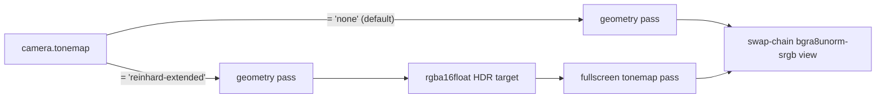
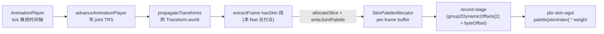
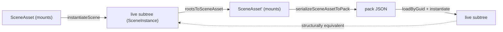

# @forgeax/engine-runtime

> **本包是 forgeax-engine 的 Renderer + Backend 异步工厂入口**——对齐 K-4 公共 surface（`createRenderer(canvas, options?)` / `Renderer` / `EngineEnvironmentError`），约束 backend 内部模块通过 `package.json#exports` 锁定（`./internal/*: null`）；不暴露 ECS / 资源管理 / 渲染图等上层 surface（M3 范围）。

> [!NOTE]
> **Source layout (feat-20260704-runtime-tier1-decomposition M1-M3)**:
> - **geometry** -- moved to `@forgeax/engine-geometry` leaf package; no longer under `packages/runtime/src/geometry/`
> - **errors** -- split into 5 per-cluster files under `src/errors/`:
>   `render.ts` (RenderError / RenderErrorCode, 12 error classes) |
>   `asset.ts` (AssetRuntimeError / AssetRuntimeErrorCode, 5) |
>   `skin.ts` (SkinError / SkinErrorCode + SkinExtractErrorCode, 10) |
>   `recover.ts` (RecoverError / RecoverErrorCode, 1 class) |
>   `environment.ts` (EngineEnvironmentError, constructor-time throw). The old top-level `RuntimeErrorCode` / `RuntimeError` aggregates are eliminated. See error class source SSOT for exhaustive `switch`.
> - **record** -- split from the monolithic `render-system-record.ts` into `src/record/` (16 files: `frame.ts`, `frame-lighting.ts`, `frame-targets.ts`, `frame-snapshot.ts`, `view-ubo.ts`, `main-pass.ts`, `main-pass-geometry.ts`, `main-pass-material.ts`, `main-pass-sprite.ts`, `main-pass-sprite-draws.ts`, `main-pass-skin.ts`, `shadow-pass.ts`, `skybox-post-pass.ts`, `mesh-ssbo.ts`, `helpers.ts`, `index.ts` barrel — every function <=500 lines, every file <=1500). Use the barrel `import { recordFrame } from './record'` for the public surface; test files import specific helpers from `./record/helpers` etc.

> [!CAUTION]
> **shader 选型命题（feat-20260518-pbr-direct-lighting-mvp / AC-17 + feat-20260519-light-casters-point-spot-pbr / AC-11）**——用 `Materials.standard(...)`（shader `forgeax::default-standard-pbr`）走 GGX direct lighting (`D_GGX × V_SmithCorrelated × F_Schlick + Lambert/π`)，**0 个灯光（directional + point + spot 合计 0）时输出全黑**——此为物理正确而非渲染 bug。standard-pbr 路径需 `directional + point + spot 合计 ≥ 1`；任一种类的一盏灯即可。`Materials.unlit(...)`（shader `forgeax::default-unlit`）才是"不管灯光"的入口（`baseColor × baseColorTexture` 直出）。新写 demo 选 standard-pbr shader 必须**同步 spawn 至少一盏 DirectionalLight / PointLight / SpotLight**，否则黑屏；末尾兜底见 §Common pitfalls。
>
> **cone 单位 度 (deg)，不是弧度也不是 cos**——`SpotLight.innerConeDeg` / `outerConeDeg` 为半角度数（half-angle in degrees）；引擎 host 侧 `degToCos(deg)` 转换至 cos 后送 GPU（charter F1 host-side parity，feat-20260519 D-S6）。`range` 缺省 `Infinity` 表示无衰减距离上限。
>
> **sprite vs sprite-lit 选型（feat-20260624-sprite-lit-shading-model-pure-2d-lighting M1'）**——`MaterialAsset.passes[0].shader` 切换是 1 字符串 1 步选型：`'forgeax::sprite'` 走 unlit 直采纹理（默认；任意灯光不影响），`'forgeax::sprite-lit'` 走 per-light forward + Half-Lambert squared diffuse + fragment-side hardcoded normal `vec3(0,0,1)` —— **需要场景至少 1 个 DirectionalLight / PointLight / SpotLight**，否则视觉全黑（与 3D standard-pbr 同理）。材质分派的唯一判别式是 shader identity（`materialShaderId` / `passes[0].shader`）；`MaterialSnapshot.shadingModel` 字段已于 tweak-20260701 删除，sprite-lit 走 `materialShaderId === 'forgeax::sprite-lit'` 字符串路由 mirror sprite —— 通用 schema-driven 通道，BGL JSON 与 sprite byte-identical（AC-07）。OOS-1 normal-map 跟进 `feat-future-sprite-lit-normal-map`。

> [!IMPORTANT]
> **WebGL2 legacy stub deleted** (feat-20260525-rhi-delete-webgl2-stub). `createRenderer` now exclusively uses WebGPU backends (rhi-webgpu / rhi-wgpu). All `renderer.shader` / `renderer.assets` are non-null after successful construction. `@forgeax/engine-rhi` contract (`Result<T, RhiError>` / `device.caps` / 14 opaque handles) always in effect.

## Transform: local TRS (you write) + world mat4 (engine derives, you read)

> [!IMPORTANT]
> **One component, two halves** (feat-20260601-unify-transform-local-global-mat4-drop-globaltrans). `Transform` carries the local TRS you author (`posX/Y/Z`, `quatX/Y/Z/W`, `scaleX/Y/Z` — 10 f32 scalar columns) **plus** a derived `world: array<f32, 16>` resolved world-space mat4 (column-major 16 floats). There is no separate `GlobalTransform` component — it was deleted. The world column is the SSOT for the resolved transform; `propagateTransforms` is its sole writer (root: `world = local`; child: `world = parent.world x local`). AI users **write** the local TRS and **read** the world mat4; never hand-write the world column (propagate overwrites it every frame).

Read the resolved world transform off `Transform.world`, then pull pose out with `@forgeax/engine-math` mat4 helpers — do not reinvent the matrix math:

```ts
import { mat4, vec3 } from '@forgeax/engine-math';

// `Transform.world` is a live Float32Array of 16 column-major floats.
const worldMat = world.get(entity, Transform).unwrap().world;
const pos = mat4.getTranslation(vec3.create(), worldMat); // translation column (m[12..14])
const fwd = mat4.getForward(vec3.create(), worldMat);     // -Z basis
const up = mat4.getUp(vec3.create(), worldMat);           // +Y basis
const right = mat4.getRight(vec3.create(), worldMat);     // +X basis
```

**Column convention fallback.** The world mat4 is column-major (the GPU / WGSL `mat4x4<f32>` layout): translation lives in column 3 (`world[12]`, `world[13]`, `world[14]`); the upper-left 3x3 is the rotation x scale basis. A freshly spawned `Transform` (`data: {}`) lands an identity local TRS and an identity world mat4 before the first propagate pass runs, so a read before `world.update()` / `renderer.draw([world], { owner: 0 })` returns identity, not stale garbage.

## API 索引

| 入口 | 形态 | 用途 |
|:--|:--|:--|
| `createRenderer(canvas, options?)` | async 工厂 | WebGPU backend (rhi-webgpu / rhi-wgpu); all channels fail throw `EngineEnvironmentError` |
| `Renderer.backend` | `'webgpu'` readonly | backend marker (K-4) |
| `Renderer.shader` | `ShaderRegistry` readonly | Instance-per-engine ShaderRegistry lazy property (plan-strategy S-10 / D-R10 / OQ-5); `Renderer.ready` auto-loads manifest + compiles PBR pipeline |
| `Renderer.assets` | `AssetRegistry` readonly | Instance-per-engine AssetRegistry lazy property (feat-20260509-ecs-render-bridge-mvp / D-S9). Post-D-17 it is a GUID -> payload catalogue (`catalog` / `loadByGuid` / `lookup`); the 5 built-in meshes (`HANDLE_CUBE`..`HANDLE_NINESLICE_QUAD`) are process-static in `BuiltinAssetRegistry` (D-15), not catalogued here. See § Assets. |
| `Renderer.metrics` | `EngineMetrics` readonly | feat-20260527-sprite-nineslice / D-5 — public counter API; `increment(name)` / `snapshot()` / `reset()` (Map-backed). Counter key namespace `<feat>.<event>` (e.g. `nineslice.scale-too-small` / `nineslice.tile-needs-repeat-sampler`). See § Sprite materials. |
| `Renderer.ready` | `Promise<void>` readonly | Init barrier (D-S3); serial three-step (manifest load -> PBR pipeline compile -> AssetRegistry built-in mesh GPU buffer upload); `await renderer.ready` before calling `draw([world], { owner: 0 })` |
| `Renderer.draw(worlds, { owner })` | `(worlds: World[], options: { owner: number }) => Result<void, RhiError>` | One-frame RenderSystem Extract / Prepare / Record over a composited world list (D-S2 / K-4 rewrite; feat-20260708 M3). Single entry — the legacy single-`World` overload was removed; single-world users pass `draw([world], { owner: 0 })`. `owner` is a required index into `worlds` (compile-time error if omitted). Renderables + lights merge across all worlds; cameras + singleton resources (skylight / skybox / postProcessParams) come only from `worlds[owner]`. See § Multi-world compositing for full semantics + 2 new error codes |
| `Renderer.readPixels()` | `() => Promise<Result<Uint8Array, RhiError>>` | Canvas pixel readback as top-left RGBA `Uint8Array` (length = `canvas.width * canvas.height * 4`); browser path uses `createImageBitmap -> OffscreenCanvas 2D drawImage -> getImageData` (WebGPU `GPUTexture` does not expose `getImageData`; 2D bounce is the browser lowest-common-denominator path); OffscreenCanvas / 2D ctx unavailable / `createImageBitmap` throws returns `'webgpu-runtime-error'` + `detail.error: RhiError | { code: unknown, message: string }`; dawn-node smoke path uses raw RHI (`device.queue.copyTextureToBuffer + mapAsync`) |
| `Renderer.dispose()` | `() => void` | **@placeholder M2/M3**: unbinds lost / error listeners + flips disposed flag; GPU resources reclaimed by `device.lost` / browser GC (explicit `device.destroy()` path in a follow-up); idempotent |
| `Renderer.onLost(cb)` | `(RendererLostListener) => () => void` | device-lost notify (R-2, engine does not auto-recover) |
| `Renderer.onError(cb)` | `(RendererErrorListener) => () => void` | RHI construction / operation error fan-out (F2 + K-9 silent skip fix reuse): backend RhiError + runtime catch (`'webgpu-runtime-error'`) reach AI users via listener; access `.code` / `.expected` / `.hint` / `.detail.compilerMessages`. See error-handling 6-member table + listener pattern. |
| `Renderer.health()` | `() => HealthSnapshot` | Pull current health snapshot — `reason` (discriminant), `detail?` (per-reason narrowed), `recoverable` (derived boolean). Data SSOT from `HealthListenerRegistry.getLastSnapshot()`. |
| `Renderer.recover()` | `() => Promise<Result<void, RecoverError>>` | Imperative single-shot device rebuild. In `'device-lost'` state: destroys all GPU resources, clears pendingDestroy, rebuilds device, re-wires listeners, rebuilds shader/pipeline, reconfigures canvas context. Returns `Result.ok` + fires `'alive'` on success; returns `Result.err` with discriminable `.code` on failure (adapter/device two-path). Async because `requestAdapter`/`requestDevice` is async. Call in `'alive'` state returns `'recover-not-needed'` (safe no-op). |
| `Renderer.onHealthChange(cb)` | `(HealthChangeListener) => () => void` | Push-style health subscription; returns unsubscribe. Late-attach replay fires cb immediately if a snapshot has already been emitted (AC-07). |
| `EngineEnvironmentError` | `class extends Error` | No usable rendering backend; `.detail.webgpuError` carries the structured error |

## Channel architecture

```
createRenderer (bug-20260526-channel2-adapter-fail-no-channel3-fallback)
  ├─ 1) options.rhi supplied → use verbatim (escape hatch, D-R5)
  ├─ 2) navigator.gpu present → static @forgeax/engine-rhi-webgpu
  │     └─ adapter/device/context fail? → fall back to 3)
  ├─ 3) dynamic import('@forgeax/engine-rhi-wgpu') + wasm load
  └─ 4) All fail → throw EngineEnvironmentError { detail.webgpuError, detail.wgpuError }
```

## Renderer health / recover

Renderer 提供三个健康面动词，统一回答"渲染器现在是否健康、为什么不健康、能否恢复"。`recover()` 是单次幂等设备重建——宿主决定重试节奏（引擎内无退避/定时器）。详见 [`skills/forgeax-engine-app/SKILL.md`](../../skills/forgeax-engine-app/SKILL.md) 用法教学（3 动词 + 消费片段）。

### HealthReason (closed union, 3 members)

```ts
type HealthReason = 'alive' | 'device-lost' | 'internal-fault';
```

| member | meaning | recoverable |
|:--|:--|:--|
| `'alive'` | healthy baseline (registry not yet fired) | `false` |
| `'device-lost'` | device loss detected | `true` |
| `'internal-fault'` | internal renderer fault | `false` |

Consume via `switch (snap.reason)` without default; TS narrows `snap.detail` per reason.

### HealthSnapshot

```ts
type HealthSnapshot =
  | { readonly reason: 'alive'; readonly recoverable: boolean }
  | { readonly reason: 'device-lost'; readonly detail: HealthDetailDeviceLost; readonly recoverable: boolean }
  | { readonly reason: 'internal-fault'; readonly detail: HealthDetailInternalFault; readonly recoverable: boolean };
```

`HealthSnapshot` is a discriminated union by `reason`. `switch(snap.reason)` narrows `snap.detail` to the per-reason detail type automatically (zero `as` casts):

- `'alive'` -- no `detail` field
- `'device-lost'` -- `snap.detail: { lostReason: 'unknown' | 'destroyed'; message: string }`
- `'internal-fault'` -- `snap.detail: { message: string }`

`recoverable` is derived from `reason` by `deriveRecoverable()`, not independently stored.

### recover() semantics

`recover()` returns `Promise<Result<void, RecoverError>>`. Post-S5 behavior:

| state | return value |
|:--|:--|
| healthy (`'alive'`) | `Result.err(RecoverError 'recover-not-needed')` |
| `'device-lost'` | On success: `Result.ok` + `fire('alive')`. On failure: `Result.err` with discriminable `.code` — `'recover-adapter-unavailable'` (requestAdapter returned null) or `'recover-device-unavailable'` (requestDevice failed). Health stays `'device-lost'` on failure. |

Single-shot: no internal retry loop, no backoff, no timers, no counters, no `'recovering'` state added to `HealthReason`. Host owns retry rhythm.

### RecoverError (closed union, 4 members)

```ts
type RecoverErrorCode =
  | 'recover-not-needed'
  | 'recover-not-implemented'
  | 'recover-adapter-unavailable'
  | 'recover-device-unavailable';
```

Consume via `switch (err.code)` without default; TS guards exhaustiveness. Error objects carry `.code` / `.expected` / `.hint` only — **no `.detail` field** (each code has fixed semantics with no variable payload; unlike `RhiError` / `AssetError`, do not reach for `err.detail` on a `RecoverError`).

| code | trigger | .hint |
|:--|:--|:--|
| `'recover-not-needed'` | Called when `health().reason === 'alive'` | "call health() first to confirm degraded state before calling recover()" |
| `'recover-not-implemented'` | **reserved** — S3 skeleton returned this; never produced by the implemented path, kept to avoid breaking changes | "self-heal recovery is now implemented; this code should not appear in production" |
| `'recover-adapter-unavailable'` | `requestAdapter` returned null during rebuild | "retry recover() after a host-chosen delay; adapter availability is transient" |
| `'recover-device-unavailable'` | `requestDevice` failed or threw during rebuild | "retry recover() after a host-chosen delay; device creation is driver-dependent" |

### onHealthChange replay

- **late-attach replay**: callbacks registered after a health change fire immediately with the current snapshot (AC-07)
- **unsubscribe**: returned function detaches the callback
- **listener-throw isolation**: one callback throwing does not affect others
- **relationship to onLost / onError**: independent channels -- `onLost` is terminal, `onError` is per-draw event stream, `onHealthChange` is the aggregated health-state change layer

## GPU-asset layers（AssetRegistry / deriveRenderData* / GpuResourceStore）

> feat-20260601-gpu-resource-store-extraction — GPU 资源逻辑从 `AssetRegistry` god object 切出为三层，各层一句话职责，符号名可 grep 直达（charter F1 / P1 渐进披露）。
>
> **对称释放（feat-20260619 M1/M2）**：创建即注册回调（`allocSharedRef(brand, pod, onLastRelease)`），despawn 时 `SharedRefStore` 把引用计数压至 0 → 回调触发 → `evictX(handle)` 销毁 GPU 资源——**无需手动调 evict**。非 despawn 路径（sweep / teardown）走 `releaseUnreferenced` / `destroyAll` 兜底。四族（texture / mesh / cubemap / instance buffer / transient pool / handleToId）全覆盖。异常时为**吞错+fire errorRegistry+继续 sweep**，不崩帧。

**三层职责命题（顶层）：**

- **`AssetRegistry`** — 编目 CPU asset POD（`catalog` / `loadByGuid` / `lookup`，纯 CPU，无 GPU 副作用，**无 handle 概念**；D-17 后 `loadByGuid` 返回 payload 而非 handle）。`PackIndexEntry.compression?: 'none' | 'zstd'` (see `@forgeax/engine-codec` README) controls automatic `fetchBinary` decompression -- transparent to `loadByGuid` callers.
- **`deriveRenderData*`** — 投影层（`packages/runtime/src/render-data.ts`）：把 asset POD **纯派生**为 GPU 描述符（`deriveRenderDataMesh` / `deriveRenderDataTexture` / `deriveRenderDataCubemap`）；认识 asset `kind`，**不碰 device**。
- **`GpuResourceStore`** — 管 device 上 GPU 资源生死（`packages/runtime/src/gpu-resource-store.ts`）：per-handle texture / cubemap / mesh-buffer 缓存 + 建造它们的 upload 原语；不认识 `kind`，对 `AssetRegistry` 零反依赖（POD 由调用方传入）。

**各 API 一句话职责（中段）：**

| 符号 | 层 | 职责 |
|:--|:--|:--|
| `GpuResourceStore` | GPU 生死 | 持三 Map（texture / cubemap / mesh handles）+ accessor；`renderer.store` 暴露；`configureGpuDevice(device, factory, registerCube)` 在 `renderer.ready` 后一次性 wire |
| `ensureResident(handle, pod)` | GPU 生死 | pull-model 首访建：miss 时调 `deriveRenderData*` 投影 → 建资源 → 缓存 handle（memoized）；命中 O(1) 查表，**绝不每帧重投影**。miss 分支用 `switch(pod.kind)` no-default 穷举（漏 GPU-resource kind 则 `tsc -b` 报错） |
| `evictTexture(handle)` / `evictMesh(handle)` / `evictCubemap(id)` | GPU 生死 | per-handle evict 原语：key 不存在 no-op；`isDestroyed` gate 去重（二次 evict 不重复 destroy）；返 `{ freed: number, errors: RhiError[] }`。`evictCubemap` 处理 source/cube 双 entry 共享同 wrapper 的去重 |

> [!NOTE]
> **`evictCubemap` 收 `id: number` 而非 `Handle`**（与 `evictTexture/Mesh` 不对称）：cubemap 有 source/cube 两个 key space 共享同一 GpuTexture wrapper，caller 可能持其一；统一收裸 id 让两 key space 都能驱动同一去重。从 `Handle` 取 id 用 `unwrapHandle(handle)`（`@forgeax/engine-types`）。日常事件式路径无需手动调（`allocSharedRef` onLastRelease 已传对 id）。
| `releaseUnreferenced(liveSet)` | GPU 生死 | 遍历三 Map 所有 key，`key ∉ liveSet` 条目的资源 destroy + delete（key 在 liveSet 中的保留）。空 liveSet → 全量释放。幂等：二次调用 no-op。返 `{ freed: number, errors: RhiError[] }` |
| `destroyAll()` | GPU 生死 | 全量 teardown：遍历三 Map destroy 所有条目 → clear。fire-and-forget（返 void）。幂等：二次调用 no-op |
| `deriveRenderData*` | 投影 | POD → GPU 描述符纯派生（buffer usage / stride / mipLevelCount / format↔colorSpace 一致性 / cube faceSize），脱 GPU 可单测 |

**两种错误约定——为何 `destroyAll` 返 void 而 `evict*`/`releaseUnreferenced` 返 `{freed, errors}`：**

| 方法 | 返回形态 | 原因 |
|:--|:--|:--|
| `destroyAll()` | `void` | teardown fire-and-forget — 无 caller 消费返回值；destroyAll 调于 `renderer.dispose()` 路径，其时 device 即将丢失，没人接 `freed/errors` |
| `evictTexture/Mesh/Cubemap(id)` | `{ freed: number, errors: RhiError[] }` | 有 caller — AC-11 稳态验收读 `freed` 判界，AI 用户用 `errors` 排障（charter P3 可观测） |
| `releaseUnreferenced(liveSet)` | `{ freed: number, errors: RhiError[] }` | 有 caller — S4（`assetRegistry.invalidate`）/ S5（device 重建）作全量收口，caller 消费返回值判断释放量 |

所有 `errors[]` 元素为 `RhiError` 结构体（`.code` / `.expected` / `.hint` / `.detail`），`RhiErrorCode` 闭合 union（`'destroy-after-destroy' | 'rhi-not-available' | ...`）是源文件 SSOT——`packages/rhi/src/errors.ts`，本节不重复枚举。

**releaseUnreferenced 何时用——非日常路径（末尾兜底）：**

`releaseUnreferenced(liveSet)` **不**接入日常帧循环（每帧 despawn 已由 `allocSharedRef` onLastRelease 自动 evict）。它供两处一次性收口调用：

- **S4** — `assetRegistry.invalidate(guids)` 批量剔除已失活的 CPU 编目条目，连带清理对应 GPU 资源。
- **S5** — device 重建（`Renderer.lostDevice` → 重建新 device → 旧 device 上的 GPU 资源全量释放；走 `releaseUnreferenced(new Set())` 空全集释放）。

日常路径走事件式（创建注册回调 → despawn 触发销毁），`releaseUnreferenced` 只在突变点（编目失效 / device 重建）跑全量收口。

**pull 时序与 builtin 首帧（末尾论证）：**

- 非 builtin mesh / texture 走 **pull**：record 阶段首次访问该 handle 时同步 `ensureResident(handle, pod)` 建资源（早于首个 pixel readback —— `world.update` → `renderer.draw`（内部 `recordFrame` 同步录制即首访点）→ submit → readback）。texture 的一次性 mipmap-pipeline build 已前移到 `renderer.ready` 预热，故首访 `ensureResident` 是纯同步 encoder 活，不破同步 `draw` 帧契约。
- **builtin mesh**（`HANDLE_CUBE` / `HANDLE_TRIANGLE` / `HANDLE_QUAD` / `HANDLE_SPHERE`）**不**走 `ensureResident`：`createRenderer` 在 `renderer.ready` 的 step-3 直接上传 + `pipelineState.meshes` 兜底，首帧即就绪。
- **cubemap** 是引擎内部懒投影路径（非 pull、非用户 API，feat-20260630）：AI 用户声明 `Skylight{equirect}` / `SkyboxBackground{equirect}`，render-system record 臂在首次见到 equirect handle 时 fire-and-forget 触发 package-internal `store._uploadCubemapFromEquirect(world, srcHandle, srcPod)`——内调 `deriveRenderDataCubemap` 拿描述符 → 经 wire 期注入的 `registerCube` mint cube handle（CPU 编目仍归 registry）→ 建 GPU 资源 + IBL precompute。投影态由 store `CubemapGpuEntry.status`（`pending`/`ready`/`failed`）单一权威承载；投影完成前绑白 cube fallback、失败 fire `equirect-projection-failed` 且不重试。store 仍对 `AssetRegistry` 零 import。

## RenderPipeline layers（registerPipeline / RenderPipelineAsset / RenderPipelineContext）

> feat-20260601-customizable-render-pipeline-seam-and-dogfood-rend — 渲染管线从硬编码的 `buildPerFrameGraph` monolith 切出为可注册 / 可安装 / 可热切换的 seam，各层一句话职责，符号名可 grep 直达源码（charter F1 / P1 渐进披露，镜像上面的 §GPU-asset layers）。

**三层职责命题（顶层）：**

- **substrate（底座）** — 一条管线**复用**而非重造的运行时：render-graph 运行时（`@forgeax/engine-render-graph` 的 `RenderGraph` addResource / addPass / compile / execute）+ RHI（`device` 经 `RenderPipelineContext.runtime`）+ ECS（管线不直接碰 World——extract 阶段已把 World 投影为 `RenderPipelineData`）+ `GpuResourceStore`（`RenderPipelineContext.store`，见上节）。
- **pipeline 逻辑 + config** — `registerPipeline(id, impl)` 把一条具名 `RenderPipeline` 逻辑登记进 registry（同 id 重复登记 fail-fast throw `PipelineError`）；`RenderPipelineAsset { kind:'render-pipeline', pipelineId, config }` 是把逻辑 id 绑成可安装 handle 的 asset POD，`config.passCount` 是第一个真 config key（自定义管线据此声明 N 个 pass）。`config` 经 `installPipeline` 线程化进 `frameState.installedPipelineConfig`，record 阶段投影到 `RenderPipelineData.config`，管线在 `buildGraph(ctx, data)` 读 `data.config?.passCount` 决定拓扑——**同一 logic id + 不同 config 产出不同 `perFramePassNames`**（NON-no-op，AC-03 one-logic-N-configs）。
- **future feature components（roadmap）** — 当前 seam 只立 `buildGraph(ctx, data)` + `execute(ctx)` 两方法；`consumes()` / `extract()`（管线声明自己要哪些 per-view 输入）留给后续 feat（本 feat OOS-3），届时按 feature-component 形态扩展，不改本层 substrate / 逻辑两层职责。

**各 API 一句话职责（中段）：**

| 符号 | 层 | 职责 |
|:--|:--|:--|
| `registerPipeline(id, impl)` | 逻辑 | `renderer.registerPipeline` 暴露（与 `shader` / `assets` / `store` 同列）；把 `RenderPipeline` 逻辑登记进 RenderSystem 层 registry；同 id 重复登记 throw `PipelineError{code:'pipeline-already-registered'}`（programmer error，同 `ShaderRegistry`） |
| `installPipeline(handle)` | 逻辑 | `renderer.installPipeline` 暴露；解 `RenderPipelineAsset` POD → 查 registry → 命中记 `frameState.installedPipelineHandle` **+ `frameState.installedPipelineConfig = pod.config`**（config 随安装线程化进 frame state），miss 返 `Result.err(PipelineError{code:'pipeline-not-found'})`（runtime path，AI 用户经 `err.code` 属性访问分流） |
| `RenderPipelineContext` | substrate | 一条管线 `buildGraph` / `execute` 闭包消费的**干净依赖面**（`packages/runtime/src/render-pipeline-context.ts`）：per-view 输入聚合（UE `FSceneView` 心智）+ 资源/运行时载体 `assets` / `store` / `pipelineState` / `runtime`（UE `FRDGBuilder` + #289 三层）。**不含** `internals` kitchen-sink——`ctx.internals` 是编译错误（AC-08）。**feat-20260604 M3 / w20 收紧**：6 个标准管线专属泄漏字段（`tonemapActive` / `geometryColorView` / `geometryDepthView` / `skyboxActive` / `splitLdrSprite` / `ldrSpriteUnormView`）已删（自定义管线作者不该看见）；3 个 MSAA 字段（`msaaActive` / `geometryColorResolveView` / `ldrSpriteColorView`）保留——MSAA 不是标准管线专属。从 `@forgeax/engine-runtime` barrel 导出（AC-14） |
| `addColorTarget` / `addColorTargetAlias` | substrate | `RenderGraph` 上的资源声明 API（`@forgeax/engine-render-graph`）。`addColorTarget(name, {format, size, sample, usage, viewFormats})` 声明 graph-owned transient/RT/MSAA 多采样目标；`size` 三态枚举 `'swapchain' / 'half-swapchain' / {w,h}`。`addColorTargetAlias(name, source)` 把逻辑名（如 `hdrComposited`）折叠到现有物理纹理（KB-1） |
| `addScenePass(g, name, {color, depth, reads, filter})` | 逻辑 | runtime 导出公开原语；把 ECS 场景画进 graph-owned 颜色 + 深度目标。逐实体 material UBO 打包 / 4-BGL 链装配作 **runtime-private** 实现细节（D-5 纯度边界）——render-graph 包不见这层逻辑 |
| `addShadowPass` / `addSkyboxPass` / `addBloomPasses` / `addTonemapPass` | 逻辑 | 同源公开原语（runtime 导出，`packages/runtime/src/render-graph-primitives.ts`）；自定义管线挑选子集 / 重排即可 |
| `addFullscreenPass(g, name, {shader, color, reads, compositeOverSwapchain})` | 逻辑 / **extension point** | 通用全屏后处理原语——**这是 AI 用户扩展引擎渲染管线的唯一公开通道**。两步 idiom：(1) `renderer.postProcess.register(id, {source, params, reads})` 注册 `PostProcessShaderEntry`（注册冲突 throw `PostProcessError{code:'post-process-already-registered'}`，programmer-error fail-fast）；(2) `addFullscreenPass(g, 'pp', {shader: id, color: 'rt'})` 在 graph 拓扑里引用该 id。dispatcher 帧内 lookup 走 `runtime.lookupPostProcess`：命中 → `buildFullscreenPostProcessPass` + `createFullscreenBindGroup` 装配 BGL/sampler/bindgroup；miss → **throw** `PostProcessError{code:'post-process-not-found'}`（charter P3 结构化失败，AI 用户经 `err.code` 属性访问分流，**非** `Result.err`——dispatcher 是 throw 通道，与 pipeline-errors.ts 模板对齐）。`'fxaa'` id 是 dispatcher 内置硬连分支（delegate `recordFxaaPass`，保 R-COLORSPACE 字节等价）；其它 id 都走 AI 用户路径。**结构化 reads（feat-20260702 M4）**：`reads` 现支持 `{ key, sampleType }` 对象数组（向后兼容 `string[]`）。`sampleType:'depth'` 时，引擎透明 resolve 深度独占视图 (`aspect:'depth-only'`)、确保目标有 `TEXTURE_BINDING` usage、绑定 non-filtering sampler（nearest+clamp-to-edge，非 comparison），BGL 自动升为 5-entry `'fullscreen-post-with-scene-depth'`（color@0+sampler@1+params@2+depthTex@3+depthSampler@4）。WGSL 侧深度纹理声明 `texture_depth_2d`，用 `textureSample` 读原始深度值（`textureSampleLevel` 同样合法，见 `packages/shader/src/hdrp-ssao.wgsl`；勿用 `textureSampleCompare`——那需 comparison sampler、做 PCF 比较而非读值）。深度 key 缺少 `TEXTURE_BINDING` 或未声明 → throw `PostProcessError{code:'fullscreen-input-not-found'}`（fail-fast）。`compositeOverSwapchain` 与深度读正交兼容。**`compositeOverSwapchain: true`（feat-20260621 M4′）**：pass 先把当前 swap-chain copy 进 `color` scratch（effect 因此采样**已合成的最终像素**：阴影+tonemap+fxaa 之后），再经 swap-chain 的 **non-srgb storage view** 写回（R-COLORSPACE，同 `recordFxaaPass`，避免双重 sRGB 编码）。这是把内建 FXAA copy idiom 泛化成 AI-user effect 的机制——让内建管线在**不替换自身**（即不丢弃 shadow/tonemap pass）的前提下叠加注册 effect；`color` 须 `addColorTarget` 声明为 swap-chain 存储格式 + `COPY_DST | TEXTURE_BINDING` usage，`reads` 留空。**仅 WebGPU 后端**：帧中读 swap-chain（copy + non-srgb storage-view 写回）WebGL2 fallback swap-chain 不支持（无 COPY_SRC / 无 non-srgb 复用 view），与内建 FXAA 同限制 |
| `forgeax::urp` | 逻辑（dogfood worked example） | 引擎自带的标准前向管线（`packages/runtime/src/urp-pipeline.ts`）：9-pass 链 shadow / skybox / main / 4×bloom / tonemap / fxaa。**经同一公开 `addColorTarget` / `addScenePass` / `addShadowPass` / `addSkyboxPass` / `addBloomPasses` / `addTonemapPass` / `addFullscreenPass` 词汇**写出（feat-20260604 M3 / w21 重写：source 不再 import 任何私有 `record*Pass`，AC-12 grep 0）——要写自定义管线照它抄。**`config.postEffects: string[]`（feat-20260621 M4′）**：安装时传入的注册 post-process id 列表，URP 在 fxaa 之后、debug-overlay 之前按序 `addFullscreenPass(..., {compositeOverSwapchain:true})` 逐个叠加（AUGMENT，非 REPLACE）——内建 9-pass 链不变，effect 叠在最终图像上。这是「在 URP 之上加后处理且**保留阴影**」的正道：`installPipeline({pipelineId:'forgeax::urp', config:{postEffects:[id]}})`。对比之下，安装一条全自定义管线会**整体替换** URP（连带丢弃其 shadow pass）——shadow demo 切忌。**仅 WebGPU 后端**（mid-frame swap-chain 读，同 `compositeOverSwapchain` 限制）；非 WebGPU 设备留空 |

**dogfood / hot-swap 时序（末尾论证）：**

- **一次性 setup（`createRenderer` 内）**：`renderer.ready` 后 `registerPipeline('forgeax::urp', urpPipeline)` → `installPipeline({ kind:'render-pipeline', pipelineId:'forgeax::urp' })`（D-17/D-19：`installPipeline` 直收 `RenderPipelineAsset` POD，无 register round-trip）。默认帧因此与任意用户自定义管线走**完全相同**的公开通道（dogfood 硬约束）。
- **每帧 hot-swap 检测（`draw` 内）**：`draw` 比较 `frameState.installedPipelineHandle` 与上次构建图的 handle；变化（一次 SWAP）才把 `frameState.perFrameGraph = null` 强制重建（复用既有记忆化闸门）。effect toggle（如 `camera.bloom` 在 pass 闭包内 early-return）**不**改 handle，故**不**触发重建——只有真正 install 另一条管线才重建。
- **可观测性**：`renderer.perFramePassNames` 读穿当前已编译图的 `listPasses()`；安装不同 `config.passCount` 的管线后该数组随之变化（AC-03 结构化断言锚点）。

## Pipeline-Spec layer（PipelineSpec / cacheKeyOf / getOrBuildPipeline / PipelineSpecError）

> feat-20260615-pipeline-spec-ssot — `packages/runtime/src/pipeline-spec.ts` 是 GPU `RenderPipeline` 的 4-axis 数据 SSOT。`PipelineSpec` 业务无关，与 wgpu / Bevy / Three.js 同形（charter §P4）。本节按 4 段渐进披露（charter §P1）：命题 → 类型与文档常量 → 单一 entrypoint → 错误模型与 byte-equiv 验证矩阵。

### 三层关系图（PipelineSpec vs PipelineState vs GPURenderPipeline）

```
┌──────────────────────────────────────────────────────────┐
│  PipelineSpec  (data, readonly, business-agnostic)        │  pipeline-spec.ts
│  4 axis: shader + attachments + geometry + renderState    │  (single SSOT)
└─────────────────────┬────────────────────────────────────┘
                      │  cacheKeyOf(spec)         specsEqual(a, b)
                      │  buildPipelineDescriptor(spec, modules)
                      │  buildBindGroupLayoutDescriptor(spec)
                      │  buildBeginRenderPassDescriptor(spec, ...)
                      ▼
┌──────────────────────────────────────────────────────────┐
│  PipelineState  (per-renderer cache + layout slots)       │  createRenderer.ts
│  pbrPipelineLayout / hdrpPbrPipelineLayout / ...          │  (boot-time wiring)
│  materialShaderPipelineCache: Map<key, GPURenderPipeline> │
└─────────────────────┬────────────────────────────────────┘
                      │  getOrBuildPipeline(spec, deviceProvider, cache)
                      │     - cache.get(cacheKeyOf(spec))   →  hit fast path
                      │     - else  device.createRenderPipeline(buildPipelineDescriptor(spec))
                      │            →  store under cacheKeyOf(spec)
                      ▼
┌──────────────────────────────────────────────────────────┐
│  GPURenderPipeline  (RHI handle, opaque to runtime)       │  rhi backends
│  consumed by record-stage  encoder.setPipeline(pso)       │  (webgpu / wgpu-wasm)
└──────────────────────────────────────────────────────────┘
```

`PipelineSpec` is the unique data axis a caller declares; `PipelineState` is per-renderer plumbing (layouts + cache map) the entrypoint reads; `GPURenderPipeline` is the device-owned PSO handle. Boot-time pre-warm and record-stage cache-miss build use the **same** entrypoint signature (`getOrBuildPipeline`).

### 1. 命题（业务无关 4 axis）

`PipelineSpec` 只描述 GPU PSO 必需的 4 个正交轴；任何 `'pbr' / 'sprite' / 'skybox' / 'fullscreen-*'` 业务字符串字面量都不出现在该类型上（D-7 / AC-01 grep gate）。新增 pass kind / 新材质 / 新 post-process 都通过组合现有 axis + 注册侧加 ShaderRegistry entry 完成，**不**需要修改 `PipelineSpec` 本身。

| Axis | 字段 | 由谁决定 |
|:--|:--|:--|
| Shader | `shader.id` + `shader.passKind` + `shader.variantSet` | 调用方（材质 + pass + 编译期 variant resolve） |
| Attachments | `attachments.colorFormats[]` + `attachments.depthFormat` + `attachments.sampleCount` | render graph（`addColorTarget` / `addDepthTarget` 已声明的 RT 形态） |
| Geometry | `geometry.topology` + `geometry.stripIndexFormat` + `geometry.vertexLayout` | mesh asset（`MeshAsset.topology` + `MeshAsset.attributes`） |
| RenderState | `renderState`（optional） | 材质 pass overrides（cull / blend / depth-write / stencil） |

读源码：`packages/runtime/src/pipeline-spec.ts` line 62 `interface PipelineSpec`。

### 2. PipelineSpec 类型 + KNOWN_PASS_KINDS

```ts
import { type PipelineSpec, KNOWN_PASS_KINDS } from '@forgeax/engine-runtime';
// PassKind 在 @forgeax/engine-types 是 open string；KNOWN_PASS_KINDS 给 IDE 自动补全
//   readonly ['forward','deferred','lighting','shadow-caster','post-process','skybox']
```

- `PipelineSpec` 全字段 `readonly`，构造后不可变（charter §P4 数据模型纯粹）
- `passKind` 类型层面是开放的 `string`，运行时由 ShaderRegistry 注册 + `KNOWN_PASS_KINDS` 检索；用 unknown passKind 调 `getOrBuildPipeline` → 抛 `PipelineSpecError{code:'unknown-pass-kind'}`（D-10）
- `variantSet` 是空字符串 `''`（HDRP 全 axis-true canonical）vs `undefined`（无 variant 路由）vs 普通字符串三态——`cacheKeyOf` 把这三态编入不同 cache slot
- `attachments.colorFormats` 为空数组表示 depth-only pass（`shadow-caster` 走这条路）

派生函数（pure，调用方按需 import）：

| 函数 | 签名 | 用途 |
|:--|:--|:--|
| `cacheKeyOf(spec)` | `(spec: PipelineSpec) => string` | PSO cache map 的 key（M2-T2 替换旧 `materialShaderPipelineCacheKey`） |
| `specsEqual(a, b)` | `(a, b: PipelineSpec) => boolean` | byte-equiv 测试 + cache invalidation 决策 |
| `buildPipelineDescriptor(spec, modules)` | `(spec, modules: { vertex, fragment, vertexEntryPoint?, fragmentEntryPoint?, layout? }) => GPURenderPipelineDescriptor` | 给 `device.createRenderPipeline` 喂的 descriptor |
| `buildBindGroupLayoutDescriptor(spec, options)` | `(spec, { kind: BglKind, registry?, caps? }) => BindGroupLayoutDescriptorOutput` | 派生 BGL 形态——`BglKind` 选 8-arm dispatch（D-13 in-loop scope-amend）|
| `buildBeginRenderPassDescriptor(specAttachments, viewBindings, passKind, options?)` | `(spec.attachments, { colorViews, resolveTargets?, depthView? }, passKind: string, { colorLoadOp?, depthLoadOp?, clearColor?, label?, ... }?) => Record<string, unknown>` | `encoder.beginRenderPass(...)` 描述符 SSOT（M4 收敛） |
| `validateSpec(spec)` | `(spec) => { ok: true } \| { ok: false; code, detail, hint? }` | 提交前的结构化校验（不需要 ShaderRegistry 参数；shader-id 校验下放给 `getOrBuildPipeline` 闭包内做） |
| `getOrBuildPipeline(spec, deviceProvider, cache, modules?)` | `(spec, provider, cache, modules?) => unknown`（cache miss 时 `validateSpec` 失败 → 抛 `PipelineSpecError`；命中即 return） | 单一入口；boot-time pre-warm + record-stage cache miss 共用 |

### 3. getOrBuildPipeline entrypoint

`getOrBuildPipeline(spec, deviceProvider, cache)` 是**单一**入口——boot-time pre-warm（12-entry `SPEC_CONST_TABLE`）和 record-stage cache miss 用同一函数。AI 用户写自定义 shader 时，pre-warm 调一次；每帧无需再调（cache 命中 fast path）。

```ts
import { getOrBuildPipeline, cacheKeyOf, PipelineSpecError } from '@forgeax/engine-runtime';

try {
  const pipeline = getOrBuildPipeline(spec, deviceProvider, cache);
  // pipeline: unknown — caller asserts to its own RHI handle type
} catch (err) {
  if (!(err instanceof PipelineSpecError)) throw err;
  switch (err.code) {
    case 'unknown-pass-kind':              /* spec.shader.passKind 不在 KNOWN_PASS_KINDS */
    case 'shader-not-registered':          /* ShaderRegistry.lookup 返回 undefined */
    case 'spec-inconsistent':              /* 两个 axis 互斥（如 sampleCount=4 + colorFormats=[]） */
    case 'attachment-format-incompatible': /* depthFormat 与 PSO 实际不兼容 */
    case 'unsupported-vertex-layout':      /* vertexLayout 缺 shader 必需的 location */
    case 'shader-bgl-reflection-mismatch': /* 反射 BGL 形态与 shader 声明不一致 */
    case 'pipeline-build-failed':          /* 包 device.createRenderPipeline 的 RhiError */
  }
}
```

`getOrBuildPipeline` 直接 `throw` `PipelineSpecError`（非 `Result` 形态）——cache miss + validateSpec 失败时抛；cache hit 立即返。AI 用户用 `try/catch + instanceof + switch (err.code)` 收敛 closed union，与 AGENTS.md §Error model 一致。

`deviceProvider: PipelineDeviceProvider` 形态是只暴露 `createRenderPipeline` 一个方法的薄壳，不带 internals kitchen-sink；`cache: PipelineCache = Map<string, unknown>` 是 PSO map，跨帧复用。boot-time 由 `createRenderer` 闭包直 wire 设备，record-stage 由 `RenderPipelineContext.runtime.device` 传入（`RenderPipelineContext` 不暴露 `internals`）。

### 4. PipelineSpecError 5+2 codes + byte-equiv 验证矩阵

`PipelineSpecErrorCode` 是 closed union（charter §P3 explicit failure，AGENTS.md §Error model）：5 业务 codes（spec / shader 形态错） + 2 transit codes（registry 缺、device build 失败）。错误对象 `.code` 收敛 union 后访问 `.detail` 拿 axis-narrowed 结构化字段，不做字符串解析。源码 SSOT：`packages/runtime/src/pipeline-spec.ts` `type PipelineSpecErrorCode`。

| Code | 触发条件 | `.detail` 形态（discriminated union） |
|:--|:--|:--|
| `unknown-pass-kind` | `spec.shader.passKind` ∉ `KNOWN_PASS_KINDS` 且 ShaderRegistry 未注册 | `{ actual: string; expected: readonly string[] }` |
| `shader-not-registered` | `registry.lookup(spec.shader.id)` 返回 undefined | `{ shaderId: string; registered: readonly string[] }` |
| `spec-inconsistent` | 两 axis 互斥（如 strip 拓扑无 stripIndexFormat） | `{ field: string; reason: string }` |
| `attachment-format-incompatible` | depthFormat / colorFormats 与 shader 不兼容 | `{ axis: 'color' \| 'depth'; expected: ...; actual: ... }` |
| `unsupported-vertex-layout` | `vertexLayout` 缺 shader 必需的 location | `{ missing: readonly string[]; expected: readonly string[] }` |
| `shader-bgl-reflection-mismatch` | 反射出的 BGL shape ≠ shader paramSchema 声明 | `{ reflected: BindGroupLayoutShape; declared: BindGroupLayoutShape }` |
| `pipeline-build-failed` | 包 `device.createRenderPipeline` 的 `RhiError` | `{ rhiError: RhiError; spec: PipelineSpec }` |

**Byte-equiv 验证矩阵**（M2 高风险 5 demo + M5 PSSM + M5 HDRP cluster forward）：相同 `PipelineSpec` 在两次 build 之间产出 `JSON.stringify(buildPipelineDescriptor(spec, modules))` 字面相等（`scripts/byte-equiv/` 录制 frame-30 baseline）。回归时：

```bash
pnpm exec node scripts/byte-equiv/m6-routing-smoke.mjs   # 3 demo dawn-node
pnpm exec node scripts/byte-equiv/m4-begin-render-pass.mjs  # 11 beginRenderPass 收敛
pnpm bench:pixel-parity                                  # AC-13 HDRP cluster forward
```

**词汇隔离 lint**（M7-T1）：`scripts/forgeax/check-pipeline-spec-vocabulary.mjs` 为 3 道 grep gate 的入口——

| Gate | 限定 token | Allowlist |
|:--|:--|:--|
| A | `createRenderPipeline\b` | `pipeline-spec.ts` · `mipmap-generator.ts` · `ibl/IblPipelineCache.ts` |
| B | `beginRenderPass\b` | `record/main-pass.ts` · `mipmap-generator.ts` · `ibl/IblPipelineCache.ts` |
| C | `materialShaderPipelineCacheKey` | 无（M2-T2 supersedes via `cacheKeyOf`） |

> [!NOTE]
> 当前 HEAD 上 Gate C 已绿；Gate A / B 还有残留 leak 站点（`createRenderer.ts` 后处理 + `pipeline-builder.ts` shadow / forward；`render-graph-primitives.ts` 3 个 `beginRenderPass`）。M2 / M4 milestone 设计上要求 0 leak，但实现侧未完全收敛——见本 feat 的 `concerns`。本 lint **可手动跑**，CI 启用待残留 leak 收敛后再开（避免一次性红整批 PR）。

## URP / HDRP（双 pipeline · 兼容性 vs 效果分轨）

> `forgeax::urp` / `forgeax::hdrp` 是引擎内建的双管线对，命名直取自 Unity (URP = Universal Render Pipeline, HDRP = High Definition Render Pipeline) 的兼容性 vs 效果分轨——URP 是 0 行 config 默认路径，覆盖 ≤ 4 punctual lights 的轻量场景；HDRP 是 `installPipeline(hdrpAsset)` 一行 opt-in 升级，cluster-forward 着色支持 ≤ 256 punctual lights 的高密度光照。同一 `RenderPipeline` 接口下的两个 `registerPipeline` 实现，AI 用户用 `renderer.installPipeline(asset)`（D-17：直收 POD，无 register round-trip）切换。

**何时选 URP（默认）**：

- 场景灯数 ≤ 4 punctual lights（PointLight + SpotLight 合计），或仅有 DirectionalLight 主光 + 几盏点光辅光
- 移动端 / Web 设备 / 低端 GPU 主导的目标平台
- `0 config` 默认安装——`createRenderer` 已 dogfood 完成 `installPipeline(urpHandle)`，无需任何用户代码

**何时选 HDRP**：

- 场景灯数 4..256 punctual lights，需要 cluster-forward 提供的"灯海"渲染（`apps/hello/hdrp-lighting` 是 256-light 范例）
- 桌面端 / 高端 GPU 目标平台 + WebGPU 后端可访问 storage SSBO（HDRP 经 BGL slot 3..6 占 4 个 storage / uniform 资源）
- 用户经 `caps.maxStorageBuffersPerShaderStage >= 7`（URP 占 0..2 + HDRP 占 3..6）gate 启用

**RenderPipelineAsset 字段表**：

| 字段 | 类型 | URP 行为 | HDRP 行为 |
|:--|:--|:--|:--|
| `kind` | `'render-pipeline'` | 必填判别符 | 必填判别符 |
| `pipelineId` | `'forgeax::urp' \| 'forgeax::hdrp' \| (string & {})` | URP_PIPELINE_ID | HDRP_PIPELINE_ID |
| `config.passCount` | `number?` | URP 忽略（topology 固定 9-pass 链） | HDRP 忽略（topology 固定为 1 cluster-forward pass） |
| `config.clusterGrid` | `{x,y,z}` 各为整数 ∈ [1, 64] | URP 忽略 | 在 `buildGraph` 时尺寸化 cluster_uniform UBO；缺省 `{x:16, y:9, z:24}`；非法值 throw `HdrpInstallError{code:'hdrp-grid-invalid'}` |

**install 路径（一行 opt-in）**：

```ts
import { HDRP_PIPELINE_ID, type RenderPipelineAsset } from '@forgeax/engine-runtime';

// D-17/D-19: installPipeline takes the RenderPipelineAsset POD directly (no register round-trip).
renderer.installPipeline({
  kind: 'render-pipeline',
  pipelineId: HDRP_PIPELINE_ID,
  config: { clusterGrid: { x: 16, y: 9, z: 24 } },
} as RenderPipelineAsset).unwrap();
// 后续 renderer.draw([world], { owner: 0 }) 即走 cluster-forward；perFramePassNames 含 'cluster-forward'.
```

完整范例见 `apps/hello/hdrp-lighting/src/main.ts`（256-light slab）+ `apps/parity/urp-vs-hdrp/src/main.ts`（同场景 ≤4 light 像素 parity）。参见 `packages/runtime/src/cluster-binner.ts`（CPU cluster binner 纯函数）+ `packages/runtime/src/hdrp-pipeline.ts`（HDRP RenderPipeline 实现）。

### HDRP deferred opaque + forward transparent

> feat-20260612-hdrp-deferred-shading-learn-render-5-8 -- HDRP 默认渲染路径从 cluster-forward 单路径切换为 **deferred opaque + forward transparent** 双阶段。AI 用户调用 `installPipeline(hdrpHandle)` 一行自动获得 deferred 路径，无额外 config。

**顶层一句话**：HDRP 默认 = deferred opaque + forward transparent。opaque 几何走 g-buffer + lighting 全屏 quad；transparent 几何经 depth test（读 g-buffer depth）走 cluster-forward 写 hdrColor。同一 `installPipeline(hdrpHandle)` 入口，无第二行，无 config toggle（charter P1 渐进披露 + P4 一致抽象）。

**调用模板**：

```ts
import { HDRP_PIPELINE_ID, type RenderPipelineAsset } from '@forgeax/engine-runtime';

// D-17: installPipeline takes the RenderPipelineAsset POD directly.
renderer.installPipeline({
  kind: 'render-pipeline',
  pipelineId: HDRP_PIPELINE_ID,
} as RenderPipelineAsset).unwrap();
// opaque geometry: g-buffer pass (passKind='deferred') → lighting pass (full-screen GGX)
// transparent geometry: forward pass (passKind='forward', depth test vs g-buffer depth)
```

完整运行示例见 `apps/learn-render/5.advanced-lighting/8.deferred-shading/src/main.ts`（32 punctual lights + 9 cube 3x3 grid）。

**末层：g-buffer schema + passKind 4 值**：

g-buffer = 3 color RT + hardware depth：

| RT | format | channel | content |
|:--|:--|:--|:--|
| RT0 | `rgba16float` | normal.rgb + roughness.a | world-space normal + perceptual roughness |
| RT1 | `rgba8unorm` | albedo.rgb + metallic.a | baseColor* + metallic |
| RT2 | `rgba16float` | emissive.rgb + ao.a | emissive* + ambient occlusion |
| Depth | `depth24plus` | — | hardware depth; position 反算 via `inverse(viewProj)` |

`PassKind` 是 4 值 closed union（`'forward' | 'deferred' | 'lighting' | 'shadow-caster'`），在 `ShaderPass.passKind` 字段消费。`Materials.standard(...)` 自动产出 3 条 `ShaderPass`（deferred / forward / shadow-caster），AI 用户无需手动声明 pass。手写 `MaterialAsset` 字面量时如仅声明 `passKind='forward'` 单 pass，opaque 几何在 forward pass 渲染（不走 g-buffer）-- 视觉等价但路径不同。显式补 `passKind='deferred'` pass 可让该 material 参与 g-buffer 写入。

**错误码兜底**：HDRP 安装时检查 `Device.caps.maxColorAttachments < 4` ⇒ throw `RenderError` with code `'hdrp-deferred-caps-insufficient'`（charter P3 显式失败，不做隐式降级）。`.hint` 含升级指引。

### SSAO (Screen-Space Ambient Occlusion)

**one-line proposition**：`config.ssao.enabled: true` 即启用 HDRP deferred 路径的屏幕空间环境光遮蔽。

```ts
// HDRP + SSAO one-shot enable (pipelineId narrows config.ssao)
const hdrpAsset: RenderPipelineAsset = {
  kind: 'render-pipeline',
  pipelineId: 'forgeax::hdrp',
  config: {
    clusterGrid: { x: 16, y: 9, z: 24 },
    ssao: { enabled: true },
  },
};
renderer.installPipeline(hdrpAsset).unwrap();   // D-17: POD directly, no register round-trip
```

**参数表**（all under `config.ssao`）：

| 参数 | 类型 | 默认 | 语义 |
|:--|:--|:--|:--|
| `enabled` | `boolean` | (required) | true 时 wire ssao-calc + ssao-blur 两条 fullscreen pass 进 HDRP render graph |
| `radius` | `number` | `0.5` | 半球采样半径（view-space 单位）；<= 0 时 throw `PostProcessError('ssao-radius-non-positive')` |
| `bias` | `number` | `0.025` | 深度偏置（避免自遮挡）；< 0 时 throw `PostProcessError('ssao-bias-negative')` |
| `intensity` | `number` | `1.0` | SSAO 混合强度，deferred lighting ambient 项 `ambient *= mix(1.0, ssaoFactor * bakedAO, intensity)` |

**pass 拓扑**：`g-buffer` → `ssao-calc`（half-res R8, 64-sample hemisphere） → `ssao-blur`（half-res R8, 4x4 box blur） → `lighting`（reads ssaoBlurred）。enabled=false / 缺省时图中零 ssao-* pass 与零 GPU 资源分配。

**HDRP unified BGL @group(2) SSAO bindings**（plan-strategy D-B / D-C，M7 round-2；scope-amend-webgl2-ubo 把 intensity 折进 binding 6 的 .w lane，移除原 @binding(9) UBO）：

| binding | resource | WGSL 类型 | 说明 |
|:--|:--|:--|:--|
| `6` | `cluster_uniform` | `uniform ClusterUniform` | `near_far_log.w` 携带 SSAO intensity 标量（曾是 std140 pad）；disabled 时主机写 `0` |
| `7` | `ssaoBlurredTexture` | `texture_2d<f32>` | 从 ssao-blur 拿到的 half-res R8；disabled 时绑 1x1 white fallback |
| `8` | `ssaoBlurredSampler` | `sampler` | filter=linear / clamp-to-edge；fallback path 复用同一 sampler |

`createHdrpUnifiedBindGroup` **始终输出 7 个 bind-group entries**——enabled / disabled 只在 binding 7 的 textureView 上分叉，PSO 描述符与 pipeline-layout 永不分裂（charter P4 一致抽象）。把 intensity 折回 cluster UBO 的动机是 rhi-wgpu 的 WebGL2 fallback 通道：fragment-stage UBO 上限 `max_uniform_buffers_per_shader_stage = 11`，原本的专用 @binding(9) intensity UBO 会让 hdrp-pbr-pl 的 fragment UBO 数量达到 12，PSO 启动时 panic、所有 demo 全黑屏。

**1×1 white fallback texture**（`hdrp-ssao-fallback-white`）：当 `config.ssao.enabled !== true` 或 SSAO 资源未就绪时，binding 7 绑这条 lazy-alloc 单实例的 1×1 r8unorm 纹理（数据 = `0xFF`，r8unorm 归一化到 1.0）。lighting shader 读到 `ssaoFactor = 1.0`，主机已把 `cluster_uniform.near_far_log.w = 0` 写进 binding 6，故 `mix(1.0, ssao*ao, 0.0) = 1.0` 折叠回 round-1 baseline (`ambient *= 1`)，因此切换 SSAO 不触发 PSO 重编、不影响其他 demo 的像素 (`R6` 风险被 mitigated)。fallback 纹理用 `WeakMap` 按 `RenderSystemRuntime` 缓存，第二次调用 `getOrCreateSsaoFallbackTexture` 复用同一份 GPU 资源。

**边界行为**：

- `config.ssao.enabled === false` 或 `config.ssao` 缺省 → 零 ssao-* pass 加进 graph，零 GPU allocation（`getOrCreateSsaoBuffers` 不触发；HDRP unified BGL 仍把 binding 7/8 接到 1×1 white fallback，主机往 cluster UBO `.near_far_log.w` 写 `0`）
- `Device.caps.storageBuffer === false` → `getOrCreateSsaoBuffers` 返回 null，SSAO 不可用但无 crash（graph-level skip）
- g-buffer 未声明 → `addSsaoPasses` 静默跳过（graph-level skip）
- URP pipeline 忽略 `config.ssao`（shared-config 模式，同 clusterGrid；URP 不消费该字段）

**SsaoUniform 字节布局**（host SSOT：`SSAO_UNIFORM_BYTES = 256`、`SSAO_UNIFORM_INTENSITY_OFFSET = 192`）：3 mat4 (192 B) + vec4 intensityPad (16 B) + 48 B 末尾 padding，per-frame `writeBuffer` 一次性更新整块；这条 UBO 只挂在 SSAO compute pipelines 的 group(0) 上（compute shader 不读 intensityPad，但写仍保留以维持 256 B 对齐与单次 transfer）。lighting 路径上的 intensity 来源已迁到 `cluster_uniform.near_far_log.w`（见上方 binding 6 表格行）。

**错误码**（`PostProcessErrorCode` closed union，8 成员；SSOT `packages/runtime/src/post-process-errors.ts`）：

| code | detail | 触发条件 |
|:--|:--|:--|
| `ssao-radius-non-positive` | `{ paramName: 'radius', value: number }` | `radius <= 0` |
| `ssao-bias-negative` | `{ paramName: 'bias', value: number }` | `bias < 0` |
| `ssao-storage-buffer-unavailable` | `{ missingCap: 'storageBuffer' }` | `Device.caps.storageBuffer === false` |
| `params-size-mismatch` | `{ byteSize, actualLength }` | `postProcess.register({params})` 时 `byteSize < 16`（`.hint` 含最小 16 B 指引）或 `defaultValue.length !== byteSize`——register 阶段 fail-fast（feat-20260621 D-4） |
| `params-update-size-mismatch` | `{ byteSize, actualLength }` | 数据驱动每帧写入时 `PostProcessParams.data` 的 byteLength !== 注册 `params.byteSize`——`dispatchFullscreenPass` 写入前 fail-fast（feat-20260621 D-4） |
| `fullscreen-input-not-found` | `{ readsKey, passName }` | `reads` 中 key（彩色或深度）在 graph 中未声明为 color target，或声明了但缺 `TEXTURE_BINDING` usage（深度 key）。`.hint` 含 `TEXTURE_BINDING` 指引 + pipeline 切换建议——AI 用户经 `detail.readsKey` 定位未解析的 key、`detail.passName` 定位失败 pass（feat-20260702 M4） |

（其余 2 个成员 `post-process-already-registered` / `post-process-not-found` 见 §`addFullscreenPass` 行。）

### 自定义 post-process params（数据驱动活字段）

`PostProcessShaderEntry.params` 是**活字段**（feat-20260621）：声明 `{ byteSize, defaultValue }` 后，引擎在 `postProcess.register(id, {source, params, reads})` 时 eager-create 一个 per-id params UBO（`byteSize >= 16`，初值 `defaultValue`），BGL 形态由 `reads` 内容决定：

- `entry.params === undefined` + 无结构化 reads → 2-entry `'fullscreen-post'`（texture@0 + sampler@1）
- `entry.params !== undefined` + 无深度 reads → 3-entry `'fullscreen-post-with-params'`（texture@0 + sampler@1 + buffer@2）
- `entry.params !== undefined` + `reads` 含 `{ key, sampleType:'depth' }` → 5-entry `'fullscreen-post-with-scene-depth'`（texture@0 + sampler@1 + buffer@2 + depthTex@3 + depthSampler@4，feat-20260702 M4）。params@2 始终存在（避免 2x2 kind 爆炸）。

`entry.params === undefined` 且无深度 reads 时退化 2-entry（texture@0 + sampler@1），所有无 params 的 consumer（FXAA / gamma / framebuffers）零回归。

每帧更新走**数据驱动**，非命令式 setter：在实体上挂 `PostProcessParams { shader: id, data }` 组件，每帧改 `data`（`AllowSharedBufferSource`）——extract 阶段收集成 `Map<shaderId, bytes>` snapshot，`dispatchFullscreenPass` 查表 → byteLength 复检（不符抛 `params-update-size-mismatch`）→ `queue.writeBuffer` 到该 UBO。心智模型与 `Camera.exposure` / `Transform` / lights「改组件 → 每帧生效」完全同构。

```ts
renderer.postProcess.register('mypkg::vignette', {
  source: vignetteWgsl,           // WGSL 在 @group(1) @binding(2) 声明 var<uniform> params
  params: { byteSize: 16, defaultValue: new Uint8Array(16) },
  reads: ['offscreenColor'],      // 或 [{ key: 'depth', sampleType: 'depth' }, { key: 'offscreenColor' }]
})
world.spawn({
  component: PostProcessParams,
  data: { shader: 'mypkg::vignette', data: Float32Array.of(intensity, 0, 0, 0) },
}) // data 接受任意 AllowSharedBufferSource（Float32Array / ArrayBuffer / Uint8Array）
```

## Render flow（zero-config 默认 vs `tonemap='reinhard-extended'` opt-in）

> [!IMPORTANT]
> 默认路径（`Camera.tonemap === 'none'`，schema 默认值 `0`）保持 zero-overhead——几何 pass 直接写入 swap-chain `bgra8unorm-srgb` view，不分配任何 HDR 资源、不跑额外 pass。`Camera.tonemap === 'reinhard-extended'` 是 opt-in 路径——record 阶段读 `CameraSnapshot.tonemap` 后把几何 pass 路由到 per-renderer `rgba16float` HDR offscreen attachment（lazy alloc / resize-aware），然后在 swap-chain srgb view 上跑 fullscreen tonemap pass（`packages/shader/src/tonemap.wgsl` + `fullscreen_triangle()` SSOT）。两条路径**只在 record 阶段分流**，extract / prepare 完全共享。

> [!NOTE]
> **内建 tonemap 走统一 post-process params 通道**（feat-20260621 M-A3 / D-5）：`Camera.exposure` / `whitePoint` / `tonemap` 保留为 AI 用户面 SSOT（不改不删），但引擎内部不再为 tonemap 维护专用 pipeline / BGL / 16 B UBO——`forgeax::tonemap` 通过 `postProcess.register({source: tonemap.wgsl, params})` 注册到上文「自定义 post-process params」同一条数据驱动通道；extract 阶段引擎自身作为 provider 把 `Camera.exposure/whitePoint/tonemap` 打包成该 shader 的 16 B `data` 写入 snapshot。tonemap.wgsl 的 binding 也随之迁到 `@group(1) binding(0/1/2)`。这消除了「`Camera.exposure` vs `postProcess.register({params})` 两条 exposure 通道」的概念负担（compression == intelligence）。AI 用户心智模型不变：仍只改 `Camera.exposure`。



**5 行 zero-config（zero-overhead 默认）：**

```ts
// tonemap defaults to 'none' (TONEMAP_NONE = 0); no HDR, no extra pass.
world.spawn(
  { component: Transform, data: { posZ: 3, quatW: 1, scaleX: 1, scaleY: 1, scaleZ: 1 } },
  { component: Camera,    data: { fov: Math.PI / 4, aspect: 16 / 9, near: 0.1, far: 100 } },
).unwrap();
```

**5 行 opt-in（Reinhard-extended 加 3 字段）：**

```ts
import { TONEMAP_REINHARD_EXTENDED } from '@forgeax/engine-runtime';
world.spawn(
  { component: Transform, data: { posZ: 3, quatW: 1, scaleX: 1, scaleY: 1, scaleZ: 1 } },
  { component: Camera,    data: {
      fov: Math.PI / 4, aspect: 16 / 9, near: 0.1, far: 100,
      tonemap: TONEMAP_REINHARD_EXTENDED, exposure: 1.0, whitePoint: 8.0,
  } },
).unwrap();
```

| 字段 | 类型 | 默认 | 语义 |
|:--|:--|:--|:--|
| `tonemap` | `f32` (encoded) | `0` (`TONEMAP_NONE`) | `0` = 直通 swap-chain；`1` = `TONEMAP_REINHARD_EXTENDED`，启用 HDR + tonemap pass |
| `exposure` | `f32` | `1.0` | 线性预乘；shader 端 `exposed = sample × exposure` 后才进 luminance Reinhard |
| `whitePoint` | `f32` | `4.0` | 拐点 `Lw`：当 luminance `Y == Lw` 时 `Y' == 1.0`；AI 用户按场景峰值 luminance 调；`Y > Lw` 进入饱和段，渐近 `Y / Lw²` |

> [!NOTE]
> 高强度光示例（charter F1 渐进式披露）：apps/hello/tonemap demo 用 `intensity = 2` directional light + 中性灰 PBR 球面，**默认路径**最亮 specular 像素 burn 到 `(255, 255, 255)`（swap-chain `bgra8unorm-srgb` store 在 1.0 之上硬截断 → 整白），**opt-in 路径**同样 scene 最亮像素压回 `(0.3, 1.0)` per-channel band（apps/hello/tonemap/scripts/smoke-dawn.mjs AC-07 + AC-08 mass scan）。

### Camera clear color (`clearR / clearG / clearB / clearA`)

> feat-20260608-create-app-param-surface-trim / M1: per-frame clear color migrated from `RendererOptions.clearColor` (M1-retired, 4-tuple `[number, number, number, number]`) to four scalar fields on the `Camera` component. RGB values are linear-space (sRGB encoding still applies on the swap-chain `bgra8unorm-srgb` view).

| Field | Type | Default | Semantics |
|:--|:--|:--|:--|
| `clearR` | `f32` | `0` | Linear-space red channel; sRGB-encoded on store |
| `clearG` | `f32` | `0` | Linear-space green channel |
| `clearB` | `f32` | `0` | Linear-space blue channel |
| `clearA` | `f32` | `1` | Alpha (usually `1`) |

```ts
import { Camera, Transform } from '@forgeax/engine-runtime';
world.spawn(
  { component: Transform, data: { posZ: 3, quatW: 1, scaleX: 1, scaleY: 1, scaleZ: 1 } },
  { component: Camera, data: {
      fov: Math.PI / 4, aspect: 16 / 9, near: 0.1, far: 100,
      // dark slate background for sprite-alpha-blend visual contrast
      clearR: 0.08, clearG: 0.10, clearB: 0.12, clearA: 1,
  } },
).unwrap();
```

> Zero-Camera fallback: when no entity carries a `Camera` component, the renderer falls back to `[0, 0, 0, 1]` (opaque black) -- same behaviour as the historic `RendererOptions.clearColor` zero-config default.

### Anti-Aliasing（FXAA 3.11 fullscreen post-processing pass）

**top**: 在 Camera spawn 加一行 `antialias: ANTIALIAS_FXAA` 即可开启 FXAA 后处理。

```ts
// Zero-overhead default (ANTIALIAS_NONE = 0; no extra pass, no allocation).
world.spawn(
  { component: Transform, data: { posZ: 3, quatW: 1, scaleX: 1, scaleY: 1, scaleZ: 1 } },
  { component: Camera,    data: { fov: Math.PI / 4, aspect: 16 / 9, near: 0.1, far: 100 } },
).unwrap();

// FXAA opt-in (1 extra field on Camera):
import { ANTIALIAS_FXAA } from '@forgeax/engine-runtime';
world.spawn(
  { component: Transform, data: { posZ: 3, quatW: 1, scaleX: 1, scaleY: 1, scaleZ: 1 } },
  {
    component: Camera,
    data: {
      fov: Math.PI / 4, aspect: 16 / 9, near: 0.1, far: 100,
      antialias: ANTIALIAS_FXAA,
    },
  },
).unwrap();
```

| 字段 | 类型 | 默认 | 语义 |
|:--|:--|:--|:--|
| `antialias` | `f32` (encoded) | `0` (`ANTIALIAS_NONE`) | `0` = zero-overhead 无 AA pass；`1` = `ANTIALIAS_FXAA`，FXAA 3.11 fullscreen post-processing pass |

**middle**: FXAA pass 执行时机——在 tonemap pass（若有）之后、`encoder.finish()` 之前。引擎通过 `encoder.copyTextureToTexture` 把 swap-chain 内容复制到 lazy-alloc 的 `bgra8unorm` 中间纹理；FXAA fragment shader 采样中间纹理后将抗锯齿结果写回 swap-chain。因为 copy + FXAA pass 对两种渲染路径（HDR+tonemap 和 tonemap='none'）的到达 swap-chain 状态完全一致，所以一套 FXAA pass 代码同时服务于两条路径。中间纹理仅在首帧 `antialias='fxaa'` 时分配；resize 时检查尺寸变化后 realloc 并 invalidate 缓存的 BindGroup。shader 通过 `textureDimensions()` 运行时获取纹理尺寸，resize 无需重建 pipeline。

性能特征：FXAA pass 为单次 fullscreen `draw(3)`，< 0.5ms @ 1080p。中间纹理 = swap-chain 同尺寸 `bgra8unorm`（~8MB @ 1080p）。`antialias='none'` 路径完全跳过分配、copy 和 render pass——零 GPU 开销（AC-02 zero-overhead 保障，dusk-node pixel readback 与 feat 落地前逐像素一致）。

**end**: 边界情况——极低分辨率（如 64x64）下 FXAA 仍执行但效果不可辨识，不 crash。sprites 层也被 FXAA 处理（MVP 接受，未来可通过 layer mask 排除 UI/sprites）。FXAA quality preset 当前硬编码为 Bevy "High"（`EDGE_THRESHOLD_MIN=0.0312`, `EDGE_THRESHOLD_MAX=0.125`），无可调参数暴露——未来 OOS-7 可扩展 quality 档位。FXAA pipeline 构建失败走结构化 `RhiError { code: 'shader-compile-failed', hint: 'FXAA shader compilation failed; verify GPU driver supports required WGSL features' }`，渲染器降级为无 AA（不 crash）。

> [!NOTE]
> Runtime toggle demo: `apps/hello/fxaa` spawns four static geometries (triangle + cube + quad + sphere) under a slant directional light (`direction ~(-0.4, -0.6, -0.7)`) via `createApp`. Press <kbd>Space</kbd> at runtime to toggle `Camera.antialias` between `ANTIALIAS_NONE` (jagged edges) and `ANTIALIAS_FXAA` (smoothed edges). A DOM HUD overlay (`#fxaa-hud`) displays `FXAA: ON` / `FXAA: OFF` in sync with the current antialias state (charter F2 text over image). The smoke gate uses a dual-pass pixel-difference assertion (single device, two Worlds, none vs FXAA, diffCount > ~480 at 800x600) — no disk PNG dependency. See `apps/hello/fxaa/src/main.ts` and `apps/hello/fxaa/scripts/smoke-dawn.mjs`.

## 形态铁律

- **K-4 channel priority** — Channel 1 (explicit rhi) / Channel 2 (rhi-webgpu via navigator.gpu; falls back to Channel 3 on adapter/device/context failure) / Channel 3 (rhi-wgpu wasm) / all fail throw `EngineEnvironmentError` with `detail.webgpuError` + `detail.wgpuError`; no backend type selection API exposed.
- **internal/ 隔离** — backend 实现模块通过 `package.json#exports` 锁定不导出（grep 静态闸门 + 运行时 import 失败双重保险）。
- **lazy backend** — `Renderer.draw([world], { owner: 0 })` 第一次调用才 dynamic import backend chunk；probe-only 调用方零成本。
- **AC-15 source-level** — `createRenderer.ts` 用 `globalThis.navigator` 而非 raw `navigator`；从不触碰 `window` / `document`。
- **AC-06 grep 闸门** — `packages/engine/src/internal/webgpu-backend.ts` 不再含 raw WebGPU 全局入口调用（M3 重构后改走 `RhiDevice` 接口）。

## Remote eval

Runtime introspection routes through `@forgeax/engine-remote`'s single `eval` channel. The `createApp` entry point wires `app.remote` by default in dev mode (port 5732); the eval scope carries `renderer` as a live root along with `world`, `assets`, and `debugAdapter`. The renderer backend tag is accessible via `renderer.backend` inside eval:

```ts
// Inside eval scope:
const backend = renderer.backend; // 'webgpu'
```

No `registerRuntimeInspector`, Registry, or `wireDefaultInspectors` assembly is needed — `createApp` auto-wires the server in dev mode. See [`@forgeax/engine-remote` README](../remote/README.md) for the full eval API, live roots, and security model.

## 与上游包的关系

```
@forgeax/engine-runtime → @forgeax/engine-ecs → @forgeax/engine-ecs → @forgeax/engine-math
                              ↘ @forgeax/engine-rhi-webgpu → @forgeax/engine-rhi → @forgeax/engine-types
                                                                ↘ @webgpu/types
                              ↘ @forgeax/engine-image
```

- **`@forgeax/engine-rhi-webgpu`** — WebGPU 路径注入的薄 shim 实现（M2 引入）。
- **`@forgeax/engine-rhi`** — 纯接口契约（14 opaque handle + 5 描述符 + 7 主接口）。
- **`@forgeax/engine-image`** — runtime → image 反向依赖（feat-20260517-vite-plugin-image-build-time-cook M2/M3）。`asset-registry.ts` 的 `parseAssetPayload` `'texture'` arm 通过 `import { parseImage } from '@forgeax/engine-image/parse-image'` 调用 disk decoder SSOT；runtime 不在自家源码内重新实现 PNG/JPG 解码（由 `scripts/check-image-pipeline-isolation.mjs` Path (a) grep gate 守护，supersedes feat-20260515 AC-15a literal grep）。dev HMR / build cook 两条子路径在该 arm 内分流。

## Demo idiom

> [!IMPORTANT]
> Demo code in this README and in `apps/hello/*` uses a crash-on-failure idiom:
> `world.spawn(...).unwrap()`, `assets.catalog(...).unwrap()`, and
> `world.set(...).unwrap()`. This keeps demo listings short and focused on the
> intent. `createApp()` retains its explicit `if (!ready.ok)` guard because
> host-initialisation failure is recoverable (no canvas, wrong environment).
>
> Production code should switch on `result.error.code` rather than calling
> `.unwrap()`; demos crash.

## Built-in mesh handles

Five process-static `Handle<'MeshAsset', 'shared'>` constants occupy reserved builtin ids 1-5 (`< BUILTIN_BASE`), resolved through `BuiltinAssetRegistry` (D-15, never reference-counted), all available as top-level re-exports from `@forgeax/engine-runtime`. Id=4 `HANDLE_SPHERE` was added 2026-05-29 (feat-20260529-fxaa-demo-real-antialiasing-comparison-runtime-tog); id=5 `HANDLE_NINESLICE_QUAD` was added 2026-06-03 (feat-20260527-sprite-nineslice / D-2).

| Handle | id | Geometry source | Notes |
|:--|:--|:--|:--|
| `HANDLE_CUBE` | 1 | `createBoxGeometry(1, 1, 1)` | Unit cube, Three.js-aligned per-face UV unwrap |
| `HANDLE_TRIANGLE` | 2 | Hand-authored 3-vertex interleaved data (8F -> 12F via `meshFromInterleaved`) | Flat triangle in XY plane, facing +Z |
| `HANDLE_QUAD` | 3 | `createPlaneGeometry(1, 1)` | Unit-size quad on XY, facing +Z |
| `HANDLE_SPHERE` | 4 | `createSphereGeometry(1, 16, 12)` | UV-sphere, radius=1, 16 meridians x 12 parallels; index buffer is `Uint32Array` (auto-routed via `instanceof` in step-3 upload); vertices satisfy `|hypot(pos)-1| < 1e-6` by construction |
| `HANDLE_NINESLICE_QUAD` | 5 | `createPlaneGeometry(1, 1, 3, 3)` | 4x4 grid of vertices (16 verts / 54 idx) for sprite 9-slice; sprite-pipeline auto-routes from `HANDLE_QUAD` to this handle when `paramValues.slices !== [0, 0, 0, 0]` (D-2 sentinel). Vertex layout shares the standard 12F sprite layout. |

Consume in `MeshFilter.assetHandle`:

```ts
import { HANDLE_SPHERE } from '@forgeax/engine-runtime';
world.spawn(
  { component: Transform, data: { posX: 1, posY: 0, posZ: 0, quatW: 1, scaleX: 0.5, scaleY: 0.5, scaleZ: 0.5 } },
  { component: MeshFilter, data: { assetHandle: HANDLE_SPHERE } },
  { component: MeshRenderer, data: { materials: [matHandle] } },
).unwrap();
```

## Mesh bytes via `<guid>.bin` sidecar (bug-20260610 Fix A)

Imported mesh sub-assets carry their `vertices` / `indices` typed-array bytes in
a sibling `<guid>.bin` next to the `.pack.json`, matching the texture path. The
`.pack.json` entry payload is the empty sentinel `{ vertices: [], indices: [],
data: Uint8Array(0) }`; the catalog row's `relativeUrl` points straight at the
`.bin`. The runtime `loadByGuidProd` mesh branch reads the `.bin` via
`LoadContext.fetchBinary`, decodes the deterministic 16-byte little-endian
header (`vlen / ilen / iwidth / jsonlen`) + vertices + indices + UTF-8 JSON tail
(`{ submeshes?, aabb? }`), and feeds a hydrated synthetic payload through
`meshLoader`. AI users do not need to touch the bin — `loadByGuid<MeshAsset>(g)`
is unchanged. The legacy inline `Array.isArray(vertices)` path stays alive for
older `.pack.json` fixtures and direct register-by-handle tests (CON-7).

## ECS render bridge

> AGENTS.md SSOT（`§ECS render bridge`）的渐进披露第二跳；本节侧重「AI 用户最短调用路径 + spawn 代码片段 + 错误分档表」。完整 schema/RenderSystem 行为描述在 AGENTS.md 主表，此处不重复。

**最短调用路径（4 步）** — feat-20260509-ecs-render-bridge-mvp 兑现：

```ts
import {
  createRenderer,
  Transform,
  MeshFilter,
  MeshRenderer,
  Camera,
  DirectionalLight,
  HANDLE_CUBE,
} from '@forgeax/engine-runtime';
import { World } from '@forgeax/engine-ecs';

// 1. createRenderer (async factory)
const renderer = await createRenderer(canvas);

// 2. spawn 5 component entity bundles
const world = new World();
world.spawn(
  { component: Transform, data: {
    posX: 0, posY: 0, posZ: 3,
    quatX: 0, quatY: 0, quatZ: 0, quatW: 1,
    scaleX: 1, scaleY: 1, scaleZ: 1,
  } },
  { component: Camera, data: { fov: Math.PI / 4, aspect: 16 / 9, near: 0.1, far: 100 } },
).unwrap();
world.spawn(
  { component: Transform, data: {
    posX: 0, posY: 0, posZ: 0,
    quatX: 0, quatY: 0, quatZ: 0, quatW: 1,
    scaleX: 1, scaleY: 1, scaleZ: 1,
  } },
  { component: MeshFilter, data: { assetHandle: HANDLE_CUBE } },
  { component: MeshRenderer, data: {
    // feat-20260608 M2 / w7: schema-vocab `array<shared<MaterialAsset>>`（feat-20260614 handle->shared rename）；
    // materials[i] 索引位对位 MeshAsset.submeshes[i]。缺省（{} 或 materials: []）
    // → default mid-grey unlit (D-Q7 case B)。单 mesh 单材质：写 [matHandle]。
    materials: [matHandle], // readonly Handle<MaterialAsset>[]
  } },
).unwrap();
world.spawn({ component: DirectionalLight, data: {
  directionX: -0.5, directionY: -1, directionZ: -0.3,
  colorR: 1, colorG: 1, colorB: 1, intensity: 1,
} }).unwrap();

// 3. await ready (WebGPU 路径 manifest + pipeline + asset upload 串行三步)
await renderer.ready;

// 4. raf 循环 draw([world], { owner: 0 })
// 单 world 用法：包一层数组，owner 恒为 0。多 world 合并语义见 § Multi-world compositing。
function frame() {
  renderer.draw([world], { owner: 0 });
  requestAnimationFrame(frame);
}
requestAnimationFrame(frame);
```

**8 核心符号 single-import**（charter 命题 1 渐进披露 / 命题 5 一致抽象兑现）：

```ts
import {
  Transform, MeshFilter, MeshRenderer,
  Camera, DirectionalLight,
  HANDLE_CUBE, HANDLE_TRIANGLE,
  createRenderer,
} from '@forgeax/engine-runtime';
```

**5 component schema 速览** — 详细字段语义 / 单位 / 默认值 / spawn 示例见 LSP hover JSDoc（渐进披露第三跳）+ AGENTS.md `§ECS render bridge` 主表：

| Component | 字段（SoA f32 / ref 列） | 默认 / 缺省回退 |
|:--|:--|:--|
| `Transform` | `posX/Y/Z + quatX/Y/Z/W + scaleX/Y/Z`（10 f32） | pos=`[0,0,0]` / quat=identity / scale=`[1,1,1]`（缺 → 默认） |
| `MeshFilter` | `assetHandle: ref` (u32) | 必填；未注册 → fire onError + skip entity |
| `MeshRenderer` | `materials: array<shared<MaterialAsset>>`（spawn payload 是 `Partial<ShapeOf<S>>`，字段可省略；feat-20260608 M2 / w7 multi-material array：positional `materials[i]` ↔ `MeshAsset.submeshes[i]`；feat-20260614 handle->shared rename） | `materials` undefined / 空数组 → `defaultMaterialSnapshot()` mid-grey unlit（D-Q7 case B，no onError）；`materials.length !== submeshes.length` → fire `AssetError 'mesh-renderer-material-count-mismatch'` + entity skip（feat-20260608 M2 / w11）；`materials[i]` 非零但未注册 → fire `RhiError 'asset-not-registered'` + entity skip（D-Q7 case C） |
| `Camera` | `fov + aspect + near + far + clearR/G/B/A + tonemap + exposure + whitePoint + antialias + bloom* + ...`（projection + clear + tonemap + AA + bloom 字段族） | spawn 时显式给（不自动）；clear 默认 `[0, 0, 0, 1]`；详见 §Camera clear color + §Anti-Aliasing 子章节 |
| `DirectionalLight` | `directionX/Y/Z + colorR/G/B + intensity + castShadow`（7 f32 + 1 bool gate）+ `cascadeCount + splitLambda + cascadeBlend + mapSize + depthBias + normalBias + shadowDistance + pcfKernelSize`（8 f32 shadow params，feat-20260621 merge；`nearPlane`/`farPlane` 塌为 `shadowDistance`，近端取相机 near） | 0 light = unlit fallback（合法，不 fire onError）；castShadow 默认 true，zero-config spawn 即投射 cascaded shadow maps

### Multi-world compositing — `draw(worlds, { owner })`

> feat-20260708-composited-multi-world-rendering M3 (D-1 / D-3 / D-5). `draw` takes an
> ordered `World[]` and composites them into one frame. Single-world users never see
> this — the quickstart `draw([world], { owner: 0 })` is the trivial one-element case.

**Signature.** `draw(worlds: World[], options: { owner: number }): Result<void, RhiError>`.
`owner` is a **required** index into `worlds` (`0 <= owner < worlds.length`); omitting it is a
compile-time error (type system enforces discoverability — the type is the doc).

**`owner` semantics.** `worlds[owner]` is the authoritative source for cameras + all
**singleton** resources. Every other world contributes only its geometry + lights.

**Merge semantics** (what composites vs what `owner` alone supplies):

| Frame data | Merge rule |
|:--|:--|
| renderables (`MeshFilter` + `MeshRenderer` entities) | **merged** — concatenated in `worlds[]` order, each stamped with its `worldId`, then stably re-sorted by draw queue |
| lights (point / spot) | **merged** — concatenated across all worlds |
| directional light | first non-empty in `worlds[]` order (its CSM `lightViewProj` / split depths chosen atomically from the same world); `directionalCount` summed across worlds → N>1 still fires `'render-system-multi-light'` fail-fast at record (no new silent path) |
| cameras | **owner only** — taken whole from `worlds[owner]`; other worlds' cameras discarded |
| skylight | **owner only** |
| skybox | **owner only** |
| postProcessParams | **owner only** |

**Order-stability contract** (requirements §6 / R-4). The `worlds[]` order is a
**documented contract**: caches are namespaced by array index (`worldId`). Passing the
same worlds in a **different order** invalidates every cache entry → the frame renders
**correctly but with a full cache miss** (slower, not wrong). Keep a stable world order
across frames for cache reuse. A single-world `draw([world], { owner: 0 })` always has
`worldId === 0`, so its cache behavior is bit-identical to the pre-composite path.

**Entry validation** (both codes fire before any extract, so no per-world side effects run):

- empty `worlds` -> `'render-system-empty-worlds'` (`.detail = undefined`)
- `owner` out of range -> `'render-system-owner-out-of-range'` (`.detail = { owner, worldCount }`)

The two are **non-exclusive** but ordered: an empty array short-circuits to
`'render-system-empty-worlds'` before the owner-range check. Both return via the
`Result.err` channel (not `onError`).

```ts
// Composite two worlds; the owner (index 0) supplies the camera + singletons.
const scene = new World();    // camera + lights + geometry
const overlay = new World();  // extra geometry (gizmos / annotations), no camera
const r = renderer.draw([scene, overlay], { owner: 0 });
if (!r.ok) {
  switch (r.error.code) {
    case 'render-system-empty-worlds': /* pass at least one world */ break;
    case 'render-system-owner-out-of-range': /* r.error.detail.owner / .worldCount */ break;
    default: handleRhiError(r.error);
  }
}
```

> [!NOTE]
> **Video texture boundary (D-1a #10).** Video-textured materials resolve their
> `<video>` element by real entity handle (not the composite cache key), so a video
> texture is only resolvable in the **owner** world. In v1, put video-textured
> entities in `worlds[owner]`; non-owner worlds risk a provider lookup miss. Tracked
> as a follow-up (widen the video provider to the composite key space).

**错误分档表**（与 AGENTS.md `§ECS render bridge` 错误分档表同结构 SSOT；AI 用户 `renderer.onError(err => switch(err.code) {...})` 主消费方式 + `await renderer.ready` 主 reject 方式）：

| Path | 行为 | onError 触发？ | 错误码 |
|:--|:--|:--|:--|
| `await renderer.ready` step 1/2/3 fail | Promise reject with structured `RhiError \| ShaderError` | no (reject channel) | `'manifest-malformed'` / `'shader-compile-failed'` / `'limit-exceeded'` etc. |
| `draw([world], { owner: 0 })` before `ready` settles | frame skip | yes | `'rhi-not-available'` |
| `draw([], { owner })` empty `worlds` | frame skip — 入口校验先于任何 extract，无 per-world 副作用 | no (return channel: `Result.err`) | `'render-system-empty-worlds'`（`.detail = undefined`） |
| `draw(worlds, { owner })` `owner` 越界（`owner < 0` 或 `owner >= worlds.length`） | frame skip — empty-worlds 检查之后的入口校验（二码非互斥：空数组先短路到 `'render-system-empty-worlds'`） | no (return channel: `Result.err`) | `'render-system-owner-out-of-range'`（`.detail = { owner, worldCount }`） |
| **case A** entity 缺 `Transform` | 默认值 fallback | 不（D-Q7 软化：「这本来就不是错」，ergonomic 用法不算误用，类似 three.js Object3D 默认 transform） | — |
| **case A'** entity 缺 `MeshRenderer` | archetype 缺位 silent skip — entity 不进 single-query 命中域 | 不（feat-20260517 严格 silent skip；详见下方 D-Q7 三档子表） | — |
| **case B** world 中 0 Camera | frame skip | 是 | `'render-system-no-camera'` |
| **case C** world 中 0 DirectionalLight | unlit fallback | 不（D-Q7 软化：「未来还会有天光等等，甚至很多是 unlit 材质不需要灯光，所以根本不算错」） | — |
| **case D** N>1 Camera | 取首个 archetype hit | 是 | `'render-system-multi-camera'` |
| **case D** N>1 DirectionalLight | 取首个 archetype hit | 是 | `'render-system-multi-light'` |
| `MeshFilter.assetHandle` 未注册 | 该 entity skip | 是 | `'asset-not-registered'`（`detail = { assetHandle }`） |
| RenderSystem 内部异常（mat4 NaN / GPU bounds） | frame skip + 下帧重试 | 是 | `'webgpu-runtime-error'`（`detail = { error }`） |

**D-Q7 `MeshRenderer` 三档子表**（feat-20260517-merge-mesh-renderer-material-renderer / decision §2.5；与 `MeshFilter.assetHandle` dangling 路径**对称**——charter 命题 5 一致抽象）：

| 档 | 触发 | RenderSystem 行为 | onError 触发？ | 错误码 / hint 字面量 |
|:--|:--|:--|:--|:--|
| **case A** archetype 缺位 | entity 没挂 `MeshRenderer`（archetype 不命中 single query） | silent skip — extract 阶段不进入该 entity；无 RenderableSnapshot | 不（D-Q7 软化：「ergonomic 缺省，不算误用」） | — |
| **case B** missing-spec fallback | spawn `MeshRenderer { /* material 字段未填 */ }`（spawn payload 是 `Partial<ShapeOf<S>>`，column `material[i] === 0`） | extract 命中 archetype → `material === undefined` 分支走 `defaultMaterialSnapshot()` mid-grey unlit；entity 出现在 RenderableSnapshot[]，材质为默认 | 不（缺省合法） | hint：`'pass undefined or omit field to request default material; an empty array materials: [] also routes case B'` |
| **case C** dangling-ref fire onError | spawn `MeshRenderer { materials: [<未解析 handle>] }`（column `materials[i] !== 0`，但 `resolveAssetHandle(world, H) === err`） | extract 命中 archetype → 任一 `resolveAssetHandle(world, materials[i]) === err` 分支重新包装为 `RhiError({ code: 'asset-not-registered', detail: { assetHandle } })` → fire onError；entity 不进 RenderableSnapshot[] | 是 | `'asset-not-registered'`（`detail = { assetHandle }`，与 `MeshFilter.assetHandle` 路径字段名对称）；hint：`'mint every material handle via world.allocSharedRef before spawn, or pass an empty array to fall back to default'` |

> 三档语义在 `packages/runtime/src/render-system-extract.ts` head JSDoc + `packages/runtime/src/components/mesh-renderer.ts` head JSDoc 同时落 SSOT；AC-09 (case A) / AC-10 (case B) / AC-11 (case C) 三测试用例分别锚定。


**onError listener exemplar**（exhaustive switch；详见下面 §`Renderer.onError` listener pattern 段对全 18 成员的 case 分支建议）：

```ts
renderer.onError((err) => {
  switch (err.code) {
    case 'render-system-no-camera':
      console.warn(err.hint); // 'world.spawn({ component: Transform, data: { posX, ... } }, { component: Camera, data: { fov, aspect, near, far } }) before renderer.draw([world], { owner: 0 })'
      break;
    case 'render-system-empty-worlds':
      console.warn(err.hint); // 'pass at least one world: draw([world], { owner: 0 })'
      break;
    case 'render-system-owner-out-of-range':
      console.warn(`owner ${err.detail.owner} out of ${err.detail.worldCount}; ${err.hint}`);
      break;
    case 'asset-not-registered':
      console.warn(`unknown handle ${err.detail?.assetHandle}; ${err.hint}`);
      break;
    // ... 其余 16 case 详见 §`Renderer.onError` listener pattern + AGENTS.md SSOT
  }
});
```

**承接锚点**：

- `feat-future-asset-system` — 替代 AssetRegistry「目前临时设计」；完整 asset 生命周期 + name-based register。
- `feat-future-render-world` — Bevy SubApp / Extract 模式独立 RenderWorld。
- ~~`feat-future-transform-hierarchy` — ChildOf + GlobalTransform 双 component。~~ 已由 `feat-20260531-render-consume-global-transform-hierarchy` 兑现：渲染 / picking / audio 消费端均改读 GlobalTransform（优先）+ Transform（fallback），ChildOf 层级在画面生效。性能类占位 `feat-future-transform-parallel-propagate` / `feat-future-transform-dirty-bit`（下方 §Transforms）独立保留，未被本次吸收。**Superseded 2026-06-01**：`feat-20260601-unify-transform-local-global-mat4-drop-globaltrans` 删除 `GlobalTransform`，消费端统一读 `Transform.world` 单列 mat4（无 fallback）；见顶部 [§Transform](#transform-local-trs-you-write--world-mat4-engine-derives-you-read)。
- `feat-future-multi-viewport` — Camera N>1 + ortho。
- `feat-future-pbr-multi-light` — 多 directional / point / spot / sky lighting。

## 错误处理（AI 用户调用前必读）

- **Construction-time**: `createRenderer()` failure throws `EngineEnvironmentError` (`.detail.webgpuError` carries the Channel 2 RhiError; `.detail.wgpuError` carries the Channel 3 failure when both channels fail).
- **Runtime device-lost**: `renderer.onLost(cb)` registers listener; engine only notifies, does not auto-recover; apps layer handles `location.reload` or degraded UI (plan-strategy R-2).
- **RHI path errors**: consumed via `Result<T, RhiError>` return values + `renderer.onError(cb)` fan-out for backend runtime exceptions.

### `RhiErrorCode` 18 成员（closed union；SSOT 在 AGENTS.md `§RHI / Shader / 错误模型契约`）

历经 5 次加性扩展：Round 1 锁 5 成员 + feat-20260508-verify-gpu-smoke-gate K-9 加 `'webgpu-runtime-error'`（共 6）+ feat-20260508-rhi-surface-completion D-S3 加 4 成员（共 10）+ feat-20260509-ecs-render-bridge-mvp D-S7 加 4 成员（共 14）+ feat-20260511-asset-system-v1 D-P4 / D-P2 加 4 成员 `'device-lost'` / `'oom'` / `'internal-error'` / `'hierarchy-broken'`（共 18；详见上面 §ECS render bridge 错误分档表 + AGENTS.md 完整 SSOT）。AI 用户 `switch (e.code)` exhaustive 检查无需 default fallback——TS 编译期守护 union 完备性（演进契约 minor 加成员，破坏点列表保持空）。

下表仅列既有 6 个核心 case 作 quickstart 示意；完整 18 成员（含 `'device-lost'` / `'oom'` / `'internal-error'` / `'hierarchy-broken'` 4 新成员）`.expected` / `.hint` 模板见 AGENTS.md SSOT。

> [!NOTE]
> **ROLE: 引擎入口 quickstart**——this 6-row table is the engine-entry first-touch summary. The 18-member closed-union contract SSOT lives in [`packages/rhi/README.md` §Error model](../rhi/README.md) + [`packages/rhi/src/errors.ts`](../rhi/src/errors.ts) JSDoc; descriptions in the `'rhi-not-available'` row below are kept byte-for-byte aligned with those two anchors to prevent drift (decision D-7 双源 ROLE 不合并 / 架构原则 #1 双源 ROLE 区分).

| code | 触发场景 | 消费路径 |
|:--|:--|:--|
| `'adapter-unavailable'` | `navigator.gpu.requestAdapter()` 返回 null（research F-5 单一 null 通道） | `requestDevice` Result.err |
| `'feature-not-enabled'` | 调用方使用了 `device.features` 中未启用的 feature | `requestDevice` Result.err |
| `'limit-exceeded'` <!-- limit-exceeded detail shape evolving in feat-20260513-instanced-mesh --> | 入参超出 `device.limits.<name>` 范围 | `requestDevice` Result.err |
| `'shader-compile-failed'` | WGSL 编译失败；详情见 `RhiError.detail.compilerMessages` (GPUCompilationMessage 全 6 字段透传) | `createShaderModule` Result.err |
| `'rhi-not-available'` | placeholder for unimplemented entry points (e.g. future `RhiDevice.destroy` / `executeBundles` / `beginOcclusionQuery` / `endOcclusionQuery`); also reserved as `device.lost reason='destroyed'` / real-adapter null sub-classification (R1 fallback / R10) | `Renderer.onError(cb)` / `Result.err` |
| `'webgpu-runtime-error'` | feat-20260508-verify-gpu-smoke-gate K-9 第 6 成员：silent skip 修复 fan-out 双通道捕获到的 WebGPU runtime 异常（`context.configure` / `getCurrentTexture` / dyn-import drawTriangle catch 等） | `Renderer.onError(cb)` 订阅 |

> [!NOTE]
> **4 个 asset-system-v1 新成员（feat-20260511-asset-system-v1 D-P4 / D-P2）** —— 不在上面 quickstart 表中以保持 quickstart 简洁；完整模板见 [`packages/rhi/README.md` §Error model](../rhi/README.md):
> - `'device-lost'` —— `GPUDevice.lost` Promise 解析（W3C 22.1 device lost flow）；驱动崩溃 / 省电模式 / 扩展切换；通过 `renderer.onError(cb)` + page reload 恢复。
> - `'oom'` —— `GPUOutOfMemoryError` 子类型（W3C 22.2）；显存分配超出可用预算；释放既有 buffers/textures 或拆分提交。
> - `'internal-error'` —— `GPUInternalError` 子类型（W3C 22.2）；驱动 bug / 不可恢复内部失败；在稳定 adapter 上复现 + 提 issue。
> - `'hierarchy-broken'` —— `propagateTransforms` 系统遇到 Parent 引用了已销毁实体；单实体子树跳过，其他实体继续渲染（charter 命题 9 graceful degradation）。

### `Renderer.onError` listener pattern（silent skip 修复后复用）

silent skip 修复（K-9）后 `Renderer.onError` 通路被 backend runtime catch 路径复用 fan-out 双通道：(a) 默认 `console.error('[forgeax-engine] webgpu <op> failed:', err)` 兜底信号；(b) listener 注册后 `errorRegistry.fire(new RhiError({ code: 'webgpu-runtime-error', expected, hint }))` 同步 fire。两路同发互补不重复（fire 一次 → console.error + listener cb 各调一次）。

最小消费示例（exhaustive switch 无 default fallback / charter 命题 4）：

```ts
import { createRenderer, type RhiError, type RhiErrorCode } from '@forgeax/engine-runtime';

const renderer = await createRenderer(canvas);

renderer.onError((e: RhiError) => {
    // exhaustive switch over 18-member `RhiErrorCode` closed union (sample shows 6 cases; production must enumerate all 18); no default fallback — TS exhaustiveness check guards union completeness
    switch (e.code) {
      case 'adapter-unavailable':
        console.warn('GPU adapter null —— browser unsupported / blocked');
        break;
      case 'feature-not-enabled':
        console.warn(`feature 未启用：${e.expected} (${e.hint})`);
        break;
      case 'limit-exceeded':
        console.warn(`limit 越界：${e.expected} (${e.hint})`);
        break;
      case 'shader-compile-failed':
        for (const m of e.detail?.compilerMessages ?? []) {
          console.warn(`[shader] ${m.type} L${m.lineNum}:${m.linePos} ${m.message}`);
        }
        break;
      case 'rhi-not-available':
        console.warn(`RHI 路径 ${e.expected} 占位未实现 (${e.hint})`);
        break;
      case 'webgpu-runtime-error':
        // K-9 silent skip 修复路径：backend runtime catch fan-out 到此 listener
        console.warn(`backend runtime 异常：${e.expected} (${e.hint})`);
        break;
    }
});
```

> 教学例子（上方）展示 6 case quickstart 全集；产线 live registration site 见 [`apps/hello/cube/scripts/smoke-dawn.mjs:204`](../../apps/hello/cube/scripts/smoke-dawn.mjs#L204)（消费 `err.code` + `err.hint` 两文档化属性，charter 命题 4 结构化错误属性访问）。教学 + 产线双锚点 ROLE 互补。

## Naming convention

> AGENTS.md `§Component naming` 4 条铁律的样板表（feat-20260513-component-naming-bevy-align M4 / D-3 渐进披露第二跳）。runtime component 按铁律分桶，AI 用户读完上层 4 条规则后落地到具体名字：

| 分桶 | 规则 | 命中 component |
|:--|:--|:--|
| 单语义裸名 | drop `Component` suffix；命名直接表达单一语义 | `Transform` / `Camera` / `DirectionalLight`（含 shadow 字段，见下方 spawn 示例）/ `PointLight` / `SpotLight` / `Skylight` |
| Unity 槽位 | `Filter` 槽位（资源选择）+ `Renderer` 槽位（材质 / 视觉绑定）后缀作 idiom 保留 | `MeshFilter` / `MeshRenderer` |
| 关系组件持有者视角 | 名字 = 持有者对父的 verb / role；字段名与组件名互呼 | `ChildOf { parent: Entity }`（schema-vocab `'entity'`，relationship `mirror: 'Children'`，feat-20260514 M5/w18）/ `Children { entities: 'array<entity>' }`（feat-20260514-ecs-children-instances-managed-buffer-array：变长 `array<entity>` 取代 v1 OOS-04 的 `count: 'u32'` 计数 + 旧 `'entity[]'` 占位） |
| 已合并复合 | category discriminant 下沉到 asset；单 component 持 `readonly Handle<Asset>[]`（feat-20260608 multi-material array：`materials[i]` ↔ `MeshAsset.submeshes[i]`） | `MeshRenderer { materials: readonly Handle<MaterialAsset>[] }`（`MaterialAsset.passes[].shader` 路由 unlit / standard-pbr） |
| 2D 同位组件 | 与 `Instances` 同位的 2D 批绘原语；per-instance 带 mat4 + UV region 双 `array<f32>` 列（stride 16 + 4）；3 条新 `EcsErrorCode` 在 RenderSystem extract entry 防御性 fire | `SpriteInstances { transforms: 'array<f32>', regions: 'array<f32>' }`（feat-20260625；`'sprite-instances-count-mismatch'` / `'sprite-instances-requires-sprite-shader'` / `'sprite-instances-mutually-exclusive-with-instances'`） |
| 字面量联合 sort 域 | 离散字符串字面量取代 0/1 整数标志；TS exhaustive switch 守门 | `TileLayer.sortScope: 'layer' \| 'per-cell'`（feat-20260625 取代 `ySort: 0 \| 1`） |

破坏性变更 row 见 [AGENTS.md §Breaking changes 2026-05-13](../../AGENTS.md#breaking-changes) 与 [§Breaking changes 2026-05-17 (Single MeshRenderer consolidation)](../../AGENTS.md#breaking-changes)。

**`DirectionalLight` 合并 spawn 示例**（feat-20260621 -- shadow 字段并入灯光组件，无 `DirectionalLightShadow`）：

```ts
import { DirectionalLight } from '@forgeax/engine-runtime';

// Zero-config（castShadow 默认为 true，4 级 cascade 全默认值）：
world.spawn({ component: DirectionalLight, data: {
  directionX: 0.2, directionY: -0.98, directionZ: 0,
} }).unwrap();

// 显式 shadow 配置（单组件，17 个字段）：
world.spawn({ component: DirectionalLight, data: {
  directionX: 0.2, directionY: -0.98, directionZ: 0,
  colorR: 1, colorG: 1, colorB: 1, intensity: 1,
  cascadeCount: 4, splitLambda: 0.75, cascadeBlend: 0.2,
  mapSize: 2048, shadowDistance: 200,
} }).unwrap();

// 关闭阴影（castShadow: false，shadow 字段仍存但校验跳过）：
world.spawn({ component: DirectionalLight, data: {
  directionX: 0, directionY: -1, directionZ: 0,
  castShadow: false,
} }).unwrap();
```

## Picking（屏幕 → 实体拾取）

> feat-20260529-picking-raycasting-screen-to-entity — 屏幕坐标反投影 + ray-AABB 拾取，对标 Three.js `Raycaster`。AABB 粒度 MVP（逐三角形精化为后续）。

**第一跳 — 一行拿命中实体：**

```ts
import { pick } from '@forgeax/engine-runtime';

canvas.addEventListener('click', (e) => {
  const rect = canvas.getBoundingClientRect();
  const hit = pick(
    world, renderer.assets, cameraEntity,
    e.clientX - rect.left, e.clientY - rect.top,
    canvas.width, canvas.height,
  );
  if (hit) world.set(hit.entity, MeshRenderer, { materials: [highlightHandle] });
});
```

**第二跳 — 签名与返回：** `pick(world, assets, cameraEntity, screenX, screenY, viewportWidth, viewportHeight) → PickHit | undefined`。`assets` 取自 `renderer.assets`（拾取需 `MeshAsset.aabb`，仅 `AssetRegistry` 持有）；`screenX/Y` 为 viewport-relative、y-down、左上原点像素坐标。返回最近命中的 `PickHit { entity, point, distance }`（`point` 是射线进入 AABB 的世界坐标），未命中返回 `undefined`。相机 `perspective` / `orthographic` 两种 projection 均支持。

**第三跳 — 精度 / 过滤 / 错误：**
- **AABB 粒度**：射线穿过实体 AABB 但未击中实际几何体时仍返回 hit（已知 MVP 取舍）；`PickHit` 因此不含 `face` / `uv` / `normal`。
- **拾取范围**：所有带有效 `MeshAsset.aabb` 的 mesh 实体均可被拾取；无 opt-out（拾取范围由 `MeshFilter` + AABB 决定，非逐实体开关）。
- **结构化错误**：`cameraEntity` 缺 `Camera` 组件 → 抛 `PickError`（`.code='camera-component-missing'` + `.expected` + `.hint` + `.detail.cameraEntity`，闭合 `PickErrorCode`）；常态 miss 走 `undefined` 与错误信道物理分离（charter P3）。
- **math 层原语**（高级组装）：`ray.*`（`rayAabbIntersects(ray, box3) → {hit, tmin}`）+ `mat4.unproject` + `screenToRay(out, sx, sy, vpW, vpH, view, proj, kind)`，全 `@forgeax/engine-math` 导出、纯函数 out-param 风格。

可见验收：`apps/hello/picking`（点击立方体高亮）+ structural-only dawn-node smoke（断言 `pick` 返回预期 entity + miss undefined）。

## Vertex Picking（屏幕 → 最近顶点查询）

> feat-20260630-vertex-snapping-picking — 逐三角形顶点查询，对标编辑器顶点吸附工作流。引擎只查询，不编辑——吸附位移计算、gizmo、拖拽交互全部留在编辑器侧。

**第一跳 — 一行拿到命中顶点：**

```ts
import { pickVertexOnEntity, type VertexHit } from '@forgeax/engine-runtime';

// Single-entity query (adsorption step 1: find the source vertex)
// NOTE: throws PickError only if cameraEntity has no Camera component (see error
// table below). If cameraEntity is guaranteed valid, call directly; otherwise wrap
// in try-catch. A normal miss is NOT an error — it returns undefined.
const hit = pickVertexOnEntity(world, cameraEntity, screenX, screenY, vpW, vpH, entity);
if (hit) {
  // hit.worldPos: world-space position of the nearest vertex (Vec3Like)
  // hit.vertexIndex: index into the vertex position buffer
  // hit.screenDist: screen-space pixel distance from query point (non-negative)
  // hit.worldDist: perpendicular 3D distance from vertex to pick ray (non-negative)
  // hit.deformed: true when mesh is skinned (rest-pose worldPos, see below)
}
```

**第二跳 — 全场景查询 + 多候选模式：**

```ts
import { pickVertex } from '@forgeax/engine-runtime';

// Full-scene query (adsorption step 2: find target vertex anywhere)
const nearest = pickVertex(world, cameraEntity, screenX, screenY, vpW, vpH);
if (nearest) { /* globally nearest VertexHit | undefined */ }

// Multi-candidate mode: return up to N candidates sorted by screenDist ascending
const candidates = pickVertex(world, cameraEntity, screenX, screenY, vpW, vpH, { limit: 5 });
// candidates: VertexHit[] — empty array on miss; limit > available returns all hits
```

**第三跳 — 签名与返回：**

| 函数 | 签名 | 返回 |
|:--|:--|:--|
| `pickVertexOnEntity` | `(world, cameraEntity, screenX, screenY, vpW, vpH, entity, options?)` | Without `options`: `VertexHit \| undefined` |
| `pickVertexOnEntity` | `(world, cameraEntity, screenX, screenY, vpW, vpH, entity, { limit })` | `VertexHit[]` (sorted by `screenDist` asc, empty on miss) |
| `pickVertex` | `(world, cameraEntity, screenX, screenY, vpW, vpH, options?)` | Without `options`: `VertexHit \| undefined` |
| `pickVertex` | `(world, cameraEntity, screenX, screenY, vpW, vpH, { limit })` | `VertexHit[]` (globally sorted by `screenDist` asc, empty on miss) |

`VertexHit` 字段表：

| 字段 | 类型 | 语义 |
|:--|:--|:--|
| `entity` | `EntityHandle` | 命中实体，调用方据此 `world.get(entity, Transform)` 读取变换 |
| `vertexIndex` | `number` | 顶点位置 buffer 索引（0-based），用于定位到具体顶点 |
| `worldPos` | `Vec3Like` | 顶点世界空间坐标（`[x, y, z]` 或 `Float32Array` 三元组；D-7：用 `Vec3Like` 而非 branded `Vec3`，与 `PickHit.point` 同构） |
| `screenDist` | `number` | 屏幕空间投影的像素距离（非负），到查询屏幕坐标的欧氏距离 |
| `worldDist` | `number` | 顶点世界位置到拾取射线的最短 3D 垂直距离（非负；点到射线正交对偶——屏幕 vs 世界距离并存） |
| `deformed` | `boolean` | `true` 当 mesh 有 skinIndex 与 skinWeight 双属性（skinned mesh）；此时 `worldPos` 是 **rest-pose** 经 `Transform.world` 变换的位置，**不反映 GPU skinning 变形**（OOS-3）。静态 mesh 为 `false` |

**中段细节 — 排序语义、退化策略、propagate 前置：**

- **排序语义**（AC-04/AC-05）：无 `{ limit }` 时返回 `screenDist` 最小的单个顶点。传 `{ limit }` 时返回按 `screenDist` 升序排列的 `VertexHit[]`。每条 `VertexHit` 同时携带 `screenDist`（屏幕像素距离）与 `worldDist`（点到射线 3D 垂距），形成"屏幕 / 世界"正交对偶——调用方按需择一排序或加权。**屏幕外但相机前方**的顶点（`onScreen: false, behind: false`）**纳入候选**——吸附操作可能想吸刚出屏幕边缘的顶点；behind-camera 顶点（`worldToScreen` 返回 `behind=true`）**被排除**。
- **退化策略**（AC-09）：(1) `triangle-strip` / `line-list` / `line-strip` / `point-list` 拓扑 submesh **被跳过**不参与三角求交（不崩溃、不报错、不近似）；(2) 无 index buffer 的 mesh **锁定为非索引三角序列**处理——每连续 3 顶点构成一面，对齐 WebGPU `draw` 非索引语义；(3) `Uint16Array` 或 `undefined` 的 position 属性——该 mesh **被跳过**（照搬 `computeAABB` 三分支：`Float32Array` 直用、`ArrayBuffer` 转 `new Float32Array(buf)`、其余跳过）；(4) `NaN` / `Inf` 顶点坐标 **被排除**不污染排序；(5) 空网格（0 顶点 / 0 三角）→ 返回 `undefined` 或空数组。
- **builtin mesh 降级**（AC-07）：builtin mesh（`CUBE` / `TRIANGLE` / `QUAD` / `SPHERE` / `NINESLICE_QUAD`）无 AABB，AABB 粗筛缺失时**降级逐顶点遍历**——不依赖 `feat-20260618` 的合入时序。
- **`deformed` 语义声明**（AC-08）：`deformed === true` 当且仅当 mesh 的 `attributes.skinIndex` 与 `attributes.skinWeight` **双存在**（判据 SSOT：`asset-registry.ts:1417`）。此时 `worldPos` 是 rest-pose 经 `Transform.world` 变换的位置，**不反映 GPU skinning 变形**。引擎当前无 morph 数据源（gltf importer 拒绝 morph），故不会出现 morph deformed 顶点。
- **propagateTransforms 前置契约**（D-9）：调用 `pickVertexOnEntity` / `pickVertex` 前，`propagateTransforms(world)` 必须已跑当前帧——函数内部直接读 `Transform.world` 列主序 mat4，不触发重新传布。此契约与 `pick()` **完全同构**（`pick.ts:26-32`）。

**末尾兜底 — 错误 code 表：**

`PickError` 从同一入口导出：`import { PickError } from '@forgeax/engine-runtime';`，按 `err.code` 穷举分支。

| `PickError.code` | 触发条件 | 语义 |
|:--|:--|:--|
| `'camera-component-missing'` | `cameraEntity` 无 `Camera` 组件 | **不可恢复**（throw）；`.hint` 引导 AI 用户排查 Camera spawn；`.detail.cameraEntity` 标明参数 |
| 无命中 / 空白 mesh / 顶点缺失 / 降级拓扑 | — | **可恢复**：返回 `undefined` 或空数组（与 `pick()` 一致——错误信道与 miss 物理分离，charter P3） |

**零新 error code**（D-8）：`pickVertex*` 复用 `PickError` 的单成员 closed-union。唯一 throw 路径仍是 `camera-component-missing`——所有顶点缺失/空白/降级场景均是可恢复 miss，走 `undefined` / `[]` 而非 throw，让批量吸附查询循环不被单次 miss 打断。

## Transforms

> feat-20260601-unify-transform-local-global-mat4-drop-globaltrans — `Transform` = local TRS (10 f32 scalar columns) + derived `world: array<f32, 16>` mat4. `GlobalTransform` is deleted; see [§Transform: local TRS + world mat4](#transform-local-trs-you-write--world-mat4-engine-derives-you-read) at the top for the read/write contract + math helpers.

`Transform` is the single transform component. You author the local TRS (`pos 3 + quat 4 + scale 3`); the engine derives the resolved world mat4 into the `world` column (architecture principle §2 Derive Don't Duplicate — the world transform is derived, never hand-written).

- **合成路径** — `propagateTransforms` system 注册到 `'pre-render'` schedule；`Without<ChildOf>` root → `world = compose(local)`；`With<ChildOf>` 走 DFS `world = parent.world × local`，结果写入 child 的 `Transform.world` 列。
- **v1 single-thread** — 3 mesh + N=2 深度无压力；`feat-future-transform-parallel-propagate` 追 N=1000 GLTF 规模并行优化（research R-5 承接）。
- **不预留 dirty bit** — v1 每帧全走；`feat-future-transform-dirty-bit` v2 加性路径。

```ts
import { Transform } from '@forgeax/engine-runtime';
import { mat4, vec3 } from '@forgeax/engine-math';
const e = world.spawn({ component: Transform, data: { posX: 0, posY: 0, posZ: 0, quatX: 0, quatY: 0, quatZ: 0, quatW: 1, scaleX: 1, scaleY: 1, scaleZ: 1 } }).unwrap();
world.update(); // runs propagateTransforms; fills Transform.world
const worldMat = world.get(e, Transform).unwrap().world; // Float32Array(16), column-major
const worldPos = mat4.getTranslation(vec3.create(), worldMat);
```

## Hierarchy

> feat-20260511-asset-system-v1 / M2 / D-P2 — `ChildOf` / `Children` component 语义对 AI 用户已熟（charter 命题 2 Bevy 业界类比）。

- **`ChildOf`** — `{ parent: 'entity' }`（feat-20260514 M5/w18 schema-vocab 迁移）；持有父 Entity，并声明 relationship `mirror: 'Children'`，child despawn 时由 relationship `onRemove` hook 自动从父的 `Children` 列表摘除。ECS **不**为悬垂的 `parent` 引用兜底——`world.get(child, ChildOf)` 原样返回原始 u32，存活由 consumer 自查（`world.get(parent, Entity)` 探活 / relationship 机制，见下「恢复路径」）。
- **`Children`** — `{ entities: 'array<entity>' }`（feat-20260514 起：变长 entity 引用列表，由 ECS 通过 BufferPool slot + sidecar count 列管理）；feat-20260515-buffer-array-vocab-collapse 起，`world.get(parent, Children).unwrap().entities` 返回 `TypedArrayFor<'entity'>`（`Uint32Array`）read-only snapshot；增删通过 World 三命令：`world.push(parent, Children, 'entities', child)` / `world.pop(parent, Children, 'entities')` / `world.capacity(parent, Children, 'entities')`，不再走 view 包装对象（`FixedArrayView` / `VarArrayView` 已物理删除）。旧 v1 OOS-04 的 `count: 'u32'` 计数 + 占位 `'entity[]'` 关键字一刀切删除（2026-05-14 行）。
- **stale ChildOf ref** — ECS 不做读时兜底；父 entity 被销毁后 child 的 stale parent u32 永久留存（对齐 Bevy：移出 / 销毁 parent 不级联清子）。`propagateTransforms`（archetype 直读，不走 `world.get`）检测到死父 → fire `RhiError({ code: 'hierarchy-broken' })` 经 `Renderer.onError` 触达 AI 用户（charter P3 显式失败）；该 subtree skip，其他 entity 正常渲染（architecture-principles.md #9 优雅降级）。这是 deliberate 行为，非回归——consumer 须自行清理。
- **恢复路径** — consumer 通过 relationship 机制 / `world.get(parent, Entity)` 探活并自行清理：销毁父之前先 `world.removeComponent(child, ChildOf)`，或 `world.despawn` 整个子树，或在 `propagateTransforms` 前用 `world.get(parent, Entity).ok` 探测并处置。
- **`linkedSpawn` default changed to `true`** (feat-20260616-engine-state-and-state-scoped-entities): `ChildOf` now defaults `linkedSpawn: true`, meaning `world.despawn(parent)` recursively despawns all children in the `Children` mirror list. This is the Bevy-consistent behaviour for state-scoped entity teardown. The `world.despawn` call within `transitionStatesSystem`'s scopeDespawn path relies on this default to recursively tear down entity subtrees. If you need the old non-recursive behaviour, pass `linkedSpawn: false` explicitly in `ChildOf` options.

```ts
import { ChildOf, Children, Transform } from '@forgeax/engine-runtime';
const root = world.spawn({ component: Transform, data: { ... } }).unwrap();
world.add(root, Children, { entities: new Uint32Array(0) });
const child = world.spawn(
  { component: Transform, data: { ... } },
  { component: ChildOf, data: { parent: root } },
).unwrap();
world.push(root, Children, 'entities', child);                 // grow live count
const snapshot = world.get(root, Children).unwrap().entities;  // read-only snapshot (Uint32Array of Entity)
const childCount = snapshot.length;                            // === current count
world.capacity(root, Children, 'entities');                    // current allocation
// world.pop(root, Children, 'entities') 释放最末元素
```

## Skin & Animation (feat-20260523-skin-skeleton-animation)

> v1 MVP: vertex-stage storage palete + CPU premul + `AnimationPlayer` auto-play.

- **`Skin`** -- `{ skeleton: Handle<SkeletonAsset>, joints: Entity[] }`. Sibling of `MeshFilter` / `MeshRenderer` on the same entity. Joints auto-resolved at `sceneInstances.instantiate` time from `SkinAsset.jointPaths` via Name-component lookup (first-match on same-name siblings). `Skin + Instances` coexistence fail-fast with `'skin-instances-coexist-forbidden'`.
- **`AnimationPlayer`** -- N-way SoA inline arrays (feat-20260615-animation-player-crossfade-simple-transition): `{ clips: array<Handle<AnimationClip>, 4>, times: array<f32, 4>, weights: array<f32, 4>, speeds: array<f32, 4>, paused: bool, looping: bool }`. Defaults: clips/times/weights/speeds all 0; paused=false; looping=true. Slot semantics: `clips[i] === 0` (invalid handle) skips that slot — system never resolves it, never warns. Per-channel normalized blend (`Σ wᵢ × sᵢ / Σ wᵢ`); pos/scale linear, quat sign-fixed nlerp; per-joint single `world.set` (not per-channel). Low-level API only — user drives `weights[]` each frame for crossfade / N-way blend (no helper). System `advanceAnimationPlayer` auto-registered in `createApp`; `createRenderer` callers register via `registerAdvanceAnimationPlayer(world, animResolver)`.
- **Asset trio** (D-1 3-asset separation): `SkeletonAsset` (IBM + jointCount, kind='skeleton') / `SkinAsset` (skeletonGuid + jointPaths, kind='skin') / `AnimationClip` (duration + channels with LINEAR|STEP samplers, kind='animation-clip'). Catalogue via `assets.catalog(guid, asset)` (D-17); loading path identical to Mesh/Material: `loadByGuid<SceneAsset>` (returns payload) + mint via `world.allocSharedRef` + `assets.instantiate`.
- **Shader routing** (D-3): skinned mesh (`RenderableSnapshot.skin !== undefined`) routes to `forgeax::pbr-skin` material shader with `@location(4) skinIndex: vec4<u32>` + `@location(5) skinWeight: vec4<f32>` vertex inputs + `@group(2) @binding(1) var<storage, read> palette: array<mat4x4<f32>>`. Non-skin path unchanged.
- **Common errors**: `'skin-joint-count-exceeded'` (max 256), `'skin-joint-path-unresolved'` (Name mismatch), `'skin-joint-despawned'` (joint entity gone), `'skin-palette-overflow'` (buffer cap), `'vertex-storage-buffer-unavailable'` (WebGPU compat mode).

```ts
import { Skin, AnimationPlayer, registerAdvanceAnimationPlayer, createAnimationAssetResolver } from '@forgeax/engine-runtime';

// Spawn with Skin + AnimationPlayer on the same entity as MeshFilter/MeshRenderer
const ent = world.spawn(
  { component: Transform, data: {} },
  { component: MeshFilter, data: { assetHandle: meshHandle } },
  { component: MeshRenderer, data: { materials: [matHandle] } },
  { component: Skin, data: { skeleton: skeletonHandle } },
  { component: AnimationPlayer, data: { clips: [animHandle, 0, 0, 0], times: [0, 0, 0, 0], weights: [1, 0, 0, 0], speeds: [1, 1, 1, 1], paused: false, looping: true } },
).expect('spawn skinned entity');

// Wire joints after spawn
world.set(ent, Skin, { skeleton: skeletonHandle, joints: new Uint32Array([joint0, joint1]) });

// Register animation system (manual path; createApp auto-registers)
const resolver = createAnimationAssetResolver(assets);
registerAdvanceAnimationPlayer(world, resolver);

// Walk -> Run crossfade in user code (low-level API only — no helper):
// Each frame, advance a local `blend ∈ [0,1]` and write weights[].
let blend = 0;
function onTick(dt: number) {
  blend = Math.min(1, blend + dt / 0.2); // 0.2s fade
  world.set(ent, AnimationPlayer, {
    weights: [0, 1 - blend, blend, 0], // [survey, walk, run, _]
  });
}

// 3-way blend (idle ⊕ walk ⊕ run, equal weight): one assignment.
world.set(ent, AnimationPlayer, { weights: [1 / 3, 1 / 3, 1 / 3, 0] });

// SoA literal hints:
//   - clips[i] === 0 (number literal) marks an unused slot — system never resolves / never warns.
//   - All four arrays are JS array literals (length 4); ECS unpacks into the SoA inline column.
//   - weights normalized at sample time (Σ wᵢ × sᵢ / Σ wᵢ); negative weights clamped to 0.
```

### SkinPaletteAllocator (feat-20260612-skin-palette-per-frame-upload)

> Per-frame joint palette upload: replaces PR #361 留下的 16320 B identity-mat4 静态 stub with allocator-driven dynamic-offset slices keyed off `Transform.world × IBM`. Fox 真动起来。

**API surface** (`packages/runtime/src/systems/skin-palette-allocator.ts`):

| 入口 | 形态 | 用途 |
|:--|:--|:--|
| `createSkinPaletteAllocator(device, maxBindingSize)` | `(RhiDevice, number) => SkinPaletteAllocator` | `createRenderer` 启动期一次性建；挂 `PipelineState.skinPaletteAllocator`。`maxBindingSize=16320` 与 `pbr-skin` BGL `@group(2)@binding(1)` 容量对齐（255 mat4 worst-case） |
| `allocator.allocateSlice(jointCount)` | `=> { jointCount, byteOffset }` | per skinned entity 调；首次 / `cursor + jointCount × 64 > capacity` 时 1.5x 增长 + 256 对齐重 mint buffer，超过 `maxBindingSize` 即抛 `SkinPaletteOverflowError` |
| `allocator.writeJointPalette(slice, ibms, jointWorlds)` | `(slice, readonly Float32Array[], readonly Mat4[]) => void` | CPU 预乘 `M_i = jointWorlds[i] × ibms[i]` 写入 `device.queue.writeBuffer(buffer, slice.byteOffset, payload)`；`jointWorlds[i]` 直接是 `Skin.joints[i]` entity 的 `Transform.world` view |
| `allocator.resetForFrame()` | `() => void` | `extractFrame` 入口每帧调一次（且只一次，architecture-principles #6 idempotency）；rewind cursor 但不重 mint buffer |
| `allocator.buffer` | `Buffer \| null` readonly | 首次 `allocateSlice` 之前为 `null`；record-stage gates skin draw on `buffer !== null && pbrSkinPipelineLayout !== null` 双条件齐备（charter P3 显式失败） |

**MAX_JOINTS = 255 不是 256**：`MAX_JOINTS × MAT4_BYTES = 255 × 64 = 16320 B = BGL cap`。off-by-one 256 → 16384 B > 16320 B → 首帧即 `SkinPaletteOverflowError`，详见 [`forgeax-engine-debug` §SkinPaletteOverflowError](../../skills/forgeax-engine-debug/SKILL.md)。

**BG cache key**：record-stage skin BG entry size 仍 `255 × 64 = 16320`（worst-case，PR #361 形态）；BG cache miss **仅由 `paletteBuffer` identity 切换（grow）触发**，不按 entity 维度膨胀——多 entity 共享同一 BG，仅 `group2DynamicOffsets[1] = entry.source.skin.byteOffset` 各自不同。

**per-frame frame pipeline**（feat-20260612 兑付链）：



**SSOT**：`packages/runtime/src/systems/skin-palette-allocator.ts`（API）；`packages/runtime/src/render-system-extract.ts` `hasSkin` 段（per-entity allocate + writeJointPalette）；`packages/runtime/src/record/` cluster `group2DynamicOffsets[1]` 写法。引 PR #TBD（finalize 后 backfill）。

### Skin 实体 Transform 契约 (post-bug-20260615)

> **持有 `Skin` 的实体,其 `Transform` 在渲染路径下不参与。** 世界变换由 `Skin.joints[]` 关节实体的世界矩阵经 palette 决定。移动蒙皮角色时,应将关节根（Hips / Armature / `Skin.joints[]` 中所有关节的共同祖先）父节点挂到驱动实体上；直接给持有 `Skin` 的实体加非单位 `Transform` **无渲染效果**。

**数学公式**：

```
palette[i] = jointWorld_i x IBM_i                    // CPU 侧预乘 (SkinPaletteAllocator.writeJointPalette)
shader: world = palette[i] x pos                      // WGSL vs_main 直接输出,无 mesh 节点左乘
```

palette `M_i` **已是完整世界变换**——shader 端不额外左乘 `meshes[0].worldFromLocal`，也不左乘 `instanceLocal`。`meshes[0]` / `instances` binding 保留在 shader 参数列表中仅是为了让 naga_oil 不剔除（见 `default-standard-pbr-skin.wgsl:189-195`），其值在 `vs_main:197-198` 处不被消费。

**渲染路径对比**：

| 路径 | world 矩阵来源 | `meshes[0].worldFromLocal` | `Transform` 角色 |
|:--|:--|:--|:--|
| 无蒙皮（标准 PBR） | `meshes[0].worldFromLocal x instanceLocal x localPos` | **参与** | mesh 节点 world = 渲染 world |
| 蒙皮（skin PBR） | `palette[i] x localPos`（palette 已含关节 world） | **不参与**（ignore） | Skin 实体 `Transform` 被忽略 |

**历史回溯**：pre-bug-20260615 时期 shader 计算 `world = meshes[0].worldFromLocal x palette x pos`，导致 Skin 实体及其非关节祖先的变换被**双重应用**——平移 2x、旋转平方。commit [`2ad509b7`] 的 Plan A 修复删去了 `vs_main` 中 position（line 182）/ normal（line 187）/ tangent（line 188）三处的多余左乘，使路径对齐 glTF 2.0 SSkins 规范。修复后 shader 公式与注释 `world_pos = Sum(w_i * palette[i] * local_pos)`（`default-standard-pbr-skin.wgsl:60`）自洽，与 CPU 侧 `skin-palette-allocator.ts:39-44` 注释 `M_i = jointWorld_i x IBM_i` 自洽。

**消费者操作**：

- **[forgeax-studio](https://github.com/ForgeaX-Games/forgeax-studio) / packages/games/hellforge**：若存在 `removeComponent(ChildOf)` + 手动钉单位 `Transform` 的 workaround，**必须删除**。workaround 保留会阻止角色跟随父节点；删除后角色自然跟随 `playerRig` 父链。
- 任何通过给 Skin 实体加非单位 `Transform` 来补偿双重变换的代码——补偿量需归零。

> [!WARNING]
> 这是行为变更（自 `feat-20260523-skin-skeleton-animation` 引入的 bug 修复）。hello-skin 等 `A=I` 退化 demo 修前修后数学等价，但任何有非单位祖先变换的场景行为均变化。详见 `judgment-release-notes.md`。

**cross-references**：
- `packages/shader/src/default-standard-pbr-skin.wgsl:60` — 公式注释（无 meshNode 项）
- `packages/shader/src/default-standard-pbr-skin.wgsl:175` — `skinnedLocal` 计算
- `packages/shader/src/default-standard-pbr-skin.wgsl:197-198` — `out.clip` + `out.worldPos`（仅用 `skinnedLocal`）
- `packages/runtime/src/components/skin.ts` — Skin 组件 jsdoc
- `packages/runtime/src/systems/skin-palette-allocator.ts:39-44` — CPU 侧公式注释
- `packages/runtime/src/render-system-extract.ts:2463` — joint Transform.world 读取（M2 迁移到 `world.get` API）

## Lights

> feat-20260519-light-casters-point-spot-pbr M1-M5 — runtime 暴露三种 `Light` component（`DirectionalLight` / `PointLight` / `SpotLight`），每一种是单语义裸名 component（AGENTS.md §Component naming 规则 1）。standard-pbr 路径（shader `forgeax::default-standard-pbr`，如 `Materials.standard(...)`）上三种灯由 host 侧 `extractFrame` 三-query union 收集后在 GPU 端按 helper-based 1+N+N 累加（pbr.wgsl `evalDirectional` + `evalPunctual`）；unlit shader（`forgeax::default-unlit`，如 `Materials.unlit(...)`）路径不消费灯光。

| Component | 强制依赖 | schema fields | first-slice cap | 备注 |
|:--|:--|:--|:--|:--|
| `DirectionalLight` | — (世界空间方向，不依赖 entity Transform) | `directionX/Y/Z: f32` (outgoing direction，host upload 原值，shader 内部取负成 L) + `colorR/G/B: f32` + `intensity: f32` | N≤1 | feat-20260518 既有；direction 缺省 `(0, -1, 0)` |
| `PointLight` | **必须搭配 `Transform`**（位置由 Transform 决定） | `colorR/G/B: f32` + `intensity: f32` + `range: f32` | N≤4 | `range` 缺省 `Infinity`（host 计算 `1 / range²`，`Infinity` 时为 0 → 无距离衰减）；位置取自伴生 `Transform.posX/Y/Z` |
| `SpotLight` | **必须搭配 `Transform`**（位置 + 方向均依赖 entity Transform） | `directionX/Y/Z: f32` (本地空间方向；spawn-time fail-fast 校验) + `colorR/G/B: f32` + `intensity: f32` + `range: f32` + `innerConeDeg: f32` + `outerConeDeg: f32` | N≤4 | `innerConeDeg ≤ outerConeDeg` 且 `outerConeDeg < 90` 必须满足（spawn-time `'spawn-light-invalid-bounds'`）；`range` 缺省 `Infinity`；cone 单位 **度（deg）**，host 侧 `degToCos(deg)` 转换 |
| `Skylight` | — (环境光照，不依赖 entity Transform) | `equirect?: handle<EquirectAsset>`（`loadByGuid<EquirectAsset>` 得；可选，省略=纯色环境光）+ `intensity: f32` | N≤1 | feat-20260520 新增、feat-20260630 改 equirect kind；单组件激活完整 IBL pipeline（diffuse irradiance + specular prefilter + BRDF LUT）；equirect→cubemap 投影 + IBL 预计算引擎内部懒触发（用户不调上传 API）；`intensity` 缺省 `1.0`；多 Skylight 时取首个 archetype hit + warn（含 entity handle）；0-light 三条件合取中 Skylight 是合法光源 |

**统一不变量**：`intensity ≥ 0`、`range > 0`（包括 `+Infinity`）、color 分量 `≥ 0`；任何越界 spawn-time 即 fail-fast（`EcsErrorCode 'spawn-light-invalid-bounds'`，详见 [`packages/ecs/src/errors.ts`](../ecs/src/errors.ts)）。

**Cluster cap（first-slice cap）**：每种类独立计数；超出 cap 时 record-stage 每帧 fire 一次 `RhiError('render-system-multi-light')` 携 `.detail = { type: 'directional' \| 'point' \| 'spot', got: <N> }`（charter P3 显式失败）；前 cap 盏被采用，超出实体 graceful-drop（charter P9）。N>4 cluster (tile/slot/index) 路径由 todo-125 `feat-future-multi-light-pack` 承接。

**Inspector 验证通路**：三方法 `runtime.lights.directionalCount` / `runtime.lights.pointCount` / `runtime.lights.spotCount`（feat-20260519 / w25；旧 `runtime.lights.count` alias 已 one-cut 删除，charter "optimal > compatible"）。0-of-each + standard material 落入 once-warn（详见 §Common pitfalls）。

**Spawn 示例**：

```ts
import { DirectionalLight, PointLight, SpotLight, Transform } from '@forgeax/engine-runtime';

// DirectionalLight（不需要 Transform；世界空间方向）
world.spawn({
  component: DirectionalLight,
  data: { directionX: 0, directionY: -1, directionZ: 0,
          colorR: 1, colorG: 1, colorB: 1, intensity: 1 },
}).unwrap();

// PointLight（必须搭配 Transform；range 缺省 Infinity）
world.spawn(
  { component: Transform, data: { posX: 2, posY: 3, posZ: 0,
                                  quatX: 0, quatY: 0, quatZ: 0, quatW: 1,
                                  scaleX: 1, scaleY: 1, scaleZ: 1 } },
  { component: PointLight, data: { colorR: 1, colorG: 0.6, colorB: 0.4, intensity: 5, range: 10 } },
).unwrap();

// SpotLight（Transform + 方向 + 锥角）
world.spawn(
  { component: Transform, data: { posX: 0, posY: 5, posZ: 0,
                                  quatX: 0, quatY: 0, quatZ: 0, quatW: 1,
                                  scaleX: 1, scaleY: 1, scaleZ: 1 } },
  { component: SpotLight, data: { directionX: 0, directionY: -1, directionZ: 0,
                                   colorR: 1, colorG: 1, colorB: 1, intensity: 8,
                                   range: 15, innerConeDeg: 12, outerConeDeg: 25 } },
).unwrap();
```

破坏性变更登记见 [AGENTS.md §Breaking changes](../../AGENTS.md#breaking-changes) 2026-05-19 行（feat-20260519-light-casters-point-spot-pbr loop 锚）。

## Shadow mapping

> feat-20260613-csm-cascaded-shadow-maps-unique-shadow-path + feat-20260621 merge -- CSM (Cascaded Shadow Maps) is the **single** shadow path. The N-cascade tile atlas with `cascadeCount=1` degenerates to the same shape as the legacy single-shadow slice; there is no separate single-cascade fallback. Mesh occluders cast shadows via per-cascade depth-only passes; the standard PBR path samples the atlas with slope-scaled depth bias, 3x3 PCF (Percentage-Closer Filtering), and inter-cascade linear blending. Shadow parameters are **merged into `DirectionalLight`** via a `castShadow` boolean toggle (default `true`) -- a zero-config `world.spawn({ component: DirectionalLight, data: {} })` casts cascaded shadows by default. Setting `castShadow: false` skips the shadow pass silently (no error / no warn). There is no separate `DirectionalLightShadow` component; it was deleted (feat-20260621 M1-M6).

### Evolution

| Stage | Loop | Feature | Artifact |
|:--|:--|:--|:--|
| LO 3.1.1 (M1) | feat-20260520 w1-w11 | depth-only shadow pass + shadow RT (depth32float) + lightSpaceMatrix compute + Inspector readback | naive single-sample shadow lookup not yet wired to pbr.wgsl |
| LO 3.1.2 (M2) | feat-20260520 w12-w14 | single-sample shadow lookup (`textureSampleCompareLevel`) in `evalDirectional()` | acne + peter-panning present (baseline artifact) |
| LO 3.1.3 (M3) | feat-20260520 w15-w16 | slope-scaled depth bias + 3x3 PCF in `evalDirectional()` | acne suppressed; soft shadow edges via 9-tap PCF kernel |
| CSM unique path | feat-20260613 w1-w29 | N-cascade tile atlas (mapSize x N stride x mapSize) + per-cascade frustum-fit (PSSM split, lambda-blended) + per-fragment cascade selection with linear blend; `cascadeCount=1` degenerates without a fallback path | single-cascade legacy fields (`orthoHalfExtent`, `lightSpaceMatrix`) gone; 4-cascade is default |
| Merge into DirectionalLight | feat-20260621 M1-M6 | Shadow params merged into `DirectionalLight` (castShadow gate + 9 f32 shadow fields); `DirectionalLightShadow` component deleted; no cardinality cap | single-component spawn; `data: {}` enables shadows by default |

### DirectionalLight shadow fields (merged, feat-20260621)

Shadow parameters live **directly on `DirectionalLight`** -- no separate component. `castShadow` defaults to `true`: a zero-config `world.spawn({ component: DirectionalLight, data: {} })` casts 4-cascade CSM shadows with all defaults. Set `castShadow: false` to opt one light out of shadow rendering (shadow fields are still stored but validation is skipped). There is **no cardinality cap** -- the `DirectionalLight` component is first-hit-wins (same as before). Field validation failures (`castShadow === true` only) emit `ShadowInvalidConfigError` with `.code='shadow-invalid-config'` and `.detail.{field,value,min,max?}` for property-access narrowing (no string parsing).

**Light fields** (7 f32):

| Field | Default | Semantics |
|:--|:--|:--|
| `directionX/Y/Z` | 0, -1, 0 | Outgoing light direction (shader internally negates) |
| `colorR/G/B` | 1, 1, 1 | Linear-space RGB |
| `intensity` | 1 | Light intensity multiplier |

**Shadow fields** (1 bool gate + 8 f32, migrated from deleted `DirectionalLightShadow`; `nearPlane`/`farPlane` collapsed into `shadowDistance`):

| Field | Default | Semantics | Range |
|:--|:--|:--|:--|
| `castShadow` | `true` | Does this light compute a shadow map? `false` skips the shadow pass (silent, no error/warn) | `bool` |
| `cascadeCount` | 4 | Number of cascade tiles in the atlas. `1` degenerates to a single-tile path through the same WGSL kernel | integer in `[1, 4]` |
| `splitLambda` | 0.75 | PSSM split weight: `0` = uniform (linear in view-space depth), `1` = log (denser splits near camera) | `[0, 1]` |
| `cascadeBlend` | 0.2 | Fraction of each cascade's view-space slab over which the WGSL sampler linearly blends to the next cascade. `0` = hard transitions, `0.5` = full overlap | `[0, 0.5]` |
| `mapSize` | 2048 | Per-cascade tile resolution (NxN). Atlas is `mapSize x cascadeCount` wide x `mapSize` tall, depth32float | `>= 1`; power-of-two recommended |
| `depthBias` | 0.005 | Constant depth-bias floor. Shader bias is `max(normalBias * (1 - N.L), depthBias)` — `depthBias` wins on faces near-perpendicular to the light; wired via the `view.depthBias` View UBO tail-pad lane | `>= 0` |
| `normalBias` | 0.05 | Slope-scaled bias: scales the `1 - N.L` term so grazing-angle faces get more bias (reduces shadow acne). Wired via the `view.normalBias` View UBO tail-pad lane and consumed by `lighting-directional.wgsl` | `>= 0` |
| `shadowDistance` | 200 | How far shadows reach in front of the camera, in world units. Sole coverage knob: cascades are PSSM-split across `[camera near, shadowDistance]`; the near end derives from the active camera (no `nearPlane` knob — any value but the camera near drops near shadows or wastes cascade-0 resolution). Replaces the old `nearPlane`/`farPlane` pair | `> 0` |
| `pcfKernelSize` | 3 | PCF kernel size (odd, 1/3/5): drives the directional shadow PCF tap kernel via the `view.pcfKernelSize` View UBO tail-pad lane. `1` = hard edge (single tap), `3` = soft (9 taps), `5` = softer (25 taps); values clamp to MAX_PCF_HALF=2 | `odd, >= 1` |

**Two-level `castShadow` disambiguation**: there are TWO `castShadow`-like concepts in the engine. (1) `DirectionalLight.castShadow` -- the **light-side toggle**: does this light compute/render a shadow map at all? `false` means the shadow atlas is not populated and the shader receives `shadowFactor = 1.0` (full light, no occlusion). (2) The **material/renderer-level ShadowCaster pass** -- whether a mesh writes into the shadow atlas. A mesh using `MaterialAsset` with a `passKind='shadow-caster'` pass (auto-generated by `Materials.standard(...)`) will be drawn into the shadow depth passes. A mesh whose material lacks that pass (e.g. hand-rolled custom material) silently does NOT write the atlas -- shadows won't occlude even when `castShadow` is `true`.

Per-cascade frustum-fit (D-1, replaces the legacy fixed `orthoHalfExtent`): the camera frustum is split along view-space depth using PSSM with `splitLambda` over `[camera near, shadowDistance]`; each cascade's 8 frustum corners are AABB-fit in light-space to derive the orthographic projection bounds. The camera projection variant (perspective vs orthographic) is honoured -- orthographic cameras feed `mat4.orthographic` to corner generation, perspective feeds `mat4.perspective`.

Slope-scaled bias (shader, `lighting-directional.wgsl::evalDirectional()`):
`bias = max(0.05 * (1 - dot(N, L)), 0.005)` where `L = normalize(-view.lightDir)`.

### Inspector bucket quick reference

| Method | Shape | Note |
|:--|:--|:--|
| `runtime.lights.directionalShadow.mapSize` | `{ mapSize: number }` | Per-cascade tile resolution (atlas width = `mapSize x cascadeCount`) |
| `runtime.lights.directionalShadow.cascadeCount` | `{ cascadeCount: number }` | Cascade count in `{1..4}` |
| `runtime.lights.directionalShadow.lightViewProj` | `{ lightViewProj: number[64] }` | 4 x 16 f32 col-major matrices (one per cascade slot; unused slots zero-padded) |
| `runtime.shadow.debugReadback()` | `{ center: number, corners: { tl, tr, bl, br }, mapSize: number }` | Raw depth readback at 5 pixel positions inside cascade 0's tile |
| `runtime.shadow.debugSampleShadowFactor(worldPositions)` | `ReadonlyArray<{ shadowFactor: number }>` | GPU probe pipeline; 3x3 PCF + 0.005 floor bias + cascade selection per position |

### Spawn example

```ts
import { DirectionalLight } from '@forgeax/engine-runtime';

// Zero-config: 4-cascade CSM with all defaults (castShadow defaults to true)
world.spawn({ component: DirectionalLight, data: {
  directionX: 0.2, directionY: -0.98, directionZ: 0,
} }).unwrap();

// Explicit config (all shadow fields on the same component):
world.spawn({ component: DirectionalLight, data: {
  directionX: 0.2, directionY: -0.98, directionZ: 0,
  colorR: 1, colorG: 1, colorB: 1, intensity: 1,
  cascadeCount: 4, splitLambda: 0.75, cascadeBlend: 0.2,
  mapSize: 2048, shadowDistance: 200,
} }).unwrap();

// Opt out of shadows (still one component):
world.spawn({ component: DirectionalLight, data: {
  directionX: 0, directionY: -1, directionZ: 0,
  castShadow: false,
} }).unwrap();
```

### Knowledge base

See [.forgeax-harness/knowledge-base/wiki/learnopengl-as-evolution-roadmap.md](../../.forgeax-harness/knowledge-base/wiki/learnopengl-as-evolution-roadmap.md) section 3.1 (shadow mapping evolution: naive -> bias -> PCF -> CSM).

### PointLightShadow component (URP + HDRP)

> feat-20260612-point-light-shadows-urp-hdrp M1-M5 — omnidirectional cube-map shadows for point lights, dual-pipeline (URP forward + HDRP cluster-forward). Cardinality cap = 4 shadow-casting point lights per world (cube_array atlas layers = 4). Spawn `PointLightShadow` on the same entity as `PointLight`; mismatched entities are silently skipped. Spawning a 5th `PointLightShadow` fails fast with `EcsErrorCode 'cardinality-exceeded'`. Note: `DirectionalLight` shadow params are merged into the light component (see above); `PointLightShadow` remains a separate component.

6-field schema (defaults preserve LearnOpenGL 3.2 reference parameters):

| Field | Default | Semantics | Range |
|:--|:--|:--|:--|
| `mapSize` | 512 | Cube face resolution (NxN per face, depth32float) | `>= 1`; power-of-two recommended |
| `depthBias` | 0.005 | Shader-side floor bias (matches directional shader bias floor) | `>= 0` |
| `normalBias` | 0.05 | Reserved for future normal-offset bias (R-3 parity with directional) | `>= 0` |
| `nearPlane` | 0.1 | Cube perspective near plane (fov=90, aspect=1) | `> 0` |
| `farPlane` | 25 | Cube perspective far plane | `> nearPlane` (validate fails otherwise) |
| `pcfKernelSize` | 3 | PCF kernel size (odd >= 1). Note: point shadows use hardware 2x2 PCF, so this field does not affect the point-light tap count (the dynamic kernel lands on directional shadows only) | `odd, >= 1` |

`PointLightShadow.validate()` emits `ShadowInvalidConfigError` (code `'shadow-invalid-config'`, shared with `DirectionalLight.validate()`) on `mapSize < 1` or `farPlane <= nearPlane`. The error is in the `render` errors cluster (`RenderErrorCode` closed union).

#### URP vs HDRP atlas binding contract

Cube-array shadow atlas (`texture_depth_cube_array`, layers = 4, format = `depth32float`) is allocated once per renderer and reused across pipelines (M4 atlas-reuse hook on `Renderer.dispose`). The shader-side declarations are emitted under `#ifdef POINT_SHADOW_AVAILABLE`; per-pipeline binding wiring differs:

| Pipeline | View BGL bindings | LightSlot pad lanes | Shadow params source |
|:--|:--|:--|:--|
| URP forward (`pbr.wgsl`) | `5` = `texture_depth_cube_array` (atlas), `6` = `array<vec4<f32>, 4>` shadowParams uniform | unused (URP packs no per-light shadow info) | binding `6` indexed by `shadowAtlasLayer` |
| HDRP cluster-forward (`hdrp-cluster-forward.wgsl`) | `5` = `texture_depth_cube_array` (atlas) only | LightSlot bytes 52..64 carry `(shadowAtlasLayer, near, far, projConstK)` | inlined per-light from LightSlot pad lanes |

Both pipelines share `evalPointShadowed(worldPos, lightPos, near, far, layer)` in `lighting-punctual.wgsl` (M2 PCF core); the function is signature-stable across URP/HDRP because near/far/layer are passed explicitly rather than read from a per-pipeline uniform shape.

#### Spawn example

All 6 fields default to LearnOpenGL §3.2 reference values, so the minimal
spawn passes `data: {}` and overrides only what differs:

```ts
import { PointLight, PointLightShadow } from '@forgeax/engine-runtime';

// Minimal: defaults across the board (mapSize=512, depthBias=0.005,
// normalBias=0.05, nearPlane=0.1, farPlane=25, pcfKernelSize=3).
world.spawn(
  { component: PointLight, data: { range: 25,
                                    colorR: 1, colorG: 1, colorB: 1, intensity: 8 } },
  { component: PointLightShadow, data: {} },
).unwrap();

// Override only what you need; missing fields fall back to defaults.
world.spawn(
  { component: PointLight, data: { range: 50, intensity: 12 } },
  { component: PointLightShadow, data: { mapSize: 1024, farPlane: 50 } },
).unwrap();
```

## Skylight pipeline

> feat-20260520-skylight-ibl-cubemap M4 round-4（plan-strategy D-5 round-4 REVISED）— `Skylight` 组件激活 IBL（image-based lighting）环境光路径，沿用 PBR 标准管线 4 槽 pipeline layout（slot 0..3 不扩 slot 4）；Skylight 的 7 个资源 binding 合入 `@group(1)` PBR material BGL，binding 索引 7..13。

### Pipeline layout 与 BGL 形态

- Pipeline layout 始终 4 槽 `[view, material, mesh-array, instances]`（slot 0..3），与 round-3 base 形态一致；feat-20260514 instances binding 不动，`maxBindGroups=4` 兼容浏览器默认 cap。
- **PBR material BGL（`pbr-material-skylight-bgl`）** 共 **14 entry**：material 7 + Skylight 7。
- **Unlit material BGL（`unlit-material-bgl`）** 保持 7 entry，物理隔离不含 Skylight binding（unlit demos 不付 IBL 代价）。

### `@group(1)` binding 7..13 资源表

| binding | 资源 | WGSL 类型 | 说明 |
|:--|:--|:--|:--|
| 7 | `irradianceMap` | `texture_cube<f32>` | diffuse 漫反射 IBL（hemisphere convolve；32×32 rgba16float） |
| 8 | `irradianceSampler` | `sampler` | linear / clamp-to-edge |
| 9 | `prefilterMap` | `texture_cube<f32>` | specular 镜面 IBL（GGX prefilter；128×128 rgba16float，5 mip） |
| 10 | `prefilterSampler` | `sampler` | linear / clamp-to-edge |
| 11 | `brdfLut` | `texture_2d<f32>` | split-sum BRDF 积分 LUT（256×256 rg16float） |
| 12 | `brdfLutSampler` | `sampler` | linear / clamp-to-edge |
| 13 | `skylightUniforms` | `uniform { intensity: f32 }` | Skylight 强度（16 B std140） |

WGSL 引用：`packages/shader/src/pbr.wgsl` fs_main 累加 `ambient = sampleIblDiffuse(...) * kD * albedo + sampleIblSpecular(...) * skylight.intensity`；helper 在 `forgeax_pbr::ibl_sampling` 模块（runtime 调用 site，不持 `@group/@binding`）。

### Fallback identity 资源（`skylightCount === 0` 时自动注入）

material BG 工厂在 record 阶段按 `skylightCount` 选 active 或 fallback：

- **Active** (`skylightCount >= 1` 且 equirect 投影 `status==='ready'`)：从 per-device `IblPipelineCache` 取真实 `irradianceView` / `prefilterView` / `brdfLutView`（由 record 臂懒触发 package-internal `store._uploadCubemapFromEquirect` 的 4 pass 预计算填入），`intensity` UBO 每帧写入用户 `Skylight.intensity`。投影 `pending`/`failed` 或省略 equirect 时走 Fallback。
- **Fallback** (`skylightCount === 0`)：1×1 zero rgba16float cube ×2 + 1×1 zero rg16float brdfLut + `intensity=0` uniform；`sampleIblSpecular * 0 === 0` 物理收敛 ambient=0（charter F1：AI 用户写 demo 不需要 `if (hasSkylight)` 分支；charter P4：同一 pipeline layout 在 Skylight 有无两种场景都能 render）。

Fallback 资源由 `createRenderer` 阶段调用 `createSkylightFallback(device, queue)` 一次性分配，挂到 `renderer.pipelineState.skylightFallback`；不再持有独立 BindGroup（D-5 round-4 取消独立 group=4 skylight bind group，全部合入 material BGL binding 7..13）。

### Runtime helper API（3 个）

- `mergeSkylightIntoMaterialBgl(materialBglEntries: GPUBindGroupLayoutEntry[]): GPUBindGroupLayoutEntry[]` — 纯函数，输入 7 entry material BGL，输出 14 entry 合并版（binding 7..13 是 Skylight）。
- `assembleMaterialWithSkylightEntries(materialEntries: BindGroupEntry[], skylight): BindGroupEntry[]` — 装配阶段同形态合并；`skylight` 可以是 active 或 fallback bundle。
- `createSkylightFallback(device, queue): SkylightFallback` — 分配 1×1 zero cube ×2 + zero brdfLut + intensity=0 UBO + shared sampler；createRenderer 在 PBR pipeline 构建分支调用一次。

来源：`packages/runtime/src/ibl/skylight-bind-group.ts`（SSOT）；pipeline-layout 构造在 `packages/runtime/src/pbr-pipeline.ts buildPbrPipelineLayouts`。

### `appendInjection(bgl, kind)` — engine-injection BGL appender (feat-20260613 M3 / w15)

```ts
import { appendInjection, type InjectionKind } from '@forgeax/engine-runtime';
// userBgl = derive(paramSchema).bglEntries
const merged = [...userBgl, ...appendInjection(userBgl, 'ibl')];
device.createBindGroupLayout({ entries: merged });
```

Closed `InjectionKind` 3 成员、长度锁定：

| `kind` | 长度 | 顺序排布 | 历史硬编码起始 |
|:--|:--|:--|:--|
| `'shadow'` | 2 | sampler_comparison + texture_depth_2d | view BGL group(0) 内（per-material 注入备用） |
| `'ibl'` | 7 | irradiance cube + sampler + prefilter cube + sampler + brdfLut 2d + sampler + intensity uniform | 7 |
| `'lightmap'` | 4 | emissive sampler + texture + occlusion sampler + texture | 14 |

起始 binding 永远从 `bgl.length` 取——**不读硬编码常量**（`EMISSIVE_AO_BINDING_START = 14` 已删），所以 user 区因 `derive(paramSchema)` 缩放后注入起点自动顺移。`buildPbrPipelineLayouts` 内 `[buildPbrMaterialBaseEntries(7), ...mergeSkylightIntoMaterialBgl(...) (7), ...buildPbrMaterialEmissiveAoEntries() (4)]` 合并出 18 entry material BGL，binding 0..17 与 `default-standard-pbr.wgsl` 1:1 对齐。

### Multi-Skylight warn

≥2 Skylight 实体时 record stage 每帧 fire 一次 `[forgeax] Skylight: multiple skylight entities found, using first.` warn（dev + prod 一致），按 archetype 顺序取首个；charter P3 显式失败 + 取首兜底。

### Inspector sanity

```bash
forgeax-engine-console ecs components | grep -i sky
# expects: Skylight: <component descriptor>
```

ECS 组件注册由 t25 完成（round-1）；round-4 不动 ECS schema。

### Spawn 示例

```ts
import { Skylight } from '@forgeax/engine-runtime';
import { AssetGuid } from '@forgeax/engine-pack';

// 0) 一次性 wire pack-index（prod fetch path 前提；详见 §AssetRegistry）
engine.assets.configurePackIndex('/pack-index.json');

// 1) Resolve HDRI GUID（来自 forgeax-engine-assets sidecar，例如 newport_loft.hdr.image.meta.json）
const guidRes = AssetGuid.parse('019e4a26-3c29-7420-af5d-20f2724a16b0');
if (!guidRes.ok) throw guidRes.error;

// 2) 通过 GUID 拉取 HDR equirect（走 loadByGuid<EquirectAsset> 导入 .bin 路径）
const equirectRes = await engine.assets.loadByGuid<EquirectAsset>(guidRes.value);
if (!equirectRes.ok) throw equirectRes.error;
// mint user-tier source handle（loadByGuid 返回 EquirectAsset PAYLOAD）
const equirectHandle = world.allocSharedRef('EquirectAsset', equirectRes.value);

// 3) Spawn Skylight 组件（无需 Transform）。equirect→cubemap 投影 + 4 pass IBL
//    预计算由 render-system record 臂内部懒触发——用户不调任何上传 API。
world.spawn({ component: Skylight, data: { equirect: equirectHandle, intensity: 1.0 } }).unwrap();
```

无 Skylight 时无需任何额外代码——同一份 PBR 材质 demo 既能在有 Skylight 的场景里呈现 IBL ambient，也能在没 Skylight 的场景里渲染 `ambient = 0`，渲染路径无分支。

## SceneInstance

> feat-20260608-scene-nesting-ecs-fication / M1-M5 — `SceneAsset` is the
> 6th member of the `AssetUnion` closed set; `SceneInstance` is an ECS
> component (not a class). `world.instantiateScene(handle)` returns the
> synthetic root `Entity`, which carries `SceneInstance{source, mapping,
> state}` plus identity `Transform`. AI users discover the surface via
> IDE autocomplete on `world.<TAB>` (8 verb-prefixed methods) and on
> `world.queryRun([SceneInstance], ...)` for active-instance scans.

**Quickstart** (1 line, AC-05 + IN-3):

```ts
const handle = (await engine.assets.loadByGuid<SceneAsset>(roomGuid)).unwrap();
engine.assets.instantiate(handle, world);
```

`engine.assets.instantiate(handle, world, parent?)` is a thin sugar that
delegates to `world.instantiateScene(handle, parent?)` — both surfaces
share the closed `Result<Entity, AssetError | PackError | EcsError>`
return type so a single `switch (err.code)` narrows exhaustively (AC-03).
The returned `Entity` is the synthetic root; every member entity hangs
off it through `ChildOf`.

### Synthetic root invariant (D-V-0 / R2/F-7)

`instantiateScene` allocates one synthetic root entity and attaches:

- `SceneInstance { source: Handle<SceneAsset>, mapping: array<entity>,
  state: ref<SceneInstanceState> }` — the index of every member entity.
- `Transform { ...identity TRS, world: identity mat4 }` — load-bearing
  for `propagateTransforms`. Without this, `meshRenderer -> ChildOf ->
  syntheticRoot` would walk into a Transform-less parent and trigger
  `RhiError(hierarchy-broken)` per frame.

When the SceneAsset's `mounts[]` reference child SceneAssets, each mount
spawns a mount-entity that ALSO carries Transform (R2/B-1 follow-up).
The default ChildOf chain is `cube -> innerSyntheticRoot -> mountEntity
-> outerSyntheticRoot`, all four entities Transform-bearing.
`mount.parent === undefined` (the common case) wires the mount entity's
`ChildOf` to the *outer* scene's synthetic root automatically (AC-16).

### 8 World methods (verb-prefixed, IDE-autocomplete-discoverable)

| Method | Signature | Effect |
|:--|:--|:--|
| `instantiateScene` | `(Handle<SceneAsset>, parent?: Entity) => Result<Entity, EcsError \| PackError>` | Materialise the SceneAsset; spawns 1 synthetic root + every entity / mount entity / nested member. |
| `despawnScene` | `(root: Entity, opts?: { keepDetached?: boolean }) => Result<number, EcsError>` | `despawnDescendants(root) + world.despawn(root)` — destroys the entire instance subtree including the synthetic root. Returns the count of destroyed entities. |
| `despawnDescendants` | `(root: Entity, opts?: { keepDetached?: boolean }) => Result<number, EcsError>` | Walk `ChildOf` from `root` and despawn every descendant (root stays alive). Returns the count of destroyed entities. |
| `setSceneOverride` | `<S>(root: Entity, member: Entity, component: Component<S>, field: keyof ShapeOf<S>, value: unknown) => Result<void, EcsError>` | Layer-0 override — writes through to the live entity column AND records the diff in the SceneInstanceState ref payload. `member` is the live Entity (lookup via `entityToLocalId`); `component` and `field` are typed via the component's schema. |
| `removeSceneOverride` | `<S>(root: Entity, member: Entity, component: Component<S>, field: keyof ShapeOf<S>) => Result<void, EcsError>` | Drops the diff and replays Layer 1 -> 2 -> 3 fallback. |
| `detachSceneMember` | `(root: Entity, member: Entity) => Result<void, EcsError>` | Soft tombstone — marks the member's LocalEntityId in `detachedLocalIds`. Does NOT call `world.despawn`. |
| `reattachSceneMember` | `(root: Entity, member: Entity) => Result<void, EcsError>` | Clears the tombstone. |
| `getSceneAssetForInstance` | `(root: Entity) => Handle<SceneAsset> \| undefined` | Read the originating SceneAsset handle. Equivalent to `world.get(root, SceneInstance).value.source`. |

### Read paths

```ts
// Active-instance scan
world.queryRun([SceneInstance], (rows) => {
  for (const row of rows) {
    const inst = row.SceneInstance; // { source, mapping, state }
    const memberCount = inst.mapping.length;
  }
});

// One-instance read
const inst = world.get(root, SceneInstance);
if (inst.ok) {
  const member = inst.value.mapping[localId]; // Entity at LocalEntityId
}

// State payload (overrides, detached set, mount-time overrides snapshot)
const state = world.getSceneInstanceState(root);
if (state.ok) {
  const detached: ReadonlySet<LocalEntityId> = state.value.detachedLocalIds;
  const overrides = state.value.overrides; // Map<LocalEntityId, Map<key, record>>
}
```

### Mount-window addressing (R2/F-8 cement)

`SceneAsset.mounts[i]` reserves a contiguous LocalEntityId window
`[memberFirst, memberFirst + memberCount)` for the embedded child
scene's slots in the *parent* namespace. `mount.overrides[].localId`
addresses the **parent** namespace (not the child's local namespace);
the runtime checks `localId in [memberFirst, memberFirst + memberCount)`
and emits `pack-mount-override-localid-out-of-range` on violation
(AC-06). Worked example:

```ts
const outer = {
  kind: 'scene',
  entities: [{ localId: 0, components: { Transform: {} } }],  // slot 0
  mounts: [{
    localId: 1,         // mount-entity itself at slot 1
    source: 0,          // refs[0] -> child SceneAsset GUID
    memberFirst: 2,     // child window starts at slot 2
    memberCount: 1,     // child has totalSlots = 1
    overrides: [
      { localId: 2, comp: 'Transform', field: 'posX', value: 1.0 },
      // localId=2 lives in the parent namespace (memberFirst+0).
    ],
  }],
};
```

### Default-value 4-layer fallback

| Layer | Source | Wins when |
|:--|:--|:--|
| 0 (write-time) | `setSceneOverride` diff (or `mount.overrides[]` at instantiate-time) | the per-(localId, comp, field) entry exists in `state.overrides` |
| 1 | `SceneEntity.components[comp][field]` explicit Scene value | Layer 0 absent, field name appears in the SceneAsset payload |
| 2 | `componentToken.defaults?.[field]` (DefineComponentOptions third arg, D-P3) | Layer 0 + 1 absent |
| 3 | TS type default (`f32` -> 0; `bool` -> false; `'entity'` -> `NULL_ENTITY`; `'array<entity>'` -> `[]`; `handle<T>` / `ref<T>` -> 0) | All upper layers silent. Layer 3 NEVER throws `'scene-default-missing'` (AC-12). |

Layer 1 entry validation runs upstream at `@forgeax/engine-pack` ajv
`additionalProperties: false` per component — typo field names fail-fast
at scan time and never reach instantiate (AC-08(b); D-P4).

### Fail-fast emit sites (R2/B-2..B-4 + Bonus)

| Error code | Trigger | Emit site |
|:--|:--|:--|
| `pack-mount-localid-overlap` | `entities[].localId` collides with `mounts[].localId` or any member-window slot | `_instantiateSceneAsset` namespace-overlap pre-check |
| `pack-mount-count-mismatch` | `mount.memberCount !== child SceneInstance.mapping.length` | `_instantiateSceneAsset` after recursive child instantiate |
| `pack-mount-override-localid-out-of-range` | `override.localId` outside `[memberFirst, memberFirst + memberCount)` | `_validateMountOverrides` (pre-spawn) |
| `pack-mount-override-unknown-field` | `override.field` not present in registered component schema | `_validateMountOverrides` (pre-spawn) |
| `pack-cyclic-reference` (`detail.kind: 'mount-asset'`) | `mount.source` chain forms a cycle | `_instantiateSceneRec` cycle stack |

All emit sites are pre-spawn (no observable side effects on failure).
Test coverage: `packages/ecs/src/__tests__/scene-instantiate.test.ts`
"instantiateScene mount fail-fast (R2 verify fixups)" describe block.

### `world.set` vs `setSceneOverride` — the two ECS write paths

| | `world.set(member, Transform, {posX: 9})` | `world.setSceneOverride(root, member, Transform, 'posX', 9)` |
|:--|:--|:--|
| Writes ECS column | yes | yes |
| Records in `state.overrides` | no | yes |
| `removeSceneOverride` rollback | no — writes are permanent | yes — replays Layer 1 -> 2 -> 3 |
| Use case | direct ECS mutation; no prefab semantics | per-instance prefab override; tooling can diff back to the SceneAsset |

Both paths coexist intentionally (AC-15). AI users pick by intent:
ECS-native writes via `world.set`, prefab-diff via `setSceneOverride`.

### Error code attribution

| Code | Source closed union | When |
|:--|:--|:--|
| `asset-not-found` / `asset-fetch-failed` / `asset-parse-failed` / `asset-format-unsupported` | `AssetErrorCode` | Handle missing in registry; pack-index fetch failed; payload parse failed |
| `pack-cyclic-reference` | `PackErrorCode` | `ChildOf` or mount-asset graph forms a cycle; carries `detail.kind: 'childof' \| 'mount-asset'` |
| `pack-mount-*` (4 codes) | `PackErrorCode` | Mount-window / override fail-fast (see emit-site table above) |
| `pack-malformed-pack` | `PackErrorCode` | Layer 1 ajv typo / unknown field name fail-fast at pack scan |
| `stale-entity` / `component-not-defined` / `entity-index-overflow` | `EcsErrorCode` | Mid-stream `world.spawn` failure during instantiate; passthrough verbatim |
| `scene-override-type-mismatch` | `EcsErrorCode` | `setSceneOverride` value type incompatible with component schema field |

### Glossary

| Term | Meaning |
|:--|:--|
| `LocalEntityId` | branded `number` — index into the SceneInstance.mapping table; not assignable to / from `Entity` (compile-time guard) |
| Synthetic root | the entity that carries `SceneInstance` + identity `Transform`; returned from `instantiateScene` |
| Mount entity | one entity per `SceneAsset.mounts[i]`; structurally intermediate in the ChildOf chain (R2/B-1) |
| Mount window | the LocalEntityId range `[memberFirst, memberFirst + memberCount)` reserved in the parent namespace for the child SceneAsset's slots |
| Layer 0 / 1 / 2 / 3 | the four-stage default-value fallback; layer 0 = setSceneOverride or mount.overrides, layers 1-3 = scene / component / TS type |

### Collect uplink (mount-collapse)

> feat-20260703-collect-nested-sceneinstance-to-mount-roundtrip -- the
> uplink is the inverse of the downlink: `rootsToSceneAsset(registry, world, roots)`
> folds entities carrying `SceneInstance` back into `mounts[]` entries,
> symmetric to `instantiateScene` which expands `mounts[]` into live entities.
> Instantiate and collect form a round-trip: the collect output can be serialized,
> reloaded, and re-instantiated to produce a structurally equivalent live subtree.

**Quickstart** (1 line, AC-01):

```ts
// roots can be instantiateScene synthetic roots with SceneInstance -- no pre-stripping needed.
const assetRes = rootsToSceneAsset(engine.assets, world, [root]);
// assetRes.unwrap().mounts[] => each nested SceneInstance folded back to a mount entry.
```

**Full round-trip chain** (collect -> serialize -> reload -> instantiate):

```ts
const scene = rootsToSceneAsset(engine.assets, world, [root]).unwrap();
const pack = serializeSceneAssetToPack(scene, guid).unwrap();  // mounts[] survive serialization
engine.assets.catalog(guid, scene);                            // or write pack JSON to disk
const reloaded = await engine.assets.loadByGuid(AssetGuid.parse(guid).unwrap());
const revived = engine.assets.instantiate(
  world.allocSharedRef('SceneAsset', reloaded.unwrap()),
  world,
);
// revived is structurally equivalent to the original `root` subtree (AC-04).
```

#### mount-collapse semantics

`rootsToSceneAsset` walks the full subtree via BFS (`collectSubtree` unchanged).
When it encounters an entity carrying `SceneInstance` (the anchor), it classifies
the subtree under that anchor into three categories:

| Category | Entities | Outcome |
|:--|:--|:--|
| **Member** | entities in the instance's `mapping` (the child scene's slots) | folded into a mount window `[memberFirst, memberFirst + memberCount)`; **not** emitted as owned entities |
| **Anchor** | the entity carrying `SceneInstance` itself | its `SceneInstance` component row is **not** serialized; the anchor entity itself is **not** emitted as owned (it is represented by the mount entry) |
| **Graft** | entities parented under members but **not** in the instance's `mapping` | preserved as owned entities; any `entity`-typed field pointing to a member entity is remapped to the window's `LocalEntityId` |

Two anchor forms (D-2):

| Form | Anchor | `mount.parent` | Behavior |
|:--|:--|:--|:--|
| **Form 2** (root = instance) | one of the `roots` carries `SceneInstance` | `undefined` | entire tree collapses to a single mount in a new wrapping SceneAsset; the root's owned entities are preserved |
| **Form 1** (deep anchor) | a non-root entity carries `SceneInstance` | `LocalEntityId` of the anchor's `ChildOf` parent in the new namespace | the anchor's subtree collapses to a mount; ancestor entities remain owned |

#### Window accounting (totalSlots invariant)

Each mount reserves a contiguous `LocalEntityId` window equal to the child
instance's `totalSlots` (not the number of *surviving* members). The
renumbered namespace invariant is:

```
totalSlots = ownedEntities.length + mounts.length + sum(mounts[i].memberCount)
```

Windows are allocated after owned entities in BFS discovery order. Windows
never overlap with each other or with owned entity `localId` slots. Sparse
localId namespaces (e.g. members despawned at high localId slots) do **not**
shrink the window -- the full `totalSlots` range is reserved to prevent the
high-localId-silent-loss regression (#495).

#### Round-trip closure

The round-trip `instantiate -> collect -> serialize -> reload -> instantiate`
(the **round-trip save** path, as opposed to the unimplemented **flatten save** --
see Glossary) produces a structurally equivalent live subtree (AC-04):



The equivalence benchmark is a **second collect** (fixed-point): after the
first reload, collect again and assert the output is identical to the first
collect output (D-9 normalization converges after one cycle).

#### transient components in collect (feat-20260707)

`rootsToSceneAsset` skips any component declared `transient: true` — it is
never written to the `SceneAsset` payload. `SceneInstance` and `Children`
(and every relationship mirror target) are transient. The concept, the
`Component.transient` field, and the `checkRelationshipMirrorsTransient` dev
assertion are defined in `@forgeax/engine-ecs` — see its README
[§transient](../ecs/README.md#transient--serialization-skip-for-derived-runtime-state-feat-20260707)
for the full contract. Two orthogonal filter dimensions coexist in collect:
type-level `transient` (whole component skipped) and the instance-level
`isRoot && ChildOf` root-semantics special case (a root entity's own
`ChildOf` is dropped, but `ChildOf` itself is not transient).

**Mount round-trip fidelity is guaranteed by the `ChildOf` relationship
graph, not by serialized `Children` data.** `Children` is transient, never
serialized; it is rebuilt by `ChildOf`'s mirror hook after
`instantiateScene`. The `ChildOf` graph is the sole structural authority for
round-trip equivalence — the mount-collapse fixed point derives entirely
from it, with serialized `Children` removed from the causal chain
(feat-20260707 D-7/D-8).

#### Error codes

| Code | Trigger | `.hint` |
|:--|:--|:--|
| `scene-collect-asset-guid-unresolved` | `_guidForAsset` returns `undefined` for a `SceneInstance.source` (the scene asset was never catalogued) | `source SceneAsset is not catalogued: call registry.catalog(guid, payload) first, or load through loadByGuid() which auto-catalogs GUID-scoped assets` |
| `scene-collect-asset-guid-unresolved` | shared asset reference GUID cannot be resolved during serialize | same hint |
| `scene-collect-entity-ref-out-of-closure` | an `entity`-typed field points to an entity outside the collect closure (not in visited set) | check that the entity reference target is within the collected subtree |

The two `scene-collect-asset-guid-unresolved` rows share one code; disambiguate
via `.detail` -- `.handle` present means the collect-side lookup failed, `.guid`
present means the serialize-side reference failed. All errors are fail-fast --
no silent skip, no silent fallback to flatten.

#### Known limitations

- **OOS-1 -- overrides not preserved**: `mount.overrides[]` (Layer-0 diffs applied
  via `setSceneOverride`) are not folded back during collect. The output mount
  carries the baseline child SceneAsset reference; editor-authored overrides
  are deferred to a follow-up milestone.
- **D-9 -- Form 1 mount entity absorption**: when a Form 1 anchor's `ChildOf`
  parent cannot be proven to be a mount entity (because the outer instance has
  no accounting record), the anchor entity is preserved as owned and
  `mount.components` is set to `undefined`. The first reload materializes a
  mount entity layer -- this is a one-time structural normalization; the second
  collect onward is a fixed point.

#### Glossary additions

| Term | Meaning |
|:--|:--|
| mount-collapse | the collect-time operation that folds a `SceneInstance`-bearing subtree into a `SceneInstanceMount` entry; symmetric to instantiate-time mount expansion |
| round-trip save | `instantiate -> edit -> collect -> serialize -> reload -> instantiate` -- preserves nested structure and mount references |
| flatten save | (not implemented; OOS-3) would strip all `SceneInstance` and inline all member entities as owned -- loses structural information |

## Assets

> feat-20260511-asset-system-v1 / M4 / D-P3 — initial 5-entry SDK. **feat-20260614 M8 (D-15 / D-17 / D-19) rewrote the surface**: `AssetRegistry` is now a **GUID -> payload catalogue with NO handle concept**. It owns no World, so it cannot mint a column handle. The handle-keyed map narrative below is gone.

`Renderer.assets` returns lazy `AssetRegistry` (always non-null after successful construction). Entrypoints (post-D-17):

| Entrypoint | Signature | Purpose |
|:--|:--|:--|
| `catalog<T>(guid, asset)` | `(AssetGuid \| string, T) => Result<T, AssetError>` | Store a payload under its GUID. Validates mesh stride + material passes / sprite slices at entry (same fail-fast surface as the deleted `register`). Returns the stored payload (mesh payloads gain an `aabb`). Replaces `register` / `registerWithGuid`. |
| `loadByGuid<T>(guid)` | `(AssetGuid) => Promise<Result<T, AssetError \| ImageError \| RhiError>>` | Resolve by GUID, returning **the payload** (not a handle), recursively loading every transitively referenced sub-asset before returning `ok` (tweak-20260609 M1-M3 post-condition). Fast path: already catalogued. Prod fetch path enabled by `configurePackIndex`. |
| `lookup(guid)` | `(AssetGuid \| string) => Asset \| undefined` | Synchronous catalogue lookup; `undefined` on miss. Used render-side (e.g. `walkMaterialPassesOverSharedRefs`) to resolve a payload's embedded sub-asset GUIDs (D-19) without minting. |
| `parseGuid(guidStr)` | `(string) => AssetGuid` | Parse a dash-form GUID; throws `AssetError` (`asset-parse-failed`) on a malformed literal (author-supplied, eager validation). |
| `inspect()` | `() => InspectSnapshot` | Runtime catalogue snapshot for the inspector. |
| `invalidate(guid)` | `(string) => void` | Remove a single GUID from the catalogue + in-flight map, delete its cached pack-file body (by the index entry's relativeUrl) + its pack-index entry (targeted; other GUIDs' entries survive), bump its per-GUID generation. The next loadByGuid performs a genuinely fresh fetch. No-op on unknown GUID. Does not release GPU resources (OOS-1). |
| `invalidateAll()` | `() => { clearedCount: number }` | Clear the entire catalogue + in-flight map + packFileCache, reset packIndexCache to undefined (forcing a fresh pack-index fetch on the next load), bump global generation. Returns the number of entries cleared before the call. Idempotent. Does not release GPU resources (OOS-1). |
| `configurePackIndex(url)` | `(string) => void` | Wire the pack-index URL for `loadByGuid`'s prod fetch path. Required before any prod-path `loadByGuid` call (build emits `pack-index.json`); dev path falls back to the in-memory catalogue. Idempotent — calling again resets the catalog cache (feat-20260517 D-2). |

**Deleted by D-17** (no deprecation alias): `register` / `registerWithGuid` / `resolveGuid` / `guidOf` / `get(handle)` / `kindOf` / `resolveRefSync` + the handle<->guid maps (`guidToHandle` / `handleToGuid`) + `nextHandle`. `AssetRegistry` is math-/handle-free; resolution moved entirely ECS/render-side (see below).

### Handle resolution — D-15 two-tier (`resolveAssetHandle` / `BuiltinAssetRegistry`)

A column-ref field stores a `Handle<T, 'shared'>` (u32 slot). Resolution is **ECS/render-side**, dispatched by slot range — it never touches `AssetRegistry`:

| Tier | Slot range | Owner | Lifecycle | Resolve |
|:--|:--|:--|:--|:--|
| **Builtin** | `[1, BUILTIN_BASE)` | `BuiltinAssetRegistry` (process-static frozen const; 5 builtin meshes `HANDLE_CUBE`..`HANDLE_NINESLICE_QUAD`) | never reference-counted; transparent across every World + renderer | `BuiltinAssetRegistry.resolve(handle)` (no World) |
| **User** | `[BUILTIN_BASE, +inf)` | per-`World` `SharedRefStore` (`world.sharedRefs`) | ref-counted (retain / release, per-handle deleter) | `world.sharedRefs.resolve(handle)` |

- **`resolveAssetHandle<T>(world, handle): Result<T, AssetError>`** (`packages/runtime/src/resolve-asset-handle.ts`) — the single ECS/render-side entry. Dispatches on slot range and returns the payload. Out-of-range / unowned builtin -> `asset-not-found`.
- **`BuiltinAssetRegistry`** — top-level re-export from `@forgeax/engine-runtime`. Read-only: no register / mint surface; the 5 builtin payloads are fixed at module load (D-15 / R-13 init-order safe). `BuiltinAssetRegistry.resolve(handle)` returns the frozen payload for `slot < BUILTIN_BASE`, else `null` (user-tier slot — resolve via `world.sharedRefs`).
- **`BUILTIN_BASE`** (`= 1024`, re-exported from the runtime barrel; defined in `@forgeax/engine-types` to avoid an `ecs -> runtime` cycle, D-16) — the slot boundary.
- **`BuiltinSlotNotOwnedError`** — `SharedRefStore.alloc` / `retain` / `release` / `resolve` fail-fast with this code when handed a builtin slot (`< BUILTIN_BASE`); the store manages only user-tier slots (charter P3 machine-readable failure).

### Use-site minting (GUID -> payload -> column handle)

`loadByGuid` returns the payload; the caller mints a user-tier column handle at the use site via `world.allocSharedRef` (returns a **bare** `Handle`, no `.ok`):

```ts
const payload = (await assets.loadByGuid<MeshAsset>(guid)).value;   // payload, not a handle
const handle = world.allocSharedRef('MeshAsset', payload);          // user-tier column handle
world.spawn({ component: MeshFilter, data: { assetHandle: handle } }).unwrap();
```

Payload-internal nested sub-asset refs (`MaterialAsset.parent`, `FontAsset.atlas` / `.sampler`, `material.paramValues` texture/sampler entries) store the **GUID string verbatim** (`AssetGuid`), **not** a handle — `loadByGuid` recursion has no World to mint into (D-19). The render-side material walk resolves the root from its column handle via `resolveAssetHandle`, then each `parent` GUID via `AssetRegistry.lookup`.

**HDR equirect loadByGuid (feat-20260604-hdr-equirect-cube-importer-loader; feat-20260630 equirect kind):** HDR equirectangular sources (`.hdr`) are imported at build-time by `@forgeax/engine-image`'s `imageImporter` HDR arm (decodeHdr -> f32ToF16Bytes -> rgba16float `.bin`). The sidecar declares `subAssets[].kind: 'equirect'` (a dedicated asset kind; the prior `cube-texture` kind + its `importSettings.cubeFaceSize`/`specularMipLevels` are removed — projection params are decided internally). At runtime, `loadByGuid<EquirectAsset>(hdrGuid)` loads the imported `.bin` through the standard production path (`configurePackIndex` -> pack-index fetch -> equirectLoader -> imported `.bin` fetch). Raw `.hdr` sources hitting runtime without import fail fast with `image-decode-failed` (charter P3). The loaded `EquirectAsset` is bound declaratively to a `Skylight` / `SkyboxBackground` via its `equirect` field; the equirect->cubemap projection + IBL precompute run engine-internally in the render-system record arm (package-internal `store._uploadCubemapFromEquirect`, never a user call).

**`loadByGuid` recursive post-condition (tweak-20260609 M1-M3):** `loadByGuid<T>(guid)` returns `ok(payload)` only when the asset AND every transitively referenced sub-asset (per `collectRefs(asset)` dispatch on `asset.kind`) are in the catalogue. This is a **semantic strengthening, no shape change** beyond the D-17 payload return: pre-existing consumers that pre-catalogue sub-assets via `catalog` are protected by the in-flight Map (D-5) so the recursive walk hits the catalogue on every node -- zero additional fetch. Adding a new `asset.kind` to the closed `Asset` union requires extending `collectRefs` (compiler-enforced via exhaustive `switch` with no `default` arm -- `tsc` reports `Type 'X' is not assignable to type 'never'`).

**Minimal consumer example for SceneAsset** (`loadByGuid` returns the payload; mint a column handle, then instantiate — the scene's GUID-typed component fields are resolved to fresh user-tier handles internally, D-15 / D-17):

```ts
const scene = (await assets.loadByGuid<SceneAsset>(sceneGuid)).value;   // payload, not a handle
const sceneHandle = world.allocSharedRef('SceneAsset', scene);
const inst = assets.instantiate(sceneHandle, world).unwrap();
```

```ts
import { AssetRegistry } from '@forgeax/engine-runtime';
import { AssetGuid } from '@forgeax/engine-pack/guid';
const guid = AssetGuid.parse('00000000-0000-7000-8000-000000000001');
const res = await engine.assets.loadByGuid(guid);
if (!res.ok) console.error(res.error.code, res.error.hint);
else { const payload = res.value; /* mint via world.allocSharedRef at use site */ }
```

### Pack-index catalog rows + `'texture'` arm

> feat-20260517-vite-plugin-image-build-time-cook D-2 — `PackIndexEntry` 5-field shape + `parseAssetPayload` `'texture'` arm dual sub-branch (HMR JPG fetch vs build-time cook RGBA fetch).

`loadByGuid` resolves a GUID by reading the pack-index catalog (`pack-index.json` for build path, `/__pack/index` JSON response for dev path). Calling `assets.configurePackIndex('/pack-index.json')` is the prerequisite for the prod fetch path — without it `loadByGuid` falls back to the in-memory `catalog()` catalogue (dev / fast-path). Each row is a `PackIndexEntry` with 5 fields (SSOT: `packages/types/src/index.ts`):

| Field | Type | Notes |
|:--|:--|:--|
| `guid` | `string` (UUIDv5/v7 lowercase) | asset identity |
| `relativeUrl` | `string` | dev: source-relative path; build: hashed `<guid>-[hash].bin` import artefact |
| `kind` | `string` (closed disc.) | narrowed by `parseAssetPayload` exhaustive switch (`'texture'` / `'mesh'` / `'scene'` / `'material'` / future arms) |
| `sourcePath` | `string` | on-disk source path for debugging + grep |
| `metadata` | `ImageMetadata \| undefined` | present iff `kind === 'texture'`; `{ width?, height?, format: GPUTextureFormat, colorSpace: 'srgb' \| 'linear', mipmap: boolean }`; field names mirror `TextureAsset` POD byte-for-byte (charter P4) |

`parseAssetPayload` `'texture'` arm dual sub-branch — narrows on `entry.kind === 'texture'` + `entry.metadata !== undefined`, then dispatches:

- **Dev HMR sub-branch** — `relativeUrl` ends with `.jpg` / `.jpeg` / `.png` → fetch source bytes → `parseImage` (from `@forgeax/engine-image`) → `assets.uploadTexture(rgba, metadata)`. Runtime never re-implements PNG/JPG decoding (guarded by `scripts/check-image-pipeline-isolation.mjs` Path (a); see `feat-20260517 D-4`).
- **Build import sub-branch** — `relativeUrl` ends with `.bin` → fetch raw RGBA bytes (already decoded at build time by `@forgeax/engine-vite-plugin-pack` `generateBundle` import step) → `assets.uploadTexture(rgba, metadata)`. Cold-start gain: PNG/JPG decode work shifts from runtime to build time; runtime path is one fetch + one upload.

Legacy 4-field rows (non-texture / future arms) stay valid; `metadata === undefined` falls through the texture arm narrow guard. The `mipmap` boolean form is the runtime contract — sidecar `*.meta.json` `importSettings.mipmap` string tokens `'auto'` / `'none'` are mapped at the catalog builder (feat-20260517 D-5; runtime is unaware of the string form).

## Materials

> feat-20260511-asset-system-v1 / M5 / D-P4 + feat-20260513-component-naming-bevy-align M3 / D-2 + feat-20260517-merge-mesh-renderer-material-renderer / decision §2.1-§2.5 + feat-20260526-material-asset-multipass-renderstate / D-1 — `MaterialAsset` single pass-based interface + 单 `MeshRenderer` component + per-pass shader-identity dispatch（`passes[].shader` 标识符即 discriminant）。

> [!IMPORTANT]
> **`paramSchema` 是单一 SSOT；BGL / UBO / loader 三件套均由 `derive(paramSchema)` 派生**（feat-20260613-material-paramschema-driven-binding M3 / w12-w16）。`MaterialShaderEntry.bindingLayout` 字段已删；`MATERIAL_UBO_BYTES = 80` 常量已删；`MATERIAL_PARAM_TEXTURE_FIELDS` Set 常量已删。registerMaterialShader / record cluster / material-loader 三处都调 `derive(schema)` 拿 `{ bglEntries, uboLayout, textureFieldNames, samplerForTexture, userRegionBindingEnd }` 五元组。详见 [`@forgeax/engine-shader` README §paramSchema v2](../shader/README.md)。

- **`MaterialAsset`** — single interface `{ kind: 'material', passes?: MaterialPassDescriptor[], parent?: AssetGuid, paramValues?: Record<string,unknown> }`（feat-20260526 / D-1：旧 union `UnlitMaterialAsset | StandardMaterialAsset` + discriminator `shadingModel` 已 collapse 为 pass-based 单 interface）；分类现在靠 `passes[].shader` 标识符 — AI 用户通过 `Materials.unlit(...)`（产 `passes[0].shader = 'forgeax::default-unlit'`）或 `Materials.standard(...)`（产 `passes[0].shader = 'forgeax::default-standard-pbr'`）工厂构造，不必手工写 shader id 字符串。
- **`MeshRenderer`** — 单 ECS component，shape `MeshRenderer { materials: readonly Handle<'MaterialAsset', 'shared'>[] }`；schema 仅 `{ materials: 'array<shared<MaterialAsset>>' }`（feat-20260608 M2 / w7：旧单字段 `material: 'handle<MaterialAsset>'` 升级为 multi-material array，feat-20260614 vocab `handle<T>` -> `shared<T>` 物理删除；列存是 u32 句柄数组，brand 在 FieldValueType 层从 schema 字符串里 infer；`materials[i]` 索引位对位 `MeshAsset.submeshes[i]`，count mismatch fail-fast 抛 `mesh-renderer-material-count-mismatch`）；`world.spawn` 的 `data` 是 `Partial<ShapeOf<S>>`，字段可省略 → spawn 缺省走 case B fallback（详见上面 §ECS render bridge 错误分档表 D-Q7 三档子表）。shader 分类只在 asset 上，不重复体现在 component 名（K-1 单一 SSOT 立场）。
- **archetype dispatch** — `RenderSystem` 单 query（`world.query(MeshRenderer)`，case A archetype 缺位天然 skip）→ extract 阶段按 `material === undefined` (case B) / `resolveAssetHandle(world, handle) === err` (case C) / shader identity 三层路由到 `defaultMaterialSnapshot()` / fire onError / unlit + standard-pbr pipeline；`unlit.wgsl` vs `pbr.wgsl` 两 WGSL 源在 `@forgeax/engine-shader`。
- **`MaterialSnapshot`**（feat-20260517 / w6 + feat-20260522 expand + tweak-20260701 M1 drop `shadingModel` 字段）— 当前字段 `{ baseColor, metallic, roughness, materialShaderId?, paramSnapshot?, textureHandles?, ... }`；`materialShaderId` 为 `'forgeax::default-unlit'` 时 `metallic / roughness` 为 0 占位、PBR 纹理 slot 为空。PBR 三纹理 slot 对应 GPU pipeline binding 索引：`baseColorTexture` -> `@group(1) @binding(3)`、`metallicRoughnessTexture` -> `@group(1) @binding(4)`、`normalTexture` -> `@group(1) @binding(6)`。slot 为 `undefined` 时 record 阶段注入 per-device fallback placeholder view（default white for binding 4、default normal for binding 6）；`baseColorTexture` undefined 时 sampler 仍绑定但读取全白纹理（feat-20260518 baseColor path）。AI 用户设置 PBR 纹理 slot 的三步：(a) 用 `engine.assets.uploadTexture` 或 `loadByGuid<TextureAsset>` 获取 `Handle<TextureAsset>`；(b) 构造 `Materials.standard({ baseColor, baseColorTexture: handle, metallicRoughnessTexture: handle2, normalTexture: handle3 })` 返回 pass-based `MaterialAsset`；(c) `MeshRenderer { materials: [matHandle] }`。三 slot 全可选——未填时引擎自动注入 fallback 不报错。
- **v1 不做变体** — shader variant / texture hot-reload 走 `feat-future-shader-variant` / `feat-future-asset-hot-reload`。

```ts
import {
  MeshRenderer, MeshFilter, Transform, HANDLE_CUBE,
  Materials, type MaterialAsset,
} from '@forgeax/engine-runtime';
// D-17: catalogue the payload by GUID, then mint a column handle at the use site.
const matPayload = engine.assets.catalog(matGuid, Materials.standard({
  baseColor: [0.8, 0.4, 0.2, 1],
  metallic: 0,
  roughness: 0.5,
})).value;
const matHandle = world.allocSharedRef('MaterialAsset', matPayload);
world.spawn(
  { component: Transform, data: { /* ... */ } },
  { component: MeshFilter, data: { assetHandle: HANDLE_CUBE } },
  { component: MeshRenderer, data: { materials: [matHandle] } },
).unwrap();
// case B 等价写法（缺省走 mid-grey unlit fallback）：
//   { component: MeshRenderer, data: {} }
```

## Sprite materials (pass-based + 9-slice)

> feat-20260520-2d-sprite-layer-mvp + feat-20260524 OOS-7 main migration + feat-20260527-sprite-nineslice + feat-20260625-refactor-sprite-as-transparent-mesh + feat-20260626-sprite-transparent-collapse-to-bare-renderstate-blend — **sprite = `forgeax::sprite` shader + `renderState.blend` (recommended preset `SPRITE_PREMULTIPLIED_ALPHA_BLEND`)**, on the same pass-based `MaterialAsset` surface every other material uses. There is no sibling asset type, no `shadingModel:'sprite'` member, no `transparent: boolean` pass field, and no engine-internal special-casing of sprite materials beyond the slices mesh routing (D-2). The 9-slice extension adds two optional UBO slots (`slicesAndMode` + `pivotAndSize`) consumed by the sprite-pipeline vertex shader; fragment shader, sort formula, RenderQueue, and ECS components remain unchanged (charter P4 consistent abstraction).
>
> **`renderState.blend` is mandatory for visible sprites.** The `renderState.blend !== undefined` derived signal is the SSOT for the transparent routing (LDR sub-pass split + back-to-front sort). Omit `renderState.blend` and the sprite renders through the opaque geometry pass (hard-edged non-blended quad). The recommended preset for premultiplied-alpha atlases is `SPRITE_PREMULTIPLIED_ALPHA_BLEND` (re-exported from `@forgeax/engine-runtime`).
>
> ```ts
> import { SPRITE_PREMULTIPLIED_ALPHA_BLEND } from '@forgeax/engine-runtime';
> // ...
> passes: [{
>   name: 'Forward',
>   shader: 'forgeax::sprite',
>   renderState: { blend: SPRITE_PREMULTIPLIED_ALPHA_BLEND },
> }],
> ```

### `paramValues` literal entry (charter F1 progressive disclosure)

```ts
import {
  HANDLE_QUAD,
  MeshFilter,
  MeshRenderer,
  SPRITE_PREMULTIPLIED_ALPHA_BLEND,
  Transform,
  type MaterialAsset,
} from '@forgeax/engine-runtime';

// D-17 catalogue by GUID; D-19: paramValues baseColorTexture / sampler store
// GUID strings verbatim (extract resolves to per-World column handles).
const matPayload = engine.assets.catalog<MaterialAsset>(spriteMatGuid, {
  kind: 'material',
  passes: [
    {
      name: 'Forward',
      shader: 'forgeax::sprite',
      tags: { LightMode: 'Forward' },
      queue: 3000,
      // feat-20260626 collapse: renderState.blend is the SSOT for premultiplied-alpha
      // blend pipeline selection + LDR sub-pass split. Omit -> opaque geometry pass;
      // the visual is a hard-edged non-blended quad (breaking change 2026-06-26).
      renderState: { blend: SPRITE_PREMULTIPLIED_ALPHA_BLEND },
    },
  ],
  paramValues: {
    // UBO-aligned field names (feat-20260625 D-4): the keys here match the
    // sprite.wgsl Material struct field names 1:1 so the generic std140 UBO
    // writer maps them at byte-stable offsets (no sprite-specific writer).
    colorTint: [1, 1, 1, 1],          // vec4 multiplier on the sampled texel (rgb * tint.rgb, alpha * tint.a)
    baseColorTexture: textureGuid,    // AssetGuid string (D-19), NOT a handle; resolves at extract
    sampler: samplerGuid,             // AssetGuid string; addressMode='repeat' iff slicesAndMode.w < 0 (tile)
    region: [0, 0, 1, 1],             // OPTIONAL vec4 [uMin, vMin, uW, vH]; default [0,0,1,1] (full atlas)
    pivotAndSize: [0.5, 0.5, 1, 1],   // OPTIONAL vec4: .xy = pivot (0..1); .zw = DEAD slot post-w11 (unit-quad)
  },
} as MaterialAsset).value;
const spriteMatHandle = world.allocSharedRef('MaterialAsset', matPayload);
world.spawn(
  { component: Transform, data: { /* ... */ } },
  { component: MeshFilter, data: { assetHandle: HANDLE_QUAD } },
  { component: MeshRenderer, data: { materials: [spriteMatHandle] } },
);
```

> [!IMPORTANT]
> **`renderState.blend` is mandatory for visible sprites.** Pre-2026-06-25 the legacy `shadingModel:'sprite'` arm implied both shader id AND premultiplied-alpha blend. Pre-2026-06-26 a `transparent: boolean` pass field selected the same factory blend implicitly. After the M2 collapse those arms are gone — `renderState.blend !== undefined` is the SSOT signal for compositing (LDR sub-pass split + back-to-front sort) and must be declared explicitly on the pass. A sprite material without it renders through the opaque geometry pass (hard-edged non-blended quad). The extract layer does NOT auto-derive transparency from the shader id (avoiding a hidden coupling between shader choice and blend selection; requirements §2 charter F1 — concept-count minimal).

### Blend math (premultiplied-alpha SSOT)

`SPRITE_PREMULTIPLIED_ALPHA_BLEND` is a literal `GPUBlendState` (spec-aligned with `lib.dom.d.ts`):

```ts
{
  color: { srcFactor: 'one', dstFactor: 'one-minus-src-alpha', operation: 'add' },
  alpha: { srcFactor: 'one', dstFactor: 'one-minus-src-alpha', operation: 'add' },
}
```

Compositing equation, with $C_{src}$ already premultiplied (RGB carries `rgb * alpha`):

$$C_{out} = C_{src} \cdot 1 + C_{dst} \cdot (1 - A_{src})$$

This matches typical atlas authoring (Aseprite / TexturePacker / Photoshop "premultiplied alpha" export). Use it for any PNG / atlas whose RGB is already alpha-premultiplied. If the source is straight-alpha, switch to the straight-alpha preset (`color.srcFactor='src-alpha'`) — see the preset table below.

### Blend preset reference (cheat sheet)

| Use case | `renderState.blend` literal |
|:--|:--|
| Premultiplied alpha (atlas / PNG with premul export) | `SPRITE_PREMULTIPLIED_ALPHA_BLEND` |
| Straight-alpha (non-premul source) | `{ color: { srcFactor: 'src-alpha', dstFactor: 'one-minus-src-alpha', operation: 'add' }, alpha: { srcFactor: 'one', dstFactor: 'one-minus-src-alpha', operation: 'add' } }` |
| Additive (particles, glow, sparks) | `{ color: { srcFactor: 'one', dstFactor: 'one', operation: 'add' }, alpha: { srcFactor: 'one', dstFactor: 'one', operation: 'add' } }` |
| Multiply (shadows, ink, color filters) | `{ color: { srcFactor: 'dst', dstFactor: 'zero', operation: 'add' }, alpha: { srcFactor: 'dst-alpha', dstFactor: 'zero', operation: 'add' } }` |
| Opaque overlay (no blend; same as omitting `renderState.blend` — routes through the opaque pass) | omit `renderState.blend` |

All entries are plain `GPUBlendState` literals — `SPRITE_PREMULTIPLIED_ALPHA_BLEND` is one such literal hoisted to a named constant. Authors are free to drop in any inline literal; the named constant exists only to make the common premul case copy-paste short.

### `paramValues` field reference (charter F1 deepening detail)

| Field | Type | Required | Meaning |
|:--|:--|:--|:--|
| `baseColorTexture` | AssetGuid string | yes | Sampled atlas texture. Renamed from legacy `texture` (D-4, cross-material name consistency). |
| `sampler` | AssetGuid string | yes | Texture sampler. `addressMode='repeat'` required when `slicesAndMode.w < 0` (tile sentinel); D-9 soft-warn fires on the metrics counter otherwise. |
| `colorTint` | `vec4` (4 floats) | optional, default `[1, 1, 1, 1]` | Multiplier on the sampled texel (`rgb * tint.rgb`, `alpha * tint.a`). Renamed from legacy `baseColor`. |
| `region` | `vec4 [uMin, vMin, uW, vH]` | optional, default `[0, 0, 1, 1]` | Atlas sub-region. `SpriteRegionOverride` overrides this per-entity per-frame. |
| `pivotAndSize` | `vec4` | optional, default `[0.5, 0.5, 1, 1]` | `.xy` = pivot (0..1; (0,0)=top-left). `.zw` = dead slot post-w11 (unit-quad: world scale flows through `Transform.world`). |
| `slicesAndMode` | `vec4 [left, top, right, bottom-signed]` | optional, default `[0, 0, 0, 0]` | 9-slice anchors in region-local UV. `.w >= 0` = stretch, `.w < 0` = tile sentinel (encode by negating bottom magnitude). All-zero is the no-9-slice fast path. |

### `slicesAndMode.w` sentinel (sliceMode encoding)

| `slicesAndMode.w` | Mode | Mesh + sampler requirements |
|:--|:--|:--|
| `>= 0` | stretch | Centre cell stretches bilinearly with `Transform.scale`; any sampler `addressMode` works. |
| `< 0` | tile (sentinel: negate bottom magnitude) | Centre cell repeats via sampler wrap; `sampler.addressMode = 'repeat'` required (D-9 soft-warn otherwise). |

> [!CAUTION]
> **`slicesAndMode` order vs other engines** — `forgeax-engine` uses `[left, top, right, bottom-signed]` (LTRB, .w-signed) which matches the sprite UBO `slicesAndMode.xyzw` order (plan-strategy D-3). CSS `border-image-slice` uses TRBL (top-right-bottom-left, clockwise from top); Unity `Sprite.border` uses `Vector4(left, bottom, right, top)`. The order is **not** interchangeable; double-check when porting. The sliceMode bit lives on `.w` sign, not in a separate field — pre-2026-06-25 the `sliceMode: 0 | 1` separate key was folded into the vec4 to give the generic std140 writer one byte-stable offset.

### Mesh routing: `HANDLE_QUAD` vs `HANDLE_NINESLICE_QUAD`

The record stage auto-routes the mesh handle from `HANDLE_QUAD` (id=3, 4-vert / 6-idx) to `HANDLE_NINESLICE_QUAD` (id=5, 16-vert / 54-idx) when `slicesAndMode !== [0,0,0,0]` (D-2 sentinel). Authors do not pick the mesh explicitly — `MeshFilter { assetHandle: HANDLE_QUAD }` is the canonical declaration; the slices content drives the swap.

### `slicesAndMode.w < 0` requires `sampler.addressMode='repeat'`

The tile path leans on hardware sampler wrap (`addressMode='repeat'`) rather than wgsl `fract()` (zero-ALU; D-4 plan-strategy decision aligned with Three.js / Bevy). When the tile sentinel is paired with a sampler whose `addressModeU` or `addressModeV` is not `'repeat'`, `AssetRegistry.catalog` does **not** throw (the sampler may be registered later; D-9 plan-strategy); instead the runtime increments `nineslice.tile-needs-repeat-sampler` on `Renderer.metrics`. The visual silently degrades to clamp-stretch — read the metric counter, do not eyeball the screen.

### `Renderer.metrics` public API (D-5)

```ts
interface EngineMetrics {
  increment(name: string): void;
  snapshot(): Readonly<Record<string, number>>;
  reset(): void;
}
```

| Method | Behaviour |
|:--|:--|
| `increment(name)` | Add 1 to counter `name`; auto-creates the slot if missing. |
| `snapshot()` | Return a frozen `Record<string, number>` of all counter slots. AI users access via `snapshot()['<key>']` property path (charter P3 explicit failure — machine-readable, no string parsing). |
| `reset()` | Zero all counter slots (test-fixture aid; production rendering does not call this). |

Counter key namespace is dot-delimited (mirrors `forgeax.metrics.*` build-time MetricKind naming so AI users can grep-flow between layers without confusion):

| Counter key | Producer site | Trigger |
|:--|:--|:--|
| `nineslice.scale-too-small` | `record/` cluster 9-slice branch | `Transform.scale[xy]` smaller than the 4-corner combined size; corners shrink uniformly per CSS border-image semantics (no fail-fast, no console.warn). |
| `nineslice.tile-needs-repeat-sampler` | `AssetRegistry.catalog` D-9 soft-warn branch | Material with `slicesAndMode.w < 0` (tile sentinel) binds a sampler whose `addressModeU` or `addressModeV` is not `'repeat'`. |
| `package.xor-invariant-violated` | `AssetRegistry.registerPackage` 1->N promotion branch (feat-20260618 / D-4) | A single-asset package whose lone asset already carries a stored name is promoted to multi-asset (the abnormal single-asset-with-name XOR state). The pre-existing name is preserved, not overwritten; this is a soft-warn, not a fail-fast. Read the counter -- `resolveName` never throws. |

### Advanced: 9-slice / region-override usage (charter F1 deepest layer)

| Use case | `slicesAndMode.w` sign | Notes |
|:--|:--|:--|
| Plain transparent atlas sprite (no 9-slice) | `slicesAndMode: [0, 0, 0, 0]` (or omit) | Fast path: `HANDLE_QUAD` stays bound; zero-branch vertex shader. |
| UI panel with rounded corners that should NOT distort | `slicesAndMode: [l, t, r, b]` (`.w >= 0`) | Stretch mode. Corners pixel-fixed at any `Transform.scale`; centre stretches; edges stretch on their major axis only. |
| Brick / wall / fabric texture that should repeat | `slicesAndMode: [l, t, r, -b]` (`.w < 0`) | Tile mode. Centre cell repeats `floor(size_xy / cell_size_xy)` times along each axis; sampler `addressMode='repeat'` required. |
| Animated atlas sprite | `SpriteRegionOverride { region }` ECS component | Per-entity per-frame region override; the override writes `paramSnapshot.region` every frame (read in `sprite-animation-tick-system`). The asset-side `region` becomes irrelevant. |

### Migration from pre-2026-06-25 sprite shape

The pre-refactor sprite material declared a sibling shape (`shadingModel:'sprite'`-only fields). The cut migrates in one shot — no shim layer, no `v1 / v2` dual-path (Optimal > Compatible; AGENTS.md §Change stance):

| Pre-refactor | Post-refactor | Notes |
|:--|:--|:--|
| `shadingModel:'sprite'` (asset-side) | `passes[0].renderState.blend = SPRITE_PREMULTIPLIED_ALPHA_BLEND` (pass-side) | `renderState.blend !== undefined` is the derived SSOT for transparent routing; shader id selects the WGSL. The intermediate `transparent: boolean` pass field (feat-20260625) was collapsed into this single signal by feat-20260626. |
| `paramValues.texture` | `paramValues.baseColorTexture` | D-4 cross-material name consistency. |
| `paramValues.baseColor` | `paramValues.colorTint` | UBO-aligned to `Material.colorTint` field. |
| `paramValues.pivot` + `paramValues.size` | `paramValues.pivotAndSize` (vec4) | `.zw` is now a dead slot — local quad is unit-size. |
| `paramValues.slices` + `paramValues.sliceMode` | `paramValues.slicesAndMode` (vec4) | `.w` sign encodes mode (>=0 stretch, <0 tile). |
| Demo `Transform.scale = 0.4` (visual=0.16) | `Transform.scale = 0.16` (visual=0.16) | Research F-4: pre-refactor was scale^2 (UBO size + world matrix double-applied); post-refactor is scale^1. To preserve visual size, set new scale = old scale^2. |


## Tilemap

> feat-20260604-tilemap-2d-grid-layer-renderer-ecs-component (M0 baseline) +
> feat-20260608-tilemap-object-layer-rendering (M1-M3 multi-cell + multi-atlas).
> Tilemap is forgeax's regular-grid scene path: one `Tilemap` parent entity
> + N `TileLayer` children carrying dense `Uint32Array` cell buffers. The
> chunk-extract system spawns one transparent-bucket entity per non-zero
> cell, riding the same `TransparentEntry` queue as standalone sprite
> entities (charter P4 consistent abstraction — see §Transparent sort).
> Variable-size decoration (trees, rocks, props) lives under §Object layer
> below — same tilemap path, no parallel sprite-entity sibling.

### Components (M0 baseline)

| Component | Schema | Role |
|:--|:--|:--|
| `Tilemap` | `cols / rows: u32`, `tileSizeX / tileSizeY: f32`, `tileset: handle<TilesetAsset>`, `chunkSize: u32` | Parent entity carrying the grid dimensions + tileset reference. One per scene typically. |
| `TileLayer` | `tiles: array<u32>`, `layerOrder: i32`, `dirty: u8` | Child entity (via `ChildOf parent=<tilemapEntity>`) carrying one dense `cols * rows` cell sheet. Cell value 0 = empty; non-zero encodes tile id + flip bits via `encodeTileBits(id, flipH, flipV, flipDiagonal, flipHex120)`. |
| `pickTile(world, tilemapEntity, worldX, worldY)` | helper | Returns `{ layerEntity, cellX, cellY, tileId } | null` for the topmost non-zero cell at a world coordinate. |

`TileLayer.tiles[cell]` encodes `tileId + 1` (engine reads
`tileset.tiles[(value) - 1]`); cell value `0` is the empty-cell
sentinel and never indexes into the tileset.

The chunk-extract system reads `markTileLayerDirty(world, layerEntity)`
to detect when a layer needs full re-spawn of its derived per-cell
entities. The first frame after spawn rebuilds unconditionally
(charter F1 first-frame heuristic).

### Form 1 - unit-cell baseline (M0 / hello-tilemap)

The simplest tileset: one atlas + N regions matching the atlas grid
+ one tile entry per region. All defaults apply (`widthCells=1`,
`heightCells=1`, `pivotX=0.5`, `pivotY=0.5`, no collider).

```ts
const tilesetRes = assets.register<TilesetAsset>({
  kind: 'tileset',
  guid: 'demo/unit-cell',
  atlases: [atlasHandle],
  tileWidth: 16,
  tileHeight: 16,
  columns: 4,
  rows: 4,
  regions: [
    { x: 0,  y: 0, width: 16, height: 16 },
    { x: 16, y: 0, width: 16, height: 16 },
  ],
  tiles: [
    { regionIndex: 0 },
    { regionIndex: 1 },
  ],
});

world.spawn(
  { component: Transform, data: {} },
  { component: Tilemap, data: { cols: 8, rows: 8, tileSizeX: 1, tileSizeY: 1, tileset: tilesetRes.value } },
);
```

### Form 2 - multi-cell + custom pivot (feat-20260608 M2)

Tile entries carry optional `widthCells` / `heightCells` (extent in
cells, default 1) plus `pivotX` / `pivotY` in [0, 1] (default 0.5,
foot anchor at `pivotY=0.2`-ish for top-down sprites). The chunk-
extract system computes effective pivot under H/V/D flip
(`effectivePivot = flipV ? 1 - pivotY : pivotY`, mirror for X; D flip
swaps X/Y) so foot anchors stay stable when the cell carries flip
bits (AC-10 falsifier).

```ts
const treeTileset: TilesetAsset = {
  kind: 'tileset',
  guid: 'demo/object-anchor',
  atlases: [oakAtlas],
  tileWidth: 16,
  tileHeight: 16,
  columns: 4,
  rows: 4,
  regions: [
    { x: 0,  y: 0, width: 50, height: 49 },   // large tree atlas rect
    { x: 64, y: 0, width: 32, height: 38 },   // mid tree atlas rect
  ],
  tiles: [
    // large tree: 3 cells wide, 4 cells tall, foot anchor at 20% from bottom
    { regionIndex: 0, widthCells: 3, heightCells: 4, pivotX: 0.5, pivotY: 0.2 },
    // mid tree: 2 cells wide, 3 cells tall, foot anchor lower
    { regionIndex: 1, widthCells: 2, heightCells: 3, pivotX: 0.5, pivotY: 0.15 },
  ],
};
```

### Form 3 - multi-atlas + collider schema (feat-20260608 M1/M3)

`atlases: readonly Handle<TextureAsset>[]` (length >= 1) carries one
or more texture handles; each region routes via
`regions[i].atlasIndex ?? 0` (NICE-4 three-hop:
`tile.regionIndex -> regions[regionIndex] -> atlasIndex -> atlases[atlasIndex]`).
Tile entries optionally carry `collider: TilesetTileCollider` for
downstream physics / pathfinding (the engine validates the shape but
does NOT consume it; consumers grep `tileset.tiles[i].collider`).

```ts
import type { TilesetAsset, TilesetTileCollider } from '@forgeax/engine-types';

const sceneTileset: TilesetAsset = {
  kind: 'tileset',
  guid: 'demo/multi-atlas',
  atlases: [terrainAtlas, objectAtlas],
  tileWidth: 16,
  tileHeight: 16,
  columns: 4,
  rows: 4,
  regions: [
    // terrain region on atlas 0 (atlasIndex omitted = 0)
    { x: 0,  y: 0, width: 16, height: 16 },
    // object region on atlas 1
    { x: 0,  y: 0, width: 50, height: 49, atlasIndex: 1 },
  ],
  tiles: [
    { regionIndex: 0 },
    {
      regionIndex: 1,
      widthCells: 3,
      heightCells: 4,
      pivotX: 0.5,
      pivotY: 0.2,
      collider: { type: 'rect', rect: [0.3, 0.0, 0.4, 0.2] },
    },
  ],
};
```

`TilesetTileCollider` is a closed three-variant union (charter P3 closed enum):

| `type` | Payload | Validation |
|:--|:--|:--|
| `'none'` | (none) | always accepted |
| `'rect'` | `rect: readonly [number, number, number, number]` (x, y, w, h in [0, 1]) | `x + w <= 1`, `y + h <= 1`, `w > 0`, `h > 0` |
| `'polygon'` | `points: readonly (readonly [number, number])[]` | `points.length >= 3`; each point in [0, 1]^2 |

Out-of-range fields surface as `AssetError { code: 'tileset-tile-entry-malformed', detail.field: 'widthCells' | 'heightCells' | 'pivotX' | 'pivotY' | 'collider' | 'atlases' | 'atlasIndex' }` at `assets.register<TilesetAsset>` time (closed enum; AI users consume `.detail.field` directly, no string parsing — charter P3).

### Form 4 - anchor-cell `TileLayer`

For multi-cell tile entries the `TileLayer.tiles` buffer carries the
tile id only at the **anchor cell** (`(cellX + pivotX, cellY + pivotY)`
in cell units). The chunk-extract system spawns the multi-cell quad
from that single cell write; downstream cells covered by the quad
stay 0 in the layer buffer.

```ts
const tiles = new Uint32Array(cols * rows);
// anchor a 3x4 large tree at cell (15, 7) — only one cell write
tiles[7 * cols + 15] = encodeTileBits(2 /* tileId */, false, false, false, false);

world.spawn(
  { component: TileLayer, data: { tiles, layerOrder: 1000 } },
  { component: ChildOf, data: { parent: tilemapEntity } },
);
```

`layerOrder` controls inter-layer draw order in the per-cell
`TransparentEntry` queue: layers with higher `layerOrder` paint
above lower ones (`Layer.value = (layerOrder << 20) | chunkIndex`
encoding). Use a comfortable gap (e.g. terrain layerOrder=0, object
layerOrder=1000) so terrain chunks always rank below object cells.

### Object layer

> The "object layer" path — drawing variable-size, custom-pivot decoration
> objects (trees / rocks / props / bridges) on top of a tile grid — lives
> entirely inside the tile-grid path now (feat-20260608-tilemap-object-layer-rendering).
> Before M0 those objects rode the per-instance sprite-entity path (one
> `MaterialAsset` + one `MeshFilter / MeshRenderer / Layer / Transform`
> entity per instance). M0-M3 introduced the `widthCells / heightCells /
> pivotX / pivotY` tile-entry fields + per-entity Y-sort key so a single
> `TileLayer` carries them; M4 migrated `apps/hello/asi-world` end-to-end.

**Architecture record - two paths coexist.** forgeax explicitly
acknowledges two independent "visible thing" paths; AI users pick
based on a two-question decision tree (`requirements.md` §架构记录
also carries the mermaid version):

| Question | Answer | Path |
|:--|:--|:--|
| Position aligned to a tile-grid cell? | No (free placement) | sprite / per-entity path |
| Position aligned to a tile-grid cell? | Yes | proceed |
| Needs independent runtime state (HP / AI / inventory / dialog)? | Yes (per-instance state) | sprite / per-entity path |
| Needs independent runtime state? | No (pure decoration / shared tileset data) | **tile-grid path (Object layer)** |

The OOS-positive stance: forgeax explicitly **rejects** the "everything
on the tilemap" design — industry consensus (Tiled object layer / Unity
GameObject Tile / Godot 4 `y_sort_origin` / Bevy `bevy_ecs_tilemap` /
cocos2d-x `objectgroup`) plus asi_world `terrain.json`'s own
`cells` / `objects` split confirm the dual-path is the correct
abstraction. AI users should not have to ask "why are we not unifying?".

**asi_world `.tsj` flavor (D-9 phrasing fix).** The 153-entry per-tile
`pivot` + `collider` schema in `apps/hello/asi-world/public/world/object_atlas.tsj`
is an **asi_world `.tsj` extension** — the upstream Tiled native
`.tsj` exports per-tile colliders through `<objectgroup>` and does
not carry a `pivot` field on tile entries (Tiled object pivot lives on
the placement instance, not the atlas tile). The forgeax
`TilesetTileEntry { widthCells / heightCells / pivotX / pivotY /
collider }` surface is engine-native and only happens to map asi_world
`.tsj` 1:1; downstream consumers using upstream Tiled `.tsj` need to
fold tile-collision objectgroup data into the `collider` field
themselves at import time.

**End-to-end demo entry points:**

| Demo | What it shows |
|:--|:--|
| `apps/hello/tilemap` | Form 1 unit-cell baseline + dawn-node pixel-readback gate (M0 baseline) |
| `apps/hello/tilemap-object-layer` | 5-sub-scene directed fixture: chunk-boundary z-fight + flip x pivot + multi-atlas + unit-cell baseline + sprite x tilemap world-Y interleave (M3 directed gate) |
| `apps/hello/asi-world` | Real data: asi_world test2-b30f5a terrain (55x56 grid, 134 terrain tiles) + 779 placed objects (153 object atlas entries with widthCells / heightCells / pivot / collider) on a single shared `Tilemap` parent |

## Transparent sort

> feat-20260520-2d-sprite-layer-mvp / feat-20260529-learn-render-4-advanced-opengl-1-4-align-with-tuto — transparent-bucket draw-order control via a world-scoped `TransparentSortConfig` resource. Mode=3 (`TRANSPARENT_SORT_MODE_DISTANCE`) adds 3D camera-distance back-to-front sorting for Transparent-queue entities.

### Sort modes

| Constant | Value | Formula | Use case |
|:--|:--|:--|:--|
| `TRANSPARENT_SORT_MODE_LAYER_Z` | 0 | `posZ` | Side-scroller horizontal |
| `TRANSPARENT_SORT_MODE_LAYER_Y` | 1 | `-(posY - pivotY * sizeY)` | Top-down JRPG |
| `TRANSPARENT_SORT_MODE_LAYER_YZ` | 2 | `(posY - pivotY * sizeY) + yzAlpha * posZ` | Isometric / Don't Starve |
| `TRANSPARENT_SORT_MODE_DISTANCE` | 3 | `-dist^2` from camera | 3D back-to-front (far first) |

### Usage

```ts
import {
  setTransparentSortConfig,
  TRANSPARENT_SORT_MODE_DISTANCE,
} from '@forgeax/engine-runtime';

// Enable distance-sorted transparency
setTransparentSortConfig(world, { mode: TRANSPARENT_SORT_MODE_DISTANCE });
```

- **Scope**: world-level KV resource; persisted across frames until overwritten.
- **Guard**: only Transparent-queue entities (`RenderQueue.Transparent`=3000, from `MaterialPassDescriptor.queue`) are re-sorted; Opaque / Overlay queues are untouched.
- **Fallback**: when `TransparentSortConfig` is not set (KV missing), mode=0 (horizontal-z) is the safe default. No warn, no throw.
- **Validation**: `setTransparentSortConfig` rejects out-of-range `mode` values with `Result.err<ResourceInvalidValueError>`; `.expected` text includes valid mode values.
- **yzAlpha**: only consumed by mode=2; mode=3 ignores it (defensive: distance formula has no Y-Z blend term).

## Instances

> feat-20260513-instanced-mesh / M1-M3 — 显式 opt-in instanced draw（同 PR 删除既有 RenderSystem"全场景同 mesh 隐式合批"路径，未挂 `Instances` 的 entity 退化为 per-draw 单实例，charter 命题 5 性能差异可发现）。
>
> feat-20260514-ecs-children-instances-managed-buffer-array / M3 / w14 —
> `Instances { transforms: 'array<f32>' }` + `arrayStride: { transforms: 16 }`（feat-20260513 v1 的 `{ buffer: 'ref', count: 'u32' }` 一对字段 + `Handle<InstancedBufferAsset>` 走 `AssetRegistry.createInstancedBuffer` 三件套被一刀切替换为 ECS-managed `array<f32>` 路径；BufferPool slot 持有 packed mat4 字节）。
>
> feat-20260515-buffer-array-vocab-collapse / M3 — `arrayStride` 选项位整删（`defineComponent` 不再接受 `arrayStride`）；stride 校验责任迁移到 **RenderSystem 入口**（消费方维度 fail-fast）；spawn-site 直接 `transforms: new Float32Array(N * 16)` 无强转、无 `as never`；`world.get(e, Instances).unwrap().transforms` 返回 `Float32Array` read-only snapshot，写它的行为未定义——改 ECS state 必须走 `world.set(e, Instances, { transforms: ... })`。

完整 5 段最小契约（AC-13）— 单 component 入口示例 / spawn-site 用法 / group transform 链式语义 / 错误码消费 / per-draw fallback —— 在 [`src/components/instances.ts`](src/components/instances.ts) 文件头注释（IDE hover `Instances` 即可见）。本节给 packed mat4 内存布局图 + version-flag dirty 流程图作 README 速查锚点，不重复源码 SSOT。

### 双源（discoverability index — feat-20260622）

`Instances` 的 `transforms` 数据有两个来源；详细命题在 [`src/components/instances.ts`](src/components/instances.ts) 文件头注释顶端的 "Two sources" 段（charter P1 渐进披露：JSDoc 是 SSOT，本节仅给可发现性入口，不复述）。

| 来源 | 触发 | ECS 可见？ | 观测信号 |
|:--|:--|:--|:--|
| Source 1（显式手挂） | AI 用户主动 `world.set(e, Instances, { transforms })` | 是（`world.get(e, Instances)` 取回原 payload） | 该 entity 的 ECS row |
| Source 2（引擎透明折叠） | record-stage 把同 `(Layer.value, posZ, materialHandle)` 桶折成 1 instanced draw | **否**（不回写 `Instances` 组件，使用内部 transient buffer） | `renderer.metrics.snapshot()['render.instancing.foldedDraws']` 计数；超 cap 时 `RhiError 'instancing-exceeds-uniform-cap'` |

grep 入口（源即 SSOT）：

- 折叠计数：`renderer.metrics.snapshot()['render.instancing.foldedDraws']` —— 既有 `EngineMetrics` API（见上文 `Renderer.metrics` 行）；折叠生效时该值 = 当帧折叠桶数。
- 错误码：`grep -nE "RhiErrorCode" packages/rhi/src/errors.ts` 命中含 `'instancing-exceeds-uniform-cap'` 的闭并集；`.detail` 形态 `{ requested, limit: 128, scope: 'sprite' | 'tilemap-chunk' }`。
- 双源命题完整文本：`packages/runtime/src/components/instances.ts` 头注释（charter P4 一致抽象 + P1 渐进披露的双源边界论证）。


### packed mat4 内存布局（column-major）

`Instances.transforms`（schema-vocab `'array<f32>'`）的 BufferPool slot 字节数必为非零的 `16 * 4 = 64 B` 倍数；instance i 占用 slot 的 `[i*16 .. i*16+15]` f32 范围，每段 16 floats 是一个 column-major mat4：

```
instance 0:                instance 1:                ...
[m00 m10 m20 m30   col 0   [m00 m10 m20 m30   col 0
 m01 m11 m21 m31   col 1    m01 m11 m21 m31   col 1
 m02 m12 m22 m32   col 2    m02 m12 m22 m32   col 2
 m03 m13 m23 m33]  col 3    m03 m13 m23 m33]  col 3
   |                          |
   平移分量 (m03/m13/m23) 位于 column 3 的前 3 行
```

GPU 端 `array<mat4x4<f32>>` 通过 `@builtin(instance_index)` 索引；`STORAGE | COPY_DST` usage（W3C WebGPU §3.6 GPUBufferUsage）；`transforms` slot 字节长度必须 ≤ `device.limits.maxStorageBufferBindingSize`，超出 → fail-fast `'limit-exceeded'`（typed `detail.{maxStorageBufferBindingSize, requestedBytes}`，2026-05-13 reshape）。stride 违例（`length % 16 !== 0`）由 **RenderSystem 入口** 消费 `Instances.transforms` 前 defensive fail-fast 检测，路由 `instance-transforms-stride-mismatch`（feat-20260515 plan §2.4 收敛 AC-06 deferral 引入；隶属 `EcsErrorCode` 闭并集 23 成员之一，detail 字段 `{ actualLength, expectedStride: 16 }`）。

### version-flag dirty 流程

```
spawn { component: Instances, data: { transforms } }   version=0  --> queue.writeBuffer (initial seed)
                                                            ↓
world.set(e, Instances, { transforms: t' })            version=1  (dirty flag)
world.push(e, Instances, 'transforms', f) (* 16 calls) version=2  (dirty flag, same frame ok)
                                                            ↓
record-stage frame N (M3):
  if (version !== lastUploadedVersion):
    queue.writeBuffer(buffer, 0, slotBytes)            <-- 1 upload, collapses N updates
    lastUploadedVersion = version
                                                            ↓
record-stage frame N+1:
  if (version === lastUploadedVersion):
    skip writeBuffer                                   <-- 0 GPU work when idle (AC-06)
```

立场（AC-06）：

- 同帧 N 次 `world.set` / `world.push` / `world.pop` 合并为下一帧 1 次 `queue.writeBuffer`
- 连续两帧未 mutate → 0 次 `queue.writeBuffer`（dirty flag 不重复触发）
- RenderSystem 入口 stride 违例 → fail-fast `instance-transforms-stride-mismatch`，**不**推进 version（架构原则 #5 fail fast：坏输入不污染状态）

### per-draw fallback

未挂 `Instances` 的 renderable entity 走 `drawIndexed(.., instanceCount=1, ..)`，与挂 `Instances` 走同一 record-stage 代码分支，仅 `instanceCount` 与 transform buffer 来源不同（plan-strategy §D-1 一致抽象 single branch）。`apps/hello/triangle` / `apps/hello/cube` / `apps/hello/room` / `apps/parity/forgeax` 全部走 fallback 路径，源码无需改动；像素 parity 与既有隐式合批等价（CPU 路径 draw call 数变多，pixel readback 不变）。

### Storage buffer cap-gate

The `array<f32>` GPU upload path requires `device.caps.storageBuffer` (WebGPU storage buffer). Backends lacking storage buffer support (e.g. rhi-wgpu webgl backend) emit `RhiError 'feature-not-enabled'` and fall through to the identity fallback. A future loop owns the per-draw fallback path for such backends.

### Scale constraint

The per-instance local transform combines with the per-entity world transform to place each instance at its distinct world position. The local transform may include **translation**, **rotation**, and **uniform scale** only.

**Normal transform is correct only for uniform scale.** The shader uses `normalize(mat3(instance_local) * normal)` to transform normals from model space to world space. Under uniform scale, `mat3(M)` differs from the inverse-transpose `mat3(M^{-T})` by only a scalar factor, which `normalize` absorbs -- so the direction is correct. Under non-uniform scale, this simplification breaks and the normal direction distorts.

**Non-uniform scale is explicitly unsupported** and is an AddOn extension point. If you need per-instance non-uniform scale, a future loop would need to supply host-precomputed per-instance normal matrices (pairing a second buffer per instance, or doubling the stride).

This constraint is inherited from the engine's choice to keep the per-instance transform as a single `mat4` in the `Instances.transforms` `array<f32>` column-major buffer. The host uploads one mat4 per instance -- no paired normal-matrix side channel exists -- so the shader derives the normal transform from the mat4 directly.

### 演进契约

2026-05-13 — `LimitExceededDetail` 字段重塑（`{renderableCount, limit}` → `{maxStorageBufferBindingSize, requestedBytes}`）+ `InstancedBufferAsset` 加入 `Asset` 闭集（4→5 minor）+ 隐式全场景合批路径删除。详见 AGENTS.md §Breaking changes 2026-05-13 行 + loop anchor `.forgeax-harness/forgeax-loop/feat-20260513-instanced-mesh/`。

2026-05-14 — `Instances { buffer: 'ref', count: 'u32' }` 一对字段 + AssetRegistry 三件套（`createInstancedBuffer` / `updateInstancedBuffer` / `getInstancedGpuBuffer`）+ `InstancedBufferAsset` POD 一刀切删除；替换为 `Instances { transforms: 'array<f32>' }` + `arrayStride: { transforms: 16 }`（ECS-managed BufferPool path）；同 PR `Children` 由 `{ count: 'u32' }` 切到 `{ entities: 'array<entity>' }`；`Asset` 闭集 5→4（minor）。详见 AGENTS.md §Breaking changes 2026-05-14 行 + loop anchor `.forgeax-harness/forgeax-loop/feat-20260514-ecs-children-instances-managed-buffer-array/`。

## Geometry

> Procedural geometry factories moved to `@forgeax/engine-geometry` (feat-20260704-runtime-tier1-decomposition M1). The 6 factories and vertex-attribute-layout SSOT are a pure-function leaf package, no longer re-exported from `@forgeax/engine-runtime`.

- **6 factory** — `createBoxGeometry` / `createCylinderGeometry` / `createConeGeometry` / `createPlaneGeometry` / `createSphereGeometry` / `createTorusGeometry`, each returning `Result<MeshAsset, AssetError>`.
- **Import** — `import { createBoxGeometry } from '@forgeax/engine-geometry'` (single entry).
- **Full API SSOT** — [`packages/geometry/README.md`](../geometry/README.md) (progressive disclosure: proposition -> import example -> API table -> deep-link anchors).

```ts
import { createBoxGeometry } from '@forgeax/engine-geometry';
const meshRes = createBoxGeometry(1, 1, 1, 2, 2, 2);
if (!meshRes.ok) console.error(meshRes.error.code);
else { const handle = renderer.assets.register(meshRes.value).unwrap(); /* ... */ }
```

## Frustum Culling (feat-20260528-frustum-culling)

Every frame during the extract stage, the render system clips entities whose AABB falls entirely outside the view frustum. Culling is unconditional — there is no per-entity opt-out. Entities without a computed AABB (no `MeshFilter`, or mesh asset not yet registered) or with an inverted-infinity empty box are never culled (conservative pass-through), so built-ins and always-visible geometry stay visible by carrying no AABB.

The math layer provides the frustum namespace (`@forgeax/engine-math`): `frustum.fromViewProjection` extracts 6 planes from a camera's view-projection matrix; `frustum.intersectsBox` tests an AABB against the frustum.

Runtime Inspector method `frustum.stats` returns `{ culled: number, total: number }` — the per-frame culling counters collected during the extract stage. AI users call this via the inspector wire to verify culling is active (P3 explicit failure: zero culled in a cluttered scene is the signal that something is wrong).

```ts
import { frustum } from '@forgeax/engine-math';
const f = frustum.fromViewProjection(frustum.create(), vpMatrix);
if (!frustum.intersectsBox(f, entityAabb)) {
  // Entity entirely outside frustum — skip drawing
}
```

## 演进契约

> Per-package append-only registry of breaking-change rows for this package's public surface. AGENTS.md keeps doc-brevity (the bare reference to the **Evolution contract** — minor = add members only; major = rename / delete / reorder / narrow / deprecate — lives in [AGENTS.md §Error model](../../AGENTS.md#error-model)); concrete shape supersedes are logged here so AI users can `grep -rn '2026-05-11' packages/*/README.md` and locate every breaking-change row in one pass. Existing minor-only history (4 加性扩展 of `RhiErrorCode`) is summarized at line 185 above and intentionally left out of this table.

### 2026-05-11 — RenderSystem instanced draw realignment

**Supersedes**: commit `13e6dc9` (`packages/runtime/src/createRenderer.ts` dynamic-offset path with `PER_ENTITY_STRIDE = 256` × `MAX_RENDERABLES = 1024` and per-entity `passEncoder.drawIndexed(indexCount, 1, ...)` looped N times per frame).

**Loop anchor**: `.forgeax-harness/forgeax-loop/feat-20260511-tetris-retro-followups/` (requirements §6.3 AC-15 / plan-decisions D-P8 方向 B / plan-strategy §2 D-P9).

**Shape diff**:

| Aspect | Old shape (commit `13e6dc9`, dynamic-offset path) | New shape (this loop, true instanced path) |
|:--|:--|:--|
| Per-entity stride | `PER_ENTITY_STRIDE = 256` (uniform-buffer alignment padding) | tight-packed `64 B` per `mat4` instance, no per-entity stride padding |
| Buffer kind | uniform buffer slot, dynamic offset rebound per draw | single storage buffer (`array<Mesh>`), bound once per frame |
| Upload pattern | N × `queue.writeBuffer(..., entityOffset, mat4)` calls per frame | one `queue.writeBuffer(..., 0, packed)` per frame packing N transforms tail-to-head |
| Draw call | N × `passEncoder.drawIndexed(indexCount, 1, ...)` with dynamic-offset rebind | single `passEncoder.drawIndexed(indexCount, instanceCount=N, ...)` (W3C WebGPU spec API; `instanceCount > 1` triggers multi-instance) |
| WGSL access | `var<uniform> mesh: Mesh` (single struct per draw) | `var<storage, read> meshes: array<Mesh>` + `@builtin(instance_index)` lookup |
| `MAX_RENDERABLES = 1024` semantics | stride-aligned cap (max dynamic-offset slots; backing buffer = `PER_ENTITY_STRIDE * MAX_RENDERABLES`) | instance count cap (max value of `instanceCount` argument; storage buffer = `64 B * MAX_RENDERABLES` = 64 KiB tight-packed) |
| Cap-violation behaviour | silent overflow / out-of-bounds dynamic offset (no structured signal) | fail-fast `RhiError({ code: 'limit-exceeded', expected: 'renderables.length ≤ MAX_RENDERABLES', hint, detail: { renderableCount, limit } })` fired via `Renderer.onError` (per-frame dedup engine-side); 17-member `RhiErrorCode` union unchanged (this is a minor extension of `RhiError.detail` for an existing code, not a new union member) |
| AI-user-visible API | unchanged — still `await createRenderer(canvas)` + `renderer.draw([world], { owner: 0 })` (charter 命题 5 一致抽象保持) | identical surface; storage-vs-uniform / instanced-vs-looped is engine-internal, not consumer-visible |

For the constant itself plus full JSDoc on the `64 B * MAX_RENDERABLES` storage-buffer sizing rationale, see [`packages/runtime/src/createRenderer.ts`](src/createRenderer.ts) around the `MAX_RENDERABLES = 1024` declaration site and the sibling [`packages/runtime/src/record/`](src/record/) cluster cap-check + `drawIndexed` call site.

**Why this row exists**: AI users tracing rendering-path changes between `13e6dc9` and head will see (a) per-frame submission count dropped from N to 1, (b) a new `'limit-exceeded'` signal flowing through `Renderer.onError` when `renderables.length > MAX_RENDERABLES`, (c) `MAX_RENDERABLES` keeps the same name but its semantic mapping to backing-buffer bytes changed. Grepping `2026-05-11` lands here and on the matching `packages/ecs/README.md` row; the table above is the contract diff. Decision rationale, OQ branches, and AI-user charter mapping live in the harness loop anchor above — not duplicated here.

## 验证闸门（feat-20260508-verify-gpu-smoke-gate）

AI 用户改动 engine / RHI / hello-triangle 后必跑三命令（与 `.github/workflows/ci.yml` `pnpm` job + `apps/hello/triangle/package.json#forgeax.smokeInvocation` + `.claude/skills/forgeax-step-verify/SKILL.md` §Iron Law 9 三处 byte-for-byte 同源 SSOT，架构原则 #1）：

```bash
pnpm --filter @forgeax/hello-triangle smoke   # e2e 实机渲染（chrome stable + lavapipe + 3 段判据）
pnpm test:browser                     # vitest browser project（RHI/engine API 集成）
pnpm test:dawn                        # vitest dawn project（真 GPU 命令录制 + queue.submit）
```

### smoke 调参点（ENV）

| ENV | 默认 | 含义 |
|:--|:--|:--|
| `SMOKE_DURATION_MS` | `5000` | smoke 运行时长（AC-11；缩到 5s 让 PR 反馈快） |
| `SMOKE_MIN_FRAMES` | `300` | raf 帧累计下限（K-5 + AC-03 (b)） |
| `SMOKE_PIXEL_THRESHOLD` | `0.05` | pixel readback ε-threshold（K-5 baseline；超过 0.1 视为放宽超阈值） |

三处立场（K-10 / K-11 / K-12）：
- **smoke 是底线 不回滚**（K-12）：spike 不通过 → 重新裁决，no silent degradation
- **不保留 manual override**（K-10 + 架构原则 #5 Fail Fast + charter 命题 4）：CI workflow 禁含 `continue-on-error` / `[skip ci]` / ENV bypass 等通道
- **main 红 24h 必修**（K-11）：post-merge-monitor.yml 自动检测 + issue 提醒；超时自动 revert

详见 `forgeax-step-verify` SKILL §Iron Law 9 + `.forgeax-harness/forgeax-loop/feat-20260508-verify-gpu-smoke-gate/plan-strategy.md` §K-7..K-12。

### structural-only smoke

per-demo 判据的 SSOT（AGENTS.md §Smoke gate 只给完整 demo 列表 + 铁律）。多数 hello-* smoke 走 dawn-node 300 帧 + pixel readback（ε≤0.05）。以下 demo 的判据是**结构性**（不做像素 readback）：

| Demo | 判据 | 原因 |
|:--|:--|:--|
| `hello-physics` | createApp 物理 boot + `PhysicsWorld` resource 存在 | tick 系统为 placeholder，刚体不动画 |
| `hello-audio` | createApp audio boot + `AudioEngine` resource 存在 | Web Audio 无可读 framebuffer 输出 |
| `hello-picking` | 直接调 `pick` 自由函数：中心视口坐标命中 cube entity + 角落坐标 miss 返回 `undefined` + `Renderer.onError === 0` | 拾取契约（ray→AABB→最近 entity）是逻辑判定，非像素输出（feat-20260529 D-2） |
| `hello-bloom` | 4 个 bloom pass 名均在编译后的 render graph 中（bloom-bright / bloom-blur-h / bloom-blur-v / bloom-composite）+ `Renderer.onError === 0` + `console.error === 0` + frames >= 300 | HDR 浮点跨设备舍入使 pixel diff 不可靠（feat-20260531 OOS-3）；判据属声明式 pass 链已接入编译图 |
| `hello-custom-shader` | 结构性 surface（AC-14 free-end demo，feat-20260523-shader-template-instance-split） | visible-pulse readback 待 per-MaterialShader pipeline cache 落地后接入 |
| `hello-text` | createApp + fixture FontAsset + 四个 GlyphText scene 自动获得 MeshFilter+MeshRenderer（AC-07）+ 0 RhiError；AC-19 visible-text pixel readback（whole-frame text-pixel count，`FALSIFY=atlas-empty`）gated 在 `TEXT_SMOKE_REQUIRE_VISIBLE` 后且绿 | AC-09 single-mesh deferred-to-PR（无 engine draw-call counter） |

discriminating pixel readback（带 FALSIFY 模式）：

| Demo | 判据 | FALSIFY 模式 |
|:--|:--|:--|
| `hello-topology` | vertex-only `topology: 'line-list'` wireframe-box mesh 渲染为稀疏离散线段（foreground 落在 `(0, 8% of frame)` 带）。render loop 是 TIGHT SYNCHRONOUS loop（一个 warm-up 帧 + 单次 event-loop yield，之后无 per-frame yield）——引擎按 shader 源而非 topology-bearing pipeline cache key 缓存 module，warm unlit module 被 line-list PSO 复用，无需 per-variant 重编译（feat-20260604 w16-b） | `FALSIFY=topology-triangle-list`（实心立方体淹过天花板 → RED）；`FALSIFY=degenerate`（零长几何 → 0 foreground → RED） |
| `hello-multi-material` | 单 MeshAsset 双 submesh：submesh[0] = filled quad (triangle-list, materials[0]=红) + submesh[1] = nested wireframe (line-list, materials[1]=青)。同帧同时检测到红、青两类像素 (red-dominant + cyan-dominant 双分类计数 > 0)，证明 multi-prim + mixed-topology 通过 per-submesh drawIndexed + topology-matched PSO 走通；任一为 0 → RED。feat-20260608 M5 / w22 | `FALSIFY=truncate-materials`（`materials=[red]` vs submeshes 长度 2 → mesh-renderer-material-count-mismatch fail-fast → RED）；`FALSIFY=duplicate-material`（`materials=[red, red]` → 青色像素归零 → RED） |

## 相关包

- [`@forgeax/engine-rhi`](../rhi) — 纯接口契约 SSOT。
- [`@forgeax/engine-rhi-webgpu`](../rhi-webgpu) — WebGPU 薄 shim 实现（M2 引入）。
- [`@forgeax/engine-types`](../types) — POD 类型 / 枚举 SSOT。
- [`@forgeax/engine-ecs`](../core) — Engine kernel（ECS + 渲染资源桥接）。

## 升级路径

`@webgpu/types` 上游 patch 走 `.github/dependabot.yml` 自动 PR + 月度人工 review 兜底（决策 S-4，详见仓库根 `AGENTS.md`）。

## Common pitfalls

> 末尾兜底（charter F1 上下文有限——顶部命题 + 末尾兜底两端覆盖）；首次写 demo 或 review 黑屏 / 异常输出时优先查这一节。

### standard-pbr shader 黑屏 = 1+N+N=0（AC-11 / 演进自 AC-17）

> feat-20260519-light-casters-point-spot-pbr M5 / w23 / w25：once-warn 条件从 `directionalCount === 0` 演进至 `directionalCount + pointCount + spotCount === 0`。任一种类一盏灯即可消除 warn。

| 现象 | 根因 | 修复 |
|:--|:--|:--|
| 一个 `MeshRenderer { material }`（standard-pbr shader，如 `Materials.standard(...)`）的 entity 在屏幕上完全黑（NDC 中心采样全 0），但 frames>=300 / RhiError=0 | standard-pbr shader（`forgeax::default-standard-pbr`）= direct lighting 在三类灯（directional + point + spot）上累加；三类灯的实体计数合计为 0 时，每一项贡献都乘 0 → 全黑（物理正确） | (a) `world.spawn({ component: DirectionalLight \| PointLight \| SpotLight, data: {...} })` 加任意一盏灯（任一种类即可）；或 (b) 把 material 改用 unlit shader（`Materials.unlit(...)` / `forgeax::default-unlit`） |
| RenderSystem 首帧 console 出 `'[forgeax] standard material renders black with 0 lights of any type...'` | RenderSystem first-frame warn-once（`record/` cluster `warnedZeroLightStandard` latch）— 显式失败信道（charter P3） | 按 warn 文本两条建议二选一；warn 仅在首帧 fire 一次 / 渲染器生命期内 |

**Inspector 验证通路**（feat-20260519 AC-11 b）：连 console，分别调用三个 bucket 方法 `runtime.lights.directionalCount` / `runtime.lights.pointCount` / `runtime.lights.spotCount`（旧的单一 `runtime.lights.count` alias 已 one-cut 删除，charter "optimal > compatible"），返回 `{ count: number }`；三者合计 == 0 即为本节所述场景。详见 [AGENTS.md §Breaking changes](../../AGENTS.md#breaking-changes) 2026-05-19 行 + [`packages/runtime/src/components/directional-light.ts`](src/components/directional-light.ts) / [`point-light.ts`](src/components/point-light.ts) / [`spot-light.ts`](src/components/spot-light.ts) JSDoc。

### Cluster cap exceeded — `'render-system-multi-light'` `.detail.type ∈ {directional, point, spot}`（AC-06 / AC-07）

> first-slice cap 单种类上限：DirectionalLight N≤1 + PointLight N≤4 + SpotLight N≤4（feat-20260519 D-S2 first-slice cap，cluster (tile/slot/index) 由 todo-125 feat-future-multi-light-pack 承接 N>4）。

| 现象 | 根因 | 修复 |
|:--|:--|:--|
| `renderer.onError` 收到 `code: 'render-system-multi-light'` + `detail: { type: 'directional' \| 'point' \| 'spot', got: <N> }` | 单种类灯实体数量超过 first-slice cap（directional > 1 或 point/spot > 4）；前 N=cap 盏被采用，超出实体每帧 fire 一次结构化错误（charter P3 显式失败） | 删除多余实体使其 ≤ cap；或等待 todo-125 cluster 阶段 (`feat-future-multi-light-pack` N>4 cluster 包路径) |

### `SpotLight.innerConeDeg / outerConeDeg` 单位 = 半角度数（degree）

| 现象 | 根因 | 修复 |
|:--|:--|:--|
| spot 锥外侧未黑边、或锥内侧未饱和；innerConeDeg / outerConeDeg 写 `0.5` 时整个屏幕暗 / 写 `Math.PI/4` 时几乎不见聚光 | 字段名 `*Deg` 显式声明单位是**度（deg）**，不是弧度，也不是 cos；引擎 host 侧 `degToCos(deg)` 转换至 `cos(half-angle)` 后送 GPU std430 storage buffer | innerConeDeg / outerConeDeg 写**度**（如 inner=10 / outer=30）；inner ≤ outer 必须满足，否则 spawn-time fail-fast `'spawn-light-invalid-bounds'` |
| spot 完全无光 / 完全亮 | inner > outer（违反 invariant），或 outer ≥ 90（半角超 90 度物理不合理） | 调整使 inner ≤ outer 且 outer < 90 |

### shader 路由速查

| 选 unlit | 选 standard-pbr |
|:--|:--|
| 学习入门 / 几何原语展示 / debug overlay / 不管灯光的 baseColor 直出 | 旗舰场景 / 真实质感 / 需要灯光交互 / 多 DirectionalLight + PointLight + SpotLight 累加（feat-20260519 D-S1 三类灯 helper-based 累加） |
| `hello-cube` / `hello-triangle` / `learn-render` 1.4-textures + 1.7-camera 等基础 demo | `hello-room`（旗舰 standard demo）+ 后续 PBR / shadow 路径 demo |
| **不需要** spawn 任何灯；`Materials.unlit(...)` → shader `forgeax::default-unlit` | **必须**搭配 `directional + point + spot 合计 ≥ 1`；否则按上表黑屏；`Materials.standard(...)` → shader `forgeax::default-standard-pbr` |

> [!NOTE]
> **unlit 也尊重 per-material `renderState`**（`frontFace` / `cullMode` / depth / stencil / blend）。当 unlit 材质带 `renderState` 时，record 阶段把它路由到与 standard-pbr 同一条 renderState-aware per-MaterialShader pipeline cache（`getMaterialShaderPipeline`），而非静态 `unlit-pipeline`（后者硬编码 `frontFace='ccw'+cullMode='back'`）。不带 `renderState` 的 unlit 仍走静态 pipeline（零行为变化）。示例：`learn-render` 4.4 face-culling 用 `default-unlit` + `frontFace:'cw'` 实现 camera-inside 剔除（feat-20260529-learn-render-4-advanced-opengl-1-4）。
