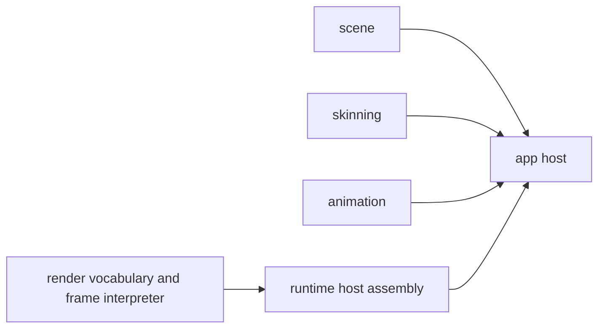

# `@forgeax/engine-runtime`

> [!IMPORTANT]
> Runtime is the sole public host-assembly entry for `createRenderer`. It selects browser/backend services, invokes render's internal construction seam, and cleans up partial construction. It does not own scene, skinning, animation, or render-domain APIs.

## Assemble producer features

The host receives a heterogeneous list of producer-owned
`RenderFeature<FrameData>` values through one `createRenderer` options bag.
Import the feature contract and render vocabulary from
`@forgeax/engine-render`; import only assembly from this package.

```ts
import { ok } from '@forgeax/engine-types';
import type { RenderFeature } from '@forgeax/engine-render';
import { createRenderer } from '@forgeax/engine-runtime';

type FrameData = { readonly visibleCount: number };
const feature = {
  identity: 'package.feature',
  extract: ({ owner }) => ok<FrameData>({ visibleCount: owner }),
  prepare: (data) => {
    void data.visibleCount;
    return ok(undefined);
  },
  contribute: (data, context) => {
    void data.visibleCount;
    context.staging.addPass('named-pass', {
      reads: [],
      writes: [],
      execute: ({ pass }) => void pass,
    }).unwrap();
    return ok(undefined);
  },
} satisfies RenderFeature<FrameData>;

const renderer = await createRenderer(canvas, { features: [feature] });
const ready = await renderer.ready;
if (!ready.ok) throw ready.error;
```

`renderer.renderFeatureDiagnostics()` is the machine-readable lifecycle
surface. Read `status` and `latestError?.code`; use `latestError?.hint` for
the next action. `failed` retries on the next frame, `disabled` is revisited
by `renderer.recover()`, and `disposed` is terminal. `dispose()` is
idempotent. A pipeline switch preserves feature registration and rebuilds the
active graph; use `renderer.registerPipeline(id, pipeline)` for that switch.

Hosts that need World- or asset-dependent setup after `renderer.ready` can call
`await renderer.installRenderFeature(feature)`. It appends the producer to the same
feature host, keeps identity/capability/error ownership unified, and is
idempotent for the same feature object. The await includes declared
material-shader prewarm before the feature can enter the host. A duplicate identity from a different
object returns `render-feature-registration-conflict`; there is no parallel
feature registry.

## Assemble prepared graphics without a private seam

Prepared graphics is still assembled by the runtime host. A producer imports
the generic `RenderFeature` declaration from `@forgeax/engine-render`, keeps
its frame data in `@forgeax/engine-vfx` (or another producer package), and
uses `context.graphics` for opaque preparation references. Generation and
recording remain render-host facts.

```ts
import { ok } from '@forgeax/engine-types';
import type { RenderFeature } from '@forgeax/engine-render';
import { createRenderer } from '@forgeax/engine-runtime';
import type { ParticleRenderBatch } from '@forgeax/engine-vfx';

const batch: ParticleRenderBatch = { batches: [] };
const feature = {
  identity: 'package.prepared-feature',
  extract: () => ok(batch),
  prepare: (_data, context) => {
    const pipeline = context.graphics.preparePipeline('package.pipeline', {
      shader: 'package.shader',
      vertexLayout: 'package.vertices',
      colorFormats: ['rgba8unorm-srgb'],
    });
    if (!pipeline.ok) return pipeline;
    void pipeline.value;
    return ok(undefined);
  },
  contribute: () => ok(undefined),
} satisfies RenderFeature<ParticleRenderBatch>;

const renderer = await createRenderer(canvas, { features: [feature] });
```

The five public terms remain distinct: `RenderFeature`, `RenderPipeline`,
RenderGraph pass, Material pass, and prepared graphics. This is a host
preparation recipe, not a visible particle draw path or a VFX production
branch. Wave 2 leaves simulation, manifest changes, RPC/CLI transport, and
private imports out of scope. See the detailed render contract in
[`packages/render/README.md`](../render/README.md), the declarations in
[`features/prepared-graphics.ts`](../render/src/features/prepared-graphics.ts), and the
producer contract in [`packages/vfx/README.md`](../vfx/README.md).

The four concepts stay separate: `RenderFeature` is a producer callback
contract, `RenderPipeline` is full frame policy, a RenderGraph pass is a
declared execution node, and a material pass is a shader-facing asset pass.
The feature API and its structured error model are documented by
[`@forgeax/engine-render`](../render/README.md); this README documents only
the runtime assembly boundary.

## Assemble a renderer

```ts
import { createRenderer } from '@forgeax/engine-runtime';

try {
  const renderer = await createRenderer(canvas);
  const ready = await renderer.ready;
  if (!ready.ok) return ready.error;
  return renderer.draw([world], { owner: 0 });
} catch (error) {
  // EngineEnvironmentError reports unusable backend/environment setup.
}
```

`createRenderer(canvas, options?, bundler?)` returns `Promise<Renderer>`. Construction failures reject with `EngineEnvironmentError`; after construction, `ready` and `draw` return `Result` values and `dispose()` is idempotent.

## Import each domain from its owner

| Need | Canonical package | Example imports |
|:--|:--|:--|
| Transforms and hierarchy | `@forgeax/engine-scene` | `Transform`, `ChildOf`, `scenePlugin` |
| Joint binding | `@forgeax/engine-skinning` | `Skin`, `resolveSkinJoints` |
| Graph playback | `@forgeax/engine-animation` | `AnimationPlayer`, `animationPlugin` |
| Render vocabulary and frame interpretation | `@forgeax/engine-render` | `Camera`, `MeshFilter`, `MeshRenderer`, `DirectionalLight`, `Materials`, `Renderer` |

```ts
import { scenePlugin, Transform } from '@forgeax/engine-scene';
import { Skin } from '@forgeax/engine-skinning';
import { animationPlugin, AnimationPlayer } from '@forgeax/engine-animation';
import { Camera, DirectionalLight, Materials, MeshFilter, MeshRenderer } from '@forgeax/engine-render';

void [scenePlugin, Transform, Skin, animationPlugin, AnimationPlayer];
void [Camera, DirectionalLight, Materials, MeshFilter, MeshRenderer];
```

> [!NOTE]
> `@forgeax/engine-runtime` is not a compatibility barrel. Importing those domain tokens from runtime is unsupported; follow the focused package README for each domain's roster, errors, and setup.

## Boundary


```mermaid
flowchart LR
  Scene["scene"] --> App["app host"]
  Skinning["skinning"] --> App
  Animation["animation"] --> App
  Render["render vocabulary and frame interpreter"] --> Runtime["runtime host assembly"]
  Runtime --> App
```

`@forgeax/engine-render` owns `Renderer`, `RendererOptions`, render components, frame stages, prepared graphics, and render errors. Runtime owns only the concrete `createRenderer` host contract and `EngineEnvironmentError`; it never re-exports the moved domain APIs.
