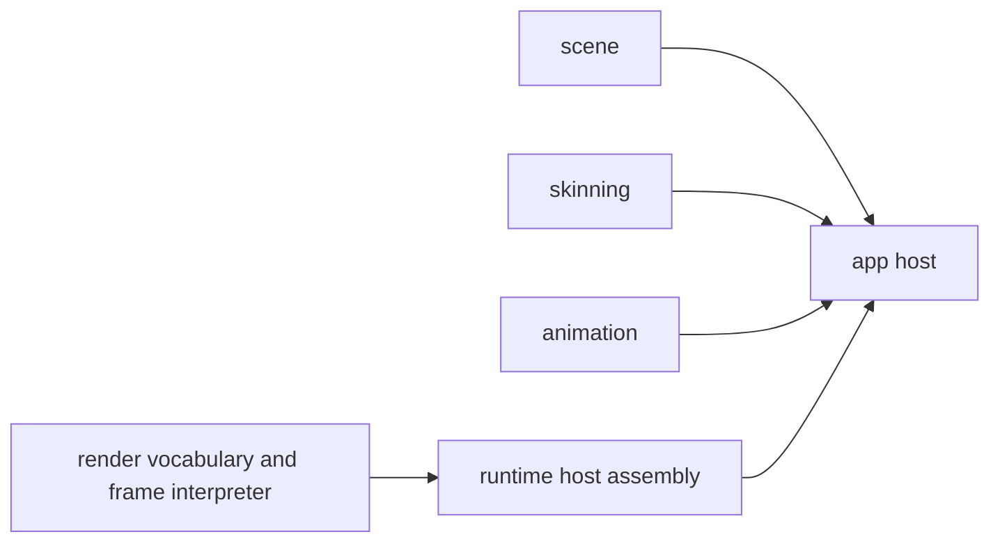

# `@forgeax/engine-runtime`

## Render happy path

`createRenderer -> attach -> draw -> inspect/observe/recover` assembles one
`RenderScene -> Standard Pipeline -> DeviceScope -> FrameReceipt`
path. `draw` returns `Result.ok(FrameReceipt)` only after the host finishes and
submits the frame. Bind observation requests to that receipt; repair the owner
named by `error.detail`, rebuild or cold-cook its source, and retry.

> [!IMPORTANT]
> Runtime is the sole public host-assembly entry for `createRenderer`. It selects browser/backend services, invokes render's internal construction seam, and cleans up partial construction. It does not own scene, skinning, animation, or render-domain APIs.

## Assemble producer features

The host receives a heterogeneous list of producer-owned
`RenderFeature<FrameData>` values through one `createRenderer` options bag.
Import the feature contract and render vocabulary from
`@forgeax/engine-render`; import only assembly from this package.

```ts
import { ok } from '@forgeax/engine-types';
import type { RenderFeature } from '@forgeax/engine-render';
import { createRenderer } from '@forgeax/engine-runtime';

type FrameData = { readonly visibleCount: number };
const feature = {
  identity: 'package.feature',
  extract: ({ owner }) => ok<FrameData>({ visibleCount: owner }),
  plan: (data, context) => {
    void data.visibleCount;
    void context;
    return ok({ resources: [], passes: [] });
  },
} satisfies RenderFeature<FrameData>;

const created = await createRenderer(canvas, { features: [feature] });
if (!created.ok) throw created.error;
const renderer = created.value;
```

`renderer.inspect()` is the machine-readable lifecycle
surface. Read `status` and `latestError?.code`; use `latestError?.hint` for
the next action. `failed` retries on the next frame, `disabled` is revisited
by `renderer.recover()`, and `disposed` is terminal. `dispose()` is
idempotent. Feature plans are fixed during host assembly; graph replacement and
last-known-good recovery stay inside the Standard host.

Prepared compute remains a render-owned projection: program reflection,
bindings, direct or indirect dispatch shape, and persistent GPU buffers become
typed graph accesses before encoding. Runtime does not open a compute pass,
submit a second command buffer, or infer fallback from a backend name. The
selected render lane must be compatible with `RhiCaps.compute`, storage, and
indirect capabilities before it reaches graph compilation.

Features are declared before host assembly. A producer returns a closed
`RenderFeaturePlan`; the host owns identity, capability, error, and lifecycle
state. The plan is the only producer execution declaration; there is no
parallel prepare/contribute route or second feature registry.

## Asset producer readiness boundary

Runtime consumes the validated Catalog and Pack/DDC projection; it does not
make a source package ready. For a missing or failed asset, the host follows
`inspect` -> producer `rebuild` or `cold-cook` -> `verify` -> retry of the same
GUID. Branch on structured asset errors and evidence details, never on console
text or a guessed file suffix.

Importer registration, source plus Meta repair, DDC persistence, receipt
creation, and Catalog publication belong to the build or dev producer host.
`createRenderer` does not add a hidden importer registry or runtime source
fallback. This keeps browser startup, player bundles, and render assembly
outside the asset authoring and cooking boundary.

## Plan execution boundary

The producer plan is compiled into the active typed graph. It declares cooked
programs, bindings, buffers, logical targets, and draw/dispatch commands; the
host derives access and owns preparation, recording, recovery, and submit.
There is no producer-side prepared-resource store and no private encoder seam.
See the detailed render contract in [`packages/render/README.md`](../render/README.md)
and the producer contract in [`packages/vfx/README.md`](../vfx/README.md).

The four concepts stay separate: `RenderFeature` is a producer callback
contract, Standard Pipeline is the single host-owned frame policy, a
RenderGraph pass is a declared execution node, and a material pass is a
shader-facing asset pass. The feature API and its structured error model are documented by
[`@forgeax/engine-render`](../render/README.md); this README documents only
the runtime assembly boundary.

## Assemble a renderer

```ts
import { createRenderer } from '@forgeax/engine-runtime';

const created = await createRenderer(canvas);
if (!created.ok) return created.error;
const renderer = created.value;
const attached = renderer.attach(world);
if (!attached.ok) return attached.error;
return renderer.draw({
  leases: [attached.value],
  camera: { lease: attached.value },
  environment: { lease: attached.value },
});
```

`createRenderer(canvas, options?, bundler?)` reports environment failures through
its structured construction error. After construction, `attach`, `draw`,
`inspect`, `observe`, and `recover` remain receipt-bound and `dispose()` is
idempotent.

### Browser backend selection and diagnosis

The default browser path prefers native WebGPU and can retry through the
`wgpu`/WebGL2 downlevel backend. Consequently, a native-channel
`adapter-unavailable` error means only that `navigator.gpu.requestAdapter()` did
not produce an adapter; it is not a verdict that the machine cannot run the
game. A thrown `requestAdapter()` failure is reported separately as
`webgpu-runtime-error` with the original name/message in `detail.error`, while a
literal `null` remains `adapter-unavailable`.

Always diagnose the final structured error rather than matching the word
“WebGPU”. Inspect `.code`, `.expected`, `.hint`, and nested backend causes. Asset,
shader, Pack, permission-policy, and application bootstrap failures belong to
their own owners and must not be repaired by replacing ForgeaX with a second
Canvas renderer or by swallowing the entry-module exception.

## Import each domain from its owner

| Need | Canonical package | Example imports |
|:--|:--|:--|
| Transforms and hierarchy | `@forgeax/engine-scene` | `Transform`, `ChildOf`, `scenePlugin` |
| Joint binding | `@forgeax/engine-skinning` | `Skin`, `resolveSkinJoints` |
| Graph playback | `@forgeax/engine-animation` | `AnimationPlayer`, `animationPlugin` |
| Render vocabulary and frame interpretation | `@forgeax/engine-render` | `Camera`, `MeshFilter`, `MeshRenderer`, `DirectionalLight`, `Materials`, `Renderer` |

```ts
import { scenePlugin, Transform } from '@forgeax/engine-scene';
import { Skin } from '@forgeax/engine-skinning';
import { animationPlugin, AnimationPlayer } from '@forgeax/engine-animation';
import { Camera, DirectionalLight, Materials, MeshFilter, MeshRenderer } from '@forgeax/engine-render';

void [scenePlugin, Transform, Skin, animationPlugin, AnimationPlayer];
void [Camera, DirectionalLight, Materials, MeshFilter, MeshRenderer];
```

> [!NOTE]
> `@forgeax/engine-runtime` is not a compatibility barrel. Importing those domain tokens from runtime is unsupported; follow the focused package README for each domain's roster, errors, and setup.

## Boundary


```mermaid
flowchart LR
  Scene["scene"] --> App["app host"]
  Skinning["skinning"] --> App
  Animation["animation"] --> App
  Render["render vocabulary and frame interpreter"] --> Runtime["runtime host assembly"]
  Runtime --> App
```

`@forgeax/engine-render` owns `Renderer`, `RendererOptions`, render components,
declarative feature plans, frame stages, and render errors. Runtime owns only
the concrete `createRenderer` host contract and `EngineEnvironmentError`; it
never re-exports the moved domain APIs.
