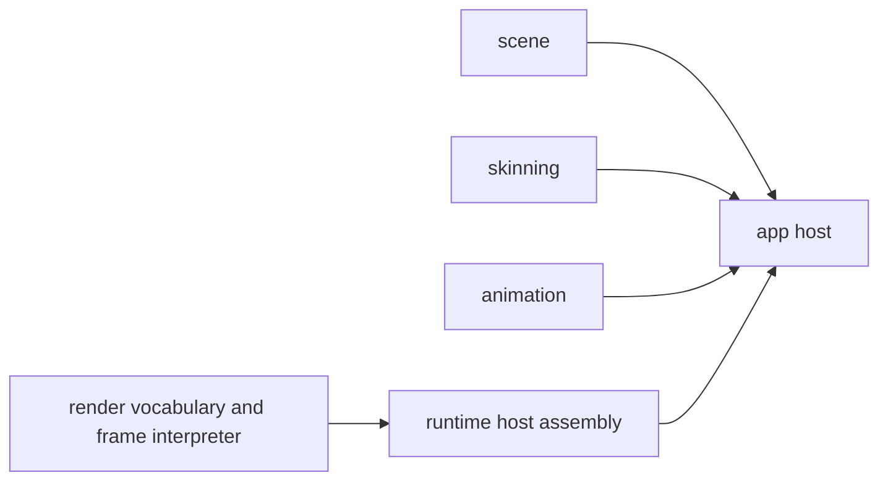

# `@forgeax/engine-runtime`

> [!IMPORTANT]
> Runtime is the sole public host-assembly entry for `createRenderer`. It selects browser/backend services, invokes render's internal construction seam, and cleans up partial construction. It does not own scene, skinning, animation, or render-domain APIs.

## Assemble a renderer

```ts
import { createRenderer } from '@forgeax/engine-runtime';

try {
  const renderer = await createRenderer(canvas);
  const ready = await renderer.ready;
  if (!ready.ok) return ready.error;
  return renderer.draw([world], { owner: 0 });
} catch (error) {
  // EngineEnvironmentError reports unusable backend/environment setup.
}
```

`createRenderer(canvas, options?, bundler?)` returns `Promise<Renderer>`. Construction failures reject with `EngineEnvironmentError`; after construction, `ready` and `draw` return `Result` values and `dispose()` is idempotent.

## Import each domain from its owner

| Need | Canonical package | Example imports |
|:--|:--|:--|
| Transforms and hierarchy | `@forgeax/engine-scene` | `Transform`, `ChildOf`, `scenePlugin` |
| Joint binding | `@forgeax/engine-skinning` | `Skin`, `resolveSkinJoints` |
| Graph playback | `@forgeax/engine-animation` | `AnimationPlayer`, `animationPlugin` |
| Render vocabulary and frame interpretation | `@forgeax/engine-render` | `Camera`, `MeshFilter`, `MeshRenderer`, `DirectionalLight`, `Materials`, `Renderer` |

```ts
import { scenePlugin, Transform } from '@forgeax/engine-scene';
import { Skin } from '@forgeax/engine-skinning';
import { animationPlugin, AnimationPlayer } from '@forgeax/engine-animation';
import { Camera, DirectionalLight, Materials, MeshFilter, MeshRenderer } from '@forgeax/engine-render';

void [scenePlugin, Transform, Skin, animationPlugin, AnimationPlayer];
void [Camera, DirectionalLight, Materials, MeshFilter, MeshRenderer];
```

> [!NOTE]
> `@forgeax/engine-runtime` is not a compatibility barrel. Importing those domain tokens from runtime is unsupported; follow the focused package README for each domain's roster, errors, and setup.

## Boundary


```mermaid
flowchart LR
  Scene["scene"] --> App["app host"]
  Skinning["skinning"] --> App
  Animation["animation"] --> App
  Render["render vocabulary and frame interpreter"] --> Runtime["runtime host assembly"]
  Runtime --> App
```

`@forgeax/engine-render` owns `Renderer`, `RendererOptions`, render components, frame stages, and render errors. Runtime owns only the concrete `createRenderer` host contract and `EngineEnvironmentError`; it never re-exports the moved domain APIs.
