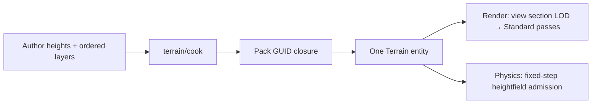

# Terrain

> [!IMPORTANT]
> Landscape foundation uses a finite XZ heightfield in metres, with Y up. `Terrain` uses an ordinary Scene Transform. The foundation admits translation, identity rotation and unit scale; physics requires a static `RigidBody`.

`@forgeax/engine/terrain` owns the component and pure kernels. `@forgeax/engine/terrain/cook` builds ordinary Pack outputs. Renderer submission and Rapier state remain with their existing owners.

## Source and cooking

| Fact | Contract |
|:--|:--|
| Samples | `columns × rows` finite `Float32Array`, X-fast row-major, no holes |
| Subsection | Power-of-two 2–128 vertices; each axis contains complete `vertices − 1` quad subsections |
| Weights | Sample-major, one value for every ordered author layer; values in [0,1], nonzero weight group sums to one |
| Layers | Weight, height-adjusted weight, then ordered alpha composition; zero weight uses Standard defaults |
| Active budget | Ordinary controls: at most four active layers per subsection; ID controls: 1–32 original author layers with at most three candidates per fine control triangle |
| Height | RG packs globally scaled unsigned 16-bit samples; BA stores the source slope normal; complete section-addressed mips |
| Bounds | Independent conservative source min/max, never averaged height mip bounds |
| Topology | Every cell uses the 10→01 diagonal, shared by mesh indices, gameplay query and real Rapier |
| Material | Default Standard base color/opacity, tangent normal, metallic, roughness, emissive and occlusion channels |
| Closure budget | Source ≤4,194,304 samples; source textures ≤1024 per axis; derived layer arrays ≤128 MiB |

`cookTerrain(source)` derives height and weight textures without identities. `buildTerrainAssets(source, guidForSourceKey, assetsByGuid)` also derives grid meshes, layer arrays and section materials, returning a Pack output map. The containing Pack supplies stable source keys and GUID derivation. Its complete read closure remains explicit.

`terrainDerivedLayoutValid` validates the complete ordered subsection roster and shared grids. Loader and inline Catalog admission use this same layout contract. Cooking samples the author grid directly, avoiding a decimal-spacing world/sample round trip.

Admission validates each canonical LOD grid, height/normal mip and control byte, author bounds and the section material height/control bindings before exposing a candidate. A partial same-GUID rewrite cannot repin an existing root.

Section materials use the ordinary Standard module with the Terrain surface slot and three canonical forward/deferred/shadow passes. The material cooker selects Terrain geometry from resolved passes, including inherited materials. Altered programs or pass rosters cannot enter a Terrain closure.

The foundation source texture adapter accepts resident RGBA8 2D data. HDR Standard channels are packed as binary16. Unsupported shader/pass, physical-layer or coordinate extensions fail during cooking. Build tools may first import/decompress a texture through its existing owner; runtime never imports source files or compiles WGSL.

`terrainHeightBounds(min, max, heightRange)` derives conservative GPU geometry bounds from the packed-height half-step and f32 decode/morph rounding. Input validation rejects spacing, extents and derived bounds that cannot be represented by finite f32 values. Author extrema remain author facts.

## Optional material ID specialization

`cookTerrain(source, { kind: 'ids', maxWeightError: 0.001 })` and the fourth argument of `buildTerrainAssets` select a Cook policy. Painting still supplies complete `TerrainSource.layers` and sample-major weights. The default policy is `{ kind: 'weights' }`, preserving height blending and ordered alpha. `TerrainAsset.materialEncoding` records the accepted derived policy; old inline assets must declare the ordinary policy explicitly.

| Fact | ID contract |
|:--|:--|
| Eligible input | Pure weight layers; every weight group nonzero and normalized, or the entire field zero |
| Rejection | Height/alpha, mixed zero coverage, invalid budget or loss beyond budget; no silent fallback |
| Control | RGBA8unorm mip0: R bottom author ID, G top author ID, BA unsigned 16-bit top weight; 255 is the Standard default |
| Repair | Fixed 10→01 triangles; retain bottom IDs and remove top candidates deterministically until each triangle has at most three IDs |
| Edges | Repair one global author-resolution grid before copying shared subsection nodes |
| Sampling | Three discrete `textureLoad` controls, aggregate three candidate weights, explicit-gradient material array sampling |
| Arrays | One global Standard array set indexed by original author ID; the existing 128 MiB array budget remains |
| LOD | Material control remains at mip0 independently of geometry LOD; height retains all canonical mips |

The explicit budget is total variation between the complete author bilinear weight field and decoded triangle weights, before material evaluation. For each original source cell, admission uses

$$E_{cell} \leq \max(E_{corner}) + \frac{1}{4}\operatorname{TV}(w_{00}-w_{10}-w_{01}+w_{11}),$$

capped by the general nonnegative-vector bound. This includes top-two removal, triangle repair, quantization and the bilinear-to-triangle cross term. It bounds every fine-cell point. It is not a pixel, normal or BRDF quality bound; material-specific image tests remain necessary. No coarse ID mip is published with an unproved author-field bound.

The four Standard arrays mean up to twelve material texture samples plus three control loads per fragment, rather than a claim of reproducing Delta Force's reported nine-sample material. Controls remain four bytes per texel, equal to the ordinary four-channel control. Omitting unused control mips and sharing layer arrays produce separate, measurable savings. Runtime roots still retain the complete author height/weight arrays; this feature does not claim a fully compact runtime asset, dynamic array residency or virtual texturing.

Canonical closure admission re-derives controls and verifies source-array bytes. Within one admission it checks a shared array's bytes once, while each section still validates its material, sampler, control and array descriptors. Invalid candidates cannot publish a partially changed root.

See [material ID implementation and verification](docs/material-id/implementation.md).

## Runtime and queries

The owning plugin registers `Terrain` in `World.components` through its ordinary component lease; a directly constructed World uses `world.components.register(Terrain).unwrap()`. One entity retains the Catalog-adopted root TerrainAsset. Catalog closure validity and cooked material Ready publication are both required before rendering. Render expands a view-local section draw roster, selects continuous screen-size LOD and clamps to resident levels. Adjacent edges use the coarser of their two LODs. The shared kernel morphs XZ and decoded height using `2^k − 1` normalization; Standard color, GBuffer, depth, temporal and shadow use the same surface coordinates.

`terrainHeight(source, x, z)` queries author triangles. It returns `undefined` outside the source; it is not a display-height query. `terrainHeightfield(source)` converts author samples to the backend's column-major rectangular matrix.

`querySubmittedTerrainHeight(receipt, { worldId, entity, x, z, view?, expectedAsset? })` from `@forgeax/engine/render` reconstructs the canonical quantized, morphed triangles identified by the completed receipt. Multiple composed views require an explicit view key. It fails for unissued, failed, pending, stale-generation or expired receipts and for terrain that was not drawn. `expectedAsset` optionally fences the exact ECS root handle, including held views after replacement. Each Renderer retains eight terrain receipts, with owned CPU height bytes and no backend resources. Held views retain their previously drawn surface. LOD/mip/revision changes reject temporal deformation history and mark reactive coverage.

The receipt binds exact source bytes, triangle indices, LOD, neighbors and translation. The returned number is a canonical f32 reconstruction, not a bit-identical GPU readback: WGSL permits floating point reassociation and fusion. The height decoder restores the integer RG16 code and anchors at the nearer height endpoint; LOD grids, mip indices and edge membership use integer operations. Small-coordinate height gates retain the `1e-5 m` threshold. Large-coordinate tests account separately for local arithmetic and world f32 rounding; quantization is a separate author-to-render error.

The 3D physics sync phase admits `Terrain + RigidBody(static)` through the existing derived-shape candidate transaction. Read `PhysicsWorld.getDerivedPublication(entity)` after a positive fixed step before releasing gameplay that depends on collision. Rejected input preserves the prior physical publication. Rendering and collision have separate readiness; a common author source does not imply equal coarse-render and collision heights.

## Replacement and gameplay readiness

Catalog changes invalidate the old publication before asynchronous loading completes. During that interval Render omits the old source from new extraction; completed receipt snapshots remain bounded by their ordinary lifetime. A loaded root with no Catalog identity remains an error. The scene freezes terrain-dependent gameplay until the new root has both a positive fixed-step collision publication and a completed submitted query with its exact handle. Frame scheduling continues so these owners can become ready.

The terrain scene connects the existing CatalogSource hot subscription explicitly. It acquires a shared-reference grant before rebinding, even when retrying the same root. Old load/query callbacks cannot release a newer replacement gate. A structured `frame-submit-rejected` records that queue acceptance did not occur; it does not issue a successful FrameReceipt.

## Boundaries

> [!NOTE]
> The foundation is a bounded closure, not world streaming. CDLOD, virtual-texture page pools, biome streaming and holes require their own measured admission; they are not enabled by this package.

Pure kernels and compiler gates accompany the implementation. Real backend, browser pack-fetch, visual, timing, recovery and RHI Debug evidence belongs to the terrain scene and delivery report. Passing a pure-kernel test alone does not establish rendering acceptance.

[Implementation, runtime evidence and performance boundaries](docs/landscape/implementation.md).
