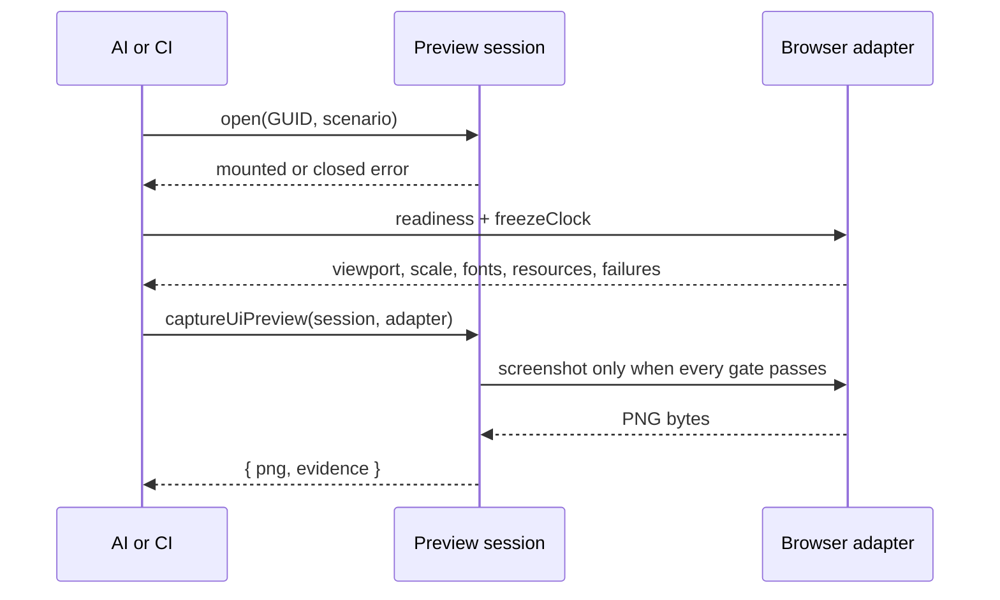
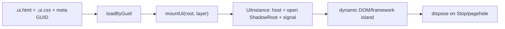

# `@forgeax/engine-ui`

Browser UI is an asset plus a small behavior island. Authors keep stable HTML/CSS and private companions in a `.ui.html` package; game code supplies dynamic text, template clones, input and lifecycle.

> [!IMPORTANT]
> `engine-ui` is browser-only. A headless consumer can validate/import the asset, but must not call `mountUi` without a DOM.

## Shortest recipe

Headless validation is available without a DOM:

```ts
import { validateUiAuthoring } from '@forgeax/engine-ui/authoring';

const checked = await validateUiAuthoring({ sourcePath: 'hud.ui.html', html, css });
if (!checked.ok) return emitJson(checked.error.detail.diagnostics);
```

Use `checked.value.category` (`native`, `normalizable`, or `runtime-bound`) and `checked.value.diagnostics` as the machine-readable authoring result. The source strings are returned byte-for-byte unchanged.

```ts
import { mountUi } from '@forgeax/engine-ui';

const loaded = assets.loadByGuid<UiAsset>(HUD_GUID);
if (!loaded.ok) return report(loaded.error);
const mounted = mountUi(loaded.value, { root: ctx.uiRoot, layer: 60 });
if (!mounted.ok) return report(mounted.error);
ctx.registerCleanup?.(() => mounted.value.dispose());
```

## Preview and deterministic capture

The public preview seam keeps browser-only work behind `@forgeax/engine-ui/preview`:

```ts
import {
  captureUiPreview,
  createDomPartScenario,
  createUiPreviewSession,
} from '@forgeax/engine-ui/preview';

const session = createUiPreviewSession({
  guid: HUD_GUID,
  assets,
  root: previewRoot,
  rect: { width: 320, height: 180 },
  scenario: createDomPartScenario({ requiredParts: ['root', 'score'] }),
});
const opened = await session.open();
if (!opened.ok) return recover(opened.error.code, opened.error.hint);
const captured = await captureUiPreview(session, browserAdapter);
if (!captured.ok) return recover(captured.error.code, captured.error.detail);
await writePng(captured.value.png);
await writeJson(captured.value.evidence);
```

When subscribing to asset changes, await the listener result. A subscribed target refresh that
rebuilds an invalid revision returns structured `preview-load-failed`; read
`error.detail.diagnostics` for each source path/range and repair hint, then call
`session.retry()` after fixing the source. Do not parse `message`.



The adapter must report `viewport`, `deviceScale`, `fonts`, `resources`, `scenario`, and `clock` as true, with empty `console`, `page`, and `request` failure arrays. Its `screenshot` seam should return the actual mounted host screenshot from the browser compositor, not a fixture byte string. `evidence` records the frozen clock, discovered `data-ui-part` names, DOM host count, focus, resource failures, and lifecycle state. Keep the PNG and evidence together; the image is visual context, while the JSON is the functional authority.

| Capture code | Recovery action |
| --- | --- |
| `capture-not-ready` | Read `error.detail.unmet`, satisfy each named gate, then retry in the same fixed browser. A failed result never has `png`. |
| `capture-failed` | Read `error.detail.stage`, repair the adapter's screenshot capability, and retry. |
| `preview-scenario-missing-part` | Restore the declared `data-ui-part` and call `retry()` or rebuild the session. |
| `preview-load-failed` | Inspect `error.detail.diagnostics` for source-located repair hints, fix the target source, then call `retry()`. |

> [!WARNING]
> Do not treat a screenshot as proof that fonts, companions, focus, or disposal succeeded. Do not parse `message`, mount a fallback into `document.body`, or replace a missing companion with a stand-in asset.



## Authoring and resources

### Profile and diagnostics

The versioned profile is exported as `UI_AUTHORING_PROFILE` and described by [`src/authoring/profile.schema.json`](src/authoring/profile.schema.json). Classification precedence is `runtime-bound` then `normalizable` then `native`; quality findings remain warnings and do not change an otherwise accepted result.

Blocking diagnostics use the shared import shape: `code`, `severity`, `sourcePath`, `sourceRange`, `rule`, `expected`, `actual`, `hint`, and optional `relatedLocations`. Branch on `error.code === 'source-validation-failed'` and inspect `error.detail.diagnostics`; do not parse error messages.

Normalizable surfaces (inline style, global selectors, root or parent URLs, generated classes) are reported without changing source. Runtime-bound surfaces (scripts, inline handlers, remote URLs, CSS imports, and CSS-in-JS markers) must be moved to a consumer-side framework island.

The `.ui.html` file is the stable structure. The importer pairs its same-name CSS and records relative image/font reads as private companions. The manifest owns exactly one public GUID; companions do not receive consumer GUIDs. Keep author sources in the assets submodule, not in a template's `assets/ui` directory.

| Concern | Owner |
| --- | --- |
| HTML, CSS, companion URLs | UI author package |
| GUID and build transport | pack/import pipeline |
| dynamic text, events, template clones | game module |
| mount/dispose and ShadowRoot | `engine-ui` |
| run root and cleanup order | host (`apps/preview`) |

## Dynamic nodes and framework seam

Use ordinary DOM APIs inside the open shadow root. A popup can be cloned from a `<template data-ui-template>` and removed through `UiInstance.signal`. Frameworks may mount an island into an element that the asset exposes; the caller owns `createRoot`, `unmount`, and any portal target. The package does not ship React/Vue/Svelte adapters or claim framework certification.

```ts
const island = instance.host.shadowRoot?.querySelector('[data-framework-island]');
if (island) {
  const root = createRoot(island);
  instance.signal.addEventListener('abort', () => root.unmount(), { once: true });
}
```

## Input, modal and lifecycle

Interactive asset elements opt in with `pointer-events: auto`. The input package decides UI ownership from `event.composedPath()` and clears held state when ownership changes, focus leaves the window, or the run is stopped. A single settings modal owns its own inert backdrop, focus trap, <kbd>Escape</kbd> close, and focus restore. Settings in the default template are memory-only for the current run; no `localStorage` authority is implied.

`dispose()` is idempotent: it aborts `signal`, removes listeners and then removes the host. Hosts should dispose instances in reverse registration order and remove the run-scoped `uiRoot` on Stop/pagehide.

## Errors and prohibited fallbacks

Handle `UiError` by its closed `code` union and machine-readable `detail`; do not parse message strings. Do not silently mount to `document.body`, create a second UI manager, inject stable markup from TS, or hide a missing asset behind an empty root.

The independent Gallery/Preview Workbench, scenario matrix, visual baseline workflow, external design adapters, AI iteration workbench, and editor Content Browser integration belong to the follow-up design: [`2026-07-21-html-css-ui-authoring-workflow-ecosystem-design.md`](../../docs/specs/2026-07-21-html-css-ui-authoring-workflow-ecosystem-design.md).
