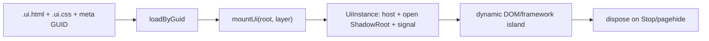

# `@forgeax/engine-ui`

Browser UI is an asset plus a small behavior island. Authors keep stable HTML/CSS and private companions in a `.ui.html` package; game code supplies dynamic text, template clones, input and lifecycle.

> [!IMPORTANT]
> `engine-ui` is browser-only. A headless consumer can validate/import the asset, but must not call `mountUi` without a DOM.

## Shortest recipe

```ts
import { mountUi } from '@forgeax/engine-ui';

const loaded = assets.loadByGuid<UiAsset>(HUD_GUID);
if (!loaded.ok) return report(loaded.error);
const mounted = mountUi(loaded.value, { root: ctx.uiRoot, layer: 60 });
if (!mounted.ok) return report(mounted.error);
ctx.registerCleanup?.(() => mounted.value.dispose());
```



## Authoring and resources

The `.ui.html` file is the stable structure. The importer pairs its same-name CSS and records relative image/font reads as private companions. The manifest owns exactly one public GUID; companions do not receive consumer GUIDs. Keep author sources in the assets submodule, not in a template's `assets/ui` directory.

| Concern | Owner |
| --- | --- |
| HTML, CSS, companion URLs | UI author package |
| GUID and build transport | pack/import pipeline |
| dynamic text, events, template clones | game module |
| mount/dispose and ShadowRoot | `engine-ui` |
| run root and cleanup order | host (`apps/preview`) |

## Dynamic nodes and framework seam

Use ordinary DOM APIs inside the open shadow root. A popup can be cloned from a `<template data-ui-template>` and removed through `UiInstance.signal`. Frameworks may mount an island into an element that the asset exposes; the caller owns `createRoot`, `unmount`, and any portal target. The package does not ship React/Vue/Svelte adapters or claim framework certification.

```ts
const island = instance.host.shadowRoot?.querySelector('[data-framework-island]');
if (island) {
  const root = createRoot(island);
  instance.signal.addEventListener('abort', () => root.unmount(), { once: true });
}
```

## Input, modal and lifecycle

Interactive asset elements opt in with `pointer-events: auto`. The input package decides UI ownership from `event.composedPath()` and clears held state when ownership changes, focus leaves the window, or the run is stopped. A single settings modal owns its own inert backdrop, focus trap, <kbd>Escape</kbd> close, and focus restore. Settings in the default template are memory-only for the current run; no `localStorage` authority is implied.

`dispose()` is idempotent: it aborts `signal`, removes listeners and then removes the host. Hosts should dispose instances in reverse registration order and remove the run-scoped `uiRoot` on Stop/pagehide.

## Errors and prohibited fallbacks

Handle `UiError` by its closed `code` union and machine-readable `detail`; do not parse message strings. Do not silently mount to `document.body`, create a second UI manager, inject stable markup from TS, or hide a missing asset behind an empty root.

The independent Gallery/Preview Workbench, scenario matrix, visual baseline workflow, external design adapters, AI iteration workbench, and editor Content Browser integration belong to the follow-up design: [`2026-07-21-html-css-ui-authoring-workflow-ecosystem-design.md`](../../docs/specs/2026-07-21-html-css-ui-authoring-workflow-ecosystem-design.md).
