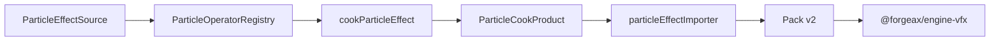
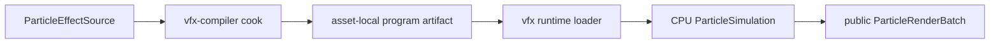

# @forgeax/engine-vfx-compiler

> [!IMPORTANT]
> `@forgeax/engine-vfx-compiler` is the build-time VFX boundary. It validates
> authoring source, resolves public operator definitions, derives deterministic
> runtime assets, and emits the generic Importer product. It must never be
> imported by a player bundle.


## Start here



The smallest build-time path uses the public compiler entry and the runtime
source contract:

```ts
import {
  defineParticleEffectSource,
  type ParticleEffectSource,
} from '@forgeax/engine-vfx';
import { ok } from '@forgeax/engine-types';
import {
  type ParticleOperatorDefinition,
  type ParticleOperatorStage,
  ParticleOperatorRegistry,
  cookParticleEffect,
} from '@forgeax/engine-vfx-compiler';

const materialGuid = '019e2cc6-0c86-79da-aa76-b0984c86d45d';
const definition = (stage: ParticleOperatorStage, kind: string): ParticleOperatorDefinition => ({
  stage,
  kind,
  version: 1,
  parameterSchema: {},
  validateParams: () => ok(undefined),
  compile: { cpu: (params) => ({ stage, kind, params }) },
});
const operators = new ParticleOperatorRegistry([
  definition('spawn', 'spawn-rate'),
  definition('initialize', 'set-life'),
  definition('update', 'gravity'),
  definition('output', 'billboard'),
]);

const source: ParticleEffectSource = {
  schemaVersion: 1,
  emitters: [{
    id: 'spark',
    capacity: 32,
    space: 'world',
    schedule: { rate: 4, bursts: [] },
    bounds: { min: [-1, -1, -1], max: [1, 1, 1] },
    backendPolicy: { kind: 'required', backend: 'cpu' },
    operators: {
      spawn: [{ kind: 'spawn-rate', version: 1, params: {} }],
      initialize: [{ kind: 'set-life', version: 1, params: {} }],
      update: [{ kind: 'gravity', version: 1, params: {} }],
      output: [{ kind: 'billboard', version: 1, params: {} }],
    },
    output: { kind: 'billboard', material: materialGuid },
  }],
};

const defined = defineParticleEffectSource(source);
if (!defined.ok) {
  console.error(defined.error.code, defined.error.hint);
  return;
}

const cooked = cookParticleEffect(defined.value, operators);
if (!cooked.ok) {
  console.error(cooked.error.code, cooked.error.hint);
  return;
}

const { asset, refs, program, outputDigest } = cooked.value;
```

`operators` is a host-configured `ParticleOperatorRegistry` containing
definitions for every source operator. Registration is definition-driven:
adding an operator does not require a switch in the cook algorithm, loader, or
batch consumer.

## Public surface

| Layer | Public symbols | Purpose |
|:--|:--|:--|
| Registry | `ParticleOperatorRegistry`, `ParticleOperatorDefinition` | Register, resolve, list, and plan backend compilers |
| Cook | `cookParticleEffect`, `ParticleCookProduct`, `ParticleCookError` | Validate, compile, derive asset, refs, program, and digest |
| Canonical bytes | `canonicalizeParticleProgram`, `ParticleProgramArtifact` | Stable program format and byte output |
| Import | `particleEffectImporter`, `PARTICLE_EFFECT_IMPORTER_KEY` | Adapt cooked output to the generic Importer protocol |
| Errors | `VfxError`, `ParticleOperatorRegistryError` | Shared closed VFX failures plus registry-specific details |

The compiler re-exports the VFX error vocabulary so a consumer can handle
`ParticleCookError` from this package without discovering a second error
model. The runtime package remains the owner of loading and ECS intent.

## Compiler/runtime isolation

The compiler is a build-time producer of the asset-local program; it is not a
runtime simulation dependency. The player path loads the validated runtime
projection through `@forgeax/engine-vfx`, then the CPU simulation reads that
projection from the host-owned ready asset. No runtime code imports this
package, evaluates compiler definitions, or falls back to raw source.

The compiler must never be imported by a player bundle.



The diagram describes a one-way producer/consumer boundary. The surrounding
prose is the same contract: compiler code stays out of player bundles, runtime
simulation stays out of this package, and Rendering consumes only the public
batch. This preserves one program authority without adding a compiler/runtime
compatibility shim.

## Deterministic cook contract

The compiler performs these steps in order:

1. validate and normalize the source through the public VFX source contract;
2. resolve every operator by stage, kind, and version;
3. validate parameters and resolve every declared backend compiler;
4. derive emitter definitions, deduplicated GUID refs, backend plans, and
   canonical program bytes;
5. return one `ParticleCookProduct` with an output digest.

The source is the only authoring SSOT. Registry insertion order, cache state, and
DDC hit or miss must not change the asset payload, refs, program bytes, or
digest. The `particle-effect/program.json` descriptor is asset-local; the
compiler does not create a package-global artifact ledger.

## Operator and backend recovery

Expected failures are `Result` values. Switch on `error.code`; never parse
`message`.

| Code family | Machine detail | Recovery |
|:--|:--|:--|
| `vfx-source-invalid` | source path and optional emitter | Repair the source against the JSON Schema |
| `vfx-operator-unknown` | stage, kind, version, emitter | Register the missing definition |
| `vfx-operator-conflict` | duplicate definition key | Remove the duplicate or choose a new version |
| `vfx-operator-params-invalid` | definition-owned parameter path | Repair the operator parameters |
| `vfx-operator-backend-unsupported` | missing emitter/operator/backend | Add the compiler or change the explicit policy |
| `source-validation-failed` | Importer diagnostics | Repair the source and rerun the Importer |

A required backend is never silently disabled or replaced. A preferred GPU
policy with CPU fallback only succeeds when both declared compiler paths are
present. The declared backend contract is capability data; this Wave does not
claim that a live GPU particle backend exists.

## Importer and Pack v2 handoff

`particleEffectImporter(registry)` implements the existing generic Importer
protocol. It reads source bytes, validates JSON, calls `cookParticleEffect`,
and emits:

- the declared GUID and `kind: 'particle-effect'`;
- the cooked `ParticleEffectAsset` payload;
- deduplicated `AssetRef` GUIDs for material and mesh outputs;
- the asset-local canonical program artifact.

Pack, catalog, cook receipts, package URLs, artifact verification, and runtime
readiness stay owned by the shared asset-cook v2 and AssetRegistry contracts.
The compiler does not guess URLs, parse suffixes, or add a VFX transport.

## Runtime boundary and Wave 1 scope

> [!WARNING]
> This package is build-time only. Keep it out of runtime dependency graphs and
> shipped player bundles.

The corresponding runtime package owns `ParticleEffectPlayer`, the opt-in
CPU-only `ParticleSimulation` plugin, FixedUpdate lifecycle, structured
observations, and `ParticleRenderBatch` production. This compiler only creates
the validated asset-local input for that path; it does not own World resources,
player lifecycle, output handles, or Rendering integration.

Delivered:

- definition-driven validation and deterministic cook;
- backend policy planning and structured failure;
- generic Importer integration;
- canonical asset-local program bytes and output digest;
- public declarations for AI consumers.

Not delivered:

- World, Renderer, Device, RHI execution, simulation, live particles, or draw;
- RenderGraph, RenderFeature, `vfxPlugin`, editor, HMR, preview, or gameplay;
- a runtime compiler, raw-source fallback, v1 package-global artifact path, or
  VFX-specific transport.

The public `RenderFeature<ParticleRenderBatch>` compatibility check is a
later Wave 1 Gate after the parallel RenderFeature loop merges. The Gate may
use a neutral test-only adapter; this compiler must not implement or import the
production RenderFeature seam.

<details>
<summary>Deep links</summary>

- [Public entry](./src/index.ts)
- [Canonicalizer](./src/canonicalize.ts)
- [Cook implementation](./src/cook.ts)
- [Importer adapter](./src/importer.ts)
- [Operator registry](./src/operator-registry.ts)
- [Runtime contract](../vfx/README.md)
- [Source schema](../vfx/schema/particle-effect-source.schema.json)
- [Pack v2 contract](../pack/README.md)
- [Feature plan and AC mapping](../../.forgeax-harness/forgeax-loop/feat-20260728-wave1-vfx-contract-and-asset-cook/plan-strategy.md)

</details>
